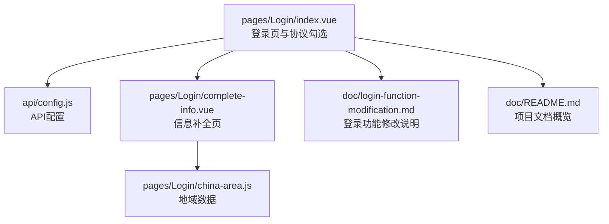
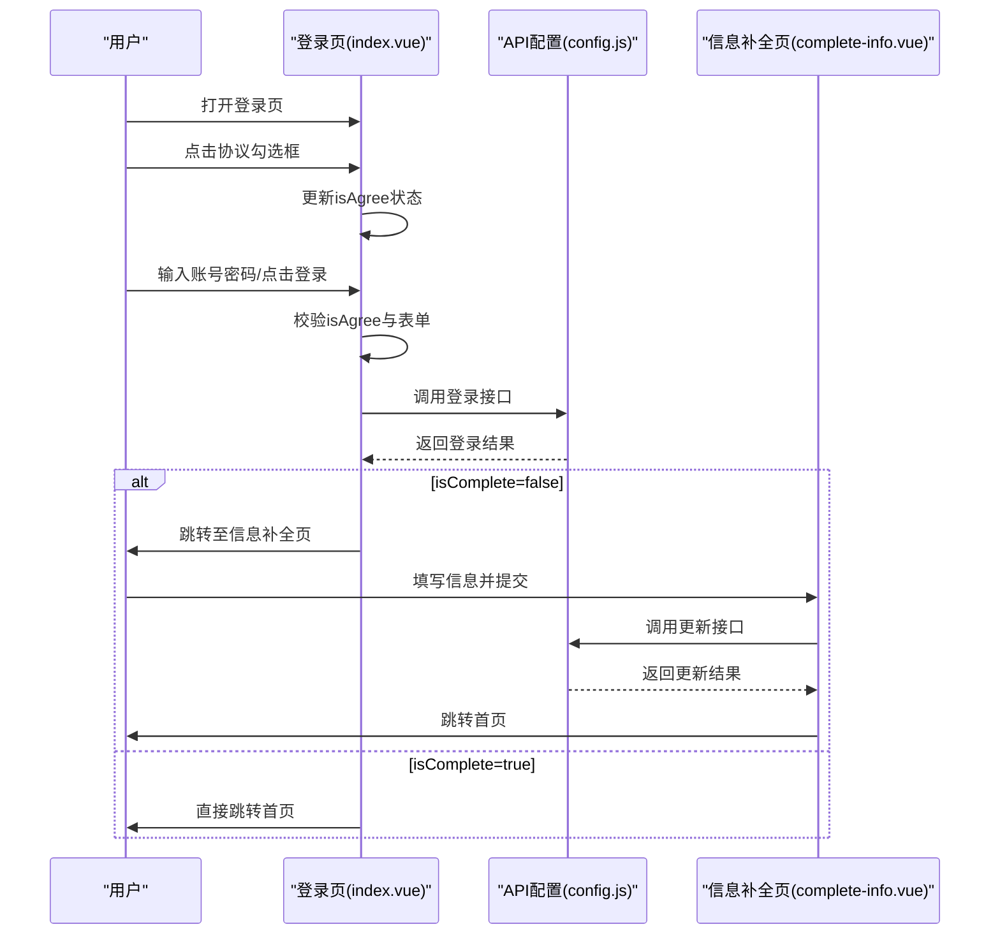
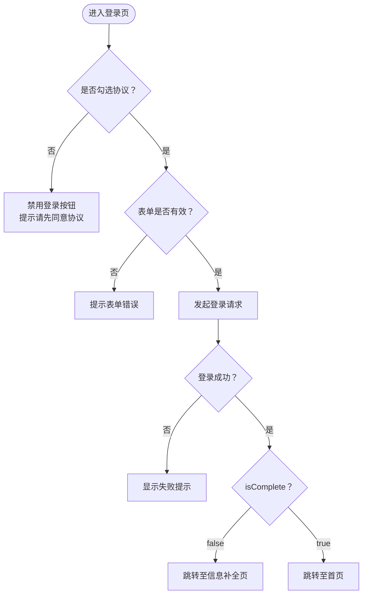
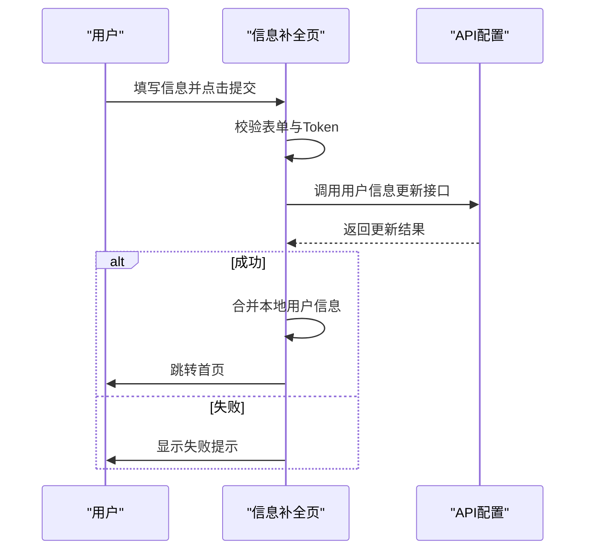
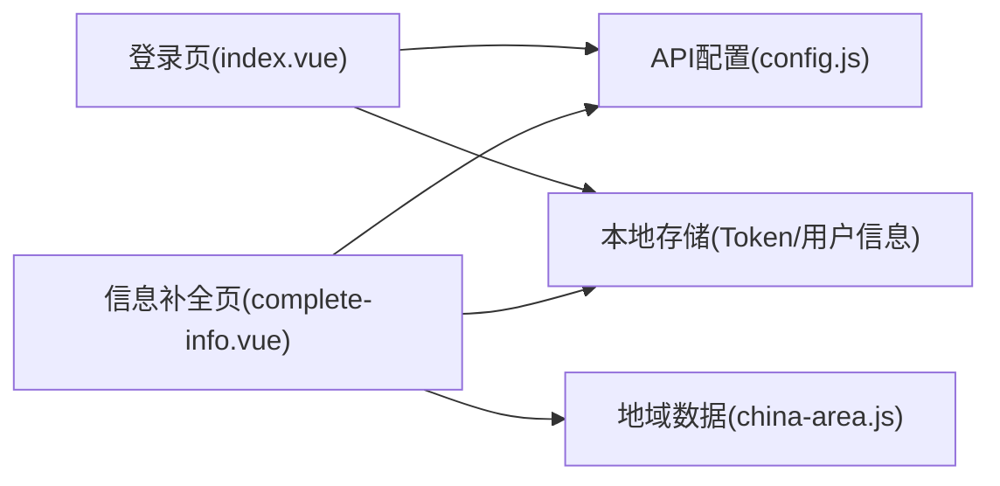

# 用户协议处理

<cite>
**本文引用的文件**
- [pages/Login/index.vue](file://pages/Login/index.vue)
- [pages/Login/complete-info.vue](file://pages/Login/complete-info.vue)
- [api/config.js](file://api/config.js)
- [pages/Login/china-area.js](file://pages/Login/china-area.js)
- [doc/login-function-modification.md](file://doc/login-function-modification.md)
- [doc/README.md](file://doc/README.md)
</cite>

## 目录
1. [简介](#简介)
2. [项目结构](#项目结构)
3. [核心组件](#核心组件)
4. [架构总览](#架构总览)
5. [详细组件分析](#详细组件分析)
6. [依赖关系分析](#依赖关系分析)
7. [性能考量](#性能考量)
8. [故障排除指南](#故障排除指南)
9. [结论](#结论)
10. [附录](#附录)

## 简介
本文件围绕致良知教育项目的“用户协议处理”功能，系统梳理并解释用户协议同意机制的实现方式，包括协议勾选状态管理、同意条件验证、用户体验优化策略；详细说明协议文本的展示方式、高亮显示与点击跳转；阐述协议处理在不同登录方式中的作用与重要性，以及登录按钮的启用/禁用逻辑；提供具体的状态管理、事件处理与界面更新机制说明；最后解释用户协议的法律意义与项目合规要求。

## 项目结构
登录与协议处理相关的关键文件位于 pages/Login 目录，配合 API 配置与辅助数据文件，形成完整的登录与信息补全流程。

图表来源
- [pages/Login/index.vue:1-100](file://pages/Login/index.vue#L1-L100)
- [api/config.js:1-60](file://api/config.js#L1-L60)
- [pages/Login/complete-info.vue:1-100](file://pages/Login/complete-info.vue#L1-L100)
- [pages/Login/china-area.js:1-33](file://pages/Login/china-area.js#L1-L33)
- [doc/login-function-modification.md:1-230](file://doc/login-function-modification.md#L1-L230)
- [doc/README.md:1-259](file://doc/README.md#L1-L259)

章节来源
- [doc/README.md:98-119](file://doc/README.md#L98-L119)

## 核心组件
- 登录页（index.vue）
  - 协议勾选状态：isAgree（布尔值），用于控制登录按钮可用性与提示逻辑
  - 协议文本展示：包含“用户协议”和“隐私政策”的高亮文本，点击分别触发提示
  - 登录按钮启用/禁用：绑定到 computed 的 isFormValid 与 isAgree
  - 登录流程：账号密码登录与微信登录均需满足 isAgree 条件
- 信息补全页（complete-info.vue）
  - 表单验证：手机号、性别、生日必填
  - 提交流程：携带 Token 调用更新接口，成功后更新本地缓存并跳转首页
- API 配置（api/config.js）
  - 提供登录、微信登录、用户信息更新等接口路径
- 地域数据（china-area.js）
  - 为信息补全页提供省市区数据，支持搜索与选择

章节来源
- [pages/Login/index.vue:141-184](file://pages/Login/index.vue#L141-L184)
- [pages/Login/index.vue:167-175](file://pages/Login/index.vue#L167-L175)
- [pages/Login/index.vue:186-301](file://pages/Login/index.vue#L186-L301)
- [pages/Login/index.vue:445-451](file://pages/Login/index.vue#L445-L451)
- [pages/Login/complete-info.vue:143-179](file://pages/Login/complete-info.vue#L143-L179)
- [pages/Login/complete-info.vue:296-347](file://pages/Login/complete-info.vue#L296-L347)
- [api/config.js:15-57](file://api/config.js#L15-L57)
- [pages/Login/china-area.js:1-33](file://pages/Login/china-area.js#L1-L33)

## 架构总览
登录与协议处理的整体流程如下：用户在登录页勾选同意协议，随后进行账号密码或微信登录；登录成功后根据 isComplete 决定是否跳转至信息补全页；信息补全完成后更新用户信息并跳转首页。

图表来源
- [pages/Login/index.vue:186-301](file://pages/Login/index.vue#L186-L301)
- [pages/Login/index.vue:226-260](file://pages/Login/index.vue#L226-L260)
- [pages/Login/complete-info.vue:296-347](file://pages/Login/complete-info.vue#L296-L347)
- [api/config.js:15-57](file://api/config.js#L15-L57)

## 详细组件分析

### 登录页（index.vue）——协议勾选与登录流程
- 协议勾选状态管理
  - 数据属性：isAgree（布尔值），初始为 false
  - 事件处理：toggleAgree 切换 isAgree
  - 视觉反馈：勾选框根据 isAgree 类名变化，显示对勾
- 协议文本展示与点击跳转
  - 文本包含“用户协议”和“隐私政策”，均为高亮文本
  - 点击分别触发 showAgreement 与 showPrivacy，当前实现为 Toast 提示
- 登录按钮启用/禁用逻辑
  - 绑定 disabled 到 computed 的 isFormValid 与 isAgree
  - 当表单为空或未勾选协议时，按钮禁用
- 登录流程
  - handleLogin：若未勾选协议则提示并终止；否则校验表单并通过 uni.request 发起登录请求
  - wechatLogin：同样需要 isAgree 为真，否则提示并终止
  - 登录成功后根据 isComplete 决定跳转路径（信息补全或首页）

图表来源
- [pages/Login/index.vue:182-184](file://pages/Login/index.vue#L182-L184)
- [pages/Login/index.vue:186-191](file://pages/Login/index.vue#L186-L191)
- [pages/Login/index.vue:196-282](file://pages/Login/index.vue#L196-L282)
- [pages/Login/index.vue:311-336](file://pages/Login/index.vue#L311-L336)
- [pages/Login/index.vue:226-260](file://pages/Login/index.vue#L226-L260)

章节来源
- [pages/Login/index.vue:88-98](file://pages/Login/index.vue#L88-L98)
- [pages/Login/index.vue:141-184](file://pages/Login/index.vue#L141-L184)
- [pages/Login/index.vue:167-175](file://pages/Login/index.vue#L167-L175)
- [pages/Login/index.vue:186-301](file://pages/Login/index.vue#L186-L301)
- [pages/Login/index.vue:445-451](file://pages/Login/index.vue#L445-L451)

### 信息补全页（complete-info.vue）——协议处理的延续
- 表单验证：手机号、性别、生日必填，且手机号格式校验
- 提交流程：携带 Token 调用更新接口，成功后合并本地用户信息并跳转首页
- 协议处理：该页面本身不直接处理协议勾选，但其成功提交的前提是用户已在登录页完成协议勾选与登录

图表来源
- [pages/Login/complete-info.vue:143-179](file://pages/Login/complete-info.vue#L143-L179)
- [pages/Login/complete-info.vue:296-347](file://pages/Login/complete-info.vue#L296-L347)
- [api/config.js:24-25](file://api/config.js#L24-L25)

章节来源
- [pages/Login/complete-info.vue:143-179](file://pages/Login/complete-info.vue#L143-L179)
- [pages/Login/complete-info.vue:296-347](file://pages/Login/complete-info.vue#L296-L347)

### API 配置与接口路径
- 登录接口：/login
- 微信登录接口：/wxLogin
- 用户信息更新接口：/user/update
- 上传头像接口：/common/upload

章节来源
- [api/config.js:15-57](file://api/config.js#L15-L57)

### 地域数据与选择
- 提供省市区列表，支持搜索与选择，用于信息补全页的地域输入
- 初始化时生成所有省市区组合，供搜索与选择使用

章节来源
- [pages/Login/china-area.js:1-33](file://pages/Login/china-area.js#L1-L33)
- [pages/Login/complete-info.vue:182-217](file://pages/Login/complete-info.vue#L182-L217)

## 依赖关系分析
- 登录页依赖 API 配置与本地存储（Token、用户信息）
- 信息补全页依赖 Token 与用户信息更新接口
- 地域数据为信息补全页提供数据支撑

图表来源
- [pages/Login/index.vue:139](file://pages/Login/index.vue#L139)
- [pages/Login/complete-info.vue:139](file://pages/Login/complete-info.vue#L139)
- [api/config.js:15-57](file://api/config.js#L15-L57)
- [pages/Login/china-area.js:1-33](file://pages/Login/china-area.js#L1-L33)

章节来源
- [pages/Login/index.vue:139](file://pages/Login/index.vue#L139)
- [pages/Login/complete-info.vue:139](file://pages/Login/complete-info.vue#L139)
- [api/config.js:15-57](file://api/config.js#L15-L57)

## 性能考量
- 登录按钮禁用逻辑减少无效请求，提升用户体验
- 登录成功后延迟跳转，确保提示信息可见
- 信息补全提交前后统一使用加载提示，避免重复提交
- Token 校验在提交前进行，减少无效网络请求

## 故障排除指南
- 登录按钮不可用
  - 检查是否勾选协议（isAgree）
  - 检查表单是否有效（用户名与密码非空）
- 登录失败
  - 检查网络状态与后端接口可达性
  - 查看返回的错误信息与状态码
- 微信登录失败
  - 确认 isAgree 为真
  - 检查微信授权流程与回调
- 信息补全提交失败
  - 检查 Token 是否存在与有效
  - 检查表单字段是否符合要求

章节来源
- [pages/Login/index.vue:186-301](file://pages/Login/index.vue#L186-L301)
- [pages/Login/complete-info.vue:296-347](file://pages/Login/complete-info.vue#L296-L347)
- [doc/login-function-modification.md:206-230](file://doc/login-function-modification.md#L206-L230)

## 结论
用户协议处理在致良知教育项目中承担着法律与合规的关键角色。通过登录页的协议勾选与按钮禁用逻辑，确保用户在明确同意的前提下进行登录；登录成功后根据 isComplete 决定是否进入信息补全流程，从而完善用户信息并最终进入首页。该机制在保障用户体验的同时，强化了项目的合规性与安全性。

## 附录
- 法律意义与合规要求
  - 用户协议与隐私政策是用户与平台之间的法律契约，明确双方权利义务
  - 通过强制勾选同意与明确提示，确保用户知情同意
  - 登录与信息补全流程中应严格保护用户数据，遵循最小必要原则与数据安全要求
- 项目文档参考
  - 登录功能修改说明与流程图
  - 项目整体介绍与模块说明

章节来源
- [doc/login-function-modification.md:159-178](file://doc/login-function-modification.md#L159-L178)
- [doc/README.md:98-119](file://doc/README.md#L98-L119)