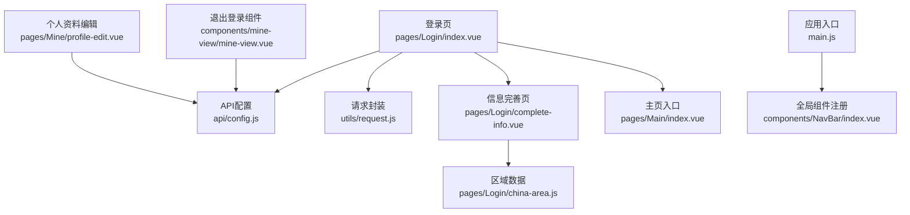
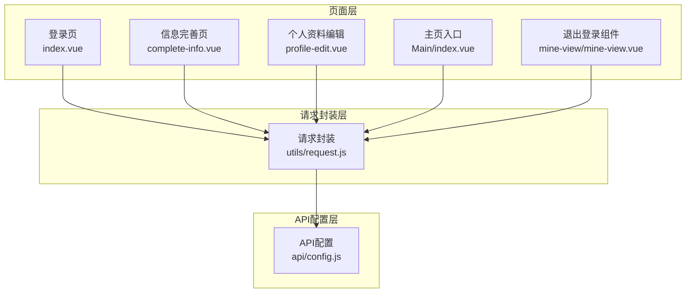
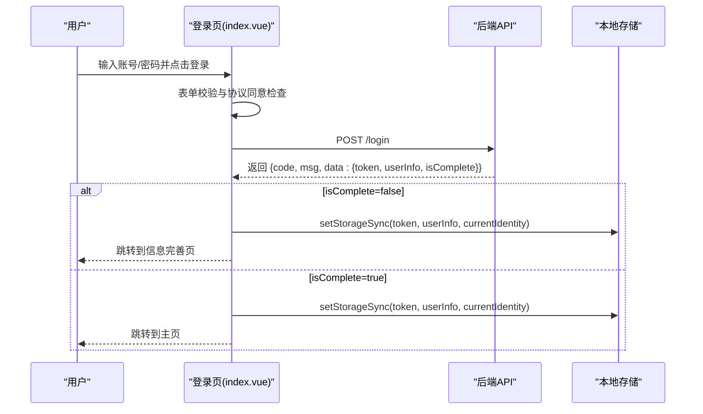
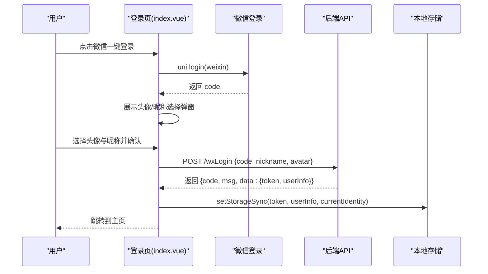
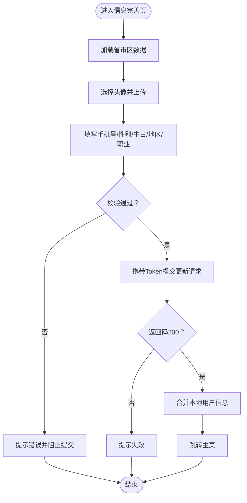
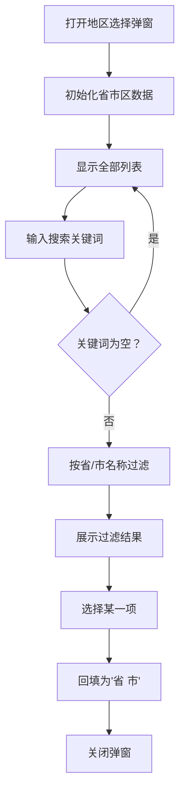
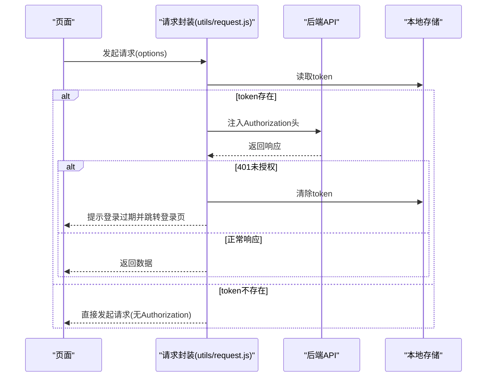
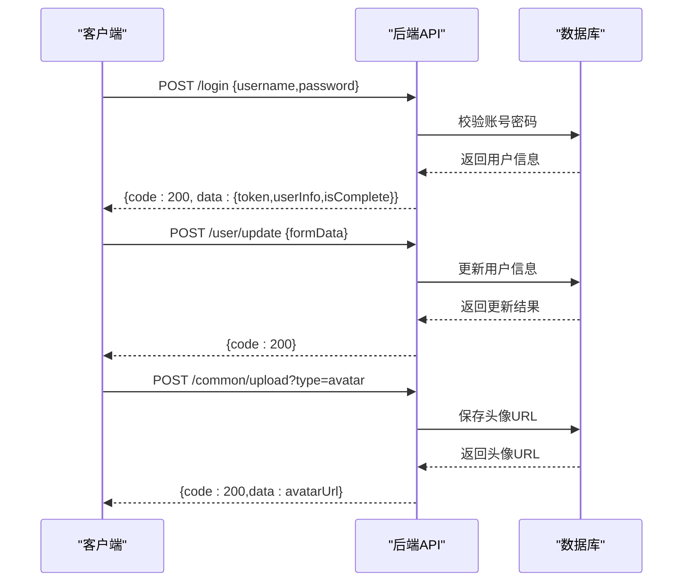
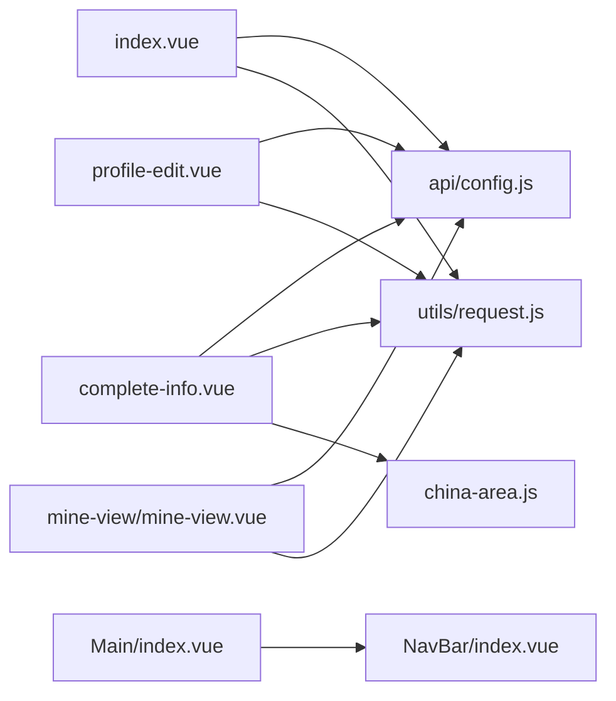

# 用户认证系统

<cite>
**本文档引用的文件**
- [pages/Login/index.vue](file://pages/Login/index.vue)
- [pages/Login/complete-info.vue](file://pages/Login/complete-info.vue)
- [pages/Login/china-area.js](file://pages/Login/china-area.js)
- [utils/request.js](file://utils/request.js)
- [api/config.js](file://api/config.js)
- [pages/Main/index.vue](file://pages/Main/index.vue)
- [pages/Mine/profile-edit.vue](file://pages/Mine/profile-edit.vue)
- [components/mine-view/mine-view.vue](file://components/mine-view/mine-view.vue)
- [main.js](file://main.js)
</cite>

## 目录
1. [简介](#简介)
2. [项目结构](#项目结构)
3. [核心组件](#核心组件)
4. [架构总览](#架构总览)
5. [详细组件分析](#详细组件分析)
6. [依赖关系分析](#依赖关系分析)
7. [性能考虑](#性能考虑)
8. [故障排除指南](#故障排除指南)
9. [结论](#结论)

## 简介
本文件面向致良知教育项目的用户认证系统，围绕登录页面的实现机制进行深入说明，涵盖账号密码登录与微信一键登录的完整流程；用户协议处理、信息完善页面设计与区域选择功能；Token 管理机制、本地存储策略与会话保持方案；以及用户状态管理、权限验证与安全防护措施。文档同时提供与后端 API 的交互方式与数据流转过程，并给出关键业务逻辑与异常处理机制的说明。

## 项目结构
认证系统主要涉及以下目录与文件：
- 登录页面：pages/Login/index.vue
- 信息完善页面：pages/Login/complete-info.vue
- 区域数据：pages/Login/china-area.js
- 请求封装：utils/request.js
- API 配置：api/config.js
- 主页入口：pages/Main/index.vue
- 个人资料编辑：pages/Mine/profile-edit.vue
- 退出登录与权限：components/mine-view/mine-view.vue
- 应用入口：main.js

**图表来源**
- [pages/Login/index.vue:1-900](file://pages/Login/index.vue#L1-L900)
- [pages/Login/complete-info.vue:1-694](file://pages/Login/complete-info.vue#L1-L694)
- [pages/Login/china-area.js:1-33](file://pages/Login/china-area.js#L1-L33)
- [utils/request.js:1-98](file://utils/request.js#L1-L98)
- [api/config.js:1-60](file://api/config.js#L1-L60)
- [pages/Main/index.vue:1-224](file://pages/Main/index.vue#L1-L224)
- [pages/Mine/profile-edit.vue:1-346](file://pages/Mine/profile-edit.vue#L1-L346)
- [components/mine-view/mine-view.vue:350-376](file://components/mine-view/mine-view.vue#L350-L376)
- [main.js:1-26](file://main.js#L1-L26)

**章节来源**
- [pages/Login/index.vue:1-900](file://pages/Login/index.vue#L1-L900)
- [pages/Login/complete-info.vue:1-694](file://pages/Login/complete-info.vue#L1-L694)
- [pages/Login/china-area.js:1-33](file://pages/Login/china-area.js#L1-L33)
- [utils/request.js:1-98](file://utils/request.js#L1-L98)
- [api/config.js:1-60](file://api/config.js#L1-L60)
- [pages/Main/index.vue:1-224](file://pages/Main/index.vue#L1-L224)
- [pages/Mine/profile-edit.vue:1-346](file://pages/Mine/profile-edit.vue#L1-L346)
- [components/mine-view/mine-view.vue:350-376](file://components/mine-view/mine-view.vue#L350-L376)
- [main.js:1-26](file://main.js#L1-L26)

## 核心组件
- 登录页（账号密码与微信一键登录）
- 信息完善页（头像上传、手机号、性别、生日、地区、职业等）
- 区域选择（省市区两级联动与搜索）
- 请求封装（自动注入 Token、统一错误处理）
- API 配置（统一 API 基础地址与路径）
- 主页入口（底部导航）
- 个人资料编辑（资料修改与地区选择）
- 退出登录与权限（登出与权限申请）

**章节来源**
- [pages/Login/index.vue:138-454](file://pages/Login/index.vue#L138-L454)
- [pages/Login/complete-info.vue:138-376](file://pages/Login/complete-info.vue#L138-L376)
- [pages/Login/china-area.js:1-33](file://pages/Login/china-area.js#L1-L33)
- [utils/request.js:7-98](file://utils/request.js#L7-L98)
- [api/config.js:8-57](file://api/config.js#L8-L57)
- [pages/Main/index.vue:52-116](file://pages/Main/index.vue#L52-L116)
- [pages/Mine/profile-edit.vue:117-314](file://pages/Mine/profile-edit.vue#L117-L314)
- [components/mine-view/mine-view.vue:350-376](file://components/mine-view/mine-view.vue#L350-L376)

## 架构总览
认证系统采用“页面层 + 请求封装层 + API 配置层”的分层架构：
- 页面层：登录页、信息完善页、主页入口、个人资料编辑、退出登录组件
- 请求封装层：统一封装请求与响应处理，自动注入 Token，处理 401 未授权
- API 配置层：集中管理 API 基础地址与各接口路径

**图表来源**
- [pages/Login/index.vue:138-454](file://pages/Login/index.vue#L138-L454)
- [pages/Login/complete-info.vue:138-376](file://pages/Login/complete-info.vue#L138-L376)
- [pages/Mine/profile-edit.vue:117-314](file://pages/Mine/profile-edit.vue#L117-L314)
- [pages/Main/index.vue:52-116](file://pages/Main/index.vue#L52-L116)
- [components/mine-view/mine-view.vue:350-376](file://components/mine-view/mine-view.vue#L350-L376)
- [utils/request.js:7-98](file://utils/request.js#L7-L98)
- [api/config.js:8-57](file://api/config.js#L8-L57)

## 详细组件分析

### 登录页（账号密码登录与微信一键登录）
- 功能要点
  - 账号密码登录：表单校验、调用登录接口、接收 Token 与用户信息、本地存储、按 isComplete 决定跳转至主页或信息完善页
  - 微信一键登录：协议同意校验、调用微信登录、展示头像与昵称选择弹窗、提交微信登录接口、存储 Token 与用户信息、跳转主页
  - 用户协议处理：复选框勾选、协议与隐私点击提示
  - 异常处理：网络异常、登录失败、缓存失败、跳转失败等

**图表来源**
- [pages/Login/index.vue:186-282](file://pages/Login/index.vue#L186-L282)
- [api/config.js:16-22](file://api/config.js#L16-L22)

**图表来源**
- [pages/Login/index.vue:311-430](file://pages/Login/index.vue#L311-L430)
- [api/config.js:16-22](file://api/config.js#L16-L22)

**章节来源**
- [pages/Login/index.vue:138-454](file://pages/Login/index.vue#L138-L454)
- [api/config.js:16-22](file://api/config.js#L16-L22)

### 信息完善页面（用户协议处理、信息完善与区域选择）
- 功能要点
  - 头像上传：选择图片、上传文件、设置 Authorization 头、更新本地头像
  - 基本信息：手机号、性别、生日、地区、职业
  - 地区选择：弹窗展示省市区列表、支持搜索、选择后回填
  - 提交信息：校验必填项、携带 Token 发送更新请求、合并本地用户信息、跳转主页
  - 跳过完善：直接跳转主页

**图表来源**
- [pages/Login/complete-info.vue:138-376](file://pages/Login/complete-info.vue#L138-L376)
- [pages/Login/china-area.js:1-33](file://pages/Login/china-area.js#L1-L33)

**章节来源**
- [pages/Login/complete-info.vue:138-376](file://pages/Login/complete-info.vue#L138-L376)
- [pages/Login/china-area.js:1-33](file://pages/Login/china-area.js#L1-L33)

### 区域选择功能（省市区两级联动与搜索）
- 数据来源：china-area.js 提供省列表与市列表，按索引一一对应
- 功能实现：
  - 初始化：遍历生成省市区组合列表
  - 打开弹窗：清空搜索关键字并恢复全部列表
  - 搜索过滤：按省/市名称模糊匹配
  - 选择回填：将“省 市”字符串写入表单

**图表来源**
- [pages/Login/complete-info.vue:182-217](file://pages/Login/complete-info.vue#L182-L217)
- [pages/Login/china-area.js:1-33](file://pages/Login/china-area.js#L1-L33)

**章节来源**
- [pages/Login/complete-info.vue:182-217](file://pages/Login/complete-info.vue#L182-L217)
- [pages/Login/china-area.js:1-33](file://pages/Login/china-area.js#L1-L33)

### Token 管理机制与本地存储策略
- 登录成功后存储：
  - token：用于后续请求鉴权
  - userInfo：用户基本信息
  - currentIdentity：当前身份标识
- 请求封装自动注入：
  - 读取 token 并注入到 Authorization 头
  - 处理 401 未授权：提示登录过期、清除 token、跳转登录页
- 会话保持：
  - 页面加载时从本地存储读取 token
  - 上传与更新接口均携带 Authorization 头
  - 退出登录时清理 token、userInfo、currentIdentity 并跳转登录页

**图表来源**
- [utils/request.js:7-67](file://utils/request.js#L7-L67)
- [pages/Login/complete-info.vue:303-346](file://pages/Login/complete-info.vue#L303-L346)
- [components/mine-view/mine-view.vue:350-376](file://components/mine-view/mine-view.vue#L350-L376)

**章节来源**
- [utils/request.js:7-67](file://utils/request.js#L7-L67)
- [pages/Login/complete-info.vue:303-346](file://pages/Login/complete-info.vue#L303-L346)
- [components/mine-view/mine-view.vue:350-376](file://components/mine-view/mine-view.vue#L350-L376)

### 用户状态管理与权限验证
- 用户状态：
  - 登录成功后在本地存储 token、userInfo、currentIdentity
  - 页面加载时读取本地存储以判断登录状态
- 权限验证：
  - 请求封装统一处理 401 未授权，触发登出流程
  - 退出登录组件提供安全退出，清理本地存储并跳转登录页
- 安全防护：
  - 所有敏感操作均携带 Authorization 头
  - 登录与微信登录均需同意协议
  - 上传与更新接口均进行本地 token 校验

**章节来源**
- [pages/Login/index.vue:214-222](file://pages/Login/index.vue#L214-L222)
- [utils/request.js:29-44](file://utils/request.js#L29-L44)
- [components/mine-view/mine-view.vue:350-376](file://components/mine-view/mine-view.vue#L350-L376)

### 与后端 API 的交互方式与数据流转
- 登录接口：POST /login，返回 {code, msg, data: {token, userInfo, isComplete}}
- 微信登录接口：POST /wxLogin，返回 {code, msg, data: {token, userInfo}}
- 用户信息更新接口：POST /user/update，携带 Authorization 头
- 头像上传接口：POST /common/upload，携带 Authorization 头
- 退出登录接口：POST /user/logout，携带 Authorization 头

**图表来源**
- [api/config.js:16-32](file://api/config.js#L16-L32)
- [pages/Login/index.vue:196-282](file://pages/Login/index.vue#L196-L282)
- [pages/Login/complete-info.vue:312-346](file://pages/Login/complete-info.vue#L312-L346)

**章节来源**
- [api/config.js:16-32](file://api/config.js#L16-L32)
- [pages/Login/index.vue:196-282](file://pages/Login/index.vue#L196-L282)
- [pages/Login/complete-info.vue:312-346](file://pages/Login/complete-info.vue#L312-L346)

## 依赖关系分析
- 登录页依赖 API 配置与请求封装，负责发起登录与微信登录请求，并处理本地存储与页面跳转
- 信息完善页依赖区域数据与请求封装，负责头像上传与用户信息更新
- 请求封装依赖 API 配置，统一处理 Token 注入与 401 未授权
- 退出登录组件依赖 API 配置与本地存储，负责安全退出
- 主页入口作为应用入口，承载底部导航与子视图

**图表来源**
- [pages/Login/index.vue:138-454](file://pages/Login/index.vue#L138-L454)
- [pages/Login/complete-info.vue:138-376](file://pages/Login/complete-info.vue#L138-L376)
- [pages/Login/china-area.js:1-33](file://pages/Login/china-area.js#L1-L33)
- [utils/request.js:1-98](file://utils/request.js#L1-L98)
- [api/config.js:1-60](file://api/config.js#L1-L60)
- [pages/Main/index.vue:52-116](file://pages/Main/index.vue#L52-L116)
- [pages/Mine/profile-edit.vue:117-314](file://pages/Mine/profile-edit.vue#L117-L314)
- [components/mine-view/mine-view.vue:350-376](file://components/mine-view/mine-view.vue#L350-L376)
- [main.js:14-26](file://main.js#L14-L26)

**章节来源**
- [pages/Login/index.vue:138-454](file://pages/Login/index.vue#L138-L454)
- [pages/Login/complete-info.vue:138-376](file://pages/Login/complete-info.vue#L138-L376)
- [pages/Login/china-area.js:1-33](file://pages/Login/china-area.js#L1-L33)
- [utils/request.js:1-98](file://utils/request.js#L1-L98)
- [api/config.js:1-60](file://api/config.js#L1-L60)
- [pages/Main/index.vue:52-116](file://pages/Main/index.vue#L52-L116)
- [pages/Mine/profile-edit.vue:117-314](file://pages/Mine/profile-edit.vue#L117-L314)
- [components/mine-view/mine-view.vue:350-376](file://components/mine-view/mine-view.vue#L350-L376)
- [main.js:14-26](file://main.js#L14-L26)

## 性能考虑
- 表单校验与异步请求：
  - 登录与微信登录均进行前端表单校验，减少无效请求
  - 使用 Promise 包装 uni.request，避免回调地狱，提升可维护性
- 图片上传：
  - 上传前进行 token 校验，避免无效请求
  - 上传过程中显示加载提示，提升用户体验
- 区域选择：
  - 初始化一次性生成省市区组合列表，避免重复计算
  - 搜索采用内存过滤，保证响应速度

[本节为通用建议，无需具体文件分析]

## 故障排除指南
- 登录失败
  - 检查账号密码格式与长度
  - 确认网络连接正常
  - 查看后端返回的错误信息
- 微信登录失败
  - 确认已同意协议
  - 检查微信授权是否成功
  - 确认头像与昵称已选择
- 缓存失败
  - 检查本地存储权限
  - 确认存储键值正确
- 401 未授权
  - 检查 token 是否存在且有效
  - 确认请求头 Authorization 是否正确注入
  - 触发自动登出流程并重新登录
- 页面跳转异常
  - 检查目标页面路径是否正确
  - 确认页面生命周期钩子中无阻塞操作

**章节来源**
- [pages/Login/index.vue:268-282](file://pages/Login/index.vue#L268-L282)
- [pages/Login/index.vue:354-430](file://pages/Login/index.vue#L354-L430)
- [utils/request.js:29-44](file://utils/request.js#L29-L44)
- [pages/Login/complete-info.vue:232-286](file://pages/Login/complete-info.vue#L232-L286)

## 结论
致良知教育项目的用户认证系统通过清晰的页面层、请求封装层与 API 配置层实现了完整的登录与信息完善流程。系统具备完善的表单校验、Token 管理与本地存储策略、统一的错误处理与安全退出机制，并提供了便捷的区域选择与头像上传功能。整体架构简洁、职责明确，便于扩展与维护。