# 登录页面实现

<cite>
**本文档引用的文件**
- [pages/Login/index.vue](file://pages/Login/index.vue)
- [pages/Login/complete-info.vue](file://pages/Login/complete-info.vue)
- [pages/Login/china-area.js](file://pages/Login/china-area.js)
- [api/config.js](file://api/config.js)
- [utils/request.js](file://utils/request.js)
- [doc/login-function-modification.md](file://doc/login-function-modification.md)
- [doc/README.md](file://doc/README.md)
</cite>

## 目录
1. [简介](#简介)
2. [项目结构](#项目结构)
3. [核心组件](#核心组件)
4. [架构概览](#架构概览)
5. [详细组件分析](#详细组件分析)
6. [依赖关系分析](#依赖关系分析)
7. [性能考虑](#性能考虑)
8. [故障排除指南](#故障排除指南)
9. [结论](#结论)

## 简介

致良知教育项目的登录页面实现是一个基于 uni-app 框架的移动端登录系统，提供了完整的账号密码登录功能和用户身份验证流程。该系统采用现代化的前端技术栈，实现了响应式设计、动画效果和安全的用户认证机制。

登录页面的核心目标是为用户提供简洁直观的登录体验，支持账号密码登录和微信一键登录两种认证方式，同时集成了用户协议同意机制和完善的错误处理流程。

## 项目结构

登录相关功能分布在以下关键文件中：

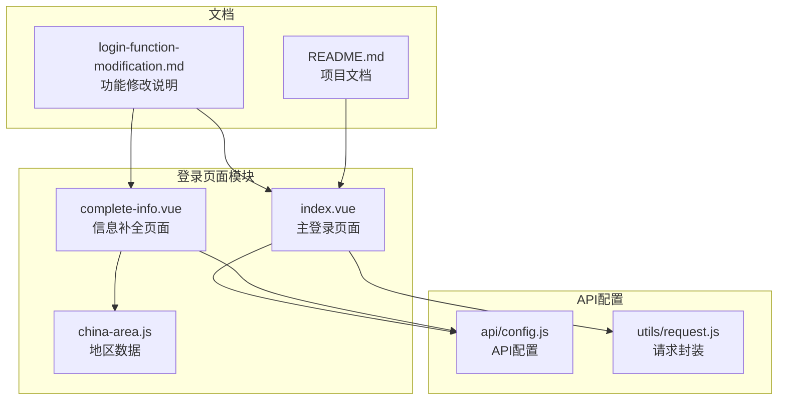

**图表来源**
- [pages/Login/index.vue:1-900](file://pages/Login/index.vue#L1-L900)
- [pages/Login/complete-info.vue:1-694](file://pages/Login/complete-info.vue#L1-L694)
- [api/config.js:1-60](file://api/config.js#L1-L60)

**章节来源**
- [pages/Login/index.vue:1-900](file://pages/Login/index.vue#L1-L900)
- [pages/Login/complete-info.vue:1-694](file://pages/Login/complete-info.vue#L1-L694)
- [api/config.js:1-60](file://api/config.js#L1-L60)

## 核心组件

### 登录表单组件

登录页面的核心组件是一个完整的表单系统，包含以下关键元素：

- **头部区域**：包含应用标识、标题和标语
- **表单区域**：用户名和密码输入框，支持密码显示切换
- **操作按钮**：登录/注册按钮，包含加载状态
- **辅助链接**：忘记密码和立即注册链接
- **微信登录区域**：微信一键登录按钮和授权弹窗
- **协议同意**：用户协议和隐私政策同意机制

### 表单验证系统

系统实现了多层次的表单验证机制：

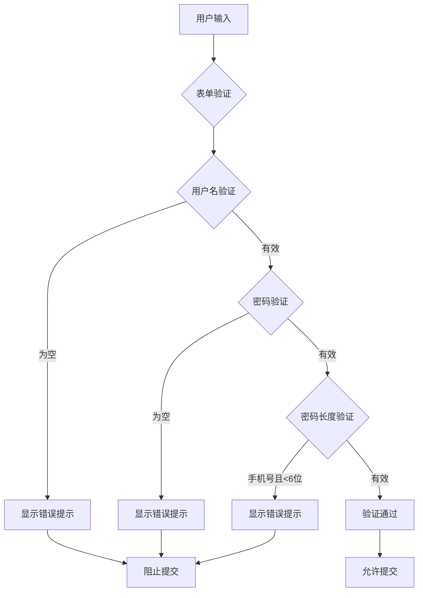

**图表来源**
- [pages/Login/index.vue:284-301](file://pages/Login/index.vue#L284-L301)

**章节来源**
- [pages/Login/index.vue:167-301](file://pages/Login/index.vue#L167-L301)

## 架构概览

登录系统的整体架构采用分层设计，确保了代码的可维护性和扩展性：

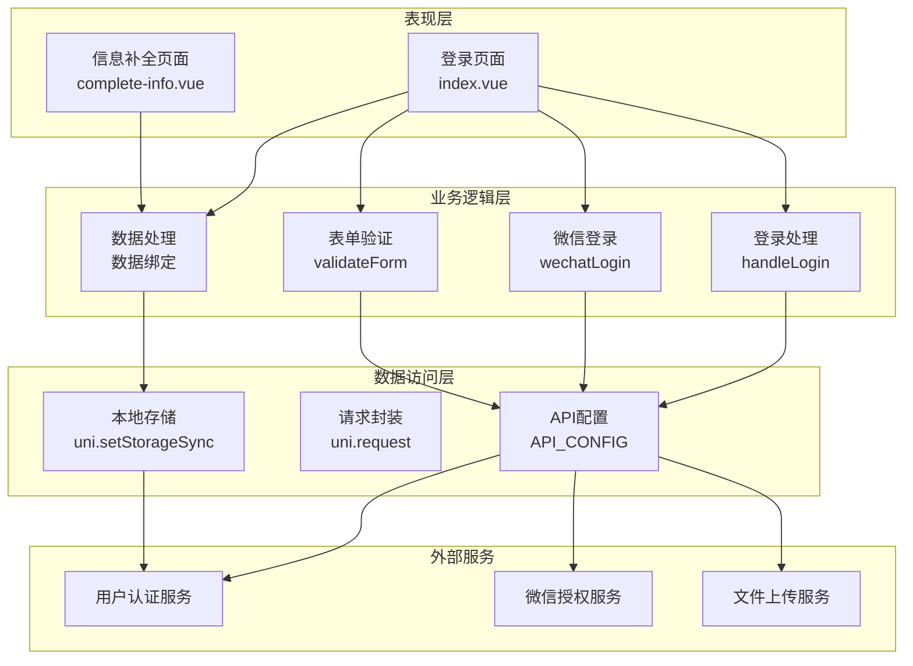

**图表来源**
- [pages/Login/index.vue:138-454](file://pages/Login/index.vue#L138-L454)
- [api/config.js:8-57](file://api/config.js#L8-L57)

## 详细组件分析

### 登录表单组件分析

#### 数据绑定和状态管理

登录表单使用 Vue.js 的响应式数据系统来管理表单状态：

| 数据属性 | 类型 | 默认值 | 描述 |
|---------|------|--------|------|
| username | String | '' | 用户名/手机号输入值 |
| password | String | '' | 密码输入值 |
| showPassword | Boolean | false | 控制密码显示/隐藏状态 |
| isLoading | Boolean | false | 登录按钮加载状态 |
| isAgree | Boolean | false | 用户协议同意状态 |
| showWxAuthModal | Boolean | false | 微信授权弹窗显示状态 |
| wxCode | String | '' | 微信授权码 |
| wxUserInfo | Object | {} | 微信用户信息对象 |

#### 交互逻辑实现

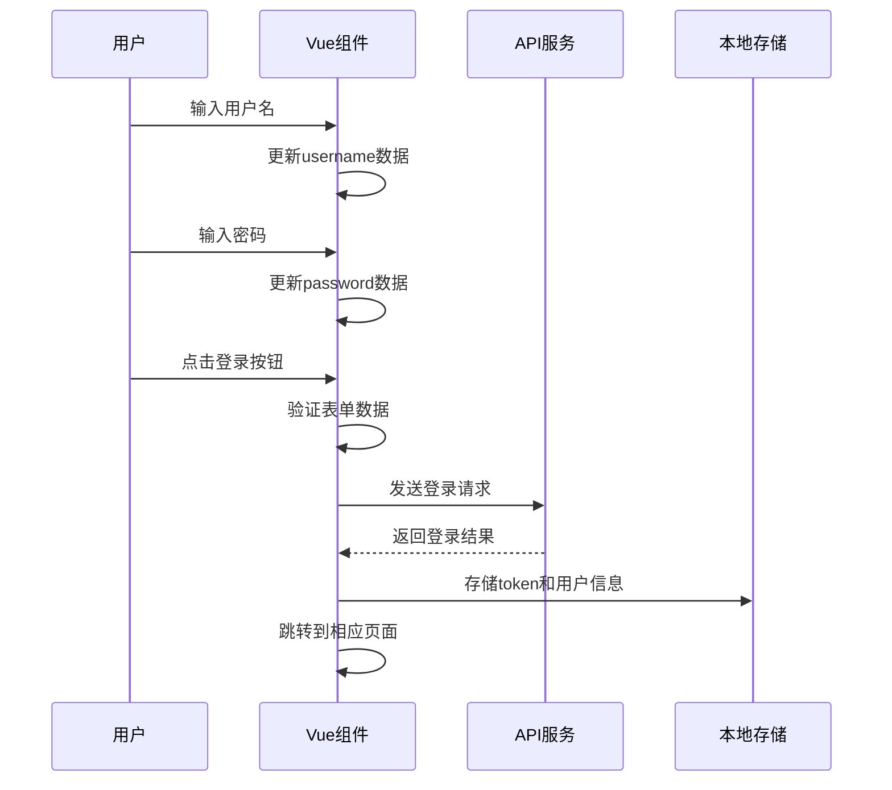

**图表来源**
- [pages/Login/index.vue:186-282](file://pages/Login/index.vue#L186-L282)

#### 密码显示切换功能

密码输入框实现了安全的密码显示切换机制：

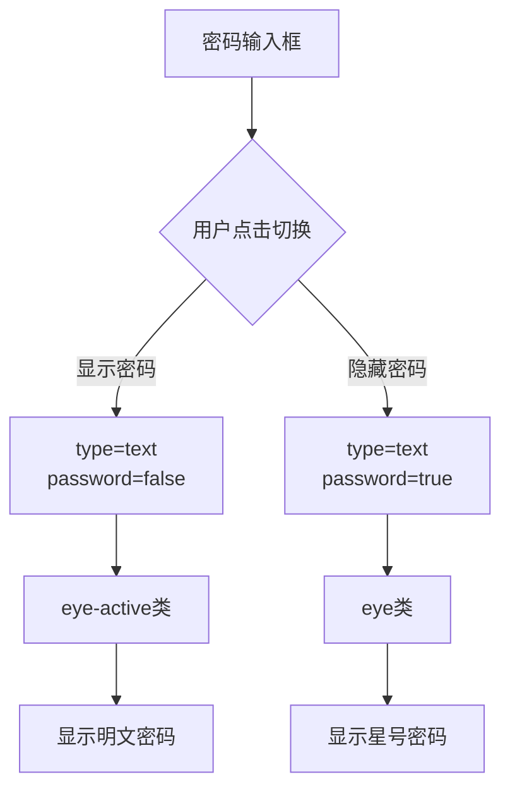

**图表来源**
- [pages/Login/index.vue:44-58](file://pages/Login/index.vue#L44-L58)
- [pages/Login/index.vue:178-180](file://pages/Login/index.vue#L178-L180)

**章节来源**
- [pages/Login/index.vue:178-180](file://pages/Login/index.vue#L178-L180)
- [pages/Login/index.vue:44-58](file://pages/Login/index.vue#L44-L58)

### 表单验证规则

系统实现了严格的表单验证规则：

| 验证规则 | 条件 | 错误提示 | 触发时机 |
|---------|------|----------|----------|
| 用户名必填 | username.trim() !== '' | 请输入账号 | 提交时 |
| 密码必填 | password.trim() !== '' | 请输入密码 | 提交时 |
| 手机号格式 | /^1[3-9]\d{9}$/ | 请输入正确的手机号 | 提交时 |
| 密码长度 | 手机号且password.length < 6 | 密码长度不能少于6位 | 提交时 |

#### 计算属性实现

登录页面使用了两个关键的计算属性：

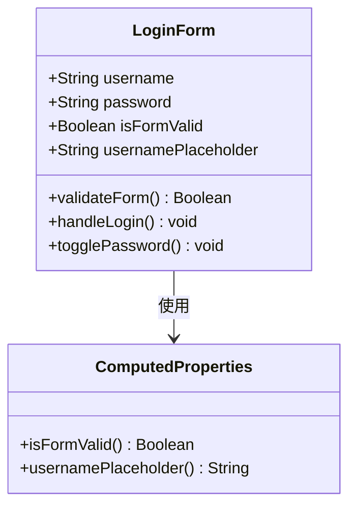

**图表来源**
- [pages/Login/index.vue:167-175](file://pages/Login/index.vue#L167-L175)

**章节来源**
- [pages/Login/index.vue:167-175](file://pages/Login/index.vue#L167-L175)

### 登录按钮状态控制

登录按钮的状态控制实现了完整的用户反馈机制：

| 状态 | 条件 | 显示内容 | 样式效果 |
|------|------|----------|----------|
| 正常 | isFormValid=true && !isLoading && isAgree=true | 登录 / 注册 | 红色渐变背景 |
| 加载中 | isLoading=true | 登录中... | 透明度降低，禁用点击 |
| 禁用 | isFormValid=false || isLoading || !isAgree | 登录 / 注册 | 灰色背景，禁用状态 |

#### 加载动画效果

按钮的加载状态通过以下机制实现：

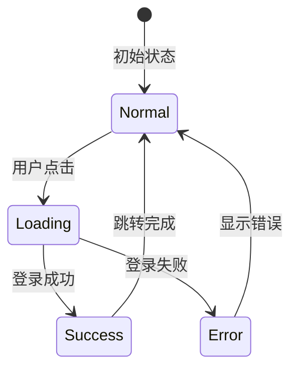

**图表来源**
- [pages/Login/index.vue:60-68](file://pages/Login/index.vue#L60-L68)
- [pages/Login/index.vue:193-282](file://pages/Login/index.vue#L193-L282)

**章节来源**
- [pages/Login/index.vue:60-68](file://pages/Login/index.vue#L60-L68)
- [pages/Login/index.vue:193-282](file://pages/Login/index.vue#L193-L282)

### 样式设计分析

#### 自定义图标系统

登录页面实现了完全自定义的CSS图标系统：

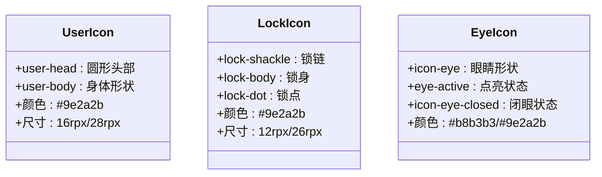

**图表来源**
- [pages/Login/index.vue:574-621](file://pages/Login/index.vue#L574-L621)
- [pages/Login/index.vue:639-680](file://pages/Login/index.vue#L639-L680)

#### 渐变背景设计

页面采用了多层次的渐变背景设计：

| 背景层级 | 元素 | 渐变效果 | 作用 |
|---------|------|----------|------|
| 底层 | bg-circle | 径向渐变 | 装饰性背景 |
| 中层 | 主容器 | 线性渐变 | 主色调背景 |
| 上层 | 卡片容器 | 白色背景 | 内容区域 |

#### 响应式布局

系统实现了完整的响应式设计：

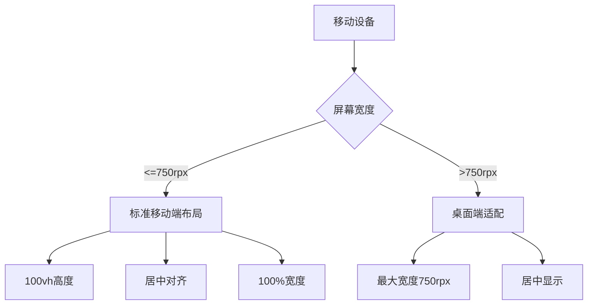

**图表来源**
- [pages/Login/index.vue:465-474](file://pages/Login/index.vue#L465-L474)

**章节来源**
- [pages/Login/index.vue:456-900](file://pages/Login/index.vue#L456-L900)

### API接口交互

#### 登录接口流程

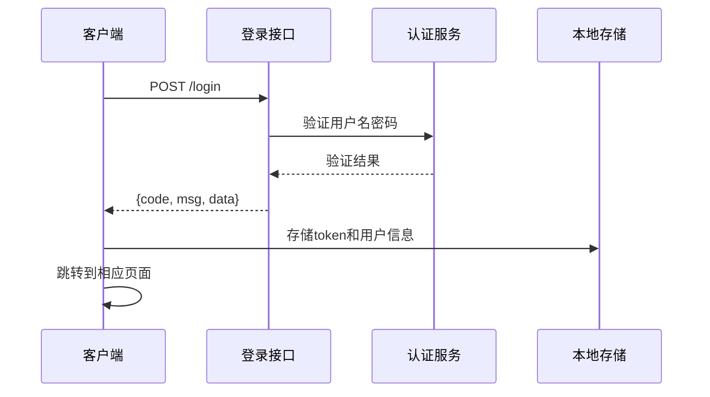

**图表来源**
- [pages/Login/index.vue:197-282](file://pages/Login/index.vue#L197-L282)
- [api/config.js:18](file://api/config.js#L18)

#### 微信登录接口流程

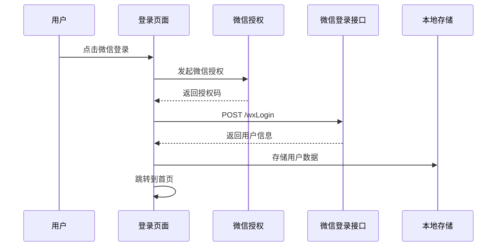

**图表来源**
- [pages/Login/index.vue:311-430](file://pages/Login/index.vue#L311-L430)

**章节来源**
- [pages/Login/index.vue:197-282](file://pages/Login/index.vue#L197-L282)
- [pages/Login/index.vue:311-430](file://pages/Login/index.vue#L311-L430)

### 错误处理机制

系统实现了多层次的错误处理机制：

| 错误类型 | 处理方式 | 用户反馈 |
|---------|----------|----------|
| 网络异常 | 显示"网络连接异常" | Toast提示 |
| 登录失败 | 显示具体错误信息 | Toast提示 |
| 参数验证失败 | 显示相应提示 | Toast提示 |
| Token过期 | 清除缓存并跳转登录页 | 自动跳转 |

**章节来源**
- [pages/Login/index.vue:269-281](file://pages/Login/index.vue#L269-L281)
- [pages/Login/index.vue:417-427](file://pages/Login/index.vue#L417-L427)

## 依赖关系分析

### 组件间依赖关系

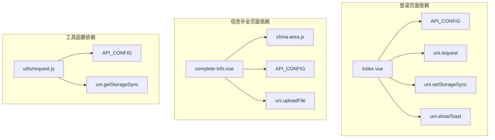

**图表来源**
- [pages/Login/index.vue:139](file://pages/Login/index.vue#L139)
- [pages/Login/complete-info.vue:139](file://pages/Login/complete-info.vue#L139)
- [utils/request.js:1-98](file://utils/request.js#L1-L98)

### 外部依赖分析

系统对外部依赖主要包括：

- **uni-app框架**：提供跨平台开发能力
- **Vue.js**：提供响应式数据绑定和组件化开发
- **微信小程序API**：提供微信授权和登录功能
- **后端API服务**：提供用户认证和数据管理功能

**章节来源**
- [utils/request.js:1-98](file://utils/request.js#L1-L98)
- [api/config.js:1-60](file://api/config.js#L1-L60)

## 性能考虑

### 加载性能优化

1. **懒加载策略**：仅在需要时加载相关组件
2. **图片优化**：使用适当的图片格式和尺寸
3. **缓存机制**：合理使用本地存储减少重复请求

### 用户体验优化

1. **动画效果**：使用CSS动画提升界面流畅度
2. **加载状态**：提供明确的加载指示
3. **错误处理**：友好的错误提示和恢复机制

## 故障排除指南

### 常见问题及解决方案

| 问题类型 | 症状 | 解决方案 |
|---------|------|----------|
| 登录失败 | 显示"登录失败，请检查账号密码" | 检查用户名密码格式 |
| 网络异常 | 显示"网络连接异常" | 检查网络连接状态 |
| 微信登录失败 | 微信授权失败 | 检查微信授权配置 |
| 页面跳转异常 | 无法正常跳转 | 检查路由配置 |

### 调试技巧

1. **控制台日志**：使用console.log输出调试信息
2. **网络监控**：检查API请求和响应
3. **状态检查**：验证数据绑定和状态变化

**章节来源**
- [pages/Login/index.vue:269-281](file://pages/Login/index.vue#L269-L281)
- [pages/Login/index.vue:417-427](file://pages/Login/index.vue#L417-L427)

## 结论

致良知教育项目的登录页面实现展现了现代移动端应用开发的最佳实践。通过精心设计的表单系统、完善的验证机制、优雅的用户界面和健壮的错误处理，为用户提供了优质的登录体验。

该系统的主要优势包括：

1. **用户体验优秀**：直观的界面设计和流畅的交互效果
2. **安全性可靠**：完整的表单验证和安全的认证流程
3. **代码质量高**：模块化的架构设计和清晰的代码结构
4. **扩展性强**：灵活的组件设计便于功能扩展

未来可以在以下方面进一步改进：
- 增加更多的登录方式支持
- 优化移动端的触摸交互体验
- 加强数据加密和安全防护
- 提升国际化支持能力