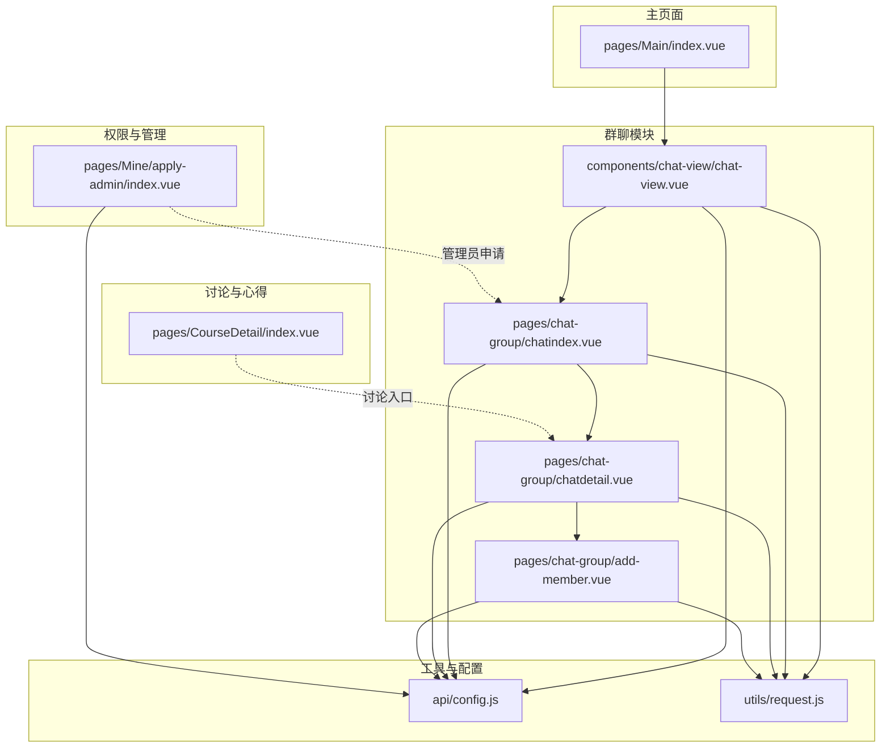
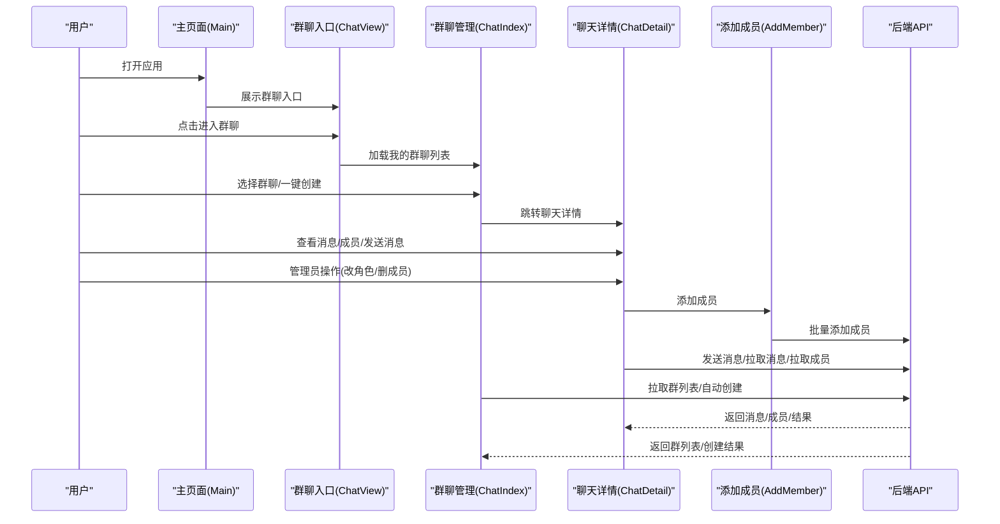
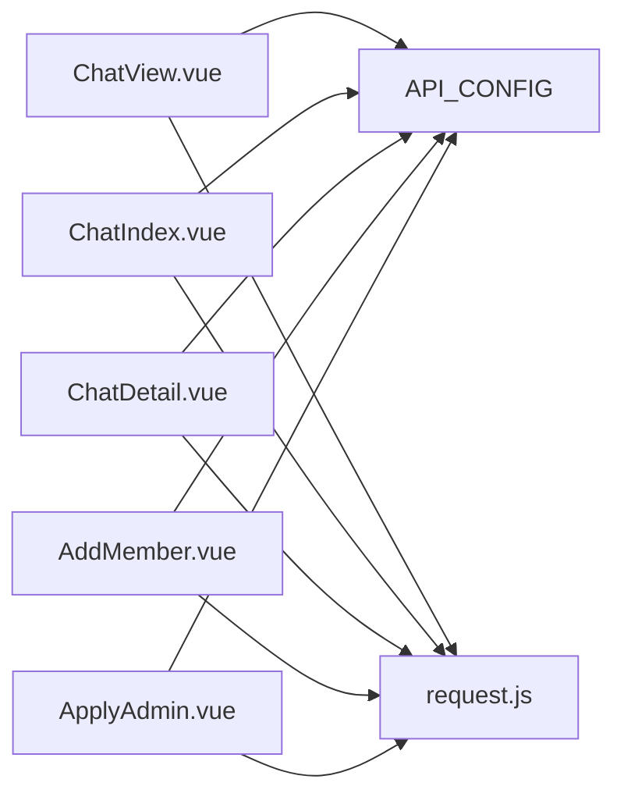

# 社区互动功能

<cite>
**本文引用的文件**
- [chatindex.vue](file://pages/chat-group/chatindex.vue)
- [chatdetail.vue](file://pages/chat-group/chatdetail.vue)
- [add-member.vue](file://pages/chat-group/add-member.vue)
- [chat-view.vue](file://components/chat-view/chat-view.vue)
- [index.vue](file://pages/Main/index.vue)
- [config.js](file://api/config.js)
- [request.js](file://utils/request.js)
- [index.vue](file://pages/Mine/apply-admin/index.vue)
- [index.vue](file://pages/CourseDetail/index.vue)
</cite>

## 目录
1. [简介](#简介)
2. [项目结构](#项目结构)
3. [核心组件](#核心组件)
4. [架构总览](#架构总览)
5. [详细组件分析](#详细组件分析)
6. [依赖关系分析](#依赖关系分析)
7. [性能考量](#性能考量)
8. [故障排查指南](#故障排查指南)
9. [结论](#结论)
10. [附录](#附录)

## 简介
本文件面向致良知教育项目的社区互动功能，聚焦于群聊与讨论区两大板块。文档基于前端代码实现，梳理消息发送、接收与存储机制；群聊管理（创建、成员管理、权限控制）；讨论区设计理念与内容管理；以及心得分享与内容审核流程。同时，结合现有代码对实时通信、消息推送与离线消息处理给出可行建议，并总结安全防护策略（内容过滤、举报机制、用户行为监控）。

## 项目结构
社区互动功能由三部分构成：
- 群聊管理与聊天界面：pages/chat-group 下的三个页面，配合 components/chat-view 的群聊入口。
- 讨论区与心得分享：课程详情页中的讨论入口与作业/心得相关能力（当前以占位形式存在，后续可扩展）。
- 权限与管理员申请：pages/Mine/apply-admin 下的管理员角色申请流程。

图表来源
- [index.vue:1-224](file://pages/Main/index.vue#L1-L224)
- [chat-view.vue:1-156](file://components/chat-view/chat-view.vue#L1-L156)
- [chatindex.vue:1-435](file://pages/chat-group/chatindex.vue#L1-L435)
- [chatdetail.vue:1-711](file://pages/chat-group/chatdetail.vue#L1-L711)
- [add-member.vue:1-341](file://pages/chat-group/add-member.vue#L1-L341)
- [index.vue:106-158](file://pages/CourseDetail/index.vue#L106-L158)
- [index.vue:1-515](file://pages/Mine/apply-admin/index.vue#L1-L515)
- [config.js:1-60](file://api/config.js#L1-L60)
- [request.js:1-98](file://utils/request.js#L1-L98)

章节来源
- [index.vue:1-224](file://pages/Main/index.vue#L1-L224)
- [chat-view.vue:1-156](file://components/chat-view/chat-view.vue#L1-L156)
- [chatindex.vue:1-435](file://pages/chat-group/chatindex.vue#L1-L435)
- [chatdetail.vue:1-711](file://pages/chat-group/chatdetail.vue#L1-L711)
- [add-member.vue:1-341](file://pages/chat-group/add-member.vue#L1-L341)
- [index.vue:106-158](file://pages/CourseDetail/index.vue#L106-L158)
- [index.vue:1-515](file://pages/Mine/apply-admin/index.vue#L1-L515)
- [config.js:1-60](file://api/config.js#L1-L60)
- [request.js:1-98](file://utils/request.js#L1-L98)

## 核心组件
- 群聊入口组件：提供“我的群聊”列表，支持跳转至聊天详情。
- 群聊管理页：展示管理范围、一键创建群聊、群列表与未读数。
- 聊天详情页：消息列表、成员列表、发送消息、成员管理（仅管理员）、添加成员。
- 添加成员页：批量添加成员。
- 权限申请页：管理员角色申请流程。
- API配置与请求封装：统一注入Token、错误处理与URL拼接。

章节来源
- [chat-view.vue:1-156](file://components/chat-view/chat-view.vue#L1-L156)
- [chatindex.vue:1-435](file://pages/chat-group/chatindex.vue#L1-L435)
- [chatdetail.vue:1-711](file://pages/chat-group/chatdetail.vue#L1-L711)
- [add-member.vue:1-341](file://pages/chat-group/add-member.vue#L1-L341)
- [index.vue:1-515](file://pages/Mine/apply-admin/index.vue#L1-L515)
- [config.js:1-60](file://api/config.js#L1-L60)
- [request.js:1-98](file://utils/request.js#L1-L98)

## 架构总览
前端采用“页面+组件”的组合模式，通过 uni-app 的路由与页面栈实现页面间跳转。聊天相关页面均通过 API 配置与请求封装访问后端接口，统一处理鉴权与错误。

图表来源
- [index.vue:1-224](file://pages/Main/index.vue#L1-L224)
- [chat-view.vue:1-156](file://components/chat-view/chat-view.vue#L1-L156)
- [chatindex.vue:1-435](file://pages/chat-group/chatindex.vue#L1-L435)
- [chatdetail.vue:1-711](file://pages/chat-group/chatdetail.vue#L1-L711)
- [add-member.vue:1-341](file://pages/chat-group/add-member.vue#L1-L341)
- [config.js:1-60](file://api/config.js#L1-L60)
- [request.js:1-98](file://utils/request.js#L1-L98)

## 详细组件分析

### 群聊入口与列表
- 功能要点
  - 登录态校验与Token注入。
  - 拉取用户加入的群聊列表，支持刷新。
  - 点击跳转至聊天详情页。
- 关键实现
  - 使用请求封装统一注入Authorization头。
  - 接口调用“获取用户群聊列表”，返回群列表并渲染。
- 性能与体验
  - 列表为空时展示空状态，避免空白。
  - 刷新时避免重复请求，可在mounted/onShow中做去抖。

章节来源
- [chat-view.vue:1-156](file://components/chat-view/chat-view.vue#L1-L156)
- [request.js:1-98](file://utils/request.js#L1-L98)
- [config.js:1-60](file://api/config.js#L1-L60)

### 群聊管理页（范围选择与一键创建）
- 功能要点
  - 选择管理范围（学组/检组/学委/检委/学班/检班等），格式化显示名称。
  - 拉取该范围内的群聊列表，按类型分类（班级群/大组群/小组群）。
  - 一键创建当前范围所需的所有群聊。
  - 显示未读数与创建状态。
- 关键实现
  - 通过“志愿者管理范围”接口获取可管理范围。
  - “群聊列表”接口按目标类型过滤。
  - “自动创建”接口按campId/targetId/dutyType批量创建。
- 安全与权限
  - 创建前需校验登录态与范围权限。
  - 创建结果兼容“已存在/重复”提示。

章节来源
- [chatindex.vue:1-435](file://pages/chat-group/chatindex.vue#L1-L435)
- [config.js:1-60](file://api/config.js#L1-L60)
- [request.js:1-98](file://utils/request.js#L1-L98)

### 聊天详情页（消息、成员、发送与管理）
- 功能要点
  - 消息列表：按时间排序，区分“自己”与“他人”消息。
  - 成员列表：支持搜索、角色标签（管理员/成员）、删除成员（仅管理员）。
  - 发送消息：支持“发送给所有人”或“私聊指定成员”，并刷新消息列表。
  - 管理员操作：修改成员角色、移除成员。
  - 添加成员：跳转至添加成员页，批量添加。
- 关键实现
  - 消息/成员/发送接口分别调用对应API。
  - 通过解码Token获取userId，用于消息归属判断。
  - 成员列表中识别当前用户角色，决定是否显示管理按钮。
- 实时性与离线处理
  - 当前实现为轮询式拉取（消息/成员），未见WebSocket或长连接实现。
  - 建议：引入WebSocket或轮询+增量拉取，结合本地消息缓存与未读数更新。

章节来源
- [chatdetail.vue:1-711](file://pages/chat-group/chatdetail.vue#L1-L711)
- [config.js:1-60](file://api/config.js#L1-L60)
- [request.js:1-98](file://utils/request.js#L1-L98)

### 添加成员页（批量添加）
- 功能要点
  - 拉取可添加成员列表，支持勾选批量添加。
  - 角色默认为“成员”，提交后返回结果并关闭页面。
- 关键实现
  - “可添加成员”接口返回members列表，标记已入群项。
  - “批量添加成员”接口提交chatId/userIds/role。

章节来源
- [add-member.vue:1-341](file://pages/chat-group/add-member.vue#L1-L341)
- [config.js:1-60](file://api/config.js#L1-L60)
- [request.js:1-98](file://utils/request.js#L1-L98)

### 讨论区与心得分享（概念与扩展）
- 设计理念
  - 讨论区作为课程学习的延伸，鼓励学员围绕主题进行交流与思想碰撞。
  - 心得分享作为学习闭环，记录每日感悟，形成个人成长轨迹。
- 内容管理机制
  - 作业/心得提交：课程任务中提供“心得体会”输入框，提交后进入审核流程。
  - 优秀作品展示：管理员可标记“小组优秀/大组优秀”，形成激励与榜样作用。
- 当前实现状态
  - 课程详情页提供“小组讨论”入口占位，实际跳转逻辑待完善。
  - 心得分享与审核流程在课程任务中体现，但讨论区页面尚未实现。

章节来源
- [index.vue:106-158](file://pages/CourseDetail/index.vue#L106-L158)

### 权限与管理员申请
- 功能要点
  - 支持三种管理员角色申请：课程管理员、档案管理员、超级管理员。
  - 申请理由必填且长度限制，提交后等待审核。
- 关键实现
  - 弹窗表单收集申请理由，提交至“职责申请提交”接口。
  - 提交成功后返回上一页并提示等待审核。

章节来源
- [index.vue:1-515](file://pages/Mine/apply-admin/index.vue#L1-L515)
- [config.js:1-60](file://api/config.js#L1-L60)
- [request.js:1-98](file://utils/request.js#L1-L98)

## 依赖关系分析
- 组件耦合
  - ChatView 依赖 API 配置与请求封装，耦合度低，便于复用。
  - ChatIndex 与 ChatDetail 依赖 API 配置与请求封装，相互独立但共享接口契约。
  - AddMember 与 ChatDetail 通过 chatId 参数协作，边界清晰。
- 外部依赖
  - API 基础地址与路径集中管理，便于维护。
  - 请求封装统一处理401、4xx错误与网络异常，提升健壮性。
- 潜在风险
  - 未发现循环依赖。
  - 管理员申请与群聊管理之间无直接耦合，权限控制需后端严格校验。

图表来源
- [chat-view.vue:1-156](file://components/chat-view/chat-view.vue#L1-L156)
- [chatindex.vue:1-435](file://pages/chat-group/chatindex.vue#L1-L435)
- [chatdetail.vue:1-711](file://pages/chat-group/chatdetail.vue#L1-L711)
- [add-member.vue:1-341](file://pages/chat-group/add-member.vue#L1-L341)
- [index.vue:1-515](file://pages/Mine/apply-admin/index.vue#L1-L515)
- [config.js:1-60](file://api/config.js#L1-L60)
- [request.js:1-98](file://utils/request.js#L1-L98)

章节来源
- [chat-view.vue:1-156](file://components/chat-view/chat-view.vue#L1-L156)
- [chatindex.vue:1-435](file://pages/chat-group/chatindex.vue#L1-L435)
- [chatdetail.vue:1-711](file://pages/chat-group/chatdetail.vue#L1-L711)
- [add-member.vue:1-341](file://pages/chat-group/add-member.vue#L1-L341)
- [index.vue:1-515](file://pages/Mine/apply-admin/index.vue#L1-L515)
- [config.js:1-60](file://api/config.js#L1-L60)
- [request.js:1-98](file://utils/request.js#L1-L98)

## 性能考量
- 网络请求
  - 统一注入Authorization头，减少重复代码。
  - 对401进行统一处理，清理本地Token并跳转登录，避免无效请求。
- 列表渲染
  - ChatDetail中消息列表按时间排序，建议在消息较多时采用虚拟滚动或分页加载。
  - 成员列表支持搜索过滤，建议在数据量较大时增加防抖与分页。
- 交互体验
  - 消息列表自动滚动到底部，注意在大量消息时的滚动性能。
  - 群聊管理页加载状态与空状态提示，提升可用性。

章节来源
- [request.js:1-98](file://utils/request.js#L1-L98)
- [chatdetail.vue:1-711](file://pages/chat-group/chatdetail.vue#L1-L711)
- [chatindex.vue:1-435](file://pages/chat-group/chatindex.vue#L1-L435)

## 故障排查指南
- 登录态失效
  - 现象：401未授权，提示登录过期。
  - 处理：清除本地Token并跳转登录页。
- 网络异常
  - 现象：网络连接异常提示。
  - 处理：检查网络状态，重试请求。
- 群聊创建失败
  - 现象：创建接口返回非200或提示“已存在/重复”。
  - 处理：兼容提示并刷新列表。
- 成员管理异常
  - 现象：修改角色/移除成员失败。
  - 处理：确认当前用户为管理员，检查chatId与userId参数。

章节来源
- [request.js:1-98](file://utils/request.js#L1-L98)
- [chatindex.vue:1-435](file://pages/chat-group/chatindex.vue#L1-L435)
- [chatdetail.vue:1-711](file://pages/chat-group/chatdetail.vue#L1-L711)

## 结论
本项目在前端层面实现了完整的群聊与讨论区基础能力：群聊管理、成员管理、消息收发与权限控制。当前采用HTTP轮询实现消息同步，具备良好的可维护性与扩展性。建议后续引入WebSocket或长轮询，结合本地缓存与增量拉取，进一步提升实时性与性能。同时，讨论区与心得分享可按课程任务扩展，完善内容审核与激励机制，构建更完整的社区生态。

## 附录

### 实时通信与消息推送建议
- 技术选型
  - WebSocket：适合高并发、低延迟场景。
  - 长轮询/短轮询：实现简单，兼容性强。
- 消息推送
  - 服务端推送未读数变化与新消息事件。
  - 客户端监听事件并更新UI与本地缓存。
- 离线消息处理
  - 客户端缓存最近N条消息，断网重连后请求增量消息。
  - 未读数与消息状态（已读/未读）需与服务端保持一致。

[本节为概念性建议，不直接分析具体源码，故无图表来源]

### 安全防护措施
- 内容过滤
  - 敏感词库与正则规则，对发送内容进行拦截与告警。
- 举报机制
  - 每条消息/成员提供举报入口，后台审核与封禁。
- 用户行为监控
  - 频繁刷屏、恶意消息等行为识别与限制。
- 权限控制
  - 管理员角色与操作范围严格校验，避免越权。

[本节为概念性建议，不直接分析具体源码，故无图表来源]