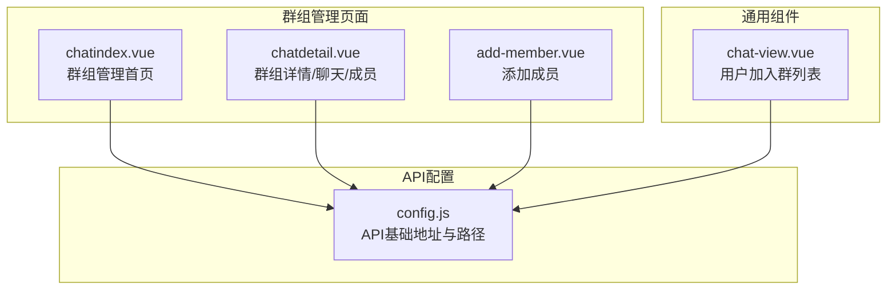
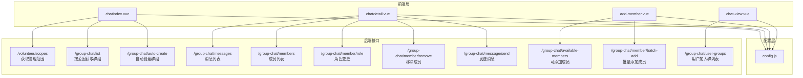
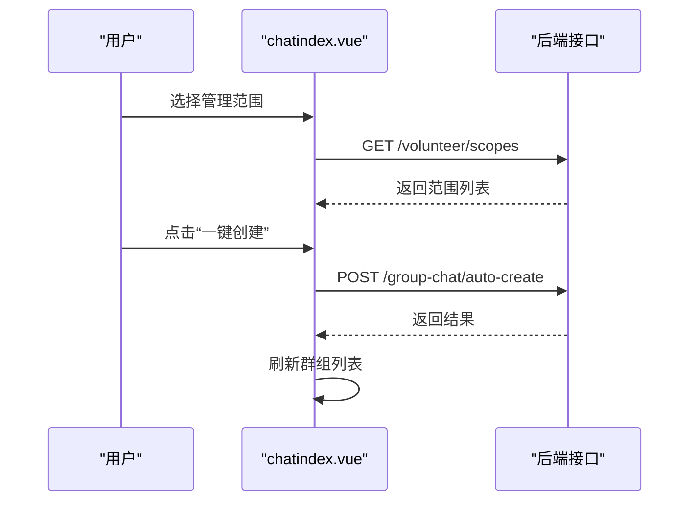
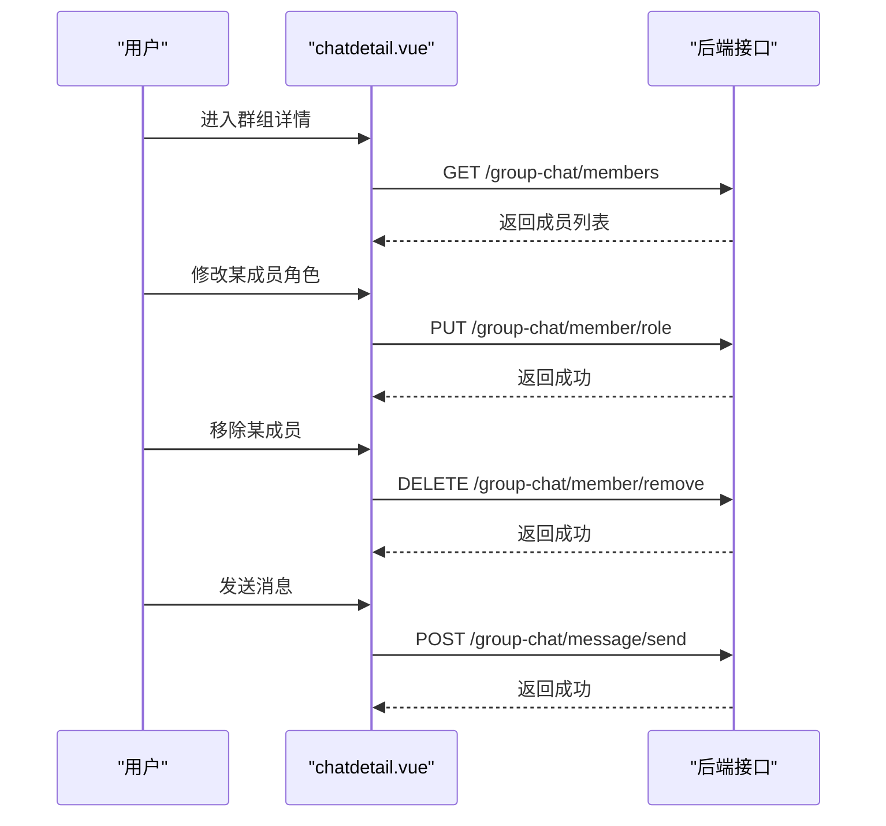
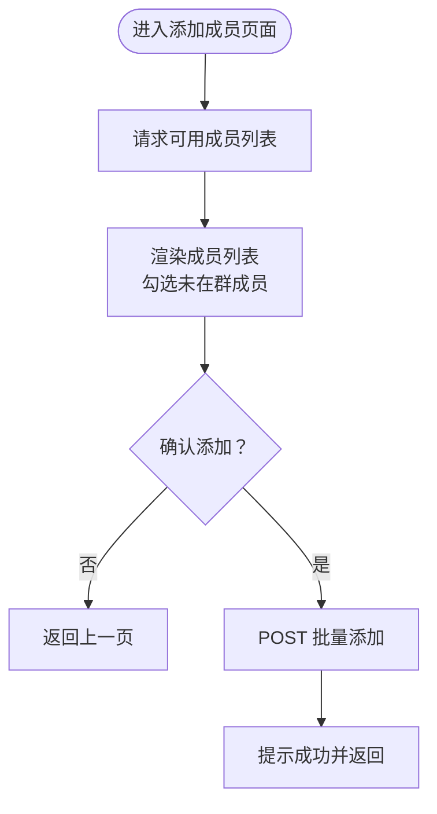
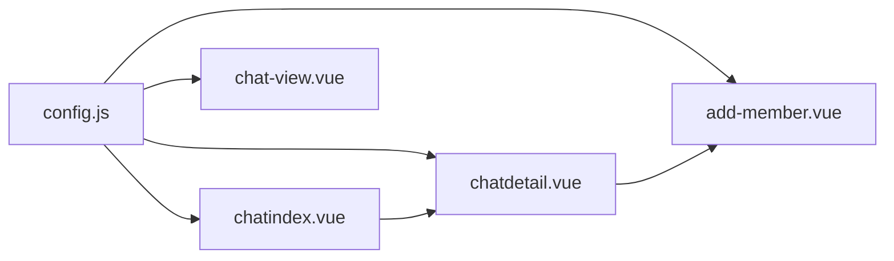

# 群组管理

<cite>
**本文引用的文件**
- [chatindex.vue](file://pages/chat-group/chatindex.vue)
- [chatdetail.vue](file://pages/chat-group/chatdetail.vue)
- [add-member.vue](file://pages/chat-group/add-member.vue)
- [chat-view.vue](file://components/chat-view/chat-view.vue)
- [config.js](file://api/config.js)
</cite>

## 目录
1. [简介](#简介)
2. [项目结构](#项目结构)
3. [核心组件](#核心组件)
4. [架构总览](#架构总览)
5. [详细组件分析](#详细组件分析)
6. [依赖关系分析](#依赖关系分析)
7. [性能考虑](#性能考虑)
8. [故障排除指南](#故障排除指南)
9. [结论](#结论)

## 简介
本文件面向致良知教育项目的“群组管理”功能，系统性梳理群组创建与管理的完整流程，包括：
- 自动创建群组功能与触发机制
- 群组类型分类（班级群、大组群、小组群）
- 群组权限控制与角色管理
- 群组成员管理（添加、移除、角色变更）
- 群组范围选择策略（学组、检组、学委、检委、学班、检班）
- 群组状态管理与未完成创建提醒
- 安全控制与数据同步策略

## 项目结构
群组管理相关页面与组件分布如下：
- 页面级组件
  - 群组管理首页：pages/chat-group/chatindex.vue
  - 群组聊天详情：pages/chat-group/chatdetail.vue
  - 添加成员页面：pages/chat-group/add-member.vue
- 通用聊天入口组件：components/chat-view/chat-view.vue
- API 配置：api/config.js

图表来源
- [chatindex.vue:1-435](file://pages/chat-group/chatindex.vue#L1-L435)
- [chatdetail.vue:1-711](file://pages/chat-group/chatdetail.vue#L1-L711)
- [add-member.vue:1-341](file://pages/chat-group/add-member.vue#L1-L341)
- [chat-view.vue:1-156](file://components/chat-view/chat-view.vue#L1-L156)
- [config.js:1-60](file://api/config.js#L1-L60)

章节来源
- [chatindex.vue:1-435](file://pages/chat-group/chatindex.vue#L1-L435)
- [chatdetail.vue:1-711](file://pages/chat-group/chatdetail.vue#L1-L711)
- [add-member.vue:1-341](file://pages/chat-group/add-member.vue#L1-L341)
- [chat-view.vue:1-156](file://components/chat-view/chat-view.vue#L1-L156)
- [config.js:1-60](file://api/config.js#L1-L60)

## 核心组件
- 群组管理首页（chatindex.vue）
  - 负责：加载管理范围、展示群组列表、一键创建群组、状态提醒
  - 关键能力：范围选择、自动创建、状态判断、列表渲染
- 群组详情/聊天/成员（chatdetail.vue）
  - 负责：消息列表、成员列表、角色管理、成员移除、发送消息、选择发送对象
  - 关键能力：消息拉取、成员查询、角色变更、成员删除、批量发送
- 添加成员（add-member.vue）
  - 负责：查询可添加成员、勾选批量添加、提交添加请求
  - 关键能力：可用成员查询、批量勾选、批量添加
- 用户加入群列表（chat-view.vue）
  - 负责：展示用户加入的群列表，跳转至聊天详情
  - 关键能力：用户群列表加载、跳转详情
- API 配置（config.js）
  - 负责：统一管理 API 基础地址与路径，供页面调用

章节来源
- [chatindex.vue:86-288](file://pages/chat-group/chatindex.vue#L86-L288)
- [chatdetail.vue:130-339](file://pages/chat-group/chatdetail.vue#L130-L339)
- [add-member.vue:65-165](file://pages/chat-group/add-member.vue#L65-L165)
- [chat-view.vue:39-94](file://components/chat-view/chat-view.vue#L39-L94)
- [config.js:8-57](file://api/config.js#L8-L57)

## 架构总览
群组管理采用“页面 + 组件 + API 配置”的分层架构，页面负责交互与状态管理，组件封装通用能力，API 配置集中管理后端接口地址与路径。

图表来源
- [chatindex.vue:114-258](file://pages/chat-group/chatindex.vue#L114-L258)
- [chatdetail.vue:196-318](file://pages/chat-group/chatdetail.vue#L196-L318)
- [add-member.vue:94-162](file://pages/chat-group/add-member.vue#L94-L162)
- [chat-view.vue:68-92](file://components/chat-view/chat-view.vue#L68-L92)
- [config.js:8-57](file://api/config.js#L8-L57)

## 详细组件分析

### 群组管理首页（chatindex.vue）
- 管理范围选择
  - 加载管理范围：调用 /volunteer/scopes 获取用户可管理的范围集合，并格式化显示名称
  - 选择范围：切换选中范围后，按 dutyType 与目标 id 查询该范围下的群组
- 群组列表与状态
  - 按类型渲染：班级群、大组群、小组群，分别标注颜色与文案
  - 状态判断：根据 dutyType 与已存在的群组类型，计算“是否已完成创建”
    - 学组/检组：需存在小组群
    - 学委/检委：需存在大组群与小组群
    - 学班/检班：需存在班级群、大组群与小组群
- 自动创建群组
  - 触发：点击“一键创建当前范围所有群聊”
  - 请求：POST /group-chat/auto-create，携带 campId、targetId、dutyType
  - 结果：成功或提示“已存在/重复”均视为成功，刷新列表

图表来源
- [chatindex.vue:108-128](file://pages/chat-group/chatindex.vue#L108-L128)
- [chatindex.vue:166-231](file://pages/chat-group/chatindex.vue#L166-L231)
- [chatindex.vue:233-280](file://pages/chat-group/chatindex.vue#L233-L280)

章节来源
- [chatindex.vue:108-231](file://pages/chat-group/chatindex.vue#L108-L231)
- [chatindex.vue:233-280](file://pages/chat-group/chatindex.vue#L233-L280)

### 群组详情/聊天/成员（chatdetail.vue）
- 消息与成员
  - 消息：GET /group-chat/messages 拉取消息列表并排序，滚动到底部
  - 成员：GET /group-chat/members 获取成员列表，并识别当前用户角色（admin）
- 角色管理与成员移除
  - 角色变更：PUT /group-chat/member/role（注：注释提示改为 POST）
  - 成员移除：DELETE /group-chat/member/remove（注：注释提示改为 POST）
- 发送消息与选择发送对象
  - 发送：POST /group-chat/message/send，支持发送给全体或指定成员
  - 选择：弹窗中支持搜索、全选与单选
- 添加成员入口
  - 管理员可见“添加成员”，跳转至 add-member.vue

图表来源
- [chatdetail.vue:215-294](file://pages/chat-group/chatdetail.vue#L215-L294)
- [chatdetail.vue:299-319](file://pages/chat-group/chatdetail.vue#L299-L319)

章节来源
- [chatdetail.vue:195-339](file://pages/chat-group/chatdetail.vue#L195-L339)

### 添加成员（add-member.vue）
- 可添加成员查询
  - GET /group-chat/available-members，返回 members 列表
- 批量添加
  - 勾选未在群中的成员，提交 POST /group-chat/member/batch-add，role 默认为 member
- UI 交互
  - 已在群成员显示“已在群”，不可勾选；未在群成员可勾选；确认添加后返回上一页

图表来源
- [add-member.vue:92-163](file://pages/chat-group/add-member.vue#L92-L163)

章节来源
- [add-member.vue:65-165](file://pages/chat-group/add-member.vue#L65-L165)

### 用户加入群列表（chat-view.vue）
- 展示用户加入的群列表，支持跳转至聊天详情
- 请求：GET /group-chat/user-groups，用于展示用户可访问的群

章节来源
- [chat-view.vue:57-93](file://components/chat-view/chat-view.vue#L57-L93)

## 依赖关系分析
- 页面到 API 配置
  - 所有页面均通过 API_CONFIG.baseUrl 与 config.js 中的路径拼接调用后端接口
- 页面间依赖
  - chatindex.vue 与 chatdetail.vue 通过 chatId 参数传递数据
  - chatdetail.vue 与 add-member.vue 通过 chatId 参数传递数据
- 组件依赖
  - chat-view.vue 作为通用组件被主页面或其他入口使用，提供用户加入群列表

图表来源
- [config.js:8-57](file://api/config.js#L8-L57)
- [chatindex.vue:87](file://pages/chat-group/chatindex.vue#L87)
- [chatdetail.vue:131](file://pages/chat-group/chatdetail.vue#L131)
- [add-member.vue:66](file://pages/chat-group/add-member.vue#L66)
- [chat-view.vue:40](file://components/chat-view/chat-view.vue#L40)

章节来源
- [config.js:8-57](file://api/config.js#L8-L57)
- [chatindex.vue:87](file://pages/chat-group/chatindex.vue#L87)
- [chatdetail.vue:131](file://pages/chat-group/chatdetail.vue#L131)
- [add-member.vue:66](file://pages/chat-group/add-member.vue#L66)
- [chat-view.vue:40](file://components/chat-view/chat-view.vue#L40)

## 性能考虑
- 列表渲染
  - 使用虚拟滚动容器（scroll-view）提升长列表渲染性能
- 请求合并与节流
  - 在频繁切换范围或刷新列表时，建议增加防抖/节流，避免重复请求
- 缓存策略
  - 用户加入群列表可短期缓存，减少重复请求
- 图片与消息
  - 消息列表按时间排序，建议分页加载，避免一次性渲染过多消息

## 故障排除指南
- 登录状态缺失
  - 现象：无法加载管理范围或群组列表
  - 处理：检查本地 token 是否存在，必要时引导重新登录
- 网络异常
  - 现象：接口调用失败、提示网络错误
  - 处理：检查 API 基础地址与网络连通性，必要时切换开发/生产环境
- 创建群组失败
  - 现象：提示“已存在/重复”或创建失败
  - 处理：确认 dutyType、targetId、campId 参数正确；若提示“已存在”，仍视为成功，刷新列表
- 成员操作失败
  - 现象：角色变更或移除成员失败
  - 处理：确认当前用户具备管理员权限；检查接口返回码与提示信息
- 添加成员异常
  - 现象：可用成员列表为空或勾选无效
  - 处理：确认 chatId 正确；检查成员是否已在群中（已在群不可勾选）

章节来源
- [chatindex.vue:108-128](file://pages/chat-group/chatindex.vue#L108-L128)
- [chatindex.vue:259-276](file://pages/chat-group/chatindex.vue#L259-L276)
- [chatdetail.vue:233-294](file://pages/chat-group/chatdetail.vue#L233-L294)
- [add-member.vue:92-121](file://pages/chat-group/add-member.vue#L92-L121)

## 结论
本群组管理功能围绕“范围选择—群组创建—成员管理—消息交互”形成闭环，通过统一的 API 配置与清晰的页面职责分工，实现了从管理员视角的自动化群组创建与从成员视角的聊天与成员管理。建议后续在以下方面持续优化：
- 增强状态提示与错误反馈，提升用户体验
- 引入分页与缓存策略，优化长列表性能
- 完善权限校验与审计日志，强化安全控制
- 扩展群组类型与范围策略，满足更多组织形态