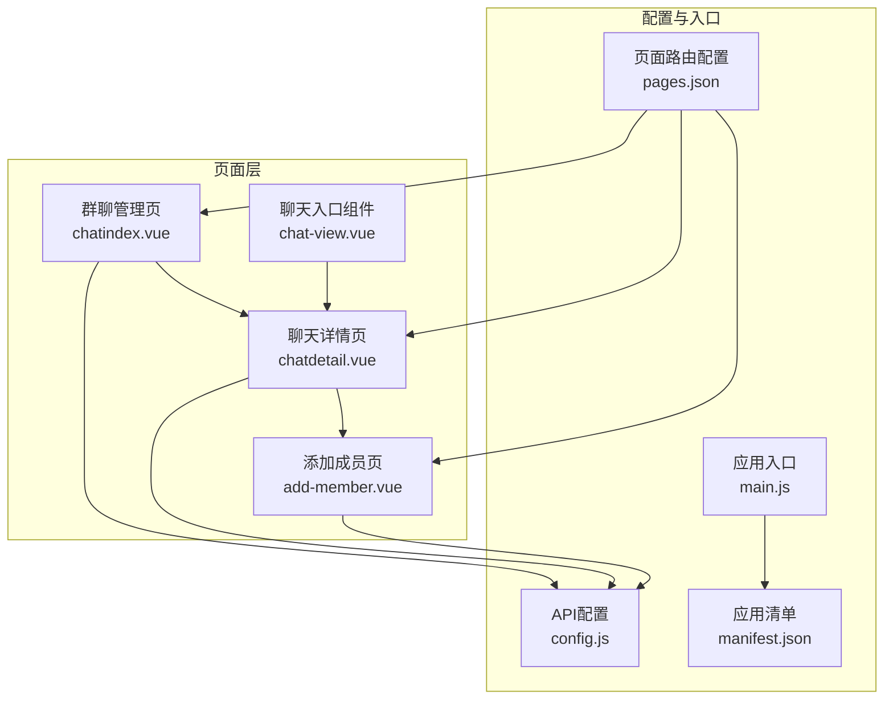
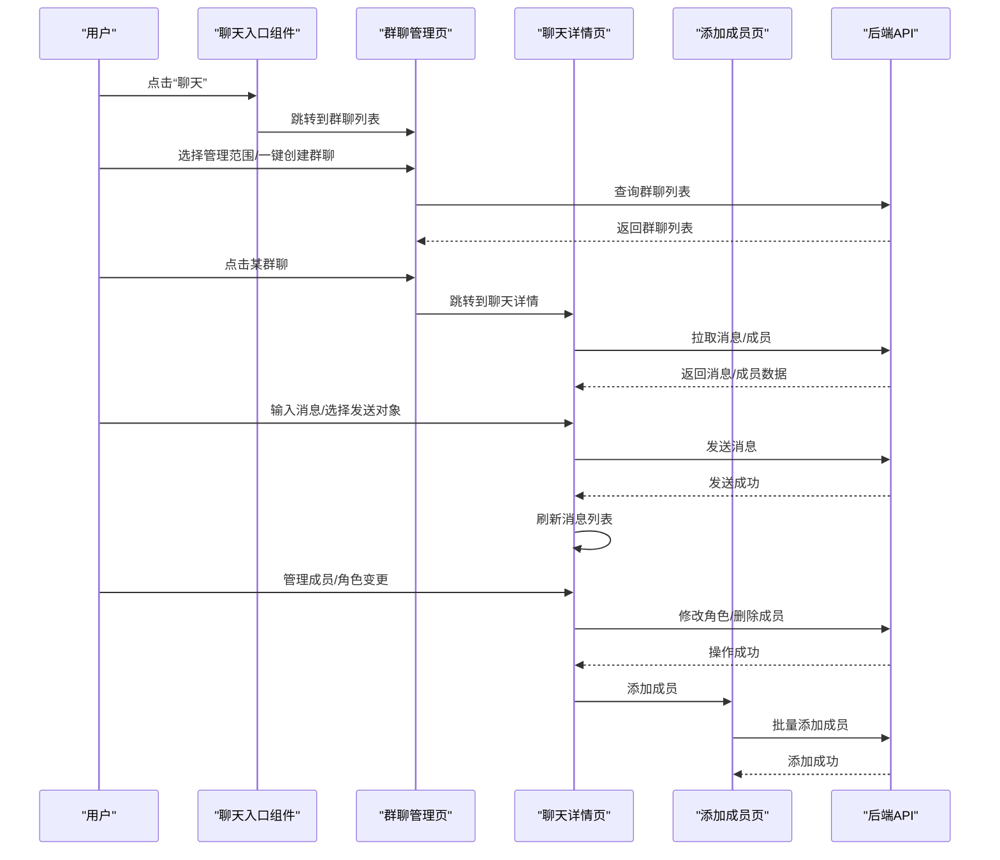
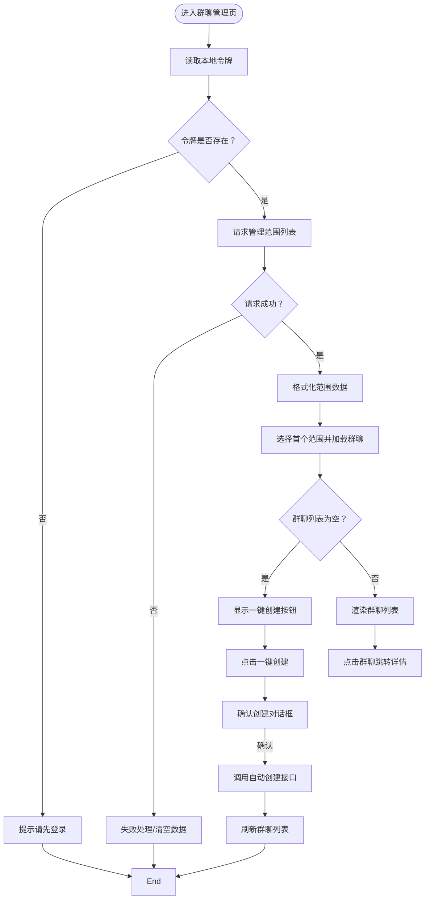
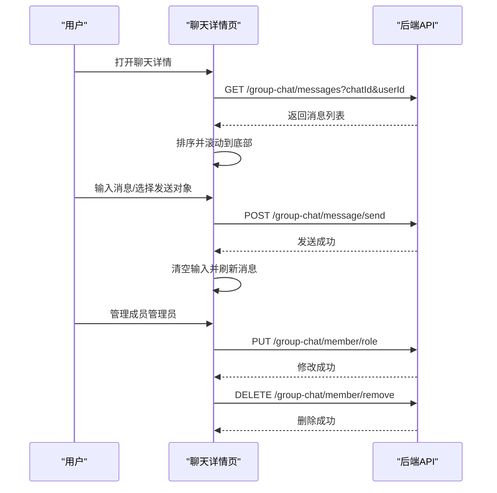
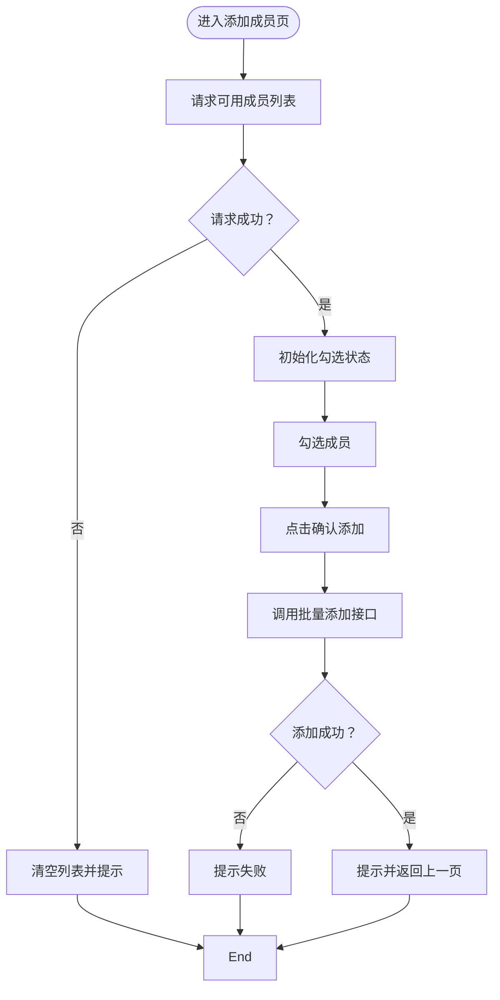
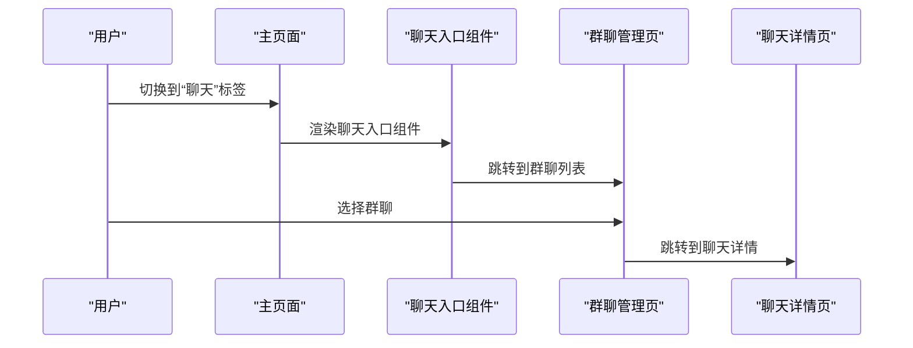
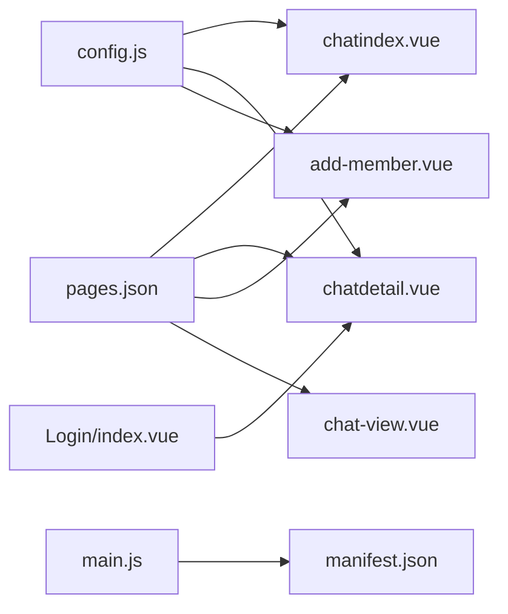

# 聊天系统

<cite>
**本文引用的文件**
- [chatindex.vue](file://pages/chat-group/chatindex.vue)
- [chatdetail.vue](file://pages/chat-group/chatdetail.vue)
- [add-member.vue](file://pages/chat-group/add-member.vue)
- [chat-view.vue](file://components/chat-view/chat-view.vue)
- [config.js](file://api/config.js)
- [index.vue](file://pages/Login/index.vue)
- [index.vue](file://pages/Main/index.vue)
- [main.js](file://main.js)
- [pages.json](file://pages.json)
- [manifest.json](file://manifest.json)
</cite>

## 目录
1. [简介](#简介)
2. [项目结构](#项目结构)
3. [核心组件](#核心组件)
4. [架构总览](#架构总览)
5. [详细组件分析](#详细组件分析)
6. [依赖关系分析](#依赖关系分析)
7. [性能考虑](#性能考虑)
8. [故障排除指南](#故障排除指南)
9. [结论](#结论)
10. [附录](#附录)

## 简介
本文件面向致良知教育项目的聊天系统，系统性梳理群聊管理、消息发送与接收、聊天页面交互、状态管理、权限控制与身份验证、响应式设计与体验优化，以及性能优化与内存管理策略。文档以代码为依据，结合架构图与流程图，帮助开发者快速理解与维护聊天功能。

## 项目结构
聊天系统由三类页面与一个通用组件构成：
- 群聊管理页：展示管理范围、一键创建群聊、列出群聊并跳转聊天详情
- 聊天详情页：消息列表渲染、输入与发送、群成员管理与角色变更
- 添加成员页：批量选择并添加成员
- 聊天入口组件：在主页面底部导航中提供“聊天”入口

图表来源
- [chatindex.vue:1-435](file://pages/chat-group/chatindex.vue#L1-L435)
- [chatdetail.vue:1-711](file://pages/chat-group/chatdetail.vue#L1-L711)
- [add-member.vue:1-341](file://pages/chat-group/add-member.vue#L1-L341)
- [chat-view.vue:1-156](file://components/chat-view/chat-view.vue#L1-L156)
- [config.js:1-60](file://api/config.js#L1-L60)
- [pages.json:1-131](file://pages.json#L1-L131)
- [main.js:1-26](file://main.js#L1-L26)
- [manifest.json:1-73](file://manifest.json#L1-L73)

章节来源
- [chatindex.vue:1-435](file://pages/chat-group/chatindex.vue#L1-L435)
- [chatdetail.vue:1-711](file://pages/chat-group/chatdetail.vue#L1-L711)
- [add-member.vue:1-341](file://pages/chat-group/add-member.vue#L1-L341)
- [chat-view.vue:1-156](file://components/chat-view/chat-view.vue#L1-L156)
- [config.js:1-60](file://api/config.js#L1-L60)
- [pages.json:1-131](file://pages.json#L1-L131)
- [main.js:1-26](file://main.js#L1-L26)
- [manifest.json:1-73](file://manifest.json#L1-L73)

## 核心组件
- 群聊管理页：负责加载管理范围、按范围查询群聊、一键创建群聊、跳转到聊天详情
- 聊天详情页：负责消息拉取与渲染、发送消息、成员列表与角色变更、私聊/全体发送切换
- 添加成员页：负责获取可添加成员、勾选批量添加
- 聊天入口组件：在主页面底部导航中提供“聊天”入口，跳转至群聊列表

章节来源
- [chatindex.vue:86-288](file://pages/chat-group/chatindex.vue#L86-L288)
- [chatdetail.vue:130-339](file://pages/chat-group/chatdetail.vue#L130-L339)
- [add-member.vue:65-165](file://pages/chat-group/add-member.vue#L65-L165)
- [chat-view.vue:39-94](file://components/chat-view/chat-view.vue#L39-L94)

## 架构总览
聊天系统采用“页面 + 组件 + 配置”的分层架构：
- 页面层：负责业务流程编排与用户交互
- 组件层：复用聊天入口组件，统一导航体验
- 配置层：集中管理API基础地址与路径，便于切换开发/生产环境

图表来源
- [chat-view.vue:88-92](file://components/chat-view/chat-view.vue#L88-L92)
- [chatindex.vue:171-231](file://pages/chat-group/chatindex.vue#L171-L231)
- [chatdetail.vue:195-228](file://pages/chat-group/chatdetail.vue#L195-L228)
- [chatdetail.vue:299-319](file://pages/chat-group/chatdetail.vue#L299-L319)
- [add-member.vue:129-163](file://pages/chat-group/add-member.vue#L129-L163)

## 详细组件分析

### 群聊管理页（chatindex.vue）
职责与流程
- 加载管理范围：通过令牌调用后端接口，格式化显示范围名称
- 按范围查询群聊：根据选中的范围参数查询群聊列表
- 一键创建群聊：根据范围类型自动创建班级群/大组群/小组群
- 列表渲染：按类型标签分类展示群聊，支持未读数徽标
- 跳转详情：点击群聊跳转到聊天详情页

图表来源
- [chatindex.vue:100-128](file://pages/chat-group/chatindex.vue#L100-L128)
- [chatindex.vue:130-164](file://pages/chat-group/chatindex.vue#L130-L164)
- [chatindex.vue:166-231](file://pages/chat-group/chatindex.vue#L166-L231)
- [chatindex.vue:233-280](file://pages/chat-group/chatindex.vue#L233-L280)
- [chatindex.vue:282-286](file://pages/chat-group/chatindex.vue#L282-L286)

章节来源
- [chatindex.vue:86-288](file://pages/chat-group/chatindex.vue#L86-L288)

### 聊天详情页（chatdetail.vue）
职责与流程
- 初始化：从URL参数获取chatId，从本地存储或JWT解析userId
- 拉取消息：按chatId与userId拉取消息，排序并滚动到底部
- 拉取成员：获取成员列表并判断当前用户是否管理员
- 发送消息：支持全体发送与私聊发送，发送后清空输入并刷新消息
- 成员管理：管理员可修改成员角色与删除成员；非管理员不可见操作
- 选择发送对象：弹窗支持搜索与选择全体/指定成员

图表来源
- [chatdetail.vue:151-168](file://pages/chat-group/chatdetail.vue#L151-L168)
- [chatdetail.vue:195-214](file://pages/chat-group/chatdetail.vue#L195-L214)
- [chatdetail.vue:215-228](file://pages/chat-group/chatdetail.vue#L215-L228)
- [chatdetail.vue:299-319](file://pages/chat-group/chatdetail.vue#L299-L319)
- [chatdetail.vue:233-263](file://pages/chat-group/chatdetail.vue#L233-L263)
- [chatdetail.vue:268-294](file://pages/chat-group/chatdetail.vue#L268-L294)

章节来源
- [chatdetail.vue:130-339](file://pages/chat-group/chatdetail.vue#L130-L339)

### 添加成员页（add-member.vue）
职责与流程
- 获取可添加成员：调用可用成员接口，初始化勾选状态
- 勾选批量添加：过滤未在群且已勾选的用户
- 批量添加：调用批量添加接口，成功后返回上一页

图表来源
- [add-member.vue:93-121](file://pages/chat-group/add-member.vue#L93-L121)
- [add-member.vue:129-163](file://pages/chat-group/add-member.vue#L129-L163)

章节来源
- [add-member.vue:65-165](file://pages/chat-group/add-member.vue#L65-L165)

### 聊天入口组件（chat-view.vue）
职责与流程
- 在主页面底部导航中提供“聊天”入口
- 进入时加载用户加入的群聊列表
- 点击群聊跳转到聊天详情页

图表来源
- [chat-view.vue:88-92](file://components/chat-view/chat-view.vue#L88-L92)
- [chat-view.vue:58-86](file://components/chat-view/chat-view.vue#L58-L86)

章节来源
- [chat-view.vue:39-94](file://components/chat-view/chat-view.vue#L39-L94)

## 依赖关系分析
- 页面路由：pages.json定义了各页面路径与样式，确保自定义导航栏与动画效果
- API配置：config.js集中管理baseUrl与各接口路径，便于开发/生产切换
- 应用入口：main.js在Vue3环境下全局注册NavBar组件，保证导航一致性
- 权限与身份：登录页负责令牌与用户信息缓存，聊天页通过令牌与JWT解析获取userId

图表来源
- [pages.json:1-131](file://pages.json#L1-L131)
- [config.js:1-60](file://api/config.js#L1-L60)
- [main.js:1-26](file://main.js#L1-L26)
- [manifest.json:1-73](file://manifest.json#L1-L73)
- [index.vue:1-900](file://pages/Login/index.vue#L1-L900)

章节来源
- [pages.json:1-131](file://pages.json#L1-L131)
- [config.js:1-60](file://api/config.js#L1-L60)
- [main.js:1-26](file://main.js#L1-L26)
- [manifest.json:1-73](file://manifest.json#L1-L73)

## 性能考虑
- 列表渲染优化
  - 使用虚拟滚动/懒加载：对长消息列表建议采用虚拟滚动或分页加载，避免一次性渲染过多DOM节点
  - 数据排序与去重：消息按时间排序，避免重复渲染
- 网络请求优化
  - 请求合并：在短时间内多次请求可考虑节流/防抖
  - 缓存策略：对成员列表与群聊列表进行短期缓存，减少重复请求
- 内存管理
  - 页面卸载时清理定时器与事件监听
  - 大列表渲染后及时释放临时变量
- 图片与资源
  - 头像等资源建议压缩与懒加载
- 滚动与焦点
  - 发送消息后滚动到底部，避免频繁计算scrollTop导致卡顿

[本节为通用性能指导，不直接分析具体文件]

## 故障排除指南
- 登录态失效
  - 现象：群聊管理页提示“请先登录”
  - 处理：检查本地存储token是否存在，必要时重新登录
- 消息无法发送
  - 现象：发送按钮禁用或发送失败
  - 处理：确认输入内容非空，检查网络状态与后端接口返回码
- 成员管理不可见
  - 现象：非管理员看不到角色变更/删除按钮
  - 处理：确认当前用户角色，仅管理员可见相关操作
- 创建群聊失败
  - 现象：一键创建后列表未更新
  - 处理：点击后延时刷新列表，确认后端返回码

章节来源
- [chatindex.vue:109-112](file://pages/chat-group/chatindex.vue#L109-L112)
- [chatdetail.vue:299-319](file://pages/chat-group/chatdetail.vue#L299-L319)
- [chatdetail.vue:215-227](file://pages/chat-group/chatdetail.vue#L215-L227)
- [chatindex.vue:269-276](file://pages/chat-group/chatindex.vue#L269-L276)

## 结论
聊天系统以页面与组件分离的方式实现了完整的群聊管理与消息交互流程。通过统一的API配置与路由管理，系统具备良好的可维护性与扩展性。建议后续引入虚拟滚动、消息去重与缓存策略，进一步提升性能与用户体验。

[本节为总结性内容，不直接分析具体文件]

## 附录

### 聊天页面交互要点
- 消息列表渲染：按时间升序排列，发送后滚动到底部
- 输入框处理：双向绑定content，禁用空内容发送
- 发送按钮：根据输入状态动态启用/禁用
- 未读消息：群聊列表显示未读数徽标
- 成员管理：管理员可修改角色与删除成员

章节来源
- [chatdetail.vue:208-211](file://pages/chat-group/chatdetail.vue#L208-L211)
- [chatdetail.vue:99-101](file://pages/chat-group/chatdetail.vue#L99-L101)
- [chatindex.vue:65-67](file://pages/chat-group/chatindex.vue#L65-L67)
- [chatdetail.vue:65-77](file://pages/chat-group/chatdetail.vue#L65-L77)

### 权限控制与身份验证
- 登录页：支持账号密码与微信登录，登录成功后写入token与用户信息
- 聊天页：读取本地token与userId，必要时从JWT解析userId
- 管理权限：仅管理员可见成员管理与角色变更操作

章节来源
- [index.vue:197-282](file://pages/Login/index.vue#L197-L282)
- [chatdetail.vue:156-164](file://pages/chat-group/chatdetail.vue#L156-L164)
- [chatdetail.vue:223-225](file://pages/chat-group/chatdetail.vue#L223-L225)

### 响应式设计与用户体验
- 自定义导航栏：统一头部样式与返回按钮
- 安全区适配：底部安全区与胶囊按钮
- 弹窗交互：成员选择弹窗支持搜索与高亮
- 动画与反馈：按钮悬停、点击反馈与加载提示

章节来源
- [chatindex.vue:314-350](file://pages/chat-group/chatindex.vue#L314-L350)
- [chatdetail.vue:655-711](file://pages/chat-group/chatdetail.vue#L655-L711)
- [add-member.vue:169-341](file://pages/chat-group/add-member.vue#L169-L341)