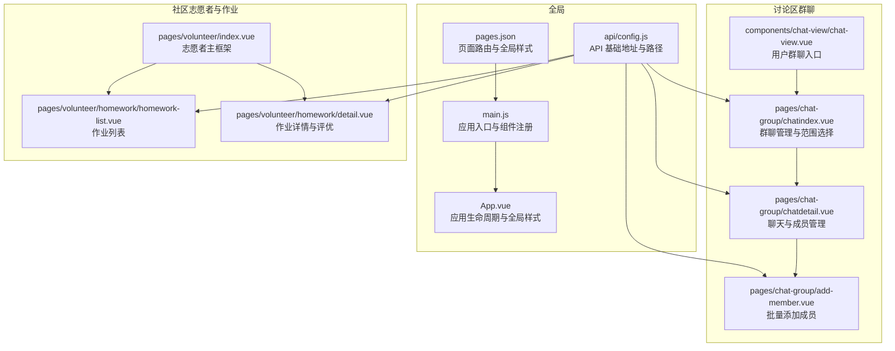
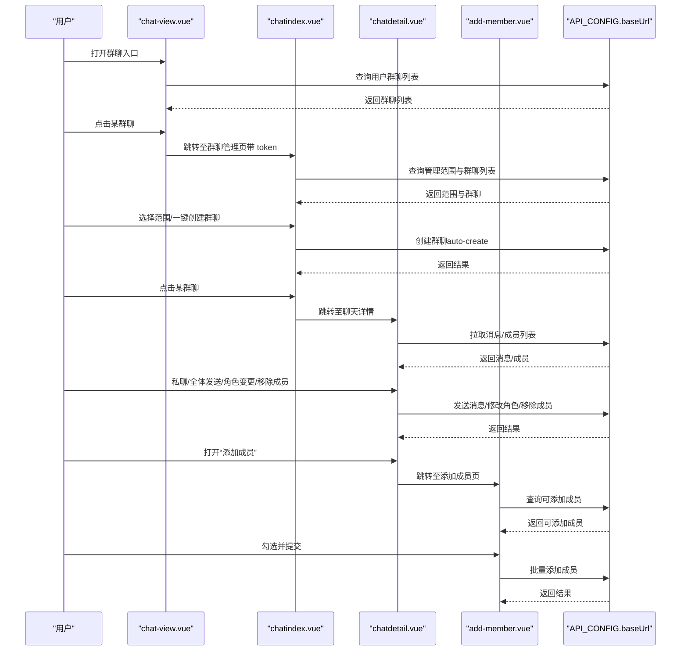
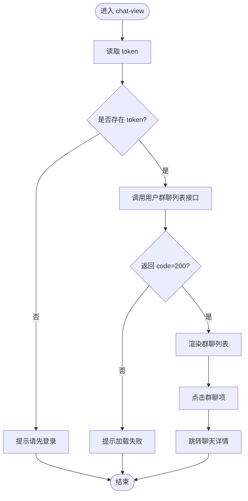
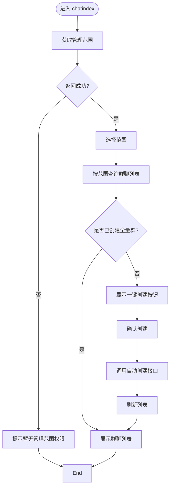
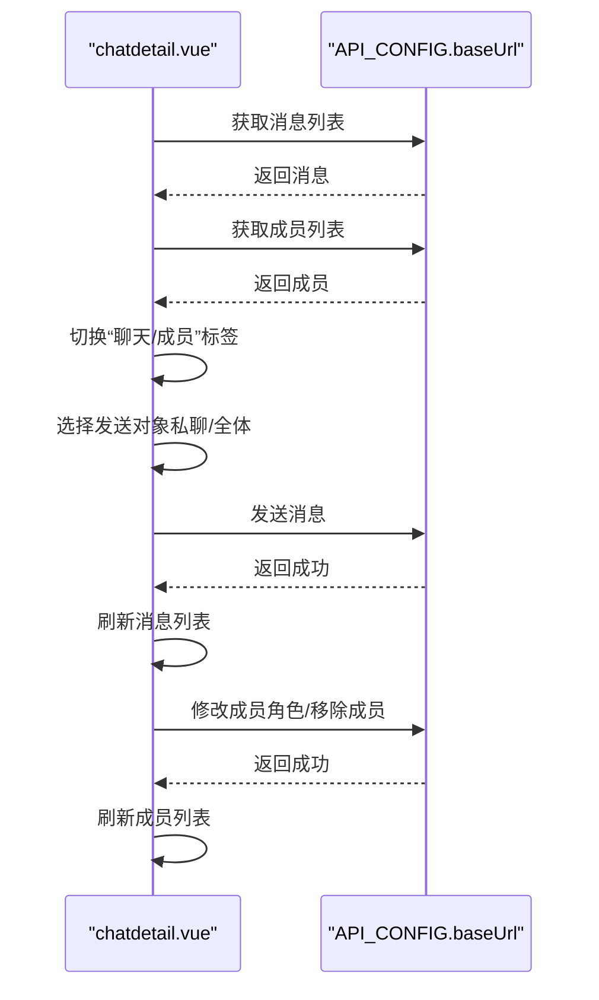
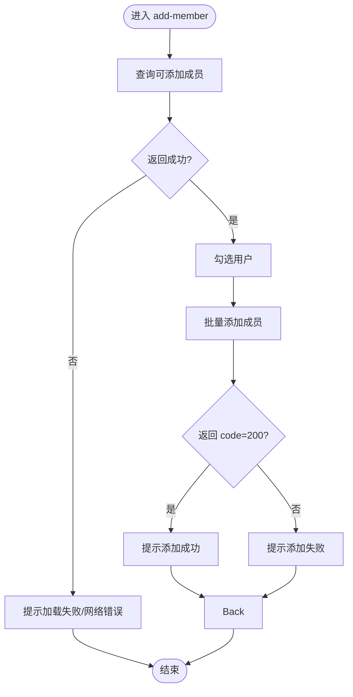
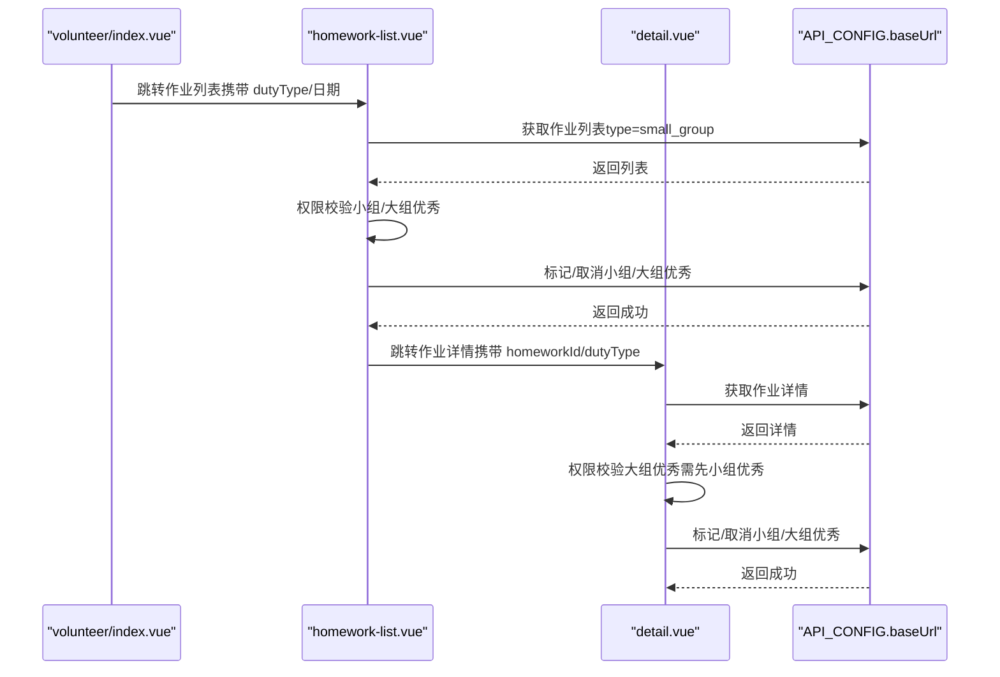
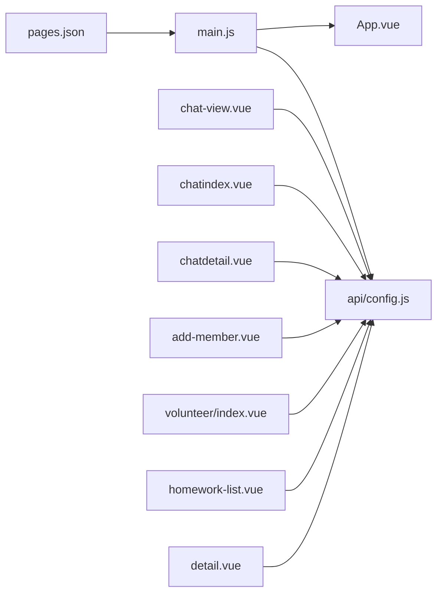

# 讨论区与社区

<cite>
**本文引用的文件**
- [App.vue](file://App.vue)
- [main.js](file://main.js)
- [pages.json](file://pages.json)
- [api/config.js](file://api/config.js)
- [components/chat-view/chat-view.vue](file://components/chat-view/chat-view.vue)
- [pages/chat-group/chatindex.vue](file://pages/chat-group/chatindex.vue)
- [pages/chat-group/chatdetail.vue](file://pages/chat-group/chatdetail.vue)
- [pages/chat-group/add-member.vue](file://pages/chat-group/add-member.vue)
- [pages/volunteer/index.vue](file://pages/volunteer/index.vue)
- [pages/volunteer/homework/detail.vue](file://pages/volunteer/homework/detail.vue)
- [pages/volunteer/homework/homework-list.vue](file://pages/volunteer/homework/homework-list.vue)
</cite>

## 目录
1. [简介](#简介)
2. [项目结构](#项目结构)
3. [核心组件](#核心组件)
4. [架构总览](#架构总览)
5. [详细组件分析](#详细组件分析)
6. [依赖关系分析](#依赖关系分析)
7. [性能考量](#性能考量)
8. [故障排查指南](#故障排查指南)
9. [结论](#结论)
10. [附录](#附录)

## 简介
本文件面向“致良知教育”项目中的讨论区与社区功能，聚焦于群聊管理、消息交互、成员管理、作业评优等子域，梳理前端页面、组件与 API 的交互关系，并给出设计与实现层面的可视化说明。文档不涉及具体代码片段，仅通过文件路径与行号进行引用。

## 项目结构
项目采用基于页面的目录组织方式，讨论区与社区相关能力主要分布在以下模块：
- 讨论区（群聊）：pages/chat-group 下的群聊管理、聊天详情、添加成员等页面；components/chat-view 下的群聊入口视图。
- 社区（志愿者与作业）：pages/volunteer 下的志愿者首页、作业列表与作业详情等页面。
- 全局配置：api/config.js 提供 API 基础地址与路径映射。
- 页面路由与全局样式：pages.json、App.vue、main.js。

图表来源
- [pages.json:1-131](file://pages.json#L1-L131)
- [main.js:1-26](file://main.js#L1-L26)
- [App.vue:1-40](file://App.vue#L1-L40)
- [api/config.js:1-60](file://api/config.js#L1-L60)
- [components/chat-view/chat-view.vue:1-156](file://components/chat-view/chat-view.vue#L1-L156)
- [pages/chat-group/chatindex.vue:1-435](file://pages/chat-group/chatindex.vue#L1-L435)
- [pages/chat-group/chatdetail.vue:1-711](file://pages/chat-group/chatdetail.vue#L1-L711)
- [pages/chat-group/add-member.vue:1-341](file://pages/chat-group/add-member.vue#L1-L341)
- [pages/volunteer/index.vue:1-210](file://pages/volunteer/index.vue#L1-L210)
- [pages/volunteer/homework/homework-list.vue:1-615](file://pages/volunteer/homework/homework-list.vue#L1-L615)
- [pages/volunteer/homework/detail.vue:1-505](file://pages/volunteer/homework/detail.vue#L1-L505)

章节来源
- [pages.json:1-131](file://pages.json#L1-L131)
- [main.js:1-26](file://main.js#L1-L26)
- [App.vue:1-40](file://App.vue#L1-L40)
- [api/config.js:1-60](file://api/config.js#L1-L60)

## 核心组件
- 群聊入口视图：用户进入后加载其加入的群聊列表，支持跳转到聊天详情。
- 群聊管理页：按管理范围（学组/检组/学委/检委/学班/检班）筛选并创建群聊，展示群聊列表与未读数。
- 聊天详情页：消息列表、成员列表、私聊/全体发送、成员角色变更与移除、添加成员。
- 添加成员页：列出可添加用户，支持批量勾选与提交。
- 志愿者主框架：承载作业列表与作业详情等子页面。
- 作业列表与详情：支持日期筛选、优秀作业标记、权限控制与状态联动。

章节来源
- [components/chat-view/chat-view.vue:1-156](file://components/chat-view/chat-view.vue#L1-L156)
- [pages/chat-group/chatindex.vue:1-435](file://pages/chat-group/chatindex.vue#L1-L435)
- [pages/chat-group/chatdetail.vue:1-711](file://pages/chat-group/chatdetail.vue#L1-L711)
- [pages/chat-group/add-member.vue:1-341](file://pages/chat-group/add-member.vue#L1-L341)
- [pages/volunteer/index.vue:1-210](file://pages/volunteer/index.vue#L1-L210)
- [pages/volunteer/homework/homework-list.vue:1-615](file://pages/volunteer/homework/homework-list.vue#L1-L615)
- [pages/volunteer/homework/detail.vue:1-505](file://pages/volunteer/homework/detail.vue#L1-L505)

## 架构总览
前端通过 uni-app 框架运行，使用 pages.json 配置页面路由与全局样式，main.js 注册全局组件，api/config.js 统一管理 API 基础地址与路径。讨论区与社区功能以页面为单位，通过 uni.request 发起 HTTP 请求，结合本地存储 token 完成鉴权。

图表来源
- [components/chat-view/chat-view.vue:58-92](file://components/chat-view/chat-view.vue#L58-L92)
- [pages/chat-group/chatindex.vue:108-230](file://pages/chat-group/chatindex.vue#L108-L230)
- [pages/chat-group/chatdetail.vue:195-319](file://pages/chat-group/chatdetail.vue#L195-L319)
- [pages/chat-group/add-member.vue:93-163](file://pages/chat-group/add-member.vue#L93-L163)
- [api/config.js:8-57](file://api/config.js#L8-L57)

## 详细组件分析

### 群聊入口视图（chat-view）
- 功能要点
  - 从本地存储读取 token，若缺失则提示登录。
  - 调用“用户群聊列表”接口，渲染群聊项并支持点击跳转详情。
- 关键流程
  - 加载群聊列表 → 校验 token → 请求接口 → 成功/失败提示 → 跳转详情。

图表来源
- [components/chat-view/chat-view.vue:58-92](file://components/chat-view/chat-view.vue#L58-L92)
- [api/config.js:8-57](file://api/config.js#L8-L57)

章节来源
- [components/chat-view/chat-view.vue:1-156](file://components/chat-view/chat-view.vue#L1-L156)

### 群聊管理页（chatindex）
- 功能要点
  - 读取 token，查询管理范围（学组/检组/学委/检委/学班/检班），格式化显示名称。
  - 按范围查询群聊列表，根据职责类型判断是否已创建全量群聊。
  - 支持一键创建所有群聊，创建完成后刷新列表。
- 关键流程
  - 获取范围 → 选择范围 → 查询群聊 → 判断创建状态 → 一键创建 → 刷新列表。

图表来源
- [pages/chat-group/chatindex.vue:108-230](file://pages/chat-group/chatindex.vue#L108-L230)
- [api/config.js:8-57](file://api/config.js#L8-L57)

章节来源
- [pages/chat-group/chatindex.vue:1-435](file://pages/chat-group/chatindex.vue#L1-L435)

### 聊天详情页（chatdetail）
- 功能要点
  - 拉取消息与成员列表，区分“我”的消息与他人消息，支持私聊/全体发送。
  - 管理员可修改成员角色与移除成员；支持搜索成员并选择发送对象。
  - 发送消息后刷新列表，保持滚动到底部。
- 关键流程
  - 加载消息 → 加载成员 → 切换标签 → 私聊/全体发送 → 角色变更/移除 → 刷新成员。

图表来源
- [pages/chat-group/chatdetail.vue:195-319](file://pages/chat-group/chatdetail.vue#L195-L319)
- [api/config.js:8-57](file://api/config.js#L8-L57)

章节来源
- [pages/chat-group/chatdetail.vue:1-711](file://pages/chat-group/chatdetail.vue#L1-L711)

### 添加成员页（add-member）
- 功能要点
  - 查询可添加成员列表，支持勾选与批量提交。
  - 提交后关闭页面并提示结果。
- 关键流程
  - 加载可添加成员 → 勾选用户 → 提交批量添加 → 成功/失败提示。

图表来源
- [pages/chat-group/add-member.vue:93-163](file://pages/chat-group/add-member.vue#L93-L163)
- [api/config.js:8-57](file://api/config.js#L8-L57)

章节来源
- [pages/chat-group/add-member.vue:1-341](file://pages/chat-group/add-member.vue#L1-L341)

### 志愿者主框架与作业评优
- 功能要点
  - 志愿者主框架承载作业列表与作业详情等子页面。
  - 作业列表支持日期筛选、标签切换（作业列表/优秀作业）、权限控制与状态联动。
  - 作业详情支持小组/大组优秀标记，权限校验与状态更新。
- 关键流程
  - 作业列表：选择日期/标签 → 拉取列表 → 权限校验 → 标记/取消小组/大组优秀 → 刷新。
  - 作业详情：拉取详情 → 权限校验 → 标记/取消 → 刷新。

图表来源
- [pages/volunteer/index.vue:1-210](file://pages/volunteer/index.vue#L1-L210)
- [pages/volunteer/homework/homework-list.vue:163-321](file://pages/volunteer/homework/homework-list.vue#L163-L321)
- [pages/volunteer/homework/detail.vue:173-286](file://pages/volunteer/homework/detail.vue#L173-L286)
- [api/config.js:8-57](file://api/config.js#L8-L57)

章节来源
- [pages/volunteer/index.vue:1-210](file://pages/volunteer/index.vue#L1-L210)
- [pages/volunteer/homework/homework-list.vue:1-615](file://pages/volunteer/homework/homework-list.vue#L1-L615)
- [pages/volunteer/homework/detail.vue:1-505](file://pages/volunteer/homework/detail.vue#L1-L505)

## 依赖关系分析
- 页面路由与全局样式
  - pages.json 统一声明页面路径、导航样式与全局背景色，保证品牌视觉一致性。
- 应用入口与组件注册
  - main.js 在 Vue3 环境下注册全局 NavBar 组件，便于复用。
- API 配置
  - api/config.js 统一维护 baseUrl 与各接口路径，便于替换与扩展。
- 讨论区与社区页面
  - 各页面通过 uni.request 调用 API，使用本地存储 token 进行鉴权。
  - 群聊管理页依赖“管理范围”接口，聊天详情页依赖“消息/成员/角色/移除/发送”接口，添加成员页依赖“可添加成员/批量添加”接口。
  - 作业评优页依赖“作业列表/详情/标记优秀”接口。

图表来源
- [pages.json:1-131](file://pages.json#L1-L131)
- [main.js:1-26](file://main.js#L1-L26)
- [App.vue:1-40](file://App.vue#L1-L40)
- [api/config.js:1-60](file://api/config.js#L1-L60)
- [components/chat-view/chat-view.vue:1-156](file://components/chat-view/chat-view.vue#L1-L156)
- [pages/chat-group/chatindex.vue:1-435](file://pages/chat-group/chatindex.vue#L1-L435)
- [pages/chat-group/chatdetail.vue:1-711](file://pages/chat-group/chatdetail.vue#L1-L711)
- [pages/chat-group/add-member.vue:1-341](file://pages/chat-group/add-member.vue#L1-L341)
- [pages/volunteer/index.vue:1-210](file://pages/volunteer/index.vue#L1-L210)
- [pages/volunteer/homework/homework-list.vue:1-615](file://pages/volunteer/homework/homework-list.vue#L1-L615)
- [pages/volunteer/homework/detail.vue:1-505](file://pages/volunteer/homework/detail.vue#L1-L505)

章节来源
- [pages.json:1-131](file://pages.json#L1-L131)
- [main.js:1-26](file://main.js#L1-L26)
- [App.vue:1-40](file://App.vue#L1-L40)
- [api/config.js:1-60](file://api/config.js#L1-L60)

## 性能考量
- 列表渲染
  - 使用虚拟滚动或分页加载（建议）以减少长列表渲染压力；当前页面通过 uni.request 拉取固定数量，建议在数据量增大时引入分页或懒加载。
- 网络请求
  - 合并请求与去抖：对频繁触发的筛选/搜索操作增加防抖；对多个接口请求进行串并联优化。
- 图片与富文本
  - 对图片资源进行压缩与懒加载；富文本内容注意 XSS 过滤与长度限制。
- 缓存策略
  - 对静态数据（如管理范围、成员列表）设置合理缓存与失效策略，避免重复请求。
- 主题与样式
  - 全局样式集中管理，减少重复计算与重绘；使用 CSS 变量统一主题色。

## 故障排查指南
- 登录态缺失
  - 现象：进入群聊入口或管理页提示“请先登录”。
  - 排查：检查本地存储 token 是否存在；确认登录流程与 token 写入逻辑。
- 网络异常
  - 现象：接口调用失败或超时。
  - 排查：检查 API 基础地址与路径配置；确认网络连通性与后端服务状态。
- 权限不足
  - 现象：无法创建群聊、修改角色、移除成员或标记优秀作业。
  - 排查：核对当前用户的管理范围与角色；确认接口返回的权限信息。
- 数据异常
  - 现象：成员列表为空或数据格式异常。
  - 排查：检查后端返回结构与字段映射；对空值与异常值进行兜底处理。

章节来源
- [components/chat-view/chat-view.vue:63-84](file://components/chat-view/chat-view.vue#L63-L84)
- [pages/chat-group/chatindex.vue:109-127](file://pages/chat-group/chatindex.vue#L109-L127)
- [pages/chat-group/chatdetail.vue:237-293](file://pages/chat-group/chatdetail.vue#L237-L293)
- [pages/chat-group/add-member.vue:117-120](file://pages/chat-group/add-member.vue#L117-L120)
- [pages/volunteer/homework/homework-list.vue:164-206](file://pages/volunteer/homework/homework-list.vue#L164-L206)
- [pages/volunteer/homework/detail.vue:125-131](file://pages/volunteer/homework/detail.vue#L125-L131)

## 结论
本项目围绕“讨论区与社区”构建了完整的群聊管理与作业评优体系：从前端页面到 API 配置，形成清晰的职责边界与调用链路。通过统一的 API 配置与页面路由，实现了良好的可维护性与扩展性。后续可在性能优化、权限细化与内容安全方面持续增强。

## 附录
- API 配置与路径
  - 基础地址与路径定义集中在 api/config.js，便于集中维护与替换。
- 页面路由与全局样式
  - pages.json 统一声明页面路径与全局样式，App.vue 提供品牌色与卡片样式，main.js 注册全局组件。

章节来源
- [api/config.js:1-60](file://api/config.js#L1-L60)
- [pages.json:1-131](file://pages.json#L1-L131)
- [App.vue:1-40](file://App.vue#L1-L40)
- [main.js:1-26](file://main.js#L1-L26)