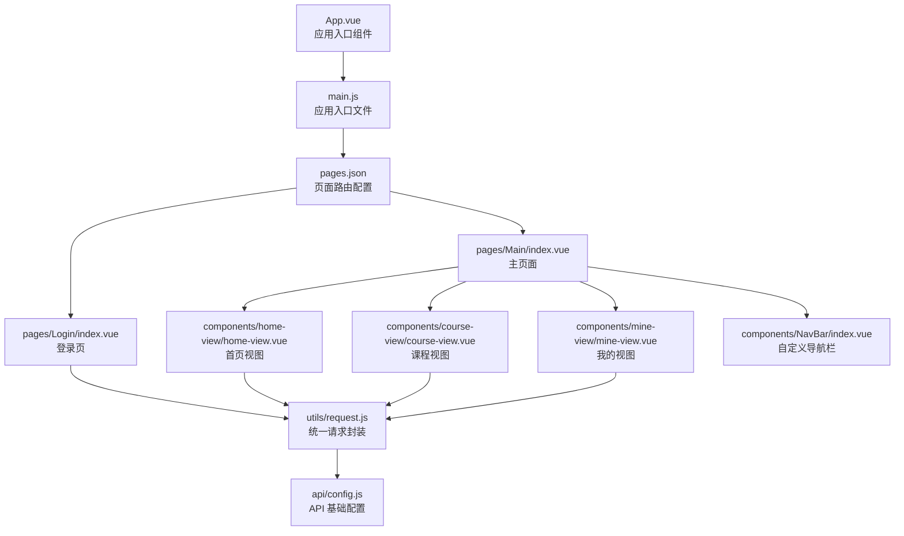
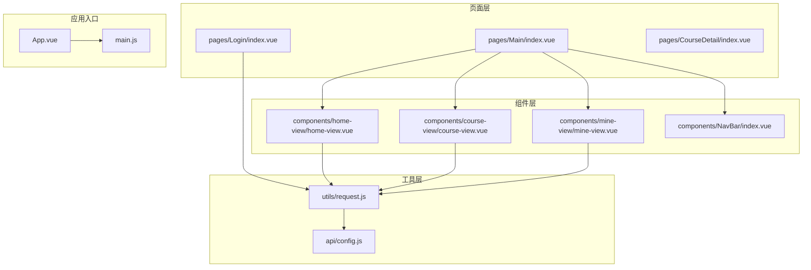
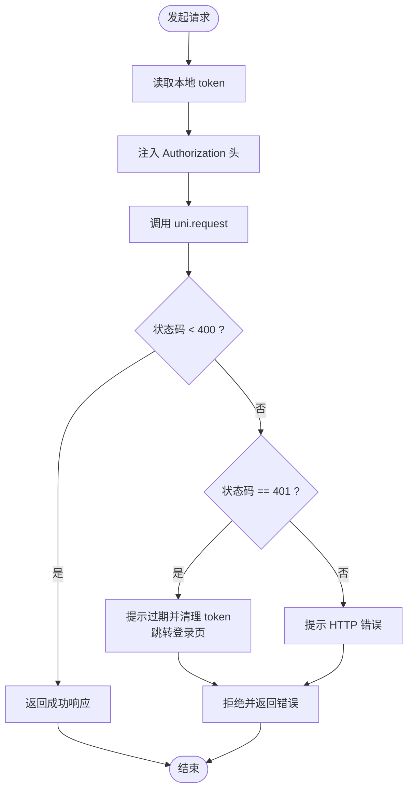
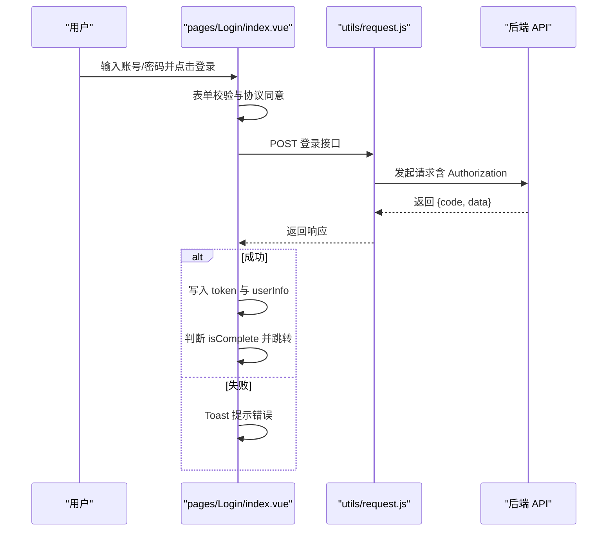
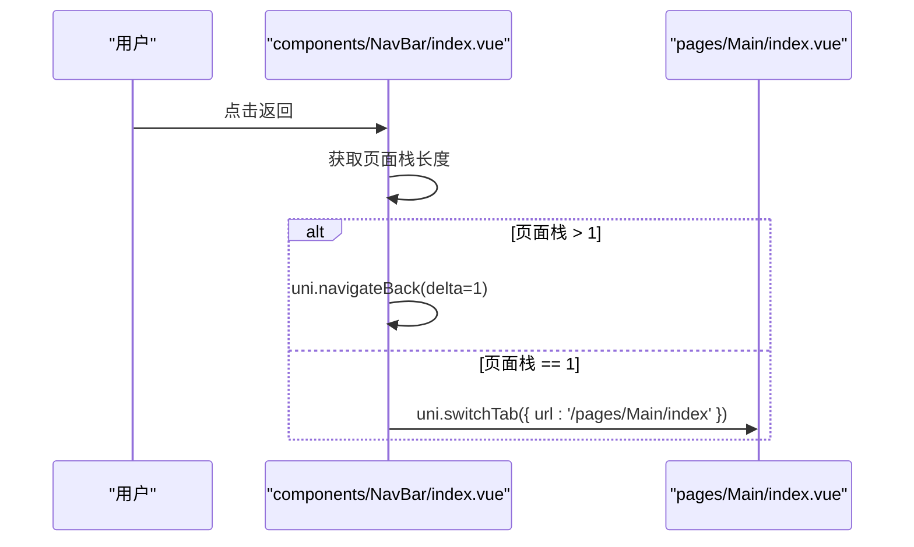
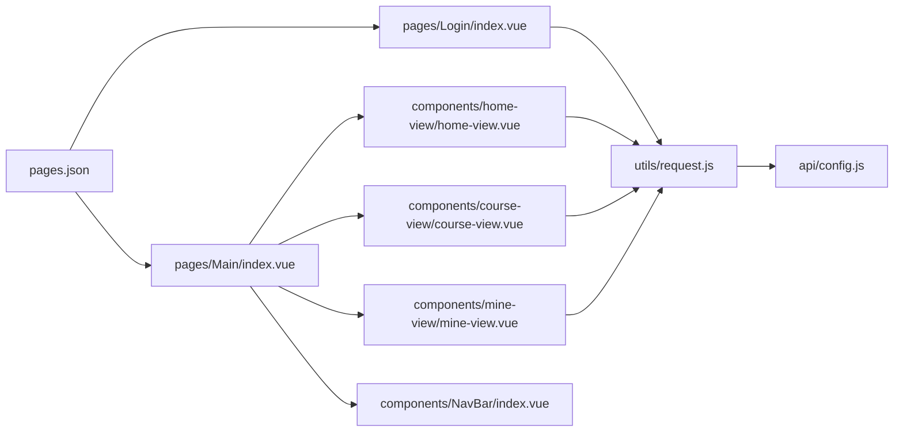

# 故障排查与监控

<cite>
**本文引用的文件**
- [main.js](file://main.js)
- [App.vue](file://App.vue)
- [utils/request.js](file://utils/request.js)
- [api/config.js](file://api/config.js)
- [pages/Login/index.vue](file://pages/Login/index.vue)
- [pages/Main/index.vue](file://pages/Main/index.vue)
- [components/NavBar/index.vue](file://components/NavBar/index.vue)
- [components/home-view/home-view.vue](file://components/home-view/home-view.vue)
- [components/course-view/course-view.vue](file://components/course-view/course-view.vue)
- [components/mine-view/mine-view.vue](file://components/mine-view/mine-view.vue)
- [pages.json](file://pages.json)
- [doc/README.md](file://doc/README.md)
- [doc/Uniapp_STRUCTURE.md](file://doc/Uniapp_STRUCTURE.md)
- [doc/课程报名400错误完整排查报告.md](file://doc/课程报名400错误完整排查报告.md)
</cite>

## 目录
1. [简介](#简介)
2. [项目结构](#项目结构)
3. [核心组件](#核心组件)
4. [架构总览](#架构总览)
5. [详细组件分析](#详细组件分析)
6. [依赖分析](#依赖分析)
7. [性能考虑](#性能考虑)
8. [故障排查指南](#故障排查指南)
9. [结论](#结论)
10. [附录](#附录)

## 简介
本指南面向致良知教育项目，聚焦前端故障排查与监控，覆盖登录失败、网络请求错误、页面加载异常等常见问题；解释日志收集与分析方法（前端错误监控与后端 API 错误追踪）；提供性能监控指标与优化建议（首屏加载时间、页面切换性能、内存使用）；明确紧急响应流程与问题升级机制；阐述用户体验监控与崩溃报告收集策略，帮助一线与二线工程师快速定位与解决线上问题。

## 项目结构
项目采用 uni-app + Vue 技术栈，页面通过 pages.json 配置路由与样式，API 配置集中于 api/config.js，网络请求统一封装在 utils/request.js，登录、主页面、课程、我的等模块分布在 pages 与 components 目录中。

**图表来源**
- [main.js:1-26](file://main.js#L1-L26)
- [App.vue:1-40](file://App.vue#L1-L40)
- [pages.json:1-131](file://pages.json#L1-L131)
- [api/config.js:1-60](file://api/config.js#L1-L60)
- [utils/request.js:1-98](file://utils/request.js#L1-L98)
- [pages/Login/index.vue:1-900](file://pages/Login/index.vue#L1-L900)
- [pages/Main/index.vue:1-224](file://pages/Main/index.vue#L1-L224)
- [components/home-view/home-view.vue:1-772](file://components/home-view/home-view.vue#L1-L772)
- [components/course-view/course-view.vue:1-496](file://components/course-view/course-view.vue#L1-L496)
- [components/mine-view/mine-view.vue:1-910](file://components/mine-view/mine-view.vue#L1-L910)
- [components/NavBar/index.vue:1-68](file://components/NavBar/index.vue#L1-L68)

**章节来源**
- [doc/README.md:1-259](file://doc/README.md#L1-L259)
- [doc/Uniapp_STRUCTURE.md:1-387](file://doc/Uniapp_STRUCTURE.md#L1-L387)
- [pages.json:1-131](file://pages.json#L1-L131)

## 核心组件
- 应用入口与生命周期：App.vue 提供 App Launch/Show/Hide 日志；main.js 支持 Vue2/Vue3 创建应用并全局注册组件。
- API 配置：api/config.js 统一管理 baseUrl 与各接口路径，支持开发/生产环境切换。
- 网络请求：utils/request.js 统一封装 uni.request，自动注入 Authorization，处理 401 未授权与通用错误提示。
- 登录流程：pages/Login/index.vue 负责账号密码与微信登录，携带协议同意、表单校验、跳转逻辑与错误提示。
- 主页面与导航：pages/Main/index.vue 提供底部导航与页面切换；components/NavBar/index.vue 提供智能返回逻辑。
- 课程与我的：components/course-view/course-view.vue 与 components/mine-view/mine-view.vue 分别负责课程列表与用户信息展示、身份切换、退出登录等。

**章节来源**
- [App.vue:1-40](file://App.vue#L1-L40)
- [main.js:1-26](file://main.js#L1-L26)
- [api/config.js:1-60](file://api/config.js#L1-L60)
- [utils/request.js:1-98](file://utils/request.js#L1-L98)
- [pages/Login/index.vue:1-900](file://pages/Login/index.vue#L1-L900)
- [pages/Main/index.vue:1-224](file://pages/Main/index.vue#L1-L224)
- [components/NavBar/index.vue:1-68](file://components/NavBar/index.vue#L1-L68)
- [components/course-view/course-view.vue:1-496](file://components/course-view/course-view.vue#L1-L496)
- [components/mine-view/mine-view.vue:1-910](file://components/mine-view/mine-view.vue#L1-L910)

## 架构总览
前端采用“页面 + 组件 + 工具层”的分层架构，页面负责路由与布局，组件负责功能模块，工具层负责网络与通用逻辑。API 配置集中管理，请求封装统一处理鉴权与错误。

**图表来源**
- [pages/Login/index.vue:1-900](file://pages/Login/index.vue#L1-L900)
- [pages/Main/index.vue:1-224](file://pages/Main/index.vue#L1-L224)
- [components/home-view/home-view.vue:1-772](file://components/home-view/home-view.vue#L1-L772)
- [components/course-view/course-view.vue:1-496](file://components/course-view/course-view.vue#L1-L496)
- [components/mine-view/mine-view.vue:1-910](file://components/mine-view/mine-view.vue#L1-L910)
- [components/NavBar/index.vue:1-68](file://components/NavBar/index.vue#L1-L68)
- [utils/request.js:1-98](file://utils/request.js#L1-L98)
- [api/config.js:1-60](file://api/config.js#L1-L60)
- [App.vue:1-40](file://App.vue#L1-L40)
- [main.js:1-26](file://main.js#L1-L26)

## 详细组件分析

### 统一请求封装与错误处理
- 自动注入 Authorization 头，支持后端 Token 校验。
- 401 未授权：提示登录过期、清除本地 token、跳转登录页。
- 其他 HTTP 错误：Toast 提示状态码。
- 网络失败：Toast 提示网络异常。

**图表来源**
- [utils/request.js:1-98](file://utils/request.js#L1-L98)

**章节来源**
- [utils/request.js:1-98](file://utils/request.js#L1-L98)

### 登录流程与跳转
- 表单校验：账号/密码非空、密码长度校验。
- 账号密码登录：POST 登录接口，成功后写入 token 与用户信息，按 isComplete 决定跳转补全页或首页。
- 微信登录：获取 code，弹窗选择头像与昵称，提交后写入 token 与用户信息，跳转首页。
- 登录态异常：统一 Toast 提示与错误日志。

**图表来源**
- [pages/Login/index.vue:177-282](file://pages/Login/index.vue#L177-L282)
- [utils/request.js:1-98](file://utils/request.js#L1-L98)
- [api/config.js:15-37](file://api/config.js#L15-L37)

**章节来源**
- [pages/Login/index.vue:177-282](file://pages/Login/index.vue#L177-L282)
- [api/config.js:15-37](file://api/config.js#L15-L37)

### 主页面与导航
- 底部导航：主页、课程、我的、聊天四个标签页。
- 智能返回：NavBar 组件根据页面栈决定 uni.navigateBack 或 uni.switchTab。
- 页面切换：Main 页面通过 v-show 控制子视图显示。

**图表来源**
- [components/NavBar/index.vue:39-48](file://components/NavBar/index.vue#L39-L48)
- [pages/Main/index.vue:105-114](file://pages/Main/index.vue#L105-L114)

**章节来源**
- [components/NavBar/index.vue:39-48](file://components/NavBar/index.vue#L39-L48)
- [pages/Main/index.vue:105-114](file://pages/Main/index.vue#L105-L114)

### 课程列表与我的信息
- 课程视图：按 tabType 加载课程列表，支持继续学习/查看证书/查看存档等操作。
- 我的信息：展示用户资料、身份切换、退出登录，统一使用请求封装与 API 配置。

**章节来源**
- [components/course-view/course-view.vue:160-193](file://components/course-view/course-view.vue#L160-L193)
- [components/mine-view/mine-view.vue:204-376](file://components/mine-view/mine-view.vue#L204-L376)

## 依赖分析
- 页面路由：pages.json 统一声明页面路径与样式，支持自定义导航栏与页面切换动画。
- 组件耦合：Main 页面聚合多个视图组件，组件间通过事件与路由进行解耦。
- 请求依赖：各页面/组件均依赖 utils/request.js 与 api/config.js，形成统一依赖面。

**图表来源**
- [pages.json:1-131](file://pages.json#L1-L131)
- [pages/Login/index.vue:1-900](file://pages/Login/index.vue#L1-L900)
- [pages/Main/index.vue:1-224](file://pages/Main/index.vue#L1-L224)
- [components/home-view/home-view.vue:1-772](file://components/home-view/home-view.vue#L1-L772)
- [components/course-view/course-view.vue:1-496](file://components/course-view/course-view.vue#L1-L496)
- [components/mine-view/mine-view.vue:1-910](file://components/mine-view/mine-view.vue#L1-L910)
- [components/NavBar/index.vue:1-68](file://components/NavBar/index.vue#L1-L68)
- [utils/request.js:1-98](file://utils/request.js#L1-L98)
- [api/config.js:1-60](file://api/config.js#L1-L60)

**章节来源**
- [pages.json:1-131](file://pages.json#L1-L131)
- [utils/request.js:1-98](file://utils/request.js#L1-L98)
- [api/config.js:1-60](file://api/config.js#L1-L60)

## 性能考虑
- 首屏加载时间
  - 登录页：减少首次渲染动画与懒加载，避免长时间 loading。
  - 主页：组件懒加载与按需渲染，避免一次性渲染过多节点。
- 页面切换性能
  - 使用 uni.switchTab 与 uni.navigateTo 的合理选择，减少不必要的页面重建。
  - 避免在切换过程中频繁触发网络请求。
- 内存使用
  - 合理释放页面栈与组件实例，避免循环引用。
  - 统一使用本地存储（token、userInfo）减少重复请求与内存占用。
- 网络优化
  - 复用请求封装，避免重复拼接 URL 与重复注入头。
  - 对高频接口进行缓存策略设计（如课程列表）。

[本节为通用性能建议，不直接分析具体文件]

## 故障排查指南

### 登录失败
- 症状
  - 账号密码登录失败或提示“登录失败，请检查账号密码”。
  - 微信登录授权失败或提示“微信授权失败”。
- 诊断步骤
  - 检查 pages/Login/index.vue 的表单校验与协议同意逻辑。
  - 确认 API 地址与路径（api/config.js）是否正确。
  - 观察 utils/request.js 是否正确注入 Authorization。
  - 查看网络面板与控制台错误日志。
- 解决方案
  - 修正账号/密码长度规则与提示文案。
  - 确保登录接口返回的 token 与 userInfo 正确写入本地存储。
  - 若后端返回 401，统一走“登录过期”处理流程。

**章节来源**
- [pages/Login/index.vue:177-282](file://pages/Login/index.vue#L177-L282)
- [api/config.js:15-37](file://api/config.js#L15-L37)
- [utils/request.js:1-98](file://utils/request.js#L1-L98)

### 网络请求错误
- 症状
  - “网络连接异常”提示；HTTP 状态码 ≥ 400。
- 诊断步骤
  - 检查 utils/request.js 的错误处理分支与 Toast 提示。
  - 核对 api/config.js 的 baseUrl 与接口路径。
  - 使用微信开发者工具 Network 面板抓取请求与响应。
- 解决方案
  - 修复后端接口状态码与消息体，避免返回 4xx/5xx。
  - 前端统一提示“网络异常”，引导用户重试。

**章节来源**
- [utils/request.js:58-66](file://utils/request.js#L58-L66)
- [api/config.js:15-37](file://api/config.js#L15-L37)

### 页面加载异常
- 症状
  - 首页/课程页空白或加载缓慢；跳转失败。
- 诊断步骤
  - 检查 pages/Main/index.vue 的底部导航与子视图显示逻辑。
  - 查看 components/NavBar/index.vue 的返回逻辑是否命中 uni.switchTab。
  - 使用 pages.json 的 navigationStyle 与动画配置排查样式与动画问题。
- 解决方案
  - 修复 uni.navigateTo/uni.reLaunch 的目标路径与 fail 回调。
  - 优化组件渲染与懒加载策略。

**章节来源**
- [pages/Main/index.vue:105-114](file://pages/Main/index.vue#L105-L114)
- [components/NavBar/index.vue:39-48](file://components/NavBar/index.vue#L39-L48)
- [pages.json:1-131](file://pages.json#L1-L131)

### 课程报名 400 错误
- 症状
  - “当前营期不可报名”提示；后端返回 400。
- 诊断步骤
  - 前端：确认 CampEnroll 页面的 campId、isCampEnded、isEnrolled 校验逻辑。
  - 后端：在后端仓库搜索“当前营期不可报名”字符串，定位抛出位置与校验逻辑。
- 解决方案
  - 前端：完善错误提示与用户引导（例如“营期已结束/已结缘”）。
  - 后端：返回更详细的错误信息（如 reason、campId），便于前端精准提示。

**章节来源**
- [doc/课程报名400错误完整排查报告.md:1-372](file://doc/课程报名400错误完整排查报告.md#L1-L372)

### 日志收集与分析
- 前端错误监控
  - 使用 uni.showToast 作为统一错误提示，配合 console.error 输出堆栈。
  - 在关键流程（登录、跳转、网络请求）添加日志，便于回溯。
- 后端 API 错误追踪
  - 统一返回结构 { code, message, data }，前端据此分支处理。
  - 建议后端记录请求 ID 与用户上下文，便于跨端关联。

**章节来源**
- [pages/Login/index.vue:262-281](file://pages/Login/index.vue#L262-L281)
- [utils/request.js:28-66](file://utils/request.js#L28-L66)
- [doc/课程报名400错误完整排查报告.md:345-356](file://doc/课程报名400错误完整排查报告.md#L345-L356)

### 用户体验监控与崩溃报告
- 用户体验监控
  - 记录页面停留时长、点击热力图（通过埋点上报）。
  - 监控关键路径成功率（登录、报名、课程详情进入）。
- 崩溃报告收集
  - 前端：捕获全局未处理异常，上报错误信息与用户操作轨迹。
  - 后端：记录接口异常堆栈与请求上下文，设置告警阈值。

[本节为通用建议，不直接分析具体文件]

### 紧急响应流程与问题升级机制
- 一级响应（值班工程师）
  - 快速复现问题，收集日志与截图。
  - 评估影响范围与紧急程度，必要时回滚最近变更。
- 二级响应（技术负责人）
  - 组织跨端联调，定位后端接口问题或前端逻辑缺陷。
  - 制定临时修复方案（如降级接口、提示文案优化）。
- 三级响应（架构评审）
  - 对复杂问题进行根因分析，输出改进措施与回归计划。

[本节为通用流程建议，不直接分析具体文件]

## 结论
本指南围绕致良知教育项目的前端架构与关键流程，提供了从登录、网络、页面到性能与监控的系统化排查与优化建议。通过统一的请求封装、清晰的路由与组件边界、完善的日志与错误提示，能够有效缩短故障定位时间并提升用户体验。建议在后续迭代中补充埋点与监控告警，完善问题升级与回滚机制。

## 附录
- 常用文件路径参考
  - 登录页：pages/Login/index.vue
  - 主页面：pages/Main/index.vue
  - 统一请求：utils/request.js
  - API 配置：api/config.js
  - 页面路由：pages.json

[本节为索引，不直接分析具体文件]