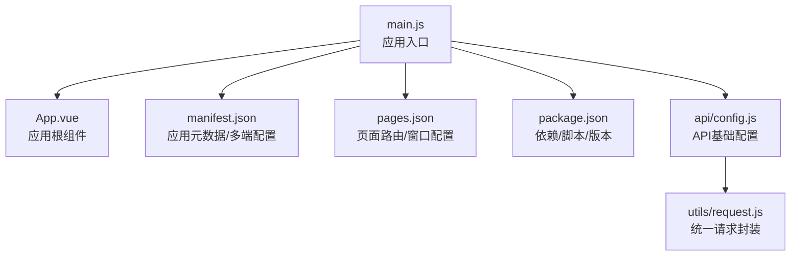
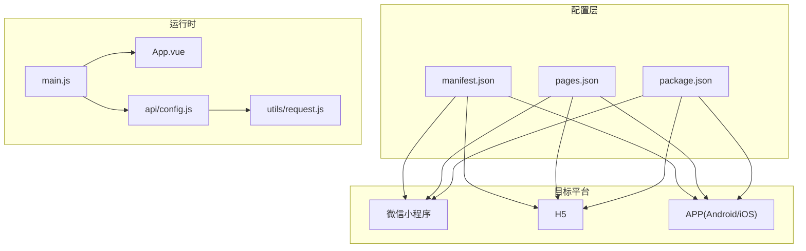
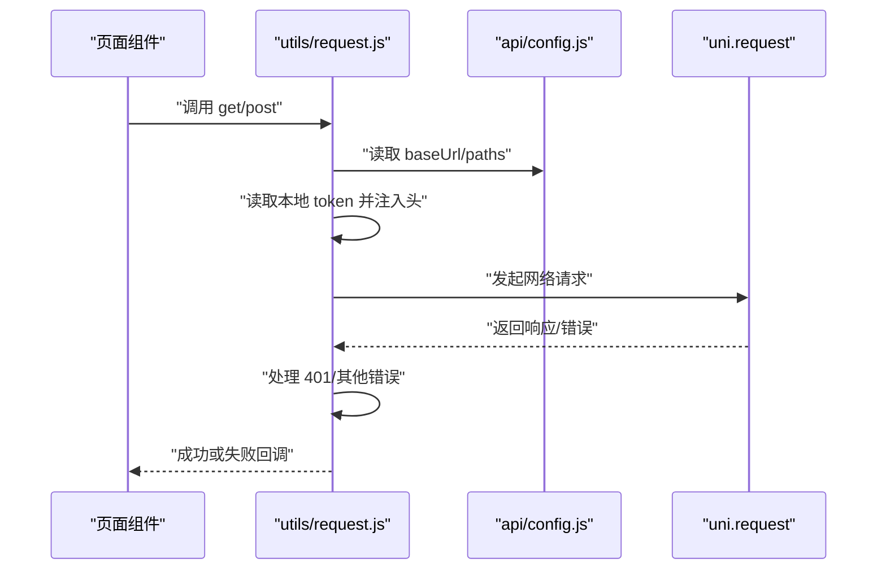
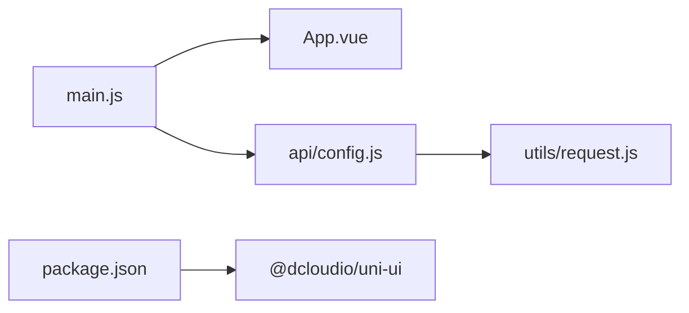

# 构建配置

<cite>
**本文引用的文件**
- [manifest.json](file://manifest.json)
- [pages.json](file://pages.json)
- [package.json](file://package.json)
- [main.js](file://main.js)
- [App.vue](file://App.vue)
- [api/config.js](file://api/config.js)
- [.gitignore](file://.gitignore)
- [utils/request.js](file://utils/request.js)
</cite>

## 目录
1. [简介](#简介)
2. [项目结构](#项目结构)
3. [核心组件](#核心组件)
4. [架构总览](#架构总览)
5. [详细组件分析](#详细组件分析)
6. [依赖分析](#依赖分析)
7. [性能考虑](#性能考虑)
8. [故障排查指南](#故障排查指南)
9. [结论](#结论)
10. [附录](#附录)

## 简介
本文件面向“致良知教育”uni-app项目，系统化梳理构建配置与多端打包要点，覆盖以下方面：
- manifest.json：应用元数据、多端打包与权限配置
- pages.json：页面路由、分包策略与窗口配置
- package.json：依赖管理、脚本命令与版本控制
- 不同平台（微信小程序、H5、APP）的构建参数与优化策略
- 构建环境变量配置与资源打包优化技巧

## 项目结构
该项目采用标准 uni-app 目录组织，关键配置集中在根目录的 manifest.json、pages.json、package.json、main.js、App.vue，并通过 api/config.js 统一管理后端接口配置。

图表来源
- [main.js:1-26](file://main.js#L1-L26)
- [App.vue:1-40](file://App.vue#L1-L40)
- [manifest.json:1-73](file://manifest.json#L1-L73)
- [pages.json:1-131](file://pages.json#L1-L131)
- [package.json:1-6](file://package.json#L1-L6)
- [api/config.js:1-60](file://api/config.js#L1-L60)
- [utils/request.js:1-98](file://utils/request.js#L1-L98)

章节来源
- [main.js:1-26](file://main.js#L1-L26)
- [App.vue:1-40](file://App.vue#L1-L40)
- [manifest.json:1-73](file://manifest.json#L1-L73)
- [pages.json:1-131](file://pages.json#L1-L131)
- [package.json:1-6](file://package.json#L1-L6)
- [api/config.js:1-60](file://api/config.js#L1-L60)
- [utils/request.js:1-98](file://utils/request.js#L1-L98)

## 核心组件
- 应用入口与运行时
  - main.js：区分 Vue2/Vue3 运行时，注册全局组件，挂载应用
  - App.vue：全局样式与主题变量定义
- 配置中心
  - manifest.json：应用名称、版本、平台特定配置（Android 权限、iOS 发布配置、小程序 appid、编译选项等）
  - pages.json：页面路由、导航栏样式、全局样式、easycom 组件自动扫描规则
  - package.json：依赖声明与最小化脚本占位
- 接口与网络
  - api/config.js：统一 API 基础地址与接口路径
  - utils/request.js：统一请求封装、Token 注入、错误处理与跳转

章节来源
- [main.js:1-26](file://main.js#L1-L26)
- [App.vue:1-40](file://App.vue#L1-L40)
- [manifest.json:1-73](file://manifest.json#L1-L73)
- [pages.json:1-131](file://pages.json#L1-L131)
- [package.json:1-6](file://package.json#L1-L6)
- [api/config.js:1-60](file://api/config.js#L1-L60)
- [utils/request.js:1-98](file://utils/request.js#L1-L98)

## 架构总览
下图展示 uni-app 在不同平台下的构建与运行关系，以及关键配置文件如何影响打包结果。

图表来源
- [manifest.json:1-73](file://manifest.json#L1-L73)
- [pages.json:1-131](file://pages.json#L1-L131)
- [package.json:1-6](file://package.json#L1-L6)
- [main.js:1-26](file://main.js#L1-L26)
- [App.vue:1-40](file://App.vue#L1-L40)
- [api/config.js:1-60](file://api/config.js#L1-L60)
- [utils/request.js:1-98](file://utils/request.js#L1-L98)

## 详细组件分析

### manifest.json：应用元数据、多端打包与权限
- 应用基础信息
  - 名称、描述、版本号、版本码、px 转 rpx 行为开关
- APP 打包配置（app-plus）
  - 使用组件化、nvue 编译器版本、编译器版本
  - 启动页配置（显示策略、等待、自动关闭、延时）
  - 模块与分发配置占位
- Android 权限清单
  - 网络状态、振动、日志、WiFi、相机、唤醒锁、闪光灯等权限
  - 硬件特性声明（自动对焦、摄像头）
- 平台特定配置
  - mp-weixin：小程序 appid、调试校验开关、使用组件化
  - 其他小程序平台（支付宝、百度、头条）均启用组件化
- 统计与 Vue 版本
  - 统计开关、Vue 版本声明

章节来源
- [manifest.json:1-73](file://manifest.json#L1-L73)

### pages.json：页面路由、分包策略与窗口配置
- easycom 自动扫描
  - 开启 autoscan，自定义 uni-* 组件映射规则
- 页面列表
  - 登录、主页面、证书、我的资料、申请管理员、课程详情、志愿者相关、聊天群组等页面
  - 每个页面可独立设置导航样式、标题文本、动画类型与时长
- 全局样式
  - 导航栏样式、标题文本、背景色、顶部/底部背景色
- 其他配置
  - uniIdRouter 占位对象

注意：当前仓库未见显式的分包配置字段（如 subPackages）。若需分包，请在 pages.json 对应位置添加分包规则以实现首屏优化。

章节来源
- [pages.json:1-131](file://pages.json#L1-L131)

### package.json：依赖管理、脚本命令与版本控制
- 依赖
  - @dcloudio/uni-ui：UI 组件库
- 脚本命令
  - 当前仓库未包含脚本命令定义，建议在实际工程中补充 build/dev 等命令
- 版本控制
  - 通过 manifest.json 的 versionName/versionCode 控制版本迭代

章节来源
- [package.json:1-6](file://package.json#L1-L6)
- [manifest.json:5-6](file://manifest.json#L5-L6)

### main.js 与 App.vue：运行时与全局样式
- main.js
  - Vue2/Vue3 双栈兼容入口
  - 全局注册 NavBar 组件
  - 设置 App.mpType 为 app
- App.vue
  - 定义全局主题变量（品牌色、卡片色）
  - 强制重写小程序 page 背景色与最小高度
  - 定义通用卡片样式类

章节来源
- [main.js:1-26](file://main.js#L1-L26)
- [App.vue:1-40](file://App.vue#L1-L40)

### API 配置与统一请求
- api/config.js
  - 基于 NODE_ENV 判断开发环境
  - 统一的 baseUrl 与接口路径集合
- utils/request.js
  - 自动从本地存储读取 token 并注入 Authorization 头
  - 自动拼接完整 URL（含 API 基地址）
  - 统一处理 401 未授权（提示、清理 token、跳转登录）、其他 HTTP 错误与网络异常

图表来源
- [utils/request.js:1-98](file://utils/request.js#L1-L98)
- [api/config.js:1-60](file://api/config.js#L1-L60)

章节来源
- [api/config.js:1-60](file://api/config.js#L1-L60)
- [utils/request.js:1-98](file://utils/request.js#L1-L98)

## 依赖分析
- 内部耦合
  - main.js 依赖 App.vue、全局组件注册
  - utils/request.js 依赖 api/config.js 的基础地址与路径
- 外部依赖
  - @dcloudio/uni-ui：UI 组件生态
- 构建产物
  - .gitignore 已忽略 unpackage/dist/build 等编译输出目录，避免提交无关文件

图表来源
- [main.js:1-26](file://main.js#L1-L26)
- [App.vue:1-40](file://App.vue#L1-L40)
- [api/config.js:1-60](file://api/config.js#L1-L60)
- [utils/request.js:1-98](file://utils/request.js#L1-L98)
- [package.json:1-6](file://package.json#L1-L6)

章节来源
- [.gitignore:1-32](file://.gitignore#L1-L32)
- [package.json:1-6](file://package.json#L1-L6)

## 性能考虑
- 页面与导航
  - 为关键页面设置 navigationStyle 为 custom，减少系统导航栏开销
  - 为课程详情页配置页面切换动画，兼顾体验与性能
- 组件与样式
  - 使用全局样式与主题变量，减少重复计算
  - easycom 自动扫描降低手动引入成本，提升开发效率
- 网络与缓存
  - 统一请求封装便于接入缓存策略与重试机制
  - 401 自动跳转登录，避免无效请求堆积
- 分包策略
  - 若页面较多，建议在 pages.json 中配置分包，拆分首屏与非首屏资源，缩短首屏加载时间

## 故障排查指南
- 构建产物污染
  - 确认 .gitignore 已忽略 unpackage/dist/build 等目录，避免将编译产物提交至版本库
- 小程序调试校验
  - mp-weixin.setting.urlCheck 默认关闭，便于本地联调；上线前按需开启
- Android 权限
  - 当前清单包含较多权限与硬件特性，上线前请按需裁剪，遵循最小权限原则
- 网络请求
  - 若出现 401，检查本地 token 是否存在与后端签发策略；确认 utils/request.js 的拦截逻辑生效
- 页面样式
  - 如小程序页面背景色异常，检查 App.vue 中 page 背景色与全局样式是否被覆盖

章节来源
- [.gitignore:1-32](file://.gitignore#L1-L32)
- [manifest.json:52-58](file://manifest.json#L52-L58)
- [manifest.json:24-41](file://manifest.json#L24-L41)
- [utils/request.js:24-66](file://utils/request.js#L24-L66)
- [App.vue:24-28](file://App.vue#L24-L28)

## 结论
本项目已具备清晰的配置分层与运行时结构：manifest.json 负责多端元数据与权限，pages.json 管控路由与窗口样式，main.js/App.vue 提供运行时与全局样式，api/config.js 与 utils/request.js 实现统一网络层。建议后续完善脚本命令、分包策略与权限裁剪，以进一步提升构建效率与上线质量。

## 附录

### 不同平台构建参数与优化策略
- 微信小程序
  - 在 manifest.json 的 mp-weixin 中配置 appid 与 setting，按需开启调试校验
  - 使用组件化提升兼容性
- H5
  - 通过 pages.json 的 globalStyle 统一导航与背景色
  - 注意移动端适配与 px/rpx 转换策略
- APP（Android/iOS）
  - Android 权限清单按需裁剪，避免过度授权
  - 启动页 splashscreen 配置用于改善首屏体验

章节来源
- [manifest.json:52-58](file://manifest.json#L52-L58)
- [manifest.json:24-41](file://manifest.json#L24-L41)
- [pages.json:121-129](file://pages.json#L121-L129)

### 构建环境变量与资源打包优化
- 环境变量
  - api/config.js 基于 NODE_ENV 判断开发环境，便于在不同环境切换 baseUrl
- 资源优化
  - 使用 easycom 自动扫描，减少手动引入
  - 合理拆分页面与组件，结合分包策略降低首屏体积
  - 统一请求封装便于接入缓存与重试

章节来源
- [api/config.js:5-10](file://api/config.js#L5-L10)
- [pages.json:2-7](file://pages.json#L2-L7)