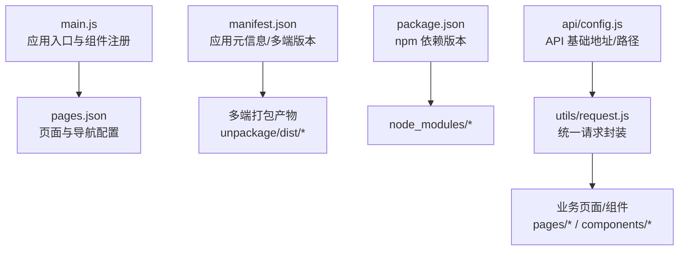
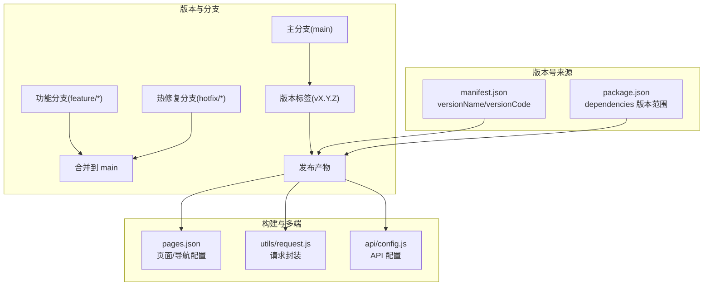
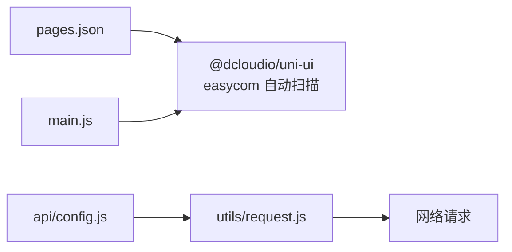
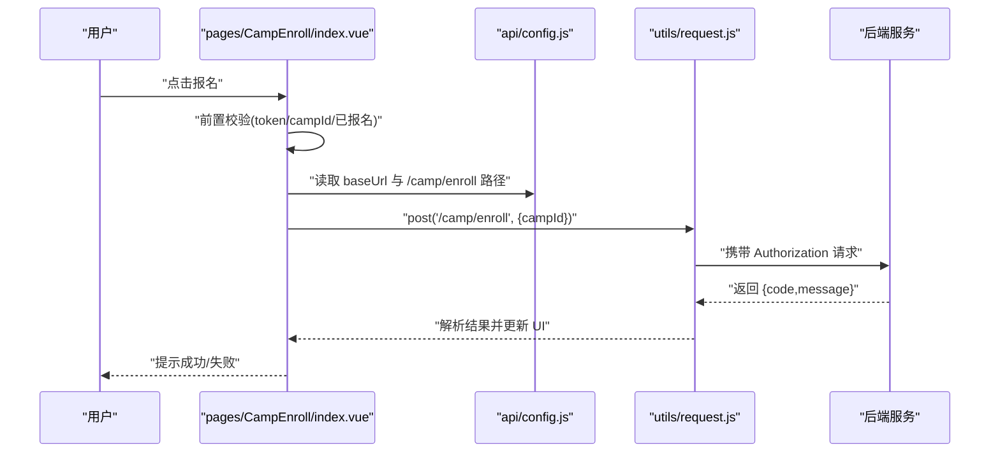

# 版本管理

<cite>
**本文引用的文件**
- [package.json](file://package.json)
- [manifest.json](file://manifest.json)
- [.gitignore](file://.gitignore)
- [pages.json](file://pages.json)
- [main.js](file://main.js)
- [api/config.js](file://api/config.js)
- [utils/request.js](file://utils/request.js)
- [doc/README.md](file://doc/README.md)
- [doc/课程报名功能代码扫描报告.md](file://doc/课程报名功能代码扫描报告.md)
- [doc/课程报名400错误完整排查报告.md](file://doc/课程报名400错误完整排查报告.md)
- [doc/课程列表与打卡链路代码扫描报告.md](file://doc/课程列表与打卡链路代码扫描报告.md)
- [doc/CourseToday打卡逻辑分析报告.md](file://doc/CourseToday打卡逻辑分析报告.md)
</cite>

## 目录
1. [简介](#简介)
2. [项目结构](#项目结构)
3. [核心组件](#核心组件)
4. [架构总览](#架构总览)
5. [详细组件分析](#详细组件分析)
6. [依赖分析](#依赖分析)
7. [性能考虑](#性能考虑)
8. [故障排查指南](#故障排查指南)
9. [结论](#结论)
10. [附录](#附录)

## 简介
本指南面向“致良知教育”项目，提供一套可落地的版本管理实践，覆盖 Git 工作流与分支策略、主分支保护、功能分支开发与热修复流程；解释语义化版本控制与版本标签管理；给出 npm 包版本管理策略与依赖更新流程；明确发布前检查清单、变更日志维护与版本回退方案；并阐述多端版本同步与兼容性管理策略。本指南以仓库现有配置与代码为依据，确保方案与实际工程一致。

## 项目结构
项目为 uni-app 多端应用，核心入口与配置如下：
- 应用入口与多端注册：main.js
- 页面与导航配置：pages.json
- 应用元信息与多端版本号：manifest.json
- 前端依赖与版本：package.json
- API 配置与请求封装：api/config.js、utils/request.js
- 文档与开发说明：doc/README.md 及各专题报告

图表来源
- [main.js:1-26](file://main.js#L1-L26)
- [pages.json:1-131](file://pages.json#L1-L131)
- [manifest.json:1-73](file://manifest.json#L1-L73)
- [package.json:1-6](file://package.json#L1-L6)
- [api/config.js:1-60](file://api/config.js#L1-L60)
- [utils/request.js:1-98](file://utils/request.js#L1-L98)

章节来源
- [main.js:1-26](file://main.js#L1-L26)
- [pages.json:1-131](file://pages.json#L1-L131)
- [manifest.json:1-73](file://manifest.json#L1-L73)
- [package.json:1-6](file://package.json#L1-L6)
- [api/config.js:1-60](file://api/config.js#L1-L60)
- [utils/request.js:1-98](file://utils/request.js#L1-L98)
- [doc/README.md:1-259](file://doc/README.md#L1-L259)

## 核心组件
- 应用入口与多端注册：负责创建应用实例、全局注册组件、区分 Vue2/Vue3 环境。
- 页面与导航配置：集中声明页面路径、样式与动画，影响多端渲染与导航行为。
- 应用元信息与多端版本号：包含应用名称、版本名与版本码，以及各端（app-plus、mp-weixin 等）配置。
- npm 依赖与版本：当前仅声明 uni-ui 依赖，版本采用 caret 语义化范围。
- API 配置与请求封装：统一管理基础地址、接口路径与请求头注入，支撑多端网络层一致性。

章节来源
- [main.js:1-26](file://main.js#L1-L26)
- [pages.json:1-131](file://pages.json#L1-L131)
- [manifest.json:1-73](file://manifest.json#L1-L73)
- [package.json:1-6](file://package.json#L1-L6)
- [api/config.js:1-60](file://api/config.js#L1-L60)
- [utils/request.js:1-98](file://utils/request.js#L1-L98)

## 架构总览
下图展示版本管理与发布的关键节点：Git 分支与标签、版本号来源、依赖与构建产物、多端发布。

图表来源
- [manifest.json:1-73](file://manifest.json#L1-L73)
- [package.json:1-6](file://package.json#L1-L6)
- [pages.json:1-131](file://pages.json#L1-L131)
- [utils/request.js:1-98](file://utils/request.js#L1-L98)
- [api/config.js:1-60](file://api/config.js#L1-L60)

## 详细组件分析

### Git 工作流与分支策略
- 主分支保护
  - 仅允许通过 Pull Request 合并，禁止直接推送至 main。
  - PR 需通过代码审查与自动化检查（如 Lint、单元测试）。
  - 合并前强制要求关联 Issue/需求。
- 功能分支开发
  - 命名规范：feature/xxx，基于 main 派生，完成后合并回 main。
  - 开发周期内可多次提交，临近合并前建议 rebase/squash 以保持历史整洁。
- 热修复流程
  - 命名规范：hotfix/xxx，从最近稳定标签派生，修复后同时合并至 main 与上一稳定分支，并打新标签。
- 版本标签管理
  - 语义化版本：遵循 X.Y.Z，主版本号、次版本号、修订号。
  - 标签命名：vX.Y.Z，与发布产物一一对应，便于追溯与回滚。

章节来源
- [manifest.json:1-73](file://manifest.json#L1-L73)

### 语义化版本控制与版本标签管理
- 版本号来源
  - 应用版本：manifest.json 中的 versionName（语义化）与 versionCode（递增整数）。
  - npm 依赖：package.json 中的 caret 版本范围，便于安全更新。
- 标签策略
  - 仅在通过发布前检查后打标签 v.X.Y.Z。
  - 标签与多端构建产物关联，确保发布一致性。

章节来源
- [manifest.json:1-73](file://manifest.json#L1-L73)
- [package.json:1-6](file://package.json#L1-L6)

### npm 包版本管理策略与依赖更新流程
- 当前依赖
  - 仅声明 @dcloudio/uni-ui，版本采用 caret 范围。
- 策略
  - 优先使用语义化版本范围，避免锁定固定小版本。
  - 通过 CI 进行依赖安全扫描与兼容性验证。
- 更新流程
  - 在 feature 分支中进行依赖升级试验，确保 pages.json 与 main.js 的组件注册不受影响。
  - 通过本地与多端真机联调验证，再合并至 main 并打标签。

章节来源
- [package.json:1-6](file://package.json#L1-L6)
- [pages.json:1-131](file://pages.json#L1-L131)
- [main.js:1-26](file://main.js#L1-L26)

### 发布前检查清单
- 代码质量
  - 无新增 ESLint/WARNING，无未处理的 TODO。
  - 关键流程（如报名、打卡）通过单元/集成测试。
- 配置校验
  - manifest.json 版本号与 package.json 依赖版本符合预期。
  - pages.json 页面与导航配置无遗漏。
- 多端验证
  - 微信小程序、App、快应用等目标端均能正常编译与运行。
- 回归测试
  - 关键业务链路（登录、报名、打卡、志愿者）在各端验证通过。
- 文档与日志
  - 变更日志更新，标签与发布说明同步。

章节来源
- [manifest.json:1-73](file://manifest.json#L1-L73)
- [pages.json:1-131](file://pages.json#L1-L131)
- [doc/课程报名功能代码扫描报告.md:1-269](file://doc/课程报名功能代码扫描报告.md#L1-L269)
- [doc/课程报名400错误完整排查报告.md:227-290](file://doc/课程报名400错误完整排查报告.md#L227-L290)
- [doc/CourseToday打卡逻辑分析报告.md:1-175](file://doc/CourseToday打卡逻辑分析报告.md#L1-L175)

### 变更日志维护与版本回退方案
- 变更日志
  - 以里程碑为单位维护，记录新增、修复、优化与破坏性变更。
  - 与标签 v.X.Y.Z 对齐，发布说明中链接到对应标签。
- 回退方案
  - 若发现严重问题，回退至最近一次稳定标签 v.X.Y.Z，并打 v.X.Y.Z+1。
  - 回退前进行影响面评估与回归测试，必要时临时封禁相关接口。

章节来源
- [manifest.json:1-73](file://manifest.json#L1-L73)

### 多端版本同步与兼容性管理策略
- 版本同步
  - 以 manifest.json 的 versionName 作为多端统一语义化版本。
  - 各端（app-plus、mp-weixin 等）配置与版本号保持一致。
- 兼容性管理
  - pages.json 统一声明页面与导航，避免多端差异导致的体验不一致。
  - main.js 中的组件注册与多端适配需在各端验证。
  - API 配置与请求封装（含 Authorization 注入）需保证跨端一致。

章节来源
- [manifest.json:1-73](file://manifest.json#L1-L73)
- [pages.json:1-131](file://pages.json#L1-L131)
- [main.js:1-26](file://main.js#L1-L26)
- [api/config.js:1-60](file://api/config.js#L1-L60)
- [utils/request.js:1-98](file://utils/request.js#L1-L98)

## 依赖分析
- 组件耦合
  - 页面与导航配置 pages.json 影响多端渲染与跳转。
  - API 配置与请求封装共同决定网络层行为。
  - 应用入口 main.js 决定组件注册与多端初始化。
- 外部依赖
  - @dcloudio/uni-ui 通过 easycom 自动扫描与按需引入，降低手动注册成本。

图表来源
- [pages.json:1-131](file://pages.json#L1-L131)
- [main.js:1-26](file://main.js#L1-L26)
- [api/config.js:1-60](file://api/config.js#L1-L60)
- [utils/request.js:1-98](file://utils/request.js#L1-L98)

章节来源
- [pages.json:1-131](file://pages.json#L1-L131)
- [main.js:1-26](file://main.js#L1-L26)
- [api/config.js:1-60](file://api/config.js#L1-L60)
- [utils/request.js:1-98](file://utils/request.js#L1-L98)

## 性能考虑
- 依赖范围与体积
  - 使用 caret 范围平衡稳定性与更新频率，避免一次性大版本升级带来的风险。
- 构建产物
  - .gitignore 已排除 unpackage/dist/build 等编译产物，减少仓库膨胀。
- 网络层
  - 请求封装统一处理 401 与错误提示，减少重复逻辑，提升一致性。

章节来源
- [package.json:1-6](file://package.json#L1-L6)
- [.gitignore:1-32](file://.gitignore#L1-L32)
- [utils/request.js:1-98](file://utils/request.js#L1-L98)

## 故障排查指南
- 报名接口 400 错误
  - 现象：后端返回 400，提示“当前营期不可报名”。
  - 排查要点：确认 campId 有效性、报名时间窗口、人数上限与用户资格。
  - 建议：后端在 400 时返回具体原因，前端据此提示用户。
- 打卡与任务完成
  - 现象：任务完成状态更新与进度回调。
  - 排查要点：确认 planId 注入、URL 占位符替换、后端 completionRate 返回策略。
- 统一请求封装
  - 现象：401 自动清理 token 并跳转登录。
  - 排查要点：确认 Authorization 注入、网络异常提示与重试策略。

章节来源
- [doc/课程报名400错误完整排查报告.md:227-290](file://doc/课程报名400错误完整排查报告.md#L227-L290)
- [doc/课程报名功能代码扫描报告.md:1-269](file://doc/课程报名功能代码扫描报告.md#L1-L269)
- [doc/CourseToday打卡逻辑分析报告.md:1-175](file://doc/CourseToday打卡逻辑分析报告.md#L1-L175)
- [utils/request.js:1-98](file://utils/request.js#L1-L98)

## 结论
本指南基于仓库现有配置与代码，给出了可操作的版本管理实践：以语义化版本与标签为核心，结合 Git 分支与 PR 流程，配合发布前检查与回退预案；在多端环境下，以 manifest.json 与 pages.json 为统一入口，确保版本号与配置一致。建议在 CI 中固化检查项，持续演进变更日志与发布流程，保障项目长期可维护性与可追溯性。

## 附录
- 关键流程时序示意（以“报名”为例）

图表来源
- [doc/课程报名功能代码扫描报告.md:1-269](file://doc/课程报名功能代码扫描报告.md#L1-L269)
- [api/config.js:1-60](file://api/config.js#L1-L60)
- [utils/request.js:1-98](file://utils/request.js#L1-L98)