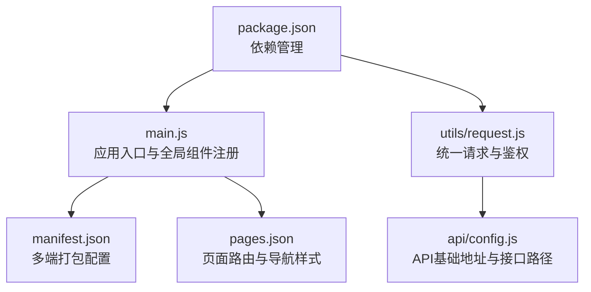
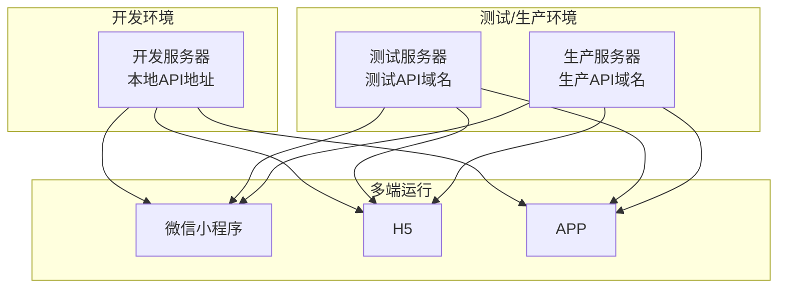
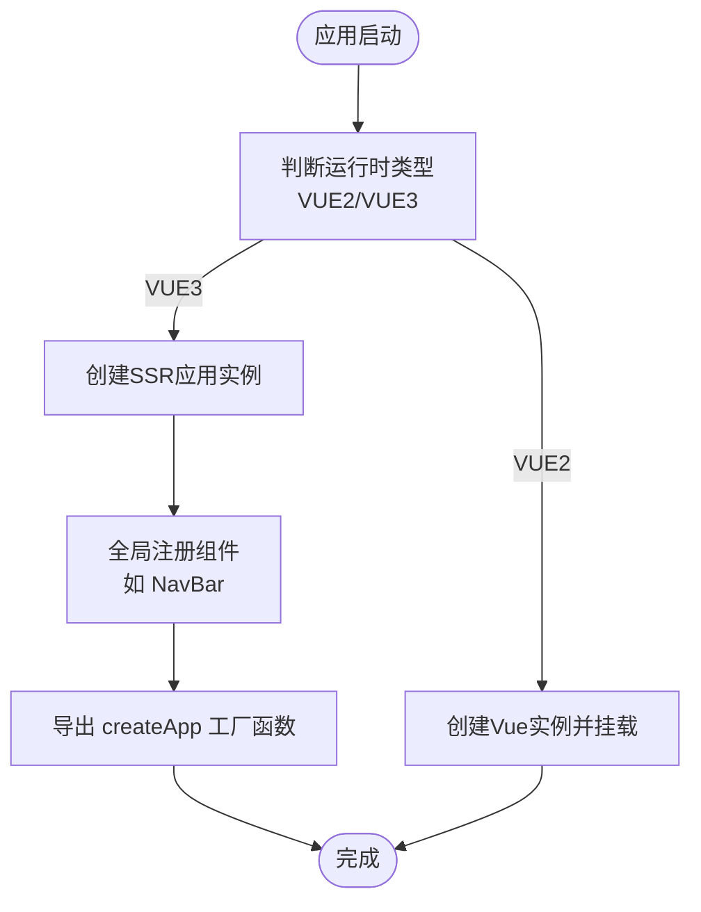
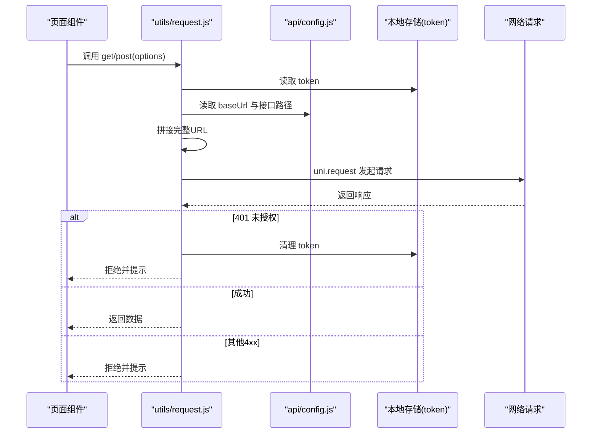
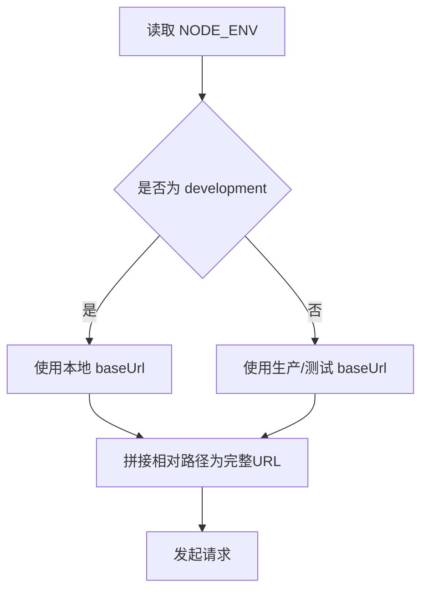
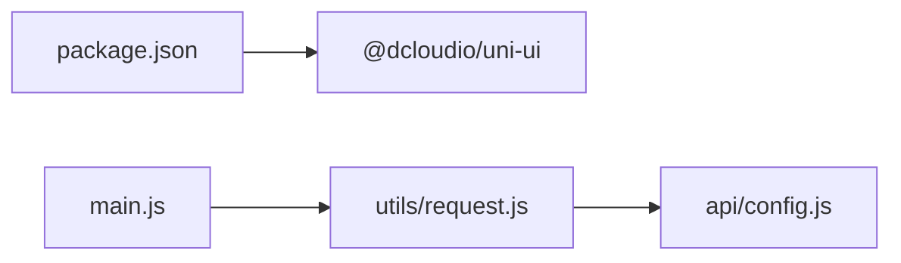

# 环境部署

<cite>
**本文引用的文件**
- [package.json](file://package.json)
- [main.js](file://main.js)
- [manifest.json](file://manifest.json)
- [pages.json](file://pages.json)
- [utils/request.js](file://utils/request.js)
- [api/config.js](file://api/config.js)
</cite>

## 目录
1. [简介](#简介)
2. [项目结构](#项目结构)
3. [核心组件](#核心组件)
4. [架构总览](#架构总览)
5. [详细组件分析](#详细组件分析)
6. [依赖分析](#依赖分析)
7. [性能考虑](#性能考虑)
8. [故障排除指南](#故障排除指南)
9. [结论](#结论)
10. [附录](#附录)

## 简介
本指南面向“致良知教育”项目，提供从开发到生产的环境部署与配置说明，并覆盖多端（微信小程序、H5、APP）部署要点、环境变量与 API 地址管理、CI/CD 设计与自动化脚本思路、版本发布与回滚策略以及灰度发布方案。文档以仓库现有配置为基础，结合实际可落地的工程实践进行说明。

## 项目结构
该项目基于 uni-app 生态，采用 Vue 3 SSR App 架构，支持多端编译与运行。关键目录与文件职责概览：
- 根级入口与运行时：main.js 负责应用初始化与全局组件注册；manifest.json 定义多端打包与分发配置；pages.json 描述页面路由与导航样式；package.json 管理依赖。
- API 层：utils/request.js 封装统一请求与鉴权头注入；api/config.js 集中管理 API 基础地址与接口路径。
- 页面与组件：pages/* 与 components/* 下的页面与通用组件按功能域组织。

图表来源
- [main.js:1-26](file://main.js#L1-L26)
- [manifest.json:1-73](file://manifest.json#L1-L73)
- [pages.json:1-131](file://pages.json#L1-L131)
- [utils/request.js:1-98](file://utils/request.js#L1-L98)
- [api/config.js:1-60](file://api/config.js#L1-L60)
- [package.json:1-6](file://package.json#L1-L6)

章节来源
- [main.js:1-26](file://main.js#L1-L26)
- [manifest.json:1-73](file://manifest.json#L1-L73)
- [pages.json:1-131](file://pages.json#L1-L131)
- [package.json:1-6](file://package.json#L1-L6)

## 核心组件
- 应用入口与多端适配：在 main.js 中通过条件编译区分 Vue 2/3，导出 createApp 工厂函数用于 uni-app 运行时；同时全局注册 NavBar 组件，便于各页面复用。
- 请求与鉴权：utils/request.js 统一封装 uni.request，自动从本地存储读取 token 并注入 Authorization 头；对 401 未授权进行统一处理并跳转登录页；对 4xx 错误进行提示与拒绝。
- API 配置：api/config.js 以常量形式定义开发环境基础地址与接口路径集合；通过 NODE_ENV 判定开发模式，便于后续替换为生产地址或环境变量。

章节来源
- [main.js:14-26](file://main.js#L14-L26)
- [utils/request.js:1-98](file://utils/request.js#L1-L98)
- [api/config.js:4-60](file://api/config.js#L4-L60)

## 架构总览
下图展示前端在不同环境下的部署与运行关系：开发环境使用本地后端地址；测试/生产环境指向线上域名；多端（小程序/H5/APP）共享同一套业务逻辑，通过 manifest.json 的端差异化配置实现打包与分发。

## 详细组件分析

### 组件一：应用入口与全局组件注册
- 功能要点
  - 条件编译：区分 VUE3 与非 VUE3 的运行时初始化方式。
  - 全局组件：在 VUE3 环境通过 app.component 注册 NavBar，减少重复引入。
  - 应用挂载：VUE2 路径下创建实例并挂载；VUE3 路径下导出 createApp 工厂函数。
- 部署影响
  - 多端运行时需保证全局组件在各端均可用。
  - 若新增全局组件，应在此处集中注册，避免页面分散引入。

图表来源
- [main.js:14-26](file://main.js#L14-L26)

章节来源
- [main.js:1-26](file://main.js#L1-L26)

### 组件二：统一请求与鉴权
- 功能要点
  - 自动注入 Authorization 头：从本地存储读取 token 并附加到请求头。
  - URL 拼接：若传入 url 为相对路径，则与 API_CONFIG.baseUrl 拼接为完整地址。
  - 错误处理：对 401 统一清理 token 并跳转登录；对 4xx 统一提示并拒绝。
- 部署影响
  - 不同环境的 API 地址由 API_CONFIG.baseUrl 决定，需在构建阶段或运行时注入。
  - 401 处理确保多端登录态一致性。

图表来源
- [utils/request.js:1-98](file://utils/request.js#L1-L98)
- [api/config.js:8-57](file://api/config.js#L8-L57)

章节来源
- [utils/request.js:1-98](file://utils/request.js#L1-L98)
- [api/config.js:8-57](file://api/config.js#L8-L57)

### 组件三：API 配置与环境变量
- 功能要点
  - 开发环境判定：通过 process.env.NODE_ENV === 'development' 判断当前环境。
  - 基础地址与路径：baseUrl 定义后端地址；paths 定义接口路径集合，支持模板占位符。
  - 可扩展性：可通过替换 baseUrl 或引入环境变量实现不同环境切换。
- 部署影响
  - 生产环境建议通过构建工具注入环境变量，避免硬编码。
  - 接口路径集中管理，便于联调与迁移。

图表来源
- [api/config.js:4-10](file://api/config.js#L4-L10)
- [api/config.js:15-56](file://api/config.js#L15-L56)

章节来源
- [api/config.js:4-60](file://api/config.js#L4-L60)

### 组件四：页面路由与导航样式
- 功能要点
  - pages.json 声明页面路径与样式，如导航栏标题、背景色、动画等。
  - globalStyle 统一设置导航风格与背景色。
  - easycom 自动扫描与组件映射，降低组件引入成本。
- 部署影响
  - 多端样式与导航行为由该文件统一约束，避免页面分散配置。
  - 新增页面需在此声明，确保多端一致渲染。

章节来源
- [pages.json:1-131](file://pages.json#L1-L131)

### 组件五：多端打包与分发配置
- 功能要点
  - manifest.json 定义应用名称、版本、权限与多端打包配置。
  - 小程序端（mp-weixin）包含 appid 与调试设置，便于开发者工具联调。
  - app-plus、quickapp、各小程序平台均可独立配置。
- 部署影响
  - 不同端的 appid、权限与分发策略在此集中管理。
  - 生产打包前需核对各端配置与签名。

章节来源
- [manifest.json:1-73](file://manifest.json#L1-L73)

## 依赖分析
- 运行时依赖
  - @dcloudio/uni-ui：提供 uni-ui 组件库，pages.json 中通过 easycom 自动映射。
- 构建与运行
  - main.js 作为入口，负责运行时初始化与全局组件注册。
  - utils/request.js 与 api/config.js 形成请求层闭环，贯穿各页面调用。

图表来源
- [package.json:1-6](file://package.json#L1-L6)
- [main.js:16-21](file://main.js#L16-L21)
- [utils/request.js:1](file://utils/request.js#L1)
- [api/config.js:1](file://api/config.js#L1)

章节来源
- [package.json:1-6](file://package.json#L1-L6)
- [main.js:16-21](file://main.js#L16-L21)
- [utils/request.js:1](file://utils/request.js#L1)
- [api/config.js:1](file://api/config.js#L1)

## 性能考虑
- 请求层优化
  - 合理缓存与去重：对高频接口在页面层做请求去重与结果缓存。
  - 超时与重试：在统一请求层增加超时控制与有限次重试，提升弱网体验。
- 构建优化
  - 按需引入组件：利用 easycom 与按需加载减少首屏体积。
  - 图片与静态资源：压缩与懒加载策略，降低包体与首屏时间。
- 多端一致性
  - 在 manifest.json 中统一配置权限与能力开关，避免端差异导致的二次构建。

## 故障排除指南
- 登录态失效（401）
  - 现象：收到 401 未授权提示，自动清理 token 并跳转登录页。
  - 排查：确认本地存储中 token 是否存在；检查后端签发与刷新机制。
- 网络异常
  - 现象：网络连接异常提示。
  - 排查：检查 API 地址拼接是否正确；确认域名与证书配置。
- 页面样式不一致
  - 现象：不同端样式差异。
  - 排查：核对 pages.json 中 globalStyle 与页面 style；检查 manifest.json 中端差异化配置。

章节来源
- [utils/request.js:24-67](file://utils/request.js#L24-L67)
- [pages.json:121-129](file://pages.json#L121-L129)
- [manifest.json:52-58](file://manifest.json#L52-L58)

## 结论
本指南基于现有配置梳理了“致良知教育”项目的部署要点与实施路径。通过集中化 API 配置、统一请求层与多端配置文件，可在不同环境与平台间实现稳定、可维护的交付。建议在后续迭代中完善 CI/CD 与灰度发布流程，进一步提升发布效率与质量。

## 附录

### 开发/测试/生产环境部署流程与配置差异
- 开发环境
  - 使用本地后端地址（api/config.js 中的 baseUrl），便于联调。
  - 本地开发服务器热更新，支持断点调试。
- 测试环境
  - 替换 baseUrl 为测试域名；核验小程序 appid 与调试设置。
  - 使用测试账号与数据，验证核心流程。
- 生产环境
  - 替换 baseUrl 为生产域名；关闭调试与日志级别。
  - 打包前校验 manifest.json 中各端配置与签名。

章节来源
- [api/config.js:8-10](file://api/config.js#L8-L10)
- [manifest.json:52-58](file://manifest.json#L52-L58)

### 多端部署步骤与注意事项
- 微信小程序
  - 在 manifest.json 的 mp-weixin 节点配置 appid 与调试设置；确保域名白名单与 TLS 版本满足要求。
- H5
  - 通过 pages.json 统一导航样式；注意跨域与 HTTPS 配置。
- APP
  - 在 app-plus 节点配置权限与分发参数；打包前准备签名与图标资源。

章节来源
- [manifest.json:52-58](file://manifest.json#L52-L58)
- [manifest.json:22-47](file://manifest.json#L22-L47)
- [pages.json:121-129](file://pages.json#L121-L129)

### 环境变量配置、域名切换与 API 地址管理
- 环境变量
  - 使用 NODE_ENV 区分开发/生产；在构建工具中注入 API 基础地址，避免硬编码。
- 域名切换
  - 通过替换 baseUrl 实现不同环境域名切换；接口路径集中于 paths，便于迁移。
- API 地址管理
  - 统一在 api/config.js 中维护；对外暴露 API_CONFIG 与 paths，供请求层使用。

章节来源
- [api/config.js:4-10](file://api/config.js#L4-L10)
- [api/config.js:8-57](file://api/config.js#L8-L57)

### CI/CD 流程设计与自动化部署脚本示例
- 流程设计
  - 触发：提交合并至主分支或打标签。
  - 构建：安装依赖、注入环境变量、执行多端构建。
  - 测试：自动化测试与静态检查。
  - 发布：上传产物至制品库或分发平台。
- 自动化脚本示例（思路）
  - 构建脚本：读取环境变量设置 baseUrl，执行 uni-app 构建命令。
  - 小程序发布：调用开发者工具命令行进行上传与预览。
  - H5/APP：生成静态资源与安装包，上传至对应分发渠道。

[本节为概念性流程说明，不直接分析具体文件，故无章节来源]

### 版本发布流程、回滚策略与灰度发布方案
- 版本发布
  - 规划：确定版本号与变更清单；在 manifest.json 更新版本信息。
  - 发布：按端分别打包与上架；记录发布日志与校验清单。
- 回滚策略
  - 快速回滚：保留上一个稳定版本的构建产物，按端回滚。
  - 降级：若接口不兼容，先在服务端降级，再回滚前端版本。
- 灰度发布
  - 用户维度：按用户 ID 段或分组开放新版本。
  - 端维度：对特定端先行发布，观察指标后再全量。

[本节为概念性流程说明，不直接分析具体文件，故无章节来源]