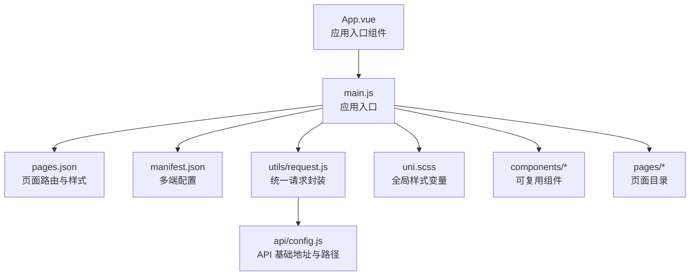
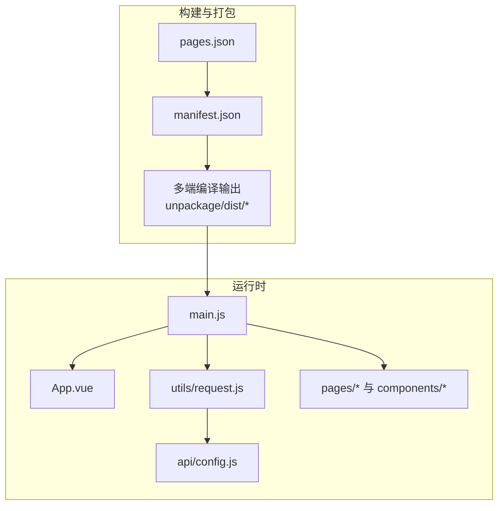
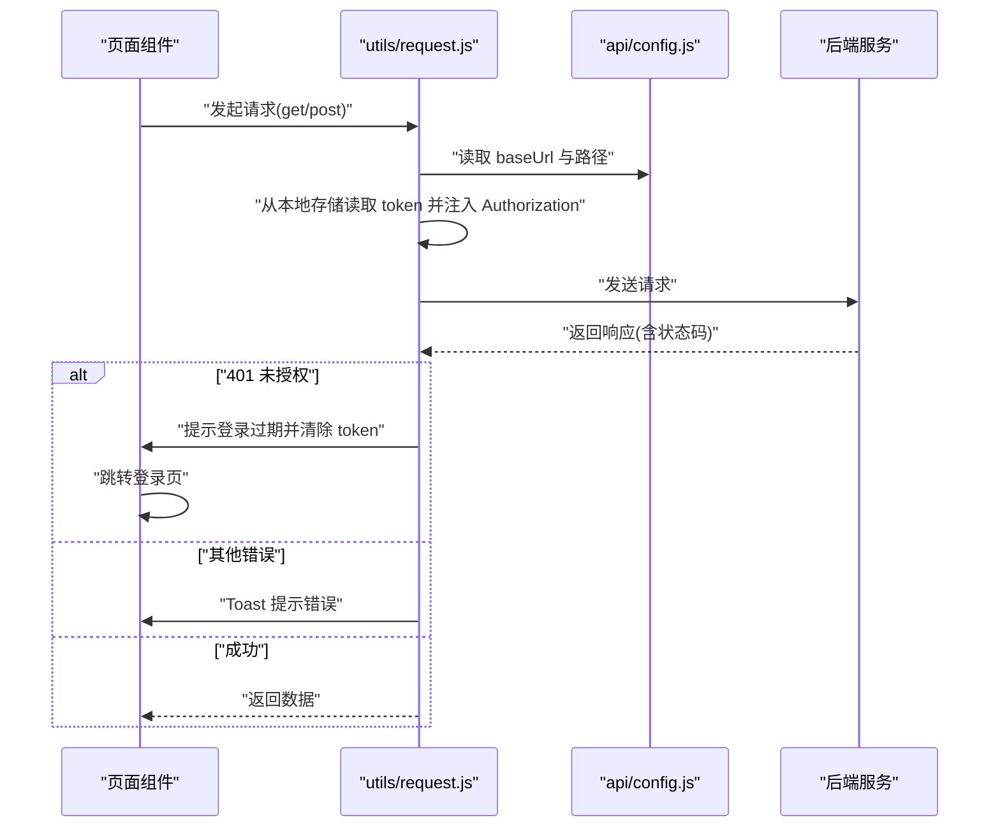
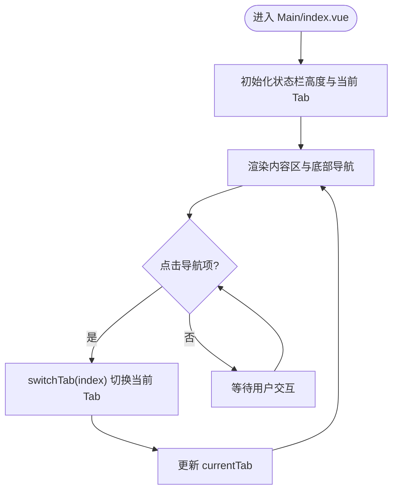
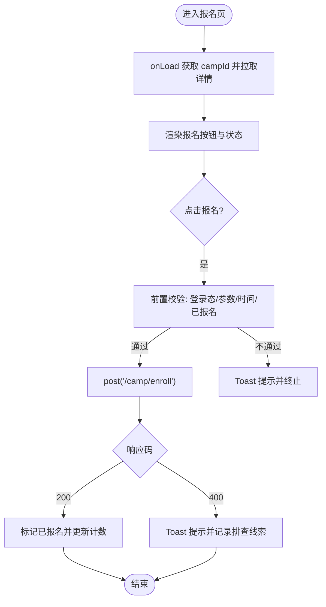
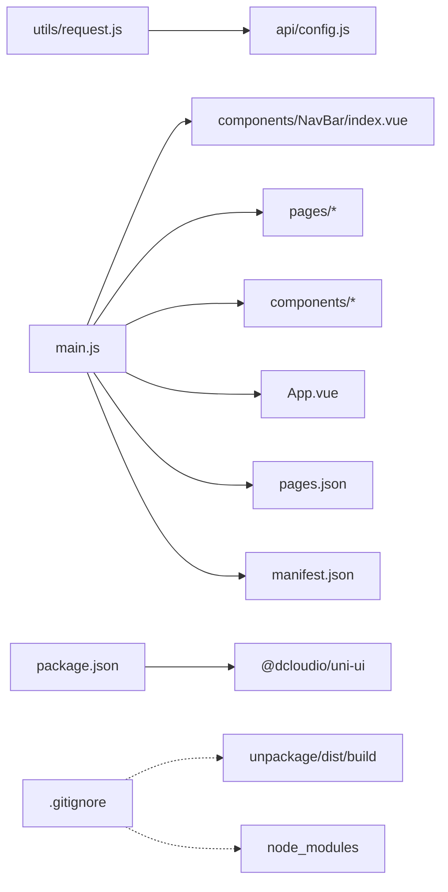

# 部署与运维

<cite>
**本文引用的文件**
- [package.json](file://package.json)
- [manifest.json](file://manifest.json)
- [pages.json](file://pages.json)
- [main.js](file://main.js)
- [App.vue](file://App.vue)
- [utils/request.js](file://utils/request.js)
- [api/config.js](file://api/config.js)
- [.gitignore](file://.gitignore)
- [doc/README.md](file://doc/README.md)
- [doc/Uniapp_STRUCTURE.md](file://doc/Uniapp_STRUCTURE.md)
- [doc/课程报名400错误完整排查报告.md](file://doc/课程报名400错误完整排查报告.md)
- [pages/Login/index.vue](file://pages/Login/index.vue)
- [pages/Main/index.vue](file://pages/Main/index.vue)
- [uni.scss](file://uni.scss)
</cite>

## 目录
1. [简介](#简介)
2. [项目结构](#项目结构)
3. [核心组件](#核心组件)
4. [架构总览](#架构总览)
5. [详细组件分析](#详细组件分析)
6. [依赖关系分析](#依赖关系分析)
7. [性能考量](#性能考量)
8. [故障排查指南](#故障排查指南)
9. [结论](#结论)
10. [附录](#附录)

## 简介
本指南面向“致良知教育”项目，提供从构建配置、多端编译、资源打包策略，到不同环境部署流程、版本管理策略、自动化部署与CI/CD设计、运维监控与应急响应的完整运维方案。文档以仓库现有配置与代码为依据，结合项目文档与接口配置，给出可落地的实践建议与可视化图示。

## 项目结构
项目采用 uni-app 多端一体化架构，前端基于 Vue 3（兼容 Vue 2），通过 manifest.json 与 pages.json 进行多端配置与页面路由管理；API 配置集中于 api/config.js，网络请求通过 utils/request.js 统一封装；全局样式变量位于 uni.scss；入口文件 main.js 支持 Vue 2/3 双栈。

图表来源
- [main.js:1-26](file://main.js#L1-L26)
- [pages.json:1-131](file://pages.json#L1-L131)
- [manifest.json:1-73](file://manifest.json#L1-L73)
- [utils/request.js:1-98](file://utils/request.js#L1-L98)
- [api/config.js:1-60](file://api/config.js#L1-L60)
- [uni.scss:1-77](file://uni.scss#L1-L77)

章节来源
- [doc/README.md:1-259](file://doc/README.md#L1-L259)
- [doc/Uniapp_STRUCTURE.md:1-387](file://doc/Uniapp_STRUCTURE.md#L1-L387)

## 核心组件
- 应用入口与多端适配
  - main.js 提供 Vue 2/3 双栈入口，全局注册 NavBar 组件，满足多端运行。
  - App.vue 定义全局生命周期与品牌色系、卡片样式等。
- 页面路由与样式
  - pages.json 定义页面路径、自定义导航栏、页面切换动画与全局样式。
- 多端配置
  - manifest.json 定义应用名称、版本、权限、平台特定配置（App/小程序/H5）。
- API 与网络
  - api/config.js 提供 baseUrl 与接口路径；utils/request.js 统一注入 Token、处理 401 与错误提示。
- 版本与构建
  - package.json 声明依赖；.gitignore 规范忽略构建产物与依赖目录。

章节来源
- [main.js:1-26](file://main.js#L1-L26)
- [App.vue:1-40](file://App.vue#L1-L40)
- [pages.json:1-131](file://pages.json#L1-L131)
- [manifest.json:1-73](file://manifest.json#L1-L73)
- [api/config.js:1-60](file://api/config.js#L1-L60)
- [utils/request.js:1-98](file://utils/request.js#L1-L98)
- [package.json:1-6](file://package.json#L1-L6)
- [.gitignore:1-32](file://.gitignore#L1-L32)

## 架构总览
下图展示 uni-app 多端编译与运行时的关键节点：入口文件、页面路由、平台配置、API 请求与资源打包。

图表来源
- [pages.json:1-131](file://pages.json#L1-L131)
- [manifest.json:1-73](file://manifest.json#L1-L73)
- [main.js:1-26](file://main.js#L1-L26)
- [utils/request.js:1-98](file://utils/request.js#L1-L98)
- [api/config.js:1-60](file://api/config.js#L1-L60)

## 详细组件分析

### 组件 A：API 请求与认证流程
该流程贯穿登录、课程、志愿者等多个页面，统一处理 Token 注入、401 未授权与网络异常。

图表来源
- [utils/request.js:1-98](file://utils/request.js#L1-L98)
- [api/config.js:1-60](file://api/config.js#L1-L60)
- [pages/Login/index.vue:138-200](file://pages/Login/index.vue#L138-L200)

章节来源
- [utils/request.js:1-98](file://utils/request.js#L1-L98)
- [api/config.js:1-60](file://api/config.js#L1-L60)
- [pages/Login/index.vue:138-200](file://pages/Login/index.vue#L138-L200)

### 组件 B：主页面导航与页面切换
主页面通过底部导航切换四个核心模块，使用组件懒加载与事件通信实现平滑切换。

图表来源
- [pages/Main/index.vue:1-200](file://pages/Main/index.vue#L1-L200)

章节来源
- [pages/Main/index.vue:1-200](file://pages/Main/index.vue#L1-L200)

### 组件 C：课程报名页面与 400 错误排查
课程报名页面包含前端时间拦截、重复报名拦截与网络请求，结合文档中的排查报告定位后端错误来源。

图表来源
- [doc/课程报名400错误完整排查报告.md:1-372](file://doc/课程报名400错误完整排查报告.md#L1-L372)
- [api/config.js:1-60](file://api/config.js#L1-L60)

章节来源
- [doc/课程报名400错误完整排查报告.md:1-372](file://doc/课程报名400错误完整排查报告.md#L1-L372)
- [api/config.js:1-60](file://api/config.js#L1-L60)

## 依赖关系分析
- 组件耦合
  - utils/request.js 依赖 api/config.js 的 baseUrl 与 paths，形成稳定的接口契约。
  - main.js 全局注册 NavBar 组件，降低页面重复导入成本。
- 外部依赖
  - package.json 声明 @dcloudio/uni-ui，用于 UI 组件库。
- 忽略规则
  - .gitignore 忽略 unpackage/dist/build、node_modules、IDE/系统缓存等，避免污染版本库。

图表来源
- [utils/request.js:1-98](file://utils/request.js#L1-L98)
- [api/config.js:1-60](file://api/config.js#L1-L60)
- [main.js:1-26](file://main.js#L1-L26)
- [pages.json:1-131](file://pages.json#L1-L131)
- [manifest.json:1-73](file://manifest.json#L1-L73)
- [package.json:1-6](file://package.json#L1-L6)
- [.gitignore:1-32](file://.gitignore#L1-L32)

章节来源
- [package.json:1-6](file://package.json#L1-L6)
- [.gitignore:1-32](file://.gitignore#L1-L32)

## 性能考量
- 组件懒加载与按需渲染
  - 主页面通过 v-show 控制模块显示，减少初始渲染压力；建议在复杂页面采用动态 import 实现懒加载。
- 资源优化
  - 图片资源建议压缩与按需加载；静态资源置于 static 目录，避免被过度打包。
- 网络优化
  - 统一请求封装已处理 401 与错误提示；建议增加请求去重、超时控制与重试策略。
- 样式与主题
  - 使用 uni.scss 统一样式变量，减少重复计算与样式冲突。

章节来源
- [pages/Main/index.vue:1-200](file://pages/Main/index.vue#L1-L200)
- [uni.scss:1-77](file://uni.scss#L1-L77)

## 故障排查指南
- 常见问题定位
  - 登录态失效：utils/request.js 对 401 的处理会清除 token 并跳转登录页，检查本地存储与后端会话有效期。
  - 网络异常：统一请求封装对 fail 进行 Toast 提示，建议开启网络日志与重试。
  - 课程报名 400：参考课程报名排查报告，确认后端校验逻辑（营期状态、用户身份、报名人数等）。
- 日志与监控
  - 前端：在关键流程添加日志埋点（如接口耗时、错误码分布）。
  - 后端：确保后端返回明确的错误码与上下文信息，便于前端精准提示。
- 性能监控
  - 关注首屏渲染、页面切换动画帧率、接口平均耗时与失败率。

章节来源
- [utils/request.js:1-98](file://utils/request.js#L1-L98)
- [doc/课程报名400错误完整排查报告.md:1-372](file://doc/课程报名400错误完整排查报告.md#L1-L372)

## 结论
本指南基于现有配置与代码，给出了 uni-app 多端部署与运维的实践路径：以 pages.json 与 manifest.json 为核心，配合 api/config.js 与 utils/request.js 的统一契约，实现稳定可靠的跨端交付。建议在 CI/CD、监控与应急响应方面进一步完善，保障项目长期可持续运营。

## 附录

### A. 构建配置与多端编译
- pages.json
  - 页面路径与样式、自定义导航栏、全局样式与页面切换动画。
- manifest.json
  - 应用名称、版本、权限与平台特定配置（App/小程序/H5）。
- main.js
  - Vue 2/3 双栈入口与全局组件注册。
- uni.scss
  - 全局样式变量，统一品牌色与间距。

章节来源
- [pages.json:1-131](file://pages.json#L1-L131)
- [manifest.json:1-73](file://manifest.json#L1-L73)
- [main.js:1-26](file://main.js#L1-L26)
- [uni.scss:1-77](file://uni.scss#L1-L77)

### B. 环境部署流程（开发/测试/生产）
- 开发环境
  - 使用 HBuilderX 或命令行工具启动；API 基础地址指向本地后端。
- 测试环境
  - 配置测试域名与证书；启用测试 API 基础地址；进行多端预览与兼容性测试。
- 生产环境
  - 生成 dist/unpackage 包；小程序走平台审核；App 使用正式签名；H5 部署至 CDN 并配置 HTTPS。

章节来源
- [doc/Uniapp_STRUCTURE.md:264-301](file://doc/Uniapp_STRUCTURE.md#L264-L301)
- [api/config.js:1-60](file://api/config.js#L1-L60)

### C. 版本管理策略（Git 工作流、标签与分支）
- 分支策略
  - develop/main：develop 用于集成，main 用于发布稳定版本。
- 提交规范
  - feat/fix/docs/style/refactor/test/chore 类型，配合语义化描述。
- 标签管理
  - 以 v{major}.{minor}.{patch} 形式打标签，与发布包一一对应。
- 忽略规则
  - .gitignore 忽略构建产物与依赖目录，避免污染版本库。

章节来源
- [.gitignore:1-32](file://.gitignore#L1-L32)
- [doc/Uniapp_STRUCTURE.md:237-246](file://doc/Uniapp_STRUCTURE.md#L237-L246)

### D. 自动化部署与 CI/CD 设计
- 构建阶段
  - 安装依赖 → uni-app 编译 → 产出 dist/unpackage。
- 测试阶段
  - 单元/集成/兼容性测试；接口联调；性能基准测试。
- 发布阶段
  - 生成发布包 → 小程序/应用商店/H5 发布 → 回滚预案与灰度发布。

章节来源
- [doc/Uniapp_STRUCTURE.md:264-301](file://doc/Uniapp_STRUCTURE.md#L264-L301)

### E. 运维监控与应急响应
- 监控指标
  - 页面首开时延、接口成功率与耗时、崩溃率、用户活跃与留存。
- 应急响应
  - 快速回滚至上一稳定版本；临时关闭风险功能；发布热修复补丁。

章节来源
- [doc/Uniapp_STRUCTURE.md:376-379](file://doc/Uniapp_STRUCTURE.md#L376-L379)