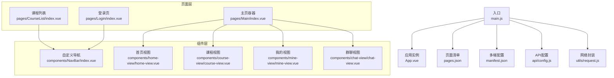
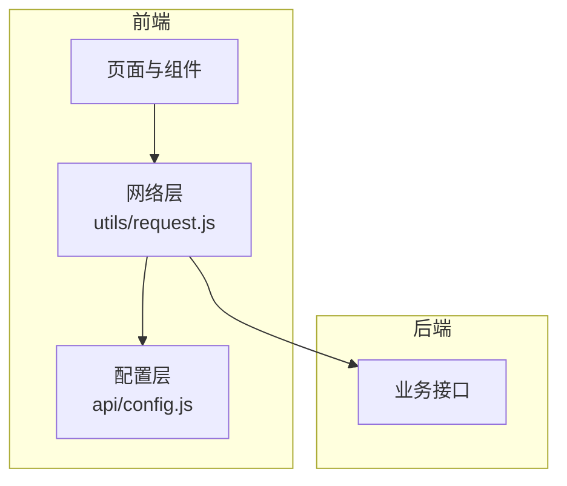
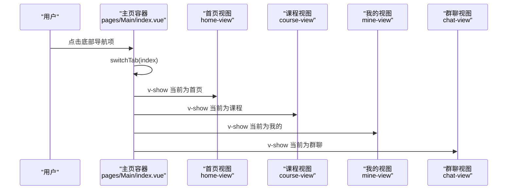
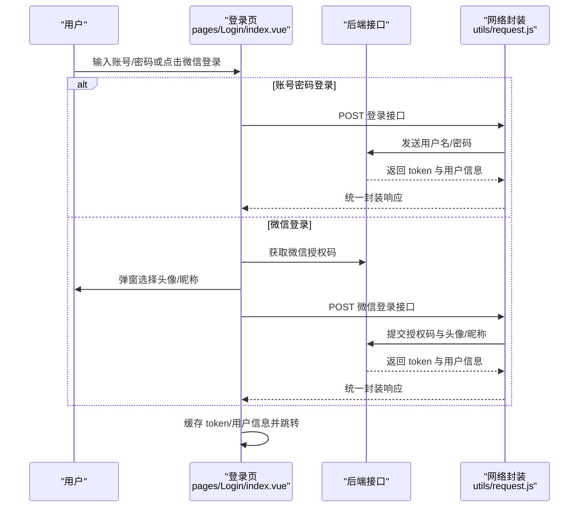
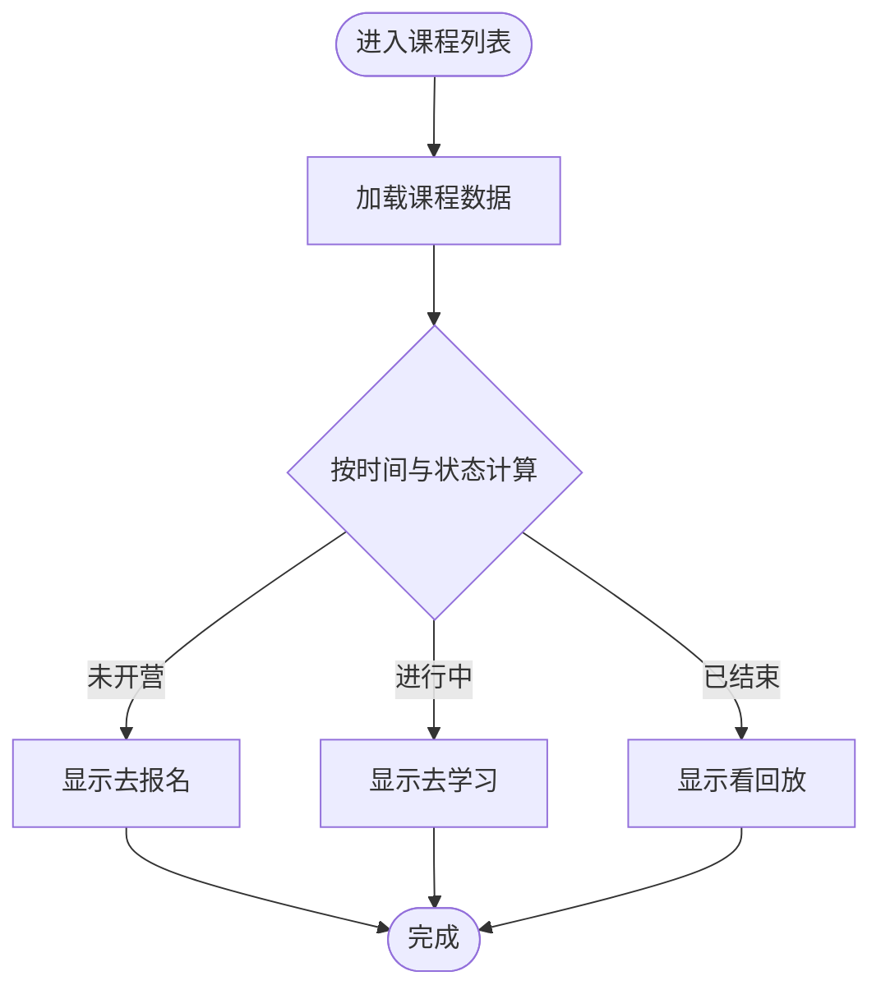
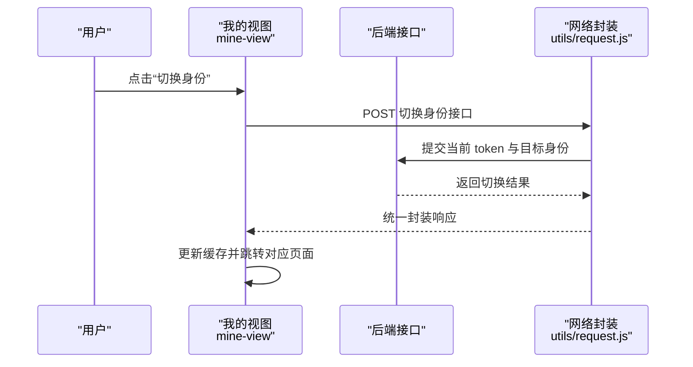
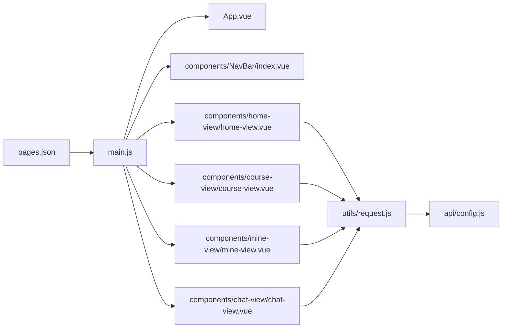

# 项目概述

<cite>
**本文引用的文件**
- [package.json](file://package.json)
- [App.vue](file://App.vue)
- [main.js](file://main.js)
- [manifest.json](file://manifest.json)
- [pages.json](file://pages.json)
- [api/config.js](file://api/config.js)
- [utils/request.js](file://utils/request.js)
- [components/NavBar/index.vue](file://components/NavBar/index.vue)
- [components/home-view/home-view.vue](file://components/home-view/home-view.vue)
- [components/course-view/course-view.vue](file://components/course-view/course-view.vue)
- [components/mine-view/mine-view.vue](file://components/mine-view/mine-view.vue)
- [components/chat-view/chat-view.vue](file://components/chat-view/chat-view.vue)
- [pages/Main/index.vue](file://pages/Main/index.vue)
- [pages/Login/index.vue](file://pages/Login/index.vue)
- [pages/CourseList/index.vue](file://pages/CourseList/index.vue)
</cite>

## 目录
1. [引言](#引言)
2. [项目结构](#项目结构)
3. [核心组件](#核心组件)
4. [架构总览](#架构总览)
5. [详细组件分析](#详细组件分析)
6. [依赖关系分析](#依赖关系分析)
7. [性能考量](#性能考量)
8. [故障排查指南](#故障排查指南)
9. [结论](#结论)
10. [附录](#附录)

## 引言
致良知教育项目是一个面向中国传统文化（特别是王阳明心学）传播与实践的跨平台移动应用，采用 uni-app 框架构建，支持多端统一开发与部署。项目以“让身边多一位致良知的中国人”为核心使命，围绕“课程学习—打卡实践—社群交流—志愿担当”的闭环路径，提供系统化的学习体验与组织协作能力。

项目定位明确：既服务于普通学员的日常学习与成长，也为志愿者与管理者提供组织与运营支撑；在视觉与交互层面，强调“温暖、内观、简洁”的中式美学，契合传统心学的学习氛围。

## 项目结构
项目采用 uni-app 的标准目录结构，按页面与组件分层组织，结合 pages.json 进行页面路由与全局样式配置，manifest.json 定义多端发布参数，api/config.js 统一管理后端接口地址与路径，utils/request.js 提供统一的网络请求与鉴权处理。

图表来源
- [main.js:1-26](file://main.js#L1-L26)
- [pages.json:1-131](file://pages.json#L1-L131)
- [manifest.json:1-73](file://manifest.json#L1-L73)
- [api/config.js:1-60](file://api/config.js#L1-L60)
- [utils/request.js:1-98](file://utils/request.js#L1-L98)
- [components/NavBar/index.vue:1-68](file://components/NavBar/index.vue#L1-L68)
- [components/home-view/home-view.vue:1-772](file://components/home-view/home-view.vue#L1-L772)
- [components/course-view/course-view.vue:1-496](file://components/course-view/course-view.vue#L1-L496)
- [components/mine-view/mine-view.vue:1-910](file://components/mine-view/mine-view.vue#L1-L910)
- [components/chat-view/chat-view.vue:1-156](file://components/chat-view/chat-view.vue#L1-L156)
- [pages/Main/index.vue:1-224](file://pages/Main/index.vue#L1-L224)
- [pages/Login/index.vue:1-900](file://pages/Login/index.vue#L1-L900)
- [pages/CourseList/index.vue:1-433](file://pages/CourseList/index.vue#L1-L433)

章节来源
- [main.js:1-26](file://main.js#L1-L26)
- [pages.json:1-131](file://pages.json#L1-L131)
- [manifest.json:1-73](file://manifest.json#L1-L73)
- [api/config.js:1-60](file://api/config.js#L1-L60)
- [utils/request.js:1-98](file://utils/request.js#L1-L98)

## 核心组件
- 应用入口与生命周期：App.vue 提供应用生命周期钩子与全局样式；main.js 支持 Vue2/Vue3 双栈运行，并全局注册底部导航组件。
- 页面与路由：pages.json 统一声明页面路径、导航样式与全局主题；manifest.json 配置多端编译参数与权限。
- API 与网络：api/config.js 统一管理后端地址与接口路径；utils/request.js 封装请求、自动注入 Token、处理 401 与网络异常。
- 视图组件：NavBar 为页面提供可定制的导航栏；home-view 展示首页内容与导航；course-view 管理课程列表与进度；mine-view 提供用户中心与身份切换；chat-view 管理群聊入口。

章节来源
- [App.vue:1-40](file://App.vue#L1-L40)
- [main.js:14-26](file://main.js#L14-L26)
- [pages.json:1-131](file://pages.json#L1-L131)
- [manifest.json:1-73](file://manifest.json#L1-L73)
- [api/config.js:1-60](file://api/config.js#L1-L60)
- [utils/request.js:1-98](file://utils/request.js#L1-L98)
- [components/NavBar/index.vue:1-68](file://components/NavBar/index.vue#L1-L68)
- [components/home-view/home-view.vue:1-772](file://components/home-view/home-view.vue#L1-L772)
- [components/course-view/course-view.vue:1-496](file://components/course-view/course-view.vue#L1-L496)
- [components/mine-view/mine-view.vue:1-910](file://components/mine-view/mine-view.vue#L1-L910)
- [components/chat-view/chat-view.vue:1-156](file://components/chat-view/chat-view.vue#L1-L156)

## 架构总览
项目采用“页面 + 组件 + API 封装”的分层架构，页面负责编排与交互，组件负责复用与解耦，API 封装负责统一接入与鉴权。整体遵循 uni-app 的跨平台理念，在微信小程序、快应用、H5 等多端统一运行。

图表来源
- [utils/request.js:1-98](file://utils/request.js#L1-L98)
- [api/config.js:1-60](file://api/config.js#L1-L60)

章节来源
- [utils/request.js:1-98](file://utils/request.js#L1-L98)
- [api/config.js:1-60](file://api/config.js#L1-L60)

## 详细组件分析

### 主页容器与底部导航
- 主页容器 pages/Main/index.vue 通过底部导航切换 home-view、course-view、mine-view、chat-view 四大视图，支持状态栏高度适配与动画过渡。
- 底部导航采用图标高亮与弹性动画，提升交互体验；通过 uni.$on/$off 实现跨组件的 Tab 切换事件通信。

图表来源
- [pages/Main/index.vue:110-115](file://pages/Main/index.vue#L110-L115)
- [components/home-view/home-view.vue:1-772](file://components/home-view/home-view.vue#L1-L772)
- [components/course-view/course-view.vue:1-496](file://components/course-view/course-view.vue#L1-L496)
- [components/mine-view/mine-view.vue:1-910](file://components/mine-view/mine-view.vue#L1-L910)
- [components/chat-view/chat-view.vue:1-156](file://components/chat-view/chat-view.vue#L1-L156)

章节来源
- [pages/Main/index.vue:1-224](file://pages/Main/index.vue#L1-L224)

### 登录与认证流程
- 登录页 pages/Login/index.vue 提供账号密码与微信一键登录两种方式；登录成功后写入 token 与用户信息缓存，并根据用户信息完整性决定跳转至首页或信息补全页。
- 微信登录流程包含授权码获取、头像与昵称选择、二次提交换取 token 并完成跳转。

图表来源
- [pages/Login/index.vue:138-454](file://pages/Login/index.vue#L138-L454)
- [utils/request.js:1-98](file://utils/request.js#L1-L98)
- [api/config.js:15-32](file://api/config.js#L15-L32)

章节来源
- [pages/Login/index.vue:1-900](file://pages/Login/index.vue#L1-L900)
- [utils/request.js:1-98](file://utils/request.js#L1-L98)
- [api/config.js:1-60](file://api/config.js#L1-L60)

### 课程体系与学习进度
- 课程列表 pages/CourseList/index.vue 展示全部课程，支持下拉刷新与上拉加载，按状态动态展示“去学习/去报名/看回放”等操作按钮。
- 课程视图 components/course-view.vue 提供“正在学习/历史课程/已结业”三类筛选，展示课程进度与操作按钮，支持刷新事件监听。

图表来源
- [pages/CourseList/index.vue:144-169](file://pages/CourseList/index.vue#L144-L169)
- [components/course-view/course-view.vue:158-193](file://components/course-view/course-view.vue#L158-L193)

章节来源
- [pages/CourseList/index.vue:1-433](file://pages/CourseList/index.vue#L1-L433)
- [components/course-view/course-view.vue:1-496](file://components/course-view/course-view.vue#L1-L496)

### 用户中心与身份管理
- 我的视图 components/mine-view.vue 展示用户信息、身份切换（学员端/志愿者端）、常用服务与退出登录；组件在挂载时强制写入“学员端”身份，确保界面一致性。
- 身份切换通过调用后端接口并更新缓存，随后根据目标身份进行页面跳转。

图表来源
- [components/mine-view/mine-view.vue:270-310](file://components/mine-view/mine-view.vue#L270-L310)
- [utils/request.js:1-98](file://utils/request.js#L1-L98)
- [api/config.js:21-22](file://api/config.js#L21-L22)

章节来源
- [components/mine-view/mine-view.vue:1-910](file://components/mine-view/mine-view.vue#L1-L910)
- [utils/request.js:1-98](file://utils/request.js#L1-L98)
- [api/config.js:1-60](file://api/config.js#L1-L60)

### 群聊入口与消息组织
- 群聊视图 components/chat-view.vue 展示用户加入的群聊列表，进入详情页时携带 chatId 与名称参数，便于后续消息交互。

章节来源
- [components/chat-view/chat-view.vue:1-156](file://components/chat-view/chat-view.vue#L1-L156)

### 自定义导航栏
- 导航栏组件 components/NavBar/index.vue 支持透明/不透明模式、返回逻辑与占位，适配刘海屏与不同页面场景。

章节来源
- [components/NavBar/index.vue:1-68](file://components/NavBar/index.vue#L1-L68)

## 依赖关系分析
- 运行时依赖：@dcloudio/uni-ui 在 pages.json 中通过 easycom 自动扫描注册，简化组件引入成本。
- 网络依赖：utils/request.js 依赖 api/config.js 的 baseUrl 与 paths，统一封装请求头与错误处理。
- 页面依赖：各页面通过 uni.request 或封装方法访问后端接口；组件间通过 uni.$emit/$on 进行轻量通信。

图表来源
- [pages.json:1-131](file://pages.json#L1-L131)
- [main.js:14-26](file://main.js#L14-L26)
- [components/NavBar/index.vue:1-68](file://components/NavBar/index.vue#L1-L68)
- [components/home-view/home-view.vue:1-772](file://components/home-view/home-view.vue#L1-L772)
- [components/course-view/course-view.vue:1-496](file://components/course-view/course-view.vue#L1-L496)
- [components/mine-view/mine-view.vue:1-910](file://components/mine-view/mine-view.vue#L1-L910)
- [components/chat-view/chat-view.vue:1-156](file://components/chat-view/chat-view.vue#L1-L156)
- [utils/request.js:1-98](file://utils/request.js#L1-L98)
- [api/config.js:1-60](file://api/config.js#L1-L60)

章节来源
- [pages.json:1-131](file://pages.json#L1-L131)
- [main.js:1-26](file://main.js#L1-L26)
- [utils/request.js:1-98](file://utils/request.js#L1-L98)
- [api/config.js:1-60](file://api/config.js#L1-L60)

## 性能考量
- 跨平台渲染：uni-app 通过 nvue/Vue2/Vue3 混合编译，建议在复杂动画与高性能场景优先考虑 nvue；当前项目以 Vue 组件为主，兼顾兼容性与开发效率。
- 图标与资源：使用 CDN 图标与本地静态资源相结合，减少首屏压力；注意在小程序端合理使用本地路径与网络资源。
- 网络请求：统一注入 Authorization 头，避免重复拼接；对 401 做自动清理与跳转，减少无效重试。
- 动画与滚动：首页与课程页大量使用 CSS 动画与滚动优化，建议在低端设备上适度降低动画强度或延迟触发。

## 故障排查指南
- 登录失败/401 未授权
  - 现象：登录成功后立即提示“登录已过期，请重新登录”，并跳转登录页。
  - 排查：检查 utils/request.js 的 401 处理逻辑与 api/config.js 的接口路径；确认后端返回的 token 格式与有效期。
- 微信登录头像/昵称缺失
  - 现象：微信登录弹窗未选择头像/昵称即提交。
  - 排查：pages/Login/index.vue 的微信登录流程需校验头像与昵称非空后再发起请求。
- 课程列表无数据/加载异常
  - 现象：课程列表为空或加载失败。
  - 排查：检查 pages/CourseList/index.vue 的请求参数与状态机逻辑；确认 api/config.js 的课程接口可用。
- 身份切换无效
  - 现象：切换身份后仍停留在原页面或未生效。
  - 排查：components/mine-view/mine-view.vue 的切换逻辑与缓存写入；确认后端接口返回与跳转目标页面路径。

章节来源
- [utils/request.js:24-66](file://utils/request.js#L24-L66)
- [pages/Login/index.vue:311-430](file://pages/Login/index.vue#L311-L430)
- [pages/CourseList/index.vue:198-237](file://pages/CourseList/index.vue#L198-L237)
- [components/mine-view/mine-view.vue:270-310](file://components/mine-view/mine-view.vue#L270-L310)

## 结论
致良知教育项目以 uni-app 为基础，构建了面向中国传统文化教育的跨平台应用。通过清晰的页面与组件分层、统一的 API 与网络封装，实现了从登录认证到课程学习、从身份管理到社群交流的完整闭环。项目在视觉与交互上体现中式美学，契合心学学习的内在节奏；在技术上兼顾易用性与扩展性，适合持续迭代与多端发布。

## 附录
- 开发与发布
  - 开发环境：本地调试建议使用 HBuilderX 或 VS Code 插件；pages.json 中已开启 easycom，可直接使用 @dcloudio/uni-ui 组件。
  - 多端发布：manifest.json 已配置 mp-weixin、quickapp、app-plus 等平台参数，按需调整 appid 与权限。
- 术语对照
  - 学员端：普通学习者身份
  - 志愿者端：参与组织与教学支持的身份
  - 打卡：课程计划中的任务完成标记
  - 回放：课程结束后可观看的历史内容