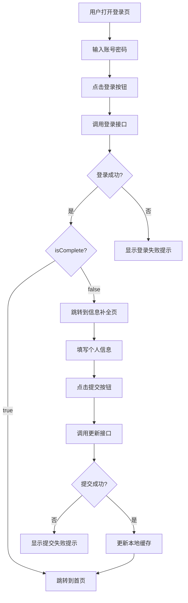

# 登录与信息补全功能修改说明

## 功能概述

本修改主要针对致良知教育小程序的登录系统进行了优化和完善，实现了账号密码登录的闭环流程，并对接了后端新的登录规范。

## 主要修改内容

### 1. 登录页面（index.vue）修改

#### 1.1 微信登录功能屏蔽
- **修改内容**：
  - 对微信登录按钮添加了 `disabled` 属性，禁止点击
  - 将点击事件从 `wechatLogin` 改为 `wechatLoginDisabled`
  - 注释掉了微信授权模态框的HTML代码
  - 添加了 `wechatLoginDisabled` 方法，提示用户微信登录功能暂时关闭

- **实现效果**：
  - 微信登录按钮显示为禁用状态，点击时会提示"微信登录功能暂时关闭"
  - 保留了微信登录的UI元素，为后续功能开启做准备

#### 1.2 登录逻辑对接后端新规范
- **修改内容**：
  - 更新了 `handleLogin` 方法，对接后端新的登录接口规范
  - 简化了登录成功的判断条件，只检查 `apiData.code === 200`
  - 根据后端返回的 `isComplete` 字段进行路由跳转
  - 添加了800ms的延迟跳转，确保用户能看清"登录成功"的Toast提示

- **实现效果**：
  - 登录成功后，根据 `isComplete` 字段自动判断跳转路径
  - `isComplete === false` 时跳转到信息补全页面
  - `isComplete === true` 时直接跳转到首页
  - 跳转前显示"登录成功"的提示，提升用户体验

### 2. 信息补全页面（complete-info.vue）修改

#### 2.1 完善提交逻辑
- **修改内容**：
  - 优化了 `handleSubmit` 方法，使用正确的async/await语法
  - 添加了token验证，确保登录状态有效
  - 统一了加载状态的处理，使用 `uni.showLoading` 和 `uni.hideLoading`
  - 添加了800ms的延迟跳转，确保用户能看清"信息提交成功"的提示

- **实现效果**：
  - 提交信息时显示"提交中..."的加载提示
  - 提交成功后显示"信息提交成功"的提示
  - 自动更新本地用户信息缓存
  - 延迟跳转到首页，提升用户体验
  - token过期时自动跳转到登录页

## 技术实现细节

### 1. 登录接口对接

#### 请求格式
```javascript
// 前端发送请求
uni.request({
  url: API_CONFIG.baseUrl + API_CONFIG.paths.login,
  method: 'POST',
  header: { 'content-type': 'application/json' },
  data: {
    username: this.username.trim(),
    password: this.password.trim()
  }
});
```

#### 响应处理
```javascript
// 后端返回数据结构
{
  "code": 200,
  "msg": "登录成功",
  "data": {
    "token": "eyJhbGci...",
    "isComplete": false,  // 关键判断字段
    "userInfo": {
      "id": 1001,
      "username": "13800138000",
      "nickname": "默认用户",
      "avatar": "",
      "phone": "13800138000",
      "gender": 0,
      "birthday": ""
    }
  }
}

// 前端处理逻辑
const isComplete = apiData.data.isComplete;
if (isComplete === false) {
  uni.reLaunch({ url: '/pages/Login/complete-info' });
} else {
  uni.reLaunch({ url: '/pages/Main/index' });
}
```

### 2. 信息更新接口对接

#### 请求格式
```javascript
// 前端发送请求
uni.request({
  url: API_CONFIG.baseUrl + '/user/update',
  method: 'POST',
  header: {
    'content-type': 'application/json',
    'Authorization': 'Bearer ' + token
  },
  data: this.formData
});
```

#### 响应处理
```javascript
// 后端返回数据结构（示例）
{
  "code": 200,
  "msg": "信息更新成功",
  "data": {
    "userInfo": {
      // 更新后的用户信息
    }
  }
}

// 前端处理逻辑
if (res.statusCode === 200 && res.data.code === 200) {
  uni.showToast({ title: '信息提交成功', icon: 'success' });
  // 更新本地用户信息
  const userInfo = uni.getStorageSync('userInfo') || {};
  uni.setStorageSync('userInfo', { ...userInfo, ...this.formData });
  // 跳转到首页
  setTimeout(() => {
    uni.reLaunch({ url: '/pages/Main/index' });
  }, 800);
}
```

### 3. 本地存储管理

- **Token存储**：
  ```javascript
  uni.setStorageSync('token', apiData.data.token);
  ```

- **用户信息存储**：
  ```javascript
  uni.setStorageSync('userInfo', apiData.data.userInfo);
  ```

- **信息更新后同步**：
  ```javascript
  const userInfo = uni.getStorageSync('userInfo') || {};
  uni.setStorageSync('userInfo', { ...userInfo, ...this.formData });
  ```

## 流程图



## 代码优化点

1. **错误处理**：
   - 添加了try-catch捕获网络请求和跳转异常
   - 统一了错误提示的显示方式

2. **用户体验**：
   - 添加了加载状态提示，避免用户重复操作
   - 使用setTimeout延迟跳转，确保用户能看清提示信息
   - 对表单输入进行了验证，提高数据准确性

3. **安全性**：
   - 使用Token进行身份验证，避免明文传递敏感信息
   - 在信息补全页面添加了Token验证，确保登录状态有效

4. **代码可读性**：
   - 优化了async/await语法的使用
   - 添加了详细的注释说明
   - 统一了代码风格和命名规范

## 兼容性说明

- **前端**：支持UniApp框架，兼容Vue 2和Vue 3
- **后端**：对接了新的登录和用户信息更新接口规范
- **存储**：使用uni-app的本地存储API，兼容各端

## 测试建议

1. **登录功能测试**：
   - 测试账号密码登录成功流程
   - 测试账号密码错误提示
   - 测试网络异常处理
   - 测试isComplete为false时的跳转
   - 测试isComplete为true时的跳转

2. **信息补全功能测试**：
   - 测试表单验证
   - 测试信息提交成功流程
   - 测试信息提交失败提示
   - 测试Token过期处理
   - 测试本地缓存更新

3. **UI测试**：
   - 测试微信登录按钮禁用状态
   - 测试加载状态显示
   - 测试提示信息显示
   - 测试页面跳转动画

## 总结

本次修改实现了账号密码登录的完整闭环，对接了后端新的登录规范，并优化了用户体验。通过Token认证、条件跳转和错误处理等机制，确保了登录系统的安全性和可靠性。同时，保留了微信登录的UI元素，为后续功能扩展做好了准备。