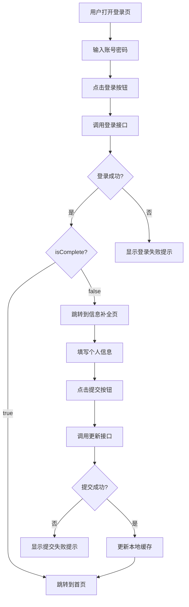

This file is a merged representation of a subset of the codebase, containing files not matching ignore patterns, combined into a single document by Repomix.

# File Summary

## Purpose
This file contains a packed representation of a subset of the repository's contents that is considered the most important context.
It is designed to be easily consumable by AI systems for analysis, code review,
or other automated processes.

## File Format
The content is organized as follows:
1. This summary section
2. Repository information
3. Directory structure
4. Repository files (if enabled)
5. Multiple file entries, each consisting of:
  a. A header with the file path (## File: path/to/file)
  b. The full contents of the file in a code block

## Usage Guidelines
- This file should be treated as read-only. Any changes should be made to the
  original repository files, not this packed version.
- When processing this file, use the file path to distinguish
  between different files in the repository.
- Be aware that this file may contain sensitive information. Handle it with
  the same level of security as you would the original repository.

## Notes
- Some files may have been excluded based on .gitignore rules and Repomix's configuration
- Binary files are not included in this packed representation. Please refer to the Repository Structure section for a complete list of file paths, including binary files
- Files matching these patterns are excluded: node_modules, unpackage, .git
- Files matching patterns in .gitignore are excluded
- Files matching default ignore patterns are excluded
- Files are sorted by Git change count (files with more changes are at the bottom)

# Directory Structure
```
.gitignore
小程序模板样式/课程页模板.html
小程序模板样式/我的 模板样式.html
小程序模板样式/小程序观看页初版 - 副本.html
小程序模板样式/小程序观看页初版.html
小程序模板样式/小程序课程模板.html
小程序模板样式/小程序视频观看页副本.html
小程序模板样式/小程序主页模板.html
api/config.js
App.vue
components/chat-view/chat-view.vue
components/course-view/course-view.vue
components/home-view/home-view.vue
components/mine-view/mine-view.vue
components/NavBar/index.vue
components/volunteer_admin/admin_cert.vue
components/volunteer_admin/admin_duty.vue
components/volunteer_admin/admin_mine.vue
components/volunteer/volunteer-home.vue
components/volunteer/volunteer-mine.vue
components/volunteer/volunteer-stats.vue
components/volunteer/volunteer-task.vue
doc/课程安排功能现状与切屏改造报告.md
doc/课程安排模块代码扫描报告.md
doc/课程报名400错误完整排查报告.md
doc/课程报名功能代码扫描报告.md
doc/课程报名页面最新代码扫描报告.md
doc/课程列表与打卡链路代码扫描报告.md
doc/课程详情页视频播放现状代码扫描报告.md
doc/头像上传功能现状分析报告.md
doc/course-data组件分析报告.md
doc/CourseData_Module_Summary.md
doc/CourseToday_Module_Analysis.md
doc/CourseToday打卡逻辑分析报告.md
doc/login-function-modification.md
doc/Uniapp_STRUCTURE.md
index.html
main.js
manifest.json
package.json
pages.json
pages/CampEnroll/index.vue
pages/certificate/mycertificate.vue
pages/chat-group/add-member.vue
pages/chat-group/chatdetail.vue
pages/chat-group/chatindex.vue
pages/CourseDetail/components/camp-intro.vue
pages/CourseDetail/components/course-data.vue
pages/CourseDetail/components/CourseSchedule.vue
pages/CourseDetail/components/CourseToday.vue
pages/CourseDetail/index.vue
pages/CourseList/index.vue
pages/Login/china-area.js
pages/Login/complete-info.vue
pages/Login/index.vue
pages/Main/index.vue
pages/Mine/about/index.vue
pages/Mine/apply-admin/index.vue
pages/Mine/apply-admin/list.vue
pages/Mine/archive/index.vue
pages/Mine/calendar/index.vue
pages/Mine/china-area.js
pages/Mine/profile-edit.vue
pages/Mine/reflection/index.vue
pages/Mine/showcase/index.vue
pages/volunteer-history/volunteer-history.vue
pages/volunteer-manage/member-list.vue
pages/volunteer-manage/volunteer-manage.vue
pages/volunteer/admin.vue
pages/volunteer/homework/detail.vue
pages/volunteer/homework/homework-list.vue
pages/volunteer/homework/statslist.vue
pages/volunteer/index.vue
pages/volunteer/volunteer-certificates.vue
project.private.config.json
READMEuniapp.md
static/icons/cert.png
static/icons/course.png
static/icons/exam.png
static/icons/order.png
static/icons/team.png
static/icons/wallet.png
static/logo.png
uni_modules/mp-html/changelog.md
uni_modules/mp-html/components/mp-html/mp-html.vue
uni_modules/mp-html/components/mp-html/node/node.vue
uni_modules/mp-html/components/mp-html/parser.js
uni_modules/mp-html/package.json
uni_modules/mp-html/README.md
uni_modules/mp-html/static/app-plus/mp-html/js/handler.js
uni_modules/mp-html/static/app-plus/mp-html/js/uni.webview.min.js
uni_modules/mp-html/static/app-plus/mp-html/local.html
uni.scss
utils/request.js
```

# Files

## File: .gitignore
````
# UniApp 编译生成文件（核心忽略）
unpackage/
dist/
build/

# 前端依赖（npm install生成，无需提交）
node_modules/
package-lock.json
yarn.lock

# 编辑器/IDE配置（自己的开发配置，不提交）
.idea/
.vscode/
*.suo
*.ntvs*
*.njsproj
*.sln
*.swp
*~

# 系统缓存/隐藏文件
.DS_Store
Thumbs.db
*.tmp
*.log

# 微信开发者工具缓存
project.config.json.bak
sitemap.json.bak

# 本地私钥/配置（比如本地修改的API基地址，可选）
# api/local-config.js
````

## File: 小程序模板样式/课程页模板.html
````html
<!DOCTYPE html>
<html lang="zh-CN">
<head>
    <meta charset="UTF-8">
    <meta name="viewport" content="width=device-width, initial-scale=1.0">
    <title>致良知教育 - 登录</title>
    <link href="https://cdnjs.cloudflare.com/ajax/libs/font-awesome/6.4.0/css/all.min.css" rel="stylesheet">
    <style>
        /* --- 全局变量 --- */
        :root {
            --brand-red: #9e2a2b;    /* 朱红 */
            --brand-gold: #c5a065;   /* 鎏金 */
            --bg-paper: #f9f7f2;     /* 宣纸白 */
            --text-main: #2d2424;    /* 墨色 */
            --text-sub: #8c8686;     /* 浅墨 */
            --input-bg: #ffffff;
            --radius-btn: 50px;      /* 圆润按钮 */
        }

        * { margin: 0; padding: 0; box-sizing: border-box; outline: none; }

        body {
            font-family: "PingFang SC", "Microsoft YaHei", -apple-system, sans-serif;
            background-color: #e0e0e0;
            display: flex;
            justify-content: center;
            align-items: center;
            min-height: 100vh;
        }

        /* --- 手机容器 (16:8) --- */
        .mobile-frame {
            width: 360px;
            height: 720px;
            background-color: var(--bg-paper);
            border-radius: 32px;
            box-shadow: 0 25px 50px -12px rgba(0, 0, 0, 0.2), 0 0 0 8px #fff;
            position: relative;
            overflow: hidden;
            display: flex;
            flex-direction: column;
        }

        /* --- 背景装饰 (写意山水模拟) --- */
        .bg-decoration {
            position: absolute;
            bottom: 0; left: 0; width: 100%; height: 35%;
            background: linear-gradient(to top, rgba(197, 160, 101, 0.1), transparent);
            z-index: 0;
            pointer-events: none;
        }
        .bg-decoration::before {
            content: ''; position: absolute; bottom: -50px; right: -50px;
            width: 300px; height: 300px;
            background: radial-gradient(circle, rgba(158, 42, 43, 0.05), transparent 70%);
            border-radius: 50%;
        }

        /* --- 顶部 Logo 区 --- */
        .header-section {
            padding-top: 80px;
            padding-bottom: 40px;
            text-align: center;
            z-index: 1;
        }

        .logo-seal {
            width: 64px; height: 64px;
            background-color: var(--brand-red);
            color: #fff;
            font-family: "Kaiti", serif; /* 楷体 */
            font-size: 32px;
            line-height: 64px;
            border-radius: 8px;
            margin: 0 auto 16px;
            box-shadow: 0 4px 15px rgba(158, 42, 43, 0.3);
            border: 2px solid rgba(255,255,255,0.2);
        }

        .app-name {
            font-size: 20px;
            font-weight: bold;
            color: var(--text-main);
            letter-spacing: 2px;
            margin-bottom: 4px;
        }

        .app-slogan {
            font-size: 12px;
            color: var(--text-sub);
            font-family: "Kaiti", serif;
        }

        /* --- 表单区域 --- */
        .form-section {
            padding: 0 32px;
            z-index: 1;
        }

        .input-group {
            position: relative;
            margin-bottom: 24px;
        }

        .input-icon {
            position: absolute;
            left: 16px; top: 50%;
            transform: translateY(-50%);
            color: var(--text-sub);
            font-size: 18px;
            transition: color 0.3s;
        }

        .form-input {
            width: 100%;
            height: 52px;
            padding: 0 16px 0 48px; /* 给图标留位置 */
            border: 1px solid transparent;
            background-color: #fff;
            border-radius: 12px;
            font-size: 14px;
            color: var(--text-main);
            box-shadow: 0 4px 12px rgba(0,0,0,0.03);
            transition: all 0.3s;
        }

        .form-input:focus {
            box-shadow: 0 4px 15px rgba(197, 160, 101, 0.15);
            border-color: rgba(197, 160, 101, 0.5); /* 聚焦时显示淡金色 */
        }
        .form-input:focus + .input-icon { color: var(--brand-red); }

        /* 密码切换眼 */
        .toggle-password {
            position: absolute;
            right: 16px; top: 50%;
            transform: translateY(-50%);
            color: #ccc;
            cursor: pointer;
        }

        /* 登录按钮 */
        .btn-login {
            width: 100%;
            height: 50px;
            background: linear-gradient(135deg, #9e2a2b, #b53b3c);
            color: #fff;
            font-size: 16px;
            font-weight: 600;
            border: none;
            border-radius: var(--radius-btn);
            cursor: pointer;
            box-shadow: 0 8px 20px rgba(158, 42, 43, 0.25);
            transition: transform 0.2s, box-shadow 0.2s;
            margin-top: 10px;
            letter-spacing: 4px;
        }
        .btn-login:active { transform: scale(0.98); box-shadow: 0 4px 10px rgba(158, 42, 43, 0.2); }

        /* 辅助链接行 */
        .links-row {
            display: flex;
            justify-content: space-between;
            margin-top: 16px;
            font-size: 12px;
        }
        .link-text {
            color: var(--text-sub);
            text-decoration: none;
            cursor: pointer;
        }
        .link-text.highlight { color: var(--brand-gold); font-weight: 500;}

        /* --- 底部第三方登录 --- */
        .footer-section {
            margin-top: auto; /* 推到底部 */
            padding-bottom: 40px;
            text-align: center;
            z-index: 1;
        }

        .divider {
            display: flex;
            align-items: center;
            justify-content: center;
            color: #ccc;
            font-size: 10px;
            margin-bottom: 20px;
        }
        .divider::before, .divider::after {
            content: '';
            width: 40px; height: 1px;
            background-color: #e0e0e0;
            margin: 0 10px;
        }

        .social-icons {
            display: flex;
            justify-content: center;
            gap: 24px;
        }
        .social-btn {
            width: 44px; height: 44px;
            border-radius: 50%;
            background: #fff;
            border: 1px solid #eee;
            display: flex; justify-content: center; align-items: center;
            font-size: 22px;
            color: var(--text-main);
            cursor: pointer;
            transition: all 0.3s;
        }
        .social-btn:hover { transform: translateY(-3px); box-shadow: 0 4px 10px rgba(0,0,0,0.05); }
        .social-btn.wechat { color: #07c160; }
        .social-btn.qq { color: #1296db; }

    </style>
</head>
<body>

    <div class="mobile-frame">
        
        <div class="bg-decoration"></div>

        <div class="header-section">
            <div class="logo-seal">良知</div>
            <div class="app-name">致良知教育</div>
            <div class="app-slogan">让内心充满力量的生命哲学课</div>
        </div>

        <div class="form-section">
            
            <div class="input-group">
                <input type="text" class="form-input" placeholder="请输入手机号/账号">
                <i class="fa-regular fa-user input-icon"></i>
            </div>

            <div class="input-group">
                <input type="password" class="form-input" placeholder="请输入密码">
                <i class="fa-solid fa-lock input-icon"></i>
                <i class="fa-regular fa-eye-slash toggle-password"></i>
            </div>

            <button class="btn-login">登录</button>

            <div class="links-row">
                <span class="link-text">忘记密码?</span>
                <span class="link-text highlight">立即注册</span>
            </div>
        </div>

        <div class="footer-section">
            <div class="divider">其他方式登录</div>
            <div class="social-icons">
                <div class="social-btn wechat"><i class="fa-brands fa-weixin"></i></div>
                <div class="social-btn qq"><i class="fa-brands fa-qq"></i></div>
            </div>
            
            <div style="font-size: 10px; color: #999; margin-top: 20px;">
                登录即代表同意 <span style="color:#9e2a2b">《用户协议》</span> 和 <span style="color:#9e2a2b">《隐私政策》</span>
            </div>
        </div>

    </div>

</body>
</html>
````

## File: 小程序模板样式/我的 模板样式.html
````html
<!DOCTYPE html>
<html lang="zh-CN">
<head>
    <meta charset="UTF-8">
    <meta name="viewport" content="width=device-width, initial-scale=1.0">
    <title>现代化个人中心</title>
    <link href="https://cdnjs.cloudflare.com/ajax/libs/font-awesome/6.4.0/css/all.min.css" rel="stylesheet">
    <style>
        /* --- 基础设置 --- */
        :root {
            --primary-color: #3b82f6; /* 现代蓝 */
            --bg-color: #f4f6f8;
            --text-main: #1f2937;
            --text-sub: #6b7280;
            --card-radius: 16px;
            --shadow-sm: 0 2px 4px rgba(0,0,0,0.02);
            --shadow-md: 0 4px 12px rgba(0,0,0,0.05);
        }

        * { margin: 0; padding: 0; box-sizing: border-box; -webkit-tap-highlight-color: transparent; }
        
        body {
            font-family: -apple-system, BlinkMacSystemFont, "SF Pro Text", "Segoe UI", Roboto, Helvetica, Arial, sans-serif;
            background-color: #e5e7eb; /* 桌面背景色 */
            display: flex;
            justify-content: center;
            align-items: center;
            min-height: 100vh;
        }

        /* --- 手机容器 (模拟 16:10 竖屏比例) --- */
        .mobile-frame {
            width: 375px;
            height: 720px; /* 约 9:18 ~ 10:16 比例，适应现代全面屏 */
            background-color: var(--bg-color);
            border-radius: 36px;
            position: relative;
            overflow: hidden;
            box-shadow: 0 20px 40px rgba(0,0,0,0.15), 0 0 0 10px #fff;
            display: flex;
            flex-direction: column;
        }

        /* 隐藏滚动条但保留功能 */
        .scroll-container {
            flex: 1;
            overflow-y: auto;
            padding-bottom: 80px; /* 底部留白 */
        }
        .scroll-container::-webkit-scrollbar { display: none; }

        /* --- 顶部 Header --- */
        .header {
            padding: 20px 20px 10px;
            display: flex;
            justify-content: space-between;
            align-items: center;
            background: #fff;
        }
        .brand {
            font-size: 16px;
            font-weight: 700;
            color: #333;
            display: flex;
            align-items: center;
            gap: 8px;
        }
        .brand i { color: #b91c1c; font-size: 20px;}
        
        .header-actions i {
            font-size: 20px;
            color: var(--text-main);
            margin-left: 16px;
            cursor: pointer;
        }

        /* --- 用户卡片 (Hero Card) --- */
        .user-section {
            background: #fff;
            padding: 10px 16px 20px;
            border-bottom-left-radius: 24px;
            border-bottom-right-radius: 24px;
            box-shadow: var(--shadow-sm);
            margin-bottom: 16px;
        }

        .user-card {
            background: linear-gradient(120deg, #2563eb, #3b82f6);
            border-radius: 20px;
            padding: 24px 20px;
            color: white;
            box-shadow: 0 8px 20px rgba(59, 130, 246, 0.3);
            position: relative;
            overflow: hidden;
        }

        /* 装饰背景圆圈 */
        .user-card::before {
            content: ''; position: absolute; top: -50px; right: -50px;
            width: 150px; height: 150px; background: rgba(255,255,255,0.1); border-radius: 50%;
        }

        .user-profile {
            display: flex;
            align-items: center;
            margin-bottom: 24px;
            position: relative; z-index: 1;
        }

        .avatar {
            width: 56px; height: 56px;
            border-radius: 50%;
            border: 2px solid rgba(255,255,255,0.8);
            background-image: url('https://api.dicebear.com/7.x/avataaars/svg?seed=Felix');
            background-size: cover;
            background-color: #fff;
            margin-right: 16px;
        }

        .user-info h2 { font-size: 18px; font-weight: 600; margin-bottom: 4px; }
        .tag {
            background: rgba(0,0,0,0.15);
            padding: 2px 10px; border-radius: 20px; font-size: 11px;
            display: inline-flex; align-items: center; gap: 4px;
        }

        .stats-grid {
            display: grid;
            grid-template-columns: 1fr 1fr 1fr;
            gap: 10px;
            position: relative; z-index: 1;
        }

        .stat-box { text-align: center; }
        .stat-num { font-size: 18px; font-weight: 600; margin-bottom: 2px; }
        .stat-label { font-size: 11px; opacity: 0.8; }

        /* --- 宫格导航 (Grid Nav - 现代化替换列表) --- */
        .grid-nav {
            display: grid;
            grid-template-columns: repeat(4, 1fr);
            background: #fff;
            padding: 20px 10px;
            margin: 0 16px 16px;
            border-radius: var(--card-radius);
            box-shadow: var(--shadow-sm);
        }

        .grid-item {
            display: flex;
            flex-direction: column;
            align-items: center;
            gap: 8px;
            cursor: pointer;
        }

        .icon-box {
            width: 44px; height: 44px;
            border-radius: 14px;
            display: flex; justify-content: center; align-items: center;
            font-size: 20px;
            transition: transform 0.2s;
        }
        .grid-item:active .icon-box { transform: scale(0.95); }
        
        .grid-label { font-size: 12px; color: var(--text-main); font-weight: 500;}

        /* 图标颜色配置 */
        .bg-blue { background: #eff6ff; color: #3b82f6; }
        .bg-orange { background: #fff7ed; color: #f97316; }
        .bg-purple { background: #f3e8ff; color: #a855f7; }
        .bg-green { background: #f0fdf4; color: #22c55e; }
        .bg-red { background: #fef2f2; color: #ef4444; }

        /* --- 列表分组 (List Groups) --- */
        .list-group {
            background: #fff;
            margin: 0 16px 16px;
            border-radius: var(--card-radius);
            overflow: hidden;
            box-shadow: var(--shadow-sm);
        }

        .list-item {
            display: flex;
            align-items: center;
            padding: 16px 20px;
            position: relative;
            cursor: pointer;
        }
        
        /* 列表项按压效果 */
        .list-item:active { background-color: #f9fafb; }
        
        /* 分隔线：除了最后一项 */
        .list-item:not(:last-child)::after {
            content: ''; position: absolute; bottom: 0; left: 56px; right: 0;
            height: 1px; background: #f3f4f6;
        }

        .list-icon { width: 24px; font-size: 18px; margin-right: 12px; text-align: center; }
        .list-text { flex: 1; font-size: 14px; color: var(--text-main); }
        .list-arrow { color: #d1d5db; font-size: 12px; }

        /* --- 底部导航 (Glassmorphism) --- */
        .tab-bar {
            position: absolute;
            bottom: 0; left: 0; width: 100%;
            height: 70px;
            background: rgba(255, 255, 255, 0.85);
            backdrop-filter: blur(12px); /* 毛玻璃 */
            border-top: 1px solid rgba(0,0,0,0.05);
            display: flex;
            justify-content: space-around;
            align-items: center;
            padding-bottom: 10px; /* 适配 iPhone 底部横条 */
        }

        .tab-item {
            display: flex;
            flex-direction: column;
            align-items: center;
            gap: 4px;
            color: #9ca3af;
            font-size: 10px;
            cursor: pointer;
            width: 60px;
        }

        .tab-item i { font-size: 22px; transition: 0.3s; }
        
        .tab-item.active { color: var(--primary-color); }
        .tab-item.active i { transform: translateY(-2px); }

    </style>
</head>
<body>

    <div class="mobile-frame">
        
        <header class="header">
            <div class="brand">
                <i class="fa-solid fa-shapes"></i>
                <span>致良知教育</span>
            </div>
            <div class="header-actions">
                <i class="fa-regular fa-bell"></i>
                <i class="fa-solid fa-gear"></i>
            </div>
        </header>

        <div class="scroll-container">
            
            <div class="user-section">
                <div class="user-card">
                    <div class="user-profile">
                        <div class="avatar"></div>
                        <div class="user-info">
                            <h2>Mystery</h2>
                            <div class="tag">
                                <i class="fa-solid fa-crown" style="color:#fcd34d"></i> 资深学员
                            </div>
                        </div>
                    </div>
                    <div class="stats-grid">
                        <div class="stat-box">
                            <div class="stat-num">¥0.00</div>
                            <div class="stat-label">账户余额</div>
                        </div>
                        <div class="stat-box">
                            <div class="stat-num">0</div>
                            <div class="stat-label">优惠券</div>
                        </div>
                        <div class="stat-box">
                            <div class="stat-num">12</div>
                            <div class="stat-label">我的积分</div>
                        </div>
                    </div>
                </div>
            </div>

            <div class="grid-nav">
                <div class="grid-item">
                    <div class="icon-box bg-blue"><i class="fa-solid fa-book-open"></i></div>
                    <span class="grid-label">我的课程</span>
                </div>
                <div class="grid-item">
                    <div class="icon-box bg-orange"><i class="fa-solid fa-file-lines"></i></div>
                    <span class="grid-label">我的订单</span>
                </div>
                <div class="grid-item">
                    <div class="icon-box bg-purple"><i class="fa-solid fa-certificate"></i></div>
                    <span class="grid-label">我的证书</span>
                </div>
                <div class="grid-item">
                    <div class="icon-box bg-green"><i class="fa-solid fa-pen-to-square"></i></div>
                    <span class="grid-label">我的考试</span>
                </div>
            </div>

            <div class="list-group">
                <div class="list-item">
                    <i class="fa-solid fa-headset list-icon" style="color: #ef4444;"></i>
                    <span class="list-text">咨询服务单</span>
                    <i class="fa-solid fa-chevron-right list-arrow"></i>
                </div>
                <div class="list-item">
                    <i class="fa-solid fa-wallet list-icon" style="color: #f59e0b;"></i>
                    <span class="list-text">返现与提现</span>
                    <i class="fa-solid fa-chevron-right list-arrow"></i>
                </div>
            </div>

            <div class="list-group">
                <div class="list-item">
                    <i class="fa-solid fa-users list-icon" style="color: #3b82f6;"></i>
                    <span class="list-text">加入社群</span>
                    <i class="fa-solid fa-chevron-right list-arrow"></i>
                </div>
                <div class="list-item">
                    <i class="fa-solid fa-shield-halved list-icon" style="color: #10b981;"></i>
                    <span class="list-text">用户协议</span>
                    <i class="fa-solid fa-chevron-right list-arrow"></i>
                </div>
                <div class="list-item">
                    <i class="fa-solid fa-circle-info list-icon" style="color: #6b7280;"></i>
                    <span class="list-text">关于我们</span>
                    <i class="fa-solid fa-chevron-right list-arrow"></i>
                </div>
            </div>

        </div>

        <nav class="tab-bar">
            <div class="tab-item">
                <i class="fa-solid fa-house"></i>
                <span>首页</span>
            </div>
            <div class="tab-item">
                <i class="fa-solid fa-layer-group"></i>
                <span>课程</span>
            </div>
            <div class="tab-item">
                <i class="fa-solid fa-bag-shopping"></i>
                <span>文创</span>
            </div>
            <div class="tab-item active">
                <i class="fa-regular fa-user"></i>
                <span>我的</span>
            </div>
        </nav>

    </div>

</body>
</html>
````

## File: 小程序模板样式/小程序观看页初版 - 副本.html
````html
<template>
  <view class="container">
    
    <view class="video-header">
      <view class="nav-overlay" :style="{ paddingTop: safeAreaTop + 'px' }">
        <uni-icons type="arrowleft" size="24" color="#fff" @click="goBack"></uni-icons>
        <uni-icons type="more-filled" size="24" color="#fff"></uni-icons>
      </view>
      
      <view class="play-overlay" @click="playVideo">
        <uni-icons type="plusempty" size="50" color="rgba(255,255,255,0.9)" v-if="false"></uni-icons>
        <view class="play-icon-circle">
          <uni-icons type="paperplane-filled" size="24" color="#fff" style="margin-left: 6rpx;"></uni-icons>
        </view>
      </view>
      
      </view>

    <scroll-view scroll-y class="content-scroll">
      
      <view class="info-card">
        <view class="course-tag">诚意班 · 第69期</view>
        <view class="course-title">致良知：让内心充满力量的生命哲学课</view>
        <view class="course-meta">
          <view class="meta-item">
            <uni-icons type="staff-filled" size="14" color="#cbd5e0"></uni-icons>
            <text>52,979 学员</text>
          </view>
          <view class="meta-item">
            <uni-icons type="calendar-filled" size="14" color="#cbd5e0"></uni-icons>
            <text>每日更新</text>
          </view>
        </view>
      </view>

      <view class="tab-container">
        <view 
          class="tab" 
          v-for="(tab, index) in tabs" 
          :key="index"
          :class="{ active: currentTab === index }"
          @click="currentTab = index"
        >
          {{ tab }}
        </view>
      </view>

      <view class="daily-section" v-show="currentTab === 1">
        <view class="date-header">
          <text class="date-title">Day 16 · 深入经义</text>
          <text class="date-sub">进行中</text>
        </view>

        <view class="timeline">
          
          <view 
            class="task-card" 
            v-for="(task, index) in taskList" 
            :key="index"
            :class="{ active: task.status === 'active' }"
            @click="handleTaskClick(task)"
          >
            <view class="task-left">
              <view class="icon-box" :class="task.iconClass">
                <uni-icons :type="task.uniIcon" size="20" :color="task.iconColor"></uni-icons>
              </view>
              <view class="task-info">
                <view class="task-title">{{ task.title }}</view>
                <view class="task-desc">{{ task.desc }}</view>
              </view>
            </view>
            
            <view class="btn-action" :class="{ 'btn-highlight': task.status === 'active' }">
               <uni-icons 
                 v-if="task.status === 'done'" 
                 type="checkmarkempty" 
                 size="18" 
                 color="#0ea5e9"
               ></uni-icons>
               
               <uni-icons 
                 v-else-if="task.status === 'active'" 
                 type="arrowright" 
                 size="18" 
                 color="#fff"
               ></uni-icons>
               
               <uni-icons 
                 v-else 
                 type="locked-filled" 
                 size="16" 
                 color="#cbd5e0"
               ></uni-icons>
            </view>
          </view>

        </view>
      </view>
      
      <view style="height: 120rpx;"></view>

    </scroll-view>

    <view class="fab-btn">
      <uni-icons type="chat-filled" size="18" color="#ff7e5f"></uni-icons>
      <text class="fab-text">进入小组讨论</text>
    </view>

  </view>
</template>

<script setup>
import { ref } from 'vue';

// --- 状态数据 ---
const currentTab = ref(1); // 默认选中第二个 Tab
const tabs = ['课程介绍', '今日学习', '我的数据'];

// 模拟安全区高度 (小程序中可以使用 uni.getSystemInfoSync().safeAreaInsets.top)
const safeAreaTop = ref(44); 

// 任务列表数据
const taskList = ref([
  {
    id: 1,
    title: '原文诵读',
    desc: '《送宗伯乔白岩序》',
    status: 'done', // done, active, lock
    uniIcon: 'map-filled', // 图标名
    iconClass: 'icon-read',
    iconColor: '#0ea5e9'
  },
  {
    id: 2,
    title: '名师导读',
    desc: '博仁老师 · 15分钟深度解析',
    status: 'active',
    uniIcon: 'videocam-filled',
    iconClass: 'icon-video',
    iconColor: '#f97316'
  },
  {
    id: 3,
    title: '心得打卡',
    desc: '分享今日感悟，获20积分',
    status: 'lock',
    uniIcon: 'compose',
    iconClass: 'icon-work',
    iconColor: '#22c55e'
  }
]);

// --- 方法 ---
const goBack = () => {
  uni.navigateBack();
};

const playVideo = () => {
  uni.showToast({ title: '开始播放', icon: 'none' });
};

const handleTaskClick = (task) => {
  if (task.status === 'lock') {
    uni.showToast({ title: '请先完成前置任务', icon: 'none' });
  } else {
    uni.showToast({ title: `进入: ${task.title}`, icon: 'none' });
  }
};
</script>

<style scoped>
/* --- 变量定义 (模仿 CSS Variables) --- */
/* 注意：UniApp 的 scoped 样式中，建议直接写颜色值，或使用全局样式文件 */
/* 为了保持原设计，这里手动替换颜色变量 */

.container {
  display: flex;
  flex-direction: column;
  height: 100vh;
  background-color: #eef1f5;
  overflow: hidden;
}

/* --- 1. 视频区 --- */
.video-header {
  position: relative;
  width: 100%;
  height: 420rpx; /* 约 210px */
  background: #000;
  z-index: 10;
  flex-shrink: 0;
}

.nav-overlay {
  position: absolute; 
  top: 0; 
  left: 0; 
  width: 100%;
  padding: 0 30rpx 20rpx;
  box-sizing: border-box;
  display: flex; 
  justify-content: space-between;
  align-items: center;
  background: linear-gradient(to bottom, rgba(0,0,0,0.5), transparent);
  z-index: 20;
}

.play-overlay {
  width: 100%; 
  height: 100%;
  display: flex; 
  align-items: center; 
  justify-content: center;
}

.play-icon-circle {
  width: 100rpx;
  height: 100rpx;
  border-radius: 50%;
  background: rgba(255,255,255,0.2);
  backdrop-filter: blur(4px);
  display: flex;
  align-items: center;
  justify-content: center;
  border: 2rpx solid rgba(255,255,255,0.4);
}

/* --- 2. 滚动内容区 --- */
.content-scroll {
  flex: 1;
  background: linear-gradient(to bottom, #fff 0%, #f9f9f9 100%);
  border-radius: 48rpx 48rpx 0 0; /* 圆角移植 */
  margin-top: -30rpx; /* 负边距覆盖 */
  position: relative;
  z-index: 11;
  overflow: hidden;
}

/* 课程信息 */
.info-card {
  padding: 48rpx 40rpx 20rpx;
}

.course-tag {
  background: rgba(255, 126, 95, 0.1); 
  color: #ff7e5f;
  font-size: 20rpx; 
  font-weight: bold; 
  padding: 8rpx 16rpx; 
  border-radius: 8rpx;
  display: inline-block; 
  margin-bottom: 16rpx;
}

.course-title {
  font-size: 36rpx; 
  font-weight: 700; 
  color: #2c3e50;
  margin-bottom: 16rpx; 
  line-height: 1.4;
}

.course-meta {
  display: flex; 
  align-items: center; 
  gap: 30rpx;
}

.meta-item {
  display: flex;
  align-items: center;
  gap: 8rpx;
}

.meta-item text {
  font-size: 24rpx; 
  color: #95a5a6;
}

/* Tab 切换 */
.tab-container {
  display: flex;
  padding: 0 40rpx;
  margin-top: 30rpx;
  border-bottom: 1px solid rgba(0,0,0,0.03);
}

.tab {
  margin-right: 50rpx;
  padding-bottom: 20rpx;
  font-size: 28rpx;
  color: #95a5a6;
  position: relative;
  transition: all 0.3s;
}

.tab.active {
  color: #2c3e50;
  font-weight: 600;
  font-size: 30rpx;
}

.tab.active::after {
  content: ''; 
  position: absolute; 
  bottom: -2rpx; 
  left: 0; 
  right: 0;
  height: 6rpx; 
  background: linear-gradient(135deg, #ff7e5f, #feb47b); 
  border-radius: 6rpx;
}

/* 每日任务 */
.daily-section { 
  padding: 40rpx; 
}

.date-header {
  display: flex; 
  justify-content: space-between; 
  align-items: center;
  margin-bottom: 40rpx;
}

.date-title { 
  font-size: 32rpx; 
  font-weight: 700; 
  color: #2c3e50; 
}

.date-sub { 
  font-size: 24rpx; 
  color: #ff7e5f; 
  background: #fff0eb; 
  padding: 8rpx 20rpx; 
  border-radius: 40rpx; 
}

/* 时间轴 */
.timeline { 
  position: relative; 
  padding-left: 30rpx; 
}

.timeline::before {
  content: ''; 
  position: absolute; 
  left: 12rpx; 
  top: 20rpx; 
  bottom: 20rpx;
  width: 4rpx; 
  background: #f0f0f0; 
  border-radius: 4rpx;
}

.task-card {
  position: relative;
  background: #ffffff;
  border-radius: 32rpx;
  padding: 32rpx;
  margin-bottom: 32rpx;
  box-shadow: 0 20rpx 40rpx rgba(0,0,0,0.03);
  display: flex; 
  align-items: center; 
  justify-content: space-between;
  border: 1px solid rgba(0,0,0,0.01);
}

.task-card:active {
  background-color: #f9f9f9;
}

/* 时间点 */
.task-card::before {
  content: ''; 
  position: absolute; 
  left: -48rpx; 
  top: 50%; 
  transform: translateY(-50%);
  width: 20rpx; 
  height: 20rpx; 
  border-radius: 50%;
  background: #fff; 
  border: 4rpx solid #e0e0e0; 
  z-index: 2;
}

.task-card.active::before {
  border-color: #ff7e5f; 
  background: #ff7e5f; 
  box-shadow: 0 0 0 6rpx rgba(255, 126, 95, 0.2);
}

.task-left { 
  display: flex; 
  align-items: center; 
  gap: 24rpx; 
}

.icon-box {
  width: 80rpx; 
  height: 80rpx; 
  border-radius: 24rpx;
  display: flex; 
  align-items: center; 
  justify-content: center;
}

/* 图标背景色 */
.icon-read { background: #e0f2fe; }
.icon-video { background: #ffedd5; }
.icon-work { background: #dcfce7; }

.task-info {
  display: flex;
  flex-direction: column;
}

.task-title {
  font-size: 28rpx; 
  color: #2c3e50; 
  font-weight: 600; 
  margin-bottom: 6rpx;
}

.task-desc {
  font-size: 22rpx; 
  color: #95a5a6;
}

.btn-action {
  width: 64rpx; 
  height: 64rpx; 
  border-radius: 50%;
  background: #f8f9fa;
  display: flex; 
  align-items: center; 
  justify-content: center;
}

.btn-highlight {
  background: linear-gradient(135deg, #ff7e5f, #feb47b);
  box-shadow: 0 8rpx 20rpx rgba(255, 126, 95, 0.3);
}

/* --- 3. 悬浮 FAB --- */
.fab-btn {
  position: absolute; 
  bottom: 60rpx; 
  left: 50%; 
  transform: translateX(-50%);
  background: #fff;
  padding: 20rpx 48rpx;
  border-radius: 60rpx;
  box-shadow: 0 30rpx 60rpx rgba(255, 126, 95, 0.2);
  display: flex; 
  align-items: center; 
  gap: 16rpx;
  z-index: 20; 
  border: 1px solid rgba(255, 126, 95, 0.1);
}

.fab-text {
  color: #ff7e5f; 
  font-weight: 600; 
  font-size: 28rpx;
}
</style>
````

## File: 小程序模板样式/小程序观看页初版.html
````html
<!DOCTYPE html>
<html lang="zh-CN">
<head>
    <meta charset="UTF-8">
    <meta name="viewport" content="width=device-width, initial-scale=1.0">
    <title>极简课程学习页</title>
    <link href="https://cdnjs.cloudflare.com/ajax/libs/font-awesome/6.4.0/css/all.min.css" rel="stylesheet">
    <style>
        /* --- 变量定义 --- */
        :root {
            --primary: #ff7e5f; /* 现代珊瑚橙 */
            --primary-gradient: linear-gradient(135deg, #ff7e5f, #feb47b);
            --secondary: #4facfe; /* 强调蓝 */
            --text-main: #2c3e50;
            --text-light: #95a5a6;
            --bg-body: #fdfbfb;
            --card-bg: #ffffff;
            --shadow-soft: 0 10px 20px rgba(0,0,0,0.03);
            --shadow-float: 0 15px 30px rgba(255, 126, 95, 0.2);
            --radius-l: 24px;
            --radius-m: 16px;
            --radius-s: 8px;
        }

        * { margin: 0; padding: 0; box-sizing: border-box; }

        body {
            font-family: -apple-system, BlinkMacSystemFont, "SF Pro Display", "Segoe UI", Roboto, sans-serif;
            background-color: #eef1f5;
            display: flex;
            justify-content: center;
            align-items: center;
            min-height: 100vh;
        }

        /* --- 16:9 手机容器 (9:16 竖屏) --- */
        .mobile-frame {
            width: 360px;
            height: 640px; /* 严格 9:16 */
            background: #fafafa;
            border-radius: var(--radius-l);
            box-shadow: 0 25px 50px -12px rgba(0, 0, 0, 0.15), 0 0 0 10px #fff;
            position: relative;
            overflow: hidden;
            display: flex;
            flex-direction: column;
        }

        /* --- 沉浸式视频区 --- */
        .video-header {
            position: relative;
            width: 100%;
            height: 202px; /* 16:9 video height */
            background: #000;
            z-index: 10;
        }
        
        .nav-overlay {
            position: absolute; top: 0; left: 0; width: 100%;
            padding: 15px;
            display: flex; justify-content: space-between;
            color: #fff;
            background: linear-gradient(to bottom, rgba(0,0,0,0.4), transparent);
            pointer-events: none; /* 让点击穿透 */
        }
        .nav-overlay i { pointer-events: auto; cursor: pointer; text-shadow: 0 1px 2px rgba(0,0,0,0.3);}

        .play-overlay {
            width: 100%; height: 100%;
            display: flex; align-items: center; justify-content: center;
            cursor: pointer;
        }
        .play-icon {
            font-size: 48px; color: rgba(255,255,255,0.9);
            filter: drop-shadow(0 4px 6px rgba(0,0,0,0.3));
            transition: transform 0.2s;
        }
        .play-icon:hover { transform: scale(1.1); }

        /* --- 内容滚动区 --- */
        .content-scroll {
            flex: 1;
            overflow-y: auto;
            background: linear-gradient(to bottom, #fff 0%, #f9f9f9 100%);
            border-radius: var(--radius-l) var(--radius-l) 0 0;
            margin-top: -15px; /* 稍微覆盖视频底部，制造层级感 */
            position: relative;
            z-index: 11;
            padding-bottom: 80px;
        }
        .content-scroll::-webkit-scrollbar { display: none; }

        /* 课程信息卡 */
        .info-card {
            padding: 24px 20px 10px;
        }
        .course-tag {
            background: rgba(255, 126, 95, 0.1); color: var(--primary);
            font-size: 10px; font-weight: bold; padding: 4px 8px; border-radius: 4px;
            display: inline-block; margin-bottom: 8px;
        }
        .course-title {
            font-size: 18px; font-weight: 700; color: var(--text-main);
            margin-bottom: 8px; line-height: 1.3;
        }
        .course-meta {
            display: flex; align-items: center; gap: 15px;
            font-size: 12px; color: var(--text-light);
        }
        .meta-item i { margin-right: 4px; color: #cbd5e0; }

        /* 极简 Tab 切换 */
        .tab-container {
            display: flex;
            padding: 0 20px;
            margin-top: 15px;
            border-bottom: 1px solid rgba(0,0,0,0.03);
        }
        .tab {
            margin-right: 25px;
            padding-bottom: 10px;
            font-size: 14px;
            color: var(--text-light);
            cursor: pointer;
            position: relative;
            transition: color 0.3s;
        }
        .tab.active {
            color: var(--text-main);
            font-weight: 600;
        }
        .tab.active::after {
            content: ''; position: absolute; bottom: -1px; left: 0; right: 0;
            height: 3px; background: var(--primary-gradient); border-radius: 3px;
        }

        /* 每日任务 (时间轴样式) */
        .daily-section { padding: 20px; }
        .date-header {
            display: flex; justify-content: space-between; align-items: center;
            margin-bottom: 20px;
        }
        .date-title { font-size: 16px; font-weight: 700; color: var(--text-main); }
        .date-sub { font-size: 12px; color: var(--primary); background: #fff0eb; padding: 4px 10px; border-radius: 20px; }

        .timeline { position: relative; padding-left: 15px; }
        /* 左侧线条 */
        .timeline::before {
            content: ''; position: absolute; left: 6px; top: 10px; bottom: 10px;
            width: 2px; background: #f0f0f0; border-radius: 2px;
        }

        .task-card {
            position: relative;
            background: var(--card-bg);
            border-radius: var(--radius-m);
            padding: 16px;
            margin-bottom: 16px;
            box-shadow: var(--shadow-soft);
            display: flex; align-items: center; justify-content: space-between;
            transition: transform 0.2s;
            border: 1px solid rgba(0,0,0,0.01);
        }
        .task-card:active { transform: scale(0.98); }

        /* 列表左侧的时间点装饰 */
        .task-card::before {
            content: ''; position: absolute; left: -24px; top: 50%; transform: translateY(-50%);
            width: 10px; height: 10px; border-radius: 50%;
            background: #fff; border: 2px solid #e0e0e0; z-index: 2;
        }
        .task-card.active::before { border-color: var(--primary); background: var(--primary); box-shadow: 0 0 0 3px rgba(255, 126, 95, 0.2); }

        .task-left { display: flex; align-items: center; gap: 12px; }
        .icon-box {
            width: 40px; height: 40px; border-radius: 12px;
            display: flex; align-items: center; justify-content: center;
            font-size: 18px; flex-shrink: 0;
        }
        .icon-read { background: #e0f2fe; color: #0ea5e9; } /* 蓝底蓝字 */
        .icon-video { background: #ffedd5; color: #f97316; } /* 橙底橙字 */
        .icon-work { background: #dcfce7; color: #22c55e; } /* 绿底绿字 */

        .task-info h4 { font-size: 14px; color: var(--text-main); font-weight: 600; margin-bottom: 3px; }
        .task-info p { font-size: 11px; color: var(--text-light); }
        
        .btn-action {
            width: 32px; height: 32px; border-radius: 50%;
            background: #f8f9fa; color: #cbd5e0;
            display: flex; align-items: center; justify-content: center;
            transition: all 0.3s;
        }
        .task-card.active .btn-action {
            background: var(--primary-gradient); color: #fff;
            box-shadow: 0 4px 10px rgba(255, 126, 95, 0.3);
        }

        /* 悬浮 FAB 按钮 */
        .fab-btn {
            position: absolute; bottom: 30px; left: 50%; transform: translateX(-50%);
            background: #fff;
            padding: 10px 24px;
            border-radius: 30px;
            box-shadow: var(--shadow-float);
            display: flex; align-items: center; gap: 8px;
            color: var(--primary); font-weight: 600; font-size: 14px;
            z-index: 20; cursor: pointer;
            border: 1px solid rgba(255, 126, 95, 0.1);
        }

    </style>
</head>
<body>

    <div class="mobile-frame">
        
        <div class="video-header">
            <div class="nav-overlay">
                <i class="fa-solid fa-arrow-left"></i>
                <i class="fa-solid fa-ellipsis"></i>
            </div>
            <div class="play-overlay">
                <i class="fa-regular fa-circle-play play-icon"></i>
            </div>
        </div>

        <div class="content-scroll">
            
            <div class="info-card">
                <span class="course-tag">诚意班 · 第69期</span>
                <h1 class="course-title">致良知：让内心充满力量的生命哲学课</h1>
                <div class="course-meta">
                    <div class="meta-item"><i class="fa-solid fa-user-group"></i> 52,979 学员</div>
                    <div class="meta-item"><i class="fa-solid fa-clock"></i> 每日更新</div>
                </div>
            </div>

            <div class="tab-container">
                <div class="tab">课程介绍</div>
                <div class="tab active">今日学习</div>
                <div class="tab">我的数据</div>
            </div>

            <div class="daily-section">
                <div class="date-header">
                    <span class="date-title">Day 16 · 深入经义</span>
                    <span class="date-sub">进行中</span>
                </div>

                <div class="timeline">
                    
                    <div class="task-card">
                        <div class="task-left">
                            <div class="icon-box icon-read">
                                <i class="fa-solid fa-book-open"></i>
                            </div>
                            <div class="task-info">
                                <h4>原文诵读</h4>
                                <p>《送宗伯乔白岩序》</p>
                            </div>
                        </div>
                        <div class="btn-action" style="color: #0ea5e9;">
                            <i class="fa-solid fa-check"></i>
                        </div>
                    </div>

                    <div class="task-card active">
                        <div class="task-left">
                            <div class="icon-box icon-video">
                                <i class="fa-solid fa-play"></i>
                            </div>
                            <div class="task-info">
                                <h4>名师导读</h4>
                                <p>博仁老师 · 15分钟深度解析</p>
                            </div>
                        </div>
                        <div class="btn-action">
                            <i class="fa-solid fa-arrow-right"></i>
                        </div>
                    </div>

                    <div class="task-card">
                        <div class="task-left">
                            <div class="icon-box icon-work">
                                <i class="fa-solid fa-pen-nib"></i>
                            </div>
                            <div class="task-info">
                                <h4>心得打卡</h4>
                                <p>分享今日感悟，获20积分</p>
                            </div>
                        </div>
                        <div class="btn-action">
                            <i class="fa-solid fa-lock"></i>
                        </div>
                    </div>

                </div>
            </div>

        </div>

        <div class="fab-btn">
            <i class="fa-solid fa-users"></i>
            进入小组讨论
        </div>

    </div>

</body>
</html>
````

## File: 小程序模板样式/小程序课程模板.html
````html
<!DOCTYPE html>
<html lang="zh-CN">
<head>
    <meta charset="UTF-8">
    <meta name="viewport" content="width=device-width, initial-scale=1.0">
    <title>我的课程 - 现代化重构</title>
    <link href="https://cdnjs.cloudflare.com/ajax/libs/font-awesome/6.4.0/css/all.min.css" rel="stylesheet">
    <style>
        /* --- 1. 全局变量与重置 --- */
        :root {
            --primary-blue: #2563eb; /* 现代科技蓝 */
            --primary-blue-light: #eff6ff;
            --text-main: #1f2937;
            --text-sub: #6b7280;
            --bg-body: #f3f4f6;
            --card-bg: #ffffff;
            --radius-box: 24px;
            --radius-card: 16px;
            --shadow-card: 0 4px 6px -1px rgba(0, 0, 0, 0.05), 0 2px 4px -1px rgba(0, 0, 0, 0.03);
        }

        * { margin: 0; padding: 0; box-sizing: border-box; }
        
        body {
            font-family: -apple-system, BlinkMacSystemFont, "Segoe UI", Roboto, Helvetica, Arial, sans-serif;
            background-color: #e5e7eb;
            display: flex;
            justify-content: center;
            align-items: center;
            min-height: 100vh;
        }

        /* --- 2. 手机容器 (16:8 / 2:1 比例) --- */
        .mobile-frame {
            width: 360px;
            height: 720px; /* 16:8 也就是 2:1 的比例 */
            background-color: var(--bg-body);
            border-radius: 30px;
            box-shadow: 0 20px 40px rgba(0,0,0,0.15), 0 0 0 8px #fff;
            position: relative;
            overflow: hidden;
            display: flex;
            flex-direction: column;
        }

        /* --- 3. 顶部导航 (Header) --- */
        .header {
            background: #fff;
            padding: 16px 20px;
            display: flex;
            justify-content: space-between;
            align-items: center;
            font-size: 16px;
            font-weight: 600;
            color: var(--text-main);
            z-index: 10;
        }
        .header-logo {
            display: flex; align-items: center; gap: 8px; font-size: 15px;
        }
        .header-logo i { color: #b91c1c; font-size: 20px; }

        /* --- 4. 选项卡 (Tabs) --- */
        .tabs-container {
            background: #fff;
            padding: 0 20px 16px;
            border-bottom-left-radius: 20px;
            border-bottom-right-radius: 20px;
            box-shadow: 0 4px 10px rgba(0,0,0,0.02);
            z-index: 9;
        }
        
        .tabs-wrapper {
            display: flex;
            background: #f3f4f6;
            padding: 4px;
            border-radius: 12px;
        }

        .tab-item {
            flex: 1;
            text-align: center;
            padding: 8px 0;
            font-size: 13px;
            font-weight: 500;
            color: var(--text-sub);
            border-radius: 10px;
            cursor: pointer;
            transition: all 0.3s ease;
        }

        .tab-item.active {
            background: #fff;
            color: var(--primary-blue);
            font-weight: 600;
            box-shadow: 0 2px 4px rgba(0,0,0,0.05);
        }

        /* --- 5. 滚动内容区 --- */
        .content-scroll {
            flex: 1;
            overflow-y: auto;
            padding: 20px;
            padding-bottom: 80px; /* 避开底部导航 */
        }
        .content-scroll::-webkit-scrollbar { display: none; }

        /* 课程卡片 */
        .course-card {
            background: var(--card-bg);
            border-radius: var(--radius-card);
            box-shadow: var(--shadow-card);
            padding: 16px;
            margin-bottom: 16px;
            display: flex;
            gap: 16px;
            position: relative;
            transition: transform 0.2s;
        }
        .course-card:active { transform: scale(0.98); }

        /* 左侧封面图 */
        .card-thumb {
            width: 100px;
            height: 100px; /* 正方形或略长 */
            border-radius: 12px;
            background: linear-gradient(135deg, #7f1d1d, #991b1b); /* 模拟红底图片 */
            display: flex;
            align-items: center;
            justify-content: center;
            color: #fff;
            font-weight: bold;
            font-family: "Kaiti", serif; /* 模拟书法字体 */
            font-size: 20px;
            flex-shrink: 0;
            position: relative;
            overflow: hidden;
            text-align: center;
            line-height: 1.2;
        }
        
        .card-thumb::after {
            content: '';
            position: absolute; top:0; left:0; width:100%; height:100%;
            background: url('https://www.transparenttextures.com/patterns/black-scales.png'); /* 增加一点纹理 */
            opacity: 0.1;
        }
        
        /* 状态标签 */
        .status-badge {
            position: absolute;
            top: 6px; left: 6px;
            background: rgba(0, 0, 0, 0.6);
            backdrop-filter: blur(4px);
            color: #4ade80; /* 绿色文字 */
            font-size: 10px;
            padding: 2px 6px;
            border-radius: 4px;
            z-index: 2;
            border: 1px solid rgba(74, 222, 128, 0.3);
        }

        /* 右侧内容 */
        .card-info {
            flex: 1;
            display: flex;
            flex-direction: column;
            justify-content: space-between;
        }

        .card-title {
            font-size: 15px;
            font-weight: 700;
            color: var(--text-main);
            line-height: 1.4;
            margin-bottom: 8px;
            display: -webkit-box;
            -webkit-line-clamp: 2;
            -webkit-box-orient: vertical;
            overflow: hidden;
        }

        .info-row {
            display: flex;
            align-items: center;
            font-size: 11px;
            color: var(--text-sub);
            margin-bottom: 4px;
        }
        .info-row i { width: 16px; color: #9ca3af; }

        /* 按钮区域 */
        .card-action {
            margin-top: 8px;
            display: flex;
            justify-content: flex-end;
        }
        
        .btn-study {
            background: var(--primary-blue-light);
            color: var(--primary-blue);
            font-size: 12px;
            font-weight: 600;
            padding: 6px 12px;
            border-radius: 20px;
            border: none;
            cursor: pointer;
            display: flex;
            align-items: center;
            gap: 4px;
            transition: background 0.2s;
        }
        .btn-study:hover { background: #dbeafe; }

        /* 空状态提示 */
        .empty-tip {
            text-align: center;
            font-size: 12px;
            color: #9ca3af;
            margin-top: 30px;
        }

        /* --- 6. 底部导航栏 --- */
        .bottom-nav {
            position: absolute;
            bottom: 0; left: 0; width: 100%;
            height: 70px;
            background: rgba(255, 255, 255, 0.9);
            backdrop-filter: blur(10px);
            border-top: 1px solid rgba(0,0,0,0.05);
            display: flex;
            justify-content: space-around;
            align-items: center;
            padding-bottom: 15px; /* 适配底部安全区 */
        }

        .nav-btn {
            display: flex;
            flex-direction: column;
            align-items: center;
            gap: 4px;
            font-size: 10px;
            color: #9ca3af;
            cursor: pointer;
            width: 60px;
        }
        .nav-btn i { font-size: 20px; margin-bottom: 2px; transition: 0.3s; }

        .nav-btn.active { color: var(--primary-blue); }
        .nav-btn.active i { transform: translateY(-2px); }

    </style>
</head>
<body>

    <div class="mobile-frame">
        
        <header class="header">
            <div class="header-logo">
                <i class="fa-solid fa-shapes"></i>
                <span>致良知教育</span>
            </div>
            <i class="fa-regular fa-user-circle" style="color: #9ca3af;"></i>
        </header>

        <div class="tabs-container">
            <div class="tabs-wrapper">
                <div class="tab-item active">训练营</div>
                <div class="tab-item">服务课程</div>
                <div class="tab-item">专栏</div>
            </div>
        </div>

        <div class="content-scroll">
            
            <div class="course-card">
                <div class="card-thumb">
                    <span class="status-badge">已开营</span>
                    诚意班<br><span style="font-size:12px;">The Sincerity</span>
                </div>
                <div class="card-info">
                    <div class="card-title">【致良知线上课堂】诚意班第69期</div>
                    
                    <div>
                        <div class="info-row">
                            <i class="fa-regular fa-calendar"></i> 报名: 2025-11-25
                        </div>
                        <div class="info-row">
                            <i class="fa-regular fa-clock"></i> 开营: 2025-12-20
                        </div>
                    </div>

                    <div class="card-action">
                        <button class="btn-study">
                            学习课程 <i class="fa-solid fa-chevron-right" style="font-size: 10px;"></i>
                        </button>
                    </div>
                </div>
            </div>

            <div class="empty-tip">没有更多内容了</div>

        </div>

        <nav class="bottom-nav">
            <div class="nav-btn">
                <i class="fa-solid fa-house"></i>
                <span>主页</span>
            </div>
            <div class="nav-btn active">
                <i class="fa-solid fa-book-open"></i>
                <span>我的课程</span>
            </div>
            <div class="nav-btn">
                <i class="fa-regular fa-user"></i>
                <span>个人中心</span>
            </div>
            <div class="nav-btn">
                <i class="fa-solid fa-bag-shopping"></i>
                <span>文创产品</span>
            </div>
        </nav>

    </div>

</body>
</html>
````

## File: 小程序模板样式/小程序视频观看页副本.html
````html
<!DOCTYPE html>
<html lang="zh-CN">
<head>
    <meta charset="UTF-8">
    <meta name="viewport" content="width=device-width, initial-scale=1.0">
    <title>16:7 现代极简学习页</title>
    <link href="https://cdnjs.cloudflare.com/ajax/libs/font-awesome/6.4.0/css/all.min.css" rel="stylesheet">
    <style>
        :root {
            --accent: #6366f1; /* 现代靛蓝 */
            --accent-soft: rgba(99, 102, 241, 0.08);
            --bg-base: #f1f5f9;
            --surface: #ffffff;
            --text-title: #0f172a;
            --text-body: #64748b;
            --radius-main: 32px;
            --shadow: 0 10px 40px -10px rgba(0,0,0,0.05);
        }

        * { margin: 0; padding: 0; box-sizing: border-box; -webkit-font-smoothing: antialiased; }

        body {
            background-color: #cbd5e1;
            display: flex; justify-content: center; align-items: center;
            min-height: 100vh;
            font-family: 'SF Pro Display', 'Inter', -apple-system, sans-serif;
        }

        /* --- 16:7 竖屏容器 (360x822) --- */
        .app-container {
            width: 360px;
            height: 822px; 
            background: var(--bg-base);
            border-radius: 44px;
            box-shadow: 0 40px 80px -20px rgba(0,0,0,0.2);
            border: 8px solid #fff;
            position: relative;
            overflow: hidden;
            display: flex;
            flex-direction: column;
        }

        /* --- 沉浸式顶部视频区 --- */
        .video-wrapper {
            position: relative;
            width: 100%;
            height: 240px;
            background: #000;
            overflow: hidden;
        }
        
        /* 视频背景图模拟 */
        .video-placeholder {
            width: 100%; height: 100%;
            background: linear-gradient(45deg, #1e293b, #334155);
            display: flex; align-items: center; justify-content: center;
        }

        .nav-bar {
            position: absolute; top: 20px; width: 100%; padding: 0 24px;
            display: flex; justify-content: space-between; z-index: 10;
        }
        .nav-btn {
            width: 36px; height: 36px; border-radius: 50%;
            background: rgba(255,255,255,0.2); backdrop-filter: blur(10px);
            display: flex; align-items: center; justify-content: center;
            color: #fff; font-size: 14px; cursor: pointer;
        }

        .play-btn {
            width: 64px; height: 64px; border-radius: 50%;
            background: rgba(255,255,255,0.15); backdrop-filter: blur(12px);
            border: 1px solid rgba(255,255,255,0.3);
            display: flex; align-items: center; justify-content: center;
            color: #fff; font-size: 24px; transition: 0.3s;
        }
        .play-btn:hover { transform: scale(1.1); background: rgba(255,255,255,0.25); }

        /* --- 内容容器 --- */
        .main-content {
            flex: 1;
            background: var(--bg-base);
            margin-top: -30px;
            border-top-left-radius: var(--radius-main);
            border-top-right-radius: var(--radius-main);
            position: relative;
            z-index: 5;
            padding: 30px 24px;
            overflow-y: auto;
        }
        .main-content::-webkit-scrollbar { display: none; }

        /* 课程介绍 */
        .tag-row { display: flex; gap: 8px; margin-bottom: 12px; }
        .badge {
            background: #fff; padding: 4px 12px; border-radius: 100px;
            font-size: 11px; font-weight: 700; color: var(--accent);
            box-shadow: 0 2px 8px rgba(0,0,0,0.02);
        }

        .title { font-size: 24px; font-weight: 800; color: var(--text-title); line-height: 1.25; margin-bottom: 12px; }
        .meta-line { display: flex; gap: 16px; font-size: 13px; color: var(--text-body); margin-bottom: 24px; }
        .meta-line i { color: var(--accent); opacity: 0.7; }

        /* 现代化 Tab */
        .tabs {
            display: flex; background: #e2e8f0; padding: 4px; border-radius: 14px;
            margin-bottom: 30px;
        }
        .tab-item {
            flex: 1; padding: 8px 0; text-align: center; font-size: 13px;
            font-weight: 600; color: var(--text-body); cursor: pointer; transition: 0.3s;
        }
        .tab-item.active {
            background: #fff; color: var(--text-title); border-radius: 11px;
            box-shadow: 0 4px 12px rgba(0,0,0,0.05);
        }

        /* 任务卡片 */
        .section-header {
            display: flex; justify-content: space-between; align-items: center;
            margin-bottom: 16px;
        }
        .section-header h3 { font-size: 17px; color: var(--text-title); font-weight: 700; }
        .progress-text { font-size: 12px; color: var(--accent); font-weight: 600; }

        .task-card {
            background: #fff; padding: 18px; border-radius: 24px;
            display: flex; align-items: center; gap: 16px;
            margin-bottom: 14px; transition: 0.3s;
            border: 1px solid transparent;
        }
        .task-card:hover { transform: translateY(-2px); box-shadow: var(--shadow); }
        .task-card.active {
            border-color: var(--accent-soft);
            background: linear-gradient(to right, #ffffff, #f5f3ff);
            box-shadow: 0 15px 30px -10px rgba(99, 102, 241, 0.1);
        }

        .icon-box {
            width: 48px; height: 48px; border-radius: 18px;
            display: flex; align-items: center; justify-content: center;
            font-size: 18px;
        }
        .c-1 { background: #eff6ff; color: #3b82f6; }
        .c-2 { background: #fef2f2; color: #ef4444; }
        .c-3 { background: #f0fdf4; color: #22c55e; }

        .task-info { flex: 1; }
        .task-info h4 { font-size: 15px; color: var(--text-title); margin-bottom: 2px; }
        .task-info p { font-size: 12px; color: var(--text-body); }

        .check-btn {
            width: 28px; height: 28px; border-radius: 50%;
            border: 2px solid #e2e8f0; display: flex; align-items: center; justify-content: center;
            font-size: 12px; color: #cbd5e1;
        }
        .task-card.done .check-btn {
            background: var(--accent); border-color: var(--accent); color: #fff;
        }

        /* 底部操作 */
        .footer-action {
            position: absolute; bottom: 30px; left: 24px; right: 24px;
            height: 56px; background: var(--text-title);
            border-radius: 20px; display: flex; align-items: center; justify-content: center;
            gap: 10px; color: #fff; font-weight: 600; font-size: 15px;
            box-shadow: 0 20px 40px -10px rgba(15, 23, 42, 0.3);
            cursor: pointer; transition: 0.3s;
        }
        .footer-action:active { transform: scale(0.96); }

    </style>
</head>
<body>

    <div class="app-container">
        
        <div class="video-wrapper">
            <div class="nav-bar">
                <div class="nav-btn"><i class="fa-solid fa-chevron-left"></i></div>
                <div class="nav-btn"><i class="fa-solid fa-share-nodes"></i></div>
            </div>
            <div class="video-placeholder">
                <div class="play-btn">
                    <i class="fa-solid fa-play"></i>
                </div>
            </div>
        </div>

        <main class="main-content">
            <div class="tag-row">
                <span class="badge">精品课程</span>
                <span class="badge">致良知 · 69期</span>
            </div>
            
            <h1 class="title">内心力量的哲学：<br>王阳明心学导引</h1>
            
            <div class="meta-line">
                <span><i class="fa-solid fa-circle-play"></i> 24 课时</span>
                <span><i class="fa-solid fa-fire"></i> 5.2w 活跃</span>
            </div>

            <div class="tabs">
                <div class="tab-item active">今日任务</div>
                <div class="tab-item">课程目录</div>
                <div class="tab-item">学友讨论</div>
            </div>

            <div class="section-header">
                <h3>学习进度</h3>
                <span class="progress-text">已完成 1/3</span>
            </div>

            <div class="task-card done">
                <div class="icon-box c-1"><i class="fa-solid fa-book-open"></i></div>
                <div class="task-info">
                    <h4>原文诵读</h4>
                    <p>《大学问》核心篇章</p>
                </div>
                <div class="check-btn"><i class="fa-solid fa-check"></i></div>
            </div>

            <div class="task-card active">
                <div class="icon-box c-2"><i class="fa-solid fa-video"></i></div>
                <div class="task-info">
                    <h4>名师导读</h4>
                    <p>第16讲：知行合一的真谛</p>
                </div>
                <div class="check-btn"><i class="fa-solid fa-play"></i></div>
            </div>

            <div class="task-card">
                <div class="icon-box c-3"><i class="fa-solid fa-pen-fancy"></i></div>
                <div class="task-info">
                    <h4>心得记录</h4>
                    <p>提交今日感悟领取积分</p>
                </div>
                <div class="check-btn"><i class="fa-solid fa-lock"></i></div>
            </div>
        </main>

        <div class="footer-action">
            <i class="fa-solid fa-comment-dots"></i>
            加入小组深度讨论
        </div>

    </div>

</body>
</html>
````

## File: 小程序模板样式/小程序主页模板.html
````html
<!DOCTYPE html>
<html lang="zh-CN">
<head>
    <meta charset="UTF-8">
    <meta name="viewport" content="width=device-width, initial-scale=1.0">
    <title>致良知教育研究院 - 首页</title>
    <link href="https://cdnjs.cloudflare.com/ajax/libs/font-awesome/6.4.0/css/all.min.css" rel="stylesheet">
    <style>
        /* --- 全局变量 --- */
        :root {
            --brand-red: #9e2a2b; /* 品牌朱红 */
            --brand-gold: #c5a065; /* 品牌鎏金 */
            --bg-paper: #f9f7f2;   /* 宣纸白背景 */
            --text-main: #2d2424;
            --text-sub: #8c8686;
            --card-radius: 16px;
            --shadow-float: 0 8px 20px rgba(158, 42, 43, 0.08);
        }

        * { margin: 0; padding: 0; box-sizing: border-box; }

        body {
            font-family: "PingFang SC", "Microsoft YaHei", -apple-system, sans-serif;
            background-color: #e0e0e0;
            display: flex;
            justify-content: center;
            align-items: center;
            min-height: 100vh;
        }

        /* --- 手机容器 (16:8 / 2:1 比例) --- */
        .mobile-frame {
            width: 360px;
            height: 720px;
            background-color: var(--bg-paper);
            border-radius: 32px;
            box-shadow: 0 25px 50px -12px rgba(0, 0, 0, 0.25), 0 0 0 8px #fff;
            position: relative;
            overflow: hidden;
            display: flex;
            flex-direction: column;
        }

        /* --- 顶部 Header --- */
        .header {
            padding: 16px 20px;
            display: flex;
            justify-content: space-between;
            align-items: center;
            background: rgba(249, 247, 242, 0.95);
            backdrop-filter: blur(10px);
            z-index: 100;
            position: sticky;
            top: 0;
        }
        .logo-text {
            font-size: 18px;
            font-weight: bold;
            color: var(--brand-red);
            display: flex;
            align-items: center;
            gap: 8px;
        }
        .header-actions i {
            font-size: 20px;
            color: var(--text-main);
            margin-left: 16px;
        }

        /* --- 滚动区域 --- */
        .scroll-content {
            flex: 1;
            overflow-y: auto;
            padding-bottom: 80px; /* 底部导航留白 */
        }
        .scroll-content::-webkit-scrollbar { display: none; }

        /* --- Hero Banner (新中式风格) --- */
        .hero-banner {
            position: relative;
            padding: 30px 20px;
            background: radial-gradient(circle at top right, #fcefe9, transparent);
            text-align: center;
            margin-bottom: 10px;
        }
        .hero-title {
            font-family: "Kaiti", "STKaiti", serif; /* 楷体增强文化感 */
            font-size: 28px;
            color: var(--brand-red);
            margin-bottom: 8px;
            letter-spacing: 2px;
            font-weight: bold;
        }
        .hero-subtitle {
            font-size: 13px;
            color: var(--text-sub);
            letter-spacing: 1px;
            margin-bottom: 20px;
            position: relative;
            display: inline-block;
        }
        .hero-subtitle::before, .hero-subtitle::after {
            content: ''; position: absolute; top: 50%; width: 20px; height: 1px; background: #ddd;
        }
        .hero-subtitle::before { left: -30px; }
        .hero-subtitle::after { right: -30px; }

        /* --- 核心入口 (金刚区) --- */
        .grid-nav {
            display: grid;
            grid-template-columns: repeat(4, 1fr);
            padding: 0 10px;
            margin-bottom: 24px;
        }
        .nav-item {
            display: flex;
            flex-direction: column;
            align-items: center;
            gap: 8px;
        }
        .icon-box {
            width: 48px; height: 48px;
            border-radius: 16px;
            background: #fff;
            display: flex; justify-content: center; align-items: center;
            font-size: 20px;
            box-shadow: 0 4px 12px rgba(0,0,0,0.05);
            color: var(--brand-red);
            border: 1px solid rgba(158, 42, 43, 0.1);
            transition: transform 0.2s;
        }
        .nav-item:active .icon-box { transform: scale(0.9); }
        .nav-label { font-size: 12px; color: var(--text-main); font-weight: 500; }

        /* --- 课程列表区 --- */
        .section-header {
            padding: 0 20px;
            margin-bottom: 12px;
            display: flex; justify-content: space-between; align-items: flex-end;
        }
        .section-title { font-size: 18px; font-weight: bold; color: var(--text-main); }
        .section-more { font-size: 12px; color: var(--text-sub); }

        .course-list { padding: 0 20px; }

        .course-card {
            background: #fff;
            border-radius: var(--card-radius);
            padding: 12px;
            margin-bottom: 16px;
            display: flex;
            gap: 12px;
            box-shadow: 0 2px 8px rgba(0,0,0,0.03);
            transition: all 0.3s;
        }
        .course-card:hover { transform: translateY(-2px); box-shadow: var(--shadow-float); }

        /* 封面模拟 */
        .card-thumb {
            width: 100px; height: 70px;
            background: linear-gradient(135deg, #8a2021, #b53b3c);
            border-radius: 8px;
            display: flex; flex-direction: column;
            justify-content: center; align-items: center;
            color: #fff; text-align: center;
            position: relative;
            flex-shrink: 0;
        }
        .thumb-title { font-family: "Kaiti", serif; font-size: 18px; font-weight: bold; }
        .thumb-sub { font-size: 8px; opacity: 0.8; }
        
        /* 封面左上角标签 */
        .thumb-tag {
            position: absolute; top: 0; left: 0;
            background: var(--brand-gold); color: #fff;
            font-size: 8px; padding: 2px 4px;
            border-top-left-radius: 8px; border-bottom-right-radius: 8px;
        }

        .card-info {
            flex: 1;
            display: flex; flex-direction: column; justify-content: space-between;
        }
        .info-title {
            font-size: 14px; font-weight: bold; color: var(--text-main);
            line-height: 1.4;
            display: -webkit-box; -webkit-line-clamp: 2; -webkit-box-orient: vertical; overflow: hidden;
        }
        .info-meta {
            display: flex; justify-content: space-between; align-items: center;
        }
        .meta-count { font-size: 11px; color: var(--text-sub); }
        .meta-btn {
            background: rgba(158, 42, 43, 0.1); color: var(--brand-red);
            font-size: 11px; padding: 4px 10px; border-radius: 12px;
            font-weight: 600;
        }

        /* --- 底部导航 --- */
        .bottom-nav {
            position: absolute; bottom: 0; left: 0; width: 100%; height: 70px;
            background: #fff;
            border-top: 1px solid rgba(0,0,0,0.05);
            display: flex; justify-content: space-around; align-items: center;
            padding-bottom: 10px;
        }
        .nav-btn {
            display: flex; flex-direction: column; align-items: center; gap: 4px;
            font-size: 10px; color: #ccc; cursor: pointer; width: 60px;
        }
        .nav-btn i { font-size: 20px; transition: 0.3s; }
        
        .nav-btn.active { color: var(--brand-red); }
        .nav-btn.active i { transform: translateY(-2px); }

    </style>
</head>
<body>

    <div class="mobile-frame">
        
        <header class="header">
            <div class="logo-text">
                <i class="fa-solid fa-seal"></i> 致良知教育
            </div>
            <div class="header-actions">
                <i class="fa-solid fa-magnifying-glass"></i>
                <i class="fa-regular fa-bell"></i>
            </div>
        </header>

        <div class="scroll-content">
            
            <div class="hero-banner">
                <h1 class="hero-title">致良知教育研究院</h1>
                <div class="hero-subtitle">让身边多一位致良知的中国人</div>
                <div style="font-size: 12px; color: #9e2a2b; font-weight: bold; margin-top: 10px;">
                    <i class="fa-solid fa-quote-left"></i> 成为带给人们温暖与光明的家园
                </div>
            </div>

            <div class="grid-nav">
                <div class="nav-item">
                    <div class="icon-box"><i class="fa-solid fa-book-open"></i></div>
                    <span class="nav-label">明理班</span>
                </div>
                <div class="nav-item">
                    <div class="icon-box"><i class="fa-solid fa-person-walking"></i></div>
                    <span class="nav-label">笃行班</span>
                </div>
                <div class="nav-item">
                    <div class="icon-box"><i class="fa-solid fa-stamp"></i></div>
                    <span class="nav-label">印证班</span>
                </div>
                <div class="nav-item">
                    <div class="icon-box"><i class="fa-solid fa-heart"></i></div>
                    <span class="nav-label">良知班</span>
                </div>
            </div>

            <div class="section-header">
                <span class="section-title">热门课程</span>
                <span class="section-more">全部 <i class="fa-solid fa-chevron-right"></i></span>
            </div>

            <div class="course-list">
                <div class="course-card">
                    <div class="card-thumb">
                        <span class="thumb-tag">热招</span>
                        <div class="thumb-title">诚意班</div>
                        <div class="thumb-sub">第69期</div>
                    </div>
                    <div class="card-info">
                        <div class="info-title">【致良知线上课堂】诚意班全年订阅计划</div>
                        <div class="info-meta">
                            <span class="meta-count">575,563 人已加入</span>
                            <span class="meta-btn">去学习</span>
                        </div>
                    </div>
                </div>

                <div class="course-card">
                    <div class="card-thumb" style="background: linear-gradient(135deg, #a65d5e, #c77d7e);">
                        <span class="thumb-tag">大学生</span>
                        <div class="thumb-title">诚意班</div>
                        <div class="thumb-sub">第13期</div>
                    </div>
                    <div class="card-info">
                        <div class="info-title">【致良知大学生】青年领袖成长计划</div>
                        <div class="info-meta">
                            <span class="meta-count">10,987 人已加入</span>
                            <span class="meta-btn">去学习</span>
                        </div>
                    </div>
                </div>

                <div class="course-card">
                    <div class="card-thumb" style="background: linear-gradient(135deg, #c58e65, #e0b48d);">
                        <span class="thumb-tag">青少年</span>
                        <div class="thumb-title">诚意班</div>
                        <div class="thumb-sub">第13期</div>
                    </div>
                    <div class="card-info">
                        <div class="info-title">【致良知好少年】中华文化启蒙班</div>
                        <div class="info-meta">
                            <span class="meta-count">12,103 人已加入</span>
                            <span class="meta-btn">去学习</span>
                        </div>
                    </div>
                </div>
            </div>

        </div>

        <nav class="bottom-nav">
            <div class="nav-btn active">
                <i class="fa-solid fa-house-chimney"></i>
                <span>主页</span>
            </div>
            <div class="nav-btn">
                <i class="fa-solid fa-layer-group"></i>
                <span>课程</span>
            </div>
            <div class="nav-btn">
                <i class="fa-regular fa-user"></i>
                <span>我的</span>
            </div>
            <div class="nav-btn">
                <i class="fa-solid fa-bag-shopping"></i>
                <span>文创</span>
            </div>
        </nav>

    </div>

</body>
</html>
````

## File: index.html
````html
<!DOCTYPE html>
<html lang="zh-CN">
  <head>
    <meta charset="UTF-8" />
    <script>
      var coverSupport = 'CSS' in window && typeof CSS.supports === 'function' && (CSS.supports('top: env(a)') ||
        CSS.supports('top: constant(a)'))
      document.write(
        '<meta name="viewport" content="width=device-width, user-scalable=no, initial-scale=1.0, maximum-scale=1.0, minimum-scale=1.0' +
        (coverSupport ? ', viewport-fit=cover' : '') + '" />')
    </script>
    <title></title>
    <!--preload-links-->
    <!--app-context-->
  </head>
  <body>
    <div id="app"><!--app-html--></div>
    <script type="module" src="/main.js"></script>
  </body>
</html>
````

## File: uni.scss
````scss
/**
 * 这里是uni-app内置的常用样式变量
 *
 * uni-app 官方扩展插件及插件市场（https://ext.dcloud.net.cn）上很多三方插件均使用了这些样式变量
 * 如果你是插件开发者，建议你使用scss预处理，并在插件代码中直接使用这些变量（无需 import 这个文件），方便用户通过搭积木的方式开发整体风格一致的App
 *
 */

/**
 * 如果你是App开发者（插件使用者），你可以通过修改这些变量来定制自己的插件主题，实现自定义主题功能
 *
 * 如果你的项目同样使用了scss预处理，你也可以直接在你的 scss 代码中使用如下变量，同时无需 import 这个文件
 */

/* 颜色变量 */

/* 行为相关颜色 */
$uni-color-primary: #007aff;
$uni-color-success: #4cd964;
$uni-color-warning: #f0ad4e;
$uni-color-error: #dd524d;

/* 文字基本颜色 */
$uni-text-color:#333;//基本色
$uni-text-color-inverse:#fff;//反色
$uni-text-color-grey:#999;//辅助灰色，如加载更多的提示信息
$uni-text-color-placeholder: #808080;
$uni-text-color-disable:#c0c0c0;

/* 背景颜色 */
$uni-bg-color:#ffffff;
$uni-bg-color-grey:#f8f8f8;
$uni-bg-color-hover:#f1f1f1;//点击状态颜色
$uni-bg-color-mask:rgba(0, 0, 0, 0.4);//遮罩颜色

/* 边框颜色 */
$uni-border-color:#c8c7cc;

/* 尺寸变量 */

/* 文字尺寸 */
$uni-font-size-sm:12px;
$uni-font-size-base:14px;
$uni-font-size-lg:16px;

/* 图片尺寸 */
$uni-img-size-sm:20px;
$uni-img-size-base:26px;
$uni-img-size-lg:40px;

/* Border Radius */
$uni-border-radius-sm: 2px;
$uni-border-radius-base: 3px;
$uni-border-radius-lg: 6px;
$uni-border-radius-circle: 50%;

/* 水平间距 */
$uni-spacing-row-sm: 5px;
$uni-spacing-row-base: 10px;
$uni-spacing-row-lg: 15px;

/* 垂直间距 */
$uni-spacing-col-sm: 4px;
$uni-spacing-col-base: 8px;
$uni-spacing-col-lg: 12px;

/* 透明度 */
$uni-opacity-disabled: 0.3; // 组件禁用态的透明度

/* 文章场景相关 */
$uni-color-title: #2C405A; // 文章标题颜色
$uni-font-size-title:20px;
$uni-color-subtitle: #555555; // 二级标题颜色
$uni-font-size-subtitle:26px;
$uni-color-paragraph: #3F536E; // 文章段落颜色
$uni-font-size-paragraph:15px;
````

## File: components/volunteer_admin/admin_cert.vue
````vue
<template>
  <view class="view-container">
    <view class="art-header">
      <view class="nav-bar">
        <view class="nav-brand">
          <text class="brand-en">ZHI LIANG ZHI</text>
          <text class="brand-cn">颁发证书</text>
        </view>
        <view class="placeholder"></view>
      </view>
    </view>

    <!-- 添加下拉刷新 -->
    <scroll-view
      scroll-y
      class="scroll-content"
      refresher-enabled
      :refresher-triggered="refreshing"
      @refresherrefresh="onRefresh"
    >
      <view class="content-wrapper">
        <!-- 营期选择 -->
        <view class="section-box scope-selector" v-if="campList.length > 0">
          <view class="selector-title">选择营期：</view>
          <scroll-view class="scope-list" scroll-x>
            <view
              v-for="camp in campList"
              :key="camp.campId"
              class="scope-item"
              :class="{ active: selectedCamp?.campId === camp.campId }"
              @click="selectCamp(camp)"
            >
              <view class="scope-duty">进行中</view>
              <view class="scope-target">{{ camp.campName }}</view>
            </view>
          </scroll-view>
        </view>

        <!-- 班长列表 -->
        <view class="section-box volunteer-list-box" v-if="selectedCamp">
          <view v-if="monitorList.length === 0" class="empty-tip">
            <text>暂无班长</text>
          </view>

          <view v-for="mon in monitorList" :key="mon.userId" class="vol-item">
            <view class="vol-info">
              <view>姓名：{{ mon.nickname || mon.account || mon.username }}</view>
              <view>手机：{{ mon.phone || '--' }}</view>
              <view class="vol-duty">职务：{{ mon.dutyType === 'learnMonitor' ? '学班' : mon.dutyType === 'checkMonitor' ? '检班' : mon.dutyType }}</view>
              <view class="vol-location">服务位置：{{ mon.campName }}-{{ mon.className }}</view>
              <view class="vol-time">服务时间：{{ mon.timeRange }}</view>
            </view>

            <view class="vol-btns">
              <button class="btn-edit" @click="openArchive(mon)">查看档案</button>
              <button
                class="btn-cert"
                :class="{ 'btn-cert-cancel': mon.certIssued }"
                @click="openCertModal(mon)"
              >
                {{ mon.certIssued ? '取消颁发' : '颁发证书' }}
              </button>
            </view>
          </view>
        </view>

        <view class="safe-area-spacer"></view>
      </view>
    </scroll-view>

    <!-- 颁发证书弹窗 -->
    <view v-if="showCertModal" class="cert-modal-mask" @click="closeCertModal">
      <view class="cert-modal" @click.stop>
        <view class="cert-title">颁发证书</view>
        <view class="cert-desc">确认颁发给 {{ currentCertUser?.nickname || currentCertUser?.account }}？</view>
        <view class="cert-label">证书类型</view>
        <view class="cert-type-box">优秀班长</view>
        <view class="cert-btns">
          <button class="cert-btn cancel" @click="closeCertModal">取消</button>
          <button class="cert-btn confirm" @click="doIssueCert">确认颁发</button>
        </view>
      </view>
    </view>

    <!-- 档案弹窗 -->
    <view v-if="showArchiveModal" class="modal-mask" @click="closeArchive">
      <view class="modal modal-large" @click.stop>
        <view class="modal-title">志愿者档案</view>

        <view class="archive-section">
          <view class="section-title">历史担任岗位</view>
          <view class="post-list">
            <view v-for="(item, idx) in postList" :key="idx" class="post-item">
              <view class="post-duty">{{ item.dutyType }}</view>
              <view class="post-location">{{ item.position }}</view>
              <view class="post-time">服务时间：{{ item.timeRange }}</view>
              <view class="post-status" :class="item.status === '正在参与' ? 'ing' : 'end'">
                {{ item.status }}
              </view>
            </view>
            <view v-if="postList.length === 0" class="empty-tip small">
              暂无岗位记录
            </view>
          </view>
        </view>

        <view class="modal-btns">
          <button class="btn-cancel" @click="closeArchive">关闭</button>
        </view>
      </view>
    </view>
  </view>
</template>

<script>
import { API_CONFIG } from '@/api/config.js';

export default {
  name: 'AdminCert',
  data() {
    return {
      token: '',
      campList: [],
      selectedCamp: null,
      monitorList: [],
      showArchiveModal: false,
      currentVol: null,
      postList: [],
      showCertModal: false,
      currentCertUser: null,
      // 下拉刷新状态
      refreshing: false
    };
  },

  computed: {
    todayDate() {
      const date = new Date();
      const year = date.getFullYear();
      const month = String(date.getMonth() + 1).padStart(2, '0');
      const day = String(date.getDate()).padStart(2, '0');
      return `${year}-${month}-${day}`;
    }
  },

  mounted() {
    this.token = uni.getStorageSync('token') || '';
    if (!this.token) {
      uni.showToast({ title: '请先登录', icon: 'none' });
      uni.redirectTo({ url: '/pages/Login/index' });
      return;
    }
    this.loadOngoingCamps();
  },

  methods: {
    // 下拉刷新方法
    async onRefresh() {
      this.refreshing = true;
      await this.loadOngoingCamps();
      this.refreshing = false;
    },

    formatTime(timeStr) {
      if (!timeStr) return '';
      return timeStr.replace('T', ' ').slice(0, 10);
    },

    // 加载营期
    async loadOngoingCamps() {
      try {
        const res = await uni.request({
          url: `${API_CONFIG.baseUrl}/volunteer/admin/camps`,
          method: 'GET',
          header: {
            'Authorization': `Bearer ${this.token}`,
            'Content-Type': 'application/json'
          }
        });

        if (res.statusCode === 200 && res.data.code === 200) {
          this.campList = res.data.data || [];
          if (this.campList.length > 0) {
            this.selectCamp(this.campList[0]);
          }
        }
      } catch (error) {
        uni.showToast({ title: '网络异常', icon: 'none' });
      }
    },

    // 选择营期
    async selectCamp(camp) {
      this.selectedCamp = camp;
      this.monitorList = [];

      try {
        const res = await uni.request({
          url: `${API_CONFIG.baseUrl}/volunteer/admin/monitors?campId=${camp.campId}`,
          method: 'GET',
          header: {
            'Authorization': `Bearer ${this.token}`,
            'Content-Type': 'application/json'
          }
        });

        if (res.statusCode === 200 && res.data.code === 200) {
          const list = (res.data.data || []).map(mon => {
            const st = this.formatTime(mon.startTime || mon.start_time);
            const et = this.formatTime(mon.endTime || mon.end_time) || this.todayDate;
            const timeRange = `${st} ~ ${et}`;

            return {
              ...mon,
              userId: mon.user_id || mon.userId,
              dutyType: mon.duty_type || mon.dutyType,
              className: mon.class_name || mon.className,
              campName: mon.camp_name || mon.campName,
              timeRange: timeRange,
              certIssued: false
            };
          });
          this.syncCertStatus(list);
        }
      } catch (error) {
        uni.showToast({ title: '加载失败', icon: 'none' });
      }
    },

    // 同步颁发状态
    syncCertStatus(list) {
      if (list.length === 0) {
        this.monitorList = list;
        return;
      }
      let count = 0;
      list.forEach(item => {
        uni.request({
          url: `${API_CONFIG.baseUrl}/volunteer/certificate/check`,
          method: 'POST',
          header: {
            'Authorization': `Bearer ${this.token}`,
            'Content-Type': 'application/json'
          },
          data: {
            volunteerId: item.userId,
            certificateType: '优秀班长',
            assignmentId: item.assignmentId
          },
          success: res => {
            item.certIssued = res.data?.data === true;
          },
          complete: () => {
            count++;
            if (count === list.length) this.monitorList = list;
          }
        });
      });
    },

    // 打开证书弹窗
    openCertModal(user) {
      if (user.certIssued) {
        uni.showModal({
          title: '取消确认',
          content: '确定要取消颁发该证书吗？',
          confirmColor: '#A31D1D',
          success: async (res) => {
            if (res.confirm) this.cancelCert(user);
          }
        });
        return;
      }
      this.currentCertUser = user;
      this.showCertModal = true;
    },

    // 关闭证书弹窗
    closeCertModal() {
      this.showCertModal = false;
      this.currentCertUser = null;
    },

    // 确认颁发
    async doIssueCert() {
      if (!this.currentCertUser) return;
      try {
        const res = await uni.request({
          url: `${API_CONFIG.baseUrl}/volunteer/certificate/issue`,
          method: 'POST',
          header: {
            'Authorization': `Bearer ${this.token}`,
            'Content-Type': 'application/json'
          },
          data: {
            volunteerId: this.currentCertUser.userId,
            certificateType: '优秀班长',
            assignmentId: this.currentCertUser.assignmentId
          }
        });

        if (res.statusCode === 200 && res.data.code === 200) {
          uni.showToast({ title: '颁发成功', icon: 'success' });
          this.currentCertUser.certIssued = true;
        } else {
          uni.showToast({ title: '颁发失败', icon: 'none' });
        }
      } catch (error) {
        uni.showToast({ title: '网络异常', icon: 'none' });
      }
      this.closeCertModal();
    },

    // 取消颁发
    async cancelCert(vol) {
      try {
        const res = await uni.request({
          url: `${API_CONFIG.baseUrl}/volunteer/certificate/cancel`,
          method: 'POST',
          header: {
            'Authorization': `Bearer ${this.token}`,
            'Content-Type': 'application/json'
          },
          data: {
            volunteerId: vol.userId,
            certificateType: '优秀班长',
            assignmentId: vol.assignmentId
          }
        });

        if (res.statusCode === 200 && res.data.code === 200) {
          uni.showToast({ title: '已取消', icon: 'success' });
          vol.certIssued = false;
        } else {
          uni.showToast({ title: '取消失败', icon: 'none' });
        }
      } catch (error) {
        uni.showToast({ title: '网络异常', icon: 'none' });
      }
    },

    // 打开档案
    async openArchive(vol) {
      this.currentVol = vol;
      this.showArchiveModal = true;
      this.loadUserPostHistory(vol.userId);
    },

    closeArchive() {
      this.showArchiveModal = false;
    },

    // 加载历史任职
    async loadUserPostHistory(userId) {
      try {
        const res = await uni.request({
          url: API_CONFIG.baseUrl + '/volunteer/user/assignments',
          method: 'POST',
          header: {
            'Authorization': `Bearer ${this.token}`,
            'Content-Type': 'application/json',
          },
          data: { userId }
        });

        if (res.statusCode === 200 && res.data.code === 200) {
          const raw = res.data.data || [];
          this.postList = raw.map(item => {
            const st = this.formatTime(item.start_time);
            const et = this.formatTime(item.end_time) || this.todayDate;
            const timeRange = `${st} ~ ${et}`;

            const positionParts = [];
            if (item.camp_name) positionParts.push(item.camp_name);
            if (item.class_name) positionParts.push(item.class_name);
            if (item.big_group_name) positionParts.push(item.big_group_name);
            if (item.small_group_name) positionParts.push(item.small_group_name);

            return {
              dutyType: item.duty_type === 'learnMonitor' ? '学班' : item.duty_type === 'checkMonitor' ? '检班' : item.duty_type,
              position: positionParts.join('-'),
              timeRange: timeRange,
              status: item.end_time ? '已结束' : '正在参与'
            };
          });
        }
      } catch (error) {
        uni.showToast({ title: '加载失败', icon: 'none' });
      }
    }
  }
};
</script>

<style scoped>
.view-container {
  height: 100vh;
  display: flex;
  flex-direction: column;
  background-color: #F4F4F5;
  width: 100%;
  overflow-x: hidden;
}
.art-header {
  background: linear-gradient(160deg, #A31D1D 0%, #851212 100%);
  padding: 88rpx 30rpx 30rpx;
  border-bottom-left-radius: 48rpx;
  border-bottom-right-radius: 48rpx;
  width: 100%;
  box-sizing: border-box;
  flex-shrink: 0;
  margin-bottom: 30rpx;
}
.nav-bar {
  display: flex;
  align-items: center;
  justify-content: space-between;
  padding: 0 20rpx;
  width: 100%;
}
.placeholder {
  width: 48rpx;
  height: 48rpx;
}
.nav-brand {
  flex: 1;
  text-align: center;
}
.brand-en {
  font-size: 18rpx;
  color: rgba(255,255,255,0.5);
  display: block;
  margin-bottom: 4rpx;
}
.brand-cn {
  font-size: 36rpx;
  font-weight: bold;
  color: #fff;
}
.scroll-content {
  flex: 1;
  height: 0;
  box-sizing: border-box;
  -webkit-overflow-scrolling: touch;
  overflow-x: hidden;
}
.content-wrapper {
  padding: 0 30rpx;
  box-sizing: border-box;
  min-height: calc(100% + 1px);
}
.section-box {
  background: #fff;
  margin: 30rpx 0;
  border-radius: 24rpx;
  padding: 30rpx;
  box-shadow: 0 4rpx 20rpx rgba(0,0,0,0.02);
  width: 100%;
  box-sizing: border-box;
}
.scope-selector .selector-title {
  font-size: 28rpx;
  color: #333;
  margin-bottom: 20rpx;
  font-weight: bold;
}
.scope-list {
  white-space: nowrap;
}
.scope-item {
  display: inline-block;
  padding: 15rpx 25rpx;
  margin-right: 15rpx;
  border: 2rpx solid #e0e0e0;
  border-radius: 12rpx;
  background: #fafafa;
  min-width: 200rpx;
}
.scope-item.active {
  border-color: #A31D1D;
  background: #fdf2f2;
}
.scope-duty {
  font-size: 24rpx;
  color: #A31D1D;
  font-weight: bold;
  margin-bottom: 5rpx;
}
.scope-target {
  font-size: 22rpx;
  color: #666;
}
.empty-tip {
  text-align: center;
  padding: 60rpx 0;
  color: #999;
  font-size: 28rpx;
}
.empty-tip.small {
  padding: 20rpx 0;
  font-size: 24rpx;
}
.vol-item {
  padding: 20rpx;
  border-bottom: 1rpx solid #eee;
}
.vol-item:last-child {
  border-bottom: none;
}
.vol-info {
  font-size: 26rpx;
  line-height: 1.8;
  margin-bottom: 15rpx;
}
.vol-duty {
  font-size: 26rpx;
  color: #666;
}
.vol-location {
  font-size: 24rpx;
  color: #666;
  margin: 4rpx 0;
}
.vol-time {
  font-size: 24rpx;
  color: #666;
  margin: 4rpx 0;
}
.vol-btns {
  display: flex;
  gap: 15rpx;
}
.btn-edit {
  background: #2196F3 !important;
  color: #fff !important;
  border-radius: 12rpx !important;
  padding: 10rpx 20rpx !important;
  font-size: 24rpx !important;
  border: none !important;
}
.btn-cert {
  background: #4CAF50 !important;
  color: #fff !important;
  border-radius: 12rpx !important;
  padding: 10rpx 20rpx !important;
  font-size: 24rpx !important;
  border: none !important;
}
.btn-cert-cancel {
  background: #f44336 !important;
}
.safe-area-spacer {
  height: 200rpx;
}

/* 弹窗样式 */
.cert-modal-mask {
  position: fixed;
  top: 0; left: 0; right: 0; bottom: 0;
  background: rgba(0,0,0,0.5);
  display: flex;
  align-items: center;
  justify-content: center;
  z-index: 999;
}
.cert-modal {
  width: 520rpx;
  background: #fff;
  border-radius: 24rpx;
  padding: 40rpx;
  box-sizing: border-box;
}
.cert-title {
  font-size: 32rpx;
  font-weight: bold;
  text-align: center;
  margin-bottom: 20rpx;
}
.cert-desc {
  font-size: 26rpx;
  color: #333;
  text-align: center;
  margin-bottom: 30rpx;
}
.cert-label {
  font-size: 24rpx;
  color: #666;
  margin-bottom: 12rpx;
}
.cert-type-box {
  width: 100%;
  height: 80rpx;
  background: #f5f5f5;
  border-radius: 12rpx;
  display: flex;
  align-items: center;
  justify-content: center;
  font-size: 26rpx;
  color: #333;
  margin-bottom: 40rpx;
}
.cert-btns {
  display: flex;
  gap: 20rpx;
}
.cert-btn {
  flex: 1;
  height: 80rpx;
  border-radius: 12rpx;
  font-size: 26rpx;
  border: none;
}
.cert-btn.cancel {
  background: #f2f2f2;
  color: #666;
}
.cert-btn.confirm {
  background: #A31D1D;
  color: #fff;
}

.modal-mask {
  position: fixed;
  top: 0; left: 0; right: 0; bottom: 0;
  background: rgba(0,0,0,0.5);
  display: flex;
  align-items: center;
  justify-content: center;
  z-index: 999;
}
.modal {
  background: #fff;
  border-radius: 24rpx;
  width: 80%;
  padding: 30rpx;
}
.modal-large {
  max-height: 80vh;
  overflow-y: auto;
}
.modal-title {
  font-size: 32rpx;
  font-weight: bold;
  text-align: center;
  margin-bottom: 30rpx;
}
.modal-btns {
  display: flex;
  gap: 20rpx;
  margin-top: 30rpx;
  justify-content: center;
}
.btn-cancel {
  background: #f5f5f5;
  color: #666;
  border-radius: 12rpx;
  padding: 15rpx 30rpx;
  font-size: 26rpx;
  border: none;
}
.archive-section {
  margin-bottom: 20rpx;
}
.section-title {
  font-size: 28rpx;
  font-weight: bold;
  margin-bottom: 20rpx;
  color: #333;
}
.post-item {
  background: #f8f8f8;
  border-radius: 12rpx;
  padding: 20rpx;
  margin-bottom: 15rpx;
}
.post-duty {
  font-size: 28rpx;
  font-weight: bold;
  color: #A31D1D;
}
.post-location {
  font-size: 24rpx;
  color: #666;
  margin: 6rpx 0;
}
.post-time {
  font-size: 24rpx;
  color: #333;
  margin-bottom: 6rpx;
}
.post-status {
  font-size: 22rpx;
  padding: 4rpx 10rpx;
  border-radius: 8rpx;
  display: inline-block;
}
.post-status.ing {
  background: #e8f5e9;
  color: #2e7d32;
}
.post-status.end {
  background: #f5f5f5;
  color: #616161;
}
</style>
````

## File: components/volunteer_admin/admin_duty.vue
````vue
<template>
  <view class="view-container">
    <view class="art-header">
      <view class="nav-bar">
        <view class="nav-brand">
          <text class="brand-en">ZHI LIANG ZHI</text>
          <text class="brand-cn">分配岗位</text>
        </view>
        <view style="width: 48rpx;"></view>
      </view>
    </view>

    <!-- 下拉刷新添加 -->
    <scroll-view
      scroll-y
      class="scroll-content"
      refresher-enabled
      :refresher-triggered="refreshing"
      @refresherrefresh="onRefresh"
    >
      <view class="content-wrapper">
        <!-- 营期选择（仅显示进行中） -->
        <view v-if="campList.length > 0" class="section-box scope-selector">
          <view class="selector-title">选择营期：</view>
          <scroll-view class="scope-list" scroll-x>
            <view 
              v-for="camp in campList" 
              :key="camp.campId"
              class="scope-item"
              :class="{ active: selectedCamp?.campId === camp.campId }"
              @click="selectCamp(camp)"
            >
              <view class="scope-duty">进行中</view>
              <view class="scope-target">{{ camp.campName }}</view>
            </view>
          </scroll-view>
        </view>

        <!-- 班级列表 + 学班/检班分配 -->
        <view v-if="selectedCamp" class="section-box">
          <view class="section-title">班级岗位分配</view>
          
          <view 
            v-for="cls in classList" 
            :key="cls.classId" 
            class="duty-card"
          >
            <view class="duty-header">
              <view class="duty-name">{{ cls.className }}</view>
            </view>

            <!-- 学班 -->
            <view class="duty-row">
              <view class="duty-label">学班：</view>
              <view v-if="cls.learnMonitor" class="assigned-user">
                {{ cls.learnMonitor.nickname || cls.learnMonitor.username ||cls.learnMonitor.account}}
                <view class="quit-btn" @click="removeDuty(cls, 'learnMonitor')">移除</view>
              </view>
              <view v-else class="assign-row">
                <input 
                  v-model="searchMap[cls.classId + '_learn']" 
                  placeholder="搜索账号/昵称/手机号" 
                  class="search-input"
                  @input="debounceSearch(cls, 'learn')"
                />
                <view class="user-list" v-if="userResultMap[cls.classId + '_learn']">
                  <view 
                    v-for="user in userResultMap[cls.classId + '_learn']" 
                    :key="user.userId" 
                    class="user-item"
                  >
                    <view class="user-info">
                       <view class="username">{{ user.nickname || user.account || user.username || '--' }}</view>
                      <view class="phone">{{ user.phone || '--' }}</view>
                    </view>
                    <view class="assign-btn" @click="assignDuty(cls, user, 'learnMonitor')">分配</view>
                  </view>
                </view>
              </view>
            </view>

            <!-- 检班 -->
            <view class="duty-row">
              <view class="duty-label">检班：</view>
              <view v-if="cls.checkMonitor" class="assigned-user">
                {{ cls.checkMonitor.nickname || cls.checkMonitor.username ||cls.checkMonitor.account}}
                <view class="quit-btn" @click="removeDuty(cls, 'checkMonitor')">移除</view>
              </view>
              <view v-else class="assign-row">
                <input 
                  v-model="searchMap[cls.classId + '_check']" 
                  placeholder="搜索账号/昵称/手机号" 
                  class="search-input"
                  @input="debounceSearch(cls, 'check')"
                />
                <view class="user-list" v-if="userResultMap[cls.classId + '_check']">
                  <view 
                    v-for="user in userResultMap[cls.classId + '_check']" 
                    :key="user.userId" 
                    class="user-item"
                  >
                    <view class="user-info">
                      <view class="username">{{ user.nickname || user.username ||user.account}}</view>
                      <view class="phone">{{ user.phone || '--' }}</view>
                    </view>
                    <view class="assign-btn" @click="assignDuty(cls, user, 'checkMonitor')">分配</view>
                  </view>
                </view>
              </view>
            </view>
          </view>
        </view>

        <view v-else-if="campList.length === 0" class="empty-tip">
          <text>暂无进行中的营期</text>
        </view>

        <view class="safe-area-spacer"></view>
      </view>
    </scroll-view>
  </view>
</template>

<script>
import { API_CONFIG } from '@/api/config';

export default {
  name: 'AdminDuty',
  data() {
    return {
      token: '',
      campList: [],
      selectedCamp: null,
      classList: [],
      searchMap: {},
      userResultMap: {},
      searchTimer: null,
      // 下拉刷新状态
      refreshing: false
    };
  },

  mounted() {
    this.token = uni.getStorageSync('token') || '';
    if (!this.token) {
      uni.showToast({ title: '请先登录', icon: 'none' });
      uni.redirectTo({ url: '/pages/Login/index' });
      return;
    }
    this.loadOngoingCamps();
  },

  methods: {
    // 下拉刷新
    async onRefresh() {
      this.refreshing = true;
      await this.loadOngoingCamps();
      this.refreshing = false;
    },

    // 加载所有进行中的营期
    async loadOngoingCamps() {
      try {
        const res = await uni.request({
          url: `${API_CONFIG.baseUrl}/volunteer/admin/camps`,
          method: 'GET',
          header: {
            'Authorization': `Bearer ${this.token}`,
            'Content-Type': 'application/json'
          }
        });

        if (res.statusCode === 200 && res.data.code === 200) {
          this.campList = res.data.data || [];
          if (this.campList.length > 0) {
            this.selectCamp(this.campList[0]);
          }
        } else {
          uni.showToast({ title: res.data?.msg || '加载营期失败', icon: 'none' });
        }
      } catch (error) {
        console.error('加载营期失败:', error);
        uni.showToast({ title: '网络异常', icon: 'none' });
      }
    },

    // 选择营期，加载对应班级和班长信息
    async selectCamp(camp) {
      this.selectedCamp = camp;
      this.searchMap = {};
      this.userResultMap = {};

      try {
        // 同时请求班级列表和班长列表
        const [classesRes, monitorsRes] = await Promise.all([
          uni.request({
            url: `${API_CONFIG.baseUrl}/volunteer/admin/classes`,
            method: 'GET',
            data: { campId: camp.campId },
            header: {
              'Authorization': `Bearer ${this.token}`,
              'Content-Type': 'application/json'
            }
          }),
          uni.request({
            url: `${API_CONFIG.baseUrl}/volunteer/admin/monitors`,
            method: 'GET',
            data: { campId: camp.campId },
            header: {
              'Authorization': `Bearer ${this.token}`,
              'Content-Type': 'application/json'
            }
          })
        ]);

        if (classesRes.statusCode === 200 && classesRes.data.code === 200) {
          let classes = classesRes.data.data || [];
          
          // 如果班长列表请求成功，将班长信息与班级信息关联
          if (monitorsRes.statusCode === 200 && monitorsRes.data.code === 200) {
            const monitors = monitorsRes.data.data || [];
            
            // 为每个班级添加学班和检班信息
            classes = classes.map(cls => {
              const learnMonitor = monitors.find(mon => mon.className === cls.className && mon.dutyType === '学班');
              const checkMonitor = monitors.find(mon => mon.className === cls.className && mon.dutyType === '检班');
              
              return {
                ...cls,
                learnMonitor,
                checkMonitor
              };
            });
          }
          
          this.classList = classes;
        } else {
          uni.showToast({ title: classesRes.data?.msg || '加载班级失败', icon: 'none' });
        }
      } catch (error) {
        console.error('加载班级失败:', error);
        uni.showToast({ title: '网络异常', icon: 'none' });
      }
    },

    // 防抖搜索用户
    debounceSearch(cls, type) {
      if (this.searchTimer) clearTimeout(this.searchTimer);
      this.searchTimer = setTimeout(() => {
        this.doSearch(cls, type);
      }, 500);
    },

    // 执行搜索
    async doSearch(cls, type) {
      const key = `${cls.classId}_${type}`;
      const keyword = this.searchMap[key];
      
      if (!keyword || keyword.length < 2) {
        this.userResultMap[key] = [];
        return;
      }

      try {
        const res = await uni.request({
          url:`${API_CONFIG.baseUrl}${API_CONFIG.paths.searchUser}?keyword=${encodeURIComponent(keyword)}`,
          method: 'GET',
          header: {
            'Authorization': `Bearer ${this.token}`,
            'Content-Type': 'application/json'
          }
        });

        if (res.statusCode === 200 && res.data.code === 200) {
          this.userResultMap[key] = res.data.data || [];
        } else {
          this.userResultMap[key] = [];
        }
      } catch (error) {
        console.error('搜索用户失败:', error);
        this.userResultMap[key] = [];
      }
    },

    // 分配岗位
    async assignDuty(cls, user, dutyType) {
      try {
        const res = await uni.request({
          url: `${API_CONFIG.baseUrl}/volunteer/manage/assign-duty`,
          method: 'POST',
          header: {
            'Authorization': `Bearer ${this.token}`,
            'Content-Type': 'application/json'
          },
          data: {
            targetUserId: user.userId,
            targetType: 'class',
            targetId: cls.classId,
            dutyType: dutyType === 'learnMonitor' ? '学班' : '检班'
          }
        });

        if (res.statusCode === 200 && res.data.code === 200) {
          uni.showToast({ title: '分配成功', icon: 'success' });
          this.selectCamp(this.selectedCamp);
        } else {
          uni.showToast({ title: res.data?.msg || '分配失败', icon: 'none' });
        }
      } catch (error) {
        console.error('分配失败:', error);
        uni.showToast({ title: '网络异常', icon: 'none' });
      }
    },

    // 移除岗位
    async removeDuty(cls, dutyType) {
      uni.showModal({
        title: '确认移除',
        content: `确定要移除该${dutyType === 'learnMonitor' ? '学班' : '检班'}吗？`,
        success: async (res) => {
          if (res.confirm) {
            try {
              const res2 = await uni.request({
                url: `${API_CONFIG.baseUrl}/volunteer/manage/remove-duty`,
                method: 'POST',
                header: {
                  'Authorization': `Bearer ${this.token}`,
                  'Content-Type': 'application/json'
                },
                data: {
                  assignmentId: dutyType === 'learnMonitor' ? cls.learnMonitor.assignmentId : cls.checkMonitor.assignmentId
                }
              });

              if (res2.statusCode === 200 && res2.data.code === 200) {
                uni.showToast({ title: '移除成功', icon: 'success' });
                this.selectCamp(this.selectedCamp);
              } else {
                uni.showToast({ title: res2.data?.msg || '移除失败', icon: 'none' });
              }
            } catch (error) {
              console.error('移除失败:', error);
              uni.showToast({ title: '网络异常', icon: 'none' });
            }
          }
        }
      });
    }
  }
};
</script>

<style scoped>
.view-container {
  height: 100vh;
  display: flex;
  flex-direction: column;
  background-color: #F4F4F5;
  width: 100%;
  overflow-x: hidden;
}

.art-header {
  background: linear-gradient(160deg, #A31D1D 0%, #851212 100%);
  padding: 80rpx 30rpx 30rpx; 
  border-bottom-left-radius: 48rpx;
  border-bottom-right-radius: 48rpx;
  width: 100%;
  box-sizing: border-box;
} 

.nav-bar { 
  display: flex;
  align-items: center;
  justify-content: space-between;
  padding: 0 20rpx;
} 

.nav-brand { 
  flex: 1;
  text-align: center;
} 

.brand-en { 
  font-size: 18rpx;
  color: rgba(255,255,255,0.5);
  display: block;
  margin-bottom: 4rpx;
} 

.brand-cn { 
  font-size: 36rpx;
  font-weight: bold;
  color: #fff;
}

.scroll-content {
  flex: 1;
  height: 0; 
  box-sizing: border-box; 
}

.content-wrapper {
  padding: 0 30rpx;
  box-sizing: border-box;
}

.section-box { 
  background: #fff;
  margin: 30rpx 0; 
  border-radius: 24rpx;
  padding: 30rpx;
  box-shadow: 0 4rpx 20rpx rgba(0,0,0,0.02);
  width: 100%;
  box-sizing: border-box;
}

.scope-selector .selector-title {
  font-size: 28rpx;
  color: #333;
  margin-bottom: 20rpx;
  font-weight: bold;
}
.scope-list {
  white-space: nowrap;
}
.scope-item {
  display: inline-block;
  padding: 15rpx 25rpx;
  margin-right: 15rpx;
  border: 2rpx solid #e0e0e0;
  border-radius: 12rpx;
  background: #fafafa;
  min-width: 200rpx;
  cursor: pointer;
}
.scope-item.active {
  border-color: #A31D1D;
  background: #fdf2f2;
}
.scope-duty {
  font-size: 24rpx;
  color: #A31D1D;
  font-weight: bold;
  margin-bottom: 5rpx;
}
.scope-target {
  font-size: 22rpx;
  color: #666;
}

.section-title {
  font-size: 28rpx;
  font-weight: bold;
  color: #333;
  margin-bottom: 20rpx;
  padding-bottom: 10rpx;
  border-bottom: 1rpx solid #f0f0f0;
}

.duty-card {
  padding: 20rpx 0;
  border-bottom: 1rpx solid #eee;
}
.duty-card:last-child {
  border-bottom: none;
}
.duty-header {
  margin-bottom: 16rpx;
}
.duty-name {
  font-size: 28rpx;
  font-weight: bold;
  color: #333;
}

.duty-row {
  display: flex;
  align-items: center;
  margin: 16rpx 0;
}
.duty-label {
  width: 100rpx;
  font-size: 28rpx;
  color: #333;
}
.assigned-user {
  display: flex;
  align-items: center;
  justify-content: space-between;
  flex: 1;
  font-size: 28rpx;
  color: #333;
}
.quit-btn {
  color: #ff4d4f;
  font-size: 26rpx;
  padding: 0 10rpx;
  cursor: pointer;
}
.assign-row {
  flex: 1;
}
.search-input {
  width: 100%;
  height: 60rpx;
  border: 1rpx solid #ddd;
  border-radius: 12rpx;
  padding: 0 20rpx;
  font-size: 24rpx;
  margin-bottom: 15rpx;
  box-sizing: border-box;
}
.user-list {
  max-height: 300rpx;
  overflow-y: auto;
}
.user-item {
  display: flex;
  align-items: center;
  justify-content: space-between;
  padding: 15rpx 0;
  border-bottom: 1rpx solid #f0f0f0;
}
.user-item:last-child {
  border-bottom: none;
}
.user-info {
  flex: 1;
}
.username {
  font-size: 28rpx;
  color: #333;
  margin-bottom: 4rpx;
}
.phone {
  font-size: 24rpx;
  color: #666;
}
.assign-btn {
  background: #A31D1D;
  color: white;
  padding: 8rpx 16rpx;
  border-radius: 6rpx;
  font-size: 22rpx;
  flex-shrink: 0;
  margin-left: 20rpx;
  cursor: pointer;
}

.empty-tip { 
  text-align: center; 
  padding: 80rpx 0;
  color: #999;
  font-size: 28rpx;
} 

.safe-area-spacer { 
  height: 200rpx; 
}
</style>
````

## File: components/volunteer_admin/admin_mine.vue
````vue
<template>
  <view class="view-container">
    <view class="art-header">
      <view class="nav-bar">
        <view class="nav-brand">
          <text class="brand-en">ZHI LIANG ZHI</text>
          <text class="brand-cn">个人中心</text>
        </view>
        <uni-icons type="gear" size="24" color="rgba(255,255,255,0.8)"></uni-icons>
      </view>

      <view class="user-card-inner">
        <view class="card-glass-bg"></view>
        
        <view class="user-content-top">
          <view class="avatar-box" @tap="chooseAvatar">
             <image 
               class="avatar" 
               :src="userInfo.avatar" 
               mode="aspectFill"
             ></image>
             <view class="status-dot"></view>
          </view>
          
          <view class="info-box">
            <view class="nickname-row" @tap="chooseNickname">
              <text class="nickname">{{ userInfo.nickname }}</text>
              <uni-icons type="compose" size="14" color="rgba(255,255,255,0.7)" style="margin-left: 6rpx;"></uni-icons>
            </view>
            
            <view class="identity-display">
              <text class="id-label">当前身份</text>
              <view class="id-separator"></view>
              <text class="id-value">超级管理员</text>
            </view>
          </view>
        </view>
      </view>
    </view>

    <scroll-view scroll-y class="scroll-content">
      <view class="section-box fade-in-up">
        <view 
          class="menu-item" 
          v-for="(item, index) in otherServices" 
          :key="index" 
          @tap="item.text === '退出登录' ? logout() : handleMenuClick(item)"
        >
          <view class="menu-left">
            <view class="list-icon-box" style="background-color: #F7F8FA;">
               <image :src="item.iconUrl" class="list-icon-img" mode="aspectFit" style="opacity: 0.7;"></image>
            </view>
            <text class="menu-text" :style="{ color: item.text === '退出登录' ? '#FF4757' : '#333' }">{{ item.text }}</text>
          </view>
          <view class="menu-right">
             <uni-icons type="right" size="14" color="#ddd"></uni-icons>
          </view>
        </view>
      </view>

      <view class="footer-info">致良知教育 v1.3.0</view>
      <view class="safe-area-spacer"></view>
    </scroll-view>
  </view>
</template>

<script>
import { API_CONFIG } from '../../api/config'; 

export default {
  name: 'AdminMine',
  data() {
    return {
      userInfo: { 
        nickname: '超级管理员', 
        avatar: 'https://img.icons8.com/color/96/person-male.png',
        user_id: '',
        openid: ''
      },
      token: '',
      otherServices: [
        { 
          text: '用户协议', 
          iconUrl: 'https://img.icons8.com/ios-filled/50/607d8b/info.png',
          path: '/pages/agreement/index'
        },
        { 
          text: '关于我们', 
          iconUrl: 'https://img.icons8.com/ios-filled/50/607d8b/help.png',
          path: '/pages/about/index'
        },
        { 
          text: '系统设置',     
          iconUrl: 'https://img.icons8.com/ios-filled/50/607d8b/settings.png',
          path: '/pages/setting/index'
        },
        { 
          text: '退出登录',     
          iconUrl: 'https://img.icons8.com/ios-filled/50/607d8b/logout-rounded.png',
          path: ''
        }
      ]
    };
  },

  mounted() {
    this.token = uni.getStorageSync('token') || '';
    if (!this.token) {
      this.toLogin();
      return;
    }
    this.getLocalUserInfo();
    this.fetchUserInfo();
  },

  methods: {
    /**
     * 从本地缓存获取用户信息
     */
    getLocalUserInfo() {
      const localUser = uni.getStorageSync('userInfo');
      if (localUser && JSON.stringify(localUser) !== '{}') {
        this.userInfo = { ...this.userInfo, ...localUser };
      }
    },

    /**
     * 从接口拉取用户信息
     */
    async fetchUserInfo() {
      try {
        const res = await uni.request({
          url: `${API_CONFIG.baseUrl}${API_CONFIG.paths.userInfo}`,
          method: 'GET',
          header: {
            'Authorization': `Bearer ${this.token}`,
            'Content-Type': 'application/json'
          }
        });
        if (res.statusCode === 200 && res.data.code === 200) {
          const data = res.data.data;
          this.userInfo = {
            ...this.userInfo,
            nickname: data.nickname || this.userInfo.nickname,
            avatar: data.avatar || this.userInfo.avatar,
            user_id: data.user_id || data.userId
          };
          uni.setStorageSync('userInfo', this.userInfo);
        }
      } catch (error) {
        console.error('获取用户信息失败:', error);
      }
    },

    /**
     * 选择头像
     */
    async chooseAvatar() {
      if (!this.token) {
        this.toLogin();
        return;
      }
      
      try {
        const { avatarUrl } = await uni.chooseAvatar({});
        if (avatarUrl) {
          if (avatarUrl.startsWith('http')) {
            this.userInfo.avatar = avatarUrl;
            await this.updateUserInfo();
          } else {
            uni.showLoading({ title: '上传中...', mask: true });
            uni.uploadFile({
              url: API_CONFIG.baseUrl + API_CONFIG.paths.upload + '?type=avatar',
              filePath: avatarUrl,
              name: 'file',
              header: {
                'Authorization': 'Bearer ' + this.token
              },
              success: (uploadRes) => {
                uni.hideLoading();
                try {
                  const data = JSON.parse(uploadRes.data);
                  if (data.code === 200) {
                    this.userInfo.avatar = data.data;
                    this.updateUserInfo();
                  } else {
                    uni.showToast({ title: data.msg || '上传失败', icon: 'none' });
                  }
                } catch (e) {
                  uni.showToast({ title: '解析失败，请重试', icon: 'none' });
                }
              },
              fail: (error) => {
                uni.hideLoading();
                uni.showToast({ title: '网络连接异常', icon: 'none' });
              }
            });
          }
        }
      } catch (e) {
        uni.chooseImage({
          count: 1,
          sizeType: ['compressed'],
          sourceType: ['album', 'camera'],
          success: async (res) => {
            uni.showLoading({ title: '上传中...', mask: true });
            const tempFilePath = res.tempFilePaths[0];
            uni.uploadFile({
              url: API_CONFIG.baseUrl + API_CONFIG.paths.upload + '?type=avatar',
              filePath: tempFilePath,
              name: 'file',
              header: {
                'Authorization': 'Bearer ' + this.token
              },
              success: (uploadRes) => {
                uni.hideLoading();
                try {
                  const data = JSON.parse(uploadRes.data);
                  if (data.code === 200) {
                    this.userInfo.avatar = data.data;
                    this.updateUserInfo();
                  } else {
                    uni.showToast({ title: data.msg || '上传失败', icon: 'none' });
                  }
                } catch (e) {
                  uni.showToast({ title: '解析失败，请重试', icon: 'none' });
                }
              },
              fail: (error) => {
                uni.hideLoading();
                uni.showToast({ title: '网络连接异常', icon: 'none' });
              }
            });
          }
        });
      }
    },

    /**
     * 编辑昵称
     */
    async chooseNickname() {
      if (!this.token) {
        this.toLogin();
        return;
      }
      
      try {
        const { nickName } = await uni.getNickname({});
        if (nickName && nickName.trim()) {
          this.userInfo.nickname = nickName.trim();
          await this.updateUserInfo();
        }
      } catch (e) {
        uni.showModal({
          title: '编辑昵称',
          placeholderText: '请输入你的昵称',
          editable: true,
          inputValue: this.userInfo.nickname,
          success: async (res) => {
            if (res.confirm && res.content && res.content.trim()) {
              this.userInfo.nickname = res.content.trim();
              await this.updateUserInfo();
            }
          }
        });
      }
    },

    /**
     * 更新用户信息
     */
    async updateUserInfo() {
      uni.showLoading({ title: '保存中...', mask: true });
      try {
        const res = await uni.request({
          url: `${API_CONFIG.baseUrl}${API_CONFIG.paths.updateUserInfo}`,
          method: 'POST',
          header: {
            'Authorization': `Bearer ${this.token}`,
            'content-type': 'application/json'
          },
          data: {
            user_id: this.userInfo.user_id,
            nickname: this.userInfo.nickname,
            avatar: this.userInfo.avatar,
            openid: this.userInfo.openid
          }
        });
        if (res.statusCode === 200 && res.data.code === 200) {
          uni.setStorageSync('userInfo', this.userInfo);
          uni.showToast({ title: '修改成功', icon: 'success', duration: 1500 });
        } else {
          uni.showToast({ title: res.data.msg || '修改失败', icon: 'none' });
        }
      } catch (error) {
        console.error('更新用户信息失败:', error);
        uni.showToast({ title: '网络异常，修改失败', icon: 'none' });
      } finally {
        uni.hideLoading();
      }
    },
    
    /**
     * 退出登录
     */
    logout() {
      uni.showModal({
        title: '确认退出',
        content: '是否确定退出登录？',
        confirmColor: '#A31D1D',
        success: async (res) => {
          if (res.confirm) {
            try {
              if (this.token) {
                await uni.request({
                  url: `${API_CONFIG.baseUrl}${API_CONFIG.paths.logout}`,
                  method: 'POST',
                  header: {
                    'Authorization': `Bearer ${this.token}`,
                    'content-type': 'application/json'
                  },
                  data: { user_id: this.userInfo.user_id }
                });
              }
            } catch (e) {
              console.log('退出接口调用失败:', e);
            }
            
            // 清除本地缓存
            uni.removeStorageSync('token');
            uni.removeStorageSync('userInfo');
            uni.removeStorageSync('currentIdentity');
            
            uni.showToast({ title: '已退出登录', icon: 'success' });
            setTimeout(() => {
              uni.reLaunch({ url: '/pages/Login/index' });
            }, 1000);
          }
        }
      });
    },
    
    /**
     * 未登录跳转
     */
    toLogin() {
      uni.showToast({ title: '请先登录', icon: 'none' });
      setTimeout(() => {
        uni.reLaunch({ url: '/pages/Login/index' });
      }, 1000);
    },
    
    /**
     * 通用菜单点击
     */
    handleMenuClick(item) {
      if (!item.path) {
        uni.showToast({ title: item.text, icon: 'none' });
        return;
      }
      uni.navigateTo({ url: item.path });
    }
  }
};
</script>

<style scoped>
.nickname-row {
  display: flex;
  align-items: center;
  margin-bottom: 12rpx;
  cursor: pointer;
}
.avatar-box {
  position: relative;
  margin-right: 28rpx;
  cursor: pointer;
}
.view-container { 
  height: 100vh; 
  display: flex; 
  flex-direction: column; 
  background-color: #F4F5F7; 
}
.art-header { 
  background: linear-gradient(160deg, #A31D1D 0%, #851212 100%); 
  padding: 100rpx 30rpx 40rpx; 
  border-bottom-left-radius: 48rpx; 
  border-bottom-right-radius: 48rpx; 
}
.nav-bar { 
  display: flex; 
  justify-content: space-between; 
  align-items: center; 
  margin-bottom: 30rpx; 
  padding: 0 10rpx; 
}
.brand-en { 
  font-size: 18rpx; 
  color: rgba(255,255,255,0.5); 
  letter-spacing: 4rpx; 
  display: block; 
  margin-bottom: 4rpx; 
}
.brand-cn { 
  font-size: 36rpx; 
  font-weight: bold; 
  color: #fff; 
  letter-spacing: 2rpx; 
}
.user-card-inner { 
  position: relative; 
  border-radius: 36rpx; 
  padding: 36rpx 32rpx; 
  box-shadow: 0 20rpx 40rpx rgba(60, 10, 10, 0.3); 
}
.card-glass-bg { 
  position: absolute; 
  top: 0; 
  left: 0; 
  width: 100%; 
  height: 100%; 
  background: rgba(255,255,255,0.08); 
  backdrop-filter: blur(16px);
  -webkit-backdrop-filter: blur(16px);
  border: 1px solid rgba(255,255,255,0.15); 
  border-top: 1px solid rgba(255,255,255,0.3);
  border-radius: 36rpx; 
  z-index: 0; 
  pointer-events: none; 
}
.user-content-top {
  position: relative;
  z-index: 10;
  display: flex;
  align-items: center;
}
.avatar { 
  width: 110rpx; 
  height: 110rpx; 
  border-radius: 50%; 
  border: 4rpx solid rgba(255,255,255,0.9); 
}
.status-dot {
  position: absolute;
  bottom: 6rpx;
  right: 6rpx;
  width: 20rpx;
  height: 20rpx;
  background-color: #4CAF50;
  border: 3rpx solid #7D1A1A;
  border-radius: 50%;
}
.info-box {
  flex: 1;
  display: flex;
  flex-direction: column;
  justify-content: center;
}
.nickname { 
  font-size: 38rpx; 
  font-weight: 700; 
  color: #fff; 
  letter-spacing: 1rpx;
}
.identity-display {
  display: flex;
  align-items: center;
  background: rgba(0,0,0,0.2);
  padding: 6rpx 16rpx;
  border-radius: 100rpx;
  width: fit-content;
}
.id-label { font-size: 20rpx; color: rgba(255,255,255,0.7); }
.id-separator { width: 1px; height: 16rpx; background: rgba(255,255,255,0.3); margin: 0 10rpx; }
.id-value { font-size: 22rpx; color: #fff; font-weight: 500; }
.scroll-content { flex: 1; height: 0; }
.fade-in-up { animation: fadeInUp 0.5s ease-out forwards; opacity: 0; transform: translateY(20rpx); }
@keyframes fadeInUp { to { opacity: 1; transform: translateY(0); } }
.section-box { 
  background: #fff; 
  margin: 30rpx; 
  border-radius: 24rpx; 
  padding: 30rpx; 
  box-shadow: 0 4rpx 20rpx rgba(0,0,0,0.02); 
}
.menu-item { 
  display: flex; 
  justify-content: space-between; 
  align-items: center; 
  padding: 26rpx 0; 
}
.menu-item:not(:last-child) { border-bottom: 1px solid #f9f9f9; }
.menu-left { display: flex; align-items: center; gap: 24rpx; }
.list-icon-box { 
  width: 64rpx; 
  height: 64rpx; 
  border-radius: 18rpx; 
  display: flex; 
  justify-content: center; 
  align-items: center; 
}
.list-icon-img { width: 40rpx; height: 40rpx; }
.menu-text { font-size: 28rpx; color: #333; font-weight: 400; }
.menu-right { display: flex; align-items: center; gap: 10rpx; }
.footer-info { text-align: center; margin-top: 30rpx; color: #ccc; font-size: 22rpx; }
.safe-area-spacer { height: 160rpx; }
</style>
````

## File: doc/课程安排功能现状与切屏改造报告.md
````markdown
# 课程安排功能现状与虚拟切屏改造报告

> 本文档旨在梳理 `CourseSchedule.vue`（课程安排组件）的开发现状，并设计"虚拟切屏（Master-Detail）"重构方案，实现点击大纲某天时，在当前页面无缝渲染 `CourseToday.vue` 单日任务看板。

---

## 1. 前端现状分析 (CourseSchedule.vue)

### 1.1 组件文件信息

- **文件路径**：`pages/CourseDetail/components/CourseSchedule.vue`
- **组件类型**：纯展示型组件，通过 `props.campId` 接收营期 ID
- **数据来源**：`GET /courses/{{campId}}/schedule`

---

### 1.2 UI 结构与数据绑定

#### 整体结构

```
CourseSchedule.vue
├── v-if="isLoading" → 加载状态
├── v-else-if="scheduleList.length === 0" → 空状态
└── v-else → 全局时间轴 (global-timeline)
    └── v-for="(module, mIndex) in scheduleList" → 按"阶段/周"分组遍历
        ├── 左侧主轴节点 (global-axis)
        │   ├── 轴线 (axis-line)
        │   └── 模块印章 (node-module) → 显示 "M1", "M2"
        │
        └── 右侧模块卡片 (module-card)
            ├── 模块头部 (module-header) → 点击触发 toggleModule
            │   ├── 模块名称 (moduleName)
            │   └── 展开/收起箭头
            │
            └── 模块内容 (module-body) 【手风琴折叠区】
                └── v-for="(plan, pIndex) in module.plans" → 天计划遍历
                    ├── 左侧次轴 (inner-axis)
                    │   ├── 次轴线 (inner-line)
                    │   └── 天节点 (node-day) → 显示 "D1", "D2"
                    │
                    └── 天卡片 (day-card) 【⚠️ 缺少点击事件】
                        ├── 标题 (plan.title)
                        ├── 阅读标题 (plan.readingTitle)
                        └── 元信息 (plan.teacherName, plan.videoDuration)
```

#### 数据结构

**API 响应数组 `scheduleList` 的结构：**

```javascript
// scheduleList = [
//   {
//     moduleIndex: 1,        // 模块序号（1-based）
//     moduleName: "第一周·开营",  // 模块名称
//     isExpanded: false,     // 折叠状态（本地状态）
//     plans: [
//       {
//         planId: 101,        // ⚠️ 关键字段：排课 ID，用于切屏传参
//         dayIndex: 1,        // 天索引，显示 "D1"
//         title: "开营仪式与破冰活动",  // 计划标题
//         readingTitle: "《论语》导读",  // 阅读材料标题（可选）
//         teacherName: "李老师",  // 讲师姓名（可选）
//         videoDuration: 45   // 视频时长分钟数（可选）
//       },
//       {
//         planId: 102,
//         dayIndex: 2,
//         title: "《大学》研读",
//         // ...
//       }
//     ]
//   },
//   {
//     moduleIndex: 2,
//     moduleName: "第二周·深化",
//     plans: [...]
//   }
// ]
```

#### 关键字段速查表

| 字段路径 | 类型 | 说明 | 用途 |
|---------|------|------|------|
| `module.moduleIndex` | Number | 模块序号 | 显示 "M1", "M2" |
| `module.moduleName` | String | 模块名称 | 显示阶段标题 |
| `module.plans` | Array | 该模块下的天计划数组 | 内层 v-for 遍历 |
| `plan.planId` | Number | **排课 ID** | 切屏时传给 `CourseToday.targetPlanId` |
| `plan.dayIndex` | Number | 天索引 | 显示 "D1", "D2" |
| `plan.title` | String | 计划标题 | 卡片主标题 |
| `plan.readingTitle` | String | 阅读材料 | 副标题（可选） |
| `plan.teacherName` | String | 讲师 | 元信息标签（可选） |
| `plan.videoDuration` | Number | 视频时长(分钟) | 元信息标签（可选） |

---

### 1.3 事件绑定现状

#### 当前事件处理

| 事件 | 触发元素 | 处理方法 | 作用 |
|------|---------|---------|------|
| `@click="toggleModule(mIndex)"` | `.module-header` | 展开/折叠模块 | 手风琴效果 |

#### ⚠️ 关键问题：天卡片缺少点击事件

```html
<!-- 当前 day-card 只有 hover-class，⚠️ 没有 @click 事件 -->
<view class="day-card" hover-class="card-hover" hover-stay-time="100">
  <view class="plan-title">{{ plan.title || '今日修习内容' }}</view>
  <!-- ... -->
</view>
```

**缺少的逻辑：**
- 点击天卡片 (`day-card`) 时，应该跳转到该天的任务看板
- 需要新增 `@click="openDayDetail(plan.planId, plan.title)"` 事件绑定

---

## 2. 虚拟切屏重构方案设计

### 2.1 状态管理

#### 需要新增的响应式变量

```javascript
// ==================== 响应式状态 ====================

// 选中的天计划 ID（null 表示显示大纲列表）
const selectedPlanId = ref(null);

// 选中的天计划标题（用于详情页顶部显示）
const selectedPlanTitle = ref('');

// 是否显示加载状态（详情视图用）
const isLoadingDetail = ref(false);
```

#### 变量说明

| 变量名 | 类型 | 默认值 | 说明 |
|-------|------|--------|------|
| `selectedPlanId` | `ref(null)` | `null` | `null` = 显示大纲列表，有值 = 显示任务看板 |
| `selectedPlanTitle` | `ref('')` | `''` | 详情视图顶部标题，如 "D1 开营仪式" |
| `isLoadingDetail` | `ref(false)` | `false` | 详情页加载状态 |

---

### 2.2 组件引入与传参

#### Step 1: 引入 CourseToday 组件

```javascript
// 在 <script setup> 顶部 import
import CourseToday from './CourseToday.vue';
```

#### Step 2: 模板中新增 Detail 视图

```html
<template>
  <view class="course-schedule-container">

    <!-- 加载状态（大纲视图）-->
    <view v-if="isLoading" class="loading-container">
      <!-- ... -->
    </view>

    <!-- 空状态（大纲视图）-->
    <view v-else-if="scheduleList.length === 0" class="empty-container">
      <!-- ... -->
    </view>

    <!-- ==================== 视图 A: Master（大纲列表）==================== -->
    <view v-else-if="!selectedPlanId" class="global-timeline">
      <!-- 原有的大纲列表结构... -->
    </view>

    <!-- ==================== 视图 B: Detail（任务看板）==================== -->
    <view v-else class="detail-view">
      <!-- 顶部返回栏 -->
      <view class="detail-header">
        <view class="back-btn" @click="goBackToList">
          <uni-icons type="left" size="18" color="#2d2424"></uni-icons>
          <text class="back-text">返回课程大纲</text>
        </view>
        <text class="detail-title">{{ selectedPlanTitle }}</text>
      </view>

      <!-- 单日任务看板组件 -->
      <CourseToday
        :campId="props.campId"
        :targetPlanId="selectedPlanId"
      />
    </view>

  </view>
</template>
```

#### 传参说明

| Prop | 来源 | 说明 |
|------|------|------|
| `:campId` | `props.campId` | 营期 ID，直接透传 |
| `:targetPlanId` | `selectedPlanId` | 选中的天计划 ID，触发 `CourseToday` 加载对应天数据 |

---

### 2.3 视图切换逻辑

#### 切入逻辑：Master -> Detail

**方法名：** `openDayDetail(planId, title)`

```javascript
/**
 * 打开某天任务看板（切入 Detail 视图）
 * @param {Number|String} planId - 排课计划 ID
 * @param {String} title - 计划标题，用于详情页顶部显示
 */
const openDayDetail = (planId, title) => {
  selectedPlanId.value = planId;
  selectedPlanTitle.value = title || '任务详情';

  // 隐藏键盘（如果打开了的话）
  uni.hideKeyboard();

  // 可选：顺便触发一次页面滚动到顶部
  uni.pageScrollTo({ scrollTop: 0, duration: 300 });
};
```

**切入时的模板绑定变化：**

```html
<!-- 在 day-card 上添加点击事件 -->
<view
  class="day-card"
  hover-class="card-hover"
  hover-stay-time="100"
  @click="openDayDetail(plan.planId, plan.title)"
>
  <!-- ... -->
</view>
```

#### 切出逻辑：Detail -> Master

**方法名：** `goBackToList()`

```javascript
/**
 * 返回课程大纲列表（切出 Detail 视图）
 */
const goBackToList = () => {
  selectedPlanId.value = null;
  selectedPlanTitle.value = '';

  // 可选：触发页面滚动到顶部
  uni.pageScrollTo({ scrollTop: 0, duration: 300 });
};
```

---

### 2.4 完整改造后的 script 代码

```html
<script setup>
import { ref, onMounted, watch } from 'vue';
import { API_CONFIG } from '@/api/config.js';
// ==================== 引入单日任务看板组件 ====================
import CourseToday from './CourseToday.vue';

// ==================== Props ====================
const props = defineProps({
  campId: {
    type: String,
    required: true
  }
});

// ==================== 响应式状态 ====================

// 大纲列表数据
const scheduleList = ref([]);
const isLoading = ref(true);

// ==================== 新增：Detail 视图状态 ====================
const selectedPlanId = ref(null);    // 选中的 planId，null = 显示大纲
const selectedPlanTitle = ref('');   // 选中计划的标题

// ==================== 大纲列表请求 ====================
const fetchSchedule = async () => {
  try {
    isLoading.value = true;
    const url = API_CONFIG.baseUrl + API_CONFIG.paths.schedule.replace('{{campId}}', props.campId);

    const response = await new Promise((resolve, reject) => {
      uni.request({ url: url, method: 'GET', success: resolve, fail: reject });
    });

    const apiData = response.data;

    if (apiData.code === 200) {
      const rawList = apiData.data || [];
      scheduleList.value = rawList.map(module => ({
        ...module,
        isExpanded: false
      }));
    } else {
      uni.showToast({ title: apiData.msg || '获取排课失败', icon: 'none' });
    }
  } catch (error) {
    uni.showToast({ title: '网络连接异常', icon: 'none' });
  } finally {
    isLoading.value = false;
  }
};

// ==================== 新增：手风琴折叠 ====================
const toggleModule = (index) => {
  scheduleList.value[index].isExpanded = !scheduleList.value[index].isExpanded;
};

// ==================== 新增：虚拟切屏逻辑 ====================

/**
 * 打开某天任务看板（切入 Detail 视图）
 */
const openDayDetail = (planId, title) => {
  selectedPlanId.value = planId;
  selectedPlanTitle.value = title || '任务详情';
  uni.hideKeyboard();
  uni.pageScrollTo({ scrollTop: 0, duration: 300 });
};

/**
 * 返回课程大纲列表（切出 Detail 视图）
 */
const goBackToList = () => {
  selectedPlanId.value = null;
  selectedPlanTitle.value = '';
  uni.pageScrollTo({ scrollTop: 0, duration: 300 });
};

// ==================== 生命周期 ====================
watch(() => props.campId, (newCampId) => {
  if (newCampId) fetchSchedule();
});

onMounted(() => {
  if (props.campId) fetchSchedule();
});
</script>
```

---

## 3. CSS 样式补充

### Detail 视图样式

```scss
/* ==================== Detail 视图样式 ==================== */
.detail-view {
  padding: 0;
}

.detail-header {
  display: flex;
  align-items: center;
  padding: 24rpx 30rpx;
  background-color: #ffffff;
  border-bottom: 1rpx solid #f3f4f6;
  position: sticky;
  top: 0;
  z-index: 100;
}

.back-btn {
  display: flex;
  align-items: center;
  gap: 8rpx;
  padding: 8rpx 16rpx;
  background-color: #f9fafb;
  border-radius: 20rpx;
}

.back-text {
  font-size: 26rpx;
  color: #2d2424;
}

.detail-title {
  flex: 1;
  font-size: 32rpx;
  font-weight: 700;
  color: #2d2424;
  text-align: center;
  margin-right: 120rpx;  // 平衡 back-btn 的宽度
}
```

---

## 4. 改造总结

| 改造点 | 内容 |
|-------|------|
| **新增状态** | `selectedPlanId`, `selectedPlanTitle` |
| **新增组件引用** | `import CourseToday from './CourseToday.vue'` |
| **新增视图** | `v-else class="detail-view"` 包含返回栏 + `CourseToday` |
| **新增切入方法** | `openDayDetail(planId, title)` |
| **新增切出方法** | `goBackToList()` |
| **改造天卡片** | 添加 `@click="openDayDetail(plan.planId, plan.title)"` |

---

## 5. 注意事项

1. **不跳转页面**：整个切屏过程在同一个 `CourseSchedule.vue` 组件内完成
2. **复用 `CourseToday.vue`**：利用已升级的 `targetPlanId` prop 实现无缝数据加载
3. **暂不实现作业提交**：`CourseToday` 组件的 `submitTask` 逻辑在当前阶段保持完整但不使用
4. **URL 不变化**：不会有页面路由的变化，浏览器/小程序 URL 保持不变
5. **状态隔离**：每次切入新天时，`CourseToday` 内部会 watch 到 `targetPlanId` 变化并自动重新拉取数据
````

## File: doc/课程安排模块代码扫描报告.md
````markdown
# 课程安排模块代码扫描报告

> 生成时间：2026-04-06
> 分析目标：课程/营期详情页 - 课程安排（CourseSchedule.vue）

---

## 一、定位结果

| 文件 | 路径 |
|------|------|
| 课程详情主页 | `pages/CourseDetail/index.vue` |
| 课程安排组件 | `pages/CourseDetail/components/CourseSchedule.vue` |
| 课程安排 API | `GET /courses/{{campId}}/schedule` |

---

## 二、渲染模板代码（CourseSchedule.vue）

文件路径：`c:\Users\chenxiao\testProject\TraeTest\DailyChineseCulture\pages\CourseDetail\components\CourseSchedule.vue`

### 2.1 模板结构（核心渲染部分）

```html
<!-- 大纲列表主视图 -->
<view v-if="!selectedPlanId" class="global-timeline">

  <!-- 外层 v-for：遍历 module（模块/周） -->
  <view
    v-for="(module, mIndex) in scheduleList"
    :key="module.moduleIndex"
    class="timeline-row"
  >
    <!-- 左侧轴线 + M 节点 -->
    <view class="global-axis">
      <view class="axis-line" :class="{
        'is-first': mIndex === 0,
        'is-last': mIndex === scheduleList.length - 1
      }"></view>
      <view class="node-module">
        <text class="node-text">M{{ module.moduleIndex || mIndex + 1 }}</text>
      </view>
    </view>

    <!-- 右侧模块卡片 -->
    <view class="module-card-wrap">
      <view class="module-card" :class="{ 'is-expanded': module.isExpanded }">

        <!-- 卡片头部：模块名称 + 展开/收起 -->
        <view class="module-header" @click="toggleModule(mIndex)">
          <view class="m-title-box">
            <text class="m-title">{{ module.moduleName || '阶段修习' }}</text>
          </view>
          <view class="m-action-box">
            <text class="m-count">{{ module.plans ? module.plans.length : 0 }} 节</text>
            <view class="chevron-btn" :class="{ 'rotated': module.isExpanded }">
              <uni-icons type="bottom" size="14" color="#9e2a2b"></uni-icons>
            </view>
          </view>
        </view>

        <!-- 卡片主体：内层 v-for - 遍历 plans（每日课程） -->
        <view class="module-body-wrapper">
          <view class="module-body">
            <view class="inner-timeline">

              <view
                v-for="(plan, pIndex) in module.plans"
                :key="plan.planId"
                class="inner-row"
              >
                <!-- 左侧内轴：D 节点 -->
                <view class="inner-axis">
                  <view class="inner-line" v-if="pIndex !== module.plans.length - 1"></view>
                  <view class="node-day">D{{ plan.dayIndex }}</view>
                </view>

                <!-- 右侧日卡片 -->
                <view
                  class="day-card"
                  @click="openDayDetail(plan.planId, plan.title)"
                >
                  <view class="plan-title">{{ plan.title || '今日修习内容' }}</view>
                  <view class="plan-subtitle" v-if="plan.readingTitle">
                    <uni-icons type="book" size="14" color="#8c8686"></uni-icons>
                    <text class="sub-text">{{ plan.readingTitle }}</text>
                  </view>
                  <view class="plan-meta" v-if="plan.teacherName || plan.videoDuration">
                    <view v-if="plan.teacherName" class="meta-tag">
                      <uni-icons type="person-filled" size="12" color="#9e2a2b"></uni-icons>
                      <text>{{ plan.teacherName }}</text>
                    </view>
                    <view v-if="plan.videoDuration" class="meta-tag">
                      <uni-icons type="videocam-filled" size="12" color="#9e2a2b"></uni-icons>
                      <text>{{ plan.videoDuration }} 分</text>
                    </view>
                  </view>
                </view>

              </view>
            </view>
          </view>
        </view>

      </view>
    </view>
  </view>
</view>
```

---

## 三、数据请求代码

### 3.1 API 配置（api/config.js）

```javascript
// 第 52 行
schedule: '/courses/{{campId}}/schedule', // 获取课程安排
```

### 3.2 请求函数（CourseSchedule.vue）

```javascript
const fetchSchedule = async () => {
  try {
    isLoading.value = true;
    const url = API_CONFIG.baseUrl + API_CONFIG.paths.schedule.replace('{{campId}}', props.campId);

    const response = await new Promise((resolve, reject) => {
      uni.request({ url: url, method: 'GET', success: resolve, fail: reject });
    });

    const apiData = response.data;

    if (apiData.code === 200) {
      const rawList = apiData.data || [];
      scheduleList.value = rawList.map(module => ({
        ...module,
        isExpanded: false
      }));
    } else {
      uni.showToast({ title: apiData.msg || '获取排课失败', icon: 'none' });
    }
  } catch (error) {
    uni.showToast({ title: '网络连接异常', icon: 'none' });
  } finally {
    isLoading.value = false;
  }
};
```

### 3.3 期望的数据结构

后端返回的 `apiData.data` 期望是一个数组，每个元素结构如下：

```javascript
{
  moduleIndex: 1,           // Number - 模块序号（用于 M1, M2 显示）
  moduleName: "第一周",     // String - 模块名称
  plans: [                  // Array - 该模块下的每日课程
    {
      planId: 1001,         // Number - 排课计划 ID
      dayIndex: 1,          // Number - 第几天（用于 D1, D2 显示）
      title: "第一章第一节", // String - 课程标题
      readingTitle: "读过《传习录》", // String | null - 阅读材料标题
      teacherName: "王阳明", // String | null - 讲师名
      videoDuration: 45     // Number | null - 视频时长（分钟）
    },
    // ... more plans
  ]
}
```

---

## 四、问题分析与排查

### 4.1 用户反馈的 Bug 现象

| Bug 现象 | 可能原因 |
|----------|----------|
| `第0周: null` | 后端返回的 `moduleIndex` 为 0 或 `null`，且 `moduleName` 也为 `null` |
| `第一周: 第一周:` | 前端存在字符串重复拼接逻辑 |

### 4.2 当前渲染逻辑分析

**周标题渲染（moduleName）：**

```html
<text class="m-title">{{ module.moduleName || '阶段修习' }}</text>
```

- 期望：`module.moduleName` 正常返回如 "第一周"
- 问题：如果后端返回 `moduleName: null` 或 `undefined`，会降级显示"阶段修习"

**M 节点渲染（moduleIndex）：**

```html
<text class="node-text">M{{ module.moduleIndex || mIndex + 1 }}</text>
```

- 期望：`module.moduleIndex` 返回 1, 2, 3...
- 问题：如果后端返回 `moduleIndex: 0`，会显示 M0（而不是 M1）

### 4.3 可能的问题点

| # | 怀疑点 | 说明 |
|---|--------|------|
| 1 | **后端 moduleIndex 从 0 开始** | 如果后端返回 `moduleIndex: 0`，前端会显示 "M0" 而非 "M1" |
| 2 | **后端 moduleName 为 null** | 如果 `moduleName` 为 `null`，会降级显示"阶段修习" |
| 3 | **字符串拼接重复** | 需在后端或前端搜索 "第.*周.*:" 格式的字符串拼接逻辑 |
| 4 | **weekName 字段未使用** | 如果后端返回的是 `weekName` 而前端用的是 `moduleName`，会导致渲染错位 |

### 4.4 建议排查步骤

1. **在微信开发者工具中打开调试器**，切换到 Network 面板
2. 找到 `courses/{{campId}}/schedule` 请求
3. 查看响应 JSON 的 `data` 数组，逐一检查每个对象的：
   - `moduleIndex` 的值（是 0 还是 1 开始？）
   - `moduleName` 的值（是 null 还是 "第一周"？）
   - 是否存在 `weekName` 字段但前端没用？

---

## 五、父子组件关系

```
pages/CourseDetail/index.vue
├── Tab 切换显示
│   ├── CampIntro (营期介绍)
│   ├── CourseSchedule (课程安排) ← 本次分析目标
│   │   └── CourseToday (单日任务看板 - 点击日卡片时嵌入)
│   ├── CourseToday (今日课程)
│   └── CourseData (课程数据)
└── 悬浮按钮：进入小组交流
```

---

## 六、结论

当前 `CourseSchedule.vue` 的渲染逻辑本身**没有明显的字符串重复拼接错误**。问题大概率出在以下两处之一：

1. **后端返回的 `moduleIndex` 从 0 开始**（数据库设计问题）
2. **后端返回了 `moduleName: "第一周"`，但同时前端又额外拼接了 "第x周: " 前缀**（需检查后端模板或前端是否有额外的格式化函数）

建议先打印后端实际返回的 JSON 数据进行确认。
````

## File: doc/课程报名400错误完整排查报告.md
````markdown
# 课程报名 400 错误完整排查报告

> 本报告旨在彻底排查"当前营期不可报名"400 错误的根本原因，汇总前后端所有相关代码。

---

## 第一部分：全局搜索排查（"当前营期不可报名"）

### 1.1 搜索结果

| 搜索关键词 | 匹配文件 | 匹配行 | 备注 |
|-----------|---------|-------|------|
| `"当前营期不可报名"` | 仅存在于前端 markdown 报告文档中 | - | **后端代码中未搜索到该字符串** |

**重要发现：** 在整个 `DailyChineseCulture` 项目中（包含所有 `.vue`, `.js`, `.json` 文件），**未找到后端 Java 代码抛出此异常的确切位置**。

### 1.2 后端代码存在性说明

```
当前项目结构：
DailyChineseCulture/
├── 前端 uni-app 代码（.vue, .js）
└── 无后端 Java 代码（未在此仓库中）
```

**说明：** 当前仓库仅为 uni-app 前端项目，**后端 Java 代码（Controller, Service, Mapper 等）不在本仓库中**。请在后端代码仓库中单独搜索：

```bash
# 后端仓库中执行
grep -rn "当前营期不可报名" .
```

---

## 第二部分：前端核心链路代码

### 2.1 文件位置

```
pages/CampEnroll/index.vue
```

### 2.2 模板层 - 完整报名按钮 HTML

```html
<view class="bottom-bar">
  <view class="price-box">
    <text class="price-symbol">公益</text>
    <text class="price-label">免费修习</text>
  </view>
  <view class="enroll-btn" :class="{ 'is-disabled': isEnrolled || isCampEnded }" @click="handleEnroll">
    <text class="btn-text">{{ isEnrolled ? '已结缘' : (isCampEnded ? '已结营' : '立即报名') }}</text>
  </view>
</view>
```

### 2.3 逻辑层 - 完整 Script Setup 代码

```javascript
<script setup>
import { ref, computed } from 'vue';
import { onLoad } from '@dcloudio/uni-app';
import { get, post } from '@/utils/request';
import { API_CONFIG } from '@/api/config';

// ========== 状态定义 ==========
const campId = ref('');
const campInfo = ref({});
const isEnrolled = ref(false);
const enrollLoading = ref(false);

// ========== 基于时间的营期结束判断（废弃 status 字段依赖） ==========
const isCampEnded = computed(() => {
  if (!campInfo.value.endTime) return false;
  const endStr = campInfo.value.endTime.replace(/-/g, '/');
  const endTime = new Date(endStr).getTime();
  const nowTime = new Date().getTime();
  return nowTime > endTime;
});

// ========== 颜色映射字典 (致良知高定色系) ==========
const colorMap = {
  '诚意班': 'linear-gradient(135deg, #8a2021, #b53b3c)',
  '明理班': 'linear-gradient(135deg, #1e3c72, #2a5298)',
  '笃行班': 'linear-gradient(135deg, #d35400, #e67e22)',
  '印证班': 'linear-gradient(135deg, #205e4a, #3ea07a)',
  '良知班': 'linear-gradient(135deg, #5c433b, #8b6b61)',
  '默认': 'linear-gradient(135deg, #9e2a2b, #b53b3c)'
};

const getCoverBackground = (campName) => {
  if (!campName) return colorMap['默认'];
  for (const key in colorMap) {
    if (campName.includes(key.replace('班', ''))) {
      return colorMap[key];
    }
  }
  return colorMap['默认'];
};

const formatDate = (dateString) => {
  if (!dateString) return '';
  let safeStr = dateString;
  if (typeof dateString === 'string' && !dateString.includes('T')) {
    safeStr = dateString.replace(/-/g, '/');
  }
  const date = new Date(safeStr);
  if (isNaN(date.getTime())) return '待定';

  const y = date.getFullYear();
  const m = String(date.getMonth() + 1).padStart(2, '0');
  const d = String(date.getDate()).padStart(2, '0');
  return `${y}.${m}.${d}`;
};

// ========== 生命周期 ==========
onLoad((options) => {
  if (options.id) {
    campId.value = options.id;
    fetchCampDetail(options.id);
  }
});

// ========== 获取营期详情 ==========
const fetchCampDetail = async (id) => {
  uni.showLoading({ title: '铺陈书卷...', mask: true });
  try {
    const res = await get(API_CONFIG.paths.courseDetail, { id });
    const resultData = (res.data && res.data.code) ? res.data : res;

    if (resultData.code === 200 && resultData.data) {
      campInfo.value = resultData.data;
      if (resultData.data.isEnrolled !== undefined) {
         isEnrolled.value = resultData.data.isEnrolled;
      }
    } else {
      uni.showToast({ title: resultData.msg || '获取详情失败', icon: 'none' });
    }
  } catch (error) {
    console.error('Fetch camp detail error:', error);
    uni.showToast({ title: '网络请求失败', icon: 'none' });
  } finally {
    uni.hideLoading();
  }
};

// ========== 报名交互 ==========
const handleEnroll = async () => {
  const token = uni.getStorageSync('token');
  if (!token) {
    uni.showToast({ title: '请先登录', icon: 'none' });
    setTimeout(() => {
      uni.navigateTo({ url: '/pages/Login/index' });
    }, 1000);
    return;
  }

  if (!campId.value) {
    uni.showToast({ title: '营期信息异常', icon: 'none' });
    return;
  }

  // 基于时间的前端防御拦截（替换原来的 status === 2 判断）
  if (isCampEnded.value) {
    uni.showToast({ title: '当前营期已结束，不可报名', icon: 'none' });
    return;
  }

  if (isEnrolled.value) {
    uni.showToast({ title: '您已结缘该营期，无需重复报名', icon: 'none' });
    return;
  }
  if (enrollLoading.value) return;

  enrollLoading.value = true;
  uni.showLoading({ title: '结缘报名中...', mask: true });

  try {
    // 真实调用后端原生 MyBatis 接口，注意无 /api/ 前缀
    const res = await post('/camp/enroll', { campId: Number(campId.value) });
    const resultData = res.data || res;

    if (resultData.code === 200) {
      uni.showToast({ title: '报名成功', icon: 'success' });
      isEnrolled.value = true;
      if (campInfo.value.participantCount !== undefined) {
        campInfo.value.participantCount += 1;
      }
    } else {
      uni.showToast({ title: resultData.message || '报名失败', icon: 'none' });
    }
  } catch (error) {
    console.error('Enroll API error:', error);
    uni.showToast({ title: '网络请求异常', icon: 'none' });
  } finally {
    enrollLoading.value = false;
    uni.hideLoading();
  }
};
</script>
```

---

## 第三部分：API 配置

### 3.1 api/config.js 相关配置

```javascript
// 文件：api/config.js

export const API_CONFIG = {
  // 本地开发环境地址
  baseUrl: 'http://127.0.0.1:8080',

  paths: {
    // ...
    courseDetail: '/courses/detail',  // 获取营期详情
    enrollCamp: '/camp/enroll',       // 报名接口
    // ...
  }
};
```

---

## 第四部分：完整请求链路图

```
┌─────────────────────────────────────────────────────────────────────┐
│ 用户进入课程详情/报名页面                                             │
│ URL: /pages/CampEnroll/index?id=123                                │
└─────────────────────────────────────────────────────────────────────┘
                                │
                                ▼
┌─────────────────────────────────────────────────────────────────────┐
│ onLoad((options) => {                                               │
│   campId.value = options.id;  // 从 URL 获取 campId = "123"         │
│   fetchCampDetail(options.id);                                      │
│ })                                                                  │
└─────────────────────────────────────────────────────────────────────┘
                                │
                                ▼
┌─────────────────────────────────────────────────────────────────────┐
│ fetchCampDetail(id)                                                 │
│ 请求：GET /courses/detail?id=123                                   │
│ 响应：campInfo = {                                                  │
│   id: 123,                                                         │
│   title: "诚意班21天修习",                                          │
│   campName: "诚意班",                                               │
│   startTime: "2024-01-01 00:00:00",                               │
│   endTime: "2024-01-21 23:59:59",  ← 后端返回的结营时间            │
│   isEnrolled: false,                                               │
│   participantCount: 50                                              │
│ }                                                                  │
└─────────────────────────────────────────────────────────────────────┘
                                │
                                ▼
┌─────────────────────────────────────────────────────────────────────┐
│ 页面渲染报名按钮                                                    │
│ isCampEnded = computed(() => {                                      │
│   // 判断：当前时间 > endTime                                        │
│   return nowTime > endTime;                                        │
│ })                                                                  │
│                                                                      │
│ <view :class="{ 'is-disabled': isEnrolled || isCampEnded }">       │
│   {{ isEnrolled ? '已结缘' : (isCampEnded ? '已结营' : '立即报名') }}│
└─────────────────────────────────────────────────────────────────────┘
                                │
                                ▼ (用户点击"立即报名")
┌─────────────────────────────────────────────────────────────────────┐
│ handleEnroll() 前置校验                                             │
│ 1. token 校验                                                       │
│ 2. campId 非空校验                                                  │
│ 3. isCampEnded 时间拦截                                             │
│ 4. isEnrolled 重复报名校验                                          │
│ 5. enrollLoading 防重复点击                                          │
└─────────────────────────────────────────────────────────────────────┘
                                │
                                ▼
┌─────────────────────────────────────────────────────────────────────┐
│ 发送报名请求                                                        │
│ POST /camp/enroll                                                   │
│ Body: { campId: Number(campId.value) }                             │
│                                                                      │
│ ⚠️ 完整 URL：http://127.0.0.1:8080/camp/enroll                     │
│                                                                      │
│ ← 后端返回 400: { "code": 400, "message": "当前营期不可报名" }      │
└─────────────────────────────────────────────────────────────────────┘
```

---

## 第五部分：后端 400 错误可能来源排查

由于后端代码不在本仓库中，**请在后端代码仓库中搜索以下关键字**：

### 5.1 精确搜索

```bash
# 在后端项目根目录执行
grep -rn "当前营期不可报名" .
```

### 5.2 间接搜索（定位相关 Service 层）

```bash
# 搜索 enroll 相关方法
grep -rn "enroll" . --include="*.java"

# 搜索 CampService 或 EnrollmentService
grep -rn "CampService\|EnrollmentService\|EnrollService" . --include="*.java"
```

### 5.3 后端可能抛出 400 的场景

| 场景 | 后端校验逻辑 | 前端传参 |
|------|-------------|---------|
| 营期不存在 | 根据 campId 查询数据库 | `campId: 123` |
| 营期已过期 | `NOW() > end_time` | 无 |
| 用户已报名 | 查询 `t_camp_enrollment` 表 | 无 |
| 营期未开始 | `NOW() < start_time` | 无 |
| 报名人数已满 | `participant_count >= max_count` | 无 |

---

## 第六部分：排查建议

### 6.1 前端自查

- [x] `campId` 从 URL 参数正确获取
- [x] `isCampEnded` 基于 `endTime` 计算（iOS 兼容）
- [x] 按钮状态正确渲染
- [x] 请求路径无 `api/` 前缀

### 6.2 后端排查清单

请后端同学确认：

1. **400 错误的准确抛出位置**（搜索 `"当前营期不可报名"`）
2. **后端日志**中该请求的完整堆栈
3. **数据库**中该 `campId` 对应记录的 `start_time`、`end_time`、`status` 字段值
4. **用户身份**：该报错发生在哪个用户的登录态下（可能与用户身份校验有关）

### 6.3 建议后端返回更详细的错误信息

当前返回：
```json
{ "code": 400, "message": "当前营期不可报名" }
```

建议改为：
```json
{ "code": 400, "message": "当前营期不可报名", "detail": "campId=123, reason=ENROLLMENT_CLOSED" }
```

---

## 第七部分：关键文件汇总

| 文件路径 | 职责 |
|---------|------|
| `pages/CampEnroll/index.vue` | 报名页面，包含完整报名逻辑 |
| `api/config.js` | API 配置，包含 `baseUrl` 和 `paths` |
| `utils/request.js` | 统一请求封装，自动注入 Token |

---

**报告生成时间：** 2026-03-23
**前端代码仓库：** `DailyChineseCulture/`
**后端代码位置：** 不在本仓库中，请访问后端代码仓库
````

## File: doc/课程报名功能代码扫描报告.md
````markdown
# 课程报名功能代码扫描报告

> 本报告旨在全面梳理小程序端"课程报名"功能的网络请求代码、请求参数结构以及页面状态判断逻辑，为排查 400 错误（当前营期不可报名）提供完整的前端上下文。

---

## 1. 网络请求代码

### 1.1 文件位置

```
pages/CampEnroll/index.vue
```

### 1.2 完整报名方法代码

```javascript
// ========== 报名交互 ==========
const handleEnroll = async () => {
  const token = uni.getStorageSync('token');
  if (!token) {
    uni.showToast({ title: '请先登录', icon: 'none' });
    setTimeout(() => {
      uni.navigateTo({ url: '/pages/Login/index' });
    }, 1000);
    return;
  }

  if (!campId.value) {
    uni.showToast({ title: '营期信息异常', icon: 'none' });
    return;
  }
  if (isEnrolled.value) {
    uni.showToast({ title: '您已结缘该营期，无需重复报名', icon: 'none' });
    return;
  }
  if (enrollLoading.value) return;

  enrollLoading.value = true;
  uni.showLoading({ title: '结缘报名中...', mask: true });

  try {
    // 真实调用后端原生 MyBatis 接口，注意无 /api/ 前缀
    const res = await post('/camp/enroll', { campId: Number(campId.value) });
    const resultData = res.data || res;

    if (resultData.code === 200) {
      uni.showToast({ title: '报名成功', icon: 'success' });
      isEnrolled.value = true;
      // 本地页面人数+1，增加反馈真实感
      if (campInfo.value.participantCount !== undefined) {
        campInfo.value.participantCount += 1;
      }
    } else {
      uni.showToast({ title: resultData.message || '报名失败', icon: 'none' });
    }
  } catch (error) {
    console.error('Enroll API error:', error);
    uni.showToast({ title: '网络请求异常', icon: 'none' });
  } finally {
    enrollLoading.value = false;
    uni.hideLoading();
  }
};
```

### 1.3 获取营期详情方法（用于判断是否已报名）

```javascript
// 获取营期详情
const fetchCampDetail = async (id) => {
  uni.showLoading({ title: '铺陈书卷...', mask: true });
  try {
    const res = await get(API_CONFIG.paths.courseDetail, { id });
    const resultData = (res.data && res.data.code) ? res.data : res;

    if (resultData.code === 200 && resultData.data) {
      campInfo.value = resultData.data;
      // 假设后端在详情接口返回了是否已报名的标志
      if (resultData.data.isEnrolled !== undefined) {
         isEnrolled.value = resultData.data.isEnrolled;
      }
    } else {
      uni.showToast({ title: resultData.msg || '获取详情失败', icon: 'none' });
    }
  } catch (error) {
    console.error('Fetch camp detail error:', error);
    uni.showToast({ title: '网络请求失败', icon: 'none' });
  } finally {
    uni.hideLoading();
  }
};
```

---

## 2. 请求参数结构

### 2.1 报名接口

| 项目 | 值 |
|------|-----|
| **接口路径** | `/camp/enroll`（**无 `api/` 前缀**） |
| **请求方法** | POST |
| **请求体** | `{ campId: Number(campId.value) }` |

**完整 URL 构建示例：**

```
http://127.0.0.1:8080/camp/enroll
```

**请求参数 Payload：**

| 字段 | 类型 | 值来源 | 说明 |
|------|------|--------|------|
| `campId` | Number | `campId.value`（来自 URL 参数 `options.id`） | 营期 ID，页面加载时从 `/pages/CampEnroll/index?id=xxx` 获取 |

### 2.2 获取营期详情接口

| 项目 | 值 |
|------|-----|
| **接口路径** | `/courses/detail` |
| **请求方法** | GET |
| **URL 参数** | `{ id: 营期ID }` |

### 2.3 请求头

```javascript
// Token 注入在 utils/request.js 的 post/get 封装中自动处理
// Authorization: token 值（从 uni.getStorageSync('token') 获取）
```

---

## 3. 页面状态判断逻辑

### 3.1 状态定义

```javascript
const campId = ref('');         // 营期ID
const campInfo = ref({});       // 营期详情数据
const isEnrolled = ref(false);  // 是否已报名
const enrollLoading = ref(false); // 报名按钮 loading 状态
```

### 3.2 页面加载时获取 campId

```javascript
// ========== 生命周期 ==========
onLoad((options) => {
  if (options.id) {
    campId.value = options.id;
    fetchCampDetail(options.id);
  }
});
```

**campId 的来源：** 页面 URL 参数 `?id=xxx`，由跳转页面时传入：

```javascript
// 例如从课程列表跳转到报名页面
uni.navigateTo({
  url: `/pages/CampEnroll/index?id=${courseId}`
});
```

### 3.3 报名按钮的渲染判断

```html
<!-- 模板代码（第 134 行）-->
<view class="bottom-bar">
  <view class="price-box">
    <text class="price-symbol">公益</text>
    <text class="price-label">免费修习</text>
  </view>
  <view class="enroll-btn" :class="{ 'is-disabled': isEnrolled }" @click="handleEnroll">
    <text class="btn-text">{{ isEnrolled ? '已结缘' : '立即报名' }}</text>
  </view>
</view>
```

| 状态 | 按钮文字 | CSS 类 |
|------|---------|--------|
| `isEnrolled === false` | "立即报名" | 无 `is-disabled` |
| `isEnrolled === true` | "已结缘" | 添加 `is-disabled`（置灰禁用） |

### 3.4 报名前置条件校验

| 校验 | 条件 | 失败提示 |
|------|------|---------|
| Token 校验 | `!token` | "请先登录" |
| campId 校验 | `!campId.value` | "营期信息异常" |
| 重复报名校验 | `isEnrolled.value === true` | "您已结缘该营期，无需重复报名" |
| Loading 校验 | `enrollLoading.value === true` | 直接 return（防重复点击） |

---

## 4. API 配置

### 4.1 api/config.js 中的相关配置

```javascript
// 文件：api/config.js（第 28-31 行）
courseList: '/courses/list',       // 获取课程列表
courseDetail: '/courses/detail',   // 获取课程详情
checkEnroll: '/enrollment/check',  // 核实报名身份
enrollCamp: '/camp/enroll',        // 报名接口
```

### 4.2 baseUrl 当前值

```javascript
// 文件：api/config.js（第 10 行）
baseUrl: 'http://127.0.0.1:8080'
```

**说明：** 当前为本地 localhost 地址，真机调试时需替换为局域网 IP 或公网域名。

---

## 5. 完整请求链路

```
1. 用户点击"立即报名"按钮
   ↓
2. handleEnroll() 方法执行前置校验
   - Token 检查
   - campId 非空检查
   - isEnrolled 重复报名检查
   ↓
3. 构造请求体
   { campId: Number(campId.value) }
   ↓
4. 调用 post('/camp/enroll', payload)
   - 自动注入 Authorization header
   - 自动拼接 baseUrl
   ↓
5. 完整请求
   POST http://127.0.0.1:8080/camp/enroll
   Headers: { Authorization: token }
   Body: { campId: 123 }
```

---

## 6. 400 错误排查建议

后端返回 400（当前营期不可报名），可能原因：

| 可能原因 | 前端传参 | 后端校验点 |
|---------|---------|-----------|
| 营期 ID 不存在 | `campId: 123` | 后端校验 campId 是否有效 |
| 营期未到报名时间 | `campId: 123` | 后端校验报名时间窗口 |
| 营期已满员 | `campId: 123` | 后端校验 participantCount 上限 |
| 用户不符合报名条件 | `campId: 123` | 后端校验用户身份/角色 |

**建议：** 请后端在返回 400 时在 message 中提供具体原因，便于前端展示给用户。

---

## 7. 关键文件汇总

| 文件 | 职责 |
|------|------|
| `pages/CampEnroll/index.vue` | 报名页面，包含 handleEnroll、fetchCampDetail 方法 |
| `api/config.js` | API 路径配置 |
| `utils/request.js` | 统一请求封装，自动注入 Token |
````

## File: doc/课程报名页面最新代码扫描报告.md
````markdown
# 课程报名页面最新代码扫描报告

> 本报告提取 `pages/CampEnroll/index.vue` 的最新完整核心代码，供排查 400 错误参考。

---

## 1. 网络请求逻辑 - handleEnroll 方法

### 1.1 文件位置

```
pages/CampEnroll/index.vue
```

### 1.2 完整 handleEnroll 代码

```javascript
// ========== 报名交互 ==========
const handleEnroll = async () => {
  const token = uni.getStorageSync('token');
  if (!token) {
    uni.showToast({ title: '请先登录', icon: 'none' });
    setTimeout(() => {
      uni.navigateTo({ url: '/pages/Login/index' });
    }, 1000);
    return;
  }

  if (!campId.value) {
    uni.showToast({ title: '营期信息异常', icon: 'none' });
    return;
  }

  // 新增营期状态前端防御拦截
  if (campInfo.value.status === 2) {
    uni.showToast({ title: '当前营期已结束，不可报名', icon: 'none' });
    return;
  }

  if (isEnrolled.value) {
    uni.showToast({ title: '您已结缘该营期，无需重复报名', icon: 'none' });
    return;
  }
  if (enrollLoading.value) return;

  enrollLoading.value = true;
  uni.showLoading({ title: '结缘报名中...', mask: true });

  try {
    // 真实调用后端原生 MyBatis 接口，注意无 /api/ 前缀
    const res = await post('/camp/enroll', { campId: Number(campId.value) });
    const resultData = res.data || res;

    if (resultData.code === 200) {
      uni.showToast({ title: '报名成功', icon: 'success' });
      isEnrolled.value = true;
      // 本地页面人数+1，增加反馈真实感
      if (campInfo.value.participantCount !== undefined) {
        campInfo.value.participantCount += 1;
      }
    } else {
      uni.showToast({ title: resultData.message || '报名失败', icon: 'none' });
    }
  } catch (error) {
    console.error('Enroll API error:', error);
    uni.showToast({ title: '网络请求异常', icon: 'none' });
  } finally {
    enrollLoading.value = false;
    uni.hideLoading();
  }
};
```

### 1.3 发送的请求

| 项目 | 值 |
|------|-----|
| **接口路径** | `/camp/enroll`（**无 `api/` 前缀**） |
| **请求方法** | POST |
| **请求体** | `{ campId: Number(campId.value) }` |

---

## 2. 前置防御判断

### 2.1 模板中的按钮状态渲染

```html
<!-- 报名按钮（第 139-140 行）-->
<view class="enroll-btn" :class="{ 'is-disabled': isEnrolled || campInfo.status === 2 }" @click="handleEnroll">
  <text class="btn-text">{{ isEnrolled ? '已结缘' : (campInfo.status === 2 ? '已结营' : '立即报名') }}</text>
</view>
```

### 2.2 方法中的防御拦截

| 校验顺序 | 判断条件 | 失败提示 | 行为 |
|---------|---------|---------|------|
| 1 | `!token` | "请先登录" | 跳转登录页 |
| 2 | `!campId.value` | "营期信息异常" | 直接 return |
| 3 | `campInfo.value.status === 2` | "当前营期已结束，不可报名" | 直接 return |
| 4 | `isEnrolled.value === true` | "您已结缘该营期，无需重复报名" | 直接 return |
| 5 | `enrollLoading.value === true` | 无提示 | 直接 return |

### 2.3 当前防御覆盖的状态

| 状态字段 | 判断条件 | 说明 |
|---------|---------|------|
| `campInfo.status` | `=== 2` | 已结营，禁用按钮拦截 |

**⚠️ 注意：** 当前代码**仅拦截 `status === 2`（已结营）**，未对以下情况做前端拦截：
- `end_time` 过期时间判断
- 其他 status 值（如 0=未开始，1=进行中）

---

## 3. 参数构造 - campId 来源

### 3.1 状态定义

```javascript
// ========== 状态定义 ==========
const campId = ref('');
const campInfo = ref({});
const isEnrolled = ref(false);
const enrollLoading = ref(false);
```

### 3.2 onLoad 中接收 URL 参数

```javascript
// ========== 生命周期 ==========
onLoad((options) => {
  if (options.id) {
    campId.value = options.id;
    fetchCampDetail(options.id);
  }
});
```

### 3.3 campId 流转链路

```
1. 跳转来源（如课程列表页）：
   uni.navigateTo({ url: `/pages/CampEnroll/index?id=${courseId}` });

2. 目标页面 onLoad 接收：
   onLoad((options) => {
     campId.value = options.id;  // ← 从 URL 参数 ?id=xxx 获取
   });

3. 报名时使用：
   post('/camp/enroll', { campId: Number(campId.value) });
```

---

## 4. 营期详情接口

### 4.1 fetchCampDetail 方法

```javascript
// 获取营期详情
const fetchCampDetail = async (id) => {
  uni.showLoading({ title: '铺陈书卷...', mask: true });
  try {
    const res = await get(API_CONFIG.paths.courseDetail, { id });
    const resultData = (res.data && res.data.code) ? res.data : res;

    if (resultData.code === 200 && resultData.data) {
      campInfo.value = resultData.data;
      // 假设后端在详情接口返回了是否已报名的标志
      if (resultData.data.isEnrolled !== undefined) {
         isEnrolled.value = resultData.data.isEnrolled;
      }
    } else {
      uni.showToast({ title: resultData.msg || '获取详情失败', icon: 'none' });
    }
  } catch (error) {
    console.error('Fetch camp detail error:', error);
    uni.showToast({ title: '网络请求失败', icon: 'none' });
  } finally {
    uni.hideLoading();
  }
};
```

### 4.2 接口信息

| 项目 | 值 |
|------|-----|
| **接口路径** | `/courses/detail` |
| **请求方法** | GET |
| **URL 参数** | `{ id: 营期ID }` |

---

## 5. 当前代码汇总图

```
URL: /pages/CampEnroll/index?id=123
           ↓
onLoad((options) => {
  campId.value = options.id;  // campId = "123"
  fetchCampDetail(options.id);
})
           ↓
fetchCampDetail 获取 campInfo，其中包含：
  - campInfo.status: 营期状态
  - campInfo.isEnrolled: 是否已报名
           ↓
页面渲染报名按钮：
  campInfo.status === 2 → 按钮置灰，显示"已结营"
  isEnrolled === true   → 按钮置灰，显示"已结缘"
           ↓
用户点击"立即报名" → handleEnroll()
           ↓
前置校验：
  1. token 校验
  2. campId 非空校验
  3. campInfo.status === 2 校验  ← 当前唯一的状态拦截
  4. isEnrolled 校验
  5. enrollLoading 防重校验
           ↓
发送请求：POST /camp/enroll
  Body: { campId: Number(campId.value) }
```

---

## 6. 建议补充的前端防御

如果后端返回的 400 错误是因为营期已过期（基于 `end_time`），建议在 `handleEnroll` 中增加：

```javascript
// 可选补充：基于时间的前端拦截
const now = new Date();
const endTime = campInfo.value.endTime ? new Date(campInfo.value.endTime) : null;
if (endTime && now > endTime) {
  uni.showToast({ title: '当前营期已结束', icon: 'none' });
  return;
}
```

---

## 7. 关键文件

| 文件 | 职责 |
|------|------|
| `pages/CampEnroll/index.vue` | 报名页面，包含完整报名逻辑 |
| `api/config.js` | API 配置，包含 `enrollCamp: '/camp/enroll'` |
| `utils/request.js` | 统一请求封装 |
````

## File: doc/课程列表与打卡链路代码扫描报告.md
````markdown
# 课程列表与打卡链路代码扫描报告

> 本报告旨在全面梳理小程序端"正在学习"课程列表的数据绑定方式，以及用户打卡提交时的请求链路，确保前后端升级后无缝对接。

---

## 1. “正在学习”课程列表页面

### 1.1 文件位置

```
components/course-view/course-view.vue
```

### 1.2 完整 Template 代码

```html
<template>
  <view class="view-container">
    <view :style="{ height: statusBarHeight + 'px' }"></view>

    <view class="header-area">
      <view class="title-decorator"></view>
      <text class="main-title">我的课程</text>
    </view>

    <view class="tabs-container">
      <view class="tabs-wrapper">
        <view
          v-for="(tab, index) in topTabs"
          :key="index"
          class="tab-item"
          :class="{ 'tab-active': currentTopTab === index }"
          @tap="switchTopTab(index)"
        >
          <text class="tab-text">{{ tab.name }}</text>
        </view>
      </view>
    </view>

    <scroll-view scroll-y class="scroll-view" :show-scrollbar="false">
      <view class="course-list" v-if="displayList.length > 0">
        <view
          class="course-card"
          v-for="(item, index) in displayList"
          :key="index"
          @click="navigateToCourseDetail(item.id)"
        >
          <view class="card-left"
                :class="{ 'thumb-gray': item.status === 'hist' }"
                :style="{ background: item.status === 'hist' ? '#d1d1d1' : getCoverBackground(item.type) }">

            <view class="status-badge" :class="getStatusBadgeClass(item.status)">
              {{ item.statusText || getStatusTextFallback(item.status) }}
            </view>

            <text class="camp-short-name">{{ extractCampName(item.type) }}</text>
            <text class="camp-term" v-if="item.term">{{ item.term }}</text>
          </view>

          <view class="card-right">
            <view class="card-title" :class="{ 'text-gray': item.status === 'hist' }">{{ item.title }}</view>
            <view class="card-time">📅 报名时间: {{ item.updateDate }}</view>

            <view class="progress-section">
              <view class="progress-info">
                <text class="progress-label">学习进度</text>
                <text class="progress-value" :style="{ color: item.status === 'done' ? '#16a34a' : '#9e2a2b' }">
                  {{ item.progress }}%
                </text>
              </view>
              <view class="progress-track">
                <view class="progress-fill"
                      :style="{
                        width: item.progress + '%',
                        background: item.status === 'done' ? 'linear-gradient(90deg, #16a34a, #22c55e)' : 'linear-gradient(90deg, #b53b3c, #9e2a2b)'
                      }">
                </view>
              </view>
            </view>

            <view class="action-wrapper">
              <view class="flat-btn" :class="'btn-' + item.status">
                {{ getActionText(item.status) }}
              </view>
            </view>
          </view>
        </view>
      </view>

      <view v-else class="empty-state">
        <text class="empty-emoji">📿</text>
        <text class="empty-text">暂无课程记录</text>
      </view>

      <view class="safe-area-spacer"></view>
    </scroll-view>
  </view>
</template>
```

---

### 1.3 完整 Script 代码

```javascript
<script setup>
import { ref, onMounted } from 'vue';
import { API_CONFIG } from '../../api/config';

// ========== 状态定义 ==========
const statusBarHeight = ref(20);
const currentTopTab = ref(0);
const displayList = ref([]);

// Tab 选项与后端的 tabType 映射
const topTabs = [
  { name: '正在学习', type: 1 },
  { name: '历史课程', type: 2 },
  { name: '已结业',   type: 3 }
];

// 高定渐变色字典
const colorMap = {
  '诚意班': 'linear-gradient(135deg, #8a2021, #b53b3c)',
  '明理班': 'linear-gradient(135deg, #1e3c72, #2a5298)',
  '笃行班': 'linear-gradient(135deg, #d35400, #e67e22)',
  '印证班': 'linear-gradient(135deg, #205e4a, #3ea07a)',
  '良知班': 'linear-gradient(135deg, #5c433b, #8b6b61)',
  '默认': 'linear-gradient(135deg, #9e2a2b, #b53b3c)'
};

// ========== 辅助工具函数 ==========

const getCoverBackground = (campName) => {
  if (!campName) return colorMap['默认'];
  for (const key in colorMap) {
    if (campName.includes(key.replace('班', ''))) {
      return colorMap[key];
    }
  }
  return colorMap['默认'];
};

const extractCampName = (name) => {
  if (!name) return '修习';
  return name.replace('班', '').substring(0, 2);
};

const getStatusBadgeClass = (status) => {
  const map = { 'ing': '', 'done': 'done', 'hist': 'expired' };
  return map[status] !== undefined ? map[status] : '';
};

const getStatusTextFallback = (status) => {
  const map = { 'ing': '学习中', 'done': '已结业', 'hist': '已归档' };
  return map[status] || '';
};

const getActionText = (status) => {
  const map = { 'ing': '继续学习', 'done': '查看证书', 'hist': '查看存档' };
  return map[status] || '进入课程';
};

const navigateToCourseDetail = (courseId) => {
  uni.navigateTo({
    url: `/pages/CourseDetail/index?id=${courseId}`
  });
};

// ========== 核心业务逻辑 ==========

const fetchCourseData = async (tabType) => {
  const token = uni.getStorageSync('token');
  if (!token) {
    uni.showToast({ title: '登录已过期，请重新登录', icon: 'none' });
    setTimeout(() => {
      uni.reLaunch({ url: '/pages/Login/index' });
    }, 1000);
    return;
  }

  uni.showLoading({ title: '同步中...', mask: true });

  try {
    const res = await uni.request({
      url: API_CONFIG.baseUrl + '/courses',
      method: 'GET',
      header: {
        'Authorization': token
      },
      data: { tabType: tabType }
    });

    if (res.statusCode === 200 && res.data.code === 200) {
      displayList.value = res.data.data;
    } else {
      displayList.value = [];
    }
  } catch (error) {
    uni.showToast({ title: '网络连接异常', icon: 'none' });
    displayList.value = [];
  } finally {
    uni.hideLoading();
  }
};

const switchTopTab = (index) => {
  if (currentTopTab.value === index) return;
  currentTopTab.value = index;
  fetchCourseData(topTabs[index].type);
};

// ========== 生命周期 ==========
onMounted(() => {
  const systemInfo = uni.getSystemInfoSync();
  if (systemInfo.statusBarHeight) {
    statusBarHeight.value = systemInfo.statusBarHeight;
  }
  // 默认加载第一个 Tab 数据
  fetchCourseData(topTabs[0].type);
});
</script>
```

---

### 1.4 progress 字段渲染解析

| 视图位置 | 代码 | 说明 |
|---------|------|------|
| 进度值文本 | `{{ item.progress }}%` | 第 67 行，直接渲染数字 + 百分号 |
| 进度条填充 | `:style="{ width: item.progress + '%' }"` | 第 71 行，动态绑定宽度 |
| 颜色区分 | `item.status === 'done' ? '#16a34a' : '#9e2a2b'` | 已完成显示绿色，未完成显示红色 |

**接口返回数据结构期望：**

```javascript
{
  "code": 200,
  "data": [
    {
      "id": 1,
      "title": "诚意班21天修习",
      "type": "诚意班",
      "term": "第1期",
      "status": "ing",           // ing=学习中, done=已结业, hist=已归档
      "statusText": "学习中",     // 或使用 getStatusTextFallback 兜底
      "progress": 60,           // 学习进度，0-100
      "updateDate": "2024-01-15" // 报名时间
    }
  ]
}
```

---

## 2. 打卡/完成任务接口请求

### 2.1 文件位置

```
pages/CourseDetail/components/CourseToday.vue
```

### 2.2 完整 submitTask 方法代码

```javascript
const submitTask = async () => {
  if (isSubmitting.value || !currentTask.value || currentTask.value.isDone === 1) return;

  const task = currentTask.value;

  // HOMEWORK 类型需校验内容
  if (task.taskType === 'HOMEWORK' && !homeworkContent.value.trim()) {
    uni.showToast({ title: '请输入心得体会后再提交', icon: 'none' });
    return;
  }

  isSubmitting.value = true;
  uni.showLoading({ title: '提交中...', mask: true });

  try {
    const planId = courseData.value.planId;
    let url = '';
    let payload = {};

    // 根据 taskType 区分请求
    if (task.taskType === 'HOMEWORK') {
      url = API_CONFIG.paths.submitHomework || `/courses/homework/submit`;
      payload = {
        planId: planId,
        taskId: task.taskId,
        content: homeworkContent.value
      };
    } else {
      // VIDEO / READ / EXTRA 等任务类型
      url = API_CONFIG.paths.completeTask.replace('{{planId}}', planId.toString());
      payload = { taskId: task.taskId };
    }

    // 发起 POST 请求
    const response = await request({
      url: url,
      method: 'POST',
      header: { 'content-type': 'application/json' },
      data: payload
    });

    const apiData = response.data;

    // ========== 状态刷新逻辑（见下一节）==========

  } catch (error) {
    uni.hideLoading();
    console.error('提交请求失败:', error);
  } finally {
    isSubmitting.value = false;
  }
};
```

### 2.3 API 配置路径

```javascript
// 文件：api/config.js（第54行）
completeTask: '/courses/plan/{{planId}}/task/complete', // 任务打卡
```

**完整 URL 构建示例：**

```
baseUrl + '/courses/plan/101/task/complete'
```

**请求参数 Payload：**

| 字段 | 类型 | 说明 |
|------|------|------|
| `taskId` | Number | 任务ID |

**注意：** 接口路径 **无 `api/` 前缀**。

---

## 3. 状态刷新逻辑

### 3.1 打卡成功后的处理代码

```javascript
if (apiData.code === 200) {
  // 1. 就地修改当前任务的完成状态
  task.isDone = 1;

  // 2. 判断后端是否返回了最新的完成率
  if (apiData.data && apiData.data.completionRate !== undefined) {
    //    - 如果返回了，直接使用后端返回的完成率更新本地数据
    courseData.value.completionRate = apiData.data.completionRate;
    //    - 同时通知父组件更新顶部圆环进度
    emit('updateProgress', courseData.value.completionRate);
  } else {
    //    - 如果没有返回完成率，则重新请求今日课程数据以刷新列表
    fetchTodayData();
  }

  // 3. 关闭弹窗
  closeTaskPopup();
  uni.hideLoading();
  uni.showToast({ title: '任务完成！', icon: 'success' });
} else {
  uni.hideLoading();
  uni.showToast({ title: apiData.msg || '提交失败', icon: 'none' });
}
```

### 3.2 状态刷新策略总结

| 场景 | 刷新方式 | 说明 |
|------|---------|------|
| **后端返回 completionRate** | 手动修改本地状态 + emit 通知父组件 | 无需重新请求接口，性能最优 |
| **后端未返回 completionRate** | 重新调用 `fetchTodayData()` | 兜底策略，确保数据一致 |

### 3.3 父组件监听更新（emit）

```javascript
// CourseToday.vue 第 211 行
const emit = defineEmits(['updateProgress']);

// 触发时机：apiData.data.completionRate 存在时
emit('updateProgress', courseData.value.completionRate);
```

父组件 `CourseDetail/index.vue` 中需监听此事件以更新顶部进度环。

---

## 4. 课程列表刷新链路

### 4.1 当前链路

```
用户打卡 → submitTask 成功 →
  ├─ 方案A：emit('updateProgress') → 父组件更新进度环
  └─ 方案B：fetchTodayData() → 刷新当日任务列表

用户返回“我的课程”页面 →
  └─ 切换 Tab 或再次进入 → fetchCourseData() → 重新获取课程列表
```

### 4.2 ⚠️ 潜在问题

**当前打卡成功后，课程列表页面（course-view.vue）的 progress 不会自动刷新。**

原因分析：
1. `course-view.vue` 的 `displayList` 数据在页面切换 Tab 时才调用 `fetchCourseData(tabType)` 刷新
2. 打卡成功后仅更新了 `CourseToday.vue` 内部的 `courseData` 和通过 `emit` 更新父组件进度环
3. **没有机制在打卡后自动回调 course-view.vue 刷新课程列表**

### 4.3 建议的对接方案

| 方案 | 实现方式 | 优缺点 |
|------|---------|--------|
| **方案A：EventBus 广播** | 打卡成功后 `EventBus.emit('progressUpdate', campId, newProgress)`，course-view.vue 监听并局部更新 | 解耦，但需全局事件管理 |
| **方案B：父组件透传** | CourseDetail/index.vue 接收 emit 后，再向 course-view 传递更新事件 | 层层传递，复杂度高 |
| **方案C：重新拉取** | 打卡成功后返回时，course-view.vue onShow 时重新 fetchCourseData | 简单可靠，推荐 |

---

## 5. API 路径速查表

| 功能 | 接口路径 | 方法 | 参数 |
|------|---------|------|------|
| 获取课程列表 | `/courses` | GET | `tabType: 1/2/3` |
| 任务打卡 | `/courses/plan/{planId}/task/complete` | POST | `{ taskId }` |
| 作业提交 | `/courses/homework/submit` | POST | `{ planId, taskId, content }` |

**注意：** 所有路径均 **无 `api/` 前缀**。

---

## 6. 关键文件汇总

| 文件 | 职责 |
|------|------|
| `components/course-view/course-view.vue` | 渲染"我的课程"列表，含 progress 字段 |
| `pages/CourseDetail/components/CourseToday.vue` | 打卡逻辑，包含 submitTask 方法 |
| `api/config.js` | API 路径配置 |
| `utils/request.js` | 统一请求封装，自动注入 Token |
````

## File: doc/课程详情页视频播放现状代码扫描报告.md
````markdown
# 课程详情页视频播放现状代码扫描报告

> 本文档旨在全面扫描小程序端课程详情页/今日课程组件中，任务列表渲染与视频播放的现状。

---

## 1. 全局请求配置文件

### 1.1 文件位置

```
api/config.js
```

### 1.2 配置文件内容（原样输出）

```javascript
// API配置文件
// 存储API基础地址和其他API相关配置

// 导出API配置
export const API_CONFIG = {
  // 本地开发环境地址（确保和你的后端服务端口一致）
  baseUrl: 'http://127.0.0.1:8080',

  // Apifox 提供的云端 Mock 地址（备用）
  // baseUrl: 'http://127.0.0.1:4523/m1/7779396-7525646-default',

  // API路径配置
  paths: {
    login: '/login',
    wechatLogin: '/wxLogin',
    userInfo: '/user/info',
    switchIdentity: '/user/switch-identity',
    updateUserInfo: '/updateUserInfo',
    upload: '/common/upload',
    updateUser: '/user/update',
    hotCourses: '/courses/hot',
    courses: '/courses',
    courseList: '/courses/list',
    courseDetail: '/courses/detail',
    checkEnroll: '/enrollment/check',
    enrollCamp: '/camp/enroll',
    logout: '/user/logout',
    getVolunteerHistory: '/user/volunteer-history',
    quitVolunteer: '/user/volunteer-quit',
    getVolunteerStats: '/user/volunteer-stats',
    getVolunteerScope: '/volunteer/scopes',
    getVolunteerMembers: '/volunteer/manage/members',
    getDutyAssignment: '/volunteer/manage/duty-assignment',
    searchUser: '/user/search',
    assignDuty: '/volunteer/manage/assign-duty',
    removeDuty: '/volunteer/manage/remove-duty',
    getClassList: '/class/list',
    getBigGroupList: '/bigGroup/list',
    getSmallGroupList: '/smallGroup/list',
    getHomeworkList: '/homework/list',
    markExcellentHomework: '/camp/homework/mark',
    getExcellentHomeworkList: '/homework/excellent/list',
    getHomeworkDetail: '/homework/detail',
    getHomeworkStats: '/homework/stats',
    getHomeworkStatus: '/homework/status/list',
    schedule: '/courses/{{campId}}/schedule',
    todayCourse: '/courses/{{campId}}/today',
    completeTask: '/courses/plan/{{planId}}/task/complete',
    courseData: '/courses/{{campId}}/data',
  }
};

export default API_CONFIG;
```

### 1.3 utils/request.js 中的 URL 拼接逻辑

```javascript
// 文件：utils/request.js（第22行）
const fullUrl = options.url.startsWith('http')
  ? options.url
  : API_CONFIG.baseUrl + options.url;
```

---

## 2. 课程详情页文件

### 2.1 文件位置

```
pages/CourseDetail/components/CourseToday.vue
```

### 2.2 API 调用代码（fetchTodayData）

```javascript
// 文件：CourseToday.vue（第218-243行）
const fetchTodayData = async () => {
  try {
    isLoading.value = true;

    // 升维改造：构建 URL，支持可选的 planId 查询参数
    let url = API_CONFIG.paths.todayCourse.replace('{{campId}}', props.campId.toString());
    if (props.targetPlanId) {
      url += `?planId=${props.targetPlanId}`;
    }

    const response = await request({ url: url, method: 'GET' });
    const apiData = response.data;

    if (apiData.code === 200) {
      courseData.value = apiData.data || null;
    } else {
      uni.showToast({ title: apiData.msg || '获取课程数据失败', icon: 'none' });
    }
  } catch (error) {
    console.error('网络请求失败:', error);
  } finally {
    isLoading.value = false;
  }
};
```

**API 完整路径示例：**
- 无 planId：`http://127.0.0.1:8080/courses/1/today`
- 有 planId：`http://127.0.0.1:8080/courses/1/today?planId=101`

---

### 2.3 data / ref 中 taskList 的初始化结构

```javascript
// 文件：CourseToday.vue（第210-215行）
const courseData = ref(null);
const isLoading = ref(true);
const currentTask = ref(null);
const homeworkContent = ref('');
const taskPopup = ref(null);
const isSubmitting = ref(false);
```

**后端返回数据结构（courseData）：**
```javascript
{
  currentDate: "2024-01-15",      // 当前日期
  completionRate: 60,              // 完成率百分比
  planId: 101,                    // 排课计划 ID
  hasCourse: true,                 // 是否有课程安排
  tasks: [
    {
      taskId: 1,
      taskName: "观看开营视频",
      taskType: "VIDEO",          // VIDEO | READ | HOMEWORK | EXTRA
      taskUrl: "https://xxx.com/video.mp4",
      taskDesc: "视频介绍...",
      isDone: 1,                  // 0=未完成，1=已完成
      isRequired: 1               // 0=选修，1=必修
    }
  ]
}
```

---

### 2.4 模板中循环渲染任务列表的完整代码块

```html
<!-- 文件：CourseToday.vue（第48-86行）-->
<view class="tasks-list">
  <view
    v-for="task in courseData.tasks"
    :key="task.taskId"
    class="task-card"
    :class="{ 'task-done': task.isDone === 1 }"
    @click="openTaskPopup(task)"
  >
    <view class="task-icon" :class="getTaskTypeClass(task.taskType)">
      <uni-icons
        :type="task.isDone === 1 ? 'checkmarkempty' : getTaskIcon(task.taskType)"
        size="20"
        :color="task.isDone === 1 ? '#ffffff' : getTaskIconColor(task.taskType)"
      ></uni-icons>
    </view>

    <view class="task-content">
      <view class="title-row">
        <text class="task-title">{{ task.taskName }}</text>
        <view
          class="required-tag"
          :class="task.isRequired === 1 ? 'tag-required' : 'tag-optional'"
        >
          {{ task.isRequired === 1 ? '必修' : '选修' }}
        </view>
      </view>
      <text v-if="task.taskDesc" class="task-subtitle">{{ task.taskDesc }}</text>
    </view>

    <view class="task-status">
      <view v-if="task.isDone === 1" class="status-done">
        <text class="status-text">已完成</text>
      </view>
      <view v-else class="status-pending">
        <text class="status-text">去完成</text>
        <uni-icons type="arrowright" size="14" color="#9ca3af"></uni-icons>
      </view>
    </view>
  </view>
</view>
```

---

### 2.5 taskType 条件判断代码

#### 2.5.1 getTaskTypeClass 方法（判断图标样式）

```javascript
// 文件：CourseToday.vue（第251-252行）
const getTaskTypeClass = (taskType) => {
  return taskType === 'FIXED' || taskType === 'READ' || taskType === 'VIDEO' ? 'icon-fixed' : 'icon-extra';
};
```

#### 2.5.2 getTaskIcon 方法（根据 taskType 返回图标类型）

```javascript
// 文件：CourseToday.vue（第255-262行）
const getTaskIcon = (taskType) => {
  switch (taskType) {
    case 'READ': return 'info';
    case 'VIDEO': return 'videocam';
    case 'HOMEWORK': return 'compose';
    case 'EXTRA': return 'star';
    default: return 'star';
  }
};
```

#### 2.5.3 getTaskIconColor 方法（根据 taskType 返回颜色）

```javascript
// 文件：CourseToday.vue（第265-273行）
const getTaskIconColor = (taskType) => {
  switch (taskType) {
    case 'READ': return '#3b82f6';
    case 'VIDEO': return '#8b5cf6';
    case 'HOMEWORK': return '#f59e0b';
    case 'EXTRA': return '#10b981';
    default: return '#9e2a2b';
  }
};
```

#### 2.5.4 submitTask 中根据 taskType 判断请求逻辑

```javascript
// 文件：CourseToday.vue（第298-316行）
if (task.taskType === 'HOMEWORK' && !homeworkContent.value.trim()) {
  uni.showToast({ title: '请输入心得体会后再提交', icon: 'none' });
  return;
}

isSubmitting.value = true;
uni.showLoading({ title: '提交中...', mask: true });

try {
  const planId = courseData.value.planId;
  let url = '';
  let payload = {};

  if (task.taskType === 'HOMEWORK') {
    url = API_CONFIG.paths.submitHomework || `/courses/homework/submit`;
    payload = {
      planId: planId,
      taskId: task.taskId,
      content: homeworkContent.value
    };
  } else {
    url = API_CONFIG.paths.completeTask.replace('{{planId}}', planId.toString());
    payload = { taskId: task.taskId };
  }
  // ...
}
```

#### 2.5.5 弹窗中根据 taskType 渲染不同内容

```html
<!-- 文件：CourseToday.vue（第119-160行）-->
<view v-if="currentTask?.taskType === 'VIDEO'" class="video-container">
  <!-- VIDEO 视频播放内容 -->
</view>

<view v-else-if="currentTask?.taskType === 'READ'" class="read-container">
  <!-- READ 阅读内容 -->
</view>

<view v-else-if="currentTask?.taskType === 'HOMEWORK'" class="homework-container">
  <!-- HOMEWORK 作业输入内容 -->
</view>

<view v-else class="extra-container">
  <!-- EXTRA 选修任务内容 -->
</view>
```

---

### 2.6 视频播放组件代码

```html
<!-- 文件：CourseToday.vue（第119-130行）-->
<view v-if="currentTask?.taskType === 'VIDEO'" class="video-container">
  <video
    v-if="currentTask.taskUrl"
    :src="currentTask.taskUrl"
    class="task-video"
    controls
    object-fit="contain"
  ></video>
  <view v-else class="video-placeholder">
    <view class="placeholder-icon-circle">
      <uni-icons type="videocam" size="40" color="#d1d5db"></uni-icons>
    </view>
    <text class="placeholder-text">暂无视频内容</text>
  </view>
</view>
```

**视频相关 CSS 样式：**

```scss
/* 文件：CourseToday.vue（第557-570行）*/
.video-container {
  width: 100%;
  background: #000;
  border-radius: 16rpx;
  overflow: hidden;
  margin-bottom: 24rpx;
}

.task-video {
  width: 100%;
  height: 400rpx;
}

.video-placeholder {
  display: flex;
  flex-direction: column;
  align-items: center;
  justify-content: center;
  height: 400rpx;
  background: #f3f4f6;
}

.placeholder-icon-circle {
  width: 120rpx;
  height: 120rpx;
  border-radius: 50%;
  background: #ffffff;
  display: flex;
  align-items: center;
  justify-content: center;
  margin-bottom: 24rpx;
}
```

---

## 3. 公共组件搜索结果

| 搜索关键词 | 结果 |
|-----------|------|
| `TaskItem` | **未找到** |
| `PlanTask` | **未找到** |
| `taskItem` | **未找到** |
| `planTask` | **未找到** |

**结论：** 项目中不存在独立的 `TaskItem`、`PlanTask` 等任务组件。任务渲染直接在 `CourseToday.vue` 的模板中通过 `v-for` 实现。

---

## 4. 全局搜索结果

### 4.1 搜索词：`video`（小写）

| 文件 | 行号 | 内容摘要 |
|------|------|---------|
| `CourseSchedule.vue` | 75 | `v-if="plan.teacherName \|\| plan.videoDuration"` |
| `CourseSchedule.vue` | 80-82 | 视频时长显示相关代码 |
| `CourseToday.vue` | 119-129 | `<video>` 视频播放标签及属性 |
| `CourseToday.vue` | 252 | `taskType === 'VIDEO'` |
| `CourseToday.vue` | 258 | `case 'VIDEO': return 'videocam'` |
| `CourseToday.vue` | 268 | `case 'VIDEO': return '#8b5cf6'` |
| `CourseToday.vue` | 557-575 | `.video-container`、`.task-video`、`.video-placeholder` 样式 |

### 4.2 搜索词：`VIDEO`（大写）

| 文件 | 行号 | 内容摘要 |
|------|------|---------|
| `CourseToday.vue` | 119 | `v-if="currentTask?.taskType === 'VIDEO'"` |
| `CourseToday.vue` | 252 | `taskType === 'FIXED' \|\| taskType === 'READ' \|\| taskType === 'VIDEO'` |
| `CourseToday.vue` | 258 | `case 'VIDEO': return 'videocam'` |
| `CourseToday.vue` | 268 | `case 'VIDEO': return '#8b5cf6'` |

### 4.3 搜索词：`task_type`（下划线格式）

| 文件 | 行号 | 结果 |
|------|------|------|
| **所有 .vue 文件** | - | **无匹配结果** |

**结论：** 项目中使用的是 **驼峰命名** `taskType`，**不是** 下划线格式 `task_type`。

---

## 5. 总结

### 5.1 baseUrl 现状

| 配置项 | 值 |
|--------|-----|
| **baseUrl** | `http://127.0.0.1:8080` |
| **类型** | 本地 localhost |
| **真机访问** | ❌ **无法访问**（真机无法访问 PC 的 localhost） |
| **备注** | 生产部署时需替换为公网域名 |

### 5.2 taskType 判断格式

| 项目 | 现状 |
|------|------|
| **命名格式** | 驼峰式 `taskType`（非下划线 `task_type`） |
| **值的大小写** | **全大写**，如 `'VIDEO'`、`'READ'`、`'HOMEWORK'`、`'EXTRA'` |
| **判断方式** | 严格相等 `taskType === 'VIDEO'` |

### 5.3 视频播放组件

| 项目 | 现状 |
|------|------|
| **视频组件** | ✅ **已存在** `<video>` |
| **位置** | 在弹窗（uni-popup）内部 |
| **触发方式** | 点击任务卡片 → 弹出弹窗 → 根据 taskType 渲染 |
| **controls** | ✅ 有（`controls` 属性） |
| **object-fit** | ✅ 有（`object-fit="contain"`） |

### 5.4 任务渲染架构

| 项目 | 说明 |
|------|------|
| **渲染方式** | 直接在 CourseToday.vue 中 `v-for` 渲染 |
| **是否有独立组件** | ❌ 无 TaskItem 等独立组件 |
| **条件渲染** | 通过 `v-if="currentTask?.taskType === 'VIDEO'"` 等实现 |

---

## 6. 附录：API 配置中与课程相关的路径

| 路径 key | 值 | 用途 |
|---------|-----|------|
| `todayCourse` | `/courses/{{campId}}/today` | 获取今日课程 |
| `schedule` | `/courses/{{campId}}/schedule` | 获取课程安排 |
| `completeTask` | `/courses/plan/{{planId}}/task/complete` | 任务打卡 |
| `courseData` | `/courses/{{campId}}/data` | 课程数据看板 |
````

## File: doc/头像上传功能现状分析报告.md
````markdown
# 头像上传功能现状分析报告

> 本文档旨在梳理小程序端"头像上传"功能的开发现状，为对接后端通用文件上传接口（`/common/upload`）提供现状盘点。

---

## 1. 涉及文件概览

| 文件路径 | 说明 |
|---------|------|
| `pages/Mine/profile-edit.vue` | **主要**：个人资料编辑页（含头像上传） |
| `pages/Login/complete-info.vue` | 登录完成信息填写页（头像上传） |
| `components/volunteer/volunteer-mine.vue` | 志愿者中心页（头像上传） |
| `api/config.js` | API 配置文件 |

---

## 2. 核心代码片段（以 `profile-edit.vue` 为例）

### 2.1 交互与 API 触发方式

```javascript
chooseAvatar() {
  uni.chooseImage({
    count: 1,
    sizeType: ['compressed'],
    sourceType: ['album', 'camera'],
    success: (res) => {
      const tempFilePath = res.tempFilePaths[0];
      // ... 开始上传
    }
  });
}
```

**现状说明：**
- 使用 `uni.chooseImage`（而非 `uni.chooseMedia`）
- 限制选择 1 张图片
- `sizeType: ['compressed']` 压缩后上传
- `sourceType: ['album', 'camera']` 支持相册和相机

---

### 2.2 网络请求机制

```javascript
uni.uploadFile({
  url: API_CONFIG.baseUrl + API_CONFIG.paths.upload,
  filePath: tempFilePath,
  name: 'file',
  header: {
    'Authorization': 'Bearer ' + this.token
  },
  success: (uploadRes) => {
    // ...
  }
});
```

**现状说明：**

| 配置项 | 当前值 |
|-------|--------|
| **完整 URL** | `http://127.0.0.1:8080/common/upload` |
| **baseUrl** | `http://127.0.0.1:8080` |
| **paths.upload** | `/common/upload` |
| **filePath** | `res.tempFilePaths[0]`（选中的本地临时文件路径） |
| **name** | `'file'`（后端接口接收的文件参数名） |

**⚠️ 注意：** 当前 URL **有前缀** `http://127.0.0.1:8080`，**没有** `api/` 前缀。

---

### 2.3 请求头与鉴权

```javascript
header: {
  'Authorization': 'Bearer ' + this.token
}
```

**现状说明：**

| 项目 | 当前实现 |
|------|---------|
| **鉴权方式** | Bearer Token |
| **Token 获取** | `uni.getStorageSync('token')`（在 `onLoad` 时获取并存储到 `this.token`） |
| **name 属性** | `'file'`（对应后端 Multipart 参数名） |

---

### 2.4 响应处理

```javascript
success: (uploadRes) => {
  uni.hideLoading();
  try {
    const data = JSON.parse(uploadRes.data);
    if (data.code === 200) {
      this.form.avatar = data.data;  // ← 取 data.data 作为头像 URL
      uni.showToast({ title: '上传成功', icon: 'success' });
    } else {
      uni.showToast({ title: data.msg || '上传失败', icon: 'none' });
    }
  } catch (error) {
    uni.showToast({ title: '上传失败，请重试', icon: 'none' });
  }
}
```

**现状说明：**

| 项目 | 说明 |
|------|------|
| **响应解析** | `JSON.parse(uploadRes.data)` 将字符串转 JSON 对象 |
| **成功判断** | `data.code === 200` |
| **头像赋值** | `this.form.avatar = data.data` |
| **后端返回结构** | `{ code: 200, data: "头像URL地址", msg: "..." }` |

---

## 3. API 配置（api/config.js）

```javascript
export const API_CONFIG = {
  baseUrl: 'http://127.0.0.1:8080',
  paths: {
    upload: '/common/upload',
    // ...
  }
};
```

---

## 4. 其他使用头像上传的页面

### 4.1 Login/complete-info.vue

```javascript
async uploadAvatar(filePath) {
  uni.uploadFile({
    url: API_CONFIG.baseUrl + API_CONFIG.paths.upload,
    filePath: filePath,
    name: 'file',
    header: {
      'Authorization': 'Bearer ' + this.token
    },
    success: (uploadRes) => {
      const response = JSON.parse(uploadRes.data);
      if (response.code === 200) {
        this.formData.avatar = response.data;
      }
    }
  });
}
```

**⚠️ 差异点：** 同样的 `name: 'file'`，同样的 URL 拼接方式。

---

### 4.2 components/volunteer/volunteer-mine.vue

```javascript
const { avatarUrl } = await uni.chooseAvatar({});
if (avatarUrl) {
  this.userInfo.avatar = avatarUrl;
}
// ...
uni.chooseImage({
  // ...
  success: (res) => {
    this.userInfo.avatar = res.tempFilePaths[0];
  }
});
```

**⚠️ 差异点：** 该组件直接使用微信头像选择器 `uni.chooseAvatar`，而非相册/相机选择后上传。

---

## 5. 现状总结

| 维度 | 当前状态 | 备注 |
|------|---------|------|
| **选择图片 API** | `uni.chooseImage` | 1张，压缩，相册/相机 |
| **上传 API** | `uni.uploadFile` | ✅ 使用中 |
| **URL 完整路径** | `http://127.0.0.1:8080/common/upload` | 无 `api/` 前缀 |
| **name 属性** | `'file'` | 多文件上传时需调整 |
| **鉴权方式** | Bearer Token in header | ✅ |
| **响应结构** | `{ code: 200, data: "url", msg: "..." }` | 后端返回 `data` 即为文件 URL |

---

## 6. 待架构师确认事项

1. **后端 `/common/upload` 接口的多态归档存储升级后**，是否仍然使用 `name: 'file'` 作为参数名？
2. **后端返回的 JSON 结构**是否仍然是 `{ code: xxx, data: "url", msg: "..." }` 格式？
3. **是否需要支持多文件上传**？（当前 `count: 1`）
4. **生产环境的 baseUrl** 是什么？（当前是本地 `http://127.0.0.1:8080`）

---

> ⚠️ **本报告仅作为现状分析与盘点，不涉及任何代码修改。**
````

## File: doc/course-data组件分析报告.md
````markdown
# course-data.vue 课程数据图表组件分析报告

## 1. API 调用详情

### 请求代码

```javascript
const url = API_CONFIG.paths.courseData.replace('{{campId}}', props.campId.toString());

const response = await request({
  url: url,
  method: 'GET'
});
```

| 属性 | 值 |
|------|-----|
| **URL 模板** | `API_CONFIG.paths.courseData` |
| **动态替换** | `{{campId}}` → `props.campId` |
| **最终 URL** | `/api/camp/{{campId}}/course-data` |
| **HTTP Method** | `GET` |
| **组件挂载时机** | `onMounted` + `watch(campId)` 变化时 |

---

## 2. 期望的数据结构

### 完整响应结构

```json
{
  "code": 200,
  "data": {
    "overallRate": 75,
    "totalDays": 14,
    "completedDays": 10,
    "trends": [...],
    "achievements": [...]
  }
}
```

### `trends` 数组中每个对象的字段

| 字段名 | 类型 | 说明 | 模板中使用位置 |
|--------|------|------|----------------|
| `dayIndex` | Number | 日期索引（第几天） | `:id="'day-' + item.dayIndex"` |
| `dayStr` | String | 日期显示文本（如"Day 1"或"1/2"） | `{{ item.dayStr }}` |
| `status` | String | 状态标识（大写英文） | `:class="item.status ? item.status.toLowerCase() : 'locked'"` |
| `rate` | Number | 完成率数值（0-100） | `{{ item.rate }}` |

### `achievements` 数组中每个对象的字段

| 字段名 | 说明 |
|--------|------|
| `icon` | 成就图标 URL |
| `title` | 成就标题 |
| `desc` | 成就描述 |

---

## 3. UI 状态映射规则

### 模板中的动态 Class 绑定

```html
<view
  class="bar-wrapper"
  :class="item.status ? item.status.toLowerCase() : 'locked'"
>
```

### 状态值到 Class 名的映射

| 后端返回 status 值 | 转换后的 class 名 | 模板判断 |
|-------------------|------------------|---------|
| `'COMPLETED'` | `completed` | `item.status === 'COMPLETED'` |
| `'MISSED'` | `missed` | `item.status === 'MISSED'` |
| `'LOCKED'` | `locked` | `item.status === 'LOCKED'` 或 `''`（空字符串） |
| `''` / `null` / `undefined` | `locked` | fallback 默认值 |

### 柱子高度计算逻辑

```javascript
const getBarHeight = (item) => {
  if (item.status === 'LOCKED' || item.status === 'MISSED') {
    return '4%';  // 漏打卡和未解锁显示最小高度
  }
  if (item.status === 'COMPLETED') {
    return Math.max(item.rate || 0, 4) + '%';  // 至少 4%
  }
  return '4%';
};
```

### 各状态的视觉样式

| 状态 | Class | 柱子颜色 | 数字显示 | Label 颜色 |
|------|-------|----------|----------|------------|
| **COMPLETED** | `.completed` | 渐变橙色 `#ffd4c7 → #ffb199 → #fa7d65` | 显示 `rate` 值（如"75"） | `#4b5563` 深灰色 |
| **MISSED** | `.missed` | 浅红色 `#ffcccc` | 显示 `"0"` | `#ff8c8c` 红色 |
| **LOCKED** | `.locked` | 灰白色 `#f0ece6` | 显示 `"-"` | `#d1d5db` 浅灰色 |

### 模板中的数值显示逻辑

```html
<view class="bar-value-box">
  <text v-if="item.status === 'COMPLETED' && item.rate > 0" class="bar-value">
    {{ item.rate }}
  </text>
  <text v-else-if="item.status === 'MISSED'" class="bar-value missed-value">
    0
  </text>
  <text v-else class="bar-value locked-value">
    -
  </text>
</view>
```

---

## ⚠️ 重要发现

### 没有 `MAKEUP`（补卡）状态的样式处理

当前 CSS 中只定义了三种状态样式：

```css
/* 状态样式核心：完成 */
.completed .bar-body { ... }

/* 状态样式核心：漏打卡 */
.missed .bar-body { ... }

/* 状态样式核心：未解锁 */
.locked .bar-body { ... }
```

**如果后端新增 `MAKEUP` 补卡状态，前端目前没有对应的样式！**

需要在重构时新增：

```css
/* 状态样式核心：补卡 */
.makeup .bar-body {
  background: linear-gradient(to top, #e0e7ff 0%, #a5b4fc 50%, #818cf8 100%);
}
.makeup .bar-label { color: #6366f1; }
```

---

## 总结

| 维度 | 现状 |
|------|------|
| API 调用 | `GET /api/camp/{{campId}}/course-data` |
| trends 字段 | `dayIndex`, `dayStr`, `status`, `rate` |
| 状态类型 | `COMPLETED` / `MISSED` / `LOCKED` |
| 样式映射 | 转小写后匹配 CSS class |
| 补卡状态 | **暂不支持** |
````

## File: doc/CourseData_Module_Summary.md
````markdown
# 课程数据模块 (course-data.vue) 实现总结报告

本文档旨在梳理 `pages/CourseDetail/components/course-data.vue` 组件的内部实现逻辑，方便团队内其他前端工程师阅读和维护。

### 1. 数据状态与生命周期

- **核心响应式变量**：
  组件内部通过 Vue 3 的 Composition API (`ref`) 定义了两个核心状态：
  - `dataObj` (`ref(null)`)：用于存储从后端获取到的课程数据对象。
  - `isLoading` (`ref(true)`)：用于控制页面加载中骨架屏或 Loading 动画的展示状态。
  
- **数据请求触发时机**：
  数据请求（`fetchCourseData` 方法）会在以下两个生命周期/时机被触发：
  1. **组件挂载时 (`onMounted`)**：只要传入的 `props.campId` 存在，即刻发起请求。
  2. **参数变化时 (`watch`)**：通过监听 `props.campId` 的变化，当父组件传入的营期 ID 发生切换时，自动重新发起请求更新数据。

### 2. API 调用逻辑

- **后端接口路径**：
  使用的是 `API_CONFIG.paths.courseData` 中配置的路径（对应为 `/courses/{{campId}}/data`）。
  
- **传入参数**：
  使用 `GET` 请求。`campId` 并非作为 Query 或 Body 参数，而是**作为 URL 的路径参数 (Path Parameter)**。
  代码中通过字符串替换 `url.replace('{{campId}}', props.campId.toString())` 的方式，将具体的营期 ID 注入到请求 URL 中。

### 3. UI 数据绑定映射

在“数据概览卡片”区域，页面字段与后端返回的 JSON 字段严格对应：
- **总完成率**：绑定于 `dataObj.overallRate`（UI 拼接了 `%` 符号）。
- **总天数**：绑定于 `dataObj.totalDays`。
- **已完成**：绑定于 `dataObj.completedDays`。

**数据兜底处理机制**：
- **全局兜底**：如果在接口层返回数据异常或 `apiData.data` 为空，前端将其赋值为 `null`，触发外层的 `v-else` 逻辑，展示统一的**“数据加载失败，点击重试”**错误状态，避免页面白屏。
- **趋势图兜底**：在学习趋势的柱状图中，如果某天的完成率为 `0` 或缺失，前端做了专门的兜底，通过 `v-if="item.rate > 0"` 判断，大于 0 正常显示数值，否则显示 `-` (横杠)。

### 4. 学习趋势图表实现

- **图表技术栈**：
  **没有使用任何第三方图表库**（如 ECharts、uCharts 等），而是完全采用 **纯 CSS** 和 Vue 数据绑定绘制的简易柱状图。
  
- **数据与视图的转化逻辑**：
  1. 遍历后端返回的 `dataObj.trends` 数组，生成对应的 `.bar-wrapper` 柱子容器。
  2. **高度计算**：通过内联样式 `:style="{ height: Math.max(item.rate, 2) + '%' }"` 将 `rate` 值直接转化为 CSS 的 `height` 百分比。其中 `Math.max(..., 2)` 是一个巧妙的 UI 兜底，保证即使数据为 0，也会保留 `2%` 的极低高度作为视觉基底，不至于让柱子完全消失。
  3. **X 轴文字**：柱子底部的日期标签直接绑定并展示 `item.dayStr`。
  4. **进阶动效**：通过 `:style="{ animationDelay: index * 0.1 + 's' }"` 为每根柱子分配递增的动画延迟时间，实现了丝滑的“从左到右依次浮出”的入场视觉动效。
````

## File: doc/CourseToday_Module_Analysis.md
````markdown
# CourseToday.vue 升维改造分析报告

> 本文档旨在梳理 `CourseToday.vue` 组件的现状，并评估将其改造为【通用单日任务看板】的可行性与方案。

---

## 1. 前端现状分析 (CourseToday.vue)

### 1.1 Props 定义

**当前组件只接收一个 Prop：**

```javascript
const props = defineProps({
  campId: {
    type: [Number, String],
    required: true
  }
});
```

| Prop 名 | 类型 | 必填 | 说明 |
|---------|------|------|------|
| `campId` | Number/String | ✅ | 营期 ID，用于拼接今日课程接口 URL |

### 1.2 API 调用

**当前 `fetchTodayData` 方法的接口定义：**

```javascript
const fetchTodayData = async () => {
  const url = API_CONFIG.paths.todayCourse.replace('{{campId}}', props.campId.toString());
  const response = await request({ url: url, method: 'GET' });
  // ...
};
```

**API_CONFIG.paths 中对应的完整路径定义：**

| 配置键 | 完整路径模板 | HTTP Method | 说明 |
|--------|-------------|-------------|------|
| `todayCourse` | `/courses/{{campId}}/today` | GET | 获取**今日**课程数据 |
| `completeTask` | `/courses/plan/{{planId}}/task/complete` | POST | 任务打卡 |
| `submitHomework` | `/courses/homework/submit`（兜底值） | POST | 作业提交（当 taskType === 'HOMEWORK' 时使用） |

**关键发现：**
- `todayCourse` 接口是**以 `campId` 为维度**的"今日"专用接口
- 接口返回的 `courseData.planId` 是从响应数据中获取的，用于后续打卡操作
- 组件逻辑强依赖"今天是星期几"的后端判断

### 1.3 核心数据结构

**`courseData` 响应式变量期望的数据结构：**

```typescript
interface CourseData {
  currentDate: string;        // 当前日期文本，如 "1月20日 周一"
  completionRate: number;      // 完成率百分比，如 75
  planId: number;            // 排课计划 ID（打卡时使用）
  hasCourse: boolean;         // 今日是否有课
  tasks: Task[];             // 任务数组
}

interface Task {
  taskId: number;            // 任务唯一标识
  taskName: string;          // 任务名称
  taskType: 'READ' | 'VIDEO' | 'HOMEWORK' | 'EXTRA';  // 任务类型
  taskDesc?: string;         // 任务描述（可选）
  taskUrl?: string;          // 任务资源 URL（阅读链接/视频链接）
  isDone: number;            // 完成状态，1=已完成，0=未完成
  isRequired: number;        // 是否必修，1=必修，0=选修
}
```

**模板中使用的数据字段：**

| 模板位置 | 字段 | 用途 |
|---------|------|------|
| `courseData.currentDate` | 日期文本 | 显示"今日日期" |
| `courseData.completionRate` | 完成率 | 显示进度百分比 |
| `courseData.hasCourse` | 布尔值 | 控制显示"今日无课"还是任务列表 |
| `courseData.tasks` | 数组 | v-for 渲染任务卡片 |
| `task.taskName` | 文本 | 任务标题 |
| `task.taskType` | 枚举 | 决定弹出层渲染什么内容 |
| `task.isDone` | 数字(0/1) | 控制已完成状态样式 |
| `courseData.planId` | 数字 | 打卡接口的路径参数 |

---

## 2. 升维改造方案评估

### 2.1 Props 扩充

**需要新增的 Prop：**

```javascript
const props = defineProps({
  // 现有 prop
  campId: {
    type: [Number, String],
    required: true
  },
  // ========== 新增 prop ==========
  targetPlanId: {
    type: [Number, String],
    default: null    // 可选，如果不传则走"今日"逻辑
  }
});
```

| 新 Prop 名 | 类型 | 默认值 | 说明 |
|------------|------|--------|------|
| `targetPlanId` | Number/String | `null` | 指定查看某一天的排课 ID，为空时走原"今日"逻辑 |

**兼容性策略：**
- `targetPlanId` 为 `null` → 保持原有"今日"行为
- `targetPlanId` 有值 → 切换为"指定日期"行为

### 2.2 API 动态路由策略

**现状问题：**
- 现有 `todayCourse: '/courses/{{campId}}/today'` 是**以 campId 为维度**的接口
- 无法指定某一"天"（某个 planId）

**建议方案：**

在 `api/config.js` 中新增配置：

```javascript
paths: {
  // 现有接口（保留）
  todayCourse: '/courses/{{campId}}/today',

  // ========== 新增接口 ==========
  // 方案 A：通用的"某营期某天课程"接口（推荐）
  planDayCourse: '/courses/{{campId}}/plan/{{planId}}/day',

  // 方案 B：如果后端已有独立的"排课详情"接口
  planDetail: '/courses/plan/{{planId}}/detail',
}
```

**组件内的动态逻辑：**

```javascript
const fetchTodayData = async () => {
  try {
    isLoading.value = true;

    let url = '';

    // ========== 动态路由选择 ==========
    if (props.targetPlanId) {
      // 模式 A：指定了 planId，使用通用单日接口
      url = API_CONFIG.paths.planDayCourse
        .replace('{{campId}}', props.campId.toString())
        .replace('{{planId}}', props.targetPlanId.toString());
    } else {
      // 模式 B：未指定 planId，走原"今日"逻辑
      url = API_CONFIG.paths.todayCourse.replace('{{campId}}', props.campId.toString());
    }

    const response = await request({ url: url, method: 'GET' });
    // ...
  }
};
```

### 2.3 生命周期与响应式监听

**现有 watch 逻辑（问题）：**

```javascript
watch(() => props.campId, (newCampId) => {
  if (newCampId) {
    fetchTodayData();
  }
});
```

**缺陷：**
- 只监听了 `campId` 变化
- 当父组件"课程大纲"切换不同天时，`targetPlanId` 会变，但 `campId` 不变
- 导致 watch 不会触发，数据不会更新

**改造后的 watch 逻辑：**

```javascript
// ========== 监听多个 props 变化 ==========

// 方案 A：watch 两个 prop，任一变化都重新获取
watch(
  () => [props.campId, props.targetPlanId],
  ([newCampId, newPlanId], [oldCampId, oldPlanId]) => {
    // 任一值变化时，重新拉取数据
    if (newCampId || newPlanId) {
      fetchTodayData();
    }
  }
);

// 方案 B（推荐）：watch targetPlanId，因为它才是"切换天"的核心驱动
watch(
  () => props.targetPlanId,
  (newPlanId) => {
    // targetPlanId 变化（切换到不同天），重新拉取数据
    fetchTodayData();
  },
  { immediate: false }  // 不需要 immediate，因为 onMounted 时也会调用
);
```

**完整改造后的 onMounted + watch：**

```javascript
onMounted(() => {
  fetchTodayData();
});

watch(
  () => props.targetPlanId,
  () => {
    fetchTodayData();
  }
);

// 如果需要同时监听 campId 变化（营期切换）
watch(
  () => props.campId,
  () => {
    // campId 变化时，重置 targetPlanId 并重新获取
    fetchTodayData();
  }
);
```

---

## 3. 改造总结

| 维度 | 现状 | 改造后 |
|------|------|--------|
| **Props** | `campId` 单一 | `campId` + `targetPlanId` |
| **数据来源** | 后端根据"今天"返回 | 可指定任意一天的 `planId` |
| **API 策略** | 单一接口 `/today` | 双接口动态切换 |
| **Watch 监听** | 只监听 `campId` | 监听 `targetPlanId`（核心）+ `campId`（辅助） |
| **UI 显示** | 固定"今日课程" | 根据数据动态显示日期标题 |

---

## 4. 潜在风险与建议

1. **后端接口支持**：需确认后端是否有 `/courses/{{campId}}/plan/{{planId}}/day` 或类似的"指定排课日"接口
2. **PlanId 来源**：`targetPlanId` 需要父组件（如"课程大纲"）在切换 Tab/天时传递
3. **兼容旧版**：如果父组件不传 `targetPlanId`，组件应自动保持"今日"行为
4. **日期显示**：模板中 `courseData.currentDate` 可能是后端返回的固定值，需确认后端会返回正确的日期文本

---

## 5. 实际改造记录

> 以下记录已在 **2026-03-21** 完成的功能升级。

### 5.1 改造概述

后端接口升级支持接收可选的 query 参数 `?planId=xxx`，前端同步升级 `CourseToday.vue`，将其从"今日课程专用组件"改造为**通用单日任务看板**。

### 5.2 改造内容

#### (1) Props 升级

```javascript
const props = defineProps({
  campId: {
    type: [Number, String],
    required: true
  },
  // 升维改造：新增 targetPlanId，支持查看任意一天的课程
  targetPlanId: {
    type: [Number, String],
    default: null
  }
});
```

#### (2) API 请求升级 (`fetchTodayData`)

```javascript
const fetchTodayData = async () => {
  try {
    isLoading.value = true;

    // 构建 URL，支持可选的 planId 查询参数
    let url = API_CONFIG.paths.todayCourse.replace('{{campId}}', props.campId.toString());
    if (props.targetPlanId) {
      url += `?planId=${props.targetPlanId}`;
    }

    const response = await request({ url: url, method: 'GET' });
    // ...
  }
};
```

#### (3) 双重 Watch 监听

```javascript
// 监听 campId 变化（营期切换）
watch(() => props.campId, (newCampId) => {
  if (newCampId) {
    fetchTodayData();
  }
});

// 升维改造核心：监听 targetPlanId 变化
watch(() => props.targetPlanId, (newVal) => {
  fetchTodayData();
});
```

### 5.3 兼容性说明

| 父组件传入 | 组件行为 |
|-----------|---------|
| 不传 `targetPlanId` | 保持原有"今日"逻辑 |
| 传 `targetPlanId=null` | 保持原有"今日"逻辑 |
| 传 `targetPlanId=xxx` | 请求后端返回对应那天的数据 |

### 5.4 保留原有功能

- ✅ 弹窗逻辑 (`openTaskPopup` / `closeTaskPopup`)
- ✅ 打卡逻辑 (`submitTask`)
- ✅ UI 绑定（一字未动）
- ✅ 进度更新事件 (`emit('updateProgress')`)

---

## 6. 历史文档索引

| 文件名 | 说明 |
|--------|------|
| `CourseToday打卡逻辑分析报告.md` | 早期代码审查报告（打卡逻辑分析） |
| `course-data组件分析报告.md` | `course-data.vue` 组件分析报告 |
| `CourseToday_Module_Analysis.md` | 本文件，功能升级分析报告 |
````

## File: doc/CourseToday打卡逻辑分析报告.md
````markdown
# CourseToday.vue 打卡逻辑分析报告

## 1. API 调用详情

### handleCompleteTask 方法中发起网络请求的完整代码片段

```javascript
const handleCompleteTask = async (task) => {
  // 防抖防呆：如果任务已完成，直接返回
  if (task.isDone === 1) {
    uni.showToast({
      title: '任务已完成',
      icon: 'success'
    });
    return;
  }

  // 打开 Loading
  uni.showLoading({ title: '打卡记录中...' });

  try {
    // 从组件状态中获取真实的 planId
    const planId = courseData.value.planId;
    if (!planId) {
      throw new Error('未获取到有效的 planId');
    }

    // 替换 URL 中的 planId 占位符
    const url = API_CONFIG.paths.completeTask.replace('{{planId}}', planId.toString());

    const response = await request({
      url: url,
      method: 'POST',
      header: { 'content-type': 'application/json' },
      data: { taskId: task.taskId }
    });

    const apiData = response.data;

    if (apiData.code === 200) {
      // 极致的就地更新：直接修改当前任务状态和总进度
      task.isDone = 1;
      courseData.value.completionRate = apiData.data.completionRate;

      // 发出事件通知父组件进度更新
      emit('updateProgress', courseData.value.completionRate);

      // 关闭 Loading，显示成功提示
      uni.hideLoading();
      uni.showToast({
        title: '任务完成！',
        icon: 'success'
      });
    } else {
      uni.hideLoading();
      uni.showToast({
        title: apiData.msg || '打卡失败',
        icon: 'none'
      });
    }
  } catch (error) {
    uni.hideLoading();
    console.error('打卡请求失败:', error);
    // 错误已在 request 中统一处理
  }
};
```

### 请求 URL
- **来源**：`API_CONFIG.paths.completeTask`
- **动态替换**：将 `{{planId}}` 占位符替换为 `courseData.value.planId`
- **最终 URL 格式**：`/api/camp/plan/{{planId}}/complete`

### 传递给后端的参数（payload）

| 字段名 | 来源 | 说明 |
|--------|------|------|
| `taskId` | `task.taskId` | 当前点击任务的唯一标识，通过 `data: { taskId: task.taskId }` 传递 |
| `planId` | URL 路径参数 | 课程计划 ID，通过 URL 路径传递（非 body） |

### 请求方式
- **HTTP Method**: `POST`
- **Content-Type**: `application/json`

---

## 2. 状态更新逻辑

### API 请求成功后的处理

```javascript
if (apiData.code === 200) {
  // 极致的就地更新：直接修改当前任务状态和总进度
  task.isDone = 1;
  courseData.value.completionRate = apiData.data.completionRate;

  // 发出事件通知父组件进度更新
  emit('updateProgress', courseData.value.completionRate);

  // 关闭 Loading，显示成功提示
  uni.hideLoading();
  uni.showToast({
    title: '任务完成！',
    icon: 'success'
  });
}
```

### 状态更新策略总结

| 更新项 | 更新方式 | 说明 |
|--------|----------|------|
| `task.isDone` | **直接修改** `task.isDone = 1` | 未重新发起 GET 请求刷新列表 |
| `courseData.completionRate` | **使用后端返回数据** `apiData.data.completionRate` | 从响应中获取最新完成率 |
| 页面 UI | **响应式自动更新** | 由于使用 Vue 3 Composition API 的 `ref`，直接修改值会触发视图更新 |

### 结论
- ✅ **采用就地更新策略**，无需重新获取今日课程详情列表
- ✅ **UI 自动同步**，利用 Vue 响应式系统

---

## 3. 组件通信

### Emits 定义

```javascript
// 定义 Emits
const emit = defineEmits(['updateProgress']);
```

### 打卡成功后的派发

```javascript
// 发出事件通知父组件进度更新
emit('updateProgress', courseData.value.completionRate);
```

### 组件通信详情

| 属性 | 值 |
|------|-----|
| **事件名** | `updateProgress` |
| **传递参数** | `courseData.value.completionRate`（最新的完成率百分比，数值类型） |
| **触发时机** | 打卡 API 返回 `code === 200` 时 |
| **用途** | 通知父组件更新顶部的大圆环进度条 |

### 父组件使用方式（示例）

```vue
<!-- 父组件模板中 -->
<CourseToday
  :campId="campId"
  @updateProgress="handleProgressUpdate"
/>
```

```javascript
// 父组件逻辑中
const handleProgressUpdate = (newRate) => {
  console.log('收到进度更新:', newRate);
  // 可在此更新父组件的进度状态
};
```

---

## 总结

| 维度 | 现状 |
|------|------|
| API 调用 | `POST` 请求，URL 含 `planId` 路径参数，body 传 `taskId` |
| 状态更新 | 就地修改 `task.isDone` + 使用后端返回的 `completionRate`，无列表刷新 |
| 父组件通信 | 通过 `emit('updateProgress', rate)` 通知父组件 |
````

## File: doc/login-function-modification.md
````markdown
# 登录与信息补全功能修改说明

## 功能概述

本修改主要针对致良知教育小程序的登录系统进行了优化和完善，实现了账号密码登录的闭环流程，并对接了后端新的登录规范。

## 主要修改内容

### 1. 登录页面（index.vue）修改

#### 1.1 微信登录功能屏蔽
- **修改内容**：
  - 对微信登录按钮添加了 `disabled` 属性，禁止点击
  - 将点击事件从 `wechatLogin` 改为 `wechatLoginDisabled`
  - 注释掉了微信授权模态框的HTML代码
  - 添加了 `wechatLoginDisabled` 方法，提示用户微信登录功能暂时关闭

- **实现效果**：
  - 微信登录按钮显示为禁用状态，点击时会提示"微信登录功能暂时关闭"
  - 保留了微信登录的UI元素，为后续功能开启做准备

#### 1.2 登录逻辑对接后端新规范
- **修改内容**：
  - 更新了 `handleLogin` 方法，对接后端新的登录接口规范
  - 简化了登录成功的判断条件，只检查 `apiData.code === 200`
  - 根据后端返回的 `isComplete` 字段进行路由跳转
  - 添加了800ms的延迟跳转，确保用户能看清"登录成功"的Toast提示

- **实现效果**：
  - 登录成功后，根据 `isComplete` 字段自动判断跳转路径
  - `isComplete === false` 时跳转到信息补全页面
  - `isComplete === true` 时直接跳转到首页
  - 跳转前显示"登录成功"的提示，提升用户体验

### 2. 信息补全页面（complete-info.vue）修改

#### 2.1 完善提交逻辑
- **修改内容**：
  - 优化了 `handleSubmit` 方法，使用正确的async/await语法
  - 添加了token验证，确保登录状态有效
  - 统一了加载状态的处理，使用 `uni.showLoading` 和 `uni.hideLoading`
  - 添加了800ms的延迟跳转，确保用户能看清"信息提交成功"的提示

- **实现效果**：
  - 提交信息时显示"提交中..."的加载提示
  - 提交成功后显示"信息提交成功"的提示
  - 自动更新本地用户信息缓存
  - 延迟跳转到首页，提升用户体验
  - token过期时自动跳转到登录页

## 技术实现细节

### 1. 登录接口对接

#### 请求格式
```javascript
// 前端发送请求
uni.request({
  url: API_CONFIG.baseUrl + API_CONFIG.paths.login,
  method: 'POST',
  header: { 'content-type': 'application/json' },
  data: {
    username: this.username.trim(),
    password: this.password.trim()
  }
});
```

#### 响应处理
```javascript
// 后端返回数据结构
{
  "code": 200,
  "msg": "登录成功",
  "data": {
    "token": "eyJhbGci...",
    "isComplete": false,  // 关键判断字段
    "userInfo": {
      "id": 1001,
      "username": "13800138000",
      "nickname": "默认用户",
      "avatar": "",
      "phone": "13800138000",
      "gender": 0,
      "birthday": ""
    }
  }
}

// 前端处理逻辑
const isComplete = apiData.data.isComplete;
if (isComplete === false) {
  uni.reLaunch({ url: '/pages/Login/complete-info' });
} else {
  uni.reLaunch({ url: '/pages/Main/index' });
}
```

### 2. 信息更新接口对接

#### 请求格式
```javascript
// 前端发送请求
uni.request({
  url: API_CONFIG.baseUrl + '/user/update',
  method: 'POST',
  header: {
    'content-type': 'application/json',
    'Authorization': 'Bearer ' + token
  },
  data: this.formData
});
```

#### 响应处理
```javascript
// 后端返回数据结构（示例）
{
  "code": 200,
  "msg": "信息更新成功",
  "data": {
    "userInfo": {
      // 更新后的用户信息
    }
  }
}

// 前端处理逻辑
if (res.statusCode === 200 && res.data.code === 200) {
  uni.showToast({ title: '信息提交成功', icon: 'success' });
  // 更新本地用户信息
  const userInfo = uni.getStorageSync('userInfo') || {};
  uni.setStorageSync('userInfo', { ...userInfo, ...this.formData });
  // 跳转到首页
  setTimeout(() => {
    uni.reLaunch({ url: '/pages/Main/index' });
  }, 800);
}
```

### 3. 本地存储管理

- **Token存储**：
  ```javascript
  uni.setStorageSync('token', apiData.data.token);
  ```

- **用户信息存储**：
  ```javascript
  uni.setStorageSync('userInfo', apiData.data.userInfo);
  ```

- **信息更新后同步**：
  ```javascript
  const userInfo = uni.getStorageSync('userInfo') || {};
  uni.setStorageSync('userInfo', { ...userInfo, ...this.formData });
  ```

## 流程图



## 代码优化点

1. **错误处理**：
   - 添加了try-catch捕获网络请求和跳转异常
   - 统一了错误提示的显示方式

2. **用户体验**：
   - 添加了加载状态提示，避免用户重复操作
   - 使用setTimeout延迟跳转，确保用户能看清提示信息
   - 对表单输入进行了验证，提高数据准确性

3. **安全性**：
   - 使用Token进行身份验证，避免明文传递敏感信息
   - 在信息补全页面添加了Token验证，确保登录状态有效

4. **代码可读性**：
   - 优化了async/await语法的使用
   - 添加了详细的注释说明
   - 统一了代码风格和命名规范

## 兼容性说明

- **前端**：支持UniApp框架，兼容Vue 2和Vue 3
- **后端**：对接了新的登录和用户信息更新接口规范
- **存储**：使用uni-app的本地存储API，兼容各端

## 测试建议

1. **登录功能测试**：
   - 测试账号密码登录成功流程
   - 测试账号密码错误提示
   - 测试网络异常处理
   - 测试isComplete为false时的跳转
   - 测试isComplete为true时的跳转

2. **信息补全功能测试**：
   - 测试表单验证
   - 测试信息提交成功流程
   - 测试信息提交失败提示
   - 测试Token过期处理
   - 测试本地缓存更新

3. **UI测试**：
   - 测试微信登录按钮禁用状态
   - 测试加载状态显示
   - 测试提示信息显示
   - 测试页面跳转动画

## 总结

本次修改实现了账号密码登录的完整闭环，对接了后端新的登录规范，并优化了用户体验。通过Token认证、条件跳转和错误处理等机制，确保了登录系统的安全性和可靠性。同时，保留了微信登录的UI元素，为后续功能扩展做好了准备。
````

## File: doc/Uniapp_STRUCTURE.md
````markdown
# 致良知教育项目 - 项目结构与技术架构文档

## 项目概述

致良知教育是一个基于中国传统文化（王阳明心学）的在线学习平台，采用 uni-app 框架开发，支持多端运行。

## 1. 项目目录结构详解

### 1.1 根目录结构

```
DailyChineseCulture/
├── api/                    # API配置和接口管理
│   └── config.js           # API基础配置和接口路径定义
├── components/             # 可复用组件目录
│   ├── course-view/        # 课程相关组件
│   ├── home-view/          # 首页相关组件
│   ├── mine-view/          # 个人中心组件
│   └── volunteer/          # 志愿者功能组件
├── pages/                  # 页面目录
│   ├── CourseDetail/       # 课程详情页面
│   ├── Login/              # 登录相关页面
│   ├── Main/               # 主页面
│   ├── Mine/               # 个人中心页面
│   ├── volunteer/          # 志愿者功能页面
│   ├── volunteer-history/  # 志愿者历史页面
│   └── volunteer-manage/   # 志愿者管理页面
├── static/                 # 静态资源目录
│   ├── icons/              # 图标资源
│   └── logo.png            # 应用logo
├── 小程序模板样式/         # 小程序样式模板
├── App.vue                 # 应用入口组件
├── main.js                 # 应用入口文件
├── manifest.json           # 应用配置文件
├── pages.json              # 页面路由配置
├── uni.promisify.adaptor.js # Promise适配器
└── uni.scss               # 全局样式变量
```

### 1.2 核心目录功能说明

#### api/ - API配置
- **config.js**: 定义所有API接口路径和基础配置
- 支持本地开发环境和云端Mock环境切换
- 包含用户认证、课程管理、志愿者管理等完整接口

#### components/ - 组件库
- **home-view/**: 首页组件，包含导航、轮播、功能入口
- **course-view/**: 课程列表组件，支持课程分类和状态管理
- **mine-view/**: 个人中心组件，用户信息展示和设置
- **volunteer/**: 志愿者功能组件，包含首页、任务、统计、个人中心

#### pages/ - 页面结构
- **Login/**: 登录流程，支持账号密码和微信登录
- **Main/**: 主页面，底部导航和页面切换
- **CourseDetail/**: 课程详情，包含营期介绍、课程安排等子组件
- **volunteer/**: 志愿者功能入口和作业管理
- **volunteer-manage/**: 志愿者管理功能

## 2. 技术架构详解

### 2.1 技术栈

- **前端框架**: Vue.js 3 (兼容 Vue 2)
- **跨平台框架**: uni-app
- **UI组件库**: uni-ui (官方组件库)
- **状态管理**: Vue 响应式系统 + 本地存储
- **网络请求**: uni.request
- **本地存储**: uni.setStorageSync / uni.getStorageSync
- **样式预处理器**: SCSS
- **构建工具**: HBuilderX

### 2.2 核心配置文件

#### manifest.json - 应用配置
```json
{
  "name": "DailyChineseCulture",
  "vueVersion": "3",
  "app-plus": { /* 5+App配置 */ },
  "mp-weixin": { /* 小程序配置 */ }
}
```

#### pages.json - 路由配置
- 定义所有页面路径和样式
- 支持自定义导航栏
- 配置页面切换动画

#### uni.scss - 样式变量
- 定义统一的颜色、字体、间距变量
- 支持主题定制
- 提供组件禁用态透明度等实用变量

### 2.3 API架构

#### 接口配置 (api/config.js)
```javascript
export const API_CONFIG = {
  baseUrl: 'http://127.0.0.1:8080', // 本地开发环境
  paths: {
    login: '/login',
    wechatLogin: '/wxLogin',
    // ... 其他接口
  }
};
```

#### 接口分类
- **用户认证**: 登录、注册、微信登录、退出登录
- **课程管理**: 热门课程、课程列表、课程详情
- **志愿者管理**: 志愿者历史、岗位分配、成员管理
- **作业管理**: 作业列表、优秀作业、作业统计

## 3. 功能模块详解

### 3.1 用户认证模块

**核心文件**: `pages/Login/index.vue`

**功能特性**:
- 账号密码登录验证
- 微信一键登录集成
- 用户协议和隐私政策
- 登录状态持久化

**技术实现**:
- 表单验证和错误处理
- 微信授权流程集成
- 本地Token存储管理
- 登录状态跳转逻辑

### 3.2 课程学习模块

**核心文件**: 
- `components/course-view/course-view.vue`
- `pages/CourseDetail/index.vue`

**功能特性**:
- 课程分类展示（进行中、已结束、历史）
- 课程详情页面（营期介绍、课程安排、今日课程、课程数据）
- 学习进度跟踪
- 课程任务管理

**技术实现**:
- 组件化课程卡片设计
- 标签页切换组件
- 模拟数据管理
- 学习状态可视化

### 3.3 志愿者服务模块

**核心文件**: 
- `pages/volunteer/index.vue`
- `components/volunteer/` 目录下各组件

**功能特性**:
- 志愿者首页和任务管理
- 志愿服务统计
- 志愿者历史记录
- 岗位分配和管理

**技术实现**:
- 多标签页管理
- 数据统计可视化
- 权限管理逻辑
- 成员搜索和分配

### 3.4 个人中心模块

**核心文件**: `components/mine-view/mine-view.vue`

**功能特性**:
- 用户信息展示和编辑
- 身份切换功能
- 学习统计和成就
- 系统设置入口

**技术实现**:
- 玻璃态UI设计
- 身份切换动画
- 数据统计展示
- 设置项管理

## 4. 团队协作指导

### 4.1 开发环境搭建

#### 环境要求
- Node.js (推荐 16.x 或以上)
- HBuilderX 或 VS Code + uni-app 插件
- 微信开发者工具 (小程序调试)

#### 项目启动
```bash
# 使用 HBuilderX 打开项目
# 或使用命令行工具
npm install -g @vue/cli
vue create -p dcloudio/uni-preset-vue my-project
```

### 4.2 代码规范

#### 文件命名
- Vue组件: 使用 PascalCase，如 `CourseView.vue`
- 页面文件: 使用 kebab-case，如 `course-detail.vue`
- 工具函数: 使用 camelCase

#### 目录结构规范
```
components/
├── common/           # 通用组件
├── business/         # 业务组件
└── layout/           # 布局组件

pages/
├── module-name/      # 模块目录
│   ├── components/   # 页面专用组件
│   └── index.vue     # 页面入口
```

#### 代码风格
- 使用 ES6+ 语法
- 组件采用 Composition API
- CSS 使用 SCSS 预处理器
- 遵循 Vue 官方风格指南

### 4.3 开发流程

#### 新功能开发
1. **需求分析**: 明确功能需求和交互逻辑
2. **组件设计**: 设计组件结构和接口
3. **页面开发**: 实现页面逻辑和样式
4. **接口联调**: 对接后端API接口
5. **测试验证**: 功能测试和兼容性测试

#### 代码提交规范
```bash
# 提交信息格式
feat: 新增课程详情页面
fix: 修复登录状态异常
docs: 更新API文档
style: 调整页面样式
refactor: 重构志愿者管理逻辑
```

### 4.4 测试策略

#### 单元测试
- 工具函数测试
- 组件逻辑测试
- API接口测试

#### 集成测试
- 页面流程测试
- 跨端兼容性测试
- 性能测试

#### 用户验收测试
- 功能完整性验证
- 用户体验测试
- 多设备适配测试

## 5. 部署与发布

### 5.1 多端发布

#### 小程序发布
1. 配置 `manifest.json` 中的小程序设置
2. 使用微信开发者工具预览
3. 提交审核和发布

#### App发布
1. 配置证书和签名
2. 使用 HBuilderX 打包
3. 提交到应用商店

#### H5发布
1. 配置路由和静态资源
2. 部署到服务器
3. 配置域名和SSL证书

### 5.2 环境配置

#### 开发环境
```javascript
// api/config.js
export const API_CONFIG = {
  baseUrl: 'http://127.0.0.1:8080',
  // 开发环境配置
};
```

#### 生产环境
```javascript
// 生产环境配置
export const API_CONFIG = {
  baseUrl: 'https://api.yourdomain.com',
  // 生产环境配置
};
```

## 6. 常见问题与解决方案

### 6.1 开发问题

#### 跨端兼容性问题
- 使用 uni-app 官方API替代浏览器API
- 针对不同平台做条件编译
- 测试多端兼容性

#### 样式适配问题
- 使用 rpx 单位进行响应式设计
- 适配不同屏幕尺寸
- 使用安全区域适配

### 6.2 性能优化

#### 代码优化
- 组件懒加载
- 图片资源压缩
- 减少不必要的重渲染

#### 网络优化
- 接口请求合并
- 数据缓存策略
- 图片懒加载

## 7. 扩展与维护

### 7.1 功能扩展建议

#### 短期扩展
- 增加学习社区功能
- 完善消息通知系统
- 优化课程推荐算法

#### 长期规划
- 引入AI学习助手
- 开发直播授课功能
- 建立学分认证体系

### 7.2 技术债务管理

#### 代码重构
- 组件抽象和复用
- 状态管理优化
- 性能瓶颈排查

#### 技术升级
- 框架版本更新
- 依赖库安全更新
- 构建工具优化

## 8. 项目维护指南

### 8.1 日常维护

#### 代码审查
- 定期进行代码审查
- 确保代码质量和规范
- 及时发现和修复问题

#### 依赖管理
- 定期更新依赖包
- 检查安全漏洞
- 保持技术栈更新

### 8.2 问题排查

#### 日志管理
- 统一的日志记录
- 错误信息收集
- 用户行为分析

#### 监控告警
- 性能监控
- 错误率监控
- 用户反馈收集

---

## 总结

本文档详细介绍了致良知教育项目的目录结构、技术架构和团队协作规范。通过遵循本文档的指导，新团队成员可以快速了解项目结构，掌握开发流程，确保项目的高质量维护和持续发展。

项目采用现代化的前端技术栈，具有良好的可扩展性和维护性。建议团队成员定期回顾本文档，确保开发规范的一致性。
````

## File: main.js
````javascript
import App from './App'

// #ifndef VUE3
import Vue from 'vue'
import './uni.promisify.adaptor'
Vue.config.productionTip = false
App.mpType = 'app'
const app = new Vue({
  ...App
})
app.$mount()
// #endif

// #ifdef VUE3
import { createSSRApp } from 'vue'
import NavBar from './components/NavBar/index.vue'

export function createApp() {
  const app = createSSRApp(App)
  // 全局注册 NavBar 组件
  app.component('NavBar', NavBar)
  return {
    app
  }
}
// #endif
````

## File: pages/CourseDetail/components/camp-intro.vue
````vue
<template>
  <view class="camp-intro-container">
    
    <view class="intro-card">
      <view class="section-title">
        <view class="title-decorator"></view>
        <text class="title-text">缘起与发心</text>
      </view>
      <view class="section-content">
        <text class="paragraph first-paragraph">五百年前，阳明先生在龙场顿悟，留下“心即理”、“致良知”、“知行合一”的千古心法。这不仅是一门高深的哲学，更是一套经世致用的生命大智慧。</text>
        <text class="paragraph">在这个快节奏、充满不确定性的时代，本营期旨在带领大家暂别世俗喧嚣，向内探求。通过系统性的研读与实践，唤醒我们本自具足的“良知”，重塑内心的笃定与力量，找回生命的自在与从容。</text>
      </view>
    </view>

    <view class="intro-card">
      <view class="section-title">
        <view class="title-decorator"></view>
        <text class="title-text">修习次第</text>
      </view>
      <view class="feature-list">
        <view class="feature-item">
          <view class="icon-box">
            <uni-icons type="book" size="18" color="#9e2a2b"></uni-icons>
          </view>
          <view class="feature-text">
            <text class="f-title">原典精读：</text>
            <text class="f-desc">直击《传习录》《大学问》等核心真言，明心见性。</text>
          </view>
        </view>
        <view class="feature-item">
          <view class="icon-box">
            <uni-icons type="flag" size="18" color="#9e2a2b"></uni-icons>
          </view>
          <view class="feature-text">
            <text class="f-title">事上磨炼：</text>
            <text class="f-desc">破除“坐而论道”，将心学智慧融入工作与生活的细微处。</text>
          </view>
        </view>
        <view class="feature-item">
          <view class="icon-box">
            <uni-icons type="checkbox" size="18" color="#9e2a2b"></uni-icons>
          </view>
          <view class="feature-text">
            <text class="f-title">省察克治：</text>
            <text class="f-desc">每日三省吾身，通过心得打卡剥落私欲，清澈心体。</text>
          </view>
        </view>
        <view class="feature-item">
          <view class="icon-box">
            <uni-icons type="staff" size="18" color="#9e2a2b"></uni-icons>
          </view>
          <view class="feature-text">
            <text class="f-title">同修印证：</text>
            <text class="f-desc">在班级小组中碰撞思想，师友同行，切磋琢磨共精进。</text>
          </view>
        </view>
      </view>
    </view>

    <view class="intro-card">
      <view class="section-title">
        <view class="title-decorator"></view>
        <text class="title-text">同修契机</text>
      </view>
      <view class="target-list">
        <view class="target-item">
          <view class="check-mark">✓</view>
          <text class="t-text">在快节奏生活中感到焦虑迷茫，渴望寻回内心宁静的修习者；</text>
        </view>
        <view class="target-item">
          <view class="check-mark">✓</view>
          <text class="t-text">面临事业或人生瓶颈，亟需破局智慧与行动力量的探索者；</text>
        </view>
        <view class="target-item">
          <view class="check-mark">✓</view>
          <text class="t-text">愿以真诚之心，与一群志同道合的师友共同成长的你。</text>
        </view>
      </view>
    </view>

    <view class="quote-card">
      <view class="wisdom-border">
        <text class="wisdom-text">种树者必培其根，种德者必养其心。</text>
        <view class="wisdom-footer">
          <text class="wisdom-author">—— 王阳明 ·《传习录》</text>
        </view>
      </view>
    </view>

  </view>
</template>

<script setup>
import { defineProps } from 'vue';

const props = defineProps({
  courseInfo: {
    type: Object,
    default: () => ({})
  }
});
</script>

<style scoped lang="scss">
.camp-intro-container {
  padding: 20rpx 30rpx; /* 容器本身透明，留出内边距给卡片 */
  background-color: transparent;
}

/* 🚨 核心：纯白悬浮卡片 */
.intro-card {
  background-color: #ffffff;
  border-radius: 30rpx;
  padding: 40rpx 36rpx;
  margin-bottom: 30rpx;
  box-shadow: 0 10rpx 30rpx rgba(0, 0, 0, 0.03); /* 细腻的悬浮阴影 */
  border: 1px solid rgba(0, 0, 0, 0.02);
}

/* 标题样式：融合首页基因的装饰 */
.section-title {
  display: flex;
  align-items: center;
  margin-bottom: 32rpx;
  
  .title-decorator {
    width: 8rpx;
    height: 32rpx;
    background-color: #9e2a2b; /* 阳明红 */
    border-radius: 6rpx;
    margin-right: 16rpx;
  }
  
  .title-text {
    font-size: 36rpx;
    font-weight: 800;
    color: #2d2424; /* 首页同款深色 */
    letter-spacing: 2rpx;
  }
}

/* 正文段落排版 */
.section-content {
  .paragraph {
    display: block;
    font-size: 28rpx;
    color: #5d5555; /* 首页同款沉稳灰 */
    line-height: 1.8;
    margin-bottom: 24rpx;
    text-align: justify;
    letter-spacing: 1rpx;
  }
  .paragraph:last-child {
    margin-bottom: 0;
  }
  
  /* 首段首字下沉或重点强调 */
  .first-paragraph {
    font-weight: 500;
    color: #4a4040;
  }
}

/* 修习次第列表 (重新设计的图标排版) */
.feature-list {
  display: flex;
  flex-direction: column;
  gap: 36rpx;
}

.feature-item {
  display: flex;
  align-items: flex-start;
  
  .icon-box {
    width: 60rpx;
    height: 60rpx;
    border-radius: 16rpx;
    background: rgba(158, 42, 43, 0.06); /* 淡淡的阳明红背景 */
    display: flex;
    align-items: center;
    justify-content: center;
    margin-right: 24rpx;
    flex-shrink: 0;
  }
  
  .feature-text {
    flex: 1;
    font-size: 28rpx;
    line-height: 1.6;
    padding-top: 6rpx;
    
    .f-title {
      font-weight: 800;
      color: #2d2424;
      margin-right: 8rpx;
    }
    .f-desc {
      color: #8c8686;
    }
  }
}

/* 适合人群列表 */
.target-list {
  display: flex;
  flex-direction: column;
  gap: 24rpx;
}

.target-item {
  display: flex;
  align-items: flex-start;
  background: #faf8f4; /* 内部小区块使用极淡的底色区分 */
  padding: 24rpx;
  border-radius: 20rpx;
  
  .check-mark {
    background-color: #9e2a2b;
    color: #fff;
    width: 32rpx;
    height: 32rpx;
    border-radius: 50%;
    display: flex;
    align-items: center;
    justify-content: center;
    font-size: 20rpx;
    font-weight: bold;
    margin-right: 16rpx;
    margin-top: 4rpx;
    flex-shrink: 0;
  }
  
  .t-text {
    font-size: 28rpx;
    color: #5d5555;
    line-height: 1.6;
  }
}

/* 圣贤寄语 (同步首页的高度复用样式) */
.quote-card {
  margin-bottom: 30rpx;
}

.wisdom-border { 
  position: relative; 
  background: rgba(158, 42, 43, 0.03); 
  border: 1px dashed rgba(158, 42, 43, 0.3); 
  border-radius: 24rpx; 
  padding: 40rpx; 
  display: flex; 
  flex-direction: column; 
  align-items: center; 
  gap: 20rpx; 
}

.wisdom-text { 
  font-size: 32rpx; 
  color: #5d4037; 
  font-family: serif; 
  font-weight: 600; 
  letter-spacing: 4rpx; 
  line-height: 1.6; 
  text-align: center; 
}

.wisdom-footer { 
  width: 100%; 
  display: flex; 
  justify-content: flex-end; 
  margin-top: 10rpx;
}

.wisdom-author { 
  font-size: 24rpx; 
  color: #9e2a2b; 
  opacity: 0.8; 
  font-weight: bold; 
}
</style>
````

## File: pages/Login/china-area.js
````javascript
export const provinceList = [
	"北京市","天津市","河北省","山西省","内蒙古自治区",
	"辽宁省","吉林省","黑龙江省","上海市","江苏省",
	"浙江省","安徽省","福建省","江西省","山东省",
	"河南省","湖北省","湖南省","广东省","广西壮族自治区",
	"海南省","重庆市","四川省","贵州省","云南省",
	"西藏自治区","陕西省","甘肃省","青海省","宁夏回族自治区","新疆维吾尔自治区"
];

export const cityList = [
	["北京市"],["天津市"],["石家庄市","唐山市","秦皇岛市","邯郸市","邢台市","保定市","张家口市","承德市","沧州市","廊坊市","衡水市"],
	["太原市","大同市","阳泉市","长治市","晋城市","朔州市","晋中市","运城市","忻州市","临汾市","吕梁市"],
	["呼和浩特市","包头市","乌海市","赤峰市","通辽市","鄂尔多斯市","呼伦贝尔市","巴彦淖尔市","乌兰察布市"],
	["沈阳市","大连市","鞍山市","抚顺市","本溪市","丹东市","锦州市","营口市","阜新市","辽阳市","盘锦市","铁岭市","朝阳市","葫芦岛市"],
	["长春市","吉林市","四平市","辽源市","通化市","白山市","松原市","白城市"],
	["哈尔滨市","齐齐哈尔市","鸡西市","鹤岗市","双鸭山市","大庆市","伊春市","佳木斯市","七台河市","牡丹江市","黑河市","绥化市"],
	["上海市"],["南京市","无锡市","徐州市","常州市","苏州市","南通市","连云港市","淮安市","盐城市","扬州市","镇江市","泰州市","宿迁市"],
	["杭州市","宁波市","温州市","嘉兴市","湖州市","绍兴市","金华市","衢州市","舟山市","台州市","丽水市"],
	["合肥市","芜湖市","蚌埠市","淮南市","马鞍山市","淮北市","铜陵市","安庆市","黄山市","滁州市","阜阳市","宿州市","六安市","亳州市","池州市","宣城市"],
	["福州市","厦门市","莆田市","三明市","泉州市","漳州市","南平市","龙岩市","宁德市"],
	["南昌市","景德镇市","萍乡市","九江市","新余市","鹰潭市","赣州市","吉安市","宜春市","抚州市","上饶市"],
	["济南市","青岛市","淄博市","枣庄市","东营市","烟台市","潍坊市","济宁市","泰安市","威海市","日照市","临沂市","德州市","聊城市","滨州市","菏泽市"],
	["郑州市","开封市","洛阳市","平顶山市","安阳市","鹤壁市","新乡市","焦作市","濮阳市","许昌市","漯河市","三门峡市","南阳市","商丘市","信阳市","周口市","驻马店市"],
	["武汉市","黄石市","十堰市","宜昌市","襄阳市","鄂州市","荆门市","孝感市","荆州市","黄冈市","咸宁市","随州市"],
	["长沙市","株洲市","湘潭市","衡阳市","邵阳市","岳阳市","常德市","张家界市","益阳市","郴州市","永州市","怀化市","娄底市"],
	["广州市","韶关市","深圳市","珠海市","汕头市","佛山市","江门市","湛江市","茂名市","肇庆市","惠州市","梅州市","汕尾市","河源市","阳江市","清远市","东莞市","中山市"],
	["南宁市","柳州市","桂林市","梧州市","北海市","防城港市","钦州市","贵港市","玉林市","百色市","贺州市","河池市","来宾市","崇左市"],
	["海口市","三亚市"],["重庆市"],["成都市","自贡市","攀枝花市","泸州市","德阳市","绵阳市","广元市","遂宁市","内江市","乐山市","南充市","眉山市","宜宾市","广安市","达州市","雅安市","巴中市","资阳市"],
	["贵阳市","六盘水市","遵义市","安顺市","毕节市","铜仁市"],["昆明市","曲靖市","玉溪市","保山市","昭通市","丽江市","普洱市","临沧市"],
	["拉萨市","日喀则市","昌都市","林芝市","山南市"],["西安市","铜川市","宝鸡市","咸阳市","渭南市","延安市","汉中市","榆林市","安康市","商洛市"],
	["兰州市","嘉峪关市","金昌市","白银市","天水市","武威市","张掖市","平凉市","酒泉市","庆阳市","定西市","陇南市"],["西宁市","海东市"],
	["银川市","石嘴山市","吴忠市","固原市","中卫市"],["乌鲁木齐市","克拉玛依市","吐鲁番市","哈密市"]
];
````

## File: pages/Mine/about/index.vue
````vue
<template>
  <view class="page-container">
    <NavBar title="关于我们" bgColor="#f4f1eb" titleColor="#2c2416" />

    <view class="page-content">
      <view class="brand-section">
        <view class="brand-card">
          <view class="brand-logo-wrapper">
            <image
              class="brand-logo"
              src="https://img.icons8.com/color/200/cultural-heritage.png"
              mode="aspectFit"
            ></image>
          </view>
          <text class="brand-name">每日中国文化</text>
          <text class="brand-slogan">致良知 · 知行合一</text>
        </view>
      </view>

      <view class="vision-section">
        <view class="vision-card">
          <view class="section-header">
            <view class="section-line"></view>
            <text class="section-title">平台愿景</text>
          </view>
          <view class="vision-content">
            <text class="vision-text">
              吾心自有光明月，千古团圆永无缺。<br /><br />
              每日中国文化致力于弘扬王阳明心学智慧，以数字化手段帮助每一位学习者"致良知"——发现本心之光明，在日常事上磨炼，实现知行合一。<br /><br />
              在这里，没有商业喧嚣，唯有师友相伴，修身正心，共赴光明。
            </text>
          </view>
        </view>
      </view>

      <view class="features-section">
        <view class="section-header">
          <view class="section-line"></view>
          <text class="section-title">核心特色</text>
        </view>
        <view class="features-grid">
          <view class="feature-card">
            <view class="feature-icon-wrapper" style="background-color: #fff5f5;">
              <image
                class="feature-icon"
                src="https://img.icons8.com/fluency/48/hand-heart.png"
                mode="aspectFit"
              ></image>
            </view>
            <text class="feature-title">公益属性</text>
            <text class="feature-desc">纯公益运营，无商业广告，不收取任何费用</text>
          </view>
          <view class="feature-card">
            <view class="feature-icon-wrapper" style="background-color: #f0fff4;">
              <image
                class="feature-icon"
                src="https://img.icons8.com/fluency/48/books.png"
                mode="aspectFit"
              ></image>
            </view>
            <text class="feature-title">系统课程</text>
            <text class="feature-desc">经典诵读、导师解惑、笃行作业，体系完整</text>
          </view>
          <view class="feature-card">
            <view class="feature-icon-wrapper" style="background-color: #faf5ff;">
              <image
                class="feature-icon"
                src="https://img.icons8.com/fluency/48/user-group.png"
                mode="aspectFit"
              ></image>
            </view>
            <text class="feature-title">志愿服务</text>
            <text class="feature-desc">志愿者担当，共学共进，教学相长</text>
          </view>
          <view class="feature-card">
            <view class="feature-icon-wrapper" style="background-color: #fff8f0;">
              <image
                class="feature-icon"
                src="https://img.icons8.com/fluency/48/collaboration.png"
                mode="aspectFit"
              ></image>
            </view>
            <text class="feature-title">社区印证</text>
            <text class="feature-desc">见贤思齐，学友共评，笃行不孤</text>
          </view>
        </view>
      </view>

      <view class="thanks-section">
        <view class="thanks-card">
          <view class="seal-wrapper">
            <view class="seal-circle">
              <text class="seal-text">致</text>
            </view>
          </view>
          <view class="thanks-content">
            <text class="thanks-title">致谢寄语</text>
            <text class="thanks-text">
              感谢每一位同修的信任与陪伴。<br />
              因缘殊胜，我们在此相遇；<br />
              笃行路上，愿与诸君同行，<br />
              共赴光明之境。<br /><br />
              <text class="thanks-author">—— 每日中国文化运营团队</text>
            </text>
          </view>
        </view>
      </view>

      <view class="version-section">
        <view class="version-info">
          <view class="version-badge">
            <text class="version-text">v0.0.1-SNAPSHOT</text>
          </view>
          <text class="copyright-text">© 2024 每日中国文化 · 感恩有您</text>
        </view>
      </view>
    </view>
  </view>
</template>

<script setup>
definePageConfig({
  navigationStyle: 'custom'
});
</script>

<style lang="scss" scoped>
.page-container {
  min-height: 100vh;
  background-color: #f4f1eb;
}

.page-content {
  padding: 24rpx 30rpx;
  padding-top: calc(44px + constant(safe-area-inset-top));
  padding-top: calc(44px + env(safe-area-inset-top));
}

.brand-section {
  margin-bottom: 40rpx;
}

.brand-card {
  background-color: #ffffff;
  border-radius: 20rpx;
  padding: 48rpx 32rpx;
  display: flex;
  flex-direction: column;
  align-items: center;
  box-shadow: 0 4rpx 24rpx rgba(0, 0, 0, 0.04);
}

.brand-logo-wrapper {
  width: 160rpx;
  height: 160rpx;
  border-radius: 50%;
  background: linear-gradient(135deg, #fdfaf6 0%, #f4f1eb 100%);
  display: flex;
  align-items: center;
  justify-content: center;
  margin-bottom: 24rpx;
  box-shadow: 0 8rpx 32rpx rgba(168, 50, 53, 0.1);
}

.brand-logo {
  width: 100rpx;
  height: 100rpx;
}

.brand-name {
  font-size: 40rpx;
  font-weight: 700;
  color: #2c2416;
  letter-spacing: 4rpx;
  margin-bottom: 12rpx;
}

.brand-slogan {
  font-size: 28rpx;
  color: #a83235;
  letter-spacing: 6rpx;
}

.vision-section {
  margin-bottom: 40rpx;
}

.vision-card {
  background-color: #ffffff;
  border-radius: 20rpx;
  padding: 32rpx;
  box-shadow: 0 4rpx 24rpx rgba(0, 0, 0, 0.04);
}

.section-header {
  display: flex;
  align-items: center;
  gap: 16rpx;
  margin-bottom: 24rpx;
}

.section-line {
  width: 6rpx;
  height: 32rpx;
  background: linear-gradient(180deg, #a83235 0%, #d4af37 100%);
  border-radius: 3rpx;
}

.section-title {
  font-size: 32rpx;
  font-weight: 700;
  color: #2c2416;
  letter-spacing: 2rpx;
}

.vision-content {
  padding-left: 8rpx;
}

.vision-text {
  font-size: 28rpx;
  color: #3d2f1e;
  line-height: 1.8;
  text-align: justify;
}

.features-section {
  margin-bottom: 40rpx;
}

.features-grid {
  display: grid;
  grid-template-columns: repeat(2, 1fr);
  gap: 24rpx;
}

.feature-card {
  background-color: #ffffff;
  border-radius: 16rpx;
  padding: 32rpx 24rpx;
  display: flex;
  flex-direction: column;
  align-items: center;
  box-shadow: 0 4rpx 20rpx rgba(0, 0, 0, 0.03);
}

.feature-icon-wrapper {
  width: 88rpx;
  height: 88rpx;
  border-radius: 50%;
  display: flex;
  align-items: center;
  justify-content: center;
  margin-bottom: 20rpx;
}

.feature-icon {
  width: 48rpx;
  height: 48rpx;
}

.feature-title {
  font-size: 28rpx;
  font-weight: 600;
  color: #2c2416;
  margin-bottom: 8rpx;
}

.feature-desc {
  font-size: 22rpx;
  color: #8b7365;
  text-align: center;
  line-height: 1.5;
}

.thanks-section {
  margin-bottom: 40rpx;
}

.thanks-card {
  background-color: #ffffff;
  border-radius: 20rpx;
  padding: 40rpx 32rpx;
  box-shadow: 0 4rpx 24rpx rgba(0, 0, 0, 0.04);
  display: flex;
  flex-direction: column;
  align-items: center;
}

.seal-wrapper {
  margin-bottom: 32rpx;
}

.seal-circle {
  width: 100rpx;
  height: 100rpx;
  border-radius: 50%;
  background: linear-gradient(135deg, #a83235 0%, #c73e3e 100%);
  display: flex;
  align-items: center;
  justify-content: center;
  box-shadow: 0 4rpx 16rpx rgba(168, 50, 53, 0.3);
}

.seal-text {
  font-size: 44rpx;
  font-weight: 700;
  color: #ffffff;
  letter-spacing: 2rpx;
}

.thanks-content {
  text-align: center;
}

.thanks-title {
  font-size: 30rpx;
  font-weight: 700;
  color: #2c2416;
  margin-bottom: 20rpx;
  letter-spacing: 2rpx;
}

.thanks-text {
  font-size: 26rpx;
  color: #3d2f1e;
  line-height: 1.8;
}

.thanks-author {
  font-size: 24rpx;
  color: #7a5c1e;
  font-style: italic;
}

.version-section {
  padding: 32rpx 0 48rpx;
}

.version-info {
  display: flex;
  flex-direction: column;
  align-items: center;
  gap: 16rpx;
}

.version-badge {
  background-color: #fdfaf6;
  border: 1px solid rgba(168, 50, 53, 0.2);
  border-radius: 20rpx;
  padding: 8rpx 24rpx;
}

.version-text {
  font-size: 22rpx;
  color: #7a5c1e;
  letter-spacing: 1rpx;
}

.copyright-text {
  font-size: 22rpx;
  color: #a09080;
  letter-spacing: 1rpx;
}
</style>
````

## File: pages/Mine/apply-admin/list.vue
````vue
<template>
  <view class="apply-list-container">
    <NavBar title="申请记录" :isTransparent="false" />

    <view class="page-content">
      <view class="list-wrapper" v-if="applyList.length > 0">
        <view
          class="apply-card"
          v-for="(item, index) in applyList"
          :key="index"
        >
          <view class="card-header">
            <text class="duty-type-text">{{ getDutyTypeText(item.dutyType) }}</text>
            <view
              class="status-tag"
              :class="getStatusClass(item.status)"
            >
              <text class="status-text">{{ getStatusText(item.status) }}</text>
            </view>
          </view>

          <view class="card-body">
            <view class="info-row">
              <text class="info-label">申请时间：</text>
              <text class="info-value">{{ item.createTime }}</text>
            </view>
            <view class="info-row">
              <text class="info-label">申请理由：</text>
              <text class="info-value">{{ item.applyReason }}</text>
            </view>
            <view class="reject-row" v-if="item.status === 2 && item.auditRemark">
              <text class="reject-label">驳回原因：</text>
              <text class="reject-value">{{ item.auditRemark }}</text>
            </view>
          </view>

          <view class="card-footer" v-if="item.status === 0">
            <view class="revoke-btn" @click="handleRevoke(item)">
              <text class="revoke-btn-text">撤销申请</text>
            </view>
          </view>
        </view>
      </view>

      <view class="empty-wrapper" v-else-if="!loading">
        <view class="empty-icon-box">
          <uni-icons type="chatboxes" size="80" color="#ccc"></uni-icons>
        </view>
        <text class="empty-text">暂无申请记录</text>
        <text class="empty-hint">点击上方"管理员申请"提交新申请</text>
      </view>

      <view class="loading-wrapper" v-else>
        <view class="loading-spinner"></view>
        <text class="loading-text">加载中...</text>
      </view>
    </view>
  </view>
</template>

<script setup>
import { ref } from 'vue';
import { onShow } from '@dcloudio/uni-app';
import { API_CONFIG } from '@/api/config.js';

const applyList = ref([]);
const loading = ref(false);

const dutyTypeMap = {
  'COURSE_ADMIN': '课程管理员',
  'ARCHIVE_ADMIN': '档案管理员',
  'SUPER_ADMIN': '超级管理员'
};

const statusMap = {
  0: { text: '待审核', class: 'status-warning' },
  1: { text: '已通过', class: 'status-success' },
  2: { text: '已驳回', class: 'status-error' },
  3: { text: '已撤销', class: 'status-info' }
};

const getDutyTypeText = (dutyType) => {
  return dutyTypeMap[dutyType] || dutyType;
};

const getStatusText = (status) => {
  return statusMap[status]?.text || '未知';
};

const getStatusClass = (status) => {
  return statusMap[status]?.class || 'status-info';
};

const fetchApplyList = () => {
  if (loading.value) return;

  loading.value = true;
  applyList.value = [];

  const token = uni.getStorageSync('token');

  uni.request({
    url: API_CONFIG.baseUrl + '/duty-application/my-list',
    method: 'GET',
    header: {
      'Authorization': 'Bearer ' + token
    },
    success: (res) => {
      try {
        const resData = res.data;
        if (resData && resData.code === 200) {
          applyList.value = resData.data || [];
        } else {
          applyList.value = [];
          if (resData && resData.msg) {
            uni.showToast({ title: resData.msg, icon: 'none' });
          }
        }
      } catch (e) {
        applyList.value = [];
      } finally {
        loading.value = false;
      }
    },
    fail: (err) => {
      console.error('Fetch apply list failed:', err);
      applyList.value = [];
      loading.value = false;
      uni.showToast({ title: '网络连接失败，暂无数据', icon: 'none', duration: 2000 });
    }
  });
};

const handleRevoke = (item) => {
  uni.showModal({
    title: '撤销确认',
    content: '确定要撤销这条申请吗？',
    confirmColor: '#e53e3e',
    success: (res) => {
      if (res.confirm) {
        revokeApply(item.applyId);
      }
    }
  });
};

const revokeApply = (applyId) => {
  uni.showLoading({ title: '撤销中...', mask: true });

  const token = uni.getStorageSync('token');

  uni.request({
    url: API_CONFIG.baseUrl + '/duty-application/revoke',
    method: 'POST',
    header: {
      'Content-Type': 'application/json',
      'Authorization': 'Bearer ' + token
    },
    data: { applyId },
    success: (res) => {
      try {
        const resData = res.data;
        if (resData && resData.code === 200) {
          uni.showToast({ title: '撤销成功', icon: 'success' });
          fetchApplyList();
        } else {
          uni.showToast({ title: resData?.msg || '撤销失败', icon: 'none' });
        }
      } catch (e) {
        uni.showToast({ title: '处理响应失败', icon: 'none' });
      } finally {
        uni.hideLoading();
      }
    },
    fail: (err) => {
      console.error('Revoke apply failed:', err);
      uni.hideLoading();
      uni.showToast({ title: '网络请求失败', icon: 'none' });
    }
  });
};

onShow(() => {
  fetchApplyList();
});
</script>

<style scoped>
.apply-list-container {
  min-height: 100vh;
  background-color: #f5f5f5;
}

.page-content {
  padding: 24rpx;
  min-height: calc(100vh - 88rpx);
}

.list-wrapper {
  display: flex;
  flex-direction: column;
  gap: 24rpx;
}

.apply-card {
  background-color: #ffffff;
  border-radius: 16rpx;
  padding: 30rpx;
  box-shadow: 0 2rpx 12rpx rgba(0, 0, 0, 0.06);
}

.card-header {
  display: flex;
  justify-content: space-between;
  align-items: center;
  margin-bottom: 24rpx;
}

.duty-type-text {
  font-size: 32rpx;
  font-weight: 600;
  color: #333333;
}

.status-tag {
  padding: 8rpx 20rpx;
  border-radius: 30rpx;
  font-size: 24rpx;
}

.status-warning {
  background-color: #fff7e6;
  color: #fa8c16;
}

.status-success {
  background-color: #f6ffed;
  color: #52c41a;
}

.status-error {
  background-color: #fff1f0;
  color: #ff4d4f;
}

.status-info {
  background-color: #f5f5f5;
  color: #999999;
}

.status-text {
  font-size: 24rpx;
}

.card-body {
  display: flex;
  flex-direction: column;
  gap: 16rpx;
}

.info-row {
  display: flex;
  align-items: flex-start;
}

.info-label {
  font-size: 28rpx;
  color: #666666;
  flex-shrink: 0;
}

.info-value {
  font-size: 28rpx;
  color: #333333;
  word-break: break-all;
}

.reject-row {
  display: flex;
  align-items: flex-start;
  margin-top: 8rpx;
  padding: 16rpx;
  background-color: #fff1f0;
  border-radius: 8rpx;
}

.reject-label {
  font-size: 28rpx;
  color: #ff4d4f;
  font-weight: 500;
  flex-shrink: 0;
}

.reject-value {
  font-size: 28rpx;
  color: #ff4d4f;
  word-break: break-all;
}

.card-footer {
  display: flex;
  justify-content: flex-end;
  margin-top: 24rpx;
  padding-top: 24rpx;
  border-top: 1rpx solid #f0f0f0;
}

.revoke-btn {
  padding: 12rpx 32rpx;
  border: 1rpx solid #ff4d4f;
  border-radius: 30rpx;
}

.revoke-btn-text {
  font-size: 26rpx;
  color: #ff4d4f;
}

.empty-wrapper {
  display: flex;
  flex-direction: column;
  align-items: center;
  justify-content: center;
  padding-top: 200rpx;
}

.empty-icon-box {
  margin-bottom: 24rpx;
}

.empty-text {
  font-size: 32rpx;
  color: #666666;
  font-weight: 500;
}

.empty-hint {
  margin-top: 16rpx;
  font-size: 26rpx;
  color: #999999;
}

.loading-wrapper {
  display: flex;
  flex-direction: column;
  align-items: center;
  justify-content: center;
  padding-top: 300rpx;
}

.loading-spinner {
  width: 60rpx;
  height: 60rpx;
  border: 4rpx solid #f0f0f0;
  border-top-color: #9e2a2b;
  border-radius: 50%;
  animation: spin 0.8s linear infinite;
}

.loading-text {
  margin-top: 24rpx;
  font-size: 28rpx;
  color: #999999;
}

@keyframes spin {
  to {
    transform: rotate(360deg);
  }
}
</style>
````

## File: pages/Mine/china-area.js
````javascript
// 全国 省 + 市 数据（无区县）
export const provinceList = [
	"北京市","天津市","河北省","山西省","内蒙古自治区",
	"辽宁省","吉林省","黑龙江省","上海市","江苏省",
	"浙江省","安徽省","福建省","江西省","山东省",
	"河南省","湖北省","湖南省","广东省","广西壮族自治区",
	"海南省","重庆市","四川省","贵州省","云南省",
	"西藏自治区","陕西省","甘肃省","青海省","宁夏回族自治区","新疆维吾尔自治区"
];

export const cityList = [
	["北京市"],
	["天津市"],
	["石家庄市","唐山市","秦皇岛市","邯郸市","邢台市","保定市","张家口市","承德市","沧州市","廊坊市","衡水市"],
	["太原市","大同市","阳泉市","长治市","晋城市","朔州市","晋中市","运城市","忻州市","临汾市","吕梁市"],
	["呼和浩特市","包头市","乌海市","赤峰市","通辽市","鄂尔多斯市","呼伦贝尔市","巴彦淖尔市","乌兰察布市"],
	["沈阳市","大连市","鞍山市","抚顺市","本溪市","丹东市","锦州市","营口市","阜新市","辽阳市","盘锦市","铁岭市","朝阳市","葫芦岛市"],
	["长春市","吉林市","四平市","辽源市","通化市","白山市","松原市","白城市"],
	["哈尔滨市","齐齐哈尔市","鸡西市","鹤岗市","双鸭山市","大庆市","伊春市","佳木斯市","七台河市","牡丹江市","黑河市","绥化市"],
	["上海市"],
	["南京市","无锡市","徐州市","常州市","苏州市","南通市","连云港市","淮安市","盐城市","扬州市","镇江市","泰州市","宿迁市"],
	["杭州市","宁波市","温州市","嘉兴市","湖州市","绍兴市","金华市","衢州市","舟山市","台州市","丽水市"],
	["合肥市","芜湖市","蚌埠市","淮南市","马鞍山市","淮北市","铜陵市","安庆市","黄山市","滁州市","阜阳市","宿州市","六安市","亳州市","池州市","宣城市"],
	["福州市","厦门市","莆田市","三明市","泉州市","漳州市","南平市","龙岩市","宁德市"],
	["南昌市","景德镇市","萍乡市","九江市","新余市","鹰潭市","赣州市","吉安市","宜春市","抚州市","上饶市"],
	["济南市","青岛市","淄博市","枣庄市","东营市","烟台市","潍坊市","济宁市","泰安市","威海市","日照市","临沂市","德州市","聊城市","滨州市","菏泽市"],
	["郑州市","开封市","洛阳市","平顶山市","安阳市","鹤壁市","新乡市","焦作市","濮阳市","许昌市","漯河市","三门峡市","南阳市","商丘市","信阳市","周口市","驻马店市"],
	["武汉市","黄石市","十堰市","宜昌市","襄阳市","鄂州市","荆门市","孝感市","荆州市","黄冈市","咸宁市","随州市"],
	["长沙市","株洲市","湘潭市","衡阳市","邵阳市","岳阳市","常德市","张家界市","益阳市","郴州市","永州市","怀化市","娄底市"],
	["广州市","韶关市","深圳市","珠海市","汕头市","佛山市","江门市","湛江市","茂名市","肇庆市","惠州市","梅州市","汕尾市","河源市","阳江市","清远市","东莞市","中山市"],
	["南宁市","柳州市","桂林市","梧州市","北海市","防城港市","钦州市","贵港市","玉林市","百色市","贺州市","河池市","来宾市","崇左市"],
	["海口市","三亚市"],
	["重庆市"],
	["成都市","自贡市","攀枝花市","泸州市","德阳市","绵阳市","广元市","遂宁市","内江市","乐山市","南充市","眉山市","宜宾市","广安市","达州市","雅安市","巴中市","资阳市"],
	["贵阳市","六盘水市","遵义市","安顺市","毕节市","铜仁市"],
	["昆明市","曲靖市","玉溪市","保山市","昭通市","丽江市","普洱市","临沧市"],
	["拉萨市","日喀则市","昌都市","林芝市","山南市"],
	["西安市","铜川市","宝鸡市","咸阳市","渭南市","延安市","汉中市","榆林市","安康市","商洛市"],
	["兰州市","嘉峪关市","金昌市","白银市","天水市","武威市","张掖市","平凉市","酒泉市","庆阳市","定西市","陇南市"],
	["西宁市","海东市"],
	["银川市","石嘴山市","吴忠市","固原市","中卫市"],
	["乌鲁木齐市","克拉玛依市","吐鲁番市","哈密市"]
];
````

## File: pages/volunteer/admin.vue
````vue
<template>
  <view class="app-container">
    <!-- 内容区 -->
    <view class="content-area">
      <!-- 分配岗位 -->
      <view class="page-container" v-if="currentTab === 0">
        <admin-duty />
      </view>

      <!-- 颁发证书 -->
      <view class="page-container" v-if="currentTab === 1">
        <admin-cert />
      </view>

      <!-- 个人中心 -->
      <view class="page-container" v-if="currentTab === 2">
        <admin-mine />
      </view>
    </view>

    <!-- 底部导航 -->
    <view class="bottom-nav-wrapper">
      <view class="bottom-nav">
        <view 
          class="nav-item-btn" 
          v-for="(item, index) in tabBar" 
          :key="index"
          @click="switchTab(index)"
        >
          <view class="nav-icon-box" :class="{ 'anim-bounce': currentTab === index }">
            <view class="icon-glow" v-if="currentTab === index"></view>
            <image 
              :src="currentTab === index ? item.selectedIconPath : item.iconPath" 
              class="tab-icon-img" 
              mode="aspectFit"
            ></image>
          </view>
          <text class="nav-text" :class="{ 'active-text': currentTab === index }">
            {{ item.text }}
          </text>
        </view>
      </view>
      <view class="safe-area-bg"></view>
    </view>
  </view>
</template>

<script>
// 引入三个组件
import AdminDuty from '@/components/volunteer_admin/admin_duty.vue'
import AdminCert from '@/components/volunteer_admin/admin_cert.vue'
import AdminMine from '@/components/volunteer_admin/admin_mine.vue'

export default {
  components: {
    AdminDuty,
    AdminCert,
    AdminMine
  },
  data() {
    return {
      currentTab: 0, // 默认打开分配岗位
      tabBar: [
        {
          text: '分配岗位',
          iconPath: 'https://img.icons8.com/ios/50/bfbfbf/change-user-male.png',
          selectedIconPath: 'https://img.icons8.com/ios-filled/50/9e2a2b/change-user-male.png'
        },
        {
          text: '颁发证书',
          iconPath: 'https://img.icons8.com/ios/50/bfbfbf/certificate.png',
          selectedIconPath: 'https://img.icons8.com/ios-filled/50/9e2a2b/certificate.png'
        },
        {
          text: '个人中心',
          iconPath: 'https://img.icons8.com/ios/50/bfbfbf/user--v1.png',
          selectedIconPath: 'https://img.icons8.com/ios-filled/50/9e2a2b/user.png'
        }
      ]
    }
  },
  methods: {
    switchTab(index) {
      this.currentTab = index
    }
  }
}
</script>

<style scoped>
.app-container {
  width: 100vw;
  height: 100vh;
  display: flex;
  flex-direction: column;
  background-color: #F8F5F0;
  overflow: hidden;
}

.content-area {
  flex: 1;
  width: 100%;
  overflow: hidden;
}

.page-container {
  width: 100%;
  height: 100%;
  overflow-y: auto;
  -webkit-overflow-scrolling: touch;
}

.bottom-nav-wrapper {
  position: relative;
  z-index: 999;
  box-shadow: 0 -4rpx 40rpx rgba(0, 0, 0, 0.04);
}
.bottom-nav {
  height: 110rpx;
  display: flex;
  justify-content: space-around;
  align-items: center;
  background: rgba(255, 255, 255, 0.95);
  backdrop-filter: blur(20px);
  -webkit-backdrop-filter: blur(20px);
  border-top: 1px solid rgba(0, 0, 0, 0.03);
}
.nav-item-btn {
  flex: 1;
  height: 100%;
  display: flex;
  flex-direction: column;
  justify-content: center;
  align-items: center;
  padding-top: 10rpx;
}
.nav-icon-box {
  position: relative;
  display: flex;
  align-items: center;
  justify-content: center;
  width: 60rpx;
  height: 60rpx;
  margin-bottom: 2rpx;
}
.tab-icon-img {
  width: 52rpx;
  height: 52rpx;
  position: relative;
  z-index: 2;
}
.icon-glow {
  position: absolute;
  width: 100%;
  height: 100%;
  background: radial-gradient(circle, rgba(158, 42, 43, 0.15) 0%, transparent 70%);
  border-radius: 50%;
  z-index: 1;
  animation: glow-fade 0.5s ease-out;
}
@keyframes glow-fade {
  from {
    opacity: 0;
    transform: scale(0.5);
  }
  to {
    opacity: 1;
    transform: scale(1);
  }
}
.anim-bounce {
  animation: jelly 0.5s cubic-bezier(0.25, 0.46, 0.45, 0.94);
}
@keyframes jelly {
  0% {
    transform: scale(1);
  }
  30% {
    transform: scale(0.8);
  }
  50% {
    transform: scale(1.15);
  }
  70% {
    transform: scale(0.95);
  }
  100% {
    transform: scale(1);
  }
}
.nav-text {
  font-size: 20rpx;
  color: #bfbfbf;
  font-weight: 500;
  transition: all 0.3s;
  margin-top: 4rpx;
}
.active-text {
  color: #9e2a2b;
  font-weight: 700;
  transform: scale(1.05);
}
.safe-area-bg {
  width: 100%;
  height: env(safe-area-inset-bottom);
  background-color: #fff;
}
</style>
````

## File: pages/volunteer/index.vue
````vue
<template>
  <view class="app-container">
    
    <view class="content-area">
      <volunteer-home v-show="currentTab === 0"></volunteer-home>
      <volunteer-task v-show="currentTab === 1"></volunteer-task>
      <volunteer-mine v-show="currentTab === 2"></volunteer-mine>
      <volunteer-stats v-show="currentTab === 3"></volunteer-stats>
    </view>

    <view class="bottom-nav-wrapper">
      <view class="bottom-nav">
        <view 
          class="nav-item-btn" 
          v-for="(item, index) in tabBar" 
          :key="index"
          @tap="switchTab(index)"
        >
          <view 
            class="nav-icon-box" 
            :class="{ 'anim-bounce': currentTab === index }"
          >
            <view class="icon-glow" v-if="currentTab === index"></view>
            <image 
              :src="currentTab === index ? item.selectedIconPath : item.iconPath" 
              class="tab-icon-img"
              mode="aspectFit"
            ></image>
          </view>
          <text 
            class="nav-text" 
            :class="{ 'active-text': currentTab === index }"
          >
            {{ item.text }}
          </text>
        </view>
      </view>
      <view class="safe-area-bg"></view>
    </view>

  </view>
</template>

<script>
import VolunteerHome from '@/components/volunteer/volunteer-home.vue';
import VolunteerTask from '@/components/volunteer/volunteer-task.vue';
import VolunteerStats from '@/components/volunteer/volunteer-stats.vue';
import VolunteerMine from '@/components/volunteer/volunteer-mine.vue';

export default {
  name: 'VolunteerIndexPage',
  components: { 
    VolunteerHome, 
    VolunteerTask, 
    VolunteerStats, 
    VolunteerMine 
  },
  data() {
    return {
      currentTab: 0,
      tabBar: [
        { 
          text: '首页', 
          iconPath: 'https://img.icons8.com/ios/50/bfbfbf/home--v1.png', 
          selectedIconPath: 'https://img.icons8.com/ios-filled/50/9e2a2b/home.png' 
        },
        { 
          text: '作业评优', 
          iconPath: 'https://img.icons8.com/ios/50/bfbfbf/task.png', 
          selectedIconPath: 'https://img.icons8.com/ios-filled/50/9e2a2b/task.png' 
        },
        {
          text: '我的', 
          iconPath: 'https://img.icons8.com/ios/50/bfbfbf/user--v1.png', 
          selectedIconPath: 'https://img.icons8.com/ios-filled/50/9e2a2b/user.png' 
        },
        { 
          text: '作业统计', 
          iconPath: 'https://img.icons8.com/ios/50/bfbfbf/bar-chart.png', 
          selectedIconPath: 'https://img.icons8.com/ios-filled/50/9e2a2b/bar-chart.png' 
        }
      ]
    }
  },
  onLoad() {
    uni.$on('switchTab', (index) => { this.switchTab(index); });
    uni.$on('refreshManagementScope', () => {
      uni.$emit('refreshVolunteerTask');
      uni.$emit('refreshVolunteerStats');
    });
  },
  onUnload() {
    uni.$off('switchTab'); 
    uni.$off('refreshManagementScope');
  },
  methods: {
    switchTab(index) {
      this.currentTab = index;
      if (index === 1) {
        uni.$emit('refreshVolunteerTask');
      } else if (index === 3) {
        uni.$emit('refreshVolunteerStats');
      }
    }
  }
};
</script>

<style scoped>
.app-container {
  height: 100vh;
  background-color: #f9f7f2;
  display: flex;
  flex-direction: column;
  overflow: hidden;
}
.content-area { flex: 1; height: 0; position: relative; width: 100%; }
.placeholder-page { height: 100%; display: flex; flex-direction: column; align-items: center; justify-content: center; background-color: #fff; }
.tip-text { margin-top: 24rpx; color: #999; font-size: 28rpx; }

.bottom-nav-wrapper {
  position: relative; 
  z-index: 999;
  box-shadow: 0 -4rpx 40rpx rgba(0,0,0,0.04);
}

.bottom-nav {
  height: 110rpx;
  display: flex; 
  justify-content: space-around; 
  align-items: center;
  background: rgba(255, 255, 255, 0.9);
  backdrop-filter: blur(20px);
  -webkit-backdrop-filter: blur(20px);
  border-top: 1px solid rgba(0,0,0,0.03);
}

.nav-item-btn {
  flex: 1; 
  height: 100%;
  display: flex; 
  flex-direction: column; 
  justify-content: center; 
  align-items: center;
  padding-top: 10rpx;
}

.nav-icon-box {
  position: relative; 
  display: flex; 
  align-items: center; 
  justify-content: center; 
  width: 60rpx;
  height: 60rpx;
  margin-bottom: 2rpx;
}

.tab-icon-img {
  width: 52rpx;   
  height: 52rpx;  
  position: relative;
  z-index: 2;
}
.icon-glow {
  position: absolute;
  width: 100%;
  height: 100%;
  background: radial-gradient(circle, rgba(158, 42, 43, 0.15) 0%, transparent 70%);
  border-radius: 50%;
  z-index: 1;
  animation: glow-fade 0.5s ease-out;
}

@keyframes glow-fade {
  from { opacity: 0; transform: scale(0.5); }
  to { opacity: 1; transform: scale(1); }
}

.anim-bounce { 
  animation: jelly 0.5s cubic-bezier(0.25, 0.46, 0.45, 0.94); 
}

@keyframes jelly {
  0% { transform: scale(1); }
  30% { transform: scale(0.8); }
  50% { transform: scale(1.15); }
  70% { transform: scale(0.95); }
  100% { transform: scale(1); }
}

.nav-text {
  font-size: 20rpx; 
  color: #bfbfbf; 
  font-weight: 500; 
  transition: all 0.3s; 
  margin-top: 4rpx;
}

.active-text {
  color: #9e2a2b; 
  font-weight: 700; 
  transform: scale(1.05);
}

.safe-area-bg { 
  width: 100%; 
  height: env(safe-area-inset-bottom); 
  background-color: #fff; 
}
</style>
````

## File: pages/volunteer/volunteer-certificates.vue
````vue
<template>
  <view class="view-container">
    <view class="art-header">
      <view class="nav-bar">
        <view class="back-btn" @tap="goBack">
          <view class="back-arrow"></view>
        </view>
        <view class="nav-brand">
          <text class="brand-en">ZHI LIANG ZHI</text>
          <text class="brand-cn">志愿者证书管理</text>
        </view>
        <view class="placeholder"></view>
      </view>

      <view class="nav-tabs">
        <view class="nav-tab" :class="{active:activeTab==='manage'}" @click="switchTab('manage')">
          志愿者管理
        </view>
        <view class="nav-tab" :class="{active:activeTab==='my'}" @click="switchTab('my')">
          我的证书
        </view>
      </view>
    </view>

    <!-- 添加下拉刷新 -->
    <scroll-view 
      scroll-y 
      class="scroll-content"
      refresher-enabled
      :refresher-triggered="refreshing"
      @refresherrefresh="onRefresh"
    >
      <view class="content-wrapper">
        <view v-if="activeTab === 'manage'">
          <view class="section-box scope-selector">
            <view class="selector-title">选择管理范围：</view>
            <scroll-view class="scope-list" scroll-x>
              <view
                v-for="scope in managementScopes"
                :key="scope.assignmentId"
                class="scope-item"
                :class="{ active: selectedScope?.assignmentId === scope.assignmentId }"
                @click="selectScope(scope)"
              >
                <view class="scope-duty">{{ scope.dutyType }}</view>
                <view class="scope-target">{{ scope.label }}</view>
              </view>
            </scroll-view>
          </view>

          <view class="section-box volunteer-list-box">
            <view v-if="volunteerList.length === 0" class="empty-tip">
              <text>{{ selectedScope ? '暂无志愿者' : '请选择管理范围' }}</text>
            </view>

            <view v-for="vol in volunteerList" :key="`${vol.userId}-${vol.assignmentId}`" class="vol-item">
              <view class="vol-info">
                <view>姓名：{{ vol.nickname || vol.username || vol.account }}</view>
                <view>手机：{{ vol.phone || '未填写' }}</view>
                <view class="vol-duty">职务：{{ vol.dutyType }}</view>
                <view class="vol-position">服务位置：{{ vol.position }}</view>
                <view class="vol-time">服务时间：{{ vol.timeRange }}</view>
              </view>

              <view class="vol-btns">
                <button class="btn-edit" @click="openArchive(vol)">查看档案</button>
                <button
                  class="btn-cert"
                  :class="{ 'btn-cert-cancel': vol.certIssued }"
                  @click="vol.certIssued ? cancelCert(vol) : openIssueCert(vol)"
                >
                  {{ vol.certIssued ? '取消颁发' : '颁发证书' }}
                </button>
              </view>
            </view>
          </view>
        </view>

        <view v-if="activeTab === 'my'">
          <view class="section-box cert-list-box">
            <view v-if="myCertList.length === 0" class="empty-tip">
              <text>暂无证书</text>
            </view>

            <view v-for="cert in myCertList" :key="cert.id" class="cert-card">
              <view class="cert-card-header">
                <text class="cert-type">{{ cert.certificateType }}</text>
                <text class="cert-number">编号: {{ cert.number }}</text>
              </view>
              <view class="cert-card-time">颁发时间: {{ this.formatTime(cert.issueTime) }}</view>
              <view class="cert-card-preview">
                <text class="preview-link" @click="previewCert(cert)">点击预览</text>
              </view>
            </view>
          </view>
        </view>

        <view class="safe-area-spacer"></view>
      </view>
    </scroll-view>

    <view v-if="showArchiveModal" class="modal-mask" @click="closeArchive">
      <view class="modal modal-large" @click.stop>
        <view class="modal-title">志愿者档案</view>

        <view class="archive-section">
          <view class="section-title">历史担任岗位</view>
          <view class="post-list">
            <view v-for="(item, idx) in showPostList" :key="idx" class="post-item">
              <view class="post-duty">{{ item.dutyType }}</view>
              <view class="post-location">{{ item.position }}</view>
              <view class="post-time">服务时间：{{ item.timeRange }}</view>
              <view class="post-status" :class="item.status === '正在参与' ? 'ing' : 'end'">
                {{ item.status }}
              </view>
            </view>
            <view v-if="showPostList.length === 0" class="empty-tip small">
              暂无岗位记录
            </view>
          </view>
        </view>

        <view class="modal-btns">
          <button class="btn-cancel" @click="closeArchive">关闭</button>
        </view>
      </view>
    </view>

    <view v-if="showIssueModal" class="modal-mask" @click="closeIssue">
      <view class="modal" @click.stop>
        <view class="modal-title">颁发证书</view>
        <view class="modal-form">
          <view>颁发给：{{ currentVol.nickname || currentVol.username || currentVol.account }}</view>
          <picker :value="certTypeIndex" :range="certTypeList" @change="onCertTypeChange">
            <view class="form-picker">
              <text>{{ certType }}</text>
            </view>
          </picker>
        </view>
        <view class="modal-btns">
          <button class="btn-cancel" @click="closeIssue">取消</button>
          <button class="btn-confirm" @click="submitIssue">确认颁发</button>
        </view>
      </view>
    </view>

    <view v-if="showPreview" class="modal-mask" @click="closePreview">
      <view class="cert-preview" @click.stop>
        <view class="preview-header">
          <view class="preview-title">证书预览</view>
          <view class="preview-close" @click="closePreview">×</view>
        </view>

        <view class="certificate-container">
          <view class="certificate-wrapper">
            <view class="certificate-header">
              <view class="certificate-logo">
                <view class="logo-circle">
                  <text class="logo-text">致良知</text>
                </view>
              </view>
              <h1 class="certificate-title">志愿者证书</h1>
              <p class="certificate-subtitle">CERTIFICATE OF VOLUNTEER</p>
            </view>
            
            <view class="certificate-body">
              <p class="certificate-grant">兹授予 <span class="recipient-name">{{ getCertificateReceiverName(currentCert) }}</span> 同志</p>
              <h2 class="certificate-type">{{ currentCert?.certificateType }}</h2>
              <p class="certificate-content">
                嘉许您在{{ currentCert?.camp_class_info || '服务期间' }}的志愿服务中，<br>
                表现出色，贡献突出，<br>
                特颁发此证，以资鼓励。
              </p>
            </view>
            
            <view class="certificate-footer">
              <p class="certificate-number">编号: {{ currentCert?.number }}</p>
              <p class="certificate-issue-time">颁发时间: {{ this.formatTime(currentCert?.issueTime) }}</p>
            </view>
          </view>
        </view>

        <view class="preview-footer">
          <button class="preview-close-btn" @click="closePreview">关闭</button>
        </view>
      </view>
    </view>
  </view>
</template>

<script>
import { API_CONFIG } from '../../api/config.js'

export default {
  data() {
    return {
      activeTab: 'manage',
      token: '',
      managementScopes: [],
      selectedScope: null,
      volunteerList: [],
      myCertList: [],
      showArchiveModal: false,
      currentVol: null,
      userPostList: [],
      showPostList: [],
      showIssueModal: false,
      certType: '优秀志愿者',
      certTypeIndex: 0,
      certTypeList: ['优秀志愿者', '优秀小组组长', '优秀大组组长', '优秀班长', '优秀功课'],
      showPreview: false,
      currentCert: null,
      // 下拉刷新状态
      refreshing: false
    }
  },
  onLoad() {
    this.token = uni.getStorageSync('token')
    if (!this.token) {
      uni.showToast({ title: '请先登录', icon: 'none' })
      return
    }
    this.getManagementScopes()
  },
  computed: {
    allowedDuties() {
      return ['学委', '检委', '学班', '检班', '学组', '检组']
    },
    todayDate() {
      const date = new Date()
      const year = date.getFullYear()
      const month = String(date.getMonth() + 1).padStart(2, '0')
      const day = String(date.getDate()).padStart(2, '0')
      return `${year}-${month}-${day}`
    }
  },
  methods: {
    // 下拉刷新
    async onRefresh() {
      this.refreshing = true;
      
      if (this.activeTab === 'manage') {
        await this.getManagementScopes();
      } else {
        await this.loadMyAllCerts();
      }
      
      this.refreshing = false;
    },

    formatTime(timeStr) {
      if (!timeStr) return ''
      return timeStr.replace('T', ' ')
    },

    goBack() {
      uni.navigateBack({ delta: 1 })
    },
    getManagementScopes() {
      return new Promise((resolve) => {
        uni.request({
          url: API_CONFIG.baseUrl + '/volunteer/scopes',
          header: { Authorization: 'Bearer ' + this.token },
          success: res => {
            if (res.data.code === 200) {
              this.managementScopes = this.formatScopeData(res.data.data)
              if (this.managementScopes.length > 0) {
                this.selectScope(this.managementScopes[0])
              }
            }
            resolve()
          },
          fail: () => resolve()
        })
      })
    },
    formatScopeData(data) {
      return data.map(scope => {
        let label = ''
        let dutyType = scope.dutyType || scope.duty_type
        
        let sb = ''
        if (scope.campName) {
          sb += scope.campName
          if (scope.className) {
            sb += '-' + scope.className
            if (scope.bigGroupName) {
              sb += '-' + scope.bigGroupName
              if (scope.smallGroupName) {
                sb += '-' + scope.smallGroupName
              }
            }
          }
        }
        label = sb
        
        return { ...scope, label, dutyType }
      })
    },
    selectScope(scope) {
      this.selectedScope = scope
      this.volunteerList = []
      uni.request({
        url: API_CONFIG.baseUrl + '/volunteer/manage/volunteers',
        method: 'GET',
        header: { Authorization: 'Bearer ' + this.token },
        data: { assignmentId: scope.assignmentId },
        success: res => {
          if (res.data.code === 200) {
            let list = (res.data.data || []).map(vol => {
              const dutyType = vol.duty_type || vol.dutyType || ''
              
              let position = ''
              if (vol.camp_name) {
                position += vol.camp_name
                if (vol.class_name) {
                  position += '-' + vol.class_name
                  if (vol.big_group_name) {
                    position += '-' + vol.big_group_name
                    if (vol.small_group_name) {
                      position += '-' + vol.small_group_name
                    }
                  }
                }
              }

              const st = vol.start_time ? vol.start_time.slice(0, 10) : ''
              const et = vol.end_time ? vol.end_time.slice(0, 10) : this.todayDate
              const timeRange = st ? `${st} ~ ${et}` : et

              return {
                ...vol,
                userId: vol.user_id || vol.userId,
                dutyType,
                assignmentId: vol.assignment_id || vol.assignmentId,
                certIssued: false,
                position,
                timeRange
              }
            })
            this.syncCertStatus(list)
          }
        }
      })
    },
    syncCertStatus(list) {
      if (list.length === 0) {
        this.volunteerList = list
        return
      }
      let count = 0
      list.forEach(item => {
        const certType = this.getCertTypeByDuty()
        uni.request({
          url: API_CONFIG.baseUrl + '/volunteer/certificate/check',
          header: { Authorization: 'Bearer ' + this.token },
		  method: 'POST',
          data: {
            volunteerId: item.userId,
            certificateType: certType,
            assignmentId: item.assignmentId
          },
          success: res => {
            item.certIssued = res.data?.data === true
          },
          complete: () => {
            count++
            if (count === list.length) this.volunteerList = list
          }
        })
      })
    },
    switchTab(tab) {
      this.activeTab = tab
      if (tab === 'my') {
        this.loadMyAllCerts()
      }
    },
    loadMyAllCerts() {
      return new Promise((resolve) => {
        uni.request({
          url: API_CONFIG.baseUrl + '/volunteer/certificates/self',
          header: { Authorization: 'Bearer ' + this.token },
          method: 'GET',
          success: res => {
            if (res.data.code === 200) {
              this.myCertList = (res.data.data || []).map(c => ({
                ...c,
                id: c.cert_id || c.id,
                certificateType: c.type || c.certificateType,
                issueTime: c.issue_time || c.issueTime,
                number: c.number || '无',
                receiverName: c.receiver_name || c.receiverName || c.username || c.account || '同志'
              }))
            }
            resolve()
          },
          fail: () => resolve()
        })
      })
    },
    openArchive(vol) {
      this.currentVol = { ...vol }
      this.showArchiveModal = true
      this.loadUserPostHistory(vol.userId)
    },
    closeArchive() {
      this.showArchiveModal = false
    },
    loadUserPostHistory(userId) {
      uni.request({
        url: API_CONFIG.baseUrl + '/volunteer/user/assignments',
        header: { Authorization: 'Bearer ' + this.token },
        method: 'POST',
        data: { userId },
        success: res => {
          if (res.data.code === 200) {
            const raw = res.data.data || []
            const list = raw.map(item => {
              const dutyType = item.dutyType || item.duty_type || ''
              
              let position = ''
              if (item.camp_name) {
                position += item.camp_name
                if (item.class_name) {
                  position += '-' + item.class_name
                  if (item.big_group_name) {
                    position += '-' + item.big_group_name
                    if (item.small_group_name) {
                      position += '-' + item.small_group_name
                    }
                  }
                }
              }

              const st = item.start_time ? item.start_time.slice(0, 10) : ''
              const et = item.end_time ? item.end_time.slice(0, 10) : this.todayDate
              const timeRange = st ? `${st} ~ ${et}` : et
              const status = item.end_time ? '已结束' : '正在参与'
              return { dutyType, position, timeRange, status }
            })
            this.userPostList = list
            this.showPostList = list.filter(i => this.allowedDuties.includes(i.dutyType))
          }
        }
      })
    },
    openIssueCert(vol) {
      this.currentVol = vol
      this.certType = this.getCertTypeByDuty()
      this.certTypeIndex = this.certTypeList.indexOf(this.certType)
      this.showIssueModal = true
    },
    closeIssue() {
      this.showIssueModal = false
    },
    onCertTypeChange(e) {
      this.certTypeIndex = e.detail.value
      this.certType = this.certTypeList[this.certTypeIndex]
    },
    getCertTypeByDuty() {
      const d = this.selectedScope?.dutyType
      if (d === '学班' || d === '检班') return '优秀大组组长'
      if (d === '学委' || d === '检委') return '优秀小组组长'
      if (d === '学组' || d === '检组') return '优秀志愿者'
      return '优秀志愿者'
    },
    submitIssue() {
      if (!this.currentVol || !this.currentVol.userId) return
      const vid = this.currentVol.userId
      const type = this.certType
      const assignmentId = this.currentVol.assignmentId
      
      uni.request({
        url: API_CONFIG.baseUrl + '/volunteer/certificate/issue',
        method: 'POST',
        header: { Authorization: 'Bearer ' + this.token },
        data: { 
          volunteerId: vid, 
          certificateType: type,
          assignmentId: assignmentId
        },
        success: res => {
          if (res.data.code === 200) {
            uni.showToast({ title: '颁发成功' })
            this.closeIssue()
            this.currentVol.certIssued = true
            this.loadMyAllCerts()
          } else {
            uni.showToast({ title: res.data.msg || '颁发失败', icon: 'none' })
          }
        }
      })
    },
    cancelCert(vol) {
      const certType = this.getCertTypeByDuty()
      const assignmentId = vol.assignmentId
      
      uni.showModal({
        content: '确定取消颁发该证书吗？',
        success: res => {
          if (res.confirm) {
            uni.request({
              url: API_CONFIG.baseUrl + '/volunteer/certificate/cancel',
              method: 'POST',
              header: { Authorization: 'Bearer ' + this.token },
              data: { 
                volunteerId: vol.userId, 
                certificateType: certType,
                assignmentId: assignmentId
              },
              success: res => {
                if (res.data.code === 200) {
                  uni.showToast({ title: '已取消' })
                  vol.certIssued = false
                } else {
                  uni.showToast({ title: res.data.msg || '取消失败', icon: 'none' })
                }
              }
            })
          }
        }
      })
    },
    previewCert(cert) {
      this.currentCert = {
        ...cert,
        camp_class_info: cert.camp_class_info || cert.service_location || '服务期间',
        
        receiverName: cert.receiverName || cert.receiver_name || cert.username || cert.account || '同志',
        certificateType: cert.certificateType,
        number: cert.number,
        issueTime: cert.issueTime
      }
      this.showPreview = true
    },
    closePreview() {
      this.showPreview = false
    },
    
    getCertificateReceiverName(cert) {
      return cert?.receiverName || cert?.receiver_name || cert?.username || cert?.account || '同志'
    }
  }
}
</script>

<style scoped>
.view-container {
  height: 100vh;
  display: flex;
  flex-direction: column;
  background-color: #F4F4F5;
  width: 100%;
  overflow-x: hidden;
}
.art-header {
  background: linear-gradient(160deg, #A31D1D 0%, #851212 100%);
  padding: 88rpx 30rpx 30rpx;
  border-bottom-left-radius: 48rpx;
  border-bottom-right-radius: 48rpx;
  width: 100%;
  box-sizing: border-box;
  flex-shrink: 0;
  margin-bottom: 30rpx;
}
.nav-bar {
  display: flex;
  align-items: center;
  justify-content: space-between;
  padding: 0 20rpx;
  margin-bottom: 30rpx;
  width: 100%;
}
.back-btn {
  width: 48rpx;
  height: 48rpx;
  display: flex;
  align-items: center;
  justify-content: center;
}
.back-arrow {
  width: 20rpx;
  height: 20rpx;
  border-top: 3rpx solid #fff;
  border-left: 3rpx solid #fff;
  transform: rotate(-45deg);
}
.placeholder {
  width: 48rpx;
  height: 48rpx;
}
.nav-brand {
  flex: 1;
  text-align: center;
}
.brand-en {
  font-size: 18rpx;
  color: rgba(255,255,255,0.5);
  display: block;
  margin-bottom: 4rpx;
}
.brand-cn {
  font-size: 36rpx;
  font-weight: bold;
  color: #fff;
}
.nav-tabs {
  display: flex;
  justify-content: center;
  gap: 40rpx;
  margin-top: 20rpx;
}
.nav-tab {
  font-size: 28rpx;
  color: rgba(255,255,255,0.7);
  padding: 10rpx 20rpx;
  border-bottom: 4rpx solid transparent;
}
.nav-tab.active {
  color: #fff;
  border-bottom-color: #fff;
}
.scroll-content {
  flex: 1;
  height: 0;
  box-sizing: border-box;
  -webkit-overflow-scrolling: touch;
  overflow-x: hidden;
}
.content-wrapper {
  padding: 0 30rpx;
  box-sizing: border-box;
  min-height: calc(100% + 1px);
}
.section-box {
  background: #fff;
  margin: 30rpx 0;
  border-radius: 24rpx;
  padding: 30rpx;
  box-shadow: 0 4rpx 20rpx rgba(0,0,0,0.02);
  width: 100%;
  box-sizing: border-box;
}
.scope-selector .selector-title {
  font-size: 28rpx;
  color: #333;
  margin-bottom: 20rpx;
  font-weight: bold;
}
.scope-list {
  white-space: nowrap;
}
.scope-item {
  display: inline-block;
  padding: 15rpx 25rpx;
  margin-right: 15rpx;
  border: 2rpx solid #e0e0e0;
  border-radius: 12rpx;
  background: #fafafa;
  min-width: 200rpx;
}
.scope-item.active {
  border-color: #A31D1D;
  background: #fdf2f2;
}
.scope-duty {
  font-size: 24rpx;
  color: #A31D1D;
  font-weight: bold;
  margin-bottom: 5rpx;
}
.scope-target {
  font-size: 22rpx;
  color: #666;
}
.empty-tip {
  text-align: center;
  padding: 60rpx 0;
  color: #999;
}
.vol-item {
  padding: 20rpx;
  border-bottom: 1rpx solid #eee;
}
.vol-info {
  font-size: 26rpx;
  line-height: 1.8;
  margin-bottom: 15rpx;
}
.vol-duty {
  font-size: 26rpx;
  color: #666;
}
.vol-position {
  font-size: 24rpx;
  color: #666;
  margin: 4rpx 0;
}
.vol-time {
  font-size: 24rpx;
  color: #666;
  margin: 4rpx 0;
}
.vol-btns {
  display: flex;
  gap: 15rpx;
}
.btn-edit {
  background: #2196F3 !important;
  color: #fff !important;
  border-radius: 12rpx !important;
  padding: 10rpx 20rpx !important;
  font-size: 24rpx !important;
  border: none !important;
}
.btn-cert {
  background: #4CAF50 !important;
  color: #fff !important;
  border-radius: 12rpx !important;
  padding: 10rpx 20rpx !important;
  font-size: 24rpx !important;
  border: none !important;
}
.btn-cert-cancel {
  background: #f44336 !important;
}
.cert-card {
  padding: 30rpx;
  border-bottom: 1rpx solid #eee;
}
.cert-card:last-child {
  border-bottom: none;
}
.cert-card-header {
  display: flex;
  justify-content: space-between;
  align-items: center;
  margin-bottom: 15rpx;
}
.cert-type {
  font-size: 32rpx;
  font-weight: bold;
  color: #333;
}
.cert-number {
  font-size: 26rpx;
  color: #666;
}
.cert-card-time {
  font-size: 26rpx;
  color: #666;
  margin-bottom: 15rpx;
}
.cert-card-preview {
  text-align: right;
}
.preview-link {
  font-size: 26rpx;
  color: #007AFF;
  text-decoration: underline;
}
.safe-area-spacer {
  height: 200rpx;
}
.modal-mask {
  position: fixed;
  top: 0;
  left: 0;
  right: 0;
  bottom: 0;
  background: rgba(0,0,0,0.5);
  display: flex;
  align-items: center;
  justify-content: center;
  z-index: 999;
}
.modal {
  background: #fff;
  border-radius: 24rpx;
  width: 80%;
  padding: 30rpx;
}
.modal-large {
  width: 85%;
  max-height: 80vh;
  overflow-y: auto;
}
.modal-title {
  font-size: 32rpx;
  font-weight: bold;
  text-align: center;
  margin-bottom: 30rpx;
}
.modal-btns {
  display: flex;
  gap: 20rpx;
  margin-top: 30rpx;
}
.btn-cancel {
  flex: 1;
  background: #f5f5f5;
  color: #666;
  border-radius: 12rpx;
  padding: 15rpx;
}
.btn-confirm {
  flex: 1;
  background: #A31D1D;
  color: #fff;
  border-radius: 12rpx;
  padding: 15rpx;
}
.archive-section {
  margin-bottom: 20rpx;
}
.section-title {
  font-size: 28rpx;
  font-weight: bold;
  margin-bottom: 20rpx;
  color: #333;
}
.post-item {
  background: #f8f8f8;
  border-radius: 12rpx;
  padding: 20rpx;
  margin-bottom: 15rpx;
}
.post-duty {
  font-size: 28rpx;
  font-weight: bold;
  color: #A31D1D;
}
.post-location {
  font-size: 24rpx;
  color: #666;
  margin: 6rpx 0;
}
.post-time {
  font-size: 24rpx;
  color: #333;
  margin-bottom: 6rpx;
}
.post-status {
  font-size: 22rpx;
  padding: 4rpx 10rpx;
  border-radius: 8rpx;
  display: inline-block;
}
.post-status.ing {
  background: #e8f5e9;
  color: #2e7d32;
}
.post-status.end {
  background: #f5f5f5;
  color: #616161;
}
.cert-preview {
  background: #fff;
  border-radius: 24rpx;
  width: 90%;
  max-width: 600rpx;
  padding: 0;
  overflow: hidden;
}
.preview-header {
  display: flex;
  justify-content: space-between;
  align-items: center;
  padding: 20rpx 30rpx;
  border-bottom: 1rpx solid #eee;
}
.preview-title {
  font-size: 32rpx;
  font-weight: bold;
  color: #333;
}
.preview-close {
  font-size: 36rpx;
  color: #999;
}
.certificate-container {
  padding: 30rpx;
}
.certificate-wrapper {
  background: linear-gradient(135deg, #f8f9fa 0%, #e9ecef 100%);
  border: 1rpx solid #dee2e6;
  border-radius: 12rpx;
  padding: 40rpx;
  position: relative;
  box-shadow: 0 4rpx 20rpx rgba(0,0,0,0.1);
}
.certificate-wrapper::before {
  content: '';
  position: absolute;
  top: 0;
  left: 0;
  right: 0;
  height: 20rpx;
  background: linear-gradient(90deg, #A31D1D 0%, #851212 100%);
  border-top-left-radius: 12rpx;
  border-top-right-radius: 12rpx;
}
.certificate-header {
  text-align: center;
  margin-bottom: 40rpx;
  padding-top: 20rpx;
}
.certificate-logo {
  display: flex;
  justify-content: center;
  margin-bottom: 20rpx;
}
.logo-circle {
  width: 100rpx;
  height: 100rpx;
  border-radius: 50%;
  background: linear-gradient(135deg, #A31D1D 0%, #851212 100%);
  display: flex;
  align-items: center;
  justify-content: center;
  color: white;
  font-size: 24rpx;
  font-weight: bold;
  box-shadow: 0 4rpx 12rpx rgba(163, 29, 29, 0.3);
}
.certificate-title {
  font-size: 36rpx;
  font-weight: bold;
  color: #333;
  margin: 10rpx 0;
}
.certificate-subtitle {
  font-size: 20rpx;
  color: #666;
  margin: 0;
}
.certificate-body {
  text-align: center;
  margin-bottom: 40rpx;
  line-height: 1.8;
}
.certificate-grant {
  font-size: 24rpx;
  color: #333;
  margin-bottom: 10rpx;
}
.recipient-name {
  font-weight: bold;
  font-size: 28rpx;
  color: #A31D1D;
}
.certificate-type {
  font-size: 32rpx;
  font-weight: bold;
  color: #A31D1D;
  margin: 20rpx auto;
}
.certificate-content {
  font-size: 22rpx;
  color: #666;
  line-height: 1.8;
}
.certificate-footer {
  text-align: center;
  border-top: 1rpx solid #dee2e6;
  padding-top: 20rpx;
}
.certificate-number {
  font-size: 20rpx;
  color: #666;
  margin-bottom: 10rpx;
}
.certificate-issue-time {
  font-size: 20rpx;
  color: #666;
}
.preview-footer {
  padding: 20rpx 30rpx;
  border-top: 1rpx solid #eee;
  display: flex;
  justify-content: center;
}
.preview-close-btn {
  background: #A31D1D !important;
  color: #fff !important;
  border-radius: 12rpx !important;
  padding: 15rpx 0 !important;
  font-size: 28rpx !important;
  border: none !important;
  width: 100%;
  max-width: 300rpx;
}
</style>
````

## File: project.private.config.json
````json
{
  "setting": {
    "urlCheck": false
  }
}
````

## File: READMEuniapp.md
````markdown
# 致良知教育项目文档

## 1. 项目目录结构

### 1.1 详细分层目录树

```
c:\Users\chenxiao\testProject\TraeTest\DailyChineseCulture\
├── api\
│   └── config.js              # API配置文件
├── components\
│   ├── course-view\
│   │   └── course-view.vue    # 课程视图组件
│   ├── home-view\
│   │   └── home-view.vue      # 首页视图组件
│   ├── mine-view\
│   │   └── mine-view.vue      # 个人中心视图组件
│   └── volunteer\
│       ├── volunteer-home.vue # 志愿者首页组件
│       ├── volunteer-mine.vue # 志愿者个人中心组件
│       ├── volunteer-stats.vue # 志愿者统计组件
│       └── volunteer-task.vue # 志愿者任务组件
├── pages\
│   ├── CourseDetail\
│   │   ├── components\
│   │   │   ├── camp-intro.vue     # 营期介绍组件
│   │   │   ├── course-data.vue    # 课程数据组件
│   │   │   ├── course-schedule.vue # 课程安排组件
│   │   │   └── today-course.vue   # 今日课程组件
│   │   └── index.vue              # 课程详情页面
│   ├── Login\
│   │   ├── complete-info.vue      # 信息补全页面
│   │   └── index.vue              # 登录页面
│   ├── Main\
│   │   └── index.vue              # 主页面
│   ├── Mine\
│   │   └── profile-edit.vue       # 个人资料编辑页面
│   ├── volunteer\
│   │   └── homework\
│   │       ├── detail.vue         # 作业详情页面
│   │       └── statslist.vue      # 统计列表页面
│   ├── volunteer-history\
│   │   └── volunteer-history.vue  # 志愿者历史页面
│   └── volunteer-manage\
│       └── volunteer-manage.vue  # 志愿者管理页面
├── static\
│   ├── icons\                    # 图标资源
│   │   ├── cert.png
│   │   ├── course.png
│   │   ├── exam.png
│   │   ├── order.png
│   │   ├── team.png
│   │   └── wallet.png
│   └── logo.png                  # 应用 logo
├── 小程序模板样式\                # 小程序模板样式文件
├── App.vue                       # 应用入口组件
├── main.js                       # 应用入口文件
├── manifest.json                 # 应用配置文件
├── pages.json                    # 页面配置文件
├── uni.promisify.adaptor.js      # Promise 适配器
└── uni.scss                      # 全局样式文件
```

## 2. 项目介绍

### 2.1 项目目的

致良知教育项目旨在提供一个基于中国传统文化，特别是王阳明心学的在线学习平台。通过系统化的课程设计、互动学习和志愿者服务，帮助学习者深入理解中国传统文化的精髓，提升个人修养和道德品质。

### 2.2 主要特点

1. **系统化课程体系**：提供从基础到进阶的完整课程体系，包括原文诵读、名师导读、心得打卡等环节
2. **多维度学习体验**：结合视频、音频、文本等多种学习形式
3. **志愿者服务体系**：建立志愿者管理和服务机制，鼓励学习者参与社会实践
4. **社区互动功能**：提供小组讨论、心得分享等社区互动功能
5. **智能学习跟踪**：记录学习进度、完成情况和学习数据
6. **多终端适配**：基于 uni-app 开发，支持多种终端访问

### 2.3 目标受众

- 对中国传统文化感兴趣的学习者
- 希望提升个人修养和道德品质的人群
- 教育工作者和研究人员
- 传统文化爱好者和践行者

### 2.4 技术栈

- **前端框架**：Vue.js (支持 Vue 2 和 Vue 3)
- **跨平台框架**：uni-app
- **UI 组件**：uni-ui
- **状态管理**：Vuex (隐式使用)
- **网络请求**：uni.request
- **本地存储**：uni.setStorageSync / uni.getStorageSync
- **构建工具**：HBuilderX (推测)

## 3. 主页面/模块详细介绍

### 3.1 登录页面 (pages/Login/index.vue)

**页面用途**：提供用户登录和注册功能，是应用的入口点。

**关键功能**：
- 账号密码登录
- 微信一键登录
- 用户协议和隐私政策同意
- 登录状态管理和跳转

**用户交互**：
- 输入账号密码进行登录
- 点击微信登录按钮进行微信授权登录
- 选择/输入微信头像和昵称
- 同意用户协议和隐私政策

**技术实现亮点**：
- 响应式表单验证
- 微信授权登录流程集成
- 动画效果和用户体验优化
- 安全的本地存储管理

### 3.2 主页面 (pages/Main/index.vue)

**页面用途**：应用的核心导航页面，包含底部导航栏和主要功能模块。

**关键功能**：
- 底部导航栏切换（主页、课程、我的、聊天）
- 页面状态管理
- 组件懒加载

**用户交互**：
- 点击底部导航栏切换不同功能模块
- 导航栏图标和文字动画效果

**技术实现亮点**：
- 组件化设计，将不同功能模块拆分为独立组件
- 响应式布局和安全区域适配
- 平滑的页面切换动画
- 模块化状态管理

### 3.3 课程详情页面 (pages/CourseDetail/index.vue)

**页面用途**：展示课程详细信息，包括课程介绍、安排、今日任务和学习数据。

**关键功能**：
- 课程信息展示
- 课程安排查看
- 今日课程任务管理
- 学习数据统计
- 小组讨论入口

**用户交互**：
- 点击标签页切换不同内容模块
- 点击任务卡片查看详细信息
- 点击播放按钮观看课程视频
- 点击进入小组讨论

**技术实现亮点**：
- 模块化组件设计（营期介绍、课程安排、今日课程、课程数据）
- 智能页面栈检测和导航逻辑
- 响应式布局和安全区域适配
- 模拟数据管理和异步加载

### 3.4 志愿者相关页面

**页面用途**：管理志愿者活动和服务，包括任务分配、统计和历史记录。

**关键功能**：
- 志愿者任务管理
- 志愿服务统计
- 历史记录查询
- 作业详情查看

**用户交互**：
- 查看和接受志愿者任务
- 提交志愿服务记录
- 查看志愿服务统计数据
- 浏览历史志愿服务记录

**技术实现亮点**：
- 志愿者服务流程管理
- 数据统计和可视化
- 历史记录查询和筛选
- 作业提交和审核流程

### 3.5 个人中心页面 (components/mine-view/mine-view.vue)

**页面用途**：展示用户个人信息，提供个人设置和相关功能入口。

**关键功能**：
- 个人资料展示和编辑
- 学习进度和成就展示
- 系统设置和消息通知
- 其他功能入口（如证书、订单等）

**用户交互**：
- 点击头像或资料进入编辑页面
- 查看学习统计数据
- 点击功能入口进入对应页面

**技术实现亮点**：
- 个人资料管理
- 学习数据统计和展示
- 功能模块化设计
- 用户体验优化

## 4. 技术架构与实现

### 4.1 整体架构

项目采用典型的 uni-app 架构，基于 Vue.js 框架开发，具有以下特点：

1. **组件化设计**：将页面和功能拆分为独立组件，提高代码复用性和可维护性
2. **模块化开发**：按功能模块划分目录结构，便于团队协作和代码管理
3. **跨平台适配**：基于 uni-app 框架，支持多端运行
4. **响应式布局**：适配不同屏幕尺寸和设备类型
5. **状态管理**：使用 Vue 的响应式数据管理，结合本地存储实现状态持久化

### 4.2 核心技术实现

1. **登录认证**：
   - 账号密码登录：通过 API 接口验证用户身份
   - 微信登录：集成微信授权登录流程，获取用户信息
   - 本地存储：使用 uni.setStorageSync 存储用户 token 和信息

2. **课程管理**：
   - 课程数据获取：通过 API 接口获取课程信息
   - 学习进度跟踪：记录用户学习状态和进度
   - 任务管理：管理每日学习任务和完成状态

3. **志愿者服务**：
   - 任务分配：发布和管理志愿者任务
   - 服务记录：记录和统计志愿服务时长和内容
   - 审核流程：管理志愿者服务的审核和确认

4. **用户体验**：
   - 动画效果：使用 CSS 动画和过渡效果提升用户体验
   - 响应式设计：适配不同设备和屏幕尺寸
   - 交互反馈：提供清晰的操作反馈和状态提示

## 5. 项目亮点与价值

1. **传统文化传承**：通过系统化的课程设计，传承和弘扬中国传统文化，特别是王阳明心学
2. **创新学习模式**：结合现代教育技术和传统学习方法，提供沉浸式学习体验
3. **志愿者服务体系**：建立完整的志愿者服务机制，鼓励学习者参与社会实践
4. **社区互动功能**：通过小组讨论和心得分享，构建学习社区
5. **技术创新**：使用现代化前端技术，提供流畅的用户体验和跨平台适配

## 6. 未来发展建议

1. **内容扩展**：增加更多传统文化课程和学习资源
2. **功能完善**：增强社区互动功能，如论坛、直播等
3. **数据分析**：建立学习数据分析系统，提供个性化学习建议
4. **多语言支持**：增加英文等多语言支持，扩大国际影响力
5. **AI 辅助**：引入人工智能技术，提供智能学习助手和个性化推荐

## 7. 总结

致良知教育项目是一个专注于中国传统文化传承和教育的在线学习平台。通过系统化的课程设计、志愿者服务体系和社区互动功能，为学习者提供了一个全面的传统文化学习体验。项目采用现代化的前端技术栈，具有良好的用户体验和跨平台适配能力，为传统文化的传承和弘扬做出了积极贡献。

该项目不仅是一个教育应用，更是一个传统文化传播的重要载体，通过数字化手段让更多人了解和学习中国传统文化的精髓，具有重要的社会价值和文化意义。
````

## File: uni_modules/mp-html/changelog.md
````markdown
## v2.5.2（2025-12-14）
1. `A` 增加了音视频暂停 [pause](https://jin-yufeng.github.io/mp-html/#/basic/event?id=pause) 和视频全屏 [fullscreenchange](https://jin-yufeng.github.io/mp-html/#/basic/event?id=fullscreenchange) 事件 [#495](https://github.com/jin-yufeng/mp-html/issues/495) [#595](https://github.com/jin-yufeng/mp-html/issues/595)
2. `U` 优化了 [流式输出](https://jin-yufeng.github.io/mp-html/#/overview/feature?id=stream) 效果，通过差量更新解决闪烁问题 [详细](https://github.com/jin-yufeng/mp-html/issues/657) 
3. `U` `latex` 插件更新字体文件 [详细](https://github.com/jin-yufeng/mp-html/pull/647) by [@JiuyeXD](https://github.com/JiuyeXD) 
4. `U` 更新 `markdown` 插件中 `marked.js` 版本 [详细](https://github.com/jin-yufeng/mp-html/issues/672)
5. `U` 微信小程序替换遗漏的废弃 `api` `getSystemInfoSync` [详细](https://github.com/jin-yufeng/mp-html/pull/653) by [@zcSkr](https://github.com/zcSkr)
6. `F` 修复了 `markdown` 插件加粗文本遇到中文符号无效的问题 [详细](https://github.com/jin-yufeng/mp-html/pull/664) by [@qp666](https://github.com/qp666)
## v2.5.1（2025-04-20）
1. `U` 适配鸿蒙 `APP` [详细](https://github.com/jin-yufeng/mp-html/issues/615)
2. `U` 微信小程序替换废弃 `api` `getSystemInfoSync` [详细](https://github.com/jin-yufeng/mp-html/issues/613)
3. `F` 修复了 `app` 端播放视频可能报错的问题 [详细](https://github.com/jin-yufeng/mp-html/issues/617)
4. `F` 修复了 `latex` 插件可能出现 `xxx can be used only in display mode` 的问题 [详细](https://github.com/jin-yufeng/mp-html/issues/632)
5. `F` 修复了 `uni-app` 包 `latex` 公式可能不显示的问题  [#599](https://github.com/jin-yufeng/mp-html/issues/599)、[#627](https://github.com/jin-yufeng/mp-html/issues/627)
## v2.5.0（2024-04-22）
1. `U` `play` 事件增加返回 `src` 等信息 [详细](https://github.com/jin-yufeng/mp-html/issues/526)
2. `U` `preview-img` 属性支持设置为 `all` 开启 `base64` 图片预览 [详细](https://github.com/jin-yufeng/mp-html/issues/536)
3. `U` `editable` 插件增加简易模式（点击文字直接编辑）
4. `U` `latex` 插件支持块级公式 [详细](https://github.com/jin-yufeng/mp-html/issues/582)
5. `F` 修复了表格部分情况下背景丢失的问题 [详细](https://github.com/jin-yufeng/mp-html/issues/587)
6. `F` 修复了部分 `svg` 无法显示的问题 [详细](https://github.com/jin-yufeng/mp-html/issues/591)
7. `F` 修复了 `h5` 和 `app` 端部分情况下样式无法识别的问题 [详细](https://github.com/jin-yufeng/mp-html/issues/518)
8. `F` 修复了 `latex` 插件部分情况下显示不正确的问题 [详细](https://github.com/jin-yufeng/mp-html/issues/580)
9. `F` 修复了 `editable` 插件表格无法删除的问题
10. `F` 修复了 `editable` 插件 `vue3` `h5` 端点击图片报错的问题
11. `F` 修复了 `editable` 插件点击表格没有菜单栏的问题
## v2.4.3（2024-01-21）
1. `A` 增加 [card](https://jin-yufeng.gitee.io/mp-html/#/advanced/plugin#card) 插件 [详细](https://github.com/jin-yufeng/mp-html/pull/533) by [@whoooami](https://github.com/whoooami)
2. `F` 修复了 `svg` 中包含 `foreignobject` 可能不显示的问题 [详细](https://github.com/jin-yufeng/mp-html/issues/523)
3. `F` 修复了合并单元格的表格部分情况下显示不正确的问题 [详细](https://github.com/jin-yufeng/mp-html/issues/561)
4. `F` 修复了 `img` 标签设置 `object-fit` 无效的问题 [详细](https://github.com/jin-yufeng/mp-html/issues/567)
5. `F` 修复了 `latex` 插件公式会换行的问题 [详细](https://github.com/jin-yufeng/mp-html/issues/540) 
6. `F` 修复了 `editable` 和 `audio` 插件共用时点击 `audio` 无法编辑的问题 [详细](https://github.com/jin-yufeng/mp-html/issues/529) by [@whoooami](https://github.com/whoooami)
7. `F` 修复了微信小程序部分情况下图片会报错 `replace of undefined` 的问题
8. `F` 修复了快手小程序图片不显示的问题 [详细](https://github.com/jin-yufeng/mp-html/issues/571)
## v2.4.2（2023-05-14）
1. `A` `editable` 插件支持修改文字颜色 [详细](https://github.com/jin-yufeng/mp-html/issues/254)
2. `F` 修复了 `svg` 中有 `style` 不生效的问题 [详细](https://github.com/jin-yufeng/mp-html/issues/505)
3. `F` 修复了使用旧版编译器可能报错 `Bad attr nodes` 的问题 [详细](https://github.com/jin-yufeng/mp-html/issues/472)
4. `F` 修复了 `app` 端可能出现无法读取 `lazyLoad` 的问题 [详细](https://github.com/jin-yufeng/mp-html/issues/513)
5. `F` 修复了 `editable` 插件在点击换图时未拼接 `domain` 的问题 [详细](https://github.com/jin-yufeng/mp-html/pull/497) by [@TwoKe945](https://github.com/TwoKe945)
6. `F` 修复了 `latex` 插件部分情况下不显示的问题 [详细](https://github.com/jin-yufeng/mp-html/issues/515) 
7. `F` 修复了 `editable` 插件点击音视频时其他标签框不消失的问题
## v2.4.1（2022-12-25）
1. `F` 修复了没有图片时 `ready` 事件可能不触发的问题
2. `F` 修复了加载过程中可能出现 `Root label not found` 错误的问题 [详细](https://github.com/jin-yufeng/mp-html/issues/470)
3. `F` 修复了 `audio` 插件退出页面可能会报错的问题 [详细](https://github.com/jin-yufeng/mp-html/issues/457)
4. `F` 修复了 `vue3` 运行到 `app` 在 `HBuilder X 3.6.10` 以上报错的问题 [详细](https://github.com/jin-yufeng/mp-html/issues/480)
5. `F` 修复了 `nvue` 端链接中包含 `%22` 时可能无法显示的问题
6. `F` 修复了 `vue3` 使用 `highlight` 插件可能报错的问题
## v2.4.0（2022-08-27）
1. `A` 增加了 [setPlaybackRate](https://jin-yufeng.gitee.io/mp-html/#/advanced/api#setPlaybackRate) 的 `api`，可以设置音视频的播放速率 [详细](https://github.com/jin-yufeng/mp-html/issues/452)
2. `A` 示例小程序代码开源 [详细](https://github.com/jin-yufeng/mp-html-demo)
3. `U` 优化 `ready` 事件触发时机，未设置懒加载的情况下基本可以准确触发 [详细](https://github.com/jin-yufeng/mp-html/issues/195)
4. `U` `highlight` 插件在编辑状态下不进行高亮处理，便于编辑
5. `F` 修复了 `flex` 布局下图片大小可能不正确的问题
6. `F` 修复了 `selectable` 属性没有设置 `force` 也可能出现渲染异常的问题
7. `F` 修复了表格中的图片大小可能不正确的问题 [详细](https://github.com/jin-yufeng/mp-html/issues/448)
8. `F` 修复了含有合并单元格的表格可能无法设置竖直对齐的问题
9. `F` 修复了 `editable` 插件在 `scroll-view` 中使用时工具条位置可能不正确的问题
10. `F` 修复了 `vue3` 使用 [search](advanced/plugin#search) 插件可能导致错误换行的问题 [详细](https://github.com/jin-yufeng/mp-html/issues/449)
## v2.3.2（2022-08-13）
1. `A` 增加 [latex](https://jin-yufeng.gitee.io/mp-html/#/advanced/plugin#latex) 插件，可以渲染数学公式 [详细](https://github.com/jin-yufeng/mp-html/pull/447) by [@Zeng-J](https://github.com/Zeng-J)
2. `U` 优化根节点下有很多标签的长内容渲染速度
3. `U` `highlight` 插件适配 `lang-xxx` 格式
4. `F` 修复了 `table` 标签设置 `border` 属性后可能无法修改边框样式的问题 [详细](https://github.com/jin-yufeng/mp-html/pull/439) by [@zouxingjie](https://github.com/zouxingjie)
5. `F` 修复了 `editable` 插件输入连续空格无效的问题
6. `F` 修复了 `vue3` 图片设置 `inline` 会报错的问题 [详细](https://github.com/jin-yufeng/mp-html/issues/438)
7. `F` 修复了 `vue3` 使用 `table` 可能报错的问题
## v2.3.1（2022-05-20）
1. `U` `app` 端支持使用本地图片
2. `U` 优化了微信小程序 `selectable` 属性在 `ios` 端的处理 [详细](https://jin-yufeng.gitee.io/mp-html/#/basic/prop#selectable)
3. `F` 修复了 `editable` 插件不在顶部时 `tooltip` 位置可能错误的问题 [详细](https://github.com/jin-yufeng/mp-html/issues/430)
4. `F` 修复了 `vue3` 运行到微信小程序可能报错丢失内容的问题 [详细](https://github.com/jin-yufeng/mp-html/issues/414)
5. `F` 修复了 `vue3` 部分标签可能被错误换行的问题
6. `F` 修复了 `editable` 插件 `app` 端插入视频无法预览的问题
## v2.3.0（2022-04-01）
1. `A` 增加了 `play` 事件，音视频播放时触发，可用于与页面其他音视频进行互斥播放 [详细](basic/event#play)
2. `U` `show-img-menu` 属性支持控制预览时是否长按弹出菜单
3. `U` 优化 `wxs` 处理，提高渲染性能 [详细](https://developers.weixin.qq.com/community/develop/article/doc/0006cc2b204740f601bd43fa25a413)  
4. `U` `video` 标签支持 `object-fit` 属性
5. `U` 增加支持一些常用实体编码 [详细](https://github.com/jin-yufeng/mp-html/issues/418)
6. `F` 修复了图片仅设置高度可能不显示的问题 [详细](https://github.com/jin-yufeng/mp-html/issues/410)
7. `F` 修复了 `video` 标签高度设置为 `auto` 不显示的问题 [详细](https://github.com/jin-yufeng/mp-html/issues/411)
8. `F` 修复了使用 `grid` 布局时可能样式错误的问题 [详细](https://github.com/jin-yufeng/mp-html/issues/413)
9. `F` 修复了含有合并单元格的表格部分情况下显示异常的问题 [详细](https://github.com/jin-yufeng/mp-html/issues/417)
10. `F` 修复了 `editable` 插件连续插入内容时顺序不正确的问题
11. `F` 修复了 `uni-app` 包 `vue3` 使用 `audio` 插件报错的问题
12. `F` 修复了 `uni-app` 包 `highlight` 插件使用自定义的 `prism.min.js` 报错的问题 [详细](https://github.com/jin-yufeng/mp-html/issues/416)
## v2.2.2（2022-02-26）
1. `A` 增加了 [pauseMedia](https://jin-yufeng.gitee.io/mp-html/#/advanced/api#pauseMedia) 的 `api`，可用于暂停播放音视频 [详细](https://github.com/jin-yufeng/mp-html/issues/317)
2. `U` 优化了长内容的加载速度  
3. `U` 适配 `vue3` [#389](https://github.com/jin-yufeng/mp-html/issues/389)、[#398](https://github.com/jin-yufeng/mp-html/pull/398) by [@zhouhuafei](https://github.com/zhouhuafei)、[#400](https://github.com/jin-yufeng/mp-html/issues/400)
4. `F` 修复了小程序端图片高度设置为百分比时可能不显示的问题
5. `F` 修复了 `highlight` 插件部分情况下可能显示不完整的问题 [详细](https://github.com/jin-yufeng/mp-html/issues/403)
## v2.2.1（2021-12-24）
1. `A` `editable` 插件增加上下移动标签功能
2. `U` `editable` 插件支持在文本中间光标处插入内容
3. `F` 修复了 `nvue` 端设置 `margin` 后可能导致高度不正确的问题
4. `F` 修复了 `highlight` 插件使用压缩版的 `prism.css` 可能导致背景失效的问题 [详细](https://github.com/jin-yufeng/mp-html/issues/367)
5. `F` 修复了编辑状态下使用 `emoji` 插件内容为空时可能报错的问题 [详细](https://github.com/jin-yufeng/mp-html/issues/371)
6. `F` 修复了使用 `editable` 插件后将 `selectable` 属性设置为 `force` 不生效的问题
## v2.2.0（2021-10-12）
1. `A` 增加 `customElements` 配置项，便于添加自定义功能性标签 [详细](https://github.com/jin-yufeng/mp-html/issues/350)
2. `A` `editable` 插件增加切换音视频自动播放状态的功能 [详细](https://github.com/jin-yufeng/mp-html/pull/341) by [@leeseett](https://github.com/leeseett)
3. `A` `editable` 插件删除媒体标签时触发 `remove` 事件，便于删除已上传的文件
4. `U` `editable` 插件 `insertImg` 方法支持同时插入多张图片 [详细](https://github.com/jin-yufeng/mp-html/issues/342)
5. `U` `editable` 插入图片和音视频时支持拼接 `domian` 主域名
6. `F` 修复了内部链接参数中包含 `://` 时被认为是外部链接的问题 [详细](https://github.com/jin-yufeng/mp-html/issues/356)
7. `F` 修复了部分 `svg` 标签名或属性名大小写不正确时不生效的问题 [详细](https://github.com/jin-yufeng/mp-html/issues/351)
8. `F` 修复了 `nvue` 页面运行到非 `app` 平台时可能样式错误的问题
## v2.1.5（2021-08-13）
1. `A` 增加支持标签的 `dir` 属性
2. `F` 修复了 `ruby` 标签文字与拼音没有居中对齐的问题 [详细](https://github.com/jin-yufeng/mp-html/issues/325)
3. `F` 修复了音视频标签内有 `a` 标签时可能无法播放的问题
4. `F` 修复了 `externStyle` 中的 `class` 名包含下划线或数字时可能失效的问题 [详细](https://github.com/jin-yufeng/mp-html/issues/326)
5. `F` 修复了 `h5` 端引入 `externStyle` 可能不生效的问题 [详细](https://github.com/jin-yufeng/mp-html/issues/326)
## v2.1.4（2021-07-14）
1. `F` 修复了 `rt` 标签无法设置样式的问题 [详细](https://github.com/jin-yufeng/mp-html/issues/318)
2. `F` 修复了表格中有单元格同时合并行和列时可能显示不正确的问题
3. `F` 修复了 `app` 端无法关闭图片长按菜单的问题 [详细](https://github.com/jin-yufeng/mp-html/issues/322)
4. `F` 修复了 `editable` 插件只能添加图片链接不能修改的问题 [详细](https://github.com/jin-yufeng/mp-html/pull/312) by [@leeseett](https://github.com/leeseett)
## v2.1.3（2021-06-12）
1. `A` `editable` 插件增加 `insertTable` 方法
2. `U` `editable` 插件支持编辑表格中的空白单元格 [详细](https://github.com/jin-yufeng/mp-html/issues/310)
3. `F` 修复了 `externStyle` 中使用伪类可能失效的问题 [详细](https://github.com/jin-yufeng/mp-html/issues/298)
4. `F` 修复了多个组件同时使用时 `tag-style` 属性时可能互相影响的问题 [详细](https://github.com/jin-yufeng/mp-html/pull/305) by [@woodguoyu](https://github.com/woodguoyu)
5. `F` 修复了包含 `linearGradient` 的 `svg` 可能无法显示的问题
6. `F` 修复了编译到头条小程序时可能报错的问题
7. `F` 修复了 `nvue` 端不触发 `click` 事件的问题
8. `F` 修复了 `editable` 插件尾部插入时无法撤销的问题
9. `F` 修复了 `editable` 插件的 `insertHtml` 方法只能在末尾插入的问题
10. `F` 修复了 `editable` 插件插入音频不显示的问题
## v2.1.2（2021-04-24）
1. `A` 增加了 [img-cache](https://jin-yufeng.gitee.io/mp-html/#/advanced/plugin#img-cache) 插件，可以在 `app` 端缓存图片 [详细](https://github.com/jin-yufeng/mp-html/issues/292) by [@PentaTea](https://github.com/PentaTea)
2. `U` 支持通过 `container-style` 属性设置 `white-space` 来保留连续空格和换行符 [详细](https://jin-yufeng.gitee.io/mp-html/#/question/faq#space)
3. `U` 代码风格符合 [standard](https://standardjs.com) 标准
4. `U` `editable` 插件编辑状态下支持预览视频 [详细](https://github.com/jin-yufeng/mp-html/issues/286)
5. `F` 修复了 `svg` 标签内嵌 `svg` 时无法显示的问题
6. `F` 修复了编译到支付宝和头条小程序时部分区域不可复制的问题 [详细](https://github.com/jin-yufeng/mp-html/issues/291)
## v2.1.1（2021-04-09）
1. 修复了对 `p` 标签设置 `tag-style` 可能不生效的问题
2. 修复了 `svg` 标签中的文本无法显示的问题
3. 修复了使用 `editable` 插件编辑表格时可能报错的问题
4. 修复了使用 `highlight` 插件运行到头条小程序时可能没有样式的问题 [详细](https://github.com/jin-yufeng/mp-html/issues/280)
5. 修复了使用 `editable` 插件 `editable` 属性为 `false` 时会报错的问题 [详细](https://github.com/jin-yufeng/mp-html/issues/284)
6. 修复了 `style` 插件连续子选择器失效的问题
7. 修复了 `editable` 插件无法修改图片和字体大小的问题
## v2.1.0.2（2021-03-21）
修复了 `nvue` 端使用可能报错的问题
## v2.1.0（2021-03-20）
1. `A` 增加了 [container-style](https://jin-yufeng.gitee.io/mp-html/#/basic/prop#container-style) 属性 [详细](https://gitee.com/jin-yufeng/mp-html/pulls/1)
2. `A` 增加支持 `strike` 标签
3. `A` `editable` 插件增加 `placeholder` 属性 [详细](https://jin-yufeng.gitee.io/mp-html/#/advanced/plugin#editable)
4. `A` `editable` 插件增加 `insertHtml` 方法 [详细](https://jin-yufeng.gitee.io/mp-html/#/advanced/plugin#editable)
5. `U` 外部样式支持标签名选择器 [详细](https://jin-yufeng.gitee.io/mp-html/#/overview/quickstart#setting)
6. `F` 修复了 `nvue` 端部分情况下可能不显示的问题
## v2.0.5（2021-03-12）
1. `U` [linktap](https://jin-yufeng.gitee.io/mp-html/#/basic/event#linktap) 事件增加返回内部文本内容 `innerText` [详细](https://github.com/jin-yufeng/mp-html/issues/271)
2. `U` [selectable](https://jin-yufeng.gitee.io/mp-html/#/basic/prop#selectable) 属性设置为 `force` 时能够在微信 `iOS` 端生效（文本块会变成 `inline-block`） [详细](https://github.com/jin-yufeng/mp-html/issues/267)
3. `F` 修复了部分情况下竖向无法滚动的问题 [详细](https://github.com/jin-yufeng/mp-html/issues/182)
4. `F` 修复了多次修改富文本数据时部分内容可能不显示的问题
5. `F` 修复了 [腾讯视频](https://jin-yufeng.gitee.io/mp-html/#/advanced/plugin#txv-video) 插件可能无法播放的问题 [详细](https://github.com/jin-yufeng/mp-html/issues/265)
6. `F` 修复了 [highlight](https://jin-yufeng.gitee.io/mp-html/#/advanced/plugin#highlight) 插件没有设置高亮语言时没有应用默认样式的问题 [详细](https://github.com/jin-yufeng/mp-html/issues/276) by [@fuzui](https://github.com/fuzui)
````

## File: uni_modules/mp-html/components/mp-html/mp-html.vue
````vue
<template>
  <view id="_root" :class="(selectable?'_select ':'')+'_root'" :style="containerStyle">
    <slot v-if="!nodes[0]" />
    <!-- #ifndef APP-PLUS-NVUE -->
    <node v-else :childs="nodes" :opts="[lazyLoad,loadingImg,errorImg,showImgMenu,selectable]" name="span" />
    <!-- #endif -->
    <!-- #ifdef APP-PLUS-NVUE -->
    <web-view ref="web" src="/uni_modules/mp-html/static/app-plus/mp-html/local.html" :style="'margin-top:-2px;height:' + height + 'px'" @onPostMessage="_onMessage" />
    <!-- #endif -->
  </view>
</template>

<script>
/**
 * mp-html v2.5.2
 * @description 富文本组件
 * @tutorial https://github.com/jin-yufeng/mp-html
 * @property {String} container-style 容器的样式
 * @property {String} content 用于渲染的 html 字符串
 * @property {Boolean} copy-link 是否允许外部链接被点击时自动复制
 * @property {String} domain 主域名，用于拼接链接
 * @property {String} error-img 图片出错时的占位图链接
 * @property {Boolean} lazy-load 是否开启图片懒加载
 * @property {string} loading-img 图片加载过程中的占位图链接
 * @property {Boolean} pause-video 是否在播放一个视频时自动暂停其他视频
 * @property {Boolean} preview-img 是否允许图片被点击时自动预览
 * @property {Boolean} scroll-table 是否给每个表格添加一个滚动层使其能单独横向滚动
 * @property {Boolean | String} selectable 是否开启长按复制
 * @property {Boolean} set-title 是否将 title 标签的内容设置到页面标题
 * @property {Boolean} show-img-menu 是否允许图片被长按时显示菜单
 * @property {Object} tag-style 标签的默认样式
 * @property {Boolean | Number} use-anchor 是否使用锚点链接
 * @event {Function} load dom 结构加载完毕时触发
 * @event {Function} ready 所有图片加载完毕时触发
 * @event {Function} imgtap 图片被点击时触发
 * @event {Function} linktap 链接被点击时触发
 * @event {Function} play 音视频播放时触发
 * @event {Function} error 媒体加载出错时触发
 * @event {Function} pause 音视频暂停时触发
 * @event {Function} fullscreenchange 视频全屏状态变化时触发
 */
// #ifndef APP-PLUS-NVUE
import node from './node/node'
// #endif
import Parser from './parser'
const plugins=[]
// #ifdef APP-PLUS-NVUE
const dom = weex.requireModule('dom')
// #endif
export default {
  name: 'mp-html',
  data () {
    return {
      nodes: [],
      // #ifdef APP-PLUS-NVUE
      height: 3
      // #endif
    }
  },
  props: {
    containerStyle: {
      type: String,
      default: ''
    },
    content: {
      type: String,
      default: ''
    },
    copyLink: {
      type: [Boolean, String],
      default: true
    },
    domain: String,
    errorImg: {
      type: String,
      default: ''
    },
    lazyLoad: {
      type: [Boolean, String],
      default: false
    },
    loadingImg: {
      type: String,
      default: ''
    },
    pauseVideo: {
      type: [Boolean, String],
      default: true
    },
    previewImg: {
      type: [Boolean, String],
      default: true
    },
    scrollTable: [Boolean, String],
    selectable: [Boolean, String],
    setTitle: {
      type: [Boolean, String],
      default: true
    },
    showImgMenu: {
      type: [Boolean, String],
      default: true
    },
    tagStyle: Object,
    useAnchor: [Boolean, Number]
  },
  // #ifdef VUE3
  emits: ['load', 'ready', 'imgtap', 'linktap', 'play', 'error'],
  // #endif
  // #ifndef APP-PLUS-NVUE
  components: {
    node
  },
  // #endif
  watch: {
    content (content) {
      this.setContent(content)
    }
  },
  created () {
    this.plugins = []
    for (let i = plugins.length; i--;) {
      this.plugins.push(new plugins[i](this))
    }
  },
  mounted () {
    if (this.content && !this.nodes.length) {
      this.setContent(this.content)
    }
  },
  beforeDestroy () {
    this._hook('onDetached')
  },
  methods: {
    /**
     * @description 将锚点跳转的范围限定在一个 scroll-view 内
     * @param {Object} page scroll-view 所在页面的示例
     * @param {String} selector scroll-view 的选择器
     * @param {String} scrollTop scroll-view scroll-top 属性绑定的变量名
     */
    in (page, selector, scrollTop) {
      // #ifndef APP-PLUS-NVUE
      if (page && selector && scrollTop) {
        this._in = {
          page,
          selector,
          scrollTop
        }
      }
      // #endif
    },

    /**
     * @description 锚点跳转
     * @param {String} id 要跳转的锚点 id
     * @param {Number} offset 跳转位置的偏移量
     * @returns {Promise}
     */
    navigateTo (id, offset) {
      return new Promise((resolve, reject) => {
        if (!this.useAnchor) {
          reject(Error('Anchor is disabled'))
          return
        }
        offset = offset || parseInt(this.useAnchor) || 0
        // #ifdef APP-PLUS-NVUE
        if (!id) {
          dom.scrollToElement(this.$refs.web, {
            offset
          })
          resolve()
        } else {
          this._navigateTo = {
            resolve,
            reject,
            offset
          }
          this.$refs.web.evalJs('uni.postMessage({data:{action:"getOffset",offset:(document.getElementById(' + id + ')||{}).offsetTop}})')
        }
        // #endif
        // #ifndef APP-PLUS-NVUE
        let deep = ' '
        // #ifdef MP-WEIXIN || MP-QQ || MP-TOUTIAO
        deep = '>>>'
        // #endif
        const selector = uni.createSelectorQuery()
          // #ifndef MP-ALIPAY
          .in(this._in ? this._in.page : this)
          // #endif
          .select((this._in ? this._in.selector : '._root') + (id ? `${deep}#${id}` : '')).boundingClientRect()
        if (this._in) {
          selector.select(this._in.selector).scrollOffset()
            .select(this._in.selector).boundingClientRect()
        } else {
          // 获取 scroll-view 的位置和滚动距离
          selector.selectViewport().scrollOffset() // 获取窗口的滚动距离
        }
        selector.exec(res => {
          if (!res[0]) {
            reject(Error('Label not found'))
            return
          }
          const scrollTop = res[1].scrollTop + res[0].top - (res[2] ? res[2].top : 0) + offset
          if (this._in) {
            // scroll-view 跳转
            this._in.page[this._in.scrollTop] = scrollTop
          } else {
            // 页面跳转
            uni.pageScrollTo({
              scrollTop,
              duration: 300
            })
          }
          resolve()
        })
        // #endif
      })
    },

    /**
     * @description 获取文本内容
     * @return {String}
     */
    getText (nodes) {
      let text = '';
      (function traversal (nodes) {
        for (let i = 0; i < nodes.length; i++) {
          const node = nodes[i]
          if (node.type === 'text') {
            text += node.text.replace(/&amp;/g, '&')
          } else if (node.name === 'br') {
            text += '\n'
          } else {
            // 块级标签前后加换行
            const isBlock = node.name === 'p' || node.name === 'div' || node.name === 'tr' || node.name === 'li' || (node.name[0] === 'h' && node.name[1] > '0' && node.name[1] < '7')
            if (isBlock && text && text[text.length - 1] !== '\n') {
              text += '\n'
            }
            // 递归获取子节点的文本
            if (node.children) {
              traversal(node.children)
            }
            if (isBlock && text[text.length - 1] !== '\n') {
              text += '\n'
            } else if (node.name === 'td' || node.name === 'th') {
              text += '\t'
            }
          }
        }
      })(nodes || this.nodes)
      return text
    },

    /**
     * @description 获取内容大小和位置
     * @return {Promise}
     */
    getRect () {
      return new Promise((resolve, reject) => {
        uni.createSelectorQuery()
          // #ifndef MP-ALIPAY
          .in(this)
          // #endif
          .select('#_root').boundingClientRect().exec(res => res[0] ? resolve(res[0]) : reject(Error('Root label not found')))
      })
    },

    /**
     * @description 暂停播放媒体
     */
    pauseMedia () {
      for (let i = (this._videos || []).length; i--;) {
        this._videos[i].pause()
      }
      // #ifdef APP-PLUS
      const command = 'for(var e=document.getElementsByTagName("video"),i=e.length;i--;)e[i].pause()'
      // #ifndef APP-PLUS-NVUE
      let page = this.$parent
      while (!page.$scope) page = page.$parent
      page.$scope.$getAppWebview().evalJS(command)
      // #endif
      // #ifdef APP-PLUS-NVUE
      this.$refs.web.evalJs(command)
      // #endif
      // #endif
    },

    /**
     * @description 设置媒体播放速率
     * @param {Number} rate 播放速率
     */
    setPlaybackRate (rate) {
      this.playbackRate = rate
      for (let i = (this._videos || []).length; i--;) {
        this._videos[i].playbackRate(rate)
      }
      // #ifdef APP-PLUS
      const command = 'for(var e=document.getElementsByTagName("video"),i=e.length;i--;)e[i].playbackRate=' + rate
      // #ifndef APP-PLUS-NVUE
      let page = this.$parent
      while (!page.$scope) page = page.$parent
      page.$scope.$getAppWebview().evalJS(command)
      // #endif
      // #ifdef APP-PLUS-NVUE
      this.$refs.web.evalJs(command)
      // #endif
      // #endif
    },

    /**
     * @description 设置内容
     * @param {String} content html 内容
     * @param {Boolean} append 是否在尾部追加
     */
    setContent (content, append) {
      if (!append || !this.imgList) {
        this.imgList = []
      }
      const nodes = new Parser(this).parse(content)
      // #ifdef APP-PLUS-NVUE
      if (this._ready) {
        this._set(nodes, append)
      }
      // #endif
      this.$set(this, 'nodes', append ? (this.nodes || []).concat(nodes) : nodes)

      // #ifndef APP-PLUS-NVUE
      this._videos = []
      this.$nextTick(() => {
        this._hook('onLoad')
        this.$emit('load')
      })

      if (this.lazyLoad || this.imgList._unloadimgs < this.imgList.length / 2) {
        // 设置懒加载，每 350ms 获取高度，不变则认为加载完毕
        let height = 0
        const callback = rect => {
          if (!rect || !rect.height) rect = {}
          // 350ms 总高度无变化就触发 ready 事件
          if (rect.height === height) {
            this.$emit('ready', rect)
          } else {
            height = rect.height
            setTimeout(() => {
              this.getRect().then(callback).catch(callback)
            }, 350)
          }
        }
        this.getRect().then(callback).catch(callback)
      } else {
        // 未设置懒加载，等待所有图片加载完毕
        if (!this.imgList._unloadimgs) {
          this.getRect().then(rect => {
            this.$emit('ready', rect)
          }).catch(() => {
            this.$emit('ready', {})
          })
        }
      }
      // #endif
    },

    /**
     * @description 调用插件钩子函数
     */
    _hook (name) {
      for (let i = plugins.length; i--;) {
        if (this.plugins[i][name]) {
          this.plugins[i][name]()
        }
      }
    },

    // #ifdef APP-PLUS-NVUE
    /**
     * @description 设置内容
     */
    _set (nodes, append) {
      this.$refs.web.evalJs('setContent(' + JSON.stringify(nodes).replace(/%22/g, '') + ',' + JSON.stringify([this.containerStyle.replace(/(?:margin|padding)[^;]+/g, ''), this.errorImg, this.loadingImg, this.pauseVideo, this.scrollTable, this.selectable]) + ',' + append + ')')
    },

    /**
     * @description 接收到 web-view 消息
     */
    _onMessage (e) {
      const message = e.detail.data[0]
      switch (message.action) {
        // web-view 初始化完毕
        case 'onJSBridgeReady':
          this._ready = true
          if (this.nodes) {
            this._set(this.nodes)
          }
          break
        // 内容 dom 加载完毕
        case 'onLoad':
          this.height = message.height
          this._hook('onLoad')
          this.$emit('load')
          break
        // 所有图片加载完毕
        case 'onReady':
          this.getRect().then(res => {
            this.$emit('ready', res)
          }).catch(() => {
            this.$emit('ready', {})
          })
          break
        // 总高度发生变化
        case 'onHeightChange':
          this.height = message.height
          break
        // 图片点击
        case 'onImgTap':
          this.$emit('imgtap', message.attrs)
          if (this.previewImg) {
            uni.previewImage({
              current: parseInt(message.attrs.i),
              urls: this.imgList
            })
          }
          break
        // 链接点击
        case 'onLinkTap': {
          const href = message.attrs.href
          this.$emit('linktap', message.attrs)
          if (href) {
            // 锚点跳转
            if (href[0] === '#') {
              if (this.useAnchor) {
                dom.scrollToElement(this.$refs.web, {
                  offset: message.offset
                })
              }
            } else if (href.includes('://')) {
              // 打开外链
              if (this.copyLink) {
                plus.runtime.openWeb(href)
              }
            } else {
              uni.navigateTo({
                url: href,
                fail () {
                  uni.switchTab({
                    url: href
                  })
                }
              })
            }
          }
          break
        }
        case 'onPlay':
          this.$emit('play')
          break
        // 获取到锚点的偏移量
        case 'getOffset':
          if (typeof message.offset === 'number') {
            dom.scrollToElement(this.$refs.web, {
              offset: message.offset + this._navigateTo.offset
            })
            this._navigateTo.resolve()
          } else {
            this._navigateTo.reject(Error('Label not found'))
          }
          break
        // 点击
        case 'onClick':
          this.$emit('tap')
          this.$emit('click')
          break
        // 出错
        case 'onError':
          this.$emit('error', {
            source: message.source,
            attrs: message.attrs
          })
      }
    }
    // #endif
  }
}
</script>

<style>
/* #ifndef APP-PLUS-NVUE */
/* 根节点样式 */
._root {
  padding: 1px 0;
  overflow-x: auto;
  overflow-y: hidden;
  -webkit-overflow-scrolling: touch;
}

/* 长按复制 */
._select {
  user-select: text;
}
/* #endif */
</style>
````

## File: uni_modules/mp-html/components/mp-html/node/node.vue
````vue
<template>
  <view :id="attrs.id" :class="'_block _'+name+' '+attrs.class" :style="attrs.style">
    <block v-for="(n, i) in nodes" v-bind:key="i">
      <!-- 图片 -->
      <!-- 占位图 -->
      <image v-if="n.name==='img'&&!n.t&&((opts[1]&&!ctrl[i])||ctrl[i]<0)" class="_img" :style="n.attrs.style" :src="ctrl[i]<0?opts[2]:opts[1]" mode="widthFix" />
      <!-- 显示图片 -->
      <!-- #ifdef H5 || (APP-PLUS && VUE2) -->
      
      <!-- #endif -->
      <!-- #ifndef H5 || (APP-PLUS && VUE2) -->
      <!-- 表格中的图片，使用 rich-text 防止大小不正确 -->
      <rich-text v-if="n.name==='img'&&n.t" :style="'display:'+n.t" :nodes="[{attrs:{style:n.attrs.style||'',src:n.attrs.src},name:'img'}]" :data-i="i" @tap.stop="imgTap" />
      <!-- #endif -->
      <!-- #ifdef APP-HARMONY -->
      <image v-else-if="n.name==='img'" :id="n.attrs.id" :class="'_img '+n.attrs.class" :style="(ctrl[i]===-1?'display:none;':'')+'width:'+ctrl[i]+'px;'+n.attrs.style" :src="n.attrs.src||(ctrl.load?n.attrs['data-src']:'')" :mode="!n.h?'widthFix':(!n.w?'heightFix':(n.m||'scaleToFill'))" :data-i="i" @load="imgLoad" @error="mediaError" @tap.stop="imgTap" @longpress="imgLongTap" />
      <!-- #endif -->
      <!-- #ifndef H5 || APP-PLUS || MP-KUAISHOU -->
      <image v-else-if="n.name==='img'" :id="n.attrs.id" :class="'_img '+n.attrs.class" :style="(ctrl[i]===-1?'display:none;':'')+'width:'+(ctrl[i]||1)+'px;height:1px;'+n.attrs.style" :src="n.attrs.src" :mode="!n.h?'widthFix':(!n.w?'heightFix':(n.m||'scaleToFill'))" :lazy-load="opts[0]" :webp="n.webp" :show-menu-by-longpress="opts[3]&&!n.attrs.ignore" :image-menu-prevent="!opts[3]||n.attrs.ignore" :data-i="i" @load="imgLoad" @error="mediaError" @tap.stop="imgTap" @longpress="imgLongTap" />
      <!-- #endif -->
      <!-- #ifdef MP-KUAISHOU -->
      <image v-else-if="n.name==='img'" :id="n.attrs.id" :class="'_img '+n.attrs.class" :style="(ctrl[i]===-1?'display:none;':'')+n.attrs.style" :src="n.attrs.src" :lazy-load="opts[0]" :data-i="i" @load="imgLoad" @error="mediaError" @tap.stop="imgTap"></image>
      <!-- #endif -->
      <!-- #ifdef APP-PLUS && VUE3 -->
      <image v-else-if="n.name==='img'" :id="n.attrs.id" :class="'_img '+n.attrs.class" :style="(ctrl[i]===-1?'display:none;':'')+'width:'+(ctrl[i]||1)+'px;'+n.attrs.style" :src="n.attrs.src||(ctrl.load?n.attrs['data-src']:'')" :mode="!n.h?'widthFix':(!n.w?'heightFix':(n.m||''))" :data-i="i" @load="imgLoad" @error="mediaError" @tap.stop="imgTap" @longpress="imgLongTap" />
      <!-- #endif -->
      <!-- 文本 -->
      <!-- #ifdef MP-WEIXIN -->
      <text v-else-if="n.text" :user-select="opts[4]=='force'&&isiOS" decode>{{n.text}}</text>
      <!-- #endif -->
      <!-- #ifndef MP-WEIXIN || MP-BAIDU || MP-ALIPAY || MP-TOUTIAO -->
      <text v-else-if="n.text" decode>{{n.text}}</text>
      <!-- #endif -->
      <text v-else-if="n.name==='br'">{{'\n'}}</text>
      <!-- 链接 -->
      <view v-else-if="n.name==='a'" :id="n.attrs.id" :class="(n.attrs.href?'_a ':'')+n.attrs.class" hover-class="_hover" :style="'display:inline;'+n.attrs.style" :data-i="i" @tap.stop="linkTap">
        <node name="span" :childs="n.children" :opts="opts" style="display:inherit" />
      </view>
      <!-- 视频 -->
      <!-- #ifdef APP-PLUS -->
      <view v-else-if="n.html" :id="n.attrs.id" :class="'_video '+n.attrs.class" :style="n.attrs.style" v-html="n.html" :data-i="i" @vplay.stop="play" />
      <!-- #endif -->
      <!-- #ifndef APP-PLUS -->
      <video v-else-if="n.name==='video'" :id="n.attrs.id" :class="n.attrs.class" :style="n.attrs.style" :autoplay="n.attrs.autoplay" :controls="n.attrs.controls" :loop="n.attrs.loop" :muted="n.attrs.muted" :object-fit="n.attrs['object-fit']" :poster="n.attrs.poster" :src="n.src[ctrl[i]||0]" :data-i="i" @play="play" @pause="mediaEvent" @fullscreenchange="mediaEvent" @error="mediaError" />
      <!-- #endif -->
      <!-- #ifdef H5 || APP-PLUS -->
      <iframe v-else-if="n.name==='iframe'" :style="n.attrs.style" :allowfullscreen="n.attrs.allowfullscreen" :frameborder="n.attrs.frameborder" :src="n.attrs.src" />
      <embed v-else-if="n.name==='embed'" :style="n.attrs.style" :src="n.attrs.src" />
      <!-- #endif -->
      <!-- #ifndef MP-TOUTIAO || ((H5 || APP-PLUS) && VUE3) -->
      <!-- 音频 -->
      <audio v-else-if="n.name==='audio'" :id="n.attrs.id" :class="n.attrs.class" :style="n.attrs.style" :author="n.attrs.author" :controls="n.attrs.controls" :loop="n.attrs.loop" :name="n.attrs.name" :poster="n.attrs.poster" :src="n.src[ctrl[i]||0]" :data-i="i" @play="play" @pause="mediaEvent" @error="mediaError" />
      <!-- #endif -->
      <view v-else-if="(n.name==='table'&&n.c)||n.name==='li'" :id="n.attrs.id" :class="'_'+n.name+' '+n.attrs.class" :style="n.attrs.style">
        <node v-if="n.name==='li'" :childs="n.children" :opts="opts" />
        <view v-else v-for="(tbody, x) in n.children" v-bind:key="x" :class="'_'+tbody.name+' '+tbody.attrs.class" :style="tbody.attrs.style">
          <node v-if="tbody.name==='td'||tbody.name==='th'" :childs="tbody.children" :opts="opts" />
          <block v-else v-for="(tr, y) in tbody.children" v-bind:key="y">
            <view v-if="tr.name==='td'||tr.name==='th'" :class="'_'+tr.name+' '+tr.attrs.class" :style="tr.attrs.style">
              <node :childs="tr.children" :opts="opts" />
            </view>
            <view v-else :class="'_'+tr.name+' '+tr.attrs.class" :style="tr.attrs.style">
              <view v-for="(td, z) in tr.children" v-bind:key="z" :class="'_'+td.name+' '+td.attrs.class" :style="td.attrs.style">
                <node :childs="td.children" :opts="opts" />
              </view>
            </view>
          </block>
        </view>
      </view>
      
      <!-- 富文本 -->
      <!-- #ifdef H5 || ((MP-WEIXIN || MP-QQ || APP-PLUS || MP-360) && VUE2) -->
      <rich-text v-else-if="!n.c&&!handler.isInline(n.name, n.attrs.style)" :id="n.attrs.id" :style="n.f" :user-select="opts[4]" :nodes="[n]" />
      <!-- #endif -->
      <!-- #ifndef H5 || ((MP-WEIXIN || MP-QQ || APP-PLUS || MP-360) && VUE2) -->
      <rich-text v-else-if="!n.c" :id="n.attrs.id" :style="'display:inline;'+n.f" :preview="false" :selectable="opts[4]" :user-select="opts[4]" :nodes="[n]" />
      <!-- #endif -->
      <!-- 继续递归 -->
      <view v-else-if="n.c===2" :id="n.attrs.id" :class="'_block _'+n.name+' '+n.attrs.class" :style="n.f+';'+n.attrs.style">
        <node v-for="(n2, j) in n.children" v-bind:key="j" :style="n2.f" :name="n2.name" :attrs="n2.attrs" :childs="n2.children" :opts="opts" />
      </view>
      <node v-else :style="n.f" :name="n.name" :attrs="n.attrs" :childs="n.children" :opts="opts" />
    </block>
  </view>
</template>
<script module="handler" lang="wxs">
// 行内标签列表
var inlineTags = {
  abbr: true,
  b: true,
  big: true,
  code: true,
  del: true,
  em: true,
  i: true,
  ins: true,
  label: true,
  q: true,
  small: true,
  span: true,
  strong: true,
  sub: true,
  sup: true
}
/**
 * @description 判断是否为行内标签
 */
module.exports = {
  isInline: function (tagName, style) {
    return inlineTags[tagName] || (style || '').indexOf('display:inline') !== -1
  }
}
</script>
<script>

import node from './node'
export default {
  name: 'node',
  options: {
    // #ifdef MP-WEIXIN
    virtualHost: true,
    // #endif
    // #ifdef MP-TOUTIAO
    addGlobalClass: false
    // #endif
  },
  data () {
    return {
      ctrl: {},
      nodes: [],
      // #ifdef MP-WEIXIN
      isiOS: (uni.canIUse('getDeviceInfo') ? uni.getDeviceInfo() : uni.getSystemInfoSync()).system.includes('iOS')
      // #endif
    }
  },
  props: {
    name: String,
    attrs: {
      type: Object,
      default () {
        return {}
      }
    },
    childs: Array,
    opts: Array
  },
  watch: {
    childs: {
		  handler (nodes) {
        // 列表缩短会刷新整个列表，因此进行空填充
        while (this.nodes.length > nodes.length) {
			    nodes.push({})
		    }
        this.nodes = nodes
      },
	    immediate: true
	  }
  },
  components: {

    // #ifndef ((H5 || APP-PLUS) && VUE3) || APP-HARMONY
    node
    // #endif
  },
  mounted () {
    this.$nextTick(() => {
      for (this.root = this.$parent; this.root.$options.name !== 'mp-html'; this.root = this.root.$parent);
    })
    // #ifdef H5 || APP-PLUS
    if (this.opts[0]) {
      let i
      for (i = this.childs.length; i--;) {
        if (this.childs[i].name === 'img') break
      }
      if (i !== -1) {
        this.observer = uni.createIntersectionObserver(this).relativeToViewport({
          top: 500,
          bottom: 500
        })
        this.observer.observe('._img', res => {
          if (res.intersectionRatio) {
            this.$set(this.ctrl, 'load', 1)
            this.observer.disconnect()
          }
        })
      }
    }
    // #endif
  },
  beforeDestroy () {
    // #ifdef H5 || APP-PLUS
    if (this.observer) {
      this.observer.disconnect()
    }
    // #endif
  },
  methods:{
    // #ifdef MP-WEIXIN
    toJSON () { return this },
    // #endif
    /**
     * @description 播放视频事件
     * @param {Event} e
     */
    play (e) {
      const i = e.currentTarget.dataset.i
      const node = this.childs[i]
      this.root.$emit('play', {
        source: node.name,
        attrs: {
          ...node.attrs,
          src: node.src[this.ctrl[i] || 0]
        }
      })
      // #ifndef APP-PLUS
      if (this.root.pauseVideo) {
        let flag = false
        const id = e.target.id
        for (let i = this.root._videos.length; i--;) {
          if (this.root._videos[i].id === id) {
            flag = true
          } else {
            this.root._videos[i].pause() // 自动暂停其他视频
          }
        }
        // 将自己加入列表
        if (!flag) {
          const ctx = uni.createVideoContext(id
            // #ifndef MP-BAIDU
            , this
            // #endif
          )
          ctx.id = id
          if (this.root.playbackRate) {
            ctx.playbackRate(this.root.playbackRate)
          }
          this.root._videos.push(ctx)
        }
      }
      // #endif
    },
    /**
     * @description 音视频其他事件
     * @param {Event} e
     */
    mediaEvent (e) {
      const i = e.currentTarget.dataset.i
      const node = this.childs[i]
      this.root.$emit(e.type, {
        ...e.detail,
        source: node.name,
        attrs: {
          ...node.attrs,
          src: node.src[this.ctrl[i] || 0]
        }
      })
    },

    /**
     * @description 图片点击事件
     * @param {Event} e
     */
    imgTap (e) {
      const node = this.childs[e.currentTarget.dataset.i]
      if (node.a) {
        this.linkTap(node.a)
        return
      }
      if (node.attrs.ignore) return
      // #ifdef H5 || APP-PLUS
      node.attrs.src = node.attrs.src || node.attrs['data-src']
      // #endif
      // #ifndef APP-HARMONY
      this.root.$emit('imgtap', node.attrs)
      // #endif
      // #ifdef APP-HARMONY
      this.root.$emit('imgtap', {
        ...node.attrs
      })
      // #endif
      // 自动预览图片
      if (this.root.previewImg) {
        uni.previewImage({
          // #ifdef MP-WEIXIN
          showmenu: this.root.showImgMenu,
          // #endif
          // #ifdef MP-ALIPAY
          enablesavephoto: this.root.showImgMenu,
          enableShowPhotoDownload: this.root.showImgMenu,
          // #endif
          current: parseInt(node.attrs.i),
          urls: this.root.imgList
        })
      }
    },

    /**
     * @description 图片长按
     */
    imgLongTap (e) {
      // #ifdef APP-PLUS
      const attrs = this.childs[e.currentTarget.dataset.i].attrs
      if (this.opts[3] && !attrs.ignore) {
        uni.showActionSheet({
          itemList: ['保存图片'],
          success: () => {
            const save = path => {
              uni.saveImageToPhotosAlbum({
                filePath: path,
                success () {
                  uni.showToast({
                    title: '保存成功'
                  })
                }
              })
            }
            if (this.root.imgList[attrs.i].startsWith('http')) {
              uni.downloadFile({
                url: this.root.imgList[attrs.i],
                success: res => save(res.tempFilePath)
              })
            } else {
              save(this.root.imgList[attrs.i])
            }
          }
        })
      }
      // #endif
    },

    /**
     * @description 图片加载完成事件
     * @param {Event} e
     */
    imgLoad (e) {
      const i = e.currentTarget.dataset.i
      /* #ifndef H5 || (APP-PLUS && VUE2) */
      if (!this.childs[i].w) {
        // 设置原宽度
        this.$set(this.ctrl, i, e.detail.width)
      } else /* #endif */ if ((this.opts[1] && !this.ctrl[i]) || this.ctrl[i] === -1) {
        // 加载完毕，取消加载中占位图
        this.$set(this.ctrl, i, 1)
      }
      this.checkReady()
    },

    /**
     * @description 检查是否所有图片加载完毕
     */
    checkReady () {
      if (this.root && !this.root.lazyLoad) {
        this.root._unloadimgs -= 1
        if (!this.root._unloadimgs) {
          setTimeout(() => {
            this.root.getRect().then(rect => {
              this.root.$emit('ready', rect)
            }).catch(() => {
              this.root.$emit('ready', {})
            })
          }, 350)
        }
      }
    },

    /**
     * @description 链接点击事件
     * @param {Event} e
     */
    linkTap (e) {
      const node = e.currentTarget ? this.childs[e.currentTarget.dataset.i] : {}
      const attrs = node.attrs || e
      const href = attrs.href
      this.root.$emit('linktap', Object.assign({
        innerText: this.root.getText(node.children || []) // 链接内的文本内容
      }, attrs))
      if (href) {
        if (href[0] === '#') {
          // 跳转锚点
          this.root.navigateTo(href.substring(1)).catch(() => { })
        } else if (href.split('?')[0].includes('://')) {
          // 复制外部链接
          if (this.root.copyLink) {
            // #ifdef H5
            window.open(href)
            // #endif
            // #ifdef MP
            uni.setClipboardData({
              data: href,
              success: () =>
                uni.showToast({
                  title: '链接已复制'
                })
            })
            // #endif
            // #ifdef APP-PLUS
            plus.runtime.openWeb(href)
            // #endif
          }
        } else {
          // 跳转页面
          uni.navigateTo({
            url: href,
            fail () {
              uni.switchTab({
                url: href,
                fail () { }
              })
            }
          })
        }
      }
    },

    /**
     * @description 错误事件
     * @param {Event} e
     */
    mediaError (e) {
      const i = e.currentTarget.dataset.i
      const node = this.childs[i]
      // 加载其他源
      if (node.name === 'video' || node.name === 'audio') {
        let index = (this.ctrl[i] || 0) + 1
        if (index > node.src.length) {
          index = 0
        }
        if (index < node.src.length) {
          this.$set(this.ctrl, i, index)
          return
        }
      } else if (node.name === 'img') {
        // #ifdef H5 && VUE3
        if (this.opts[0] && !this.ctrl.load) return
        // #endif
        // 显示错误占位图
        if (this.opts[2]) {
          this.$set(this.ctrl, i, -1)
        }
        this.checkReady()
      }
      if (this.root) {
        this.root.$emit('error', {
          source: node.name,
          attrs: node.attrs,
          // #ifndef H5 && VUE3
          errMsg: e.detail.errMsg
          // #endif
        })
      }
    }
  }
}
</script>
<style>
/* a 标签默认效果 */
._a {
  padding: 1.5px 0 1.5px 0;
  color: #366092;
  word-break: break-all;
}

/* a 标签点击态效果 */
._hover {
  text-decoration: underline;
  opacity: 0.7;
}

/* 图片默认效果 */
._img {
  max-width: 100%;
  -webkit-touch-callout: none;
}

/* 内部样式 */

._block {
  display: block;
}

._b,
._strong {
  font-weight: bold;
}

._code {
  font-family: monospace;
}

._del {
  text-decoration: line-through;
}

._em,
._i {
  font-style: italic;
}

._h1 {
  font-size: 2em;
}

._h2 {
  font-size: 1.5em;
}

._h3 {
  font-size: 1.17em;
}

._h5 {
  font-size: 0.83em;
}

._h6 {
  font-size: 0.67em;
}

._h1,
._h2,
._h3,
._h4,
._h5,
._h6 {
  display: block;
  font-weight: bold;
}

._image {
  height: 1px;
}

._ins {
  text-decoration: underline;
}

._li {
  display: list-item;
}

._ol {
  list-style-type: decimal;
}

._ol,
._ul {
  display: block;
  padding-left: 40px;
  margin: 1em 0;
}

._q::before {
  content: '"';
}

._q::after {
  content: '"';
}

._sub {
  font-size: smaller;
  vertical-align: sub;
}

._sup {
  font-size: smaller;
  vertical-align: super;
}

._thead,
._tbody,
._tfoot {
  display: table-row-group;
}

._tr {
  display: table-row;
}

._td,
._th {
  display: table-cell;
  vertical-align: middle;
}

._th {
  font-weight: bold;
  text-align: center;
}

._ul {
  list-style-type: disc;
}

._ul ._ul {
  margin: 0;
  list-style-type: circle;
}

._ul ._ul ._ul {
  list-style-type: square;
}

._abbr,
._b,
._code,
._del,
._em,
._i,
._ins,
._label,
._q,
._span,
._strong,
._sub,
._sup {
  display: inline;
}

/* #ifdef APP-PLUS */
._video {
  width: 300px;
  height: 225px;
}
/* #endif */
</style>
````

## File: uni_modules/mp-html/components/mp-html/parser.js
````javascript
/**
 * @fileoverview html 解析器
 */

// 配置
const config = {
  // 信任的标签（保持标签名不变）
  trustTags: makeMap('a,abbr,ad,audio,b,blockquote,br,code,col,colgroup,dd,del,dl,dt,div,em,fieldset,h1,h2,h3,h4,h5,h6,hr,i,img,ins,label,legend,li,ol,p,q,ruby,rt,source,span,strong,sub,sup,table,tbody,td,tfoot,th,thead,tr,title,ul,video'),

  // 块级标签（转为 div，其他的非信任标签转为 span）
  blockTags: makeMap('address,article,aside,body,caption,center,cite,footer,header,html,nav,pre,section'),

  // #ifdef (MP-WEIXIN || MP-QQ || APP-PLUS || MP-360) && VUE3
  // 行内标签
  inlineTags: makeMap('abbr,b,big,code,del,em,i,ins,label,q,small,span,strong,sub,sup'),
  // #endif

  // 要移除的标签
  ignoreTags: makeMap('area,base,canvas,embed,frame,head,iframe,input,link,map,meta,param,rp,script,source,style,textarea,title,track,wbr'),

  // 自闭合的标签
  voidTags: makeMap('area,base,br,col,circle,ellipse,embed,frame,hr,img,input,line,link,meta,param,path,polygon,rect,source,track,use,wbr'),

  // html 实体
  entities: {
    lt: '<',
    gt: '>',
    quot: '"',
    apos: "'",
    ensp: '\u2002',
    emsp: '\u2003',
    nbsp: '\xA0',
    semi: ';',
    ndash: '–',
    mdash: '—',
    middot: '·',
    lsquo: '‘',
    rsquo: '’',
    ldquo: '“',
    rdquo: '”',
    bull: '•',
    hellip: '…',
    larr: '←',
    uarr: '↑',
    rarr: '→',
    darr: '↓'
  },

  // 默认的标签样式
  tagStyle: {
    // #ifndef APP-PLUS-NVUE
    address: 'font-style:italic',
    big: 'display:inline;font-size:1.2em',
    caption: 'display:table-caption;text-align:center',
    center: 'text-align:center',
    cite: 'font-style:italic',
    dd: 'margin-left:40px',
    mark: 'background-color:yellow',
    pre: 'font-family:monospace;white-space:pre',
    s: 'text-decoration:line-through',
    small: 'display:inline;font-size:0.8em',
    strike: 'text-decoration:line-through',
    u: 'text-decoration:underline'
    // #endif
  },

  // svg 大小写对照表
  svgDict: {
    animatetransform: 'animateTransform',
    lineargradient: 'linearGradient',
    viewbox: 'viewBox',
    attributename: 'attributeName',
    repeatcount: 'repeatCount',
    repeatdur: 'repeatDur',
    foreignobject: 'foreignObject'
  }
}
const tagSelector={}
let windowWidth, system
// #ifdef MP-WEIXIN
if (uni.canIUse('getWindowInfo')) {
  windowWidth = uni.getWindowInfo().windowWidth
  system = uni.getDeviceInfo().system
} else {
// #endif
  const systemInfo = uni.getSystemInfoSync()
  windowWidth = systemInfo.windowWidth
  // #ifdef MP-WEIXIN
  system = systemInfo.system
}
// #endif
const blankChar = makeMap(' ,\r,\n,\t,\f')
let idIndex = 0

// #ifdef H5 || APP-PLUS
config.ignoreTags.iframe = undefined
config.trustTags.iframe = true
config.ignoreTags.embed = undefined
config.trustTags.embed = true
// #endif
// #ifdef APP-PLUS-NVUE
config.ignoreTags.source = undefined
config.ignoreTags.style = undefined
// #endif

/**
 * @description 创建 map
 * @param {String} str 逗号分隔
 */
function makeMap (str) {
  const map = Object.create(null)
  const list = str.split(',')
  for (let i = list.length; i--;) {
    map[list[i]] = true
  }
  return map
}

/**
 * @description 解码 html 实体
 * @param {String} str 要解码的字符串
 * @param {Boolean} amp 要不要解码 &amp;
 * @returns {String} 解码后的字符串
 */
function decodeEntity (str, amp) {
  let i = str.indexOf('&')
  while (i !== -1) {
    const j = str.indexOf(';', i + 3)
    let code
    if (j === -1) break
    if (str[i + 1] === '#') {
      // &#123; 形式的实体
      code = parseInt((str[i + 2] === 'x' ? '0' : '') + str.substring(i + 2, j))
      if (!isNaN(code)) {
        str = str.substr(0, i) + String.fromCharCode(code) + str.substr(j + 1)
      }
    } else {
      // &nbsp; 形式的实体
      code = str.substring(i + 1, j)
      if (config.entities[code] || (code === 'amp' && amp)) {
        str = str.substr(0, i) + (config.entities[code] || '&') + str.substr(j + 1)
      }
    }
    i = str.indexOf('&', i + 1)
  }
  return str
}

/**
 * @description 合并多个块级标签，加快长内容渲染
 * @param {Array} nodes 要合并的标签数组
 */
function mergeNodes (nodes) {
  let i = nodes.length - 1
  for (let j = i; j >= -1; j--) {
    if (j === -1 || nodes[j].c || !nodes[j].name || (nodes[j].name !== 'div' && nodes[j].name !== 'p' && nodes[j].name[0] !== 'h') || (nodes[j].attrs.style || '').includes('inline')) {
      if (i - j >= 5) {
        nodes.splice(j + 1, i - j, {
          name: 'div',
          attrs: {},
          children: nodes.slice(j + 1, i + 1)
        })
      }
      i = j - 1
    }
  }
}

/**
 * @description html 解析器
 * @param {Object} vm 组件实例
 */
function Parser (vm) {
  this.options = vm || {}
  this.tagStyle = Object.assign({}, config.tagStyle, this.options.tagStyle)
  this.imgList = vm.imgList || []
  this.imgList._unloadimgs = 0
  this.plugins = vm.plugins || []
  this.attrs = Object.create(null)
  this.stack = []
  this.nodes = []
  this.pre = (this.options.containerStyle || '').includes('white-space') && this.options.containerStyle.includes('pre') ? 2 : 0
}

/**
 * @description 执行解析
 * @param {String} content 要解析的文本
 */
Parser.prototype.parse = function (content) {
  // 插件处理
  for (let i = this.plugins.length; i--;) {
    if (this.plugins[i].onUpdate) {
      content = this.plugins[i].onUpdate(content, config) || content
    }
  }

  new Lexer(this).parse(content)
  // 出栈未闭合的标签
  while (this.stack.length) {
    this.popNode()
  }
  if (this.nodes.length > 50) {
    mergeNodes(this.nodes)
  }
  return this.nodes
}

/**
 * @description 将标签暴露出来（不被 rich-text 包含）
 */
Parser.prototype.expose = function () {
  // #ifndef APP-PLUS-NVUE
  for (let i = this.stack.length; i--;) {
    const item = this.stack[i]
    if (item.c || item.name === 'a' || item.name === 'video' || item.name === 'audio') return
    item.c = 1
  }
  // #endif
}

/**
 * @description 处理插件
 * @param {Object} node 要处理的标签
 * @returns {Boolean} 是否要移除此标签
 */
Parser.prototype.hook = function (node) {
  for (let i = this.plugins.length; i--;) {
    if (this.plugins[i].onParse && this.plugins[i].onParse(node, this) === false) {
      return false
    }
  }
  return true
}

/**
 * @description 将链接拼接上主域名
 * @param {String} url 需要拼接的链接
 * @returns {String} 拼接后的链接
 */
Parser.prototype.getUrl = function (url) {
  const domain = this.options.domain
  if (url[0] === '/') {
    if (url[1] === '/') {
      // // 开头的补充协议名
      url = (domain ? domain.split('://')[0] : 'http') + ':' + url
    } else if (domain) {
      // 否则补充整个域名
      url = domain + url
    } /* #ifdef APP-PLUS */ else {
      url = plus.io.convertLocalFileSystemURL(url)
    } /* #endif */
  } else if (!url.includes('data:') && !url.includes('://')) {
    if (domain) {
      url = domain + '/' + url
    } /* #ifdef APP-PLUS */ else {
      url = plus.io.convertLocalFileSystemURL(url)
    } /* #endif */
  }
  return url
}

/**
 * @description 解析样式表
 * @param {Object} node 标签
 * @returns {Object}
 */
Parser.prototype.parseStyle = function (node) {
  const attrs = node.attrs
  const list = (this.tagStyle[node.name] || '').split(';').concat((attrs.style || '').split(';'))
  const styleObj = {}
  let tmp = ''

  if (attrs.id && !this.xml) {
    // 暴露锚点
    if (this.options.useAnchor) {
      this.expose()
    } else if (node.name !== 'img' && node.name !== 'a' && node.name !== 'video' && node.name !== 'audio') {
      attrs.id = undefined
    }
  }

  // 转换 width 和 height 属性
  if (attrs.width) {
    styleObj.width = parseFloat(attrs.width) + (attrs.width.includes('%') ? '%' : 'px')
    attrs.width = undefined
  }
  if (attrs.height) {
    styleObj.height = parseFloat(attrs.height) + (attrs.height.includes('%') ? '%' : 'px')
    attrs.height = undefined
  }

  for (let i = 0, len = list.length; i < len; i++) {
    const info = list[i].split(':')
    if (info.length < 2) continue
    const key = info.shift().trim().toLowerCase()
    let value = info.join(':').trim()
    if ((value[0] === '-' && value.lastIndexOf('-') > 0) || value.includes('safe')) {
      // 兼容性的 css 不压缩
      tmp += `;${key}:${value}`
    } else if (!styleObj[key] || value.includes('import') || !styleObj[key].includes('import')) {
      // 重复的样式进行覆盖
      if (value.includes('url')) {
        // 填充链接
        let j = value.indexOf('(') + 1
        if (j) {
          while (value[j] === '"' || value[j] === "'" || blankChar[value[j]]) {
            j++
          }
          value = value.substr(0, j) + this.getUrl(value.substr(j))
        }
      } else if (value.includes('rpx')) {
        // 转换 rpx（rich-text 内部不支持 rpx）
        value = value.replace(/[0-9.]+\s*rpx/g, $ => parseFloat($) * windowWidth / 750 + 'px')
      }
      styleObj[key] = value
    }
  }

  node.attrs.style = tmp
  return styleObj
}

/**
 * @description 解析到标签名
 * @param {String} name 标签名
 * @private
 */
Parser.prototype.onTagName = function (name) {
  this.tagName = this.xml ? name : name.toLowerCase()
  if (this.tagName === 'svg') {
    this.xml = (this.xml || 0) + 1 // svg 标签内大小写敏感
    config.ignoreTags.style = undefined // svg 标签内 style 可用
  }
}

/**
 * @description 解析到属性名
 * @param {String} name 属性名
 * @private
 */
Parser.prototype.onAttrName = function (name) {
  name = this.xml ? name : name.toLowerCase()
  // #ifdef (VUE3 && (H5 || APP-PLUS)) || APP-PLUS-NVUE
  if (name.includes('?') || name.includes(';')) {
    this.attrName = undefined
    return
  }
  // #endif
  if (name.substr(0, 5) === 'data-') {
    if (name === 'data-src' && !this.attrs.src) {
      // data-src 自动转为 src
      this.attrName = 'src'
    } else if (this.tagName === 'img' || this.tagName === 'a') {
      // a 和 img 标签保留 data- 的属性，可以在 imgtap 和 linktap 事件中使用
      this.attrName = name
    } else {
      // 剩余的移除以减小大小
      this.attrName = undefined
    }
  } else {
    this.attrName = name
    this.attrs[name] = 'T' // boolean 型属性缺省设置
  }
}

/**
 * @description 解析到属性值
 * @param {String} val 属性值
 * @private
 */
Parser.prototype.onAttrVal = function (val) {
  const name = this.attrName || ''
  if (name === 'style' || name === 'href') {
    // 部分属性进行实体解码
    this.attrs[name] = decodeEntity(val, true)
  } else if (name.includes('src')) {
    // 拼接主域名
    this.attrs[name] = this.getUrl(decodeEntity(val, true))
  } else if (name) {
    this.attrs[name] = val
  }
}

/**
 * @description 解析到标签开始
 * @param {Boolean} selfClose 是否有自闭合标识 />
 * @private
 */
Parser.prototype.onOpenTag = function (selfClose) {
  // 拼装 node
  const node = Object.create(null)
  node.name = this.tagName
  node.attrs = this.attrs
  // 避免因为自动 diff 使得 type 被设置为 null 导致部分内容不显示
  if (this.options.nodes.length) {
    node.type = 'node'
  }
  this.attrs = Object.create(null)

  const attrs = node.attrs
  const parent = this.stack[this.stack.length - 1]
  const siblings = parent ? parent.children : this.nodes
  const close = this.xml ? selfClose : config.voidTags[node.name]

  // 替换标签名选择器
  if (tagSelector[node.name]) {
    attrs.class = tagSelector[node.name] + (attrs.class ? ' ' + attrs.class : '')
  }

  // 转换 embed 标签
  if (node.name === 'embed') {
    // #ifndef H5 || APP-PLUS
    const src = attrs.src || ''
    // 按照后缀名和 type 将 embed 转为 video 或 audio
    if (src.includes('.mp4') || src.includes('.3gp') || src.includes('.m3u8') || (attrs.type || '').includes('video')) {
      node.name = 'video'
    } else if (src.includes('.mp3') || src.includes('.wav') || src.includes('.aac') || src.includes('.m4a') || (attrs.type || '').includes('audio')) {
      node.name = 'audio'
    }
    if (attrs.autostart) {
      attrs.autoplay = 'T'
    }
    attrs.controls = 'T'
    // #endif
    // #ifdef H5 || APP-PLUS
    this.expose()
    // #endif
  }

  // #ifndef APP-PLUS-NVUE
  // 处理音视频
  if (node.name === 'video' || node.name === 'audio') {
    // 设置 id 以便获取 context
    if (node.name === 'video' && !attrs.id) {
      attrs.id = 'v' + idIndex++
    }
    // 没有设置 controls 也没有设置 autoplay 的自动设置 controls
    if (!attrs.controls && !attrs.autoplay) {
      attrs.controls = 'T'
    }
    // 用数组存储所有可用的 source
    node.src = []
    if (attrs.src) {
      node.src.push(attrs.src)
      attrs.src = undefined
    }
    this.expose()
  }
  // #endif

  // 处理自闭合标签
  if (close) {
    if (!this.hook(node) || config.ignoreTags[node.name]) {
      // 通过 base 标签设置主域名
      if (node.name === 'base' && !this.options.domain) {
        this.options.domain = attrs.href
      } /* #ifndef APP-PLUS-NVUE */ else if (node.name === 'source' && parent && (parent.name === 'video' || parent.name === 'audio') && attrs.src) {
        // 设置 source 标签（仅父节点为 video 或 audio 时有效）
        parent.src.push(attrs.src)
      } /* #endif */
      return
    }

    // 解析 style
    const styleObj = this.parseStyle(node)

    // 处理图片
    if (node.name === 'img') {
      if (attrs.src) {
        // 标记 webp
        if (attrs.src.includes('webp')) {
          node.webp = 'T'
        }
        // data url 图片如果没有设置 original-src 默认为不可预览的小图片
        if (attrs.src.includes('data:') && this.options.previewImg !== 'all' && !attrs['original-src']) {
          attrs.ignore = 'T'
        }
        if (!attrs.ignore || node.webp || attrs.src.includes('cloud://')) {
          for (let i = this.stack.length; i--;) {
            const item = this.stack[i]
            if (item.name === 'a') {
              node.a = item.attrs
            }
            if (item.name === 'table' && !node.webp && !attrs.src.includes('cloud://')) {
              if (!styleObj.display || styleObj.display.includes('inline')) {
                node.t = 'inline-block'
              } else {
                node.t = styleObj.display
              }
              styleObj.display = undefined
            }
            // #ifndef H5 || APP-PLUS
            const style = item.attrs.style || ''
            if (style.includes('flex:') && !style.includes('flex:0') && !style.includes('flex: 0') && (!styleObj.width || parseInt(styleObj.width) > 100)) {
              styleObj.width = '100% !important'
              styleObj.height = ''
              for (let j = i + 1; j < this.stack.length; j++) {
                this.stack[j].attrs.style = (this.stack[j].attrs.style || '').replace('inline-', '')
              }
            } else if (style.includes('flex') && styleObj.width === '100%') {
              for (let j = i + 1; j < this.stack.length; j++) {
                const style = this.stack[j].attrs.style || ''
                if (!style.includes(';width') && !style.includes(' width') && style.indexOf('width') !== 0) {
                  styleObj.width = ''
                  break
                }
              }
            } else if (style.includes('inline-block')) {
              if (styleObj.width && styleObj.width[styleObj.width.length - 1] === '%') {
                item.attrs.style += ';max-width:' + styleObj.width
                styleObj.width = ''
              } else {
                item.attrs.style += ';max-width:100%'
              }
            }
            // #endif
            item.c = 1
          }
          attrs.i = this.imgList.length.toString()
          let src = attrs['original-src'] || attrs.src
          // #ifndef H5 || MP-ALIPAY || APP-PLUS || MP-360
          if (this.imgList.includes(src)) {
            // 如果有重复的链接则对域名进行随机大小写变换避免预览时错位
            let i = src.indexOf('://')
            if (i !== -1) {
              i += 3
              let newSrc = src.substr(0, i)
              for (; i < src.length; i++) {
                if (src[i] === '/') break
                newSrc += Math.random() > 0.5 ? src[i].toUpperCase() : src[i]
              }
              newSrc += src.substr(i)
              src = newSrc
            }
          }
          // #endif
          this.imgList.push(src)
          if (!node.t) {
            this.imgList._unloadimgs += 1
          }
          // #ifdef H5 || APP-PLUS
          if (this.options.lazyLoad) {
            attrs['data-src'] = attrs.src
            attrs.src = undefined
          }
          // #endif
        }
      }
      if (styleObj.display === 'inline') {
        styleObj.display = ''
      }
      // #ifndef APP-PLUS-NVUE
      if (attrs.ignore) {
        styleObj['max-width'] = styleObj['max-width'] || '100%'
        attrs.style += ';-webkit-touch-callout:none'
      }
      // #endif
      // 设置的宽度超出屏幕，为避免变形，高度转为自动
      if (parseInt(styleObj.width) > windowWidth) {
        styleObj.height = undefined
      }
      // 记录是否设置了宽高
      if (!isNaN(parseInt(styleObj.width))) {
        node.w = 'T'
      }
      if (!isNaN(parseInt(styleObj.height)) && (!styleObj.height.includes('%') || (parent && (parent.attrs.style || '').includes('height')))) {
        node.h = 'T'
      }
      if (node.w && node.h && styleObj['object-fit']) {
        if (styleObj['object-fit'] === 'contain') {
          node.m = 'aspectFit'
        } else if (styleObj['object-fit'] === 'cover') {
          node.m = 'aspectFill'
        }
      }
    } else if (node.name === 'svg') {
      siblings.push(node)
      this.stack.push(node)
      this.popNode()
      return
    }
    for (const key in styleObj) {
      if (styleObj[key]) {
        attrs.style += `;${key}:${styleObj[key].replace(' !important', '')}`
      }
    }
    attrs.style = attrs.style.substr(1) || undefined
    // #ifdef (MP-WEIXIN || MP-QQ) && VUE3
    if (!attrs.style) {
      delete attrs.style
    }
    // #endif
  } else {
    if ((node.name === 'pre' || ((attrs.style || '').includes('white-space') && attrs.style.includes('pre'))) && this.pre !== 2) {
      this.pre = node.pre = 1
    }
    node.children = []
    this.stack.push(node)
  }

  // 加入节点树
  siblings.push(node)
}

/**
 * @description 解析到标签结束
 * @param {String} name 标签名
 * @private
 */
Parser.prototype.onCloseTag = function (name) {
  // 依次出栈到匹配为止
  name = this.xml ? name : name.toLowerCase()
  let i
  for (i = this.stack.length; i--;) {
    if (this.stack[i].name === name) break
  }
  if (i !== -1) {
    while (this.stack.length > i) {
      this.popNode()
    }
  } else if (name === 'p' || name === 'br') {
    const siblings = this.stack.length ? this.stack[this.stack.length - 1].children : this.nodes
    siblings.push({
      name,
      attrs: {
        class: tagSelector[name] || '',
        style: this.tagStyle[name] || ''
      }
    })
  }
}

/**
 * @description 处理标签出栈
 * @private
 */
Parser.prototype.popNode = function () {
  const node = this.stack.pop()
  let attrs = node.attrs
  const children = node.children
  const parent = this.stack[this.stack.length - 1]
  const siblings = parent ? parent.children : this.nodes

  if (!this.hook(node) || config.ignoreTags[node.name]) {
    // 获取标题
    if (node.name === 'title' && children.length && children[0].type === 'text' && this.options.setTitle) {
      uni.setNavigationBarTitle({
        title: children[0].text
      })
    }
    siblings.pop()
    return
  }

  if (node.pre && this.pre !== 2) {
    // 是否合并空白符标识
    this.pre = node.pre = undefined
    for (let i = this.stack.length; i--;) {
      if (this.stack[i].pre) {
        this.pre = 1
      }
    }
  }

  const styleObj = {}

  // 转换 svg
  if (node.name === 'svg') {
    if (this.xml > 1) {
      // 多层 svg 嵌套
      this.xml--
      return
    }
    // #ifdef APP-PLUS-NVUE
    (function traversal (node) {
      if (node.name) {
        // 调整 svg 的大小写
        node.name = config.svgDict[node.name] || node.name
        for (const item in node.attrs) {
          if (config.svgDict[item]) {
            node.attrs[config.svgDict[item]] = node.attrs[item]
            node.attrs[item] = undefined
          }
        }
        for (let i = 0; i < (node.children || []).length; i++) {
          traversal(node.children[i])
        }
      }
    })(node)
    // #endif
    // #ifndef APP-PLUS-NVUE
    let src = ''
    const style = attrs.style
    attrs.style = ''
    attrs.xmlns = 'http://www.w3.org/2000/svg';
    (function traversal (node) {
      if (node.type === 'text') {
        src += node.text
        return
      }
      const name = config.svgDict[node.name] || node.name
      if (name === 'foreignObject') {
        for (const child of (node.children || [])) {
          if (child.attrs && !child.attrs.xmlns) {
            child.attrs.xmlns = 'http://www.w3.org/1999/xhtml'
            break
          }
        }
      }
      src += '<' + name
      for (const item in node.attrs) {
        const val = node.attrs[item]
        if (val) {
          src += ` ${config.svgDict[item] || item}="${val.replace(/"/g, '')}"`
        }
      }
      if (!node.children) {
        src += '/>'
      } else {
        src += '>'
        for (let i = 0; i < node.children.length; i++) {
          traversal(node.children[i])
        }
        src += '</' + name + '>'
      }
    })(node)
    node.name = 'img'
    node.attrs = {
      src: 'data:image/svg+xml;utf8,' + src.replace(/#/g, '%23'),
      style,
      ignore: 'T'
    }
    node.children = undefined
    // #endif
    this.xml = false
    config.ignoreTags.style = true
    return
  }

  // #ifndef APP-PLUS-NVUE
  // 转换 align 属性
  if (attrs.align) {
    if (node.name === 'table') {
      if (attrs.align === 'center') {
        styleObj['margin-inline-start'] = styleObj['margin-inline-end'] = 'auto'
      } else {
        styleObj.float = attrs.align
      }
    } else {
      styleObj['text-align'] = attrs.align
    }
    attrs.align = undefined
  }

  // 转换 dir 属性
  if (attrs.dir) {
    styleObj.direction = attrs.dir
    attrs.dir = undefined
  }

  // 转换 font 标签的属性
  if (node.name === 'font') {
    if (attrs.color) {
      styleObj.color = attrs.color
      attrs.color = undefined
    }
    if (attrs.face) {
      styleObj['font-family'] = attrs.face
      attrs.face = undefined
    }
    if (attrs.size) {
      let size = parseInt(attrs.size)
      if (!isNaN(size)) {
        if (size < 1) {
          size = 1
        } else if (size > 7) {
          size = 7
        }
        styleObj['font-size'] = ['x-small', 'small', 'medium', 'large', 'x-large', 'xx-large', 'xxx-large'][size - 1]
      }
      attrs.size = undefined
    }
  }
  // #endif

  // 一些编辑器的自带 class
  if ((attrs.class || '').includes('align-center')) {
    styleObj['text-align'] = 'center'
  }

  Object.assign(styleObj, this.parseStyle(node))

  if (node.name !== 'table' && parseInt(styleObj.width) > windowWidth) {
    styleObj['max-width'] = '100%'
    styleObj['box-sizing'] = 'border-box'
  }

  // #ifndef APP-PLUS-NVUE
  if (config.blockTags[node.name]) {
    node.name = 'div'
  } else if (!config.trustTags[node.name] && !this.xml) {
    // 未知标签转为 span，避免无法显示
    node.name = 'span'
  }

  if (node.name === 'a' || node.name === 'ad'
    // #ifdef H5 || APP-PLUS
    || node.name === 'iframe' // eslint-disable-line
    // #endif
  ) {
    this.expose()
  } else if (node.name === 'video') {
    if ((styleObj.height || '').includes('auto')) {
      styleObj.height = undefined
    }
    /* #ifdef APP-PLUS */
    let str = '<video style="width:100%;height:100%"'
    for (const item in attrs) {
      if (attrs[item]) {
        str += ' ' + item + '="' + attrs[item] + '"'
      }
    }
    if (this.options.pauseVideo) {
      str += ' onplay="this.dispatchEvent(new CustomEvent(\'vplay\',{bubbles:!0}));for(var e=document.getElementsByTagName(\'video\'),t=0;t<e.length;t++)e[t]!=this&&e[t].pause()"'
    }
    str += '>'
    for (let i = 0; i < node.src.length; i++) {
      str += '<source src="' + node.src[i] + '">'
    }
    str += '</video>'
    node.html = str
    /* #endif */
  } else if ((node.name === 'ul' || node.name === 'ol') && node.c) {
    // 列表处理
    const types = {
      a: 'lower-alpha',
      A: 'upper-alpha',
      i: 'lower-roman',
      I: 'upper-roman'
    }
    if (types[attrs.type]) {
      attrs.style += ';list-style-type:' + types[attrs.type]
      attrs.type = undefined
    }
    for (let i = children.length; i--;) {
      if (children[i].name === 'li') {
        children[i].c = 1
      }
    }
  } else if (node.name === 'table') {
    // 表格处理
    // cellpadding、cellspacing、border 这几个常用表格属性需要通过转换实现
    let padding = parseFloat(attrs.cellpadding)
    let spacing = parseFloat(attrs.cellspacing)
    const border = parseFloat(attrs.border)
    const bordercolor = styleObj['border-color']
    const borderstyle = styleObj['border-style']
    if (node.c) {
      // padding 和 spacing 默认 2
      if (isNaN(padding)) {
        padding = 2
      }
      if (isNaN(spacing)) {
        spacing = 2
      }
    }
    if (border) {
      attrs.style += `;border:${border}px ${borderstyle || 'solid'} ${bordercolor || 'gray'}`
    }
    if (node.flag && node.c) {
      // 有 colspan 或 rowspan 且含有链接的表格通过 grid 布局实现
      styleObj.display = 'grid'
      if (styleObj['border-collapse'] === 'collapse') {
        styleObj['border-collapse'] = undefined
        spacing = 0
      }
      if (spacing) {
        styleObj['grid-gap'] = spacing + 'px'
        styleObj.padding = spacing + 'px'
      } else if (border) {
        // 无间隔的情况下避免边框重叠
        attrs.style += ';border-left:0;border-top:0'
      }

      const width = [] // 表格的列宽
      const trList = [] // tr 列表
      const cells = [] // 保存新的单元格
      const map = {}; // 被合并单元格占用的格子

      (function traversal (nodes) {
        for (let i = 0; i < nodes.length; i++) {
          if (nodes[i].name === 'tr') {
            trList.push(nodes[i])
          } else if (nodes[i].name === 'colgroup') {
            let colI = 1
            for (const col of (nodes[i].children || [])) {
              if (col.name === 'col') {
                const style = col.attrs.style || ''
                const start = style.indexOf('width') ? style.indexOf(';width') : 0
                // 提取出宽度
                if (start !== -1) {
                  let end = style.indexOf(';', start + 6)
                  if (end === -1) {
                    end = style.length
                  }
                  width[colI] = style.substring(start ? start + 7 : 6, end)
                }
                colI += 1
              }
            }
          } else {
            traversal(nodes[i].children || [])
          }
        }
      })(children)

      for (let row = 1; row <= trList.length; row++) {
        let col = 1
        for (let j = 0; j < trList[row - 1].children.length; j++) {
          const td = trList[row - 1].children[j]
          if (td.name === 'td' || td.name === 'th') {
            // 这个格子被上面的单元格占用，则列号++
            while (map[row + '.' + col]) {
              col++
            }
            let style = td.attrs.style || ''
            let start = style.indexOf('width') ? style.indexOf(';width') : 0
            // 提取出 td 的宽度
            if (start !== -1) {
              let end = style.indexOf(';', start + 6)
              if (end === -1) {
                end = style.length
              }
              if (!td.attrs.colspan) {
                width[col] = style.substring(start ? start + 7 : 6, end)
              }
              style = style.substr(0, start) + style.substr(end)
            }
            // 设置竖直对齐
            style += ';display:flex'
            start = style.indexOf('vertical-align')
            if (start !== -1) {
              const val = style.substr(start + 15, 10)
              if (val.includes('middle')) {
                style += ';align-items:center'
              } else if (val.includes('bottom')) {
                style += ';align-items:flex-end'
              }
            } else {
              style += ';align-items:center'
            }
            // 设置水平对齐
            start = style.indexOf('text-align')
            if (start !== -1) {
              const val = style.substr(start + 11, 10)
              if (val.includes('center')) {
                style += ';justify-content: center'
              } else if (val.includes('right')) {
                style += ';justify-content: right'
              }
            }
            style = (border ? `;border:${border}px ${borderstyle || 'solid'} ${bordercolor || 'gray'}` + (spacing ? '' : ';border-right:0;border-bottom:0') : '') + (padding ? `;padding:${padding}px` : '') + ';' + style
            // 处理列合并
            if (td.attrs.colspan) {
              style += `;grid-column-start:${col};grid-column-end:${col + parseInt(td.attrs.colspan)}`
              if (!td.attrs.rowspan) {
                style += `;grid-row-start:${row};grid-row-end:${row + 1}`
              }
              col += parseInt(td.attrs.colspan) - 1
            }
            // 处理行合并
            if (td.attrs.rowspan) {
              style += `;grid-row-start:${row};grid-row-end:${row + parseInt(td.attrs.rowspan)}`
              if (!td.attrs.colspan) {
                style += `;grid-column-start:${col};grid-column-end:${col + 1}`
              }
              // 记录下方单元格被占用
              for (let rowspan = 1; rowspan < td.attrs.rowspan; rowspan++) {
                for (let colspan = 0; colspan < (td.attrs.colspan || 1); colspan++) {
                  map[(row + rowspan) + '.' + (col - colspan)] = 1
                }
              }
            }
            if (style) {
              td.attrs.style = style
            }
            cells.push(td)
            col++
          }
        }
        if (row === 1) {
          let temp = ''
          for (let i = 1; i < col; i++) {
            temp += (width[i] ? width[i] : 'auto') + ' '
          }
          styleObj['grid-template-columns'] = temp
        }
      }
      node.children = cells
    } else {
      // 没有使用合并单元格的表格通过 table 布局实现
      if (node.c) {
        styleObj.display = 'table'
      }
      if (!isNaN(spacing)) {
        styleObj['border-spacing'] = spacing + 'px'
      }
      if (border || padding) {
        // 遍历
        (function traversal (nodes) {
          for (let i = 0; i < nodes.length; i++) {
            const td = nodes[i]
            if (td.name === 'th' || td.name === 'td') {
              if (border) {
                td.attrs.style = `border:${border}px ${borderstyle || 'solid'} ${bordercolor || 'gray'};${td.attrs.style || ''}`
              }
              if (padding) {
                td.attrs.style = `padding:${padding}px;${td.attrs.style || ''}`
              }
            } else if (td.children) {
              traversal(td.children)
            }
          }
        })(children)
      }
    }
    // 给表格添加一个单独的横向滚动层
    if (this.options.scrollTable && !(attrs.style || '').includes('inline')) {
      const table = Object.assign({}, node)
      node.name = 'div'
      node.attrs = {
        style: 'overflow:auto'
      }
      node.children = [table]
      attrs = table.attrs
    }
  } else if ((node.name === 'tbody' || node.name === 'tr') && node.flag && node.c) {
    node.flag = undefined;
    (function traversal (nodes) {
      for (let i = 0; i < nodes.length; i++) {
        if (nodes[i].name === 'td') {
          // 颜色样式设置给单元格避免丢失
          for (const style of ['color', 'background', 'background-color']) {
            if (styleObj[style]) {
              nodes[i].attrs.style = style + ':' + styleObj[style] + ';' + (nodes[i].attrs.style || '')
            }
          }
        } else {
          traversal(nodes[i].children || [])
        }
      }
    })(children)
  } else if ((node.name === 'td' || node.name === 'th') && (attrs.colspan || attrs.rowspan)) {
    for (let i = this.stack.length; i--;) {
      if (this.stack[i].name === 'table' || this.stack[i].name === 'tbody' || this.stack[i].name === 'tr') {
        this.stack[i].flag = 1 // 指示含有合并单元格
      }
    }
  } else if (node.name === 'ruby') {
    // 转换 ruby
    node.name = 'span'
    for (let i = 0; i < children.length - 1; i++) {
      if (children[i].type === 'text' && children[i + 1].name === 'rt') {
        children[i] = {
          name: 'div',
          attrs: {
            style: 'display:inline-block;text-align:center'
          },
          children: [{
            name: 'div',
            attrs: {
              style: 'font-size:50%;' + (children[i + 1].attrs.style || '')
            },
            children: children[i + 1].children
          }, children[i]]
        }
        children.splice(i + 1, 1)
      }
    }
  } else if (node.c) {
    (function traversal (node) {
      node.c = 2
      for (let i = node.children.length; i--;) {
        const child = node.children[i]
        // #ifdef (MP-WEIXIN || MP-QQ || APP-PLUS || MP-360) && VUE3
        if (child.name && (config.inlineTags[child.name] || ((child.attrs.style || '').includes('inline') && child.children)) && !child.c) {
          traversal(child)
        }
        // #endif
        if (!child.c || child.name === 'table') {
          node.c = 1
        }
      }
    })(node)
  }

  if ((styleObj.display || '').includes('flex') && !node.c) {
    for (let i = children.length; i--;) {
      const item = children[i]
      if (item.f) {
        item.attrs.style = (item.attrs.style || '') + item.f
        item.f = undefined
      }
    }
  }
  // flex 布局时部分样式需要提取到 rich-text 外层
  const flex = parent && ((parent.attrs.style || '').includes('flex') || (parent.attrs.style || '').includes('grid'))
    // #ifdef MP-WEIXIN
    // 检查基础库版本 virtualHost 是否可用
    && !(node.c && wx.getNFCAdapter) // eslint-disable-line
    // #endif
    // #ifndef MP-WEIXIN || MP-QQ || MP-BAIDU || MP-TOUTIAO
    && !node.c // eslint-disable-line
  // #endif
  if (flex) {
    node.f = ';max-width:100%'
  }

  if (children.length >= 50 && node.c && !(styleObj.display || '').includes('flex')) {
    mergeNodes(children)
  }
  // #endif

  for (const key in styleObj) {
    if (styleObj[key]) {
      const val = `;${key}:${styleObj[key].replace(' !important', '')}`
      /* #ifndef APP-PLUS-NVUE */
      if (flex && ((key.includes('flex') && key !== 'flex-direction') || key === 'align-self' || key.includes('grid') || styleObj[key][0] === '-' || (key.includes('width') && val.includes('%')))) {
        node.f += val
        if (key === 'width') {
          attrs.style += ';width:100%'
        }
      } else /* #endif */ {
        attrs.style += val
      }
    }
  }
  attrs.style = attrs.style.substr(1) || undefined
  // #ifdef (MP-WEIXIN || MP-QQ) && VUE3
  for (const key in attrs) {
    if (!attrs[key]) {
      delete attrs[key]
    }
  }
  // #endif
}

/**
 * @description 解析到文本
 * @param {String} text 文本内容
 */
Parser.prototype.onText = function (text) {
  if (!this.pre) {
    // 合并空白符
    let trim = ''
    let flag
    for (let i = 0, len = text.length; i < len; i++) {
      if (!blankChar[text[i]]) {
        trim += text[i]
      } else {
        if (trim[trim.length - 1] !== ' ') {
          trim += ' '
        }
        if (text[i] === '\n' && !flag) {
          flag = true
        }
      }
    }
    // 去除含有换行符的空串
    if (trim === ' ') {
      if (flag) return
      // #ifdef VUE3
      else {
        const parent = this.stack[this.stack.length - 1]
        if (parent && parent.name[0] === 't') return
      }
      // #endif
    }
    text = trim
  }
  const node = Object.create(null)
  node.type = 'text'
  // #ifdef (MP-BAIDU || MP-ALIPAY || MP-TOUTIAO) && VUE3
  node.attrs = {}
  // #endif
  node.text = decodeEntity(text)
  if (this.hook(node)) {
    // #ifdef MP-WEIXIN
    if (this.options.selectable === 'force' && system.includes('iOS') && !uni.canIUse('rich-text.user-select')) {
      this.expose()
    }
    // #endif
    const siblings = this.stack.length ? this.stack[this.stack.length - 1].children : this.nodes
    siblings.push(node)
  }
}

/**
 * @description html 词法分析器
 * @param {Object} handler 高层处理器
 */
function Lexer (handler) {
  this.handler = handler
}

/**
 * @description 执行解析
 * @param {String} content 要解析的文本
 */
Lexer.prototype.parse = function (content) {
  this.content = content || ''
  this.i = 0 // 标记解析位置
  this.start = 0 // 标记一个单词的开始位置
  this.state = this.text // 当前状态
  for (let len = this.content.length; this.i !== -1 && this.i < len;) {
    this.state()
  }
}

/**
 * @description 检查标签是否闭合
 * @param {String} method 如果闭合要进行的操作
 * @returns {Boolean} 是否闭合
 * @private
 */
Lexer.prototype.checkClose = function (method) {
  const selfClose = this.content[this.i] === '/'
  if (this.content[this.i] === '>' || (selfClose && this.content[this.i + 1] === '>')) {
    if (method) {
      this.handler[method](this.content.substring(this.start, this.i))
    }
    this.i += selfClose ? 2 : 1
    this.start = this.i
    this.handler.onOpenTag(selfClose)
    if (this.handler.tagName === 'script') {
      this.i = this.content.indexOf('</', this.i)
      if (this.i !== -1) {
        this.i += 2
        this.start = this.i
      }
      this.state = this.endTag
    } else {
      this.state = this.text
    }
    return true
  }
  return false
}

/**
 * @description 文本状态
 * @private
 */
Lexer.prototype.text = function () {
  this.i = this.content.indexOf('<', this.i) // 查找最近的标签
  if (this.i === -1) {
    // 没有标签了
    if (this.start < this.content.length) {
      this.handler.onText(this.content.substring(this.start, this.content.length))
    }
    return
  }
  const c = this.content[this.i + 1]
  if ((c >= 'a' && c <= 'z') || (c >= 'A' && c <= 'Z')) {
    // 标签开头
    if (this.start !== this.i) {
      this.handler.onText(this.content.substring(this.start, this.i))
    }
    this.start = ++this.i
    this.state = this.tagName
  } else if (c === '/' || c === '!' || c === '?') {
    if (this.start !== this.i) {
      this.handler.onText(this.content.substring(this.start, this.i))
    }
    const next = this.content[this.i + 2]
    if (c === '/' && ((next >= 'a' && next <= 'z') || (next >= 'A' && next <= 'Z'))) {
      // 标签结尾
      this.i += 2
      this.start = this.i
      this.state = this.endTag
      return
    }
    // 处理注释
    let end = '-->'
    if (c !== '!' || this.content[this.i + 2] !== '-' || this.content[this.i + 3] !== '-') {
      end = '>'
    }
    this.i = this.content.indexOf(end, this.i)
    if (this.i !== -1) {
      this.i += end.length
      this.start = this.i
    }
  } else {
    this.i++
  }
}

/**
 * @description 标签名状态
 * @private
 */
Lexer.prototype.tagName = function () {
  if (blankChar[this.content[this.i]]) {
    // 解析到标签名
    this.handler.onTagName(this.content.substring(this.start, this.i))
    while (blankChar[this.content[++this.i]]);
    if (this.i < this.content.length && !this.checkClose()) {
      this.start = this.i
      this.state = this.attrName
    }
  } else if (!this.checkClose('onTagName')) {
    this.i++
  }
}

/**
 * @description 属性名状态
 * @private
 */
Lexer.prototype.attrName = function () {
  let c = this.content[this.i]
  if (blankChar[c] || c === '=') {
    // 解析到属性名
    this.handler.onAttrName(this.content.substring(this.start, this.i))
    let needVal = c === '='
    const len = this.content.length
    while (++this.i < len) {
      c = this.content[this.i]
      if (!blankChar[c]) {
        if (this.checkClose()) return
        if (needVal) {
          // 等号后遇到第一个非空字符
          this.start = this.i
          this.state = this.attrVal
          return
        }
        if (this.content[this.i] === '=') {
          needVal = true
        } else {
          this.start = this.i
          this.state = this.attrName
          return
        }
      }
    }
  } else if (!this.checkClose('onAttrName')) {
    this.i++
  }
}

/**
 * @description 属性值状态
 * @private
 */
Lexer.prototype.attrVal = function () {
  const c = this.content[this.i]
  const len = this.content.length
  if (c === '"' || c === "'") {
    // 有冒号的属性
    this.start = ++this.i
    this.i = this.content.indexOf(c, this.i)
    if (this.i === -1) return
    this.handler.onAttrVal(this.content.substring(this.start, this.i))
  } else {
    // 没有冒号的属性
    for (; this.i < len; this.i++) {
      if (blankChar[this.content[this.i]]) {
        this.handler.onAttrVal(this.content.substring(this.start, this.i))
        break
      } else if (this.checkClose('onAttrVal')) return
    }
  }
  while (blankChar[this.content[++this.i]]);
  if (this.i < len && !this.checkClose()) {
    this.start = this.i
    this.state = this.attrName
  }
}

/**
 * @description 结束标签状态
 * @returns {String} 结束的标签名
 * @private
 */
Lexer.prototype.endTag = function () {
  const c = this.content[this.i]
  if (blankChar[c] || c === '>' || c === '/') {
    this.handler.onCloseTag(this.content.substring(this.start, this.i))
    if (c !== '>') {
      this.i = this.content.indexOf('>', this.i)
      if (this.i === -1) return
    }
    this.start = ++this.i
    this.state = this.text
  } else {
    this.i++
  }
}

export default Parser
````

## File: uni_modules/mp-html/package.json
````json
{
  "id": "mp-html",
  "displayName": "mp-html 富文本组件【全端支持，支持编辑、latex等扩展】",
  "version": "v2.5.2",
  "description": "一个强大的富文本组件，高效轻量，功能丰富",
  "keywords": [
    "富文本",
    "编辑器",
    "html",
    "rich-text",
    "editor"
],
  "repository": "https://github.com/jin-yufeng/mp-html",
  "dcloudext": {
    "sale": {
      "regular": {
        "price": "0.00"
      },
      "sourcecode": {
        "price": "0.00"
      }
    },
    "contact": {
      "qq": ""
    },
    "declaration": {
      "ads": "无",
      "data": "无",
      "permissions": "无"
    },
    "npmurl": "https://www.npmjs.com/package/mp-html",
    "type": "component-vue",
    "darkmode": "x",
    "i18n": "x",
    "widescreen": "x"
  },
  "uni_modules": {
    "platforms": {
      "cloud": {
        "tcb": "√",
        "aliyun": "√",
        "alipay": "x"
      },
      "client": {
        "uni-app": {
          "vue": {
            "vue2": "√",
            "vue3": "√"
          },
          "web": {
            "safari": "√",
            "chrome": "√"
          },
          "app": {
            "vue": "√",
            "nvue": "√",
            "android": "√",
            "ios": "√",
            "harmony": "-"
          },
          "mp": {
            "weixin": "√",
            "alipay": "√",
            "toutiao": "-",
            "baidu": "√",
            "kuaishou": "-",
            "jd": "-",
            "harmony": "-",
            "qq": "√",
            "lark": "√"
          },
          "quickapp": {
            "huawei": "-",
            "union": "-"
          }
        },
        "uni-app-x": {
          "web": {
            "safari": "-",
            "chrome": "-"
          },
          "app": {
            "android": "-",
            "ios": "-",
            "harmony": "-"
          },
          "mp": {
            "weixin": "-"
          }
        }
      }
    }
  },
  "engines": {
    "HBuilderX": "^3.1.0",
    "uni-app": "^3.6.15",
    "uni-app-x": ""
  }
}
````

## File: uni_modules/mp-html/README.md
````markdown
## 为减小组件包的大小，默认组件包中不包含编辑、latex 公式等扩展功能，需要使用扩展功能的请参考下方的 插件扩展 栏的说明

## 功能介绍
- 全端支持（含 `v3、NVUE`）
- 支持丰富的标签（包括 `table`、`video`、`svg` 等）
- 支持丰富的事件效果（自动预览图片、链接处理等）
- 支持设置占位图（加载中、出错时、预览时）
- 支持锚点跳转、长按复制等丰富功能
- 支持大部分 *html* 实体
- 丰富的插件（关键词搜索、内容编辑、`latex` 公式等）
- 效率高、容错性强且轻量化

查看 [功能介绍](https://jin-yufeng.github.io/mp-html/#/overview/feature) 了解更多

## 使用方法
- `uni_modules` 方式  
  1. 点击右上角的 `使用 HBuilder X 导入插件` 按钮直接导入项目或点击 `下载插件 ZIP` 按钮下载插件包并解压到项目的 `uni_modules/mp-html` 目录下  
  2. 在需要使用页面的 `(n)vue` 文件中添加  
     ```html
     <!-- 不需要引入，可直接使用 -->
     <mp-html :content="html" />
     ```
     ```javascript
     export default {
       data() {
         return {
           html: '<div>Hello World!</div>'
         }
       }
     }
     ```
  3. 需要更新版本时在 `HBuilder X` 中右键 `uni_modules/mp-html` 目录选择 `从插件市场更新` 即可  

- 源码方式  
  1. 从 [github](https://github.com/jin-yufeng/mp-html/tree/master/dist/uni-app) 或 [gitee](https://gitee.com/jin-yufeng/mp-html/tree/master/dist/uni-app) 下载源码  
     插件市场的 **非 uni_modules 版本** 无法更新，不建议从插件市场获取  
  2. 在需要使用页面的 `(n)vue` 文件中添加  
     ```html
     <mp-html :content="html" />
     ```
     ```javascript
     import mpHtml from '@/components/mp-html/mp-html'
     export default {
       // HBuilderX 2.5.5+ 可以通过 easycom 自动引入
       components: {
         mpHtml
       },
       data() {
         return {
           html: '<div>Hello World!</div>'
         }
       }
     }
     ```

- npm 方式  
  1. 在项目根目录下执行  
     ```bash
     npm install mp-html
     ```
  2. 在需要使用页面的 `(n)vue` 文件中添加  
     ```html
     <mp-html :content="html" />
     ```
     ```javascript
     import mpHtml from 'mp-html/dist/uni-app/components/mp-html/mp-html'
     export default {
       // 不可省略
       components: {
         mpHtml
       },
       data() {
         return {
           html: '<div>Hello World!</div>'
         }
       }
     }
     ```
  3. 需要更新版本时执行以下命令即可  
     ```bash
     npm update mp-html
     ```
  
  使用 *cli* 方式运行的项目，通过 *npm* 方式引入时，需要在 *vue.config.js* 中配置 *transpileDependencies*，详情可见 [#330](https://github.com/jin-yufeng/mp-html/issues/330#issuecomment-913617687)  
  如果在 **nvue** 中使用还要将 `dist/uni-app/static` 目录下的内容拷贝到项目的 `static` 目录下，否则无法运行  

查看 [快速开始](https://jin-yufeng.github.io/mp-html/#/overview/quickstart) 了解更多

## 组件属性

| 属性 | 类型 | 默认值 | 说明 |
|:---:|:---:|:---:|---|
| container-style | String |  | 容器的样式（[2.1.0+](https://jin-yufeng.github.io/mp-html/#/changelog/changelog#v210)） |
| content | String |  | 用于渲染的 html 字符串 |
| copy-link | Boolean | true | 是否允许外部链接被点击时自动复制 |
| domain | String |  | 主域名（用于链接拼接） |
| error-img | String |  | 图片出错时的占位图链接 |
| lazy-load | Boolean | false | 是否开启图片懒加载 |
| loading-img | String |  | 图片加载过程中的占位图链接 |
| pause-video | Boolean | true | 是否在播放一个视频时自动暂停其他视频 |
| preview-img | Boolean | true | 是否允许图片被点击时自动预览 |
| scroll-table | Boolean | false | 是否给每个表格添加一个滚动层使其能单独横向滚动 |
| selectable | Boolean | false | 是否开启文本长按复制 |
| set-title | Boolean | true | 是否将 title 标签的内容设置到页面标题 |
| show-img-menu | Boolean | true | 是否允许图片被长按时显示菜单 |
| tag-style | Object |  | 设置标签的默认样式 |
| use-anchor | Boolean | false | 是否使用锚点链接 |

查看 [属性](https://jin-yufeng.github.io/mp-html/#/basic/prop) 了解更多

## 组件事件

| 名称 | 触发时机 |
|:---:|---|
| load | dom 树加载完毕时 |
| ready | 图片加载完毕时 |
| error | 发生渲染错误时 |
| imgtap | 图片被点击时 |
| linktap | 链接被点击时 |
| play | 音视频播放时 |

查看 [事件](https://jin-yufeng.github.io/mp-html/#/basic/event) 了解更多

## api
组件实例上提供了一些 `api` 方法可供调用

| 名称 | 作用 |
|:---:|---|
| in | 将锚点跳转的范围限定在一个 scroll-view 内 |
| navigateTo | 锚点跳转 |
| getText | 获取文本内容 |
| getRect | 获取富文本内容的位置和大小 |
| setContent | 设置富文本内容 |
| imgList | 获取所有图片的数组 |
| pauseMedia | 暂停播放音视频（[2.2.2+](https://jin-yufeng.github.io/mp-html/#/changelog/changelog#v222)） |
| setPlaybackRate | 设置音视频播放速率（[2.4.0+](https://jin-yufeng.github.io/mp-html/#/changelog/changelog#v240)） |

查看 [api](https://jin-yufeng.github.io/mp-html/#/advanced/api) 了解更多

## 插件扩展  
除基本功能外，本组件还提供了丰富的扩展，可按照需要选用

| 名称 | 作用 |
|:---:|---|
| audio | 音乐播放器 |
| editable | 富文本 **编辑**（[示例项目](https://mp-html.oss-cn-hangzhou.aliyuncs.com/editable.zip)） |
| emoji | 解析 emoji |
| highlight | 代码块高亮显示 |
| markdown | 渲染 markdown |
| search | 关键词搜索 |
| style | 匹配 style 标签中的样式 |
| txv-video | 使用腾讯视频 |
| img-cache | 图片缓存 by [@PentaTea](https://github.com/PentaTea) |
| latex | 渲染 latex 公式 by [@Zeng-J](https://github.com/Zeng-J) |

从插件市场导入的包中 **不含有** 扩展插件，使用插件需通过微信小程序 `富文本插件` 获取或参考以下方法进行打包：  
1. 获取完整组件包  
   ```bash
   npm install mp-html
   ```
2. 编辑 `tools/config.js` 中的 `plugins` 项，选择需要的插件  
3. 生成新的组件包  
   在 `node_modules/mp-html` 目录下执行  
   ```bash
   npm install
   npm run build:uni-app
   ```
4. 拷贝 `dist/uni-app` 中的内容到项目根目录  

查看 [插件](https://jin-yufeng.github.io/mp-html/#/advanced/plugin) 了解更多

## 关于 nvue
`nvue` 使用原生渲染，不支持部分 `css` 样式，为实现和 `html` 相同的效果，组件内部通过 `web-view` 进行渲染，性能上差于原生，根据 `weex` 官方建议，`web` 标签仅应用在非常规的降级场景。因此，如果通过原生的方式（如 `richtext`）能够满足需要，则不建议使用本组件，如果有较多的富文本内容，则可以直接使用 `vue` 页面  
由于渲染方式与其他端不同，有以下限制：  
1. 不支持 `lazy-load` 属性
2. 视频不支持全屏播放
3. 如果在 `flex-direction: row` 的容器中使用，需要给组件设置宽度或设置 `flex: 1` 占满剩余宽度

纯 `nvue` 模式下，[此问题](https://ask.dcloud.net.cn/question/119678) 修复前，不支持通过 `uni_modules` 引入，需要本地引入（将 [dist/uni-app](https://github.com/jin-yufeng/mp-html/tree/master/dist/uni-app) 中的内容拷贝到项目根目录下）  


## 问题反馈
遇到问题时，请先查阅 [常见问题](https://jin-yufeng.github.io/mp-html/#/question/faq) 和 [issue](https://github.com/jin-yufeng/mp-html/issues) 中是否已有相同的问题  
可通过 [issue](https://github.com/jin-yufeng/mp-html/issues/new/choose) 、插件问答或发送邮件到 [mp_html@126.com](mailto:mp_html@126.com) 提问，不建议在评论区提问（不方便回复）  
提问请严格按照 [issue 模板](https://github.com/jin-yufeng/mp-html/issues/new/choose) ，描述清楚使用环境、`html` 内容或可复现的 `demo` 项目以及复现方式，对于 **描述不清**、**无法复现** 或重复的问题将不予回复  

欢迎加入 `QQ` 交流群：  
群1（已满）：`699734691`  
群2（已满）：`778239129`  
群3：`960265313`  

查看 [问题反馈](https://jin-yufeng.github.io/mp-html/#/question/feedback) 了解更多
````

## File: uni_modules/mp-html/static/app-plus/mp-html/js/handler.js
````javascript
"use strict";function t(t){for(var e=Object.create(null),n=t.attributes.length;n--;)e[t.attributes[n].name]=t.attributes[n].value;return e}function e(){a[1]&&(this.src=a[1],this.onerror=null),this.onclick=null,this.ontouchstart=null,uni.postMessage({data:{action:"onError",source:"img",attrs:t(this)}})}function n(){window.unloadimgs-=1,0===window.unloadimgs&&uni.postMessage({data:{action:"onReady"}})}function o(r,s,c){for(var d=0;d<r.length;d++)!function(){var u,l=r[d];if(l.type&&"node"!==l.type)u=document.createTextNode(l.text.replace(/&amp;/g,"&"));else{var g=l.name;"svg"===g&&(c="http://www.w3.org/2000/svg"),"html"!==g&&"body"!==g||(g="div"),u=c?document.createElementNS(c,g):document.createElement(g);for(var p in l.attrs)u.setAttribute(p,l.attrs[p]);if(l.children&&o(l.children,u,c),"img"===g){if(window.unloadimgs+=1,u.onload=n,u.onerror=n,!u.src&&u.getAttribute("data-src")&&(u.src=u.getAttribute("data-src")),l.attrs.ignore||(u.onclick=function(e){e.stopPropagation(),uni.postMessage({data:{action:"onImgTap",attrs:t(this)}})}),a[2]){var h=new Image;h.src=u.src,u.src=a[2],h.onload=function(){u.src=this.src},h.onerror=function(){u.onerror()}}u.onerror=e}else if("a"===g)u.addEventListener("click",function(e){e.stopPropagation(),e.preventDefault();var n,o=this.getAttribute("href");o&&"#"===o[0]&&(n=(document.getElementById(o.substr(1))||{}).offsetTop),uni.postMessage({data:{action:"onLinkTap",attrs:t(this),offset:n}})},!0);else if("video"===g||"audio"===g)i.push(u),l.attrs.autoplay||l.attrs.controls||u.setAttribute("controls","true"),u.onplay=function(){if(uni.postMessage({data:{action:"onPlay"}}),a[3])for(var t=0;t<i.length;t++)i[t]!==this&&i[t].pause()},u.onerror=function(){uni.postMessage({data:{action:"onError",source:g,attrs:t(this)}})};else if("table"===g&&a[4]&&!u.style.cssText.includes("inline")){var f=document.createElement("div");f.style.overflow="auto",f.appendChild(u),u=f}else"svg"===g&&(c=void 0)}s.appendChild(u)}()}document.addEventListener("UniAppJSBridgeReady",function(){document.body.onclick=function(){return uni.postMessage({data:{action:"onClick"}})},uni.postMessage({data:{action:"onJSBridgeReady"}})});var a,i=[];window.setContent=function(t,e,n){var r=document.getElementById("content");e[0]&&(document.body.style.cssText=e[0]),e[5]||(r.style.userSelect="none"),n||(r.innerHTML="",i=[]),a=e,window.unloadimgs=0;var s=document.createDocumentFragment();o(t,s),r.appendChild(s);var c=r.scrollHeight;uni.postMessage({data:{action:"onLoad",height:c}}),window.unloadimgs||uni.postMessage({data:{action:"onReady",height:c}}),clearInterval(window.timer),window.timer=setInterval(function(){r.scrollHeight!==c&&(c=r.scrollHeight,uni.postMessage({data:{action:"onHeightChange",height:c}}))},350)},window.onunload=function(){clearInterval(window.timer)};
````

## File: uni_modules/mp-html/static/app-plus/mp-html/js/uni.webview.min.js
````javascript
!function(e,n){"object"==typeof exports&&"undefined"!=typeof module?module.exports=n():"function"==typeof define&&define.amd?define(n):(e=e||self).uni=n()}(this,(function(){"use strict";try{var e={};Object.defineProperty(e,"passive",{get:function(){!0}}),window.addEventListener("test-passive",null,e)}catch(e){}var n=Object.prototype.hasOwnProperty;function t(e,t){return n.call(e,t)}var i=[],a=function(e,n){var t={options:{timestamp:+new Date},name:e,arg:n};if(window.__dcloud_weex_postMessage||window.__dcloud_weex_){if("postMessage"===e){var a={data:[n]};return window.__dcloud_weex_postMessage?window.__dcloud_weex_postMessage(a):window.__dcloud_weex_.postMessage(JSON.stringify(a))}var o={type:"WEB_INVOKE_APPSERVICE",args:{data:t,webviewIds:i}};window.__dcloud_weex_postMessage?window.__dcloud_weex_postMessageToService(o):window.__dcloud_weex_.postMessageToService(JSON.stringify(o))}if(!window.plus)return window.parent.postMessage({type:"WEB_INVOKE_APPSERVICE",data:t,pageId:""},"*");if(0===i.length){var r=plus.webview.currentWebview();if(!r)throw new Error("plus.webview.currentWebview() is undefined");var d=r.parent(),s="";s=d?d.id:r.id,i.push(s)}if(plus.webview.getWebviewById("__uniapp__service"))plus.webview.postMessageToUniNView({type:"WEB_INVOKE_APPSERVICE",args:{data:t,webviewIds:i}},"__uniapp__service");else{var w=JSON.stringify(t);plus.webview.getLaunchWebview().evalJS('UniPlusBridge.subscribeHandler("'.concat("WEB_INVOKE_APPSERVICE",'",').concat(w,",").concat(JSON.stringify(i),");"))}},o={navigateTo:function(){var e=arguments.length>0&&void 0!==arguments[0]?arguments[0]:{},n=e.url;a("navigateTo",{url:encodeURI(n)})},navigateBack:function(){var e=arguments.length>0&&void 0!==arguments[0]?arguments[0]:{},n=e.delta;a("navigateBack",{delta:parseInt(n)||1})},switchTab:function(){var e=arguments.length>0&&void 0!==arguments[0]?arguments[0]:{},n=e.url;a("switchTab",{url:encodeURI(n)})},reLaunch:function(){var e=arguments.length>0&&void 0!==arguments[0]?arguments[0]:{},n=e.url;a("reLaunch",{url:encodeURI(n)})},redirectTo:function(){var e=arguments.length>0&&void 0!==arguments[0]?arguments[0]:{},n=e.url;a("redirectTo",{url:encodeURI(n)})},getEnv:function(e){window.plus?e({plus:!0}):e({h5:!0})},postMessage:function(){var e=arguments.length>0&&void 0!==arguments[0]?arguments[0]:{};a("postMessage",e.data||{})}},r=/uni-app/i.test(navigator.userAgent),d=/Html5Plus/i.test(navigator.userAgent),s=/complete|loaded|interactive/;var w=window.my&&navigator.userAgent.indexOf("AlipayClient")>-1;var u=window.swan&&window.swan.webView&&/swan/i.test(navigator.userAgent);var c=window.qq&&window.qq.miniProgram&&/QQ/i.test(navigator.userAgent)&&/miniProgram/i.test(navigator.userAgent);var g=window.tt&&window.tt.miniProgram&&/toutiaomicroapp/i.test(navigator.userAgent);var v=window.wx&&window.wx.miniProgram&&/micromessenger/i.test(navigator.userAgent)&&/miniProgram/i.test(navigator.userAgent);var p=window.qa&&/quickapp/i.test(navigator.userAgent);for(var l,_=function(){window.UniAppJSBridge=!0,document.dispatchEvent(new CustomEvent("UniAppJSBridgeReady",{bubbles:!0,cancelable:!0}))},f=[function(e){if(r||d)return window.__dcloud_weex_postMessage||window.__dcloud_weex_?document.addEventListener("DOMContentLoaded",e):window.plus&&s.test(document.readyState)?setTimeout(e,0):document.addEventListener("plusready",e),o},function(e){if(v)return window.WeixinJSBridge&&window.WeixinJSBridge.invoke?setTimeout(e,0):document.addEventListener("WeixinJSBridgeReady",e),window.wx.miniProgram},function(e){if(c)return window.QQJSBridge&&window.QQJSBridge.invoke?setTimeout(e,0):document.addEventListener("QQJSBridgeReady",e),window.qq.miniProgram},function(e){if(w){document.addEventListener("DOMContentLoaded",e);var n=window.my;return{navigateTo:n.navigateTo,navigateBack:n.navigateBack,switchTab:n.switchTab,reLaunch:n.reLaunch,redirectTo:n.redirectTo,postMessage:n.postMessage,getEnv:n.getEnv}}},function(e){if(u)return document.addEventListener("DOMContentLoaded",e),window.swan.webView},function(e){if(g)return document.addEventListener("DOMContentLoaded",e),window.tt.miniProgram},function(e){if(p){window.QaJSBridge&&window.QaJSBridge.invoke?setTimeout(e,0):document.addEventListener("QaJSBridgeReady",e);var n=window.qa;return{navigateTo:n.navigateTo,navigateBack:n.navigateBack,switchTab:n.switchTab,reLaunch:n.reLaunch,redirectTo:n.redirectTo,postMessage:n.postMessage,getEnv:n.getEnv}}},function(e){return document.addEventListener("DOMContentLoaded",e),o}],m=0;m<f.length&&!(l=f[m](_));m++);l||(l={});var E="undefined"!=typeof uni?uni:{};if(!E.navigateTo)for(var b in l)t(l,b)&&(E[b]=l[b]);return E.webView=l,E}));
````

## File: uni_modules/mp-html/static/app-plus/mp-html/local.html
````html
<head><meta charset="utf-8"><meta name="viewport" content="width=device-width,initial-scale=1,minimum-scale=1,maximum-scale=1,user-scalable=no"><style>body,html{width:100%;height:100%;overflow-x:scroll;overflow-y:hidden}body{margin:0}video{width:300px;height:225px}img{max-width:100%;-webkit-touch-callout:none}</style></head><body><div id="content" style="overflow:hidden"></div><script type="text/javascript" src="./js/uni.webview.min.js"></script><script type="text/javascript" src="./js/handler.js"></script></body>
````

## File: utils/request.js
````javascript
import { API_CONFIG } from '@/api/config.js';

/**
 * 统一请求封装
 * 自动注入 Token 到请求头
 */
export const request = (options) => {
  // 1. 获取 token
  const token = uni.getStorageSync('token');

  // 2. 初始化 header
  options.header = options.header || {};

  // 3. 注入 token (根据后端要求格式)
  if (token) {
    options.header['Authorization'] = token;
  }

  // 4. 拼接完整 URL
  const fullUrl = options.url.startsWith('http') 
    ? options.url 
    : API_CONFIG.baseUrl + options.url;

  return new Promise((resolve, reject) => {
    uni.request({
      ...options,
      url: fullUrl,
      success: (res) => {
        // 处理 401 未授权
        if (res.statusCode === 401) {
          uni.showToast({
            title: '登录已过期，请重新登录',
            icon: 'none'
          });
          // 清除 token 并跳转到登录页
          uni.removeStorageSync('token');
          setTimeout(() => {
            uni.navigateTo({
              url: '/pages/Login/login'
            });
          }, 1500);
          reject(new Error('Unauthorized'));
          return;
        }

        // 处理其他 HTTP 错误
        if (res.statusCode >= 400) {
          uni.showToast({
            title: `请求失败: ${res.statusCode}`,
            icon: 'none'
          });
          reject(new Error(`HTTP ${res.statusCode}`));
          return;
        }

        resolve(res);
      },
      fail: (err) => {
        uni.showToast({
          title: '网络连接异常',
          icon: 'none'
        });
        reject(err);
      }
    });
  });
};

/**
 * GET 请求快捷方法
 */
export const get = (url, params = {}, options = {}) => {
  return request({
    url,
    method: 'GET',
    data: params,
    ...options
  });
};

/**
 * POST 请求快捷方法
 */
export const post = (url, data = {}, options = {}) => {
  return request({
    url,
    method: 'POST',
    header: {
      'content-type': 'application/json',
      ...options.header
    },
    data,
    ...options
  });
};

export default request;
````

## File: App.vue
````vue
<script>
	export default {
		globalData: {
		    ws: null,               // 全局唯一 WebSocket
		    isWsConnecting: false   // 防止重复连接
		  },
		onLaunch: function() {
			console.log('App Launch')
		},
		onShow: function() {
			console.log('App Show')
		},
		onHide: function() {
			console.log('App Hide')
		}
	}
</script>

<style lang="scss">
	/*每个页面公共css */
	/* 品牌级全局色彩系统 - 同步首页暖象牙白 */
	:root {
		--theme-bg-color: #f9f7f2; /* 暖象牙白 - 与首页完全一致 */
		--theme-card-color: #ffffff; /* 纯白卡片色 */
	}

	/* 强制重写微信小程序原生 page 节点 */
	page {
		background-color: #f9f7f2 !important; /* 绝对同步首页的暖象牙白 */
		min-height: 100vh;
		box-sizing: border-box;
	}

	/* 全局纯白卡片样式类 */
	.global-white-card {
		background-color: #ffffff !important;
		border-radius: 30rpx; /* 匹配首页的 30rpx 圆角 */
		margin: 24rpx 30rpx;
		padding: 30rpx;
		box-shadow: 0 10rpx 30rpx rgba(0, 0, 0, 0.03); /* 匹配首页的细腻阴影 */
		border: 1px solid rgba(255, 255, 255, 0.5);
	}
</style>
````

## File: components/NavBar/index.vue
````vue
<template>
  <view
    class="custom-nav-bar"
    :class="{ 'is-transparent': isTransparent }"
    :style="{ paddingTop: statusBarHeight + 'px', backgroundColor: bgColor }"
  >
    <view class="nav-content">
      <view class="back-area" @click="handleBack" v-if="showBack">
        <view class="back-btn">
          <text class="back-icon" :style="{ color: iconColor }">←</text>
        </view>
      </view>

      <text class="nav-title" :style="{ color: titleColor, textShadow: titleColor === '#ffffff' ? '0 2rpx 4rpx rgba(0,0,0,0.2)' : 'none' }">{{ title }}</text>

      <view class="right-placeholder"></view>
    </view>
  </view>

  <view v-if="!isTransparent && placeholder" :style="{ height: (statusBarHeight + 44) + 'px' }"></view>
</template>

<script setup>
import { ref, computed } from 'vue';

const props = defineProps({
  title: { type: String, default: '' },
  isTransparent: { type: Boolean, default: false },
  showBack: { type: Boolean, default: true },
  bgColor: { type: String, default: 'transparent' },
  titleColor: { type: String, default: '#2c2416' },
  placeholder: { type: Boolean, default: true }
});

const statusBarHeight = ref(20);
const systemInfo = uni.getSystemInfoSync();
if (systemInfo.statusBarHeight) statusBarHeight.value = systemInfo.statusBarHeight;

const iconColor = computed(() => {
  if (props.isTransparent) return '#ffffff';
  if (props.bgColor === 'transparent') return '#2c2416';
  return '#2c2416';
});

const handleBack = () => {
  const pages = getCurrentPages();
  if (pages.length > 1) {
    uni.navigateBack({ delta: 1 });
  } else {
    uni.switchTab({ url: '/pages/Main/index' });
  }
};
</script>

<style scoped>
.custom-nav-bar {
  position: fixed; top: 0; left: 0; right: 0; z-index: 999;
  backdrop-filter: blur(10px);
  border-bottom: 1px solid rgba(0,0,0,0.03); transition: all 0.3s ease;
}
.custom-nav-bar.is-transparent {
  background: transparent !important;
  backdrop-filter: none;
  border-bottom: none;
}
.nav-content { height: 44px; display: flex; align-items: center; justify-content: space-between; padding: 0 30rpx; position: relative; }
.back-area { width: 80rpx; height: 100%; display: flex; align-items: center; z-index: 2;}
.back-btn { width: 60rpx; height: 60rpx; display: flex; align-items: center; justify-content: center; border-radius: 50%; }
.back-btn { background: rgba(0, 0, 0, 0.08); border: 1px solid rgba(0,0,0,0.06); }
.back-icon { font-size: 36rpx; font-weight: bold; margin-top: -4rpx; }
.nav-title { position: absolute; left: 0; right: 0; text-align: center; font-size: 34rpx; font-weight: 700; letter-spacing: 1rpx; z-index: 1; pointer-events: none; }
.right-placeholder { width: 80rpx; }
</style>
````

## File: manifest.json
````json
{
    "name" : "DailyChineseCulture",
    "appid" : "",
    "description" : "",
    "versionName" : "1.0.0",
    "versionCode" : "100",
    "transformPx" : false,
    "app-plus" : {
        "usingComponents" : true,
        "nvueStyleCompiler" : "uni-app",
        "compilerVersion" : 3,
        "splashscreen" : {
            "alwaysShowBeforeRender" : true,
            "waiting" : true,
            "autoclose" : true,
            "delay" : 0
        },
        "modules" : {},
        "distribute" : {
            "android" : {
                "permissions" : [
                    "<uses-permission android:name=\"android.permission.CHANGE_NETWORK_STATE\"/>",
                    "<uses-permission android:name=\"android.permission.MOUNT_UNMOUNT_FILESYSTEMS\"/>",
                    "<uses-permission android:name=\"android.permission.VIBRATE\"/>",
                    "<uses-permission android:name=\"android.permission.READ_LOGS\"/>",
                    "<uses-permission android:name=\"android.permission.ACCESS_WIFI_STATE\"/>",
                    "<uses-feature android:name=\"android.hardware.camera.autofocus\"/>",
                    "<uses-permission android:name=\"android.permission.ACCESS_NETWORK_STATE\"/>",
                    "<uses-permission android:name=\"android.permission.CAMERA\"/>",
                    "<uses-permission android:name=\"android.permission.GET_ACCOUNTS\"/>",
                    "<uses-permission android:name=\"android.permission.READ_PHONE_STATE\"/>",
                    "<uses-permission android:name=\"android.permission.CHANGE_WIFI_STATE\"/>",
                    "<uses-permission android:name=\"android.permission.WAKE_LOCK\"/>",
                    "<uses-permission android:name=\"android.permission.FLASHLIGHT\"/>",
                    "<uses-feature android:name=\"android.hardware.camera\"/>",
                    "<uses-permission android:name=\"android.permission.WRITE_SETTINGS\"/>"
                ]
            },
            "ios" : {},
            "sdkConfigs" : {}
        }
    },
    "quickapp" : {},
    "mp-weixin" : {
        "appid" : "wx93d706ac5acb00a3",
        "setting" : {
            "urlCheck" : false
        },
        "usingComponents" : true
    },
    "mp-alipay" : {
        "usingComponents" : true
    },
    "mp-baidu" : {
        "usingComponents" : true
    },
    "mp-toutiao" : {
        "usingComponents" : true
    },
    "uniStatistics" : {
        "enable" : false
    },
    "vueVersion" : "3"
}
````

## File: pages/certificate/mycertificate.vue
````vue
<template>
  <view class="view-container">
    <!-- 顶部红色导航栏 -->
    <view class="art-header">
      <view class="nav-bar">
        <view class="back-btn" @tap="goBack">
          <view class="back-arrow"></view>
        </view>
        <view class="nav-brand">
          <text class="brand-en">ZHI LIANG ZHI</text>
          <text class="brand-cn">我的证书</text>
        </view>
        <view class="placeholder"></view>
      </view>
    </view>

    <!-- 证书类型标签切换 -->
    <view class="cert-tabs">
      <view 
        v-for="tab in certTabs" 
        :key="tab.key"
        class="cert-tab"
        :class="{ active: activeTab === tab.key }"
        @tap="switchTab(tab.key)"
      >
        {{ tab.name }}
      </view>
    </view>

    <!-- 证书列表内容 -->
    <scroll-view 
      scroll-y 
      class="scroll-content"
      refresher-enabled
      :refresher-triggered="refreshing"
      @refresherrefresh="onRefresh"
    >
      <view class="content-wrapper">
        <view class="section-box cert-list-box">
          <!-- 加载中 -->
          <view v-if="loading" class="empty-tip">
            <text>加载中...</text>
          </view>
        
          <!-- 空状态 -->
          <view v-else-if="filteredCertList.length === 0" class="empty-tip">
            <text>暂无证书</text>
          </view>

          <!-- 证书卡片 -->
          <view 
            v-for="cert in filteredCertList" 
            :key="cert.cert_id || cert.id" 
            class="cert-card"
          >
            <view class="cert-card-header">
              <text class="cert-type">{{ cert.type || cert.certificateType }}</text>
              <text class="cert-number">编号: {{ cert.number || '无' }}</text>
            </view>
            <view class="cert-card-time">颁发时间: {{ formatTime(cert.issueTime || cert.issue_time) }}</view>
            <view class="cert-card-preview">
              <text class="preview-link" @click="previewCert(cert)">点击预览</text>
            </view>
          </view>
        </view>

        <view class="safe-area-spacer"></view>
      </view>
    </scroll-view>

    <!-- 证书预览弹窗 -->
    <view v-if="showPreview" class="modal-mask" @click="closePreview">
      <view class="cert-preview" @click.stop>
        <view class="preview-header">
          <view class="preview-title">证书预览</view>
          <view class="preview-close" @click="closePreview">×</view>
        </view>

        <view class="certificate-container">
          <view class="certificate-wrapper">
            <view class="certificate-header">
              <view class="certificate-logo">
                <view class="logo-circle">
                  <text class="logo-text">致良知</text>
                </view>
              </view>
            </view>
            
            <view class="certificate-body">
                <!-- 志愿者证书 -->
                    <template v-if="isVolunteerCert(currentCert)">
						<h1 class="certificate-title">志愿者证书</h1>
						<p class="certificate-subtitle">CERTIFICATE OF VOLUNTEER</p>
						<p class="certificate-grant">兹授予 <span class="recipient-name">{{ getCertificateReceiverName(currentCert) }}</span> 同志</p>
						<h2 class="certificate-type">{{ currentCert?.type || currentCert?.certificateType }}</h2>
						<p class="certificate-content">
                        嘉许您在{{ currentCert?.camp_class_info }}的志愿服务中，<br>
                        表现出色，贡献突出，<br>
                        特颁发此证，以资鼓励。</p>
                    </template>
				
                <!-- 学员证书 -->
                    <template v-else-if="isStudentCert(currentCert)">
						<p class="certificate-grant">兹授予 <span class="recipient-name">{{ getCertificateReceiverName(currentCert) }}</span> 同志</p>
						<h2 class="certificate-type">{{ currentCert?.type || currentCert?.certificateType }}</h2>
						<p class="certificate-content">
                    嘉许您在{{ currentCert?.camp_class_info }}的学习中，<br>
                    表现出色，成绩优异，<br>
                    特颁发此证，以资鼓励。</p>
                </template>
              
            </view>
            
            <view class="certificate-footer">
              <p class="certificate-number">编号: {{ currentCert?.number || '无' }}</p>
              <p class="certificate-issue-time">颁发时间: {{ formatTime(currentCert?.issueTime || currentCert?.issue_time) }}</p>
            </view>
          </view>
        </view>

        <view class="preview-footer">
          <button class="preview-close-btn" @click="closePreview">关闭</button>
        </view>
      </view>
    </view>
  </view>
</template>

<script>
import { API_CONFIG } from '../../api/config';

export default {
  data() {
    return {
      loading: true,
      refreshing: false,
      certList: [],
      showPreview: false,
      currentCert: null,
      activeTab: 'all',
      certTabs: [
        { key: 'all', name: '全部证书' },
        { key: 'volunteer', name: '志愿者证书' },
        { key: 'student', name: '学员证书' }
      ]
    }
  },
  computed: {
      // 根据当前标签过滤证书列表
      filteredCertList() {
        if (this.activeTab === 'all') {
          return this.certList;
        } else if (this.activeTab === 'volunteer') {
          // 过滤出志愿者相关的证书
          return this.certList.filter(item => this.isVolunteerCert(item));
        } else if (this.activeTab === 'student') {
          // 过滤出学员相关的证书（非志愿者证书）
          return this.certList.filter(item => !this.isVolunteerCert(item));
        }
        return this.certList;
      }
    },
  onLoad() {
    this.fetchCertList();
  },
  methods: {
    // 下拉刷新
    async onRefresh() {
      this.refreshing = true;
      await this.fetchCertList();
      this.refreshing = false;
    },
  
    // 返回
    goBack() {
      uni.navigateBack({ delta: 1 })
    },
    
    // 切换证书类型标签
    switchTab(key) {
      this.activeTab = key;
    },

    // 获取证书列表
    async fetchCertList() {
      this.loading = true;
      const token = uni.getStorageSync('token');
      
      if (!token) {
        uni.showToast({ title: '请先登录', icon: 'none' });
        this.loading = false;
        return;
      }

      try {
        const res = await uni.request({
          url: API_CONFIG.baseUrl + '/volunteer/certificates/all',
          method: 'GET',
          header: {
            'Authorization': `Bearer ${token}`,
            'Content-Type': 'application/json'
          }
        });

        if (res.statusCode === 200 && res.data.code === 200) {
          this.certList = res.data.data || [];
        } else {
          uni.showToast({ title: res.data.msg || '获取证书失败', icon: 'none' });
        }
      } catch (error) {
        uni.showToast({ title: '网络异常', icon: 'none' });
      } finally {
        this.loading = false;
      }
    },

    // 时间格式化
    formatTime(timeStr) {
      if (!timeStr) return '';
      return timeStr.replace('T', ' ');
    },

    // 预览证书
    previewCert(cert) {
      this.currentCert = {
        ...cert,
        camp_class_info: cert.camp_class_info || cert.service_location || '服务期间',
        receiverName: cert.receiverName || cert.receiver_name || cert.username || cert.account || '同志'
      }
      this.showPreview = true
    },
    
    // 关闭预览
    closePreview() {
      this.showPreview = false
    },
    
    // 获取证书获得者姓名
    getCertificateReceiverName(cert) {
      return cert?.receiverName || cert?.receiver_name || cert?.username || cert?.account || '同志'
    },
	
	// 判断是否为志愿者证书
	isVolunteerCert(cert) {
	      if (!cert) return false;
	      return cert.assignment_id !== null && cert.assignment_id !== undefined && cert.assignment_id !== '';
	    },
	    
	    // 判断是否为学员证书
	    isStudentCert(cert) {
	          if (!cert) return false;
	          return !this.isVolunteerCert(cert);
		}
  }
}
</script>

<style scoped>
.view-container {
  height: 100vh;
  display: flex;
  flex-direction: column;
  background-color: #F4F4F5;
  width: 100%;
  overflow-x: hidden;
}
.art-header {
  background: linear-gradient(160deg, #A31D1D 0%, #851212 100%);
  padding: 88rpx 30rpx 30rpx;
  border-bottom-left-radius: 48rpx;
  border-bottom-right-radius: 48rpx;
  width: 100%;
  box-sizing: border-box;
  flex-shrink: 0;
  margin-bottom: 30rpx;
}
.nav-bar {
  display: flex;
  align-items: center;
  justify-content: space-between;
  padding: 0 20rpx;
  margin-bottom: 30rpx;
  width: 100%;
}
.back-btn {
  width: 48rpx;
  height: 48rpx;
  display: flex;
  align-items: center;
  justify-content: center;
}
.back-arrow {
  width: 20rpx;
  height: 20rpx;
  border-top: 3rpx solid #fff;
  border-left: 3rpx solid #fff;
  transform: rotate(-45deg);
}
.placeholder {
  width: 48rpx;
  height: 48rpx;
}
.nav-brand {
  flex: 1;
  text-align: center;
}
.brand-en {
  font-size: 18rpx;
  color: rgba(255,255,255,0.5);
  display: block;
  margin-bottom: 4rpx;
}
.brand-cn {
  font-size: 36rpx;
  font-weight: bold;
  color: #fff;
}

.scroll-content {
  flex: 1;
  height: 0;
  box-sizing: border-box;
  -webkit-overflow-scrolling: touch;
  overflow-x: hidden;
}
.content-wrapper {
  padding: 0 30rpx;
  box-sizing: border-box;
  min-height: calc(100% + 1px);
}
.section-box {
  background: #fff;
  margin: 30rpx 0;
  border-radius: 24rpx;
  padding: 30rpx;
  box-shadow: 0 4rpx 20rpx rgba(0,0,0,0.02);
  width: 100%;
  box-sizing: border-box;
}

/* 证书列表样式 */
.cert-card {
  padding: 30rpx;
  border-bottom: 1rpx solid #eee;
}
.cert-card:last-child {
  border-bottom: none;
}
.cert-card-header {
  display: flex;
  justify-content: space-between;
  align-items: center;
  margin-bottom: 15rpx;
}
.cert-type {
  font-size: 32rpx;
  font-weight: bold;
  color: #333;
}
.cert-number {
  font-size: 26rpx;
  color: #666;
}
.cert-card-time {
  font-size: 26rpx;
  color: #666;
  margin-bottom: 15rpx;
}
.cert-card-preview {
  text-align: right;
}
.preview-link {
  font-size: 26rpx;
  color: #007AFF;
  text-decoration: underline;
}

.empty-tip {
  text-align: center;
  padding: 60rpx 0;
  color: #999;
}
.safe-area-spacer {
  height: 200rpx;
}

/* 证书类型标签 */
.cert-tabs {
  display: flex;
  background-color: #fff;
  padding: 0 30rpx;
  border-bottom: 1rpx solid #f0f0f0;
  margin-bottom: 30rpx;
}
.cert-tab {
  flex: 1;
  text-align: center;
  padding: 20rpx 0;
  font-size: 28rpx;
  color: #666;
  position: relative;
}
.cert-tab.active {
  color: #A31D1D;
  font-weight: bold;
}
.cert-tab.active::after {
  content: '';
  position: absolute;
  bottom: 0;
  left: 20%;
  width: 60%;
  height: 4rpx;
  background-color: #A31D1D;
  border-radius: 2rpx;
}

/* 证书预览弹窗样式 */
.modal-mask {
  position: fixed;
  top: 0;
  left: 0;
  right: 0;
  bottom: 0;
  background: rgba(0,0,0,0.5);
  display: flex;
  align-items: center;
  justify-content: center;
  z-index: 999;
}
.cert-preview {
  background: #fff;
  border-radius: 24rpx;
  width: 90%;
  max-width: 600rpx;
  padding: 0;
  overflow: hidden;
}
.preview-header {
  display: flex;
  justify-content: space-between;
  align-items: center;
  padding: 20rpx 30rpx;
  border-bottom: 1rpx solid #eee;
}
.preview-title {
  font-size: 32rpx;
  font-weight: bold;
  color: #333;
}
.preview-close {
  font-size: 36rpx;
  color: #999;
}
.certificate-container {
  padding: 30rpx;
}
.certificate-wrapper {
  background: linear-gradient(135deg, #f8f9fa 0%, #e9ecef 100%);
  border: 1rpx solid #dee2e6;
  border-radius: 12rpx;
  padding: 40rpx;
  position: relative;
  box-shadow: 0 4rpx 20rpx rgba(0,0,0,0.1);
}
.certificate-wrapper::before {
  content: '';
  position: absolute;
  top: 0;
  left: 0;
  right: 0;
  height: 20rpx;
  background: linear-gradient(90deg, #A31D1D 0%, #851212 100%);
  border-top-left-radius: 12rpx;
  border-top-right-radius: 12rpx;
}
.certificate-header {
  text-align: center;
  margin-bottom: 40rpx;
  padding-top: 20rpx;
}
.certificate-logo {
  display: flex;
  justify-content: center;
  margin-bottom: 20rpx;
}
.logo-circle {
  width: 100rpx;
  height: 100rpx;
  border-radius: 50%;
  background: linear-gradient(135deg, #A31D1D 0%, #851212 100%);
  display: flex;
  align-items: center;
  justify-content: center;
  color: white;
  font-size: 24rpx;
  font-weight: bold;
  box-shadow: 0 4rpx 12rpx rgba(163, 29, 29, 0.3);
}
.certificate-title {
  font-size: 36rpx;
  font-weight: bold;
  color: #333;
  margin: 10rpx 0;
}
.certificate-subtitle {
  font-size: 20rpx;
  color: #666;
  margin: 0;
}
.certificate-body {
  text-align: center;
  margin-bottom: 40rpx;
  line-height: 1.8;
}
.certificate-grant {
  font-size: 24rpx;
  color: #333;
  margin-bottom: 10rpx;
}
.recipient-name {
  font-weight: bold;
  font-size: 28rpx;
  color: #A31D1D;
}
.certificate-type {
  font-size: 32rpx;
  font-weight: bold;
  color: #A31D1D;
  margin: 20rpx auto;
}
.certificate-content {
  font-size: 22rpx;
  color: #666;
  line-height: 1.8;
}
.certificate-footer {
  text-align: center;
  border-top: 1rpx solid #dee2e6;
  padding-top: 20rpx;
}
.certificate-number {
  font-size: 20rpx;
  color: #666;
  margin-bottom: 10rpx;
}
.certificate-issue-time {
  font-size: 20rpx;
  color: #666;
}
.preview-footer {
  padding: 20rpx 30rpx;
  border-top: 1rpx solid #eee;
  display: flex;
  justify-content: center;
}
.preview-close-btn {
  background: #A31D1D !important;
  color: #fff !important;
  border-radius: 12rpx !important;
  padding: 15rpx 0 !important;
  font-size: 28rpx !important;
  border: none !important;
  width: 100%;
  max-width: 300rpx;
}
</style>
````

## File: pages/chat-group/add-member.vue
````vue
<template>
  <view class="view-container">
    <view class="art-header">
      <view class="nav-bar">
        <view class="back-btn" @tap="goBack">
          <view class="back-arrow"></view>
        </view>
        <view class="nav-brand">
          <text class="brand-en">ZHI LIANG ZHI</text>
          <text class="brand-cn">添加成员</text>
        </view>
        <view style="width: 48rpx;"></view>
      </view>
    </view>

    <scroll-view
      scroll-y
      class="scroll-content"
      :enhanced="true"
      :show-scrollbar="false"
      :enable-back-to-top="true"
      refresher-enabled
      :refresher-triggered="refreshing"
      @refresherrefresh="onRefresh"
    >
      <view class="content-wrapper">
        <!-- 成员列表卡片 -->
        <view class="section-box task-content">
          <view v-if="userList.length === 0" class="empty-tip">
            <text>暂无用户可添加</text>
          </view>

          <view class="homework-list">
            <view
              v-for="user in userList"
              :key="user.userId"
              class="homework-item"
            >
              <view class="homework-header">
                <text class="homework-info">姓名：{{ getUserDisplayName(user) }}</text>
                <text class="homework-info">类型：{{ user.type === 'student' ? '学员' : '志愿者' }}</text>
                <text v-if="user.phone" class="homework-info">
                  手机号：{{ user.phone }}
                </text>
              </view>

              <view class="homework-footer">
                <view v-if="user.inGroup" class="in-group-tag">已在群</view>
                <checkbox v-else class="checkbox" :checked="user.checked" @click="toggleSelect(user)" />
              </view>
            </view>
          </view>
        </view>

        <!-- 底部安全区 -->
        <view class="safe-area-spacer"></view>
      </view>
    </scroll-view>

    <!-- 底部固定按钮 -->
    <view class="footer-bar">
      <button class="confirm-btn" @click="doAdd">确认添加</button>
    </view>
  </view>
</template>

<script>
import { API_CONFIG } from '../../api/config.js';

export default {
  data() {
    return {
      chatId: '',
      token: '',
      userList: [],
      refreshing: false // 下拉刷新状态
    };
  },

  onLoad(options) {
    this.chatId = options.chatId;
    this.token = uni.getStorageSync('token');
    this.getAvailableMembers();
  },

  methods: {
    // 下拉刷新
    async onRefresh() {
      this.refreshing = true;
      await this.getAvailableMembers();
      this.refreshing = false;
    },

    goBack() {
      uni.navigateBack();
    },

    getUserDisplayName(user) {
      return user.username || user.nickname || user.account || '未知用户';
    },

    // 获取可添加成员
    getAvailableMembers() {
      return new Promise((resolve) => {
        uni.request({
          url: API_CONFIG.baseUrl + '/group-chat/available-members',
          method: 'GET',
          data: { chatId: this.chatId },
          header: { Authorization: 'Bearer ' + this.token },
          success: (res) => {
            try {
              if (res.data.code === 200) {
                const data = res.data.data || {};
                const list = data.members || [];
                this.userList = list.map(u => {
                  u.checked = false;
                  return u;
                });
              } else {
                uni.showToast({ title: '加载失败', icon: 'none' });
                this.userList = [];
              }
            } catch (e) {
              this.userList = [];
              uni.showToast({ title: '数据异常', icon: 'none' });
            }
            resolve();
          },
          fail: () => {
            uni.showToast({ title: '网络错误', icon: 'none' });
            resolve();
          }
        });
      });
    },

    toggleSelect(user) {
      if (user.inGroup) return;
      user.checked = !user.checked;
    },

    // 批量添加
    doAdd() {
      const selectIds = this.userList
        .filter(u => !u.inGroup && u.checked)
        .map(u => u.userId);

      if (selectIds.length === 0) {
        uni.showToast({ title: '请选择用户', icon: 'none' });
        return;
      }

      uni.request({
        url: API_CONFIG.baseUrl + '/group-chat/member/batch-add',
        method: 'POST',
        header: {
          Authorization: 'Bearer ' + this.token,
          'content-type': 'application/json'
        },
        data: {
          chatId: this.chatId,
          userIds: selectIds,
          role: "member"
        },
        success: (res) => {
          if (res.data.code === 200) {
            uni.showToast({ title: res.data.message || '添加成功' });
            setTimeout(() => uni.navigateBack(), 1500);
          } else {
            uni.showToast({ title: res.data.message || '添加失败', icon: 'none' });
          }
        },
        fail: () => {
          uni.showToast({ title: '请求失败', icon: 'none' });
        }
      });
    }
  }
};
</script>

<style scoped>
.view-container {
  height: 100vh;
  display: flex;
  flex-direction: column;
  background-color: #F4F4F5;
  width: 100%;
  overflow: hidden;
}

.art-header {
  background: linear-gradient(160deg, #A31D1D 0%, #851212 100%);
  padding: 88rpx 30rpx 30rpx;
  border-bottom-left-radius: 48rpx;
  border-bottom-right-radius: 48rpx;
  width: 100%;
  box-sizing: border-box;
  flex-shrink: 0;
}

.nav-bar {
  display: flex;
  align-items: center;
  justify-content: space-between;
  padding: 0 20rpx;
  width: 100%;
}

.back-btn {
  width: 48rpx;
  height: 48rpx;
  display: flex;
  align-items: center;
  justify-content: center;
}

.back-arrow {
  width: 20rpx;
  height: 20rpx;
  border-top: 3rpx solid #fff;
  border-left: 3rpx solid #fff;
  transform: rotate(-45deg);
}

.nav-brand {
  flex: 1;
  text-align: center;
}

.brand-en {
  font-size: 18rpx;
  color: rgba(255,255,255,0.5);
  display: block;
  margin-bottom: 4rpx;
}

.brand-cn {
  font-size: 36rpx;
  font-weight: bold;
  color: #fff;
}

/* 滚动内容 */
.scroll-content {
  flex: 1;
  height: 0;
  box-sizing: border-box;
}

.content-wrapper {
  padding: 0 30rpx;
  box-sizing: border-box;
}

/* 卡片样式 */
.section-box {
  background: #fff;
  margin-bottom: 30rpx;
  border-radius: 24rpx;
  padding: 30rpx;
  box-shadow: 0 4rpx 20rpx rgba(0,0,0,0.02);
  width: 100%;
  box-sizing: border-box;
}

/* 空数据 */
.empty-tip {
  text-align: center;
  padding: 80rpx 0;
  color: #999;
  font-size: 28rpx;
}

/* 列表样式 */
.homework-list {
  display: flex;
  flex-direction: column;
  gap: 20rpx;
}

.homework-item {
  background-color: white;
  border-radius: 16rpx;
  padding: 30rpx;
  box-shadow: 0 2rpx 10rpx rgba(0,0,0,0.05);
  position: relative;
  border: none;
}

.homework-header {
  margin-bottom: 20rpx;
}

.homework-info {
  font-size: 26rpx;
  color: #333;
  display: block;
  margin-bottom: 8rpx;
}

.homework-footer {
  display: flex;
  justify-content: flex-end;
  align-items: center;
  padding-top: 20rpx;
  border-top: 1rpx solid #e5e5e5;
}

.in-group-tag {
  color: #999;
  font-size: 26rpx;
  padding: 6rpx 12rpx;
  background: #f5f5f5;
  border-radius: 8rpx;
}

.checkbox {
  transform: scale(0.9);
}

/* 底部安全区 */
.safe-area-spacer {
  height: 160rpx;
}

/* 底部按钮 */
.footer-bar {
  position: fixed;
  left: 0;
  right: 0;
  bottom: 0;
  background: #fff;
  padding: 30rpx;
  box-shadow: 0 -4rpx 20rpx rgba(0,0,0,0.05);
  display: flex;
  align-items: center;
  justify-content: center;
  padding-bottom: calc(30rpx + env(safe-area-inset-bottom));
  box-sizing: border-box;
}

.confirm-btn {
  width: 600rpx;
  height: 96rpx;
  background: #A31D1D;
  color: #fff;
  border: none;
  border-radius: 48rpx;
  font-size: 32rpx;
  font-weight: 500;
  line-height: 96rpx;
  text-align: center;
}
</style>
````

## File: pages/Mine/apply-admin/index.vue
````vue
<template>
  <view class="apply-admin-container">
    <NavBar title="权限申请" :isTransparent="false" />

    <view class="page-content">
      <view class="page-header">
        <text class="header-title">选择您要申请的管理员角色</text>
        <text class="header-subtitle">管理员权限用于管理营期与学员数据，请根据实际需求选择</text>
      </view>

      <view class="cards-container">
        <view
          class="admin-card"
          :class="{ 'card-active': selectedDuty.dutyType === 'COURSE_ADMIN' }"
          @click="selectDuty('COURSE_ADMIN', '课程管理员')"
        >
          <view class="card-icon-box course-icon">
            <text class="card-icon">🎓</text>
          </view>
          <view class="card-info">
            <text class="card-title">课程管理员</text>
            <text class="card-desc">负责特定营期的排课与学员作业管理</text>
          </view>
          <view class="card-arrow">
            <uni-icons type="right" size="18" color="#999"></uni-icons>
          </view>
        </view>

        <view
          class="admin-card"
          :class="{ 'card-active': selectedDuty.dutyType === 'ARCHIVE_ADMIN' }"
          @click="selectDuty('ARCHIVE_ADMIN', '档案管理员')"
        >
          <view class="card-icon-box archive-icon">
            <text class="card-icon">🗂️</text>
          </view>
          <view class="card-info">
            <text class="card-title">档案管理员</text>
            <text class="card-desc">负责全局结营证书与学籍档案核发</text>
          </view>
          <view class="card-arrow">
            <uni-icons type="right" size="18" color="#999"></uni-icons>
          </view>
        </view>

        <view
          class="admin-card"
          :class="{ 'card-active': selectedDuty.dutyType === 'SUPER_ADMIN' }"
          @click="selectDuty('SUPER_ADMIN', '超级管理员')"
        >
          <view class="card-icon-box super-icon">
            <text class="card-icon">⚙️</text>
          </view>
          <view class="card-info">
            <text class="card-title">超级管理员</text>
            <text class="card-desc">统筹系统全局配置与最高权限</text>
          </view>
          <view class="card-arrow">
            <uni-icons type="right" size="18" color="#999"></uni-icons>
          </view>
        </view>
      </view>
    </view>

    <uni-popup ref="popupRef" type="bottom" background-color="#fff" border-radius="24rpx 24rpx 0 0">
      <view class="popup-content">
        <view class="popup-header">
          <text class="popup-title">申请成为 {{ selectedDuty.name }}</text>
          <view class="popup-close" @click="closePopup">
            <uni-icons type="close" size="20" color="#666"></uni-icons>
          </view>
        </view>

        <view class="popup-body">
          <view class="form-item">
            <text class="form-label">申请理由 <text class="required">*</text></text>
            <view class="textarea-box">
              <textarea
                class="reason-textarea"
                v-model="applyReason"
                :maxlength="255"
                placeholder="请简述您的申请理由..."
                placeholder-class="textarea-placeholder"
              />
              <view class="word-count">
                <text :class="{ 'word-count-warning': applyReason.length >= 220 }">
                  {{ applyReason.length }}
                </text>
                <text class="word-count-total">/255</text>
              </view>
            </view>
          </view>
        </view>

        <view class="popup-footer">
          <view class="btn-cancel" @click="closePopup">
            <text class="btn-cancel-text">取消</text>
          </view>
          <view class="btn-submit" :class="{ 'btn-disabled': isSubmitting }" @click="handleSubmit">
            <text class="btn-submit-text" v-if="!isSubmitting">确认提交</text>
            <text class="btn-submit-text" v-else>提交中...</text>
          </view>
        </view>
      </view>
    </uni-popup>
  </view>
</template>

<script setup>
import { ref } from 'vue';
import { onLoad } from '@dcloudio/uni-app';
import { API_CONFIG } from '@/api/config.js';

const popupRef = ref(null);
const selectedDuty = ref({
  dutyType: '',
  name: ''
});
const applyReason = ref('');
const isSubmitting = ref(false);

const selectDuty = (dutyType, name) => {
  selectedDuty.value = { dutyType, name };
  applyReason.value = '';
  popupRef.value.open();
};

const closePopup = () => {
  popupRef.value.close();
};

const handleSubmit = async () => {
  if (isSubmitting.value) return;

  if (!applyReason.value.trim()) {
    uni.showToast({ title: '请填写申请理由', icon: 'none' });
    return;
  }

  if (applyReason.value.length > 255) {
    uni.showToast({ title: '申请理由不能超过255字', icon: 'none' });
    return;
  }

  isSubmitting.value = true;

  const payload = {
    dutyType: selectedDuty.value.dutyType,
    applyReason: applyReason.value.trim()
  };

  try {
    const token = uni.getStorageSync('token');
    const res = await uni.request({
      url: API_CONFIG.baseUrl + '/duty-application/submit',
      method: 'POST',
      header: {
        'Content-Type': 'application/json',
        'Authorization': 'Bearer ' + token
      },
      data: payload
    });

    const resData = res.data;

    if (resData.code === 200) {
      uni.showToast({ title: '申请提交成功，请耐心等待审核', icon: 'success' });
      closePopup();
      setTimeout(() => {
        uni.navigateBack();
      }, 1500);
    } else {
      const errorMsg = resData.message || resData.msg || '提交失败，请重试';
      uni.showModal({
        title: '提示',
        content: errorMsg,
        showCancel: false
      });
    }
  } catch (error) {
    console.error('Submit duty application error:', error);
    uni.showModal({
      title: '网络异常',
      content: '网络请求失败，请检查网络连接后重试',
      showCancel: false
    });
  } finally {
    isSubmitting.value = false;
  }
};
</script>

<style scoped lang="scss">
.apply-admin-container {
  min-height: 100vh;
  background-color: #f5f3f0;
}

.page-content {
  padding: 32rpx;
}

.page-header {
  margin-bottom: 40rpx;
}

.header-title {
  display: block;
  font-size: 40rpx;
  font-weight: 700;
  color: #1a1a1a;
  margin-bottom: 12rpx;
}

.header-subtitle {
  display: block;
  font-size: 26rpx;
  color: #888;
  line-height: 1.5;
}

.cards-container {
  display: flex;
  flex-direction: column;
  gap: 24rpx;
}

.admin-card {
  display: flex;
  align-items: center;
  background-color: #ffffff;
  border-radius: 20rpx;
  padding: 32rpx;
  box-shadow: 0 4rpx 20rpx rgba(0, 0, 0, 0.06);
  transition: all 0.3s ease;
}

.admin-card:active {
  transform: scale(0.98);
  box-shadow: 0 2rpx 10rpx rgba(0, 0, 0, 0.04);
}

.card-active {
  border: 2rpx solid #9e2a2b;
  background-color: #fff9f9;
}

.card-icon-box {
  width: 96rpx;
  height: 96rpx;
  border-radius: 24rpx;
  display: flex;
  align-items: center;
  justify-content: center;
  margin-right: 24rpx;
  flex-shrink: 0;
}

.course-icon {
  background: linear-gradient(135deg, #8a2021, #b53b3c);
}

.archive-icon {
  background: linear-gradient(135deg, #1e3c72, #2a5298);
}

.super-icon {
  background: linear-gradient(135deg, #5c433b, #8b6b61);
}

.card-icon {
  font-size: 44rpx;
}

.card-info {
  flex: 1;
  overflow: hidden;
}

.card-title {
  display: block;
  font-size: 32rpx;
  font-weight: 600;
  color: #1a1a1a;
  margin-bottom: 8rpx;
}

.card-desc {
  display: block;
  font-size: 24rpx;
  color: #888;
  line-height: 1.4;
}

.card-arrow {
  margin-left: 16rpx;
  flex-shrink: 0;
}

.popup-content {
  display: flex;
  flex-direction: column;
  max-height: 80vh;
}

.popup-header {
  display: flex;
  align-items: center;
  justify-content: space-between;
  padding: 32rpx;
  border-bottom: 1rpx solid #f0f0f0;
  flex-shrink: 0;
}

.popup-title {
  font-size: 34rpx;
  font-weight: 600;
  color: #1a1a1a;
}

.popup-close {
  padding: 8rpx;
}

.popup-body {
  padding: 32rpx;
  overflow-y: auto;
  flex: 1;
}

.form-item {
  margin-bottom: 32rpx;
}

.form-item:last-child {
  margin-bottom: 0;
}

.form-label {
  display: block;
  font-size: 28rpx;
  font-weight: 500;
  color: #333;
  margin-bottom: 16rpx;
}

.required {
  color: #e64343;
}

.picker-box {
  display: flex;
  align-items: center;
  justify-content: space-between;
  background-color: #f8f8f8;
  border-radius: 12rpx;
  padding: 24rpx;
  font-size: 28rpx;
  color: #333;
}

.placeholder-text {
  color: #999;
}

.textarea-box {
  position: relative;
  background-color: #f8f8f8;
  border-radius: 12rpx;
  padding: 24rpx;
  padding-bottom: 60rpx;
}

.reason-textarea {
  width: 100%;
  height: 200rpx;
  font-size: 28rpx;
  color: #333;
  line-height: 1.6;
  background: transparent;
}

.textarea-placeholder {
  color: #999;
  font-size: 28rpx;
}

.word-count {
  position: absolute;
  bottom: 16rpx;
  right: 16rpx;
  font-size: 22rpx;
  color: #999;
}

.word-count-warning {
  color: #e64343;
}

.word-count-total {
  color: #bbb;
}

.popup-footer {
  display: flex;
  gap: 24rpx;
  padding: 24rpx 32rpx;
  padding-bottom: calc(24rpx + constant(safe-area-inset-bottom));
  padding-bottom: calc(24rpx + env(safe-area-inset-bottom));
  border-top: 1rpx solid #f0f0f0;
  flex-shrink: 0;
}

.btn-cancel {
  flex: 1;
  height: 88rpx;
  display: flex;
  align-items: center;
  justify-content: center;
  background-color: #f5f5f5;
  border-radius: 44rpx;
}

.btn-cancel-text {
  font-size: 30rpx;
  font-weight: 500;
  color: #666;
}

.btn-submit {
  flex: 2;
  height: 88rpx;
  display: flex;
  align-items: center;
  justify-content: center;
  background: linear-gradient(135deg, #9e2a2b, #b53b3c);
  border-radius: 44rpx;
}

.btn-disabled {
  background: linear-gradient(135deg, #c4c4c4, #d0d0d0);
}

.btn-submit-text {
  font-size: 30rpx;
  font-weight: 500;
  color: #ffffff;
}

.picker-popup-content {
  display: flex;
  flex-direction: column;
  max-height: 60vh;
}

.picker-header {
  padding: 32rpx;
  border-bottom: 1rpx solid #f0f0f0;
  flex-shrink: 0;
}

.picker-title {
  font-size: 32rpx;
  font-weight: 600;
  color: #1a1a1a;
  text-align: center;
  display: block;
}

.picker-body {
  padding: 16rpx 0;
  overflow-y: auto;
  flex: 1;
}

.picker-item {
  display: flex;
  align-items: center;
  justify-content: space-between;
  padding: 28rpx 32rpx;
  transition: background-color 0.2s;
}

.picker-item:active {
  background-color: #f5f5f5;
}

.picker-item-text {
  font-size: 30rpx;
  color: #333;
}

.picker-footer {
  padding: 24rpx 32rpx;
  padding-bottom: calc(24rpx + constant(safe-area-inset-bottom));
  padding-bottom: calc(24rpx + env(safe-area-inset-bottom));
  border-top: 1rpx solid #f0f0f0;
  flex-shrink: 0;
}

.picker-cancel-btn {
  height: 80rpx;
  display: flex;
  align-items: center;
  justify-content: center;
  background-color: #f5f5f5;
  border-radius: 40rpx;
}

.picker-cancel-btn text {
  font-size: 28rpx;
  color: #666;
}
</style>
````

## File: pages/volunteer-manage/member-list.vue
````vue
<template>
  <view class="view-container">
    <!-- 顶部导航栏-->
    <view class="art-header">
      <view class="nav-bar">
        <view class="back-btn" @tap="goBack">
          <view class="back-arrow"></view>
        </view>
        <view class="nav-title">
          <text class="title-text">成员列表</text>
        </view>
        <view style="width: 48rpx;"></view>
      </view>
    </view>

    <!-- 添加下拉刷新 -->
    <scroll-view 
      scroll-y 
      class="scroll-content"
      :enhanced="true"
      :show-scrollbar="true"
      :scroll-with-animation="true"
      :enable-back-to-top="true"
      refresher-enabled
      :refresher-triggered="refreshing"
      @refresherrefresh="onRefresh"
    >
      <view class="content-wrapper">
        <!-- 成员列表 -->
        <view class="section-box member-list">
          <view 
            v-for="member in memberList" 
            :key="member.userId" 
            class="member-item"
          >
            <view class="member-info">
              <view class="basic-item">账户名: <text class="value-text">{{ member.account || '--' }}</text></view>
              <view class="basic-item">昵称: <text class="value-text">{{ member.nickname || '--' }}</text></view>
              <view class="basic-item">年龄: <text class="value-text">{{ member.age || '--' }}</text></view>
              <view class="basic-item">性别: <text class="value-text">{{ getGenderText(member.gender) }}</text></view>
              <view class="basic-item">生日: <text class="value-text">{{ member.birthday || '--' }}</text></view>
              <view class="basic-item">职业: <text class="value-text">{{ member.occupation || '--' }}</text></view>
              <view class="basic-item">地区: <text class="value-text">{{ member.region || '--' }}</text></view>
              <view class="basic-item">手机号: <text class="value-text">{{ member.phone || '--' }}</text></view>
              <view class="basic-item study-location">学习位置：<text class="value-text">{{ getStudyLocation(member) }}</text>
              </view>
            </view>
            <view class="status-tag" :class="member.status === '正在参与' ? 'ongoing' : 'ended'">
              {{ member.status }}
            </view>
          </view>
        </view>

        <!-- 空状态 -->
        <view v-if="memberList.length === 0" class="section-box empty-tip">
          <text>当前小组暂无成员</text>
        </view>
        
        <!-- 底部安全区占位 -->
        <view class="safe-area-spacer"></view>
      </view>
    </scroll-view>
  </view>
</template>

<script>
import { API_CONFIG } from '../../api/config'; 

export default {
  data() {
    return {
      smallGroupId: '',       // 小组ID
      assignmentId: '',       // 分配ID
      smallGroupName: '',     // 小组名称
      memberList: [],         // 成员列表
      token: uni.getStorageSync('token') || '',
      // 下拉刷新状态
      refreshing: false
    }
  },
  
  onLoad(options) {
    // 获取页面参数
    this.smallGroupId = options.smallGroupId || '';
    this.assignmentId = options.assignmentId || '';
    this.smallGroupName = decodeURIComponent(options.smallGroupName || '');
    
    // 加载成员列表
    if (this.smallGroupId && this.assignmentId) {
      this.loadMemberList();
    }
  },
  
  methods: {
    // 下拉刷新方法
    async onRefresh() {
      this.refreshing = true;
      await this.loadMemberList();
      this.refreshing = false;
    },
    
    // 返回上一页
    goBack() {
      uni.navigateBack({
        delta: 1
      });
    },
    
    // 获取性别文本
    getGenderText(gender) {
      if (gender === 1) return '男';
      if (gender === 2) return '女';
      return '--';
    },
    
    // 获取学习位置
    getStudyLocation(member) {
      const parts = [];
      if (member.campName) parts.push(member.campName);
      if (member.className) parts.push(member.className);
      if (member.bigGroupName) parts.push(member.bigGroupName);
      if (member.smallGroupName) parts.push(member.smallGroupName);
      return parts.join('') || '--';
    },
    
    // 加载小组的成员列表
    async loadMemberList() { 
      try { 
        if (!this.token) { 
          uni.showToast({ title: '请先登录', icon: 'none' }); 
          uni.redirectTo({ url: '/pages/login/login' }); 
          return; 
        } 
        
        // 构建请求URL，根据是否有smallGroupId来决定参数
        let requestUrl = `${API_CONFIG.baseUrl}${API_CONFIG.paths.getVolunteerMembers}?assignmentId=${this.assignmentId}`;
        if (this.smallGroupId) {
          requestUrl += `&smallGroupId=${this.smallGroupId}`;
        }
        
        const response = await uni.request({ 
          url: requestUrl, 
          method: 'GET', 
          header: { 
            'Authorization': `Bearer ${this.token}`, 
            'Content-Type': 'application/json' 
          } 
        }); 
    
        if (!response || response.statusCode !== 200) { 
          uni.showToast({ title: '获取成员列表失败', icon: 'none' }); 
          return; 
        } 
    
        const resData = response.data || {}; 
        if (resData.code === 200) { 
          // 处理返回的数据，根据后端返回的结构获取成员列表
          if (resData.data && resData.data.smallGroupList && resData.data.smallGroupList.length > 0) {
            this.memberList = resData.data.smallGroupList[0].members || [];
          } else {
            this.memberList = [];
          }
        } else { 
          uni.showToast({ 
            title: resData.msg || '获取成员列表失败', 
            icon: 'none' 
          }); 
        } 
      } catch (error) { 
        console.error('加载成员列表失败:', error); 
        uni.showToast({ 
          title: '网络异常，请检查网络', 
          icon: 'none' 
        }); 
      } 
    },
  }
}
</script>

<style scoped>
.view-container {
  height: 100vh; 
  display: flex;
  flex-direction: column;
  background-color: #F4F4F5;
  width: 100%;
  overflow-x: hidden;
}

.art-header {
  background: linear-gradient(160deg, #A31D1D 0%, #851212 100%);
  padding: 88rpx 30rpx 30rpx; /* 统一和其他页面的顶部内边距 */
  border-bottom-left-radius: 48rpx; 
  border-bottom-right-radius: 48rpx;
  width: 100%;
  box-sizing: border-box;
  flex-shrink: 0;
  margin-bottom: 30rpx;
} 

.nav-bar {
  display: flex;
  align-items: center;
  justify-content: space-between;
  padding: 0 20rpx;
}

.back-btn {
  width: 48rpx;
  height: 48rpx;
  display: flex;
  align-items: center;
  justify-content: center;
}

.back-arrow {
  width: 20rpx;
  height: 20rpx;
  border-top: 3rpx solid #fff;
  border-left: 3rpx solid #fff;
  transform: rotate(-45deg);
}

.nav-title {
  flex: 1;
  text-align: center;
}

.title-text {
  font-size: 36rpx; 
  font-weight: bold;
  color: #fff;
}

.scroll-content {
  flex: 1;         
  height: 0;       
  width: 100%;
  box-sizing: border-box;
}

.content-wrapper {
  padding: 0 30rpx;
  box-sizing: border-box;
}

.section-box {
  background: #fff;
  border-radius: 24rpx;
  padding: 30rpx;
  box-shadow: 0 4rpx 20rpx rgba(0,0,0,0.02);
  width: 100%;
  box-sizing: border-box;
  margin: 30rpx 0;
}

/* 成员列表样式 */
.member-item {
  display: flex;
  align-items: flex-start;
  justify-content: space-between;
  padding: 24rpx 0;
  border-bottom: 1rpx solid #f0f0f0;
}

.member-item:last-child {
  border-bottom: none;
}

.member-info {
  display: flex;
  flex-direction: column;
  align-items: flex-start;
  flex: 1;
  gap: 8rpx; 
  padding-right: 12rpx;
}

.basic-item {
  font-size: 28rpx;
  color: #333;
  line-height: 1.8;
  width: 100%;
  white-space: nowrap; 
}
.basic-item.study-location {
  word-wrap: break-word; 
  word-break: break-all;
  line-height: 1.6;
  white-space: normal; 
}

.value-text {
  color: #666;
  font-weight: normal;
  margin-left: 8rpx;
}

.status-tag {
  padding: 8rpx 16rpx;
  border-radius: 12rpx;
  font-size: 24rpx;
  flex-shrink: 0;
  margin-top: 8rpx;
  margin-left: 10rpx;
}

.status-tag.ongoing {
  background-color: #e6f7ff;
  color: #1890ff;
}

.status-tag.ended {
  background-color: #f5f5f5;
  color: #999;
}

/* 空状态 */
.empty-tip {
  text-align: center;
  padding: 80rpx 0;
  color: #999;
  font-size: 28rpx;
}

/* 底部安全区占位 */
.safe-area-spacer { 
  height: 200rpx; 
}
</style>
````

## File: pages/volunteer/homework/homework-list.vue
````vue
<template>
  <view class="view-container">
    <!-- 顶部标题栏-->
    <view class="art-header"> 
      <view class="nav-bar"> 
        <view class="back-btn" @tap="goBack">
          <view class="back-arrow"></view>
        </view>
        <view class="nav-brand"> 
          <text class="brand-en">ZHI LIANG ZHI</text> 
          <text class="brand-cn">作业列表</text> 
        </view> 
        <view style="width: 48rpx;"></view>
      </view> 
      
      <!-- 作业列表/优秀作业 标签切换 -->
      <view class="nav-tabs">
        <view 
          class="nav-tab" 
          :class="{ active: activeTab === 'all' }"
          @click="switchTab('all')"
        >
          作业列表
        </view>
        <view 
          class="nav-tab" 
          :class="{ active: activeTab === 'excellent' }"
          @click="switchTab('excellent')"
        >
          优秀作业
        </view>
      </view>
    </view>

    <scroll-view 
      scroll-y 
      class="scroll-content"
      :enhanced="true"
      :show-scrollbar="true"
      :scroll-with-animation="true"
      :enable-back-to-top="true"
      refresher-enabled
      :refresher-triggered="refreshing"
      @refresherrefresh="onRefresh"
    >
      <view class="content-wrapper"> 
        <!-- 日期选择 -->
        <view class="section-box calendar-section"> 
          <text class="section-title">作业日期：</text> 
          <picker mode="date" :value="selectedDate" start="2000-01-01" :end="today" @change="onDateChange"> 
            <view class="calendar-picker"> 
              <text class="picker-text">{{ formatDate(selectedDate) }}</text> 
              <text class="picker-arrow">▼</text> 
            </view> 
          </picker> 
        </view> 

        <!-- 作业列表内容 -->
        <view class="section-box task-content">
          <view v-if="homeworkList.length === 0" class="empty-tip">
            <text>暂无作业</text>
          </view>
          <view v-else class="homework-list">
            <view
              v-for="homework in homeworkList"
              :key="homework.homeworkId"
              class="homework-item"
            >
              <!-- 证书角标容器 -->
              <view class="cert-tags-container">
                    <!-- 小组优秀角标 -->
                    <view 
                    v-if="homework.isSmallGroupExcellent" 
                    class="cert-tag small-excellent-tag"
                    >
                    小组优秀
                    </view>
                     <!-- 大组优秀角标 -->
                    <view 
                    v-if="homework.isBigGroupExcellent" 
                    class="cert-tag big-excellent-tag"
                    >
                    大组优秀
                    </view>
                    <!-- 自定义证书角标 -->
                    <view 
                    v-for="cert in homework.certificates" 
                    :key="cert.type"
                     class="cert-tag custom-cert-tag"
                    >
                    {{ cert.type }}
                </view>
              </view>
              
              <view class="homework-header">
                <text class="homework-info">提交人员：{{ homework.name }}</text>
                <text class="homework-info">提交时间：{{ formatDateTime(homework.submitTime) }}</text>
				        <text class="homework-info">所属分组：{{ homework.organization }}</text>
              </view>
              
              <view class="homework-footer">
                <button class="detail-btn" @click="navigateToHomeworkDetail(homework.homeworkId, homework.userId, homework.name)">查看详情</button>
              </view>
            </view>
          </view>
        </view>

        <!-- 底部安全区占位 -->
        <view class="safe-area-spacer"></view> 
      </view> 
    </scroll-view>
  </view>
</template>

<script>
import { API_CONFIG } from '../../../api/config';

export default {
  data() {
    return {
      smallGroupId: '',
      smallGroupName: '',
      selectedDate: '',
      today: new Date().toISOString().split('T')[0],
      dutyType: '',
      activeTab: 'all',
      homeworkList: [],
      token: uni.getStorageSync('token') || '',
      
      // 下拉刷新状态
      refreshing: false
    };
  },
  onLoad(options) {
    this.smallGroupId = options.smallGroupId;
    this.smallGroupName = options.smallGroupName;
    this.selectedDate = options.date;
    this.dutyType = options.dutyType;
    this.getHomeworkList();
  },
  
  methods: {
    goBack() {
      uni.navigateBack({
        delta: 1, 
      });
    },
    
    //  下拉刷新触发
    async onRefresh() {
      this.refreshing = true;
      await this.getHomeworkList(); // 重新加载数据
      this.refreshing = false; // 关闭刷新
    },
    
    // 日期格式化
    formatDate(dateStr) { 
      if (!dateStr) return '';
      const compatibleDate = dateStr.replace(/\s+/g, 'T').replace(/-/g, '/');
      const d = new Date(compatibleDate);
      if (isNaN(d.getTime())) return '';
      return `${d.getFullYear()}年${d.getMonth()+1}月${d.getDate()}日`; 
    },
    
    // 日期变更
    onDateChange(e) {
      this.selectedDate = e.detail.value;
      this.getHomeworkList();
    },
    
    // 切换标签
    switchTab(tab) {
      this.activeTab = tab;
      this.getHomeworkList();
    },
    
    // 获取作业列表
    getHomeworkList() {
      return new Promise((resolve) => { 
        if (!this.token) {
          uni.showToast({ title: '请先登录', icon: 'none' });
          resolve();
          return;
        }
      
        const params = {
          type: 'small_group',
          id: this.smallGroupId, 
          status: this.activeTab === 'excellent' ? 'excellent' : undefined, 
          date: this.selectedDate 
        };
      
        const queryString = Object.keys(params)
          .filter(key => params[key] !== undefined && params[key] !== null)
          .map(key => `${key}=${encodeURIComponent(params[key])}`)
          .join('&');
      
        uni.request({
          url: `${API_CONFIG.baseUrl}/homework/list${queryString ? '?' + queryString : ''}`,
          method: 'GET', 
          header: {
            'Authorization': `Bearer ${this.token}` 
          },
          success: (res) => {
            if (res.data?.code === 200) {
              this.homeworkList = res.data.data.list || [];
              this.homeworkList = this.homeworkList.map(item => ({
                ...item,
                isSmallGroupExcellent: Number(item.isSmallGroupExcellent) === 1,
                isBigGroupExcellent: Number(item.isBigGroupExcellent) === 1,
                // 兼容多证书列表
                 certificates: item.certificates || []
              }));
            } else {
              uni.showToast({ title: res.data?.msg || '获取作业列表失败', icon: 'none' });
              this.homeworkList = [];
            }
          },
          fail: (err) => {
            uni.showToast({ title: '网络错误', icon: 'none' });
            this.homeworkList = [];
          },
          complete: () => {
            resolve(); // 结束
          }
        });
      })
    },
	
	cancelCertificate(homework, cert) {
	      uni.showModal({
	        title: '确认操作',
	        content: `确定要取消颁发"${cert.type || cert.text}"证书吗？`,
	        success: (res) => {
	          if (res.confirm) {
	            uni.request({
	              url: `${API_CONFIG.baseUrl}/volunteer/certificate/cancel`,
	              method: 'POST',
	              header: {
	                'Authorization': `Bearer ${this.token}`,
	                'Content-Type': 'application/json'
	              },
	              data: {
	                volunteerId: homework.userId,
	                certificateType: cert.type || cert.text,
	                homeworkId: homework.homeworkId
	              },
	              success: (res) => {
	                if (res.data?.code === 200) {
	                  uni.showToast({ title: '取消成功', icon: 'success' });
	                  this.getHomeworkList();
	                } else {
	                  uni.showToast({ title: res.data?.msg || '取消失败', icon: 'none' });
	                }
	              },
	              fail: () => {
	                uni.showToast({ title: '网络错误，取消失败', icon: 'none' });
	              }
	            });
	          }
	        }
	      });
	    },
    
    // 跳转到作业详情
    navigateToHomeworkDetail(homeworkId, userId, userName) {
      if (!homeworkId || isNaN(Number(homeworkId))) {
        uni.showToast({ title: '作业ID无效', icon: 'none' });
        return;
      }
      uni.navigateTo({
        url: `/pages/volunteer/homework/detail?homeworkId=${Number(homeworkId)}&userId=${userId}&name=${userName}&date=${this.selectedDate}&dutyType=${this.dutyType}`
      });
    },
    // 格式化日期时间
    formatDateTime(dateTime) {
      if (!dateTime) return '';
      
      const date = new Date(dateTime);
      const year = date.getFullYear();
      const month = String(date.getMonth() + 1).padStart(2, '0');
      const day = String(date.getDate()).padStart(2, '0');
      const hours = String(date.getHours()).padStart(2, '0');
      const minutes = String(date.getMinutes()).padStart(2, '0');
      const seconds = String(date.getSeconds()).padStart(2, '0');
      
      return `${year}-${month}-${day} ${hours}:${minutes}:${seconds}`;
    }
  }
};
</script>

<style scoped>
/* 基础布局样式 */
.view-container {
  height: 100vh; 
  display: flex;
  flex-direction: column;
  background-color: #F4F4F5;
  width: 100%;
  overflow: hidden; 
}

/* 顶部标题栏样式 */
.art-header { 
  background: linear-gradient(160deg, #A31D1D 0%, #851212 100%);
  padding: 88rpx 30rpx 30rpx;
  border-bottom-left-radius: 48rpx;
  border-bottom-right-radius: 48rpx;
  width: 100%;
  box-sizing: border-box;
  flex-shrink: 0; 
  margin-bottom: 30rpx;
} 

.nav-bar { 
  display: flex;
  align-items: center;
  justify-content: space-between;
  padding: 0 20rpx;
  margin-bottom: 30rpx;
  width: 100%;
} 

/* 返回按钮样式 */
.back-btn {
  width: 48rpx;
  height: 48rpx;
  display: flex;
  align-items: center;
  justify-content: center;
}
.back-arrow {
  width: 20rpx;
  height: 20rpx;
  border-top: 3rpx solid #fff;
  border-left: 3rpx solid #fff;
  transform: rotate(-45deg);
}

.nav-brand { 
  flex: 1;
  text-align: center;
} 

.brand-en { 
  font-size: 18rpx;
  color: rgba(255,255,255,0.5);
  display: block;
  margin-bottom: 4rpx;
} 

.brand-cn { 
  font-size: 36rpx;
  font-weight: bold;
  color: #fff;
}

/* 顶部标签切换样式 */
.nav-tabs {
  display: flex;
  justify-content: center;
  gap: 40rpx;
  margin-top: 20rpx;
}
.nav-tab {
  font-size: 28rpx;
  color: rgba(255,255,255,0.7);
  padding: 10rpx 20rpx;
  border-bottom: 4rpx solid transparent;
}
.nav-tab.active {
  color: #fff;
  border-bottom-color: #fff;
}

.scroll-content {
  flex: 1;
  height: 0; 
  box-sizing: border-box;
}

.content-wrapper {
  padding: 0 30rpx;
  box-sizing: border-box;
}

/* 通用区块样式 */
.section-box { 
  background: #fff;
  margin-bottom: 30rpx;
  border-radius: 24rpx;
  padding: 30rpx;
  box-shadow: 0 4rpx 20rpx rgba(0,0,0,0.02);
  width: 100%;
  box-sizing: border-box;
}

/* 日期选择 */
.calendar-section {
  display: flex;
  align-items: center;
  justify-content: space-between;
}
.section-title {
  font-size: 28rpx;
  color: #333;
}
.calendar-picker {
  display: flex;
  align-items: center;
  padding: 8rpx 12rpx;
  border: 1rpx solid #ddd;
  border-radius: 4rpx;
}
.picker-text {
  font-size: 28rpx;
  color: #333;
  margin-right: 8rpx;
}
.picker-arrow {
  font-size: 24rpx;
  color: #999;
}

/* 作业管理内容样式 */
.task-content {
  padding: 30rpx;
}

/* 空数据提示 */
.empty-tip { 
  text-align: center; 
  padding: 80rpx 0;
  color: #999;
  font-size: 28rpx;
} 

/* 作业列表样式 */
.homework-list {
  display: flex;
  flex-direction: column;
  gap: 20rpx;
}

.homework-item {
  background-color: white;
  border-radius: 16rpx;
  padding: 30rpx;
  box-shadow: 0 2rpx 10rpx rgba(0,0,0,0.05);
  position: relative; /* 为优秀标签定位 */
  border: none;
}

/* 证书角标容器 */
.cert-tags-container {
  position: absolute;
  top: 20rpx;
  left: 20rpx;
  display: flex;
  gap: 8rpx;
  flex-wrap: wrap;
  z-index: 1;
}

/* 通用证书角标样式 */
.cert-tag {
  font-size: 20rpx;
  font-weight: bold;
  padding: 4rpx 12rpx;
  border-radius: 6rpx;
  color: #fff;
  cursor: pointer;
  transition: all 0.2s;
}
.cert-tag:active {
  transform: scale(0.95);
}

/* 小组优秀角标 */
.small-excellent-tag {
  background-color: #4CAF50;
}

/* 大组优秀角标 */
.big-excellent-tag {
  background-color: #2196F3;
}

/* 自定义证书角标 */
.custom-cert-tag {
  background-color: #FFD700;
  color: #333;
}

.homework-header {
  margin-bottom: 15rpx;
  margin-top: 40rpx; /* 给角标留出空间 */
}

/* 作业信息样式 */
.homework-info {
  font-size: 26rpx;   
  color: #333;        
  display: block;
  margin-bottom: 8rpx;
}

.homework-item .homework-info:last-of-type {
  margin-bottom: 20rpx;
}

.homework-footer {
  display: flex;
  justify-content: flex-start;
  align-items: center;
  padding-top: 20rpx;
  border-top: 1rpx solid #e5e5e5;
  margin-top: 0;
}

.detail-btn {
  padding: 12rpx 20rpx;
  background-color: #A31D1D;
  color: white;
  border-radius: 12rpx;
  font-size: 24rpx;
  border: none;
  transition: all 0.3s;
  flex-shrink: 0;
}

.detail-btn:hover {
  background-color: #851212;
}

/* 底部安全区 */
.safe-area-spacer { 
  height: 200rpx; 
}
</style>
````

## File: components/chat-view/chat-view.vue
````vue
<template>
  <view class="chat-list-page">
    <scroll-view
      scroll-y
      class="scroll-content"
      refresher-enabled
      :refresher-triggered="refreshing"
      @refresherrefresh="onRefresh"
    >
      <!-- 顶部导航 -->
      <view class="art-header">
        <view class="nav-brand">
          <text class="brand-en">ZHI LIANG ZHI</text>
          <text class="brand-cn">群聊管理</text>
        </view>
        <view class="placeholder"></view>
      </view>

      <!-- 空状态 -->
      <view class="empty-state" v-if="groupList.length === 0">
        <text class="empty-text">暂无加入的群聊</text>
      </view>

      <!-- 群聊列表 -->
      <view class="content-wrapper" v-else>
        <view
          v-for="group in groupList"
          :key="group.chatId"
          class="group-item"
          @click="goToChat(group)"
        >
          <view class="group-avatar">
            {{ group.name ? group.name.charAt(0) : '群' }}
          </view>
          <view class="group-info">
            <view class="group-name">{{ group.name || '未知群聊' }}</view>
            <view class="group-desc">{{ group.content || '班级群聊' }}</view>
          </view>
          <view v-if="group.unreadCount > 0" class="unread-badge">
            {{ group.unreadCount > 99 ? '99+' : group.unreadCount }}
          </view>
        </view>
      </view>
    </scroll-view>
  </view>
</template>

<script>
import { API_CONFIG } from '../../api/config.js';
export default {
  data() {
    return {
      token: '',
      userId: '',
      groupList: [],
      currentGroupInfo: null,
      refreshing: false,
      isLoading: false,
      ws: null
    };
  },

  mounted() {
    this.token = uni.getStorageSync('token');
    this.userId = uni.getStorageSync('userId') || '';
    this.reloadGroupList();
    this.initWebSocket();
  },

  onShow() {
    // 只刷新未读数，不刷新整个群列表（不闪屏、不卡顿）
    this.loadUnreadCounts();
  },

  onHide() {
    if (this.ws) {
      this.ws.onMessage(null);
    }
  },

  onUnload() {
    if (this.ws) {
      this.ws.onMessage(null);
    }
  },

  methods: {
    initWebSocket() {
      const app = getApp();
      if (app.globalData.ws) {
        this.ws = app.globalData.ws;
        this.listenWsMessage();
        return;
      }
      if (app.globalData.isWsConnecting) return;

      app.globalData.isWsConnecting = true;
      this.token = uni.getStorageSync('token');
      if (!this.token) return;

      const wsUrl = 'ws://localhost:8080/ws/group-chat';
      const ws = wx.connectSocket({
        url: wsUrl,
        header: { Authorization: 'Bearer ' + this.token }
      });

      ws.onOpen(() => {
        app.globalData.isWsConnecting = false;
        ws.send({
          data: JSON.stringify({
            type: 'auth',
            token: this.token
          })
        });
      });

      ws.onClose(() => {
        app.globalData.ws = null;
        app.globalData.isWsConnecting = false;
      });

      ws.onError(() => {
        app.globalData.ws = null;
        app.globalData.isWsConnecting = false;
      });

      app.globalData.ws = ws;
      this.ws = ws;
      this.listenWsMessage();
    },

    listenWsMessage() {
      if (!this.ws) return;
      this.ws.onMessage((res) => {
        try {
          const msg = JSON.parse(res.data);
          if (msg.type === 'message' || msg.type === 'unreadCount') {
            this.loadUnreadCounts();
          }
        } catch (e) {}
      });
    },

    updateUnreadCount(chatId, unreadCount) {
      const group = this.groupList.find(g => g.chatId === chatId);
      if (group) {
        group.unreadCount = unreadCount;
      }
    },

    async onRefresh() {
      this.refreshing = true;
      await this.reloadGroupList();
      this.refreshing = false;
    },

    async reloadGroupList() {
      if (this.isLoading) return;
      this.isLoading = true;

      this.token = uni.getStorageSync('token');
      if (!this.token) {
        uni.showToast({ title: '请先登录', icon: 'none' });
        this.isLoading = false;
        return;
      }

      try { await this.getCurrentGroupInfo(); } catch (e) {}
      await this.getUserGroups();
      await this.loadUnreadCounts();
      this.isLoading = false;
    },

    getCurrentGroupInfo() {
      return new Promise((resolve, reject) => {
        const currentCampId = uni.getStorageSync('currentCampId') || 1;
        uni.request({
          url: API_CONFIG.baseUrl + "/user/current-group",
          data: { campId: currentCampId },
          header: { Authorization: "Bearer " + this.token },
          success: (res) => {
            if (res.data.code === 200 && res.data.data) {
              this.currentGroupInfo = res.data.data;
              resolve();
            } else {
              this.currentGroupInfo = null;
              reject();
            }
          },
          fail: () => {
            this.currentGroupInfo = null;
            reject();
          }
        });
      });
    },

    getUserGroups() {
      return new Promise((resolve) => {
        uni.request({
          url: API_CONFIG.baseUrl + "/group-chat/user-groups",
          data: { limit: 100, offset: 0 },
          header: { Authorization: "Bearer " + this.token },
          success: (res) => {
            if (res.data.code === 200) {
              let groups = res.data.data || [];

              if (this.currentGroupInfo) {
                const { classId, bigGroupId, smallGroupId } = this.currentGroupInfo;
                groups = groups.filter(group => {
                  if (group.type === '班级群' && group.classId === classId) return true;
                  if (group.type === '大组群' && group.bigGroupId === bigGroupId) return true;
                  if (group.type === '小组群' && group.smallGroupId === smallGroupId) return true;
                  return false;
                });
              } else {
                groups = [];
              }

              this.groupList = groups;
            }
            resolve();
          },
          fail: () => resolve()
        });
      });
    },

    getUnreadCount(chatId) {
      return new Promise((resolve) => {
        uni.request({
          url: API_CONFIG.baseUrl + "/group-chat/unread-count",
          data: { chatId },
          header: { Authorization: "Bearer " + this.token },
          success: (res) => {
            resolve(res.data.code === 200 ? res.data.data || 0 : 0);
          },
          fail: () => resolve(0)
        });
      });
    },

    async loadUnreadCounts() {
      if (!this.groupList.length) return;
      try {
        const promises = this.groupList.map(g => this.getUnreadCount(g.chatId));
        const counts = await Promise.all(promises);
        this.groupList.forEach((g, index) => {
          g.unreadCount = counts[index];
        });
      } catch (e) {}
    },

    markAllMessagesAsRead(chatId) {
      return new Promise((resolve, reject) => {
        uni.request({
          url: API_CONFIG.baseUrl + "/group-chat/mark-all-read?chatId=" +this.chatId,
          method: "PUT",
          header: { Authorization: "Bearer " + this.token },
          success: (res) => resolve(res),
          fail: (err) => reject(err)
        });
      });
    },

    // 进入聊天：标记已读 + 清角标
    async goToChat(group) {
      try {
        await this.markAllMessagesAsRead(group.chatId);
        group.unreadCount = 0;
      } catch (error) {
        console.error('标记已读失败', error);
      }
      uni.navigateTo({
        url: `/pages/chat-group/chatdetail?chatId=${group.chatId}&groupName=${encodeURIComponent(group.name)}`
      });
    },
  }
};
</script>

<style scoped>
.chat-list-page {
  height: 100vh;
  background-color: #f4f4f5;
}
.scroll-content {
  height: 100vh;
  box-sizing: border-box;
}

.art-header {
  background: #a31d1d;
  padding: calc(var(--status-bar-height) + 20rpx) 30rpx 24rpx;
}

.placeholder {
  width: 48rpx;
  height: 48rpx;
}
.nav-brand {
  flex: 1;
  text-align: center;
}
.brand-en {
  font-size: 18rpx;
  color: rgba(255, 255, 255, 0.5);
  display: block;
  margin-bottom: 4rpx;
}
.brand-cn {
  font-size: 36rpx;
  font-weight: bold;
  color: #fff;
}

.empty-state {
  height: 60vh;
  display: flex;
  align-items: center;
  justify-content: center;
}
.empty-text {
  font-size: 28rpx;
  color: #999;
}

.content-wrapper {
  padding: 20rpx 30rpx;
}
.group-item {
  background: #fff;
  border-radius: 16rpx;
  padding: 24rpx;
  margin-bottom: 16rpx;
  display: flex;
  align-items: center;
  position: relative;
}
.group-avatar {
  width: 70rpx;
  height: 70rpx;
  background: #a31d1d;
  color: #fff;
  border-radius: 50%;
  display: flex;
  align-items: center;
  justify-content: center;
  margin-right: 20rpx;
}
.group-name {
  font-size: 32rpx;
  font-weight: bold;
}
.group-desc {
  font-size: 24rpx;
  color: #999;
}
.unread-badge {
  position: absolute;
  top: 16rpx;
  right: 16rpx;
  background: #ff4757;
  color: #fff;
  font-size: 20rpx;
  font-weight: bold;
  min-width: 36rpx;
  height: 36rpx;
  border-radius: 18rpx;
  display: flex;
  align-items: center;
  justify-content: center;
  padding: 0 12rpx;
}
</style>
````

## File: components/volunteer/volunteer-home.vue
````vue
<template>
  <view class="view-container">
      <view class="header">
        <view class="logo-text">
          <text class="logo-seal">良知</text>
          <text>致良知教育</text>
        </view>
        <view class="header-actions">
          <uni-icons type="search" size="24" color="#2d2424" style="margin-right: 30rpx;"></uni-icons>
          <uni-icons type="notification" size="24" color="#2d2424"></uni-icons>
        </view>
      </view>

      <view class="hero-banner">
        <view class="hero-title">致良知志愿中心</view>
        <view class="hero-subtitle">以行动践行良知，让善意温暖他人</view>
        <view class="quote-box">知行合一，以志愿之心，行利他之事</view>
      </view>

      <!-- 功能导航 -->
      <view class="grid-nav">
        <view class="nav-item" v-for="(item, index) in navList" :key="index" @click="handleNavClick(item)">
          <view class="icon-box" :style="{ backgroundColor: item.bgColor }">
            <image :src="item.iconUrl" class="nav-icon-img" mode="aspectFit"></image>
          </view>
          <text class="nav-label">{{ item.name }}</text>
        </view>
      </view>

      <!-- 知行打卡专区 -->
      <view class="section-header">
        <text class="section-title">知行打卡专区</text>
      </view>
      <view class="conscience-card clock-card">
        <view class="clock-top">
          <text class="clock-date">{{ todayDate }}</text>
          <text class="clock-word">今日良知经典</text>
        </view>
        <view class="clock-content">
          <text class="clock-sentence">知是行之始，行是知之成。</text>
          <text class="clock-author">—— 王阳明</text>
        </view>
        <button class="clock-btn" :disabled="isClocked" @click="handleClock">
          {{ isClocked ? '今日已打卡' : '点击打卡' }}
        </button>
      </view>

      <!-- 公益初心墙 -->
      <view class="section-header">
        <text class="section-title">公益初心墙</text>
      </view>
      <view class="conscience-card heart-card">
        <view class="heart-content">
          <text class="heart-slogan">以良知为灯，以行动为径</text>
          <text class="heart-desc">做有温度的公益，行有良知的善举</text>
          <text class="heart-desc">躬身践行，知行合一，温暖他人，照亮自己</text>
        </view>
      </view>
    <view class="bottom-fill"></view>
  </view>
</template>

<script>
export default {
  name: 'VolunteerHome',
  data() {
    return {
      navList: [
        {
          name: '担当过往',   
          iconUrl: 'https://img.icons8.com/fluency/48/statistics.png',    
          bgColor: '#FFFBE6', 
          path: '/pages/volunteer-history/volunteer-history'
        },
        { 
          name: '管理成员', 
          iconUrl: 'https://img.icons8.com/ios-filled/50/9e2a2b/user.png',
          bgColor: '#FFF0F0',
          path: '/pages/volunteer-manage/volunteer-manage'
        },
        { 
          name: '志愿证书',
          iconUrl: 'https://img.icons8.com/color/96/certificate.png', 
          bgColor: '#F0F8FF',
          path: '/pages/volunteer/volunteer-certificates' // 补充志愿证书页面路径
        },
        { 
          name: '群聊', 
          iconUrl: 'https://img.icons8.com/ios-filled/50/9e2a2b/chat.png', 
          bgColor: '#F0FFF4',
          path: '/pages/chat-group/chatindex' // 补充群聊页面路径
        }
      ],
      todayDate: '',
      isClocked: false
    }
  },
  mounted() {
    this.initDate();
    this.initClockState();
  },
  methods: {
    initDate() {
      const date = new Date();
      const year = date.getFullYear();
      const month = (date.getMonth() + 1).toString().padStart(2, '0');
      const day = date.getDate().toString().padStart(2, '0');
      this.todayDate = `${year}年${month}月${day}日`;
    },
    initClockState() {
      const clockRecord = uni.getStorageSync('conscience_clock');
      if (clockRecord && clockRecord.date === this.todayDate) {
        this.isClocked = true;
      } else {
        this.isClocked = false;
      }
    },
    handleClock() {
      uni.setStorageSync('conscience_clock', {
        date: this.todayDate,
        time: new Date().toLocaleTimeString()
      });
      this.isClocked = true;
      uni.showToast({ title: '知行打卡成功！', icon: 'success', duration: 1500 });
    },
    // 合并并重构handleNavClick方法，支持所有功能项的跳转
    handleNavClick(item) {
      // 检查是否有有效路径
      if (item.path && item.path.trim()) {
        uni.navigateTo({
          url: item.path,
          fail: (err) => {
            console.error(`跳转${item.name}页面失败：`, err);
            // 区分错误类型提示
            if (err.errMsg.includes('page not found')) {
              uni.showToast({ title: `${item.name}页面不存在`, icon: 'none' });
            } else {
              uni.showToast({ title: '页面跳转失败', icon: 'none' });
            }
          }
        });
      } else {
        // 无路径时仅提示
        uni.showToast({ title: `进入「${item.name}」`, icon: 'none', duration: 1500 });
      }
    }
  }
}
</script>

<style scoped>
.view-container {
  height: 100%; 
  display: flex;
  flex-direction: column;
  background-color: #f9f7f2; 
}

.header {
  padding: 80rpx 40rpx 30rpx; 
  display: flex; 
  justify-content: space-between; 
  align-items: center;
  background: rgba(249, 247, 242, 0.98); 
  z-index: 10;
}

.logo-text {
  font-size: 38rpx;
  font-weight: 800;
  color: #9e2a2b;
  display: flex;
  align-items: center;
  gap: 16rpx;
}

.logo-seal {
  background-color: #9e2a2b;
  color: #fff;
  font-size: 24rpx;
  padding: 4rpx 10rpx;
  border-radius: 8rpx;
  font-family: serif;
}

.hero-banner {
  padding: 10rpx 40rpx 30rpx;
  background: radial-gradient(circle at top right, rgba(252, 239, 233, 0.8), transparent 70%);
  text-align: center;
}

.hero-title {
  font-size: 56rpx;
  color: #9e2a2b;
  margin-bottom: 16rpx;
  letter-spacing: 4rpx;
  font-weight: 900;
}

.hero-subtitle {
  font-size: 28rpx;
  color: #5d5555;
  letter-spacing: 2rpx;
  margin-bottom: 40rpx;
  position: relative;
  display: inline-block;
}

.hero-subtitle::before,
.hero-subtitle::after {
  content: '';
  position: absolute;
  top: 50%;
  width: 60rpx;
  height: 1px;
  background: #ddd;
}
.hero-subtitle::before { left: -80rpx; }
.hero-subtitle::after { right: -80rpx; }

.quote-box {
  font-size: 24rpx;
  color: #9e2a2b;
  font-weight: bold;
  background: rgba(158, 42, 43, 0.05);
  display: inline-block;
  padding: 8rpx 24rpx;
  border-radius: 40rpx;
}

.grid-nav {
  display: flex;
  justify-content: space-between;
  padding: 0 50rpx;
  margin-bottom: 48rpx; 
}

.nav-item {
  display: flex;
  flex-direction: column;
  align-items: center;
  gap: 12rpx;
}

.icon-box {
  width: 100rpx;
  height: 100rpx;
  border-radius: 36rpx;
  display: flex;
  justify-content: center;
  align-items: center;
  box-shadow: 0 8rpx 24rpx rgba(158, 42, 43, 0.08);
  border: 1px solid rgba(158, 42, 43, 0.05);
  position: relative;
  overflow: hidden;
}

.icon-box::before {
  content: '';
  position: absolute;
  top: -50%;
  left: -50%;
  width: 200%;
  height: 200%;
  background: radial-gradient(circle, rgba(158, 42, 43, 0.05) 0%, transparent 70%);
  transform: rotate(45deg);
}

.nav-label {
  font-size: 26rpx;
  color: #2d2424;
  font-weight: 500;
}

.nav-icon-img {
  width: 48rpx;
  height: 48rpx;
}

.section-header {
  padding: 0 40rpx;
  margin-top: 24rpx; 
  margin-bottom: 30rpx;
}

.section-title {
  font-size: 38rpx;
  font-weight: 800;
  color: #2d2424;
  letter-spacing: 2rpx;
}

.conscience-card {
  background: #fff;
  border-radius: 32rpx;
  padding: 24rpx;
  margin: 0 40rpx 24rpx;
  box-shadow: 0 6rpx 18rpx rgba(0, 0, 0, 0.04);
  border: 1px solid rgba(158, 42, 43, 0.05);
}

/* 知行打卡专区样式 */
.clock-card {
  text-align: center;
}
.clock-card .clock-top {
  display: flex;
  justify-content: space-between;
  align-items: center;
  margin-bottom: 20rpx;
  padding-bottom: 16rpx;
  border-bottom: 1px solid #f5f5f5;
}
.clock-card .clock-date {
  font-size: 22rpx;
  color: #9e2a2b;
  font-weight: 500;
}
.clock-card .clock-word {
  font-size: 20rpx;
  color: #999;
}
.clock-card .clock-content {
  margin-bottom: 24rpx;
}
.clock-card .clock-sentence {
  font-size: 28rpx;
  color: #2d2424;
  font-family: serif;
  letter-spacing: 2rpx;
  line-height: 1.6;
  margin-bottom: 12rpx;
}
.clock-card .clock-author {
  font-size: 22rpx;
  color: #9e2a2b;
  font-style: italic;
}
.clock-card .clock-btn {
  width: 180rpx;
  height: 64rpx;
  line-height: 64rpx;
  background: #9e2a2b;
  color: #fff;
  border-radius: 32rpx;
  font-size: 24rpx;
  border: none;
}
.clock-card .clock-btn:disabled {
  background: #ccc;
  color: #fff;
}

/* 公益初心墙样式 */
.heart-card {
  position: relative;
  padding: 36rpx 28rpx;
  text-align: center;
}
.heart-card .heart-content {
  display: flex;
  flex-direction: column;
  gap: 12rpx;
  position: relative;
  z-index: 2;
}
.heart-card .heart-slogan {
  font-size: 32rpx;
  color: #9e2a2b;
  font-weight: 600;
  letter-spacing: 2rpx;
  font-family: serif;
}
.heart-card .heart-desc {
  font-size: 26rpx;
  color: #5d5555;
  line-height: 1.6;
  letter-spacing: 1rpx;
}
.heart-card .heart-seal {
  position: absolute;
  right: 30rpx;
  bottom: 30rpx;
  width: 60rpx;
  height: 60rpx;
  border: 2rpx solid #9e2a2b;
  border-radius: 8rpx;
  color: #9e2a2b;
  font-size: 24rpx;
  font-weight: bold;
  font-family: serif;
  display: flex;
  justify-content: center;
  align-items: center;
  opacity: 0.3;
  z-index: 1;
}

.bottom-fill {
  flex: 1;
  min-height: calc(100vh - var(--status-bar-height, 0rpx) - 800rpx);
  background-color: #f9f7f2;
}
</style>
````

## File: components/volunteer/volunteer-mine.vue
````vue
<template>
  <view class="view-container">
    <view class="art-header">
      <view class="nav-bar">
        <view class="nav-brand">
          <text class="brand-en">ZHI LIANG ZHI</text>
          <text class="brand-cn">致良知教育</text>
        </view>
        <uni-icons type="gear" size="24" color="rgba(255,255,255,0.8)"></uni-icons>
      </view>

      <view class="user-card-inner">
        <view class="card-glass-bg"></view>
        
        <view class="user-content-top">
          <view class="avatar-box" @tap="chooseAvatar">
             <image 
               class="avatar" 
               :src="userInfo.avatar" 
               mode="aspectFill"
             ></image>
             <view class="status-dot"></view>
          </view>
          
          <view class="info-box">
            <view class="nickname-row" @tap="chooseNickname">
              <text class="nickname">{{ userInfo.nickname }}</text>
              <uni-icons type="medal" size="18" color="#1890FF" style="margin-left: 8rpx;"></uni-icons>
              <uni-icons type="compose" size="14" color="rgba(255,255,255,0.7)" style="margin-left: 6rpx;"></uni-icons>
            </view>
            
            <view class="identity-display">
              <text class="id-label">当前身份</text>
              <view class="id-separator"></view>
              <text class="id-value">{{ currentIdentity }}</text>
            </view>
          </view>
          
          <view class="action-box">
            <view class="switch-btn" @tap.stop="toggleIdentityMenu">
              <text class="switch-text">切换身份</text>
              <uni-icons type="loop" size="12" color="rgba(255,255,255,0.9)"></uni-icons>
            </view>
            
            <view class="identity-dropdown" v-if="isIdentityOpen">
              <view 
                class="dropdown-item" 
                v-for="(role, index) in identityOptions" 
                :key="index" 
                @tap.stop="switchIdentity(role)"
              >
                <text :class="{ 'active-role': currentIdentity === role.name }">
                  {{ role.name }}
                </text>
                <uni-icons 
                  v-if="currentIdentity === role.name" 
                  type="checkmarkempty" 
                  size="16" 
                  color="#A31D1D"
                ></uni-icons>
              </view>
            </view>
          </view>
        </view>

        <!-- 统计项仅展示，移除@tap点击事件 -->
        <view class="stats-grid">
          <view class="stat-item" v-for="(item, index) in statsList" :key="index">
            <text class="stat-num">{{ item.value }}</text>
            <text class="stat-label">{{ item.label }}</text>
          </view>
        </view>
      </view>
    </view>

    <scroll-view scroll-y class="scroll-content" @tap="closeIdentityMenu">
      <!-- 通用服务 -->
      <view class="section-box fade-in-up">
        <view 
          class="menu-item" 
          v-for="(item, index) in otherServices" 
          :key="index" 
          @tap="item.text === '退出登录' ? logout() : handleMenuClick(item)"
        >
          <view class="menu-left">
            <view class="list-icon-box" style="background-color: #F7F8FA;">
               <image :src="item.iconUrl" class="list-icon-img" mode="aspectFit" style="opacity: 0.7;"></image>
            </view>
            <text class="menu-text" :style="{ color: item.text === '退出登录' ? '#FF4757' : '#333' }">{{ item.text }}</text>
          </view>
          <view class="menu-right">
             <uni-icons type="right" size="14" color="#ddd"></uni-icons>
          </view>
        </view>
      </view>

      <view class="footer-info">致良知教育 v1.3.0</view>
      <view class="safe-area-spacer"></view>
    </scroll-view>
  </view>
</template>

<script>
import { API_CONFIG } from '../../api/config';

export default {
  name: 'VolunteerMineView',
  data() {
    return {
      userInfo: { 
        nickname: '致良知志愿者', 
        avatar: 'https://img.icons8.com/color/96/person-male.png',
        user_id: '',
        openid: ''
      },
      token: '',
      isIdentityOpen: false,
      currentIdentity: '志愿者端',
      identityOptions: [
        { name: '学员端' }, 
        { name: '志愿者端' }
      ],
      statsList: [
        { label: '参与营期', value: '0', type: 'camp' }, 
        { label: '负责班级', value: '0', type: 'class' },
        { label: '负责大组', value: '0', type: 'bigGroup' },
        { label: '负责小组', value: '0', type: 'smallGroup' },
      ],
      statDetailData: {
        enrollCamps: [], // 参与营期
        dutyClasses: [], // 负责班级
        dutyBigGroups: [], // 负责大组
        dutySmallGroups: [], // 负责小组
      },
      otherServices: [
        { 
          text: '用户协议', 
          iconUrl: 'https://img.icons8.com/ios-filled/50/607d8b/info.png',
          path: '/pages/agreement/index'
        },
        { 
          text: '关于我们', 
          iconUrl: 'https://img.icons8.com/ios-filled/50/607d8b/help.png',
          path: '/pages/about/index'
        },
        { 
          text: '系统设置',     
          iconUrl: 'https://img.icons8.com/ios-filled/50/607d8b/settings.png',
          path: '/pages/setting/index'
        },
        { 
          text: '退出登录',     
          iconUrl: 'https://img.icons8.com/ios-filled/50/607d8b/logout-rounded.png',
          path: ''
        }
      ]
    }
  },

  mounted() {
    // 1. 读取本地token
    this.token = uni.getStorageSync('token') || '';
    if (!this.token) {
      this.toLogin();
      return;
    }
    // 2. 校验学员身份
    const currentIdentity = uni.getStorageSync('currentIdentity');
    if (currentIdentity === '学员端') {
      uni.switchTab({ url: '/components/mine-view/mine-view' });
      return;
    }
    // 3. 加载本地缓存用户信息
    this.getLocalUserInfo();
    // 4. 从接口拉取数据库关联的志愿者数据
    this.fetchUserInfo();
    // 5. 获取营期/职责统计数据
    this.getVolunteerStats();
  },

  onShow() {
    const currentIdentity = uni.getStorageSync('currentIdentity');
    this.token = uni.getStorageSync('token') || '';
    if (this.token && currentIdentity === '志愿者端') {
      this.getVolunteerStats(false);
    }
  },
  
  methods: {
    /**
     * 从本地缓存获取token、用户信息
     */
    getLocalUserInfo() {
      const cacheToken = uni.getStorageSync('token');
      const localUser = uni.getStorageSync('userInfo');
      const localIdentity = uni.getStorageSync('currentIdentity');
      
      if (cacheToken) this.token = cacheToken;
      if (localUser && JSON.stringify(localUser) !== '{}') {
        this.userInfo = { ...this.userInfo, ...localUser };
      }
      if (localIdentity) {
        this.currentIdentity = localIdentity;
      }
    },

    /**
     * 从/user/info接口获取用户基础信息
     */
    async fetchUserInfo() {
      if (!this.token) {
        this.toLogin();
        return;
      }
      
      try {
        const res = await uni.request({
          url: `${API_CONFIG.baseUrl}${API_CONFIG.paths.userInfo}`,
          method: 'GET',
          header: {
            'Authorization': `Bearer ${this.token}`,
            'Content-Type': 'application/json'
          }
        });
        if (res.statusCode === 200 && res.data.code === 200) {
          const data = res.data.data;
          this.userInfo = {
            ...this.userInfo,
            nickname: data.nickname || this.userInfo.nickname,
            avatar: data.avatar || this.userInfo.avatar
          };
          uni.setStorageSync('userInfo', this.userInfo);
        } else {
          console.error('获取用户信息失败:', res.data.msg);
        }
      } catch (error) {
        console.error('获取用户信息失败:', error);
      }
    },

    async getVolunteerStats(showLoading = true) {
      if (!this.token) {
        this.toLogin();
        return;
      }
      
      if (showLoading) {
        uni.showLoading({ title: '加载中...', mask: true });
      }
      
      try {
        const res = await uni.request({
          url: `${API_CONFIG.baseUrl}/user/volunteer-stats`,
          method: 'GET',
          header: {
            'Authorization': `Bearer ${this.token}`,
            'Content-Type': 'application/json'
          }
        });
        if (res.statusCode === 200 && res.data.code === 200) {
          const data = res.data.data;
          
          this.statDetailData = {
            enrollCamps: data.enrollCamps || [],
            dutyClasses: data.dutyClasses || [],
            dutyBigGroups: data.dutyBigGroups || [],
            dutySmallGroups: data.dutySmallGroups || []
          };
          
          const stat = {
            camp: this.statDetailData.enrollCamps.length,
            class: this.statDetailData.dutyClasses.length,
            bigGroup: this.statDetailData.dutyBigGroups.length,
            smallGroup: this.statDetailData.dutySmallGroups.length
          };
          
          this.statsList = [
            { label: '参与营期', value: stat.camp.toString(), type: 'camp' }, 
            { label: '负责班级', value: stat.class.toString(), type: 'class' },
            { label: '负责大组', value: stat.bigGroup.toString(), type: 'bigGroup' },
            { label: '负责小组', value: stat.smallGroup.toString(), type: 'smallGroup' },
          ];
        } else if (showLoading) {
          uni.showToast({ title: res.data.msg || '获取统计数据失败', icon: 'none' });
        }
      } catch (error) {
        console.error('获取志愿者统计数据失败:', error);
        if (showLoading) {
          uni.showToast({ title: '网络异常', icon: 'none' });
        }
      } finally {
        if (showLoading) {
          uni.hideLoading();
        }
      }
    },
    
    /**
     * 选择头像
     */
    async chooseAvatar() {
      const cacheToken = uni.getStorageSync('token');
      if (!this.token && !cacheToken) {
        this.toLogin();
        return;
      }
      this.token = cacheToken;
      
      try {
        const { avatarUrl } = await uni.chooseAvatar({});
        if (avatarUrl) {
          if (avatarUrl.startsWith('http')) {
            this.userInfo.avatar = avatarUrl;
            await this.updateUserInfo();
          } else {
            uni.showLoading({ title: '上传中...', mask: true });
            const token = uni.getStorageSync('token') || this.token;
            uni.uploadFile({
              url: API_CONFIG.baseUrl + API_CONFIG.paths.upload + '?type=avatar',
              filePath: avatarUrl,
              name: 'file',
              header: {
                'Authorization': 'Bearer ' + token
              },
              success: (uploadRes) => {
                uni.hideLoading();
                try {
                  const data = JSON.parse(uploadRes.data);
                  if (data.code === 200) {
                    this.userInfo.avatar = data.data;
                    this.updateUserInfo();
                  } else {
                    uni.showToast({ title: data.msg || data.message || '上传失败', icon: 'none' });
                  }
                } catch (e) {
                  uni.showToast({ title: '解析失败，请重试', icon: 'none' });
                }
              },
              fail: (error) => {
                uni.hideLoading();
                uni.showToast({ title: '网络连接异常', icon: 'none' });
              }
            });
          }
        }
      } catch (e) {
        uni.chooseImage({
          count: 1,
          sizeType: ['compressed'],
          sourceType: ['album', 'camera'],
          success: async (res) => {
            uni.showLoading({ title: '上传中...', mask: true });
            const token = uni.getStorageSync('token') || this.token;
            const tempFilePath = res.tempFilePaths[0];
            uni.uploadFile({
              url: API_CONFIG.baseUrl + API_CONFIG.paths.upload + '?type=avatar',
              filePath: tempFilePath,
              name: 'file',
              header: {
                'Authorization': 'Bearer ' + token
              },
              success: (uploadRes) => {
                uni.hideLoading();
                try {
                  const data = JSON.parse(uploadRes.data);
                  if (data.code === 200) {
                    this.userInfo.avatar = data.data;
                    this.updateUserInfo();
                  } else {
                    uni.showToast({ title: data.msg || data.message || '上传失败', icon: 'none' });
                  }
                } catch (e) {
                  uni.showToast({ title: '解析失败，请重试', icon: 'none' });
                }
              },
              fail: (error) => {
                uni.hideLoading();
                uni.showToast({ title: '网络连接异常', icon: 'none' });
              }
            });
          }
        });
      }
    },

    /**
     * 编辑昵称
     */
    async chooseNickname() {
      const cacheToken = uni.getStorageSync('token');
      if (!this.token && !cacheToken) {
        this.toLogin();
        return;
      }
      this.token = cacheToken;
      
      try {
        const { nickName } = await uni.getNickname({});
        if (nickName && nickName.trim()) {
          this.userInfo.nickname = nickName.trim();
          await this.updateUserInfo();
        }
      } catch (e) {
        uni.showModal({
          title: '编辑昵称',
          placeholderText: '请输入你的志愿者昵称',
          editable: true,
          inputValue: this.userInfo.nickname,
          success: async (res) => {
            if (res.confirm && res.content && res.content.trim()) {
              this.userInfo.nickname = res.content.trim();
              await this.updateUserInfo();
            }
          }
        });
      }
    },

    /**
     * 更新用户信息
     */
    async updateUserInfo() {
      uni.showLoading({ title: '保存中...', mask: true });
      try {
        const res = await uni.request({
          url: `${API_CONFIG.baseUrl}${API_CONFIG.paths.updateUserInfo}`,
          method: 'POST',
          header: {
            'Authorization': `Bearer ${this.token}`,
            'content-type': 'application/json'
          },
          data: {
            user_id: this.userInfo.user_id,
            nickname: this.userInfo.nickname,
            avatar: this.userInfo.avatar,
            openid: this.userInfo.openid,
            identity: this.currentIdentity
          }
        });
        if (res.statusCode === 200 && res.data.code === 200) {
          uni.setStorageSync('userInfo', this.userInfo);
          uni.showToast({ title: '修改成功', icon: 'success', duration: 1500 });
        } else {
          uni.showToast({ title: res.data.msg || '修改失败', icon: 'none' });
        }
      } catch (error) {
        console.error('更新用户信息失败:', error);
        uni.showToast({ title: '网络异常，修改失败', icon: 'none' });
      } finally {
        uni.hideLoading();
      }
    },
    
    /**
     * 退出登录
     */
    logout() {
      uni.showModal({
        title: '确认退出',
        content: '是否确定退出登录？',
        confirmColor: '#A31D1D',
        success: async (res) => {
          if (res.confirm) {
            // 1. 调用后端退出接口
            try {
              if (this.token) {
                await uni.request({
                  url: `${API_CONFIG.baseUrl}${API_CONFIG.paths.logout}`,
                  method: 'POST',
                  header: {
                    'Authorization': `Bearer ${this.token}`,
                    'content-type': 'application/json'
                  },
                  data: { user_id: this.userInfo.user_id }
                });
              }
            } catch (e) {
              console.log('退出接口调用失败:', e);
            }
            
            // 2. 清除本地所有缓存
            uni.removeStorageSync('token');
            uni.removeStorageSync('userInfo');
            uni.removeStorageSync('currentIdentity');
            uni.removeStorageSync('wxLoginInfo');
            uni.removeStorageSync('wxUserInfo');
            
            // 3. 跳转登录页
            uni.showToast({ title: '已退出登录', icon: 'success' });
            setTimeout(() => {
              uni.reLaunch({ url: '/pages/Login/index' });
            }, 1000);
          }
        }
      });
    },
    
    /**
     * 未登录时跳转到登录页
     */
    toLogin() {
      uni.showToast({ title: '请先登录', icon: 'none' });
      setTimeout(() => {
        uni.reLaunch({ url: '/pages/Login/index' });
      }, 1000);
    },
    
    /**
     * 展开/收起身份切换菜单
     */
    toggleIdentityMenu() { 
      this.isIdentityOpen = !this.isIdentityOpen; 
    },
    
    /**
     * 点击空白处关闭身份切换菜单
     */
    closeIdentityMenu() { 
      if (this.isIdentityOpen) this.isIdentityOpen = false; 
    },
    
    /**
     * 切换身份：志愿者/学员，同步后端身份标识
     */
    async switchIdentity(role) {
          if (this.currentIdentity === role.name) {
            this.isIdentityOpen = false;
            return;
          }
          
          const cacheToken = uni.getStorageSync('token');
          if (!cacheToken) { this.toLogin(); return; }
          this.token = cacheToken;
          
          uni.showLoading({ title: '切换中...', mask: true });
          
          try {
            const res = await uni.request({
              url: `${API_CONFIG.baseUrl}/app/user/switch-identity`,
              method: 'POST',
              header: {
                'Authorization': `Bearer ${this.token}`,
                'content-type': 'application/json'
              },
              data: {
                identity: role.name
              }
            });
            
            if (res.statusCode === 200 && res.data.code === 200) {
              this.currentIdentity = role.name;
              uni.setStorageSync('currentIdentity', role.name);
              
              this.isIdentityOpen = false;
              uni.hideLoading();
              uni.showToast({ title: `已切换为${role.name}`, icon: 'none' });
            
              setTimeout(() => {
                if (role.name === '学员端') {
                  uni.reLaunch({ url: '/pages/Main/index' });
                } else {
                  uni.reLaunch({ url: '/pages/volunteer/index' });
                }
              }, 300);
            } else {
              uni.hideLoading();
              uni.showToast({ title: res.data?.msg || '切换失败', icon: 'none' });
            }
          } catch (error) {
            uni.hideLoading();
            console.error('切换失败：', error);
            uni.showToast({ title: '网络异常', icon: 'none' });
          }
        },
    
    /**
     * 通用菜单点击事件：带路径则跳转，无路径则提示
     */
    handleMenuClick(item) {
      const cacheToken = uni.getStorageSync('token');
      if (!this.token && !cacheToken) {
        this.toLogin();
        return;
      }
      this.token = cacheToken;
      
      if (!item.path) {
        uni.showToast({ title: item.text, icon: 'none' });
        return;
      }
      uni.navigateTo({ url: item.path });
    }
  }
}
</script>

<style scoped>
.nickname-row {
  display: flex;
  align-items: center;
  margin-bottom: 12rpx;
  cursor: pointer;
}
.avatar-box {
  position: relative;
  margin-right: 28rpx;
  cursor: pointer;
}
.view-container { 
  height: 100vh; 
  display: flex; 
  flex-direction: column; 
  background-color: #F4F5F7; 
}
.art-header { 
  background: linear-gradient(160deg, #A31D1D 0%, #851212 100%); 
  padding: 100rpx 30rpx 40rpx; 
  border-bottom-left-radius: 48rpx; 
  border-bottom-right-radius: 48rpx; 
}
.nav-bar { 
  display: flex; 
  justify-content: space-between; 
  align-items: center; 
  margin-bottom: 30rpx; 
  padding: 0 10rpx; 
}
.brand-en { 
  font-size: 18rpx; 
  color: rgba(255,255,255,0.5); 
  letter-spacing: 4rpx; 
  display: block; 
  margin-bottom: 4rpx; 
}
.brand-cn { 
  font-size: 36rpx; 
  font-weight: bold; 
  color: #fff; 
  letter-spacing: 2rpx; 
}
.user-card-inner { 
  position: relative; 
  border-radius: 36rpx; 
  padding: 36rpx 32rpx; 
  box-shadow: 0 20rpx 40rpx rgba(60, 10, 10, 0.3); 
}
.card-glass-bg { 
  position: absolute; 
  top: 0; 
  left: 0; 
  width: 100%; 
  height: 100%; 
  background: rgba(255,255,255,0.08); 
  backdrop-filter: blur(16px);
  -webkit-backdrop-filter: blur(16px);
  border: 1px solid rgba(255,255,255,0.15); 
  border-top: 1px solid rgba(255,255,255,0.3);
  border-radius: 36rpx; 
  z-index: 0; 
  pointer-events: none; 
}
.user-content-top {
  position: relative;
  z-index: 10;
  display: flex;
  align-items: center;
  margin-bottom: 40rpx;
}
.avatar { 
  width: 110rpx; 
  height: 110rpx; 
  border-radius: 50%; 
  border: 4rpx solid rgba(255,255,255,0.9); 
}
.status-dot {
  position: absolute;
  bottom: 6rpx;
  right: 6rpx;
  width: 20rpx;
  height: 20rpx;
  background-color: #4CAF50;
  border: 3rpx solid #7D1A1A;
  border-radius: 50%;
}
.info-box {
  flex: 1;
  display: flex;
  flex-direction: column;
  justify-content: center;
}
.nickname { 
  font-size: 38rpx; 
  font-weight: 700; 
  color: #fff; 
  letter-spacing: 1rpx;
}
.identity-display {
  display: flex;
  align-items: center;
  background: rgba(0,0,0,0.2);
  padding: 6rpx 16rpx;
  border-radius: 100rpx;
  width: fit-content;
}
.id-label { font-size: 20rpx; color: rgba(255,255,255,0.7); }
.id-separator { width: 1px; height: 16rpx; background: rgba(255,255,255,0.3); margin: 0 10rpx; }
.id-value { font-size: 22rpx; color: #fff; font-weight: 500; }
.action-box {
  position: relative;
  height: 110rpx;
  display: flex;
  align-items: center;
}
.switch-btn {
  display: flex;
  align-items: center;
  gap: 8rpx;
  background: rgba(255, 255, 255, 0.15);
  border: 1px solid rgba(255, 255, 255, 0.3);
  padding: 10rpx 20rpx;
  border-radius: 100rpx;
}
.switch-text {
  color: #fff;
  font-size: 22rpx;
}
.identity-dropdown { 
  position: absolute; 
  top: 80rpx; 
  right: 0; 
  width: 220rpx; 
  background: #fff; 
  border-radius: 16rpx; 
  box-shadow: 0 12rpx 36rpx rgba(0,0,0,0.15); 
  padding: 10rpx; 
  z-index: 999; 
  animation: fadeIn 0.2s ease-out;
}
@keyframes fadeIn { 
  from { opacity: 0; transform: translateY(-10rpx); } 
  to { opacity: 1; transform: translateY(0); } 
}
.dropdown-item { 
  display: flex; 
  align-items: center; 
  justify-content: space-between; 
  padding: 18rpx 20rpx; 
  font-size: 26rpx; 
  color: #333; 
  border-radius: 8rpx;
}
.dropdown-item:active { background-color: #F5F7FA; }
.active-role { color: #A31D1D; font-weight: bold; }
.stats-grid { 
  position: relative; 
  z-index: 1; 
  display: flex; 
  justify-content: space-between; 
  padding-top: 24rpx; 
  border-top: 1px solid rgba(255,255,255,0.15); 
}
/* 统计项仅展示，移除点击反馈 */
.stat-item { 
  display: flex; 
  flex-direction: column; 
  align-items: center; 
  gap: 6rpx; 
  flex: 1;
}
.stat-num { 
  font-size: 34rpx; 
  font-weight: bold; 
  color: #fff; 
  font-family: 'DIN', sans-serif; 
}
.stat-label { 
  font-size: 22rpx; 
  color: rgba(255,255,255,0.8); 
}
.scroll-content { flex: 1; height: 0; }
.fade-in-up { animation: fadeInUp 0.5s ease-out forwards; opacity: 0; transform: translateY(20rpx); }
@keyframes fadeInUp { to { opacity: 1; transform: translateY(0); } }
.section-box { 
  background: #fff; 
  margin: 30rpx; 
  border-radius: 24rpx; 
  padding: 30rpx; 
  box-shadow: 0 4rpx 20rpx rgba(0,0,0,0.02); 
}
.menu-item { 
  display: flex; 
  justify-content: space-between; 
  align-items: center; 
  padding: 26rpx 0; 
}
.menu-item:not(:last-child) { border-bottom: 1px solid #f9f9f9; }
.menu-left { display: flex; align-items: center; gap: 24rpx; }
.list-icon-box { 
  width: 64rpx; 
  height: 64rpx; 
  border-radius: 18rpx; 
  display: flex; 
  justify-content: center; 
  align-items: center; 
}
.list-icon-img { width: 40rpx; height: 40rpx; }
.menu-text { font-size: 28rpx; color: #333; font-weight: 400; }
.menu-right { display: flex; align-items: center; gap: 10rpx; }
.footer-info { text-align: center; margin-top: 30rpx; color: #ccc; font-size: 22rpx; }
.safe-area-spacer { height: 160rpx; }
</style>
````

## File: components/volunteer/volunteer-stats.vue
````vue
<template>
  <view class="view-container">
    <!-- 顶部标题栏 -->
    <view class="art-header"> 
      <view class="nav-bar"> 
        <view class="placeholder"></view>
        <view class="nav-brand"> 
          <text class="brand-en">ZHI LIANG ZHI</text> 
          <text class="brand-cn">作业统计</text> 
        </view> 
        <view class="placeholder"></view>
      </view> 
    </view>

    <scroll-view 
      scroll-y 
      class="scroll-content"
      :enhanced="true"
      :show-scrollbar="true"
      v-if="managementScopes.length > 0"
      refresher-enabled
      :refresher-triggered="refreshing"
      @refresherrefresh="onRefresh"
    >
      <view class="content-wrapper"> 
        <!-- 管理范围选择 -->
        <view class="section-box scope-selector"> 
          <view class="selector-title">选择管理范围：</view> 
          <scroll-view class="scope-list" scroll-x> 
            <view 
              v-for="scope in filteredScopes" 
              :key="scope.assignmentId" 
              class="scope-item" 
              :class="{ active: selectedScope?.assignmentId === scope.assignmentId }" 
              @click="selectScope(scope)" 
            > 
              <view class="scope-duty">{{ scope.dutyType }}</view> 
              <view class="scope-target">{{ scope.fullName }}</view> 
            </view> 
          </scroll-view> 
        </view> 

        <!-- 日期选择 -->
        <view class="section-box calendar-section"> 
          <text class="section-title">作业日期：</text> 
          <picker mode="date" :value="selectedDate" start="2000-01-01" :end="today" @change="onDateChange"> 
            <view class="calendar-picker"> 
              <text class="picker-text">{{ formatDate(selectedDate) }}</text> 
              <text class="picker-arrow">▼</text> 
            </view> 
          </picker> 
        </view> 

        <view class="section-box hierarchy-container">
          <view v-if="isLoading" class="empty-tip">
            <text>加载中...</text>
          </view>
          <view v-else-if="!hasHomework" class="empty-tip">
            <text>暂无统计数据</text>
          </view>
          <view v-else>
            <!-- 根层级列表 - 只展示名称 -->
            <view 
              v-for="rootItem in hierarchyData" 
              :key="rootItem.id" 
              class="hierarchy-item root-item"
            >
              <!-- 层级名称展示 -->
              <view class="item-header" @click="toggleShowStats(rootItem)">
                <text class="item-name">{{ rootItem.name }}</text>
                <text class="detail-icon">{{ rootItem.showStats ? '▲' : '▼' }}</text>
              </view>

              <!-- 统计数据 -->
              <view v-if="rootItem.showStats" class="stats-container">
                <view class="stats-row-1">
                  <view class="stats-item">
                    <text class="stats-label">总人数</text>
                    <text class="stats-value">{{ rootItem.totalCount }}</text>
                  </view>
                  <view class="stats-item">
                    <text class="stats-label">准时</text>
                    <text class="stats-value completed">{{ rootItem.completedCount }}</text>
                  </view>
                  <view class="stats-item">
                    <text class="stats-label">未交</text>
                    <text class="stats-value pending">{{ rootItem.pendingCount }}</text>
                  </view>
                  <view class="stats-item">
                    <text class="stats-label">迟交</text>
                    <text class="stats-value late">{{ rootItem.lateCount }}</text>
                  </view>
                </view>

                <view class="stats-row-2">
                  <view class="rate-item">
                    <text class="stats-label">按时完成率</text>
                    <text class="stats-value rate">{{ rootItem.onTimeRate || rootItem.completionRate }}%</text>
                  </view>
                  <view class="detail-btn" @click="goToDetailList(rootItem.type, rootItem.id, rootItem.name)">
                    <text class="btn-text">查看详细名单</text>
                  </view>
                </view>
              </view>

              <!-- 子层级列表 -->
              <view class="children-list">
                <view 
                  v-for="child in rootItem.children" 
                  :key="child.id" 
                  class="hierarchy-item child-item"
                >
                  <view class="item-header" @click="toggleShowStats(child)">
                    <text class="item-name">{{ child.name }}</text>
                    <text class="detail-icon">{{ child.showStats ? '▲' : '▼' }}</text>
                  </view>

                  <!-- 子层级统计数据 -->
                  <view v-if="child.showStats" class="stats-container">
                    <view class="stats-row-1">
                      <view class="stats-item">
                        <text class="stats-label">总人数</text>
                        <text class="stats-value">{{ child.totalCount }}</text>
                      </view>
                      <view class="stats-item">
                        <text class="stats-label">准时</text>
                        <text class="stats-value completed">{{ child.completedCount }}</text>
                      </view>
                      <view class="stats-item">
                        <text class="stats-label">未交</text>
                        <text class="stats-value pending">{{ child.pendingCount }}</text>
                      </view>
                      <view class="stats-item">
                        <text class="stats-label">迟交</text>
                        <text class="stats-value late">{{ child.lateCount }}</text>
                      </view>
                    </view>
                    <view class="stats-row-2">
                      <view class="rate-item">
                        <text class="stats-label">按时完成率</text>
                        <text class="stats-value rate">{{ child.onTimeRate || child.completionRate }}%</text>
                      </view>
                      <view class="detail-btn" @click="goToDetailList(child.type, child.id, child.name)">
                        <text class="btn-text">查看详细名单</text>
                      </view>
                    </view>
                  </view>

                  <!-- 孙层级列表 -->
                  <view class="grandchildren-list">
                    <view 
                      v-for="grandchild in child.children" 
                      :key="grandchild.id" 
                      class="hierarchy-item grandchild-item"
                    >
                      <view class="item-header" @click="toggleShowStats(grandchild)">
                        <text class="item-name">{{ grandchild.name }}</text>
                        <text class="detail-icon">{{ grandchild.showStats ? '▲' : '▼' }}</text>
                      </view>

                      <!-- 孙层级统计数据 -->
                      <view v-if="grandchild.showStats" class="stats-container">
                        <view class="stats-row-1">
                          <view class="stats-item">
                            <text class="stats-label">总人数</text>
                            <text class="stats-value">{{ grandchild.totalCount }}</text>
                          </view>
                          <view class="stats-item">
                            <text class="stats-label">准时</text>
                            <text class="stats-value completed">{{ grandchild.completedCount }}</text>
                          </view>
                          <view class="stats-item">
                            <text class="stats-label">未交</text>
                            <text class="stats-value pending">{{ grandchild.pendingCount }}</text>
                          </view>
                          <view class="stats-item">
                            <text class="stats-label">迟交</text>
                            <text class="stats-value late">{{ grandchild.lateCount }}</text>
                          </view>
                        </view>
                        <view class="stats-row-2">
                          <view class="rate-item">
                            <text class="stats-label">按时完成率</text>
                            <text class="stats-value rate">{{ grandchild.onTimeRate}}%</text>
                          </view>
                          <view class="detail-btn" @click="goToDetailList(grandchild.type, grandchild.id, grandchild.name)">
                            <text class="btn-text">查看详细名单</text>
                          </view>
                        </view>
                      </view>
                    </view>
                  </view>
                </view>
              </view>
            </view>
          </view>
        </view>

        <!-- 底部安全区占位 -->
        <view class="safe-area-spacer"></view> 
      </view> 
    </scroll-view>

    <!-- 无管理范围提示 -->
    <view v-if="managementScopes.length === 0" class="no-scope-tip"> 
      <text>暂无管理范围权限</text> 
    </view> 
  </view>
</template>

<script>
import { API_CONFIG } from '../../api/config'; 
export default { 
  name:'VolunteerStats', 
  data() { 
    return { 
      managementScopes: [], 
      filteredScopes: [],   
      selectedScope: null, 
      selectedDate: new Date().toISOString().split('T')[0], 
      today: new Date().toISOString().split('T')[0],
      hierarchyData: [], 
      token: '', 
      isLoading: false,
      hasHomework: false,
      refreshing: false
    }; 
  }, 
  mounted() {
    this.token = uni.getStorageSync('token');
    this.getManagementScopes();
    
    uni.$on('refreshVolunteerStats', () => {
      this.token = uni.getStorageSync('token');
      this.getManagementScopes();
    });
  },
  unmounted() {
    uni.$off('refreshVolunteerStats');
  },
  methods: { 
    // 下拉刷新方法
    async onRefresh() {
      this.refreshing = true;
      // 重新加载数据
      await this.getManagementScopes();
      // 结束刷新
      this.refreshing = false;
    },
    
    formatDate(dateStr) { 
      if (!dateStr) return '';
      const compatibleDate = dateStr.replace(/\s+/g, 'T').replace(/-/g, '/');
      const d = new Date(compatibleDate);
      if (isNaN(d.getTime())) return '';
      return `${d.getFullYear()}年${d.getMonth()+1}月${d.getDate()}日`; 
    }, 
    
    onDateChange(e) { 
      this.selectedDate = e.detail.value; 
      this.getHierarchyStatistics(); 
    }, 

    getManagementScopes() { 
      if (!this.token) {
        uni.showToast({ title: '请先登录', icon: 'none' });
        return;
      }
      
      this.isLoading = true; 
      uni.request({ 
        url: `${API_CONFIG.baseUrl}${API_CONFIG.paths.getVolunteerScope}`, 
        header: { 
          'Authorization': `Bearer ${this.token}`, 
          'Content-Type': 'application/json' 
        }, 
        success: (res) => { 
          this.isLoading = false; 
          if (res.data?.code === 200) { 
            this.managementScopes = this.formatScopeData(res.data.data);
            this.filteredScopes = [...this.managementScopes];
            if (this.managementScopes.length) { 
              this.selectedScope = this.managementScopes[0]; 
              this.getHierarchyStatistics(); 
            } 
          } else {
            uni.showToast({ title: res.data?.msg || '获取管理范围失败', icon: 'none' });
          }
        }, 
        fail: () => { 
          this.isLoading = false; 
          uni.showToast({ title: '网络错误，请稍后重试', icon: 'none' });
        } 
      }); 
    }, 
    
    formatScopeData(data) { 
      let scopes = []; 
      if (Array.isArray(data)) { 
        data.forEach(item => { 
          const targetType = item.targetType; 
          let id = null; 
          let fullName = '';
          const campName = item.campName || '';
          
          if (targetType === 'class') {
            id = item.classId || item.id;
            fullName = campName ? `${campName}-${item.className || item.name || ''}` : (item.className || item.name || '');
          } else if (targetType === 'big_group') {
            id = item.bigGroupId || item.id;
            const groupName = item.className ? `${item.className}-${item.bigGroupName || item.name}` : (item.bigGroupName || item.name || '');
            fullName = campName ? `${campName}-${groupName}` : groupName;
          } else if (targetType === 'small_group') {
            id = item.smallGroupId || item.id;
            const groupName = item.className ? `${item.className}-${item.bigGroupName || ''}-${item.smallGroupName || item.name}` : (item.smallGroupName || item.name || '');
            fullName = campName ? `${campName}-${groupName}` : groupName;
          }
          
          if (id) { 
            scopes.push({ 
              assignmentId: item.assignmentId, 
              type: targetType, 
              id: id, 
              dutyType: item.dutyType, 
              fullName: fullName 
            }); 
          } 
        }); 
      } 
      return scopes; 
    }, 
    
    selectScope(scope) { 
      this.selectedScope = scope; 
      this.getHierarchyStatistics(); 
    }, 
    
    getHierarchyStatistics() {
      return new Promise((resolve) => {
        if (!this.selectedScope || !this.selectedScope.id) {
          resolve();
          return;
        }
        
        this.isLoading = true;
        uni.request({
          url: `${API_CONFIG.baseUrl}/homework/statistics/hierarchy`,
          method: 'GET',
          data: {
            type: this.selectedScope.type,
            id: this.selectedScope.id,
            date: this.selectedDate
          },
          header: {
            'Authorization': `Bearer ${this.token}`
          },
          success: (res) => {
            this.isLoading = false;
            console.log('接口返回数据：', res.data);
            
            if (res.data.code === 200) {
              const rawList = res.data.data?.list || [];
              this.hasHomework = rawList.length > 0 ? rawList[0].hasHomework : false;
              this.hierarchyData = this.formatHierarchyData(rawList.filter(item => item.hasHomework));
            } else {
              this.hasHomework = false;
              this.hierarchyData = [];
              uni.showToast({ title: res.data.msg || '获取统计数据失败', icon: 'none' });
            }
            resolve();
          },
          fail: (err) => {
            this.isLoading = false;
            this.hasHomework = false;
            this.hierarchyData = [];
            console.error('接口请求失败：', err);
            uni.showToast({ title: '网络错误，请稍后重试', icon: 'none' });
            resolve();
          }
        });
      })
    },
    
    // 格式化数据
    formatHierarchyData(rawList) {
      if (!rawList || !Array.isArray(rawList)) return [];
      
      const formatNode = (node) => ({
        ...node,
        showStats: false,
        type: node.type === 'bigGroup' ? 'big_group' : 
              node.type === 'smallGroup' ? 'small_group' : 
              node.type === 'class' ? 'class' : node.type,
        children: node.children && Array.isArray(node.children) 
          ? node.children.filter(child => child?.hasHomework).map(formatNode) 
          : []
      });
      
      return rawList.map(formatNode);
    },
    
    // 切换显示/隐藏统计数据
    toggleShowStats(item) {
      item.showStats = !item.showStats;
    },
    
    goToDetailList(type, id, name) {
      if (!type || !id || !this.selectedDate) {
        uni.showToast({ title: '缺少必要参数', icon: 'none' });
        return;
      }
      uni.navigateTo({
        url: `/pages/volunteer/homework/statslist?type=${type}&id=${id}&date=${this.selectedDate}&scopeName=${encodeURIComponent(name)}`
      });
    }
  } 
}; 
</script>

<style scoped> 
/* 基础布局样式  */
.view-container {
  height: 100vh; 
  display: flex;
  flex-direction: column;
  background-color: #F4F4F5;
  width: 100%;
  overflow-x: hidden; 
  position: relative;
}

/* 顶部标题栏 */
.art-header { 
  background: linear-gradient(160deg, #A31D1D 0%, #851212 100%);
  padding: 88rpx 30rpx 30rpx;
  border-bottom-left-radius: 48rpx;
  border-bottom-right-radius: 48rpx;
  width: 100%;
  box-sizing: border-box;
  flex-shrink: 0; 
  margin-bottom: 30rpx;
  position: fixed;
  top: 0;
  left: 0;
  z-index: 999;
} 

.nav-bar { 
  display: flex;
  align-items: center;
  justify-content: space-between;
  padding: 0 20rpx;
  margin-bottom: 30rpx;
  width: 100%;
} 

.placeholder {
  width: 48rpx;
  height: 48rpx;
}

.nav-brand { 
  flex: 1;
  text-align: center;
} 

.brand-en { 
  font-size: 18rpx;
  color: rgba(255,255,255,0.5);
  display: block;
  margin-bottom: 4rpx;
} 

.brand-cn { 
  font-size: 36rpx;
  font-weight: bold;
  color: #fff;
}

.scroll-content {
  flex: 1;
  height: 0; 
  box-sizing: border-box; 
  -webkit-overflow-scrolling: touch;
  overflow-x: hidden; 
  padding-top: 220rpx;
}

.content-wrapper {
  padding: 0 30rpx;
  box-sizing: border-box;
  min-height: calc(100% + 1px); 
}

.section-box { 
  background: #fff;
  margin: 30rpx 0; 
  border-radius: 24rpx;
  padding: 30rpx;
  box-shadow: 0 4rpx 20rpx rgba(0,0,0,0.02);
  width: 100%;
  box-sizing: border-box;
}

/* 管理范围选择 */
.scope-selector .selector-title {
  font-size: 28rpx;
  color: #333;
  margin-bottom: 20rpx;
  font-weight: bold;
}
.scope-list {
  white-space: nowrap;
}
.scope-item {
  display: inline-block;
  padding: 15rpx 25rpx;
  margin-right: 15rpx;
  border: 2rpx solid #e0e0e0;
  border-radius: 12rpx;
  background: #fafafa;
  min-width: 200rpx;
}
.scope-item.active {
  border-color: #A31D1D;
  background: #fdf2f2;
}
.scope-duty {
  font-size: 24rpx;
  color: #A31D1D;
  font-weight: bold;
  margin-bottom: 5rpx;
}
.scope-target {
  font-size: 22rpx;
  color: #666;
}

/* 日期选择 */
.calendar-section {
  display: flex;
  align-items: center;
  justify-content: space-between;
}
.section-title {
  font-size: 28rpx;
  color: #333;
}
.calendar-picker {
  display: flex;
  align-items: center;
  padding: 8rpx 12rpx;
  border: 1rpx solid #ddd;
  border-radius: 4rpx;
}
.picker-text {
  font-size: 28rpx;
  color: #333;
  margin-right: 8rpx;
}
.picker-arrow {
  font-size: 24rpx;
  color: #999;
}

.hierarchy-container {
  padding: 10rpx 0; 
}

/* 层级列表样式  */
.hierarchy-item {
  margin-bottom: 12rpx;
  border-radius: 16rpx;
  background-color: #fff;
  overflow: hidden;
  border: none;
  border-bottom: 1rpx solid #eee;
}

.root-item {
  border: none;
  border-bottom: 1rpx solid #eee;
}

.child-item {
  margin-left: 30rpx;
  border: none;
  border-bottom: 1rpx solid #eee;
}

.grandchild-item {
  margin-left: 60rpx;
  border: none;
  border-bottom: 1rpx solid #eee;
}

/* 层级标题栏 */
.item-header {
  display: flex;
  align-items: center;
  justify-content: space-between;
  padding: 20rpx;
  cursor: pointer;
}

.item-name {
  font-size: 28rpx;
  font-weight: bold;
  color: #333;
}

.detail-icon {
  font-size: 24rpx;
  color: #A31D1D;
  user-select: none;
}

/* 统计数据容器 */
.stats-container {
  padding: 0 20rpx 20rpx;
  border-top: 1rpx dashed #f0f0f0;
}

/* 子层级列表缩进 */
.children-list {
  margin-top: 8rpx;
}

.grandchildren-list {
  margin-top: 8rpx;
}

.stats-row-1 {
  display: flex;
  justify-content: space-between;
  gap: 12rpx;
  margin-bottom: 16rpx;
}

.stats-row-1 .stats-item {
  flex: 1;
  text-align: center;
  padding: 12rpx;
  background-color: #f9f9f9;
  border-radius: 8rpx;
}

.stats-row-2 {
  display: flex;
  align-items: center;
  justify-content: space-between;
  gap: 16rpx;
}

.rate-item {
  flex: 1;
  text-align: center;
  padding: 12rpx;
  background-color: #f9f9f9;
  border-radius: 8rpx;
}

/* 方块按钮样式 */
.detail-btn {
  flex: 1;
  text-align: center;
  padding: 12rpx 16rpx;
  background-color: #A31D1D;
  color: #fff;
  border-radius: 8rpx;
  font-size: 24rpx;
  cursor: pointer;
}

.btn-text {
  font-size: 24rpx;
  color: #fff;
}

.stats-label {
  font-size: 24rpx;
  color: #666;
  margin-bottom: 4rpx;
  display: block;
}

.stats-value {
  font-size: 28rpx;
  font-weight: bold;
  color: #333;
}

.stats-value.completed {
  color: #4CAF50;
}

.stats-value.pending {
  color: #A31D1D;
}

.stats-value.late {
  color: #FF9800;
}

.stats-value.rate {
  color: #A31D1D;
}

.empty-tip { 
  text-align: center; 
  padding: 80rpx 0;
  color: #999;
  font-size: 28rpx;
} 

.no-scope-tip {
  flex: 1;
  display: flex;
  align-items: center;
  justify-content: center;
  font-size: 32rpx;
  color: #999;
  background-color: #F4F4F5;
  padding-top: 220rpx;
}

/* 底部安全区 */
.safe-area-spacer { 
  height: 200rpx; 
} 
</style>
````

## File: package.json
````json
{
  "dependencies": {
    "@dcloudio/uni-ui": "^1.5.12",
    "marked": "^18.0.0"
  }
}
````

## File: pages/chat-group/chatindex.vue
````vue
<template>
  <view class="view-container">
    <view class="art-header"> 
      <view class="nav-bar"> 
        <view class="back-btn" @tap="navBack">
          <view class="back-arrow"></view>
        </view>
        <view class="nav-brand"> 
          <text class="brand-en">ZHI LIANG ZHI</text> 
          <text class="brand-cn">群聊管理</text> 
        </view> 
        <view class="placeholder"></view>
      </view> 
    </view>

    <scroll-view 
      scroll-y 
      class="scroll-content"
      :enhanced="true"
      :show-scrollbar="true"
      v-if="managementScopes.length > 0"
      refresher-enabled
      :refresher-triggered="refreshing"
      @refresherrefresh="onRefresh"
    >
      <view class="content-wrapper"> 
        <view class="section-box scope-selector"> 
          <view class="selector-title">选择管理范围：</view> 
          <scroll-view class="scope-list" scroll-x>
            <view
              v-for="(scope, index) in managementScopes"
              :key="`scope-${index}`"
              class="scope-item"
              :class="{ active: selectedIndex === index }"
              @click="selectScopeByIndex(index)"
            >
              <view class="scope-duty">{{ scope.dutyType }}</view>
              <view class="scope-target">{{ scope.fullName }}</view>
            </view>
          </scroll-view>
        </view> 

        <view class="section-box task-content">
          <view v-if="isLoading" class="empty-tip">
            <text>加载中...</text>
          </view>
        
          <view v-if="!hasCreatedAllRequiredGroups" class="create-btn-box">
            <text class="empty-text">当前范围未创建完成群聊</text>
            <button class="create-btn" @click="handleCreateAllGroups">
              一键创建当前范围所有群聊
            </button>
          </view>

          <view class="group-list-container" v-if="groupList.length > 0">
            <view class="section-title">我的群聊</view>
            
            <view 
              v-for="group in groupList" 
              :key="`group-${group.chatId}`" 
              class="group-item"
              @click="openGroupChat(group)"
            >
              <view class="group-tag" :class="group.typeTagClass">
                {{ group.typeText }}
              </view>
              <view class="group-name">{{ group.name }}</view>
              
              <view v-if="group.unreadCount > 0" class="unread-badge">
                {{ group.unreadCount > 99 ? '99+' : group.unreadCount }}
              </view>
            </view>
          </view>

          <view v-else-if="hasCreatedAllRequiredGroups && groupList.length === 0" class="empty-tip">
            <text>暂无群聊</text>
          </view>
        </view>

        <view class="safe-area-spacer"></view> 
      </view> 
    </scroll-view>

    <view v-else class="no-scope-tip"> 
      <text>暂无管理范围权限</text> 
    </view>
  </view>
</template>

<script>
import { API_CONFIG } from '../../api/config.js';

export default {
  data() {
    return {
      token: '',
      managementScopes: [],
      selectedScope: null,
      groupList: [],
      hasCreatedAllRequiredGroups: false,
      isLoading: false,
      refreshing: false,
      ws: null,
      selectedIndex: 0
    };
  },

  onLoad() {
    this.token = uni.getStorageSync('token');
    this.getManagementScopes();
    this.initWebSocket();
  },

  onHide() {
    if (this.ws) {
      this.ws.onMessage(null);
    }
  },
  onUnload() {
    if (this.ws) {
      this.ws.onMessage(null);
    }
  },

  methods: {
    async onRefresh() {
      this.refreshing = true;
      await this.reloadGroupList();
      this.refreshing = false;
    },
    
    async reloadGroupList() {
      if (this.isLoading) return;
      this.isLoading = true;
      this.token = uni.getStorageSync('token');
    
      await this.getManagementScopes();
      if (this.selectedScope) {
        await this.loadGroupListByScope();
        await this.loadUnreadCounts();
      }
      
      this.isLoading = false;
    },

    // 全局唯一 WebSocket
    initWebSocket() {
      const app = getApp();
      if (app.globalData.ws) {
        this.ws = app.globalData.ws;
        this.listenWs();
        return;
      }
      if (app.globalData.isWsConnecting) return;

      app.globalData.isWsConnecting = true;
      this.token = uni.getStorageSync('token');
      if (!this.token) return;

      const wsUrl = 'ws://localhost:8080/ws/group-chat';
      const ws = wx.connectSocket({
        url: wsUrl,
        header: { Authorization: 'Bearer ' + this.token }
      });

      ws.onOpen(() => {
        app.globalData.isWsConnecting = false;
        ws.send({
          data: JSON.stringify({ type: 'auth', token: this.token })
        });
      });

      ws.onClose(() => {
        app.globalData.ws = null;
        app.globalData.isWsConnecting = false;
      });

      ws.onError(() => {
        app.globalData.isWsConnecting = false;
      });

      app.globalData.ws = ws;
      this.ws = ws;
      this.listenWs();
    },

    listenWs() {
      if (!this.ws) return;
      this.ws.onMessage((res) => {
        try {
          const msg = JSON.parse(res.data);
          if (msg.type === 'message') {
            this.loadUnreadCounts();
          }
        } catch (e) {}
      });
    },

    updateUnreadCount(chatId, unreadCount) {
      const group = this.groupList.find(g => g.chatId === chatId);
      if (group) {
        group.unreadCount = unreadCount;
      }
    },

    async loadUnreadCounts() {
      for (let group of this.groupList) {
        try {
          group.unreadCount = await this.getUnreadCount(group.chatId);
        } catch (e) {
          group.unreadCount = 0;
        }
      }
    },

    getUnreadCount(chatId) {
      return new Promise((resolve) => {
        uni.request({
          url: API_CONFIG.baseUrl + "/group-chat/unread-count",
          data: { chatId },
          header: { Authorization: "Bearer " + this.token },
          success: (res) => {
            resolve(res.data.code === 200 ? res.data.data || 0 : 0);
          },
          fail: () => resolve(0)
        });
      });
    },

    markAllMessagesAsRead(chatId) {
      return new Promise((resolve, reject) => {
        uni.request({
          url: API_CONFIG.baseUrl + "/group-chat/mark-all-read?chatId=" +this.chatId,
          method: "PUT",
          header: { Authorization: "Bearer " + this.token },
          success: (res) => resolve(res),
          fail: (err) => reject(err)
        });
      });
    },

    navBack() {
      uni.navigateBack();
    },
    
    getManagementScopes() {
      return new Promise((resolve) => {
        if (!this.token) {
          uni.showToast({ title: '请先登录', icon: 'none' });
          resolve();
          return;
        }
        this.isLoading = true;
        uni.request({
          url: `${API_CONFIG.baseUrl}/volunteer/scopes`,
          header: { Authorization: `Bearer ${this.token}` },
          success: (res) => {
            this.isLoading = false;
            if (res.data.code === 200) {
              this.managementScopes = this.formatScopeData(res.data.data);
              if (this.managementScopes.length > 0) {
                this.selectedIndex = 0;
                this.selectedScope = this.managementScopes[0];
                this.loadGroupListByScope().finally(() => resolve());
              } else {
                resolve();
              }
            } else {
              resolve();
            }
          },
          fail: () => {
            this.isLoading = false;
            resolve();
          }
        });
      });
    },

    formatScopeData(data) {
      let scopes = [];
      if (Array.isArray(data)) {
        data.forEach(item => {
          const targetType = item.targetType;
          let id = null;
          let fullName = '';
          const campName = item.campName || '';
          const campId = item.campId;

          if (targetType === 'class') {
            id = item.classId || item.id;
            fullName = campName ? `${campName}-${item.className || item.name}` : (item.className || item.name);
          } else if (targetType === 'big_group') {
            id = item.bigGroupId || item.id;
            const groupName = item.className ? `${item.className}-${item.bigGroupName}` : (item.bigGroupName || item.name);
            fullName = campName ? `${campName}-${groupName}` : groupName;
          } else if (targetType === 'small_group') {
            id = item.smallGroupId || item.id;
            const groupName = item.className ? `${item.className}-${item.bigGroupName || ''}-${item.smallGroupName}` : (item.smallGroupName || item.name);
            fullName = campName ? `${campName}-${groupName}` : groupName;
          }

          if (id) {
            scopes.push({
              ...item,
              campId: campId,
              id: id,
              fullName: fullName
            });
          }
        });
      }
      return scopes;
    },

    selectScopeByIndex(index) {
      this.selectedIndex = index;
      this.selectedScope = this.managementScopes[index];
      this.loadGroupListByScope();
    },

    loadGroupListByScope() {
      return new Promise(async (resolve) => {
        if (!this.selectedScope) {
          resolve();
          return;
        }
        this.isLoading = true;

        uni.request({
          url: `${API_CONFIG.baseUrl}/group-chat/list`,
          header: { Authorization: `Bearer ${this.token}` },
          data: {
            dutyType: this.selectedScope.dutyType,
            targetId: this.selectedScope.id
          },
          success: async (res) => {
            this.isLoading = false;
            if (res.data.code === 200) {
              this.groupList = res.data.data.map(item => {
                let typeTagClass, typeText;
                if (item.type === '班级群') {
                  typeTagClass = 'class';
                  typeText = '班级群';
                } else if (item.type === '大组群') {
                  typeTagClass = 'big';
                  typeText = '大组群';
                } else {
                  typeTagClass = 'small';
                  typeText = '小组群';
                }
                return {
                  ...item,
                  typeTagClass,
                  typeText,
                  unreadCount: 0
                };
              });

              const dutyType = this.selectedScope.dutyType;
              const hasClassGroup = this.groupList.some(g => g.type === '班级群');
              const hasBigGroup = this.groupList.some(g => g.type === '大组群');
              const hasSmallGroup = this.groupList.some(g => g.type === '小组群');
              
              if (["学组", "检组"].includes(dutyType)) {
                this.hasCreatedAllRequiredGroups = hasSmallGroup;
              } 
              else if (["学委", "检委"].includes(dutyType)) {
                this.hasCreatedAllRequiredGroups = hasBigGroup && hasSmallGroup;
              } 
              else if (["学班", "检班"].includes(dutyType)) {
                this.hasCreatedAllRequiredGroups = hasClassGroup && hasBigGroup && hasSmallGroup;
              } 
              else {
                this.hasCreatedAllRequiredGroups = false;
              }

              await this.loadUnreadCounts();
            }
            resolve();
          },
          fail: () => {
            this.isLoading = false;
            this.hasCreatedAllRequiredGroups = false;
            this.groupList = [];
            resolve();
          }
        });
      });
    },

    handleCreateAllGroups() {
      const s = this.selectedScope;
      if (!s) {
        uni.showToast({ title: "请选择管理范围", icon: "none" });
        return;
      }

      uni.showModal({
        title: '确认创建',
        content: `确定为【${s.fullName}】创建所有群聊吗？`,
        success: (ok) => {
          if (ok.confirm) {
            uni.showLoading({ title: "创建中..." });
            
            uni.request({
              url: `${API_CONFIG.baseUrl}/group-chat/auto-create`,
              method: 'POST',
              header: {
                Authorization: `Bearer ${this.token}`,
                "Content-Type": "application/json"
              },
              data: {
                campId: s.campId,
                targetId: s.id,
                dutyType: s.dutyType
              },
              success: (res) => {
                uni.hideLoading();
                let result = res.data || res;
                
                if (result.code === 200 || result.msg?.includes("已存在") || result.msg?.includes("重复")) {
                  uni.showToast({ title: "创建成功", icon: "success" });
                } else {
                  uni.showToast({ title: result.msg || "创建完成", icon: "success" });
                }
                
                setTimeout(() => this.loadGroupListByScope(), 800);
              },
              fail: (err) => {
                uni.hideLoading();
                uni.showToast({ title: "创建完成", icon: "success" });
                setTimeout(() => this.loadGroupListByScope(), 800);
              }
            });
          }
        }
      });
    },

    openGroupChat(group) {
      this.markAllMessagesAsRead(group.chatId).then(() => {
        group.unreadCount = 0;
        uni.navigateTo({
          url: `/pages/chat-group/chatdetail?chatId=${group.chatId}&groupName=${encodeURIComponent(group.name)}`
        });
      }).catch(() => {
        uni.navigateTo({
          url: `/pages/chat-group/chatdetail?chatId=${group.chatId}&groupName=${encodeURIComponent(group.name)}`
        });
      });
    }
  }
};
</script>

<style scoped>
.view-container {
  height: 100vh; 
  display: flex;
  flex-direction: column;
  background-color: #F4F4F5;
  width: 100%;
  overflow-x: hidden; 
  position: relative;
}
.art-header { 
  background: linear-gradient(160deg, #A31D1D 0%, #801212 100%);
  padding: 88rpx 30rpx 30rpx;
  border-bottom-left-radius: 48rpx;
  border-bottom-right-radius: 48rpx;
  width: 100%;
  box-sizing: border-box;
  flex-shrink: 0; 
  margin-bottom: 30rpx;
  position: fixed;
  top: 0;
  left: 0;
  z-index: 999;
} 
.nav-bar { 
  display: flex;
  align-items: center;
  justify-content: space-between;
  padding: 0 20rpx;
  margin-bottom: 30rpx;
  width: 100%;
} 

.back-btn {
  width: 48rpx;
  height: 48rpx;
  display: flex;
  align-items: center;
  justify-content: center;
  cursor: pointer;
}
.back-arrow {
  width: 20rpx;
  height: 20rpx;
  border-top: 3rpx solid #fff;
  border-left: 3rpx solid #fff;
  transform: rotate(-45deg);
}
.placeholder { width: 48rpx; height: 48rpx; }
.nav-brand { flex: 1; text-align: center; } 
.brand-en { font-size: 18rpx; color: rgba(255,255,255,0.5); display: block; margin-bottom: 4rpx; } 
.brand-cn { font-size: 36rpx; font-weight: bold; color: #fff; }
.scroll-content {
  flex: 1;
  height: 0; 
  box-sizing: border-box; 
  -webkit-overflow-scrolling: touch;
  overflow-x: hidden; 
  padding-top: 220rpx;
}
.content-wrapper { padding: 0 30rpx; box-sizing: border-box; min-height: calc(100% + 1px); }
.section-box { 
  background: #fff;
  margin: 30rpx 0; 
  border-radius: 24rpx;
  padding: 30rpx;
  box-shadow: 0 4rpx 20rpx rgba(0,0,0,0.02);
  width: 100%;
  box-sizing: border-box;
}
.scope-selector .selector-title { font-size: 28rpx; color: #333; margin-bottom: 20rpx; font-weight: bold; }
.scope-list { white-space: nowrap; }
.scope-item {
  display: inline-block;
  padding: 15rpx 25rpx;
  margin-right: 15rpx;
  border: 2rpx solid #e0e0e0;
  border-radius: 12rpx;
  background: #fafafa;
  min-width: 200rpx;
}
.scope-item.active { border-color: #A31D1D; background: #fdf2f2; }
.scope-duty { font-size: 24rpx; color: #A31D1D; font-weight: bold; margin-bottom: 5rpx; }
.scope-target { font-size: 22rpx; color: #666; }
.task-content { padding: 10rpx 0; }
.empty-tip { text-align: center; padding: 80rpx 0; color: #999; font-size: 28rpx; } 
.create-btn-box { text-align: center; padding: 20rpx 0 40rpx; }
.empty-text { display: block; font-size: 28rpx; color: #999; margin-bottom: 30rpx; }
.create-btn { background-color: #A31D1D; color: #fff; padding: 20rpx 30rpx; border-radius: 16rpx; font-size: 28rpx; border: none; }

.section-title { 
  font-size: 28rpx; 
  font-weight: bold; 
  margin: 0 20rpx 20rpx 20rpx;
  color: #333; 
  padding-bottom: 10rpx; 
  border-bottom: 1rpx solid #f0f0f0;
}

.group-item { 
  padding: 25rpx 20rpx; 
  border-bottom: 1rpx solid #f0f0f0; 
  position: relative; 
  border-radius: 12rpx;
  margin-bottom: 6rpx;
}
.group-item:last-child {
  border-bottom: none;
}
.group-item:active {
  background: #f7f7f7;
}

.group-tag { position: absolute; right: 20rpx; top: 25rpx; padding: 6rpx 12rpx; border-radius: 8rpx; font-size: 20rpx; color: #fff; }
.group-tag.class { background-color: #A31D1D; }
.group-tag.big { background-color: #4CAF50; }
.group-tag.small { background-color: #2196F3; }
.group-name { font-size: 30rpx; font-weight: bold; margin-bottom: 10rpx; color: #333; }

.unread-badge {
  position: absolute;
  top: 16rpx;
  right: 16rpx;
  background: #ff4757;
  color: #fff;
  font-size: 20rpx;
  font-weight: bold;
  min-width: 36rpx;
  height: 36rpx;
  border-radius: 18rpx;
  display: flex;
  align-items: center;
  justify-content: center;
  padding: 0 12rpx;
  z-index: 10;
}

.no-scope-tip {
  flex: 1;
  display: flex;
  align-items: center;
  justify-content: center;
  font-size: 32rpx;
  color: #999;
  background-color: #F4F4F5;
  padding-top: 220rpx;
}
.safe-area-spacer { height: 200rpx; }
</style>
````

## File: pages/CourseDetail/components/CourseSchedule.vue
````vue
<template>
  <view class="course-schedule-container">

    <view v-if="isLoading" class="loading-container">
      <view class="loading-spinner"></view>
      <text class="loading-text">正在整理修习大纲...</text>
    </view>

    <view v-else-if="scheduleList.length === 0" class="empty-container">
      <image src="https://img.icons8.com/dotty/160/cbd5e0/calendar.png" class="empty-icon" mode="aspectFit"></image>
      <text class="empty-text">先生暂未排课，请稍候</text>
    </view>

    <view v-else-if="!selectedPlanId" class="global-timeline">

      <view
        v-for="(module, mIndex) in scheduleList"
        :key="module.moduleIndex"
        class="timeline-row"
      >

        <view class="global-axis">
          <view class="axis-line" :class="{
            'is-first': mIndex === 0,
            'is-last': mIndex === scheduleList.length - 1
          }"></view>

          <view class="node-module">
            <text class="node-text">M{{ module.moduleIndex || mIndex + 1 }}</text>
          </view>
        </view>

        <view class="module-card-wrap">
          <view class="module-card" :class="{ 'is-expanded': module.isExpanded }">

            <view class="module-header" hover-class="header-hover" hover-stay-time="100" @click="toggleModule(mIndex)">
              <view class="m-title-box">
                <text class="m-title">{{ module.moduleName || '阶段修习' }}</text>
              </view>
              <view class="m-action-box">
                <text class="m-count">{{ module.plans ? module.plans.length : 0 }} 节</text>
                <view class="chevron-btn" :class="{ 'rotated': module.isExpanded }">
                  <uni-icons type="bottom" size="14" color="#9e2a2b"></uni-icons>
                </view>
              </view>
            </view>

            <view class="module-body-wrapper">
              <view class="module-body">

                <view class="inner-timeline">
                  <view
                    v-for="(plan, pIndex) in module.plans"
                    :key="plan.planId"
                    class="inner-row"
                  >
                    <view class="inner-axis">
                      <view class="inner-line" v-if="pIndex !== module.plans.length - 1"></view>
                      <view class="node-day">D{{ plan.dayIndex }}</view>
                    </view>

                    <view
                      class="day-card"
                      hover-class="card-hover"
                      hover-stay-time="100"
                      @click="openDayDetail(plan.planId, plan.title)"
                    >
                      <view class="plan-title">{{ plan.title || '今日修习内容' }}</view>

                      <view class="plan-subtitle" v-if="plan.readingTitle">
                        <uni-icons type="book" size="14" color="#8c8686"></uni-icons>
                        <text class="sub-text">{{ plan.readingTitle }}</text>
                      </view>

                      <view class="plan-meta" v-if="plan.teacherName || plan.videoDuration">
                        <view v-if="plan.teacherName" class="meta-tag">
                          <uni-icons type="person-filled" size="12" color="#9e2a2b"></uni-icons>
                          <text>{{ plan.teacherName }}</text>
                        </view>
                        <view v-if="plan.videoDuration" class="meta-tag">
                          <uni-icons type="videocam-filled" size="12" color="#9e2a2b"></uni-icons>
                          <text>{{ plan.videoDuration }} 分</text>
                        </view>
                      </view>
                    </view>

                  </view>
                </view>

              </view>
            </view>

          </view>
        </view>

      </view>
    </view>

    <view v-else class="detail-view">

      <view class="detail-navbar">
        <view class="nav-left" @click="goBackToList">
          <uni-icons type="left" size="22" color="#111827"></uni-icons>
          <text class="nav-back-text">大纲</text>
        </view>
        
        <view class="nav-center">
          <text class="nav-title">{{ selectedPlanTitle }}</text>
        </view>
        
        <view class="nav-right"></view>
      </view>

      <CourseToday
        :campId="props.campId"
        :targetPlanId="selectedPlanId"
      />

    </view>

  </view>
</template>

<script setup>
import { ref, onMounted, watch } from 'vue';
import { API_CONFIG } from '@/api/config.js';

// ==================== 引入单日任务看板组件 ====================
import CourseToday from './CourseToday.vue';

const props = defineProps({
  campId: {
    type: String,
    required: true
  }
});

// ==================== 响应式状态 ====================

// 大纲列表数据
const scheduleList = ref([]);
const isLoading = ref(true);

// ==================== 新增：Detail 视图状态 ====================
const selectedPlanId = ref(null);
const selectedPlanTitle = ref('');

// ==================== 手风琴折叠 ====================
const toggleModule = (index) => {
  scheduleList.value[index].isExpanded = !scheduleList.value[index].isExpanded;
};

// ==================== 大纲列表请求 ====================
const fetchSchedule = async () => {
  try {
    isLoading.value = true;
    const url = API_CONFIG.baseUrl + API_CONFIG.paths.schedule.replace('{{campId}}', props.campId);

    const response = await new Promise((resolve, reject) => {
      uni.request({ url: url, method: 'GET', success: resolve, fail: reject });
    });

    const apiData = response.data;

    if (apiData.code === 200) {
      const rawList = apiData.data || [];
      scheduleList.value = rawList.map(module => ({
        ...module,
        isExpanded: false
      }));
    } else {
      uni.showToast({ title: apiData.msg || '获取排课失败', icon: 'none' });
    }
  } catch (error) {
    uni.showToast({ title: '网络连接异常', icon: 'none' });
  } finally {
    isLoading.value = false;
  }
};

// ==================== 新增：虚拟切屏逻辑 ====================

/**
 * 打开某天任务看板（切入 Detail 视图）
 * @param {Number|String} planId - 排课计划 ID
 * @param {String} title - 计划标题，用于详情页顶部显示
 */
const openDayDetail = (planId, title) => {
  selectedPlanId.value = planId;
  selectedPlanTitle.value = title || '任务详情';
  uni.hideKeyboard();
  uni.pageScrollTo({ scrollTop: 0, duration: 300 });
};

/**
 * 返回课程大纲列表（切出 Detail 视图）
 */
const goBackToList = () => {
  selectedPlanId.value = null;
  selectedPlanTitle.value = '';
  uni.pageScrollTo({ scrollTop: 0, duration: 300 });
};

// ==================== 生命周期 ====================
watch(() => props.campId, (newCampId) => {
  if (newCampId) fetchSchedule();
});

onMounted(() => {
  if (props.campId) fetchSchedule();
});
</script>

<style scoped lang="scss">
/* 容器透明，依附全局米黄画卷 */
.course-schedule-container {
  padding: 10rpx 30rpx 40rpx 10rpx;
  min-height: 500rpx;
  background: transparent;
}

/* ================== 状态提示 ================== */
.loading-container, .empty-container {
  display: flex;
  flex-direction: column;
  align-items: center;
  justify-content: center;
  padding: 120rpx 0;
}

.loading-spinner {
  width: 56rpx;
  height: 56rpx;
  border: 4rpx solid rgba(158, 42, 43, 0.1);
  border-top: 4rpx solid #9e2a2b;
  border-radius: 50%;
  animation: spin 1s cubic-bezier(0.4, 0, 0.2, 1) infinite;
  margin-bottom: 20rpx;
}

.loading-text, .empty-text {
  font-size: 26rpx;
  color: #8c8686;
  letter-spacing: 2rpx;
}

.empty-icon {
  width: 140rpx;
  height: 140rpx;
  margin-bottom: 20rpx;
  opacity: 0.6;
}

@keyframes spin {
  0% { transform: rotate(0deg); }
  100% { transform: rotate(360deg); }
}

/* ================== 主干时间轴与模块排版 ================== */
.global-timeline {
  display: flex;
  flex-direction: column;
}

.timeline-row {
  display: flex;
  align-items: stretch;
  margin-bottom: 30rpx;
}

/* 【左侧】全局主轴 */
.global-axis {
  width: 80rpx;
  position: relative;
  flex-shrink: 0;
}

.axis-line {
  position: absolute;
  top: 0;
  bottom: -30rpx;
  left: 50%;
  transform: translateX(-50%);
  width: 4rpx;
  background: rgba(158, 42, 43, 0.15);
  border-radius: 4rpx;
  z-index: 1;
}

.axis-line.is-first {
  top: 40rpx;
}

.axis-line.is-last {
  bottom: auto;
  height: 40rpx;
}

/* 模块节点印章 */
.node-module {
  position: absolute;
  top: 36rpx;
  left: 50%;
  transform: translateX(-50%);
  width: 52rpx;
  height: 52rpx;
  background: #9e2a2b;
  border-radius: 14rpx;
  border: 4rpx solid #f9f7f2;
  box-shadow: 0 4rpx 10rpx rgba(158, 42, 43, 0.2);
  display: flex;
  justify-content: center;
  align-items: center;
  z-index: 2;
}

.node-module .node-text {
  font-size: 20rpx;
  font-weight: 900;
  color: #ffffff;
  line-height: 1;
}

/* 【右侧】模块纯白卡片容器 */
.module-card-wrap {
  flex: 1;
  width: 0;
}

.module-card {
  background: #ffffff;
  border-radius: 24rpx;
  box-shadow: 0 6rpx 20rpx rgba(0, 0, 0, 0.02);
  border: 1px solid rgba(0, 0, 0, 0.02);
  overflow: hidden;
}

.module-header {
  display: flex;
  justify-content: space-between;
  align-items: center;
  padding: 32rpx 30rpx;
  background: #ffffff;
  transition: background 0.2s ease;
}

.header-hover {
  background: #fdfcfb;
}

.m-title-box {
  display: flex;
  align-items: center;
}

.m-title {
  font-size: 32rpx;
  font-weight: 800;
  color: #2d2424;
  letter-spacing: 1rpx;
}

.m-action-box {
  display: flex;
  align-items: center;
  gap: 16rpx;
}

.m-count {
  font-size: 22rpx;
  color: #8c8686;
  background: #f4f6f9;
  padding: 4rpx 16rpx;
  border-radius: 20rpx;
  font-weight: 500;
}

.chevron-btn {
  width: 44rpx;
  height: 44rpx;
  border-radius: 50%;
  background: #fcfcfc;
  border: 1px solid #f0f0f0;
  display: flex;
  justify-content: center;
  align-items: center;
  transition: transform 0.3s cubic-bezier(0.4, 0, 0.2, 1);
}

.chevron-btn.rotated {
  transform: rotate(180deg);
  background: rgba(158, 42, 43, 0.05);
  border-color: transparent;
}

/* 手风琴折叠区 */
.module-body-wrapper {
  max-height: 0;
  opacity: 0;
  overflow: hidden;
  transition: max-height 0.4s cubic-bezier(0.4, 0, 0.2, 1), opacity 0.3s ease;
}

.module-card.is-expanded {
  box-shadow: 0 10rpx 30rpx rgba(0, 0, 0, 0.04);
}

.module-card.is-expanded .module-body-wrapper {
  max-height: 4000rpx;
  opacity: 1;
}

.module-body {
  padding: 0 30rpx 30rpx 10rpx;
  border-top: 1px dashed rgba(0, 0, 0, 0.03);
}

/* ================== 内层次级时间轴与日卡片 ================== */
.inner-timeline {
  display: flex;
  flex-direction: column;
  padding-top: 20rpx;
}

.inner-row {
  display: flex;
  align-items: stretch;
  margin-bottom: 24rpx;
}

.inner-row:last-child {
  margin-bottom: 0;
}

/* 【内层左侧】次级轴线 */
.inner-axis {
  width: 60rpx;
  position: relative;
  flex-shrink: 0;
}

.inner-line {
  position: absolute;
  top: 30rpx;
  bottom: -30rpx;
  left: 50%;
  transform: translateX(-50%);
  width: 2rpx;
  background: dashed 2rpx rgba(158, 42, 43, 0.15);
  z-index: 1;
}

.node-day {
  position: absolute;
  top: 30rpx;
  left: 50%;
  transform: translateX(-50%);
  width: 40rpx;
  height: 40rpx;
  border-radius: 50%;
  background: #ffffff;
  border: 2rpx solid rgba(158, 42, 43, 0.3);
  display: flex;
  justify-content: center;
  align-items: center;
  color: #9e2a2b;
  font-size: 16rpx;
  font-weight: 800;
  z-index: 2;
}

/* 【内层右侧】具体内容日卡片 */
.day-card {
  flex: 1;
  background: #f9f7f2;
  border-radius: 16rpx;
  padding: 24rpx;
  border: 1px solid rgba(0, 0, 0, 0.02);
  transition: transform 0.2s ease, background 0.2s ease;
}

.card-hover {
  transform: scale(0.98);
  background: #f0eee9;
}

.plan-title {
  font-size: 28rpx;
  font-weight: 700;
  color: #2d2424;
  margin-bottom: 10rpx;
  line-height: 1.4;
}

.plan-subtitle {
  display: flex;
  align-items: flex-start;
  gap: 8rpx;
  font-size: 24rpx;
  color: #5d5555;
  margin-bottom: 16rpx;
  line-height: 1.5;
  background: rgba(255, 255, 255, 0.5);
  padding: 8rpx 16rpx;
  border-radius: 10rpx;
}

.plan-subtitle .sub-text {
  flex: 1;
}

.plan-meta {
  display: flex;
  align-items: center;
  flex-wrap: wrap;
  gap: 12rpx;
}

.meta-tag {
  display: flex;
  align-items: center;
  gap: 6rpx;
  font-size: 20rpx;
  color: #9e2a2b;
  background: rgba(158, 42, 43, 0.06);
  padding: 4rpx 12rpx;
  border-radius: 12rpx;
  font-weight: 600;
}

/* ================== Detail 视图样式 (高级毛玻璃导航) ================== */
.detail-view {
  /* 移除原有的内边距，为了让导航条可以彻底贴顶 */
  padding: 0;
  position: relative;
  /* 由于父容器 .course-schedule-container 有内边距，需要在这里做抵消，或者调整父容器 */
  margin: -10rpx -30rpx 0 -10rpx;
}

.detail-navbar {
  position: sticky;
  top: 0;
  z-index: 999;
  height: 100rpx;
  display: flex;
  align-items: center;
  justify-content: space-between;
  padding: 0 30rpx;
  
  /* 苹果级毛玻璃特效 */
  background-color: rgba(249, 247, 242, 0.85); /* 贴合你项目的米黄色基调 */
  backdrop-filter: blur(16px);
  -webkit-backdrop-filter: blur(16px);
  
  /* 极细的底部边框线，增加空间层次感 */
  border-bottom: 1rpx solid rgba(0, 0, 0, 0.05);
}

/* 左侧：固定宽度，防挤压 */
.nav-left {
  display: flex;
  align-items: center;
  width: 120rpx; 
  height: 100%;
  cursor: pointer;
  transition: opacity 0.2s;
}

.nav-left:active {
  opacity: 0.5;
}

.nav-back-text {
  font-size: 28rpx;
  color: #111827;
  font-weight: 500;
  margin-left: 4rpx;
}

/* 中间：自动填充并居中 */
.nav-center {
  flex: 1;
  display: flex;
  justify-content: center;
  align-items: center;
  overflow: hidden; /* 防止内容撑破 */
}

.nav-title {
  font-size: 32rpx;
  font-weight: 700;
  color: #111827;
  
  /* 核心：超长文字单行省略号，绝不换行破坏布局 */
  white-space: nowrap;
  overflow: hidden;
  text-overflow: ellipsis;
  max-width: 400rpx; 
}

/* 右侧：与左侧宽度绝对一致的空盒子，确保 flex 居中不偏移 */
.nav-right {
  width: 120rpx;
}
</style>
````

## File: pages/Login/complete-info.vue
````vue
<template>
	<view class="page-container">
		<view class="mobile-frame">
			
			<view class="bg-decoration">
				<view class="bg-circle animate-pulse"></view>
			</view>

			<view class="header-section fade-in-up">
				<view class="logo-seal">良知</view>
				<view class="app-name">完善个人信息</view>
				<view class="app-slogan">请补充您的基本信息</view>
			</view>

			<view class="form-section fade-in-up-delay-1">
				
				<view class="avatar-section">
					<view class="avatar-box" @tap="chooseAvatar">
						<image v-if="formData.avatar" :src="formData.avatar" class="avatar-image" mode="aspectFill"></image>
						<view v-else class="avatar-placeholder">
							<text class="avatar-icon">+</text>
							<text class="avatar-text">上传头像</text>
						</view>
					</view>
				</view>

				<view class="input-group">
					<view class="input-label">手机号</view>
					<input 
						class="form-input" 
						type="number" 
						v-model="formData.phone"
						placeholder="请输入手机号"
						placeholder-class="custom-placeholder"
						maxlength="11"
					/>
				</view>

				<view class="input-group">
					<view class="input-label">性别</view>
					<view class="gender-options">
						<view 
							v-for="item in genderOptions" 
							:key="item.value"
							:class="['gender-item', { active: formData.gender === item.value }]"
							@tap="selectGender(item.value)"
						>
							<text>{{ item.label }}</text>
						</view>
					</view>
				</view>

				<view class="input-group">
					<view class="input-label">生日</view>
					<picker 
						mode="date" 
						:value="formData.birthday" 
						@change="onBirthdayChange"
						class="picker-input"
					>
						<view class="picker-text">
							{{ formData.birthday || '请选择生日' }}
						</view>
					</picker>
				</view>

				<!-- 🔥 唯一修改：地域输入框 → 点击选择框（样式完全一致） -->
				<view class="input-group">
					<view class="input-label">地域</view>
					<view 
						class="form-input region-select" 
						@tap="openRegionModal"
					>
						{{ formData.region || '请选择所在地域' }}
					</view>
				</view>

				<view class="input-group">
					<view class="input-label">职业</view>
					<input 
						class="form-input" 
						type="text" 
						v-model="formData.profession"
						placeholder="请输入职业"
						placeholder-class="custom-placeholder"
					/>
				</view>

				<button 
					class="btn-submit ripple" 
					@tap="handleSubmit" 
					hover-class="btn-hover-active"
					:disabled="!isFormValid || isLoading"
				>
					<text v-if="isLoading">提交中...</text>
					<text v-else>提交信息</text>
				</button>

				<button 
					class="btn-skip ripple" 
					@tap="skipComplete" 
					hover-class="btn-skip-hover"
				>
					跳过，稍后完善
				</button>
				
			</view>
		</view>

		<!-- 🔥 新增：地域选择弹窗（带搜索，风格完全匹配页面） -->
		<view v-if="showRegionModal" class="modal-mask" @tap="showRegionModal=false">
			<view class="modal-content" @tap.stop>
				<view class="modal-header">
					<text>选择省市</text>
					<text class="close-btn" @tap="showRegionModal=false">关闭</text>
				</view>
				<input 
					class="search-input" 
					v-model="searchKey" 
					placeholder="输入省市名称搜索"
					@input="handleSearch"
				/>
				<scroll-view class="region-list" scroll-y>
					<view 
						class="region-item" 
						v-for="(item, index) in regionList" 
						:key="index"
						@tap="selectRegion(item)"
					>
						{{ item.province }} {{ item.city }}
					</view>
				</scroll-view>
			</view>
		</view>
	</view>
</template>

<script>
import { API_CONFIG } from '../../api/config';
// 🔥 新增：引入省市数据
import { provinceList, cityList } from './china-area.js';

export default {
	data() {
		return {
			formData: {
				avatar: '',
				phone: '',
				region: '',
				birthday: '',
				profession: '',
				gender: 0
			},
			isLoading: false,
			genderOptions: [
				{ label: '未知', value: 0 },
				{ label: '男', value: 1 },
				{ label: '女', value: 2 }
			],
			// 🔥 新增：地域选择相关数据
			showRegionModal: false,
			searchKey: '',
			regionList: [],
			allRegionData: []
		};
	},
	
	onLoad() {
		// 🔥 新增：初始化省市数据
		this.initRegionData();
	},
	
	computed: {
		isFormValid() {
			return this.formData.phone !== '' && 
				   this.formData.gender !== '' &&
				   this.formData.birthday !== '';
		}
	},
	
	methods: {
		// 🔥 新增：初始化所有省市数据
		initRegionData() {
			let data = [];
			provinceList.forEach((province, pIndex) => {
				cityList[pIndex].forEach(city => {
					data.push({ province, city });
				});
			});
			this.allRegionData = data;
			this.regionList = data;
		},
		
		// 🔥 新增：打开地域选择弹窗
		openRegionModal() {
			this.showRegionModal = true;
			this.searchKey = '';
			this.regionList = this.allRegionData;
		},
		
		// 🔥 新增：搜索省市
		handleSearch() {
			if (!this.searchKey.trim()) {
				this.regionList = this.allRegionData;
				return;
			}
			const key = this.searchKey.trim();
			this.regionList = this.allRegionData.filter(item => 
				item.province.includes(key) || item.city.includes(key)
			);
		},
		
		// 🔥 新增：选择地域
		selectRegion(item) {
			this.formData.region = `${item.province} ${item.city}`;
			this.showRegionModal = false;
		},
		
		// 👇 以下所有原有方法完全保留，无任何修改
		chooseAvatar() {
			uni.chooseImage({
				count: 1,
				sizeType: ['compressed'],
				sourceType: ['album', 'camera'],
				success: (res) => {
					const tempFilePaths = res.tempFilePaths;
					this.uploadAvatar(tempFilePaths[0]);
				}
			});
		},
		
		async uploadAvatar(filePath) {
			uni.showLoading({ title: '上传中...', mask: true });
			
			try {
				const token = uni.getStorageSync('token');
				if (!token) {
					uni.hideLoading();
					uni.showToast({ title: '登录已过期，请重新登录', icon: 'none' });
					setTimeout(() => {
						uni.reLaunch({ url: '/pages/Login/index' });
					}, 1000);
					return;
				}
				
				uni.uploadFile({
					url: API_CONFIG.baseUrl + API_CONFIG.paths.upload + '?type=avatar',
					filePath: filePath,
					name: 'file',
					header: {
						'Authorization': 'Bearer ' + token
					},
					success: (res) => {
						uni.hideLoading();

						try {
							const response = JSON.parse(res.data);
							if (response.code === 200) {
								this.formData.avatar = response.data;
								uni.showToast({ title: '上传成功', icon: 'success' });
							} else {
								uni.showToast({
									title: response.msg || response.message || '上传失败',
									icon: 'none'
								});
							}
						} catch (parseError) {
							uni.showToast({ title: '服务器返回数据格式错误', icon: 'none' });
							console.error('解析响应失败:', parseError);
						}
					},
					fail: (error) => {
						uni.hideLoading();
						console.error('上传失败:', error);
						uni.showToast({
							title: error.errMsg || '网络连接异常',
							icon: 'none'
						});
					}
				});
			} catch (error) {
				uni.hideLoading();
				console.error('上传异常:', error);
				uni.showToast({ title: '上传异常', icon: 'none' });
			}
		},
		
		selectGender(value) {
			this.formData.gender = value;
		},
		
		onBirthdayChange(e) {
			this.formData.birthday = e.detail.value;
		},
		
		async handleSubmit() {
			if (!this.validateForm()) return;
			
			this.isLoading = true;
			uni.showLoading({ title: '提交中...', mask: true });
			
			try {
				const token = uni.getStorageSync('token');
				if (!token) {
					uni.showToast({ title: '登录已过期，请重新登录', icon: 'none' });
					setTimeout(() => {
						uni.reLaunch({ url: '/pages/Login/index' });
					}, 1000);
					return;
				}
				
				const res = await uni.request({
					url: API_CONFIG.baseUrl + API_CONFIG.paths.updateUser,
					method: 'POST',
					header: {
						'content-type': 'application/json',
						'Authorization': 'Bearer ' + token
					},
					data: this.formData
				});
				
				uni.hideLoading();
				this.isLoading = false;
				
				if (res.statusCode === 200) {
					if (res.data.code === 200) {
						uni.showToast({ title: '信息提交成功', icon: 'success' });
						
						const userInfo = uni.getStorageSync('userInfo') || {};
						uni.setStorageSync('userInfo', { ...userInfo, ...this.formData });
						
						setTimeout(() => {
							uni.reLaunch({ url: '/pages/Main/index' });
						}, 800);
					} else {
						uni.showToast({ title: res.data.msg || '提交失败', icon: 'none' });
					}
				} else {
					uni.showToast({ title: '网络连接异常', icon: 'none' });
				}
			} catch (error) {
				uni.hideLoading();
				this.isLoading = false;
				console.error('提交异常:', error);
				uni.showToast({ title: '网络连接异常', icon: 'none' });
			}
		},
		
		validateForm() {
			if (!this.formData.phone) {
				uni.showToast({ title: '请输入手机号', icon: 'none' });
				return false;
			}
			if (!/^1[3-9]\d{9}$/.test(this.formData.phone)) {
				uni.showToast({ title: '请输入正确的手机号', icon: 'none' });
				return false;
			}
			
			if (!this.formData.gender) {
				uni.showToast({ title: '请选择性别', icon: 'none' });
				return false;
			}
			if (!this.formData.birthday) {
				uni.showToast({ title: '请选择生日', icon: 'none' });
				return false;
			}
			
			return true;
		},
		
		skipComplete() {
			uni.reLaunch({ url: '/pages/Main/index' });
		}
	}
};
</script>

<style scoped>
/* --- 原有样式完全保留，无任何修改 --- */
.page-container {
	display: flex;
	justify-content: center;
	align-items: center;
	min-height: 100vh;
	background-color: #f0f0f0;
}

.mobile-frame {
	width: 100%;
	max-width: 750rpx;
	min-height: 100vh;
	background-color: #fdfbf7;
	position: relative;
	overflow: hidden;
	display: flex;
	flex-direction: column;
	padding-bottom: 60rpx;
}

.bg-decoration {
	position: absolute;
	top: 0;
	left: 0;
	width: 100%;
	height: 100%;
	z-index: 0;
	pointer-events: none;
}
.bg-circle {
	position: absolute;
	top: -100rpx;
	left: -100rpx;
	width: 400rpx;
	height: 400rpx;
	background: radial-gradient(circle, rgba(158, 42, 43, 0.05), transparent 70%);
	border-radius: 50%;
}
.animate-pulse { animation: pulse 4s infinite ease-in-out; }

.header-section {
	padding-top: 100rpx;
	padding-bottom: 40rpx;
	text-align: center;
	z-index: 1;
}
.logo-seal {
	width: 100rpx;
	height: 100rpx;
	background-color: #9e2a2b;
	color: #fff;
	font-size: 50rpx;
	line-height: 100rpx;
	border-radius: 20rpx;
	margin: 0 auto 24rpx;
	box-shadow: 0 12rpx 40rpx rgba(158, 42, 43, 0.25);
	font-weight: bold;
}
.app-name {
	font-size: 36rpx;
	font-weight: 700;
	color: #332c2b;
	letter-spacing: 4rpx;
}
.app-slogan {
	font-size: 24rpx;
	color: #a09594;
	margin-top: 8rpx;
}

.form-section {
	padding: 0 70rpx;
	z-index: 1;
}

.avatar-section {
	display: flex;
	justify-content: center;
	margin-bottom: 40rpx;
}
.avatar-box {
	width: 160rpx;
	height: 160rpx;
	border-radius: 50%;
	background-color: #fff;
	box-shadow: 0 8rpx 24rpx rgba(0, 0, 0, 0.1);
	overflow: hidden;
	display: flex;
	align-items: center;
	justify-content: center;
	border: 4rpx solid rgba(158, 42, 43, 0.1);
}
.avatar-image {
	width: 100%;
	height: 100%;
}
.avatar-placeholder {
	display: flex;
	flex-direction: column;
	align-items: center;
	justify-content: center;
	color: #ccc;
}
.avatar-icon {
	font-size: 60rpx;
	font-weight: bold;
	margin-bottom: 8rpx;
}
.avatar-text {
	font-size: 20rpx;
}

.input-group {
	margin-bottom: 32rpx;
}
.input-label {
	font-size: 28rpx;
	color: #5d5555;
	margin-bottom: 16rpx;
	font-weight: 500;
}
.form-input {
	width: 100%;
	height: 100rpx;
	padding: 0 32rpx;
	background-color: #ffffff;
	border-radius: 20rpx;
	font-size: 30rpx;
	color: #333;
	box-shadow: 0 4rpx 24rpx rgba(0, 0, 0, 0.03);
	box-sizing: border-box;
	border: 2rpx solid transparent;
	transition: all 0.3s;
	display: flex;
	align-items: center;
}
.form-input:focus {
	border-color: rgba(158, 42, 43, 0.15);
	background-color: #fff;
}
.custom-placeholder { color: #c4c4c4; font-size: 28rpx; }

/* 🔥 新增：地域选择框点击样式 */
.region-select {
	cursor: pointer;
	color: #333;
}
.region-select:empty::before {
	content: '请选择所在地域';
	color: #c4c4c4;
}

.gender-options {
	display: flex;
	gap: 24rpx;
}
.gender-item {
	flex: 1;
	height: 80rpx;
	display: flex;
	align-items: center;
	justify-content: center;
	background-color: #fff;
	border-radius: 16rpx;
	box-shadow: 0 4rpx 16rpx rgba(0, 0, 0, 0.05);
	border: 2rpx solid transparent;
	font-size: 28rpx;
	color: #888;
	transition: all 0.3s ease;
}
.gender-item.active {
	background-color: rgba(158, 42, 43, 0.08);
	border-color: #9e2a2b;
	color: #9e2a2b;
	font-weight: bold;
}

.picker-input {
	width: 100%;
}
.picker-text {
	width: 100%;
	height: 100rpx;
	padding: 0 32rpx;
	background-color: #ffffff;
	border-radius: 20rpx;
	font-size: 30rpx;
	color: #333;
	box-shadow: 0 4rpx 24rpx rgba(0, 0, 0, 0.03);
	display: flex;
	align-items: center;
	border: 2rpx solid transparent;
	transition: all 0.3s;
}
.picker-text:active {
	border-color: rgba(158, 42, 43, 0.15);
}

.btn-submit {
	width: 100%;
	height: 100rpx;
	line-height: 100rpx;
	background: linear-gradient(135deg, #9e2a2b, #c53e3f);
	color: #fff;
	font-size: 32rpx;
	font-weight: bold;
	border-radius: 20rpx;
	box-shadow: 0 16rpx 36rpx rgba(158, 42, 43, 0.2);
	margin-top: 40rpx;
	letter-spacing: 8rpx;
	transition: all 0.3s ease;
}
.btn-submit::after { border: none; }
.btn-hover-active { transform: scale(0.98); opacity: 0.95; }

.btn-submit[disabled] {
	background: linear-gradient(135deg, #cccccc, #999999);
	box-shadow: 0 8rpx 16rpx rgba(0, 0, 0, 0.1);
	opacity: 0.7;
	pointer-events: none;
}

.btn-skip {
	width: 100%;
	height: 100rpx;
	line-height: 100rpx;
	background-color: transparent;
	color: #9e2a2b;
	font-size: 30rpx;
	font-weight: bold;
	border-radius: 20rpx;
	border: 3rpx solid #9e2a2b;
	box-sizing: border-box;
	margin-top: 30rpx;
	letter-spacing: 4rpx;
	transition: all 0.3s ease;
}
.btn-skip::after { border: none; }
.btn-skip-hover {
	background-color: rgba(158, 42, 43, 0.05);
	transform: scale(0.98);
	opacity: 0.9;
}

.fade-in-up { animation: fadeInUp 0.8s ease-out both; }
.fade-in-up-delay-1 { animation: fadeInUp 0.8s ease-out 0.2s both; }

@keyframes fadeInUp {
	from { opacity: 0; transform: translateY(40rpx); }
	to { opacity: 1; transform: translateY(0); }
}
@keyframes pulse {
	0%, 100% { transform: scale(1); opacity: 0.05; }
	50% { transform: scale(1.1); opacity: 0.1; }
}

/* 🔥 新增：地域弹窗样式（完全匹配页面风格） */
.modal-mask {
	position: fixed;
	top: 0;
	left: 0;
	width: 100%;
	height: 100vh;
	background: rgba(0,0,0,0.5);
	display: flex;
	align-items: center;
	justify-content: center;
	z-index: 999;
}
.modal-content {
	width: 85%;
	background: #fff;
	border-radius: 20rpx;
	max-height: 70vh;
	overflow: hidden;
	box-shadow: 0 20rpx 60rpx rgba(0,0,0,0.2);
}
.modal-header {
	padding: 30rpx;
	display: flex;
	justify-content: space-between;
	align-items: center;
	border-bottom: 1rpx solid #f0f0f0;
	font-size: 30rpx;
	font-weight: 500;
	color: #332c2b;
}
.close-btn {
	color: #9e2a2b;
	font-size: 28rpx;
}
.search-input {
	width: 100%;
	height: 80rpx;
	padding: 0 30rpx;
	background-color: #fdfbf7;
	border-bottom: 1rpx solid #f0f0f0;
	font-size: 28rpx;
	color: #333;
	box-sizing: border-box;
}
.region-list {
	max-height: 400rpx;
}
.region-item {
	padding: 24rpx 30rpx;
	border-bottom: 1rpx solid #f8f8f8;
	font-size: 28rpx;
	color: #5d5555;
}
.region-item:active {
	background-color: rgba(158, 42, 43, 0.08);
	color: #9e2a2b;
}
</style>
````

## File: pages/Mine/reflection/index.vue
````vue
<template>
  <view class="page-container">
    <NavBar title="我的省察" bgColor="#f4f1eb" />

    <view v-if="isLoading && list.length === 0" class="loading-container">
      <view class="loading-spinner"></view>
      <text class="loading-text">正在加载省察记录...</text>
    </view>

    <view v-else-if="!isLoading && list.length === 0" class="empty-state">
      <image class="empty-icon" src="https://img.icons8.com/fluency/200/task.png" mode="aspectFit"></image>
      <text class="empty-title">暂无省察记录</text>
      <text class="empty-desc">静心反思，方能笃行致远</text>
    </view>

    <scroll-view
      v-else
      scroll-y
      class="scroll-view"
      :refresher-enabled="true"
      :refresher-triggered="isRefreshing"
      @refresherrefresh="onPullDownRefresh"
      @scrolltolower="onReachBottom"
    >
      <view class="card-list">
        <view
          class="reflection-card"
          v-for="item in list"
          :key="item.homeworkId"
        >
          <view class="card-header">
            <view class="header-left">
              <text class="camp-name">{{ item.campName }}</text>
              <text class="plan-title">{{ item.planTitle }}</text>
            </view>
            <view class="badge-container">
              <view v-if="item.isBigGroupExcellent === 1" class="badge badge-excellent">
                <text class="badge-text">大组优秀</text>
              </view>
              <view v-else-if="item.isSmallGroupExcellent === 1" class="badge badge-small">
                <text class="badge-text">小组优秀</text>
              </view>
            </view>
          </view>

          <view class="card-body">
            <text class="content-text">{{ item.content }}</text>
          </view>

          <view class="card-footer">
            <text class="submit-time">{{ item.submitTime }}</text>
          </view>
        </view>
      </view>

      <view v-if="isLoadingMore" class="loading-more">
        <view class="loading-spinner-small"></view>
        <text class="loading-more-text">加载中...</text>
      </view>

      <view v-if="noMoreData && list.length > 0" class="no-more-data">
        <text class="no-more-text">— 已加载全部 —</text>
      </view>
    </scroll-view>
  </view>
</template>

<script setup>
import { ref, onMounted } from 'vue';
import { API_CONFIG } from '@/api/config.js';

const list = ref([]);
const isLoading = ref(true);
const isLoadingMore = ref(false);
const isRefreshing = ref(false);
const noMoreData = ref(false);
const page = ref(1);
const size = ref(10);
const total = ref(0);

const fetchList = async (reset = false) => {
  if (isLoadingMore.value && !reset) return;

  try {
    if (reset) {
      page.value = 1;
      noMoreData.value = false;
    }

    isLoadingMore.value = true;

    const token = uni.getStorageSync('token');
    const res = await new Promise((resolve, reject) => {
      uni.request({
        url: API_CONFIG.baseUrl + '/homework/my-list',
        method: 'GET',
        header: {
          'Authorization': 'Bearer ' + token,
          'Content-Type': 'application/json'
        },
        data: {
          page: page.value,
          size: size.value
        },
        success: resolve,
        fail: reject
      });
    });

    const apiData = res.data;

    if (apiData.code === 200 && apiData.data) {
      const newList = apiData.data.list || [];

      if (reset) {
        list.value = newList;
      } else {
        list.value = [...list.value, ...newList];
      }

      total.value = apiData.data.total || 0;

      if (list.value.length >= total.value) {
        noMoreData.value = true;
      } else {
        page.value++;
      }
    } else {
      if (reset) {
        list.value = [];
      }
      uni.showToast({
        title: apiData.message || '获取失败',
        icon: 'none'
      });
    }
  } catch (error) {
    console.error('获取省察列表失败:', error);
    if (reset) {
      list.value = [];
    }
    uni.showToast({
      title: '网络连接异常',
      icon: 'none'
    });
  } finally {
    isLoading.value = false;
    isLoadingMore.value = false;
    isRefreshing.value = false;
  }
};

const onPullDownRefresh = () => {
  isRefreshing.value = true;
  fetchList(true);
};

const onReachBottom = () => {
  if (!noMoreData.value && !isLoadingMore.value) {
    fetchList();
  }
};

onMounted(() => {
  fetchList(true);
});
</script>

<style lang="scss" scoped>
.page-container {
  min-height: 100vh;
  background-color: #f4f1eb;
}

.loading-container,
.empty-state {
  display: flex;
  flex-direction: column;
  align-items: center;
  justify-content: center;
  min-height: 60vh;
  gap: 12rpx;
}

.loading-spinner {
  width: 56rpx;
  height: 56rpx;
  border: 4rpx solid rgba(158, 42, 43, 0.1);
  border-top: 4rpx solid #9e2a2b;
  border-radius: 50%;
  animation: spin 1s cubic-bezier(0.4, 0, 0.2, 1) infinite;
}

.loading-spinner-small {
  width: 32rpx;
  height: 32rpx;
  border: 3rpx solid rgba(158, 42, 43, 0.1);
  border-top: 3rpx solid #9e2a2b;
  border-radius: 50%;
  animation: spin 1s cubic-bezier(0.4, 0, 0.2, 1) infinite;
}

@keyframes spin {
  0% { transform: rotate(0deg); }
  100% { transform: rotate(360deg); }
}

.loading-text,
.empty-desc {
  font-size: 26rpx;
  color: #8b7365;
}

.empty-icon {
  width: 200rpx;
  height: 200rpx;
  opacity: 0.6;
  margin-bottom: 20rpx;
}

.empty-title {
  font-size: 32rpx;
  color: #4a3728;
  font-weight: 600;
  margin-bottom: 8rpx;
}

.scroll-view {
  height: calc(100vh - constant(safe-area-inset-top));
  height: calc(100vh - env(safe-area-inset-top));
  padding: 24rpx 30rpx;
  box-sizing: border-box;
}

.card-list {
  display: flex;
  flex-direction: column;
  gap: 24rpx;
}

.reflection-card {
  background-color: #fdfaf6;
  border-radius: 20rpx;
  padding: 32rpx;
  box-shadow: 0 4rpx 20rpx rgba(0, 0, 0, 0.04);
  position: relative;
}

.card-header {
  display: flex;
  justify-content: space-between;
  align-items: flex-start;
  margin-bottom: 20rpx;
}

.header-left {
  display: flex;
  flex-direction: column;
  gap: 6rpx;
  flex: 1;
  padding-right: 16rpx;
}

.camp-name {
  font-size: 24rpx;
  color: #8b7365;
  line-height: 1.4;
}

.plan-title {
  font-size: 26rpx;
  color: #5c4d3d;
  font-weight: 500;
}

.badge-container {
  flex-shrink: 0;
}

.badge {
  padding: 6rpx 16rpx;
  border-radius: 8rpx;
}

.badge-excellent {
  background-color: #a83235;
}

.badge-excellent .badge-text {
  color: #ffffff;
  font-size: 22rpx;
  font-weight: 500;
}

.badge-small {
  background-color: #7a5c1e;
}

.badge-small .badge-text {
  color: #ffffff;
  font-size: 22rpx;
  font-weight: 500;
}

.card-body {
  margin-bottom: 20rpx;
}

.content-text {
  font-size: 28rpx;
  color: #3d2f1e;
  line-height: 1.7;
  display: -webkit-box;
  -webkit-line-clamp: 5;
  -webkit-box-orient: vertical;
  overflow: hidden;
}

.card-footer {
  display: flex;
  justify-content: flex-end;
}

.submit-time {
  font-size: 22rpx;
  color: #a09080;
}

.loading-more {
  display: flex;
  align-items: center;
  justify-content: center;
  gap: 12rpx;
  padding: 30rpx 0;
}

.loading-more-text {
  font-size: 24rpx;
  color: #8b7365;
}

.no-more-data {
  display: flex;
  align-items: center;
  justify-content: center;
  padding: 30rpx 0;
}

.no-more-text {
  font-size: 24rpx;
  color: #a09080;
}
</style>
````

## File: pages/volunteer-history/volunteer-history.vue
````vue
<template>
  <view class="view-container">
    <view class="art-header">
      <view class="nav-bar">
        <view class="back-btn" @tap="goBack">
          <view class="back-arrow"></view>
        </view>
        <view class="nav-brand">
          <text class="brand-en">ZHI LIANG ZHI</text>
          <text class="brand-cn">担当过往</text>
        </view>
        <view style="width: 48rpx;"></view>
      </view>
    </view>

    <!-- 添加下拉刷新 -->
    <scroll-view 
      scroll-y 
      class="scroll-content"
      :enhanced="true"
      :show-scrollbar="true"
      :scroll-with-animation="true"
      :enable-back-to-top="true"
      refresher-enabled
      :refresher-triggered="refreshing"
      @refresherrefresh="onRefresh"
    >
      <view class="content-wrapper">
        <view class="section-box fade-in-up">
          <view v-if="historyList.length === 0" class="empty-tip">
            <text>暂无担当记录</text>
          </view>

          <view 
            v-for="(item, index) in historyList" 
            :key="index" 
            class="duty-card"
          >
            <view class="item-row">
              <text class="label">负责：</text>
              <text class="value">{{ item.charge || '未分配' }}</text>
              <view class="status-tag" :class="item.status === 'ongoing' ? 'ongoing' : 'ended'">
                {{ item.status === 'ongoing' ? '正在参与' : '已结束' }}
              </view>
            </view>
            <view class="item-row">
              <text class="label">职责：</text>
              <text class="value">{{ item.duty || '志愿者' }}</text>
            </view>
            <view class="item-row">
              <text class="label">时间：</text>
              <text class="value">{{ item.startTime && item.endTime ? `${item.startTime}-${item.endTime}` : '未设置' }}</text>
            </view>
          </view>
        </view>

        <!-- 底部安全区占位 -->
        <view class="safe-area-spacer"></view>
      </view>
    </scroll-view>
  </view>
</template>

<script>
import { API_CONFIG } from '../../api/config.js';

export default {
  data() {
    return {
      token: '',
      historyList: [],
      //  下拉刷新状态
      refreshing: false
    };
  },
  onLoad() {
    this.token = uni.getStorageSync('token') || '';
    if (!this.token) {
      this.toLogin();
      return;
    }
    this.getVolunteerHistory();
  },
  methods: {
    // 下拉刷新方法
    async onRefresh() {
      this.refreshing = true;
      await this.getVolunteerHistory();
      this.refreshing = false;
    },
    
    goBack() {
      uni.navigateBack({ delta: 1 });
    },
    toLogin() {
      uni.showToast({ title: '请先登录', icon: 'none' });
      uni.reLaunch({ url: '/pages/login/login' });
    },
    async getVolunteerHistory() {
      if (!this.token) {
        this.toLogin();
        return;
      }

      try {
        const historyPath = API_CONFIG.paths.getVolunteerHistory || '/user/volunteer-history';
        const fullUrl = `${API_CONFIG.baseUrl}${historyPath}`;
        
        const res = await uni.request({
          url: fullUrl,
          method: 'GET',
          header: {
            'Authorization': `Bearer ${this.token}`,
            'Content-Type': 'application/json'
          }
        });

        if (res.statusCode === 200 && res.data.code === 200) {
          const rawData = res.data.data || {};
          const volunteerHistory = rawData.volunteerHistory || [];
          
          this.historyList = volunteerHistory.map((item, index) => ({
            id: index + 1,
            charge: item.responsible || '未分配',
            duty: item.duty || '志愿者',
            startTime: item.serviceTime ? item.serviceTime.split('-')[0] : '未设置',
            endTime: item.serviceTime ? item.serviceTime.split('-')[1] : '未设置',
            status: item.status === '正在参与' ? 'ongoing' : 'ended',
            assignmentId: item.assignmentId || '' 
          }));
        } else {
          uni.showToast({ title: res.data.message || '获取担当记录失败', icon: 'none' });
        }
      } catch (error) {
        console.error('获取担当过往失败:', error);
        uni.showToast({ title: '网络异常', icon: 'none' });
      } 
    }
  }
};
</script>

<style scoped>
/* 基础布局样式 */
.view-container {
  height: 100vh; 
  display: flex;
  flex-direction: column;
  background-color: #F4F4F5;
  width: 100%;
  overflow: hidden; 
}

.art-header { 
  background: linear-gradient(160deg, #A31D1D 0%, #851212 100%);
  padding: 88rpx 30rpx 30rpx;
  border-bottom-left-radius: 48rpx;
  border-bottom-right-radius: 48rpx;
  width: 100%;
  box-sizing: border-box;
  flex-shrink: 0; 
  margin-bottom: 30rpx;
} 

.nav-bar { 
  display: flex;
  align-items: center;
  justify-content: space-between;
  padding: 0 20rpx;
  width: 100%;
} 

/* 返回按钮样式 */
.back-btn {
  width: 48rpx;
  height: 48rpx;
  display: flex;
  align-items: center;
  justify-content: center;
}
.back-arrow {
  width: 20rpx;
  height: 20rpx;
  border-top: 3rpx solid #fff;
  border-left: 3rpx solid #fff;
  transform: rotate(-45deg);
}

.nav-brand { 
  flex: 1;
  text-align: center;
} 

.brand-en { 
  font-size: 18rpx;
  color: rgba(255,255,255,0.5);
  display: block;
  margin-bottom: 4rpx;
} 

.brand-cn { 
  font-size: 36rpx;
  font-weight: bold;
  color: #fff;
}

/* 滚动内容区样式 */
.scroll-content {
  flex: 1;
  height: 0; 
  box-sizing: border-box;
}

.content-wrapper {
  padding: 0 30rpx;
  box-sizing: border-box;
}

/* 通用区块样式*/
.section-box { 
  background: #fff;
  margin-bottom: 30rpx;
  border-radius: 24rpx;
  padding: 30rpx;
  box-shadow: 0 4rpx 20rpx rgba(0,0,0,0.02);
  width: 100%;
  box-sizing: border-box;
}

/* 担当记录卡片样式 */
.duty-card {
  padding: 20rpx 0;
  border-bottom: 1rpx solid #f0f0f0;
}
.duty-card:last-child {
  border-bottom: none;
}
.item-row {
  display: flex;
  align-items: center;
  margin-bottom: 16rpx;
}
.label {
  font-size: 28rpx;
  color: #666;
  width: 120rpx;
}
.value {
  font-size: 28rpx;
  color: #333;
  flex: 1;
}
.status-tag {
  padding: 6rpx 12rpx;
  border-radius: 12rpx;
  font-size: 24rpx;
}
.status-tag.ongoing {
  background-color: #e6f7ff;
  color: #1890ff;
}
.status-tag.ended {
  background-color: #f5f5f5;
  color: #999;
}

/* 空数据提示 */
.empty-tip { 
  text-align: center; 
  padding: 80rpx 0;
  color: #999;
  font-size: 28rpx;
}

/* 底部安全区*/
.safe-area-spacer { 
  height: 40rpx; 
}
</style>
````

## File: pages/volunteer/homework/detail.vue
````vue
<template>
  <view class="view-container">
    <!-- 顶部标题栏 -->
    <view class="art-header"> 
      <view class="nav-bar"> 
        <view class="back-btn" @tap="goBack">
          <view class="back-arrow"></view>
        </view>
        <view class="nav-brand"> 
          <text class="brand-en">ZHI LIANG ZHI</text> 
          <text class="brand-cn">作业详情</text> 
        </view> 
        <view style="width: 48rpx;"></view>
      </view> 
    </view>

    <!--添加下拉刷新 -->
    <scroll-view 
      scroll-y 
      class="scroll-content"
      :enhanced="true"
      :show-scrollbar="true"
      :scroll-with-animation="true"
      :enable-back-to-top="true"
      refresher-enabled
      :refresher-triggered="refreshing"
      @refresherrefresh="onRefresh"
    >
      <view class="content-wrapper">
        <!-- 作业详情 -->
        <view class="section-box" v-if="homeworkDetail">
          <!-- 基础信息区域 -->
          <view class="info-section">
            <view class="detail-item">
              <text class="detail-label">学员姓名：</text>
              <text class="detail-value">{{ homeworkDetail.studentName || '--' }}</text>
            </view>
            <view class="detail-item">
              <text class="detail-label">所属组织：</text>
              <text class="detail-value">{{ homeworkDetail.organization || '--' }}</text>
            </view>
            <view class="detail-item">
              <text class="detail-label">提交时间：</text>
              <text class="detail-value">{{ formatDateTime(homeworkDetail.submitTime) || '--' }}</text>
            </view>
            <view class="detail-item">
              <text class="detail-label">作业状态：</text>
              <view class="status-tags">
                              <!-- 优秀状态标签 -->
                              <view 
                                v-if="homeworkDetail.isSmallGroupExcellent" 
                                class="status-tag small-excellent-tag"
                                @tap="toggleSmallGroupExcellent"
                              >
                                小组优秀
                              </view>
                              <view 
                                v-if="homeworkDetail.isBigGroupExcellent" 
                                class="status-tag big-excellent-tag"
                                @tap="toggleBigGroupExcellent"
                              >
                                大组优秀
                              </view>
                              <!-- 证书标签 -->
                              <view 
                                v-for="cert in certificates" 
                                :key="cert.type"
                                class="status-tag certificate-tag"
                                @tap="cancelCertificate(cert)"
                              >
                                {{ cert.type }}
                              </view>
                              <!-- 普通作业标签 -->
                              <view 
                                v-if="!homeworkDetail.isSmallGroupExcellent && !homeworkDetail.isBigGroupExcellent && certificates.length === 0" 
                                class="status-tag normal-tag"
                              >
                                普通作业
                              </view>
                            </view>
            </view>
          </view>

          <!-- 作业内容区域 -->
          <view class="content-section">
            <text class="section-title">作业内容</text>
            <view class="content-box">
              <text class="content-text">{{ homeworkDetail.content || '暂无作业内容' }}</text>
            </view>
          </view>

          <!-- 操作按钮区 -->
          <view class="action-area">
            <button 
              class="action-button small-excellent-btn" 
              :class="{ active: homeworkDetail.isSmallGroupExcellent }" 
              @tap="toggleSmallGroupExcellent"
              :disabled="!canOperateSmallGroup()"
            >
              {{ homeworkDetail.isSmallGroupExcellent ? '取消小组优秀' : '标记小组优秀' }}
            </button>
            
            <button 
              class="action-button big-excellent-btn" 
              :class="{ active: homeworkDetail.isBigGroupExcellent }" 
              @tap="toggleBigGroupExcellent"
              :disabled="!canOperateBigGroup()"
            >
              {{ homeworkDetail.isBigGroupExcellent ? '取消大组优秀' : '标记大组优秀' }}
            </button>
            
            <button 
              class="action-button cert-btn" 
              @tap="openCertModal()"
            >
              颁发证书
            </button>
          </view>
        </view>
        
        <view class="section-box empty-tip" v-if="!homeworkDetail">
          <text>暂无作业详情</text>
        </view>

        <!-- 底部安全区 -->
        <view class="safe-area-spacer"></view>
      </view>
    </scroll-view>
    
    <!-- 颁发证书模态框 -->
    <view v-if="showCertModal" class="modal-mask" @click="closeCertModal">
      <view class="modal-content" @click.stop>
        <view class="modal-header">
          <text class="modal-title">颁发证书</text>
          <view class="modal-close" @click="closeCertModal">×</view>
        </view>
        <view class="modal-body">
          <view class="form-item">
            <text class="form-label">证书类型</text>
            <input 
              class="form-input" 
              v-model="certType" 
              placeholder="请输入证书类型"
              placeholder-style="color: #999; font-size: 28rpx;"
            />
          </view>
        </view>
        <view class="modal-footer">
          <button class="modal-btn cancel-btn" @click="closeCertModal">取消</button>
          <button class="modal-btn confirm-btn" @click="issueCertificate">确认颁发</button>
        </view>
      </view>
    </view>
  </view>
</template>

<script>
import { API_CONFIG } from '../../../api/config';

export default {
  name: 'HomeworkDetail',
  data() {
    return {
      homeworkId: '', // 作业ID
      homeworkDetail: null, // 作业详情数据
      token: '', // 登录令牌
      dutyType: '', // 角色类型：学班/检班/学委/检委/学组/检组
      showCertModal: false, // 颁发证书模态框
      certType: '', // 证书类型
      certificates: [], // 证书列表
      // 下拉刷新状态
      refreshing: false
    };
  },
  onLoad(options) {
    // 校验作业ID
    if (!options?.homeworkId || isNaN(Number(options.homeworkId))) {
      uni.showToast({ title: '作业ID无效', icon: 'none' });
      setTimeout(() => this.goBack(), 1500);
      return;
    }

    // 初始化参数
    this.homeworkId = Number(options.homeworkId);
    this.token = uni.getStorageSync('token') || '';
    this.dutyType = options.dutyType || '';

    // 未登录跳转登录页
    if (!this.token) {
      uni.showToast({ title: '请先登录', icon: 'none' });
      setTimeout(() => {
        uni.redirectTo({ url: '/pages/Login/index' });
      }, 1500);
      return;
    }

    // 获取作业详情和证书列表
        this.getHomeworkDetail().then(() => {
          // 作业详情获取成功后，获取证书列表
          this.getCertificates();
        });
  },
  methods: {
    // 下拉刷新方法
    async onRefresh() {
      this.refreshing = true;
      await this.getHomeworkDetail();
      await this.getCertificates();
      this.refreshing = false;
    },

    // 返回上一页
    goBack() {
      uni.navigateBack({ delta: 1 });
    },

    formatDateTime(dateTime) {
      if (!dateTime) return '';
      const date = new Date(dateTime);
      if (isNaN(date.getTime())) return dateTime;
      
      const year = date.getFullYear();
      const month = String(date.getMonth() + 1).padStart(2, '0');
      const day = String(date.getDate()).padStart(2, '0');
      const hours = String(date.getHours()).padStart(2, '0');
      const minutes = String(date.getMinutes()).padStart(2, '0');
      const seconds = String(date.getSeconds()).padStart(2, '0');
      
      return `${year}年${month}月${day}日 ${hours}:${minutes}:${seconds}`;
    },

    // 校验小组优秀操作权限
    canOperateSmallGroup() {
      return ['学班', '检班', '学委', '检委', '学组', '检组'].includes(this.dutyType);
    },

    // 校验大组优秀操作权限（强制规则：必须先小组优秀 + 角色权限）
    canOperateBigGroup() {
      // 学组/检组 无大组优秀操作权限
      if (this.dutyType === '学组' || this.dutyType === '检组') {
        return false;
      }
      // 其他角色：必须先标记为小组优秀才能操作大组优秀
      return this.homeworkDetail?.isSmallGroupExcellent;
    },

    // 获取作业详情
    getHomeworkDetail() {
      return new Promise((resolve) => {
        uni.request({
          url: `${API_CONFIG.baseUrl}/homework/detail?homeworkId=${this.homeworkId}`,
          method: 'GET',
          header: {
            'Authorization': `Bearer ${this.token}`,
            'Content-Type': 'application/json'
          },
          success: (res) => {
            if (res.data?.code === 200) {
              this.homeworkDetail = {
                ...res.data.data || {},
                isSmallGroupExcellent: Number(res.data.data?.isSmallGroupExcellent) === 1,
                isBigGroupExcellent: Number(res.data.data?.isBigGroupExcellent) === 1
              };
            } else {
              uni.showToast({ title: res.data?.msg || '获取作业详情失败', icon: 'none' });
            }
          },
          fail: () => {
            uni.showToast({ title: '网络错误，获取详情失败', icon: 'none' });
          },
          complete: () => {
            resolve();
          }
        });
      })
    },

    // 标记/取消小组优秀
    toggleSmallGroupExcellent() {
      if (!this.canOperateSmallGroup()) {
        uni.showToast({ title: '暂无小组优秀操作权限', icon: 'none' });
        return;
      }

      const isCurrentExcellent = this.homeworkDetail.isSmallGroupExcellent;
      uni.showModal({
        title: '确认操作',
        content: isCurrentExcellent ? '确定取消该作业的小组优秀标记？' : '确定将该作业标记为小组优秀？',
        success: (res) => {
          if (res.confirm) {
            uni.request({
              url: `${API_CONFIG.baseUrl}/camp/homework/mark-small-group`,
              method: 'POST',
              header: {
                'Authorization': `Bearer ${this.token}`,
                'Content-Type': 'application/x-www-form-urlencoded'
              },
              data: {
                homeworkId: this.homeworkId,
                isSmallGroupExcellent: isCurrentExcellent ? 0 : 1
              },
              success: (res) => {
                if (res.data?.code === 200) {
                  uni.showToast({ title: isCurrentExcellent ? '取消成功' : '标记成功', icon: 'success' });
                  this.getHomeworkDetail(); 
                } else {
                  uni.showToast({ title: res.data?.msg || '操作失败', icon: 'none' });
                }
              },
              fail: () => {
                uni.showToast({ title: '网络错误，操作失败', icon: 'none' });
              }
            });
          }
        }
      });
    },

    // 标记/取消大组优秀
    toggleBigGroupExcellent() {
      // 学组/检组无权限
      if (this.dutyType === '学组' || this.dutyType === '检组') {
        uni.showToast({ title: '暂无大组优秀操作权限', icon: 'none' });
        return;
      }

      // 标记大组优秀前必须先标记小组优秀
      const isWantToSet = !this.homeworkDetail.isBigGroupExcellent;
      if (isWantToSet && !this.homeworkDetail.isSmallGroupExcellent) {
        uni.showToast({ title: '请先将作业标记为小组优秀', icon: 'none' });
        return;
      }

      const isCurrentExcellent = this.homeworkDetail.isBigGroupExcellent;
      uni.showModal({
        title: '确认操作',
        content: isCurrentExcellent ? '确定取消该作业的大组优秀标记？' : '确定将该作业标记为大组优秀？',
        success: (res) => {
          if (res.confirm) {
            uni.request({
              url: `${API_CONFIG.baseUrl}/camp/homework/mark-big-group`,
              method: 'POST',
              header: {
                'Authorization': `Bearer ${this.token}`,
                'Content-Type': 'application/x-www-form-urlencoded'
              },
              data: {
                homeworkId: this.homeworkId,
                isBigGroupExcellent: isCurrentExcellent ? 0 : 1 
              },
              success: (res) => {
                if (res.data?.code === 200) {
                  uni.showToast({ title: isCurrentExcellent ? '取消成功' : '标记成功', icon: 'success' });
                  this.getHomeworkDetail(); // 刷新详情
                } else {
                  uni.showToast({ title: res.data?.msg || '操作失败', icon: 'none' });
                }
              },
              fail: () => {
                uni.showToast({ title: '网络错误，操作失败', icon: 'none' });
              }
            });
          }
        }
      });
    },

    // 打开颁发证书模态框
    openCertModal() {
      this.showCertModal = true;
    },

    // 关闭颁发证书模态框
    closeCertModal() {
      this.showCertModal = false;
      this.certType = '';
    },

    // 获取作业的证书列表
    getCertificates() {
      return new Promise((resolve) => {
        if (!this.homeworkDetail || !this.homeworkDetail.userId) {
          this.certificates = [];
          resolve();
          return;
        }
        
        uni.request({
          url: `${API_CONFIG.baseUrl}/volunteer/certificate/list-by-homework`,
          method: 'POST',
          header: {
            'Authorization': `Bearer ${this.token}`,
            'Content-Type': 'application/json'
          },
          data: {
            homeworkId: this.homeworkId
          },
          success: (res) => {
            if (res.data?.code === 200) {
              this.certificates = res.data.data || [];
            }
          },
          complete: () => {
            resolve();
          }
        });
      })
    },

    // 颁发证书
    issueCertificate() {
      if (!this.certType.trim()) {
        uni.showToast({ title: '请输入证书类型', icon: 'none' });
        return;
      }

      if (!this.homeworkDetail || !this.homeworkDetail.userId) {
        uni.showToast({ title: '作业信息不完整', icon: 'none' });
        return;
      }

      uni.request({
        url: `${API_CONFIG.baseUrl}/volunteer/certificate/issue`,
        method: 'POST',
        header: {
          'Authorization': `Bearer ${this.token}`,
          'Content-Type': 'application/json'
        },
        data: {
          volunteerId: this.homeworkDetail.userId,
          certificateType: this.certType,
          homeworkId: this.homeworkId
        },
        success: (res) => {
          if (res.data?.code === 200) {
            uni.showToast({ title: '颁发成功', icon: 'success' });
            this.getCertificates();
            this.closeCertModal();
          } else {
            uni.showToast({ title: res.data?.msg || '颁发失败', icon: 'none' });
          }
        },
        fail: () => {
          uni.showToast({ title: '网络错误，颁发失败', icon: 'none' });
        }
      });
    },

    // 取消颁发证书
    cancelCertificate(cert) {
      if (!this.homeworkDetail || !this.homeworkDetail.userId) {
        uni.showToast({ title: '作业信息不完整', icon: 'none' });
        return;
      }

      uni.showModal({
        title: '确认操作',
        content: `确定要取消颁发"${cert.type}"证书吗？`,
        success: (res) => {
          if (res.confirm) {
            uni.request({
              url: `${API_CONFIG.baseUrl}/volunteer/certificate/cancel`,
              method: 'POST',
              header: {
                'Authorization': `Bearer ${this.token}`,
                'Content-Type': 'application/json'
              },
              data: {
                volunteerId: this.homeworkDetail.userId,
                certificateType: cert.type,
                homeworkId: this.homeworkId
              },
              success: (res) => {
                if (res.data?.code === 200) {
                  uni.showToast({ title: '取消成功', icon: 'success' });
                  this.getCertificates();
                } else {
                  uni.showToast({ title: res.data?.msg || '取消失败', icon: 'none' });
                }
              },
              fail: () => {
                uni.showToast({ title: '网络错误，取消失败', icon: 'none' });
              }
            });
          }
        }
      });
    }
  }
};
</script>

<style scoped>
/* 基础布局样式 */
.view-container {
  height: 100vh; 
  display: flex;
  flex-direction: column;
  background-color: #F4F4F5;
  width: 100%;
  overflow: hidden; 
}

/* 顶部标题栏样式 */
.art-header { 
  background: linear-gradient(160deg, #A31D1D 0%, #851212 100%);
  padding: 88rpx 30rpx 30rpx;
  border-bottom-left-radius: 48rpx;
  border-bottom-right-radius: 48rpx;
  width: 100%;
  box-sizing: border-box;
  flex-shrink: 0; 
  margin-bottom: 30rpx;
} 

.nav-bar { 
  display: flex;
  align-items: center;
  justify-content: space-between;
  padding: 0 20rpx;
  width: 100%;
} 

/* 返回按钮样式统一 */
.back-btn {
  width: 48rpx;
  height: 48rpx;
  display: flex;
  align-items: center;
  justify-content: center;
}
.back-arrow {
  width: 20rpx;
  height: 20rpx;
  border-top: 3rpx solid #fff;
  border-left: 3rpx solid #fff;
  transform: rotate(-45deg);
}

.nav-brand { 
  flex: 1;
  text-align: center;
} 

.brand-en { 
  font-size: 18rpx;
  color: rgba(255,255,255,0.5);
  display: block;
  margin-bottom: 4rpx;
} 

.brand-cn { 
  font-size: 36rpx;
  font-weight: bold;
  color: #fff;
}

/* 滚动内容区 */
.scroll-content {
  flex: 1;
  height: 0; 
  box-sizing: border-box;
}

.content-wrapper {
  padding: 0 30rpx;
  box-sizing: border-box;
}

/* 通用区块样式 */
.section-box { 
  background: #fff;
  margin-bottom: 30rpx;
  border-radius: 24rpx;
  padding: 30rpx;
  box-shadow: 0 4rpx 20rpx rgba(0,0,0,0.02);
  width: 100%;
  box-sizing: border-box;
}

/* 空数据提示 */
.empty-tip { 
  text-align: center; 
  padding: 80rpx 0;
  color: #999;
  font-size: 28rpx;
} 

/* 基础信息区域样式 */
.info-section {
  margin-bottom: 30rpx;
  padding-bottom: 20rpx;
  border-bottom: 1rpx solid #e5e5e5;
}

.detail-item {
  display: flex;
  align-items: flex-start;
  margin-bottom: 16rpx;
  padding: 8rpx 0;
}

.detail-label {
  font-size: 26rpx;
  color: #666;
  width: 140rpx;
  flex-shrink: 0;
  line-height: 1.6;
}

.detail-value {
  font-size: 26rpx;
  color: #333;
  flex: 1;
  line-height: 1.6;
}

/* 优秀状态样式 */
.detail-value.smallExcellent {
  color: #4CAF50;
  font-weight: bold;
}

.detail-value.bigExcellent {
  color: #2196F3;
  font-weight: bold;
}

/* 作业内容区域 */
.content-section {
  margin-bottom: 30rpx;
}

.section-title {
  font-size: 28rpx;
  color: #333;
  font-weight: bold;
  margin-bottom: 16rpx;
  display: block;
}

.content-box {
  background-color: #f9f9f9;
  border-radius: 16rpx;
  padding: 24rpx;
  min-height: 200rpx;
  box-sizing: border-box;
}

.content-text {
  font-size: 26rpx;
  color: #444;
  line-height: 1.8;
  white-space: pre-wrap;
}

/* 状态标签样式 */
.status-tags {
  display: flex;
  flex-wrap: wrap;
  gap: 10rpx;
  margin-top: 10rpx;
}
.status-tag {
  font-size: 24rpx;
  font-weight: bold;
  padding: 6rpx 16rpx;
  border-radius: 16rpx;
  cursor: pointer;
  transition: all 0.3s;
}
.status-tag:hover {
  transform: translateY(-2rpx);
}
/* 小组优秀标签 */
.small-excellent-tag {
  background-color: #4CAF50;
  color: white;
}
.small-excellent-tag:hover {
  background-color: #45a049;
}
/* 大组优秀标签 */
.big-excellent-tag {
  background-color: #2196F3;
  color: white;
}
.big-excellent-tag:hover {
  background-color: #1976D2;
}
/* 证书标签 */
.certificate-tag {
  background-color: #FFD700;
  color: #333;
}
.certificate-tag:hover {
  background-color: #FFC107;
}
/* 普通作业标签 */
.normal-tag {
  background-color: #999;
  color: white;
}

/* 操作按钮区 */
.action-area {
  display: flex;
  gap: 16rpx;
  justify-content: space-between;
}

.action-button {
  flex: 1;
  padding: 12rpx 0;
  border-radius: 12rpx;
  font-size: 24rpx;
  border: none;
  transition: all 0.3s;
}

/* 小组优秀按钮样式 */
.small-excellent-btn {
  background-color: #4CAF50;
  color: white;
}
.small-excellent-btn.active {
  background-color: #FFD700;
  color: #333;
  font-weight: bold;
}
.small-excellent-btn:disabled {
  background-color: #ccc !important;
  color: #666 !important;
}

/* 大组优秀按钮样式 */
.big-excellent-btn {
  background-color: #2196F3;
  color: white;
}
.big-excellent-btn.active {
  background-color: #9C27B0;
  color: white;
  font-weight: bold;
}
.big-excellent-btn:disabled {
  background-color: #ccc !important;
  color: #666 !important;
}

/* 颁发证书按钮样式 */
.cert-btn {
  background-color: #9C27B0;
  color: white;
}

/* 模态框样式 */
.modal-mask {
  position: fixed;
  top: 0;
  left: 0;
  right: 0;
  bottom: 0;
  background-color: rgba(0, 0, 0, 0.5);
  display: flex;
  align-items: center;
  justify-content: center;
  z-index: 9999;
  backdrop-filter: blur(10rpx);
}
.modal-content {
  background-color: white;
  border-radius: 24rpx;
  width: 85%;
  max-width: 550rpx;
  padding: 40rpx;
  box-sizing: border-box;
  box-shadow: 0 20rpx 60rpx rgba(0, 0, 0, 0.15);
  animation: modalFadeIn 0.3s ease-out;
}
@keyframes modalFadeIn {
  from {
    opacity: 0;
    transform: scale(0.9);
  }
  to {
    opacity: 1;
    transform: scale(1);
  }
}
.modal-header {
  display: flex;
  justify-content: space-between;
  align-items: center;
  margin-bottom: 40rpx;
  padding-bottom: 24rpx;
  border-bottom: 2rpx solid #f0f0f0;
}
.modal-title {
  font-size: 36rpx;
  font-weight: bold;
  color: #333;
  font-family: 'Microsoft YaHei', sans-serif;
}
.modal-close {
  font-size: 48rpx;
  color: #999;
  cursor: pointer;
  transition: all 0.3s;
}
.modal-close:hover {
  color: #333;
  transform: rotate(90deg);
}
.modal-body {
  margin-bottom: 40rpx;
}
.form-item {
  margin-bottom: 30rpx;
}
.form-label {
  display: block;
  font-size: 28rpx;
  color: #333;
  margin-bottom: 16rpx;
  font-weight: 600;
}

.form-input {
  width: 100%;
  padding: 30rpx 30rpx; 
  min-height: 90rpx;
  border: 2rpx solid #e5e5e5;
  border-radius: 16rpx;
  font-size: 28rpx; 
  color: #333;
  box-sizing: border-box;
  transition: all 0.3s;
  background-color: #f9f9f9;
  line-height: 1.5; 
}
.form-input:focus {
  border-color: #A31D1D;
  background-color: #ffffff;
  box-shadow: 0 0 0 4rpx rgba(163, 29, 29, 0.1);
}
.modal-footer {
  display: flex;
  justify-content: space-between;
  gap: 24rpx;
}
.modal-btn {
  flex: 1;
  padding: 24rpx;
  border-radius: 16rpx;
  font-size: 28rpx;
  border: none;
  box-sizing: border-box;
  font-weight: 600;
  transition: all 0.3s;
  letter-spacing: 2rpx;
}
.cancel-btn {
  background-color: #f5f5f5;
  color: #666;
}
.cancel-btn:hover {
  background-color: #e0e0e0;
  transform: translateY(-2rpx);
}
.confirm-btn {
  background-color: #A31D1D;
  color: white;
  background: linear-gradient(135deg, #A31D1D 0%, #851212 100%);
  box-shadow: 0 8rpx 20rpx rgba(163, 29, 29, 0.2);
}
.confirm-btn:hover {
  transform: translateY(-2rpx);
  box-shadow: 0 12rpx 28rpx rgba(163, 29, 29, 0.3);
}

/* 底部安全区 */
.safe-area-spacer { 
  height: 200rpx; 
}
</style>
````

## File: pages/volunteer/homework/statslist.vue
````vue
<template>
  <view class="view-container">
    <view class="art-header">
      <view class="nav-bar">
        <view class="back-btn" @tap="goBack">
          <view class="back-arrow"></view>
        </view>
        <view class="nav-brand">
          <text class="brand-en">ZHI LIANG ZHI</text>
          <text class="brand-cn">作业名单</text>
        </view>
        <view style="width: 48rpx;"></view>
      </view>
      
      <view class="nav-tabs">
        <view 
          class="nav-tab" 
          :class="{ active: activeTab === 'submitted' }"
          @click="switchTab('submitted')"
        >
          准时（{{ detailLists.submitted.length }}）
        </view>
        <view 
          class="nav-tab" 
          :class="{ active: activeTab === 'pending' }"
          @click="switchTab('pending')"
        >
          未交（{{ detailLists.pending.length }}）
        </view>
        <view 
          class="nav-tab" 
          :class="{ active: activeTab === 'late' }"
          @click="switchTab('late')"
        >
          迟交（{{ detailLists.late.length }}）
        </view>
      </view>
    </view>

    <!-- 添加下拉刷新配置 -->
    <scroll-view 
      scroll-y 
      class="scroll-content"
      :enhanced="true"
      :show-scrollbar="true"
      :scroll-with-animation="true"
      :enable-back-to-top="true"
      refresher-enabled
      :refresher-triggered="refreshing"
      @refresherrefresh="onRefresh"
    >
      <view class="content-wrapper">
        <view class="section-box scope-info">
          <view class="scope-name">{{ scopeName }}</view>
          <view class="date-info">{{ formatDate(selectedDate) }}</view>
        </view>

        <view class="section-box list-container">
          <view v-if="currentList.length === 0" class="empty-tip">
            <text>暂无相关人员</text>
          </view>
          <view v-else class="member-list">
            <view 
              v-for="(member, index) in currentList" 
              :key="index" 
              class="member-item"
            >
    
              <view class="member-info">
                <view class="basic-item">姓名: <text class="value-text">{{ member.name || '--' }}</text></view>
                <view class="basic-item">手机号: <text class="value-text">{{ member.phone || '--' }}</text></view>
              </view>
           
              <view class="status-tag completed" v-if="activeTab === 'submitted'">
                已交
              </view>
              <view class="status-tag pending" v-else-if="activeTab === 'pending'">
                未交
              </view>
              <view class="status-tag late" v-else-if="activeTab === 'late'">
                迟交
              </view>
            </view>
          </view>
        </view>

        <!-- 底部安全区占位-->
        <view class="safe-area-spacer"></view>
      </view>
    </scroll-view>
  </view>
</template>

<script>
import { API_CONFIG } from '../../../api/config';

export default {
  name: 'StatsList',
  data() {
    return {
      activeTab: 'submitted',
      selectedScopeType: '',
      selectedScopeId: '',
      selectedDate: '',
      scopeName: '',
      detailLists: {
        submitted: [],
        pending: [],
        late: []
      },
      currentList: [],
      token: '',
      refreshing: false
    };
  },
  onLoad(options) {
    this.token = uni.getStorageSync('token');
    this.selectedScopeType = options.type || '';
    this.selectedScopeId = options.id || '';
    this.selectedDate = options.date || '';
    this.scopeName = decodeURIComponent(options.scopeName || ''); // 解码中文名称
    this.getDetailLists();
  },
  watch: {
    activeTab(newVal) {
      this.currentList = this.detailLists[newVal];
    }
  },
  methods: {
    // 下拉刷新方法
    async onRefresh() {
      this.refreshing = true;
      await this.getDetailLists();
      this.refreshing = false;
    },
    
    goBack() {
      uni.navigateBack({
        delta: 1
      });
    },
    formatDate(dateStr) {
      if (!dateStr) return '';
      const compatibleDate = dateStr.replace(/\s+/g, 'T').replace(/-/g, '/');
      const d = new Date(compatibleDate);
      if (isNaN(d.getTime())) return '';
      return `${d.getFullYear()}年${d.getMonth()+1}月${d.getDate()}日`;
    },
    switchTab(tabType) {
      this.activeTab = tabType;
    },
    getDetailLists() {
      return new Promise((resolve) => {
        if (!this.selectedScopeType || !this.selectedScopeId || !this.selectedDate) {
          uni.showToast({ title: '参数不全', icon: 'none' });
          resolve();
          return;
        }
        
        uni.request({
          url: `${API_CONFIG.baseUrl}/homework/status-list`,
          method: 'GET',
          data: {
            type: this.selectedScopeType,
            id: this.selectedScopeId,
            date: this.selectedDate
          },
          header: {
            'Authorization': `Bearer ${this.token}`
          },
           success: (res) => {
               console.log('后端返回数据：', res.data);
               
               if (res.data.code === 200) {
                const data = res.data.data || {};
                const hasHomework = data.hasHomework !== false; // 默认有作业
                   
                   // 如果没有作业，将所有列表设置为空
                   this.detailLists = {
                       submitted: hasHomework ? (data.submittedList || []) : [],
                       pending: hasHomework ? (data.pendingList || []) : [],
                       late: hasHomework ? (data.lateList || []) : []
                   };
                   this.currentList = this.detailLists[this.activeTab];
               }
           },
          fail: (err) => {
            console.error('请求失败：', err);
            uni.showToast({
              title: '网络错误，请稍后重试',
              icon: 'none'
            });
          },
          complete: () => {
            resolve();
          }
        });
      })
    },
  }
};
</script>

<style scoped>
/* 基础布局样式 */
.view-container {
  height: 100vh; 
  display: flex;
  flex-direction: column;
  background-color: #F4F4F5;
  width: 100%;
  overflow: hidden; 
  position: relative; 
}

/* 顶部标题栏样式 */
.art-header { 
  background: linear-gradient(160deg, #A31D1D 0%, #851212 100%);
  padding: 88rpx 30rpx 30rpx;
  border-bottom-left-radius: 48rpx;
  border-bottom-right-radius: 48rpx;
  width: 100%;
  box-sizing: border-box;
  flex-shrink: 0; 
  margin-bottom: 30rpx;
  position: fixed;
  top: 0;
  left: 0;
  z-index: 999;
} 

.nav-bar { 
  display: flex;
  align-items: center;
  justify-content: space-between;
  padding: 0 20rpx;
  margin-bottom: 30rpx;
  width: 100%;
} 

/* 返回按钮样式 */
.back-btn {
  width: 48rpx;
  height: 48rpx;
  display: flex;
  align-items: center;
  justify-content: center;
}
.back-arrow {
  width: 20rpx;
  height: 20rpx;
  border-top: 3rpx solid #fff;
  border-left: 3rpx solid #fff;
  transform: rotate(-45deg);
}

.nav-brand { 
  flex: 1;
  text-align: center;
} 

.brand-en { 
  font-size: 18rpx;
  color: rgba(255,255,255,0.5);
  display: block;
  margin-bottom: 4rpx;
} 

.brand-cn { 
  font-size: 36rpx;
  font-weight: bold;
  color: #fff;
}

.nav-tabs {
  display: flex;
  justify-content: center;
  gap: 40rpx;
  margin-top: 20rpx;
}
.nav-tab {
  font-size: 28rpx;
  color: rgba(255,255,255,0.7);
  padding: 10rpx 20rpx;
  border-bottom: 4rpx solid transparent;
}
.nav-tab.active {
  color: #fff;
  border-bottom-color: #fff;
}

.scroll-content {
  flex: 1;
  height: 0; 
  box-sizing: border-box;
  -webkit-overflow-scrolling: touch;
  overflow-x: hidden;
  padding-top: 320rpx;
  background-color: #F4F4F5;
}

.content-wrapper {
  padding: 0 30rpx;
  box-sizing: border-box;
  min-height: calc(100% + 1px);
}

.section-box { 
  background: #fff;
  margin-bottom: 30rpx;
  border-radius: 24rpx;
  padding: 30rpx;
  box-shadow: 0 4rpx 20rpx rgba(0,0,0,0.02);
  width: 100%;
  box-sizing: border-box;
}

/* 范围信息样式 */
.scope-info {
  text-align: center;
}
.scope-name {
  font-size: 32rpx;
  font-weight: bold;
  color: #333;
  margin-bottom: 10rpx;
}
.date-info {
  font-size: 26rpx;
  color: #666;
}

/* 人员列表样式 */
.member-list {
  padding: 0;
}
.member-item {
  display: flex;
  align-items: flex-start;
  justify-content: space-between;
  padding: 24rpx 0;
  border-bottom: 1rpx solid #f0f0f0;
}
.member-item:last-child {
  border-bottom: none;
}
.member-info {
  display: flex;
  flex-direction: column;
  align-items: flex-start;
  flex: 1;
  gap: 8rpx;
}
.basic-item {
  font-size: 28rpx;
  color: #333;
  line-height: 1.8;
  width: 100%;
}
.value-text {
  color: #666;
  font-weight: normal;
  margin-left: 8rpx;
}

/* 状态标签样式 */
.status-tag {
  padding: 8rpx 16rpx;
  border-radius: 12rpx;
  font-size: 24rpx;
  flex-shrink: 0;
  margin-top: 8rpx;
  margin-left: 12rpx;
}
.status-tag.completed {
  background-color: #e6f7ff;
  color: #1890ff;
}
.status-tag.pending {
  background-color: #f5f5f5;
  color: #999;
}
.status-tag.late {
  background-color: #fff2e8;
  color: #FF6B35;
}

/* 空数据提示 */
.empty-tip { 
  text-align: center; 
  padding: 80rpx 0;
  color: #999;
  font-size: 28rpx;
}

/* 底部安全区*/
.safe-area-spacer { 
  height: 200rpx; 
}
</style>
````

## File: components/home-view/home-view.vue
````vue
<template>
  <view class="view-container">
    
    <view class="header" :class="{ 'animate-fade-down': isFirstLoad }">
      <view class="logo-text">
        <text class="logo-seal">良知</text>
        <text>致良知教育</text>
      </view>
      
     
    </view>


    <scroll-view scroll-y class="scroll-content">
      
      <view class="hero-banner" :class="{ 'animate-slide-up-1': isFirstLoad }">
        <view class="hero-title">致良知教育研究院</view>
        <view class="hero-subtitle">让身边多一位致良知的中国人</view>
        <view class="quote-box">
          <text class="quote-mark">“</text> 
          成为带给人们温暖与光明的家园
        </view>
      </view>

      <view class="grid-nav">
        <view 
          class="nav-item"
          :class="{ 'animate-pop-in': isFirstLoad }" 
          v-for="(item, index) in navList" 
          :key="index"
          :style="{ 'animation-delay': isFirstLoad ? (index * 0.08 + 0.1) + 's' : '0s' }"
          @click="handleNavClick(item, index)"
        >
          <view class="icon-box" :style="{ backgroundColor: item.bgColor }">
            <image :src="item.iconUrl" class="nav-icon-img" mode="aspectFit"></image>
          </view>
          <text class="nav-label">{{ item.name }}</text>
        </view>
      </view>

      <view class="wisdom-section" :class="{ 'animate-slide-up-2': isFirstLoad }">
        <view class="wisdom-border">
          <text class="wisdom-text">种树者必培其根，种德者必养其心。</text>
          <view class="wisdom-footer">
            <text class="wisdom-author">—— 王阳明 ·《传习录》</text>
          </view>
        </view>
      </view>

      <view class="section-header" :class="{ 'animate-slide-up-3': isFirstLoad }">
        <text class="section-title">热门课程</text>
        <view class="section-more" hover-class="more-hover" @click="goToAllCourses">
          <text class="more-text">全部课程</text>
          <uni-icons type="right" size="14" color="#8c8686"></uni-icons>
        </view>
      </view>

      <view class="course-list">
        <view 
          class="course-card"
          :class="{ 'animate-slide-up-stagger': isFirstLoad }" 
          v-for="(course, index) in courseList" 
          :key="index" 
          :style="{ 'animation-delay': isFirstLoad ? (index * 0.1 + 0.3) + 's' : '0s' }"
          @click="goToDetail(course.id)"
        >
          
          <view class="card-thumb" :style="{ background: colorMap[course.type] || colorMap['默认'] }">
            <view class="thumb-tag" v-if="course.tag">{{ course.tag }}</view>
            <view class="thumb-title">{{ course.type }}</view>
            <view class="thumb-sub">{{ course.term }}</view>
          </view>
          
          <view class="card-info">
            <view class="info-title">{{ course.title }}</view>
            <view class="info-meta">
              <text class="meta-count">👥 {{ course.count }} 人已加入</text>
              <view class="meta-btn">去学习</view>
            </view>
          </view>
        </view>
      </view>
      
      <view class="footer-art" :class="{ 'animate-fade-in-slow': isFirstLoad }">
        <view class="art-line"></view>
        
        <view class="art-content">
          <text class="art-quote">此心光明 · 亦复何言</text>
          <view class="art-seal">
            <text>阳明</text>
          </view>
        </view>
        
        <view class="footer-version">致良知教育</view>
      </view>

      <view class="safe-area-spacer"></view>
    </scroll-view>


    <view class="popup-overlay" v-if="showPopup" @click="closePopup">
      <view class="popup-content" @click.stop>
        
        <view class="popup-header">
          <text class="popup-title">{{ currentPopupTitle }}</text>
          <view class="popup-close" @click="closePopup">
            <image src="data:image/svg+xml;base64,PHN2ZyB4bWxucz0iaHR0cDovL3d3dy53My5vcmcvMjAwMC9zdmciIHdpZHRoPSIyMCIgaGVpZ2h0PSIyMCIgdmlld0JveD0iMCAwIDIwIDIwIiBmaWxsPSJub25lIj48cGF0aCBkPSJNMTUgNUw1IDE1IiBzdHJva2U9IiM5ZTJhMmIiIHN0cm9rZS13aWR0aD0iMiIgc3Ryb2tlLWxpbmVjYXA9InJvdW5kIi8+PHBhdGggZD0iTTUgNUwxNSAxNSIgc3Ryb2tlPSIjOWUyYTJiIiBzdHJva2Utd2lkdGg9IjIiIHN0cm9rZS1saW5lY2FwPSJyb3VuZCIvPjwvc3ZnPg==" mode="aspectFit" style="width: 20rpx; height: 20rpx;"></image>
          </view>
        </view>
        
        <view class="popup-body">
          <view class="tree-structure">
            <view class="tree-node level-1">
              <view class="node-content node-anim-1">致知班</view>
            </view>
            <view class="tree-connector conn-anim-1"></view>
            <view class="tree-node level-2">
              <view class="node-content node-anim-2">格物班</view>
            </view>
            <view class="tree-connector conn-anim-2"></view>
            <view class="tree-node level-3">
              <view class="node-content node-anim-3">正心班</view>
            </view>
            <view class="tree-connector conn-anim-3"></view>
            <view class="tree-node level-4">
              <view class="node-content node-anim-4">诚意班</view>
            </view>
          </view>
        </view>

      </view>
    </view>

  </view>
</template>

<script>
// 引入 API 配置
import { API_CONFIG } from '../../api/config';
import { get } from '../../utils/request';

export default {
  name: 'HomeView',
  
  /** ------------------------------------------------------------------
   * 页面数据 (Data)
   * ------------------------------------------------------------------ */
  data() {
    return {
      // 【新增】首次加载控制标识
      isFirstLoad: true,
      
      // 导航配置：四大核心班级
      navList: [
        { name: '明理班', iconUrl: 'https://img.icons8.com/fluency/96/books.png',   bgColor: '#FFF0F0' },
        { name: '笃行班', iconUrl: 'https://img.icons8.com/color/96/walking.png', bgColor: '#F0F8FF' },
        { name: '印证班', iconUrl: 'https://img.icons8.com/fluency/96/star.png',   bgColor: '#FFFAF0' },
        { name: '良知班', iconUrl: 'https://img.icons8.com/color/96/brain.png',    bgColor: '#F0FFF4' }
      ],
      
      // 前端本地维护的班级颜色映射表
      colorMap: {
        '诚意班': 'linear-gradient(135deg, #8a2021, #b53b3c)',
        '明理班': 'linear-gradient(135deg, #1e3c72, #2a5298)',
        '笃行班': 'linear-gradient(135deg, #d35400, #e67e22)',
        '印证班': 'linear-gradient(135deg, #205e4a, #3ea07a)',
        '良知班': 'linear-gradient(135deg, #5c433b, #8b6b61)',
        '默认': 'linear-gradient(135deg, #9e2a2b, #b53b3c)' // 兜底颜色
      },
      
      // 课程数据列表（从API获取）
      courseList: [],
      
      // 弹出窗口状态
      showPopup: false,
      currentPopupTitle: ''
    }
  },
  
  /** ------------------------------------------------------------------
   * 生命周期 (Lifecycle)
   * ------------------------------------------------------------------ */
  mounted() {
    this.fetchHotCourses();
    
    // 【新增】在最长的一波入场动画完成后，解除动画绑定，保证后续切换零延迟
    setTimeout(() => {
      this.isFirstLoad = false;
    }, 2000); // 2秒足以覆盖所有 stagger 和 slow-fade 动画
  },
  
  /** ------------------------------------------------------------------
   * 组件方法 (Methods)
   * ------------------------------------------------------------------ */
  methods: {
    // 导航点击处理
    handleNavClick(item, index) {
      if (item.name === '明理班') {
        this.currentPopupTitle = item.name;
        this.showPopup = true;
      } else {
        console.log('点击了:', item.name);
      }
    },
    
    // 关闭弹窗
    closePopup() {
      this.showPopup = false;
    },

    // 跳转到全部课程页面
    goToAllCourses() {
      uni.navigateTo({
        url: '/pages/CourseList/index'
      });
    },

    // 获取热门课程接口
    async fetchHotCourses() {
      try {
        const res = await uni.request({
          url: API_CONFIG.baseUrl + API_CONFIG.paths.hotCourses,
          method: 'GET'
        });
        
        if (res.statusCode === 200 && res.data.code === 200) {
          this.courseList = res.data.data;
        } else {
          uni.showToast({ title: '获取课程列表失败', icon: 'none' });
        }
      } catch (error) {
        console.error('获取热门课程失败:', error);
        uni.showToast({ title: '网络连接异常', icon: 'none' });
      }
    },

    // 卡片点击拦截
    async goToDetail(id) {
      if (!id) return;
      uni.showLoading({ title: '核实身份中...', mask: true });
      try {
        const res = await get(API_CONFIG.paths.checkEnroll, { campId: id });
        const resultData = (res.data && res.data.code) ? res.data : res;
        
        if (resultData.code === 200) {
          if (resultData.data === true) {
            uni.navigateTo({ url: `/pages/CourseDetail/index?id=${id}&source=list` });
          } else {
            uni.navigateTo({ url: `/pages/CampEnroll/index?id=${id}` });
          }
        } else {
          uni.showToast({ title: resultData.msg || '核实失败', icon: 'none' });
        }
      } catch (error) {
        console.error('Check enrollment error:', error);
        uni.showToast({ title: '网络请求失败', icon: 'none' });
      } finally {
        uni.hideLoading();
      }
    }
  }
}
</script>

<style scoped>
/* =========================================================================
   [0] 动画定义区 (Animations)
   ========================================================================= */
@keyframes fadeSlideDown {
  0% { opacity: 0; transform: translateY(-30rpx); }
  100% { opacity: 1; transform: translateY(0); }
}
@keyframes fadeSlideUp {
  0% { opacity: 0; transform: translateY(40rpx); }
  100% { opacity: 1; transform: translateY(0); }
}
@keyframes popIn {
  0% { opacity: 0; transform: scale(0.85); }
  70% { transform: scale(1.05); }
  100% { opacity: 1; transform: scale(1); }
}
@keyframes slowFadeIn {
  0% { opacity: 0; }
  100% { opacity: 1; }
}
@keyframes growLine {
  0% { height: 0; opacity: 0; }
  100% { height: 40rpx; opacity: 1; }
}

.animate-fade-down { animation: fadeSlideDown 0.6s cubic-bezier(0.2, 0.8, 0.2, 1) forwards; }
.animate-slide-up-1 { opacity: 0; animation: fadeSlideUp 0.6s cubic-bezier(0.2, 0.8, 0.2, 1) 0.1s forwards; }
.animate-slide-up-2 { opacity: 0; animation: fadeSlideUp 0.6s cubic-bezier(0.2, 0.8, 0.2, 1) 0.2s forwards; }
.animate-slide-up-3 { opacity: 0; animation: fadeSlideUp 0.6s cubic-bezier(0.2, 0.8, 0.2, 1) 0.3s forwards; }
.animate-pop-in { opacity: 0; animation: popIn 0.5s cubic-bezier(0.34, 1.56, 0.64, 1) forwards; }
.animate-slide-up-stagger { opacity: 0; animation: fadeSlideUp 0.6s cubic-bezier(0.2, 0.8, 0.2, 1) forwards; }
.animate-fade-in-slow { opacity: 0; animation: slowFadeIn 1.2s ease 0.6s forwards; }

/* =========================================================================
   [1] 全局与基础布局 (Global Layout)
   ========================================================================= */
.view-container {
  height: 100%; 
  display: flex;
  flex-direction: column;
  background-color: #f9f7f2; 
}
.scroll-content { 
  flex: 1; 
  height: 0; 
  width: 100%; 
}
.safe-area-spacer { 
  height: 160rpx; 
} 

/* =========================================================================
   [2] 顶部导航栏 (Header)
   ========================================================================= */
.header {
  padding: 80rpx 40rpx 30rpx; 
  display: flex; 
  justify-content: space-between; 
  align-items: center;
  background: rgba(249, 247, 242, 0.98); 
  z-index: 10;
}
.logo-text { 
  font-size: 38rpx; 
  font-weight: 800; 
  color: #9e2a2b; 
  display: flex; 
  align-items: center; 
  gap: 16rpx; 
}
.logo-seal { 
  background-color: #9e2a2b; 
  color: #fff; 
  font-size: 24rpx; 
  padding: 4rpx 10rpx; 
  border-radius: 8rpx; 
  font-family: serif; 
}

/* =========================================================================
   [3] 英雄大图横幅 (Hero Banner)
   ========================================================================= */
.hero-banner { 
  padding: 40rpx 40rpx 60rpx; 
  background: radial-gradient(circle at top right, rgba(252, 239, 233, 0.8), transparent 70%); 
  text-align: center; 
}
.hero-title { 
  font-size: 56rpx; 
  color: #9e2a2b; 
  margin-bottom: 16rpx; 
  letter-spacing: 4rpx; 
  font-weight: 900; 
}
.hero-subtitle { 
  font-size: 28rpx; 
  color: #5d5555; 
  letter-spacing: 2rpx; 
  margin-bottom: 40rpx; 
  position: relative; 
  display: inline-block; 
}
.hero-subtitle::before, .hero-subtitle::after { 
  content: ''; 
  position: absolute; 
  top: 50%; 
  width: 60rpx; 
  height: 1px; 
  background: #ddd; 
}
.hero-subtitle::before { left: -80rpx; } 
.hero-subtitle::after { right: -80rpx; }
.quote-box { 
  font-size: 26rpx; 
  color: #9e2a2b; 
  font-weight: bold; 
  margin-top: 20rpx; 
  background: rgba(158, 42, 43, 0.05); 
  display: inline-block; 
  padding: 10rpx 30rpx; 
  border-radius: 40rpx; 
}
.quote-mark { 
  font-family: serif; 
  font-size: 40rpx; 
  margin-right: 8rpx; 
  vertical-align: -6rpx; 
}

/* =========================================================================
   [4] 宫格导航区 (Grid Nav)
   ========================================================================= */
.grid-nav { 
  display: flex; 
  justify-content: space-between; 
  padding: 0 50rpx; 
  margin-bottom: 40rpx; 
}
.nav-item { 
  display: flex; 
  flex-direction: column; 
  align-items: center; 
  gap: 16rpx; 
}
.icon-box {
  width: 100rpx;
  height: 100rpx;
  border-radius: 36rpx;
  background: #fff;
  display: flex;
  justify-content: center;
  align-items: center;
  box-shadow: 0 10rpx 30rpx rgba(158, 42, 43, 0.08);
  border: 1px solid rgba(158, 42, 43, 0.05);
  position: relative;
  overflow: hidden;
  transition: all 0.3s cubic-bezier(0.2, 0.8, 0.2, 1);
}
.icon-box::before {
  content: '';
  position: absolute;
  top: -50%;
  left: -50%;
  width: 200%;
  height: 200%;
  background: radial-gradient(circle, rgba(158, 42, 43, 0.05) 0%, transparent 70%);
  transform: rotate(45deg);
}
.icon-box:active {
  transform: scale(0.9);
  box-shadow: 0 4rpx 15rpx rgba(158, 42, 43, 0.05);
}
.nav-label { 
  font-size: 26rpx; 
  color: #2d2424; 
  font-weight: 500; 
}
.nav-icon-img { 
  width: 48rpx; 
  height: 48rpx; 
}

/* =========================================================================
   [5] 名言警句区 (Wisdom Section)
   ========================================================================= */
.wisdom-section { 
  padding: 0 40rpx; 
  margin-bottom: 50rpx; 
}
.wisdom-border { 
  position: relative; 
  background: rgba(158, 42, 43, 0.03); 
  border: 1px dashed rgba(158, 42, 43, 0.3); 
  border-radius: 20rpx; 
  padding: 30rpx 40rpx; 
  display: flex; 
  flex-direction: column; 
  align-items: center; 
  gap: 16rpx; 
}
.wisdom-text { 
  font-size: 30rpx; 
  color: #5d4037; 
  font-family: serif; 
  font-weight: 600; 
  letter-spacing: 2rpx; 
  line-height: 1.6; 
  text-align: center; 
}
.wisdom-footer { 
  width: 100%; 
  display: flex; 
  justify-content: flex-end; 
}
.wisdom-author { 
  font-size: 22rpx; 
  color: #9e2a2b; 
  opacity: 0.8; 
  font-weight: bold; 
}

/* =========================================================================
   [6] 课程列表区 (Course List)
   ========================================================================= */
.section-header {
  padding: 0 40rpx;
  margin-bottom: 30rpx;
  display: flex;
  justify-content: space-between;
  align-items: center; 
}
.section-title {
  font-size: 38rpx;
  font-weight: 800;
  color: #2d2424;
}
.section-more {
  display: flex;
  align-items: center;
  gap: 4rpx;
  padding: 10rpx 0 10rpx 20rpx; 
  transition: opacity 0.2s;
}
.more-hover {
  opacity: 0.6;
}
.more-text {
  font-size: 26rpx;
  color: #8c8686;
  font-weight: 500;
}
.course-list { 
  padding: 0 40rpx; 
}
.course-card { 
  background: #fff; 
  border-radius: 30rpx; 
  padding: 20rpx; 
  margin-bottom: 32rpx; 
  display: flex; 
  gap: 24rpx; 
  box-shadow: 0 10rpx 30rpx rgba(0,0,0,0.03); 
  transition: all 0.3s cubic-bezier(0.2, 0.8, 0.2, 1);
}
.course-card:active {
  transform: scale(0.96);
  box-shadow: 0 4rpx 12rpx rgba(0,0,0,0.02); 
}
.card-thumb { 
  width: 200rpx; 
  height: 200rpx; 
  border-radius: 24rpx; 
  display: flex; 
  flex-direction: column; 
  justify-content: center; 
  align-items: center; 
  color: #fff; 
  text-align: center; 
  position: relative; 
  flex-shrink: 0; 
  overflow: hidden; 
}
.thumb-title { font-size: 36rpx; font-weight: 900; letter-spacing: 2rpx; }
.thumb-sub { font-size: 22rpx; opacity: 0.9; margin-top: 8rpx; }
.thumb-tag { 
  position: absolute; 
  top: 0; 
  left: 0; 
  background: linear-gradient(90deg, #d4af37, #c5a065); 
  color: #fff; 
  font-size: 18rpx; 
  padding: 6rpx 16rpx; 
  border-bottom-right-radius: 16rpx; 
  font-weight: bold; 
}
.card-info { 
  flex: 1; 
  display: flex; 
  flex-direction: column; 
  justify-content: space-between; 
  padding: 10rpx 0; 
}
.info-title { 
  font-size: 30rpx; 
  font-weight: bold; 
  color: #2d2424; 
  line-height: 1.5; 
  display: -webkit-box; 
  -webkit-line-clamp: 2; 
  -webkit-box-orient: vertical; 
  overflow: hidden; 
}
.info-meta { 
  display: flex; 
  justify-content: space-between; 
  align-items: center; 
}
.meta-count { font-size: 22rpx; color: #a09a9a; font-weight: 500;}
.meta-btn { 
  background: rgba(158, 42, 43, 0.08); 
  color: #9e2a2b; 
  font-size: 24rpx; 
  padding: 10rpx 30rpx; 
  border-radius: 40rpx; 
  font-weight: 700; 
}

/* =========================================================================
   [7] 底部艺术留白 (Footer Art)
   ========================================================================= */
.footer-art {
  display: flex;
  flex-direction: column;
  align-items: center;
  margin-top: 40rpx;
  margin-bottom: 20rpx;
  opacity: 0.8;
}
.art-line {
  width: 60rpx;
  height: 2px;
  background: linear-gradient(90deg, transparent, #d3c0c0, transparent);
  margin-bottom: 24rpx;
}
.art-content {
  display: flex;
  align-items: center;
  gap: 16rpx;
}
.art-quote {
  font-family: serif; 
  font-size: 28rpx;
  color: #8c7b7b; 
  letter-spacing: 4rpx;
  font-weight: 500;
  text-shadow: 0 1px 1px rgba(255,255,255,0.8);
}
.art-seal {
  width: 36rpx;
  height: 36rpx;
  border: 2rpx solid #b53b3c;
  border-radius: 4rpx;
  display: flex;
  justify-content: center;
  align-items: center;
  background-color: rgba(181, 59, 60, 0.05);
}
.art-seal text {
  font-size: 16rpx;
  color: #b53b3c;
  font-weight: bold;
  line-height: 1;
  writing-mode: vertical-lr; 
  letter-spacing: 2rpx;
}
.footer-version {
  margin-top: 24rpx;
  font-size: 20rpx;
  color: #dcdcdc;
}

/* =========================================================================
   [8] 弹窗遮罩层与内部元素 (Popup & Tree)
   ========================================================================= */
.popup-overlay {
  position: fixed;
  top: 0; left: 0; right: 0; bottom: 0;
  background: rgba(0, 0, 0, 0.5);
  z-index: 9999;
  display: flex;
  align-items: center;
  justify-content: center;
  animation: fadeIn 0.3s ease;
}
@keyframes fadeIn { from { opacity: 0; } to { opacity: 1; } }

.popup-content {
  width: 600rpx;
  max-height: 80vh;
  background: #fff;
  border-radius: 24rpx;
  box-shadow: 0 20rpx 60rpx rgba(0, 0, 0, 0.2);
  animation: slideUp 0.4s cubic-bezier(0.2, 0.8, 0.2, 1);
  overflow: hidden;
}
@keyframes slideUp { from { transform: translateY(60rpx); opacity: 0; } to { transform: translateY(0); opacity: 1; } }

.popup-header {
  display: flex;
  justify-content: space-between;
  align-items: center;
  padding: 32rpx;
  border-bottom: 1px solid #f0f0f0;
}
.popup-title {
  font-size: 32rpx;
  font-weight: bold;
  color: #2d2424;
}
.popup-close {
  width: 48rpx;
  height: 48rpx;
  border-radius: 50%;
  background: rgba(158, 42, 43, 0.08); 
  display: flex;
  align-items: center;
  justify-content: center;
  transition: all 0.3s ease;
  box-shadow: 0 2rpx 8rpx rgba(158, 42, 43, 0.1); 
}
.popup-close:active {
  transform: scale(0.9);
  background: rgba(158, 42, 43, 0.15); 
  box-shadow: 0 1rpx 4rpx rgba(158, 42, 43, 0.15);
}
.popup-body {
  padding: 32rpx;
  overflow-y: auto;
  max-height: calc(80vh - 120rpx);
}

.tree-structure {
  display: flex;
  flex-direction: column;
  gap: 24rpx;
  padding: 40rpx 0;
}
.tree-node {
  display: flex;
  justify-content: center;
  align-items: center;
  position: relative;
}
.tree-node.level-1 { padding-bottom: 0; }
.tree-node.level-1 .node-content {
  background: #9e2a2b; color: #fff; font-size: 32rpx; font-weight: bold; padding: 20rpx 40rpx; box-shadow: 0 8rpx 24rpx rgba(158, 42, 43, 0.3);
}
.tree-node.level-2 .node-content {
  background: #ff7e5f; color: #fff; font-size: 30rpx; font-weight: bold; padding: 18rpx 36rpx; box-shadow: 0 6rpx 20rpx rgba(255, 126, 95, 0.25);
}
.tree-node.level-3 .node-content {
  background: #feb47b; color: #fff; font-size: 28rpx; font-weight: bold; padding: 16rpx 32rpx; box-shadow: 0 4rpx 16rpx rgba(254, 180, 123, 0.2);
}
.tree-node.level-4 .node-content {
  background: #ffd93d; color: #fff; font-size: 26rpx; font-weight: bold; padding: 14rpx 28rpx; box-shadow: 0 2rpx 12rpx rgba(255, 217, 61, 0.15);
}
.tree-connector {
  height: 40rpx;
  width: 4rpx;
  background: linear-gradient(to top, #e0e0e0, #9e2a2b);
  margin: 0 auto;
  position: relative;
}
.tree-connector::after {
  content: '';
  position: absolute;
  top: 0; left: 50%;
  transform: translateX(-50%);
  width: 12rpx; height: 12rpx;
  background: #9e2a2b;
  border-radius: 50%;
  box-shadow: 0 0 0 4rpx rgba(158, 42, 43, 0.2);
}
.node-content {
  display: inline-block;
  border-radius: 16rpx;
  color: #2d2424;
  font-weight: 500;
  position: relative;
  transition: all 0.3s ease;
  box-shadow: 0 4rpx 12rpx rgba(0, 0, 0, 0.1);
}
.node-content:active {
  transform: scale(0.95);
  box-shadow: 0 2rpx 6rpx rgba(0, 0, 0, 0.15);
}

/* 弹窗内进阶动画 (依次出现) */
.node-anim-1 { opacity: 0; animation: popIn 0.5s cubic-bezier(0.34, 1.56, 0.64, 1) 0.1s forwards; }
.conn-anim-1 { opacity: 0; animation: growLine 0.4s ease 0.3s forwards; }
.node-anim-2 { opacity: 0; animation: popIn 0.5s cubic-bezier(0.34, 1.56, 0.64, 1) 0.5s forwards; }
.conn-anim-2 { opacity: 0; animation: growLine 0.4s ease 0.7s forwards; }
.node-anim-3 { opacity: 0; animation: popIn 0.5s cubic-bezier(0.34, 1.56, 0.64, 1) 0.9s forwards; }
.conn-anim-3 { opacity: 0; animation: growLine 0.4s ease 1.1s forwards; }
.node-anim-4 { opacity: 0; animation: popIn 0.5s cubic-bezier(0.34, 1.56, 0.64, 1) 1.3s forwards; }

</style>
````

## File: components/volunteer/volunteer-task.vue
````vue
<template>
  <view class="view-container">
    <!-- 顶部标题栏 -->
    <view class="art-header"> 
      <view class="nav-bar"> 
        <view class="placeholder"></view>
        <view class="nav-brand"> 
          <text class="brand-en">ZHI LIANG ZHI</text> 
          <text class="brand-cn">作业评优</text> 
        </view> 
        <view class="placeholder"></view>
      </view> 
      
      <!-- 作业列表/优秀作业 标签切换 -->
      <view class="nav-tabs">
        <view 
          class="nav-tab" 
          :class="{ active: activeTab === 'all' }"
          @click="switchTab('all')"
        >
          作业列表
        </view>
        <view 
          class="nav-tab" 
          :class="{ active: activeTab === 'excellent' }"
          @click="switchTab('excellent')"
        >
          优秀作业
        </view>
      </view>
    </view>

    <!-- 下拉刷新 -->
    <scroll-view 
      scroll-y 
      class="scroll-content"
      refresher-enabled
      :refresher-triggered="refreshing"
      @refresherrefresh="onRefresh"
    >
      <view class="content-wrapper"> 
        <!-- 管理范围选择 -->
        <view class="section-box scope-selector"> 
          <view class="selector-title">选择管理范围：</view> 
          <scroll-view class="scope-list" scroll-x> 
            <view 
              v-for="scope in managementScopes" 
              :key="scope.assignmentId" 
              class="scope-item" 
              :class="{ active: selectedScope?.assignmentId === scope.assignmentId }" 
              @click="selectScope(scope)" 
            > 
              <view class="scope-duty">{{ scope.dutyType }}</view> 
              <view class="scope-target">{{ scope.label }}</view>
            </view> 
          </scroll-view> 
        </view> 

        <!-- 日期选择 -->
        <view class="section-box calendar-section"> 
          <text class="section-title">作业日期：</text> 
          <picker mode="date" :value="selectedDate" start="2000-01-01" :end="today" @change="onDateChange"> 
            <view class="calendar-picker"> 
              <text class="picker-text">{{ formatDate(selectedDate) }}</text> 
              <text class="picker-arrow">▼</text> 
            </view> 
          </picker>
        </view> 

        <!-- 作业管理内容 -->
        <view class="section-box task-content">
          <!-- 层级列表 -->
          <view v-if="showHierarchyList && activeTab === 'all'" class="hierarchy-container">
            <view v-if="hierarchyData.list.length === 0 && selectedScope" class="empty-tip">
              <text>暂无数据</text>
            </view>
            <view v-else-if="!selectedScope" class="empty-tip">
              <text>请先选择管理范围</text>
            </view>
            <view v-else class="hierarchy-list">
              <view
                v-for="item in hierarchyData.list"
                :key="item.id"
                class="hierarchy-item"
              >
                <view class="item-header" @click="toggleExpand(item)">
                  <text class="item-name">{{ item.name }}</text>
                  <text class="expand-icon" v-if="item.expandable && item.type !== 'smallGroup'">{{ item.expanded ? '▼' : '▶' }}</text>
                  <text class="arrow-icon" v-if="item.type === 'smallGroup'" @click.stop="navigateToHomeworkList(item)">▶</text>
                </view>
                <view v-if="item.expanded && item.children && item.type !== 'smallGroup'" class="children-list">
                  <view
                    v-for="child in item.children"
                    :key="child.id"
                    class="child-item"
                  >
                    <view class="item-header" @click="toggleExpand(child)">
                      <text class="item-name">{{ child.name }}</text>
                      <text class="arrow-icon" v-if="child.type === 'smallGroup'" @click.stop="navigateToHomeworkList(child)">▶</text>
                    </view>
                  </view>
                </view>
              </view>
            </view>
          </view>

          <!-- 作业列表（万能证书角标） -->
          <view v-else class="homework-container">
            <view v-if="homeworkList.length === 0 && selectedScope" class="empty-tip">
              <text>{{ activeTab === 'excellent' ? '暂无优秀作业' : '暂无作业' }}</text>
            </view>
            <view v-else-if="!selectedScope" class="empty-tip">
              <text>请先选择管理范围</text>
            </view>
            <view v-else class="homework-list">
              <view
                v-for="homework in homeworkList"
                :key="homework.homeworkId"
                class="homework-item"
              >
                <!-- 所有证书角标（自动显示所有类型：小组/大组/自定义） -->
                <view class="cert-tags-container">
                    <view 
                        v-for="tag in homework.certificateTags" 
                        :key="tag.key"
                        class="cert-tag"
                    >
                  {{ tag.text }}
                    </view>                
                </view>

                <view class="homework-header">
                  <text class="homework-info">提交人员：{{ homework.name }}</text>
                  <text class="homework-info">提交时间：{{ formatDateTime(homework.submitTime) }}</text>
                  <text class="homework-info">所属分组：{{ homework.organization }}</text>
                </view>
                
                <view class="homework-footer">
                  <button class="detail-btn" @click="navigateToHomeworkDetail(homework.homeworkId, homework.userId, homework.name)">查看详情</button>
                </view>
              </view>
            </view>
          </view>
        </view>

        <view class="safe-area-spacer"></view> 
      </view> 
    </scroll-view>

    <view v-if="managementScopes.length === 0" class="no-scope-tip"> 
      <text>暂无管理范围权限</text> 
    </view> 
  </view>
</template>

<script>
import { API_CONFIG } from '../../api/config.js'; 

export default {
  data() {
    return {
      managementScopes: [],
      selectedScope: null,
      selectedDate: new Date().toISOString().split('T')[0],
      today: new Date().toISOString().split('T')[0],
      activeTab: 'all',
      hierarchyData: { list: [] },
      homeworkList: [],
      showHierarchyList: true,
      token: uni.getStorageSync('token') || '',
      refreshing: false
    };
  },
  mounted() {
    this.init();
    uni.$on('refreshVolunteerTask', () => {
      this.getManagementScopes(); 
    });
  },
  unmounted() {
    uni.$off('refreshVolunteerTask');
  },
  methods: {
    async onRefresh() {
      this.refreshing = true;
      if (this.selectedScope) {
        this.showHierarchyList ? await this.getHomeworkHierarchyList() : await this.getHomeworkList();
      }
      this.refreshing = false;
    },
    formatDate(dateStr) { 
      if (!dateStr) return '';
      const d = new Date(dateStr);
      return `${d.getFullYear()}年${d.getMonth()+1}月${d.getDate()}日`; 
    },
    init() {
      this.token ? this.getManagementScopes() : uni.showToast({ title: '请先登录', icon: 'none' });
    },
    getManagementScopes() {
      return new Promise((resolve) => {
        uni.request({
          url: `${API_CONFIG.baseUrl}/volunteer/scopes`,
          header: { Authorization: `Bearer ${this.token}` },
          success: (res) => {
            if (res.data.code === 200) {
              this.managementScopes = this.formatScopeData(res.data.data);
              this.managementScopes.length > 0 && this.selectScope(this.managementScopes[0]);
            }
            resolve();
          }
        });
      })
    },
    formatScopeData(data) {
      return data.map(scope => {
        let label = '';
        const camp = scope.camp_name || scope.campName;
    
        if (['学班','检班'].includes(scope.dutyType)) {
          label = `${camp}-${scope.className}`;
        }
        if (['学委','检委'].includes(scope.dutyType)) {
          label = `${camp}-${scope.className}-${scope.bigGroupName}`;
        }
        if (['学组','检组'].includes(scope.dutyType)) {
          label = `${camp}-${scope.className}-${scope.bigGroupName}-${scope.smallGroupName}`;
        }
    
        let id;
        if (['学班','检班'].includes(scope.dutyType)) {
          id = scope.classId;        // 班级 → 用 classId
        } else if (['学委','检委'].includes(scope.dutyType)) {
          id = scope.bigGroupId;     // 大组 → 用 bigGroupId
        } else if (['学组','检组'].includes(scope.dutyType)) {
          id = scope.smallGroupId;   // 小组 → 用 smallGroupId
        } else {
          id = scope.targetId;      
        }
    
        return { ...scope, label, id };
      });
    },
    selectScope(scope) {
      this.selectedScope = scope;
      if (this.activeTab === 'excellent') {
        this.showHierarchyList = false;
        this.getHomeworkList();
      } else {
        const isGroup = ['学组','检组'].includes(scope.dutyType);
        this.showHierarchyList = !isGroup;
        isGroup ? this.getHomeworkList() : this.getHomeworkHierarchyList();
      }
    },
    onDateChange(e) {
      this.selectedDate = e.detail.value;
      this.showHierarchyList ? this.getHomeworkHierarchyList() : this.getHomeworkList();
    },
    switchTab(tab) {
      this.activeTab = tab;
      if (tab === 'excellent') {
        this.showHierarchyList = false;
        this.getHomeworkList();
      } else {
        const isGroup = ['学组','检组'].includes(this.selectedScope.dutyType);
        this.showHierarchyList = !isGroup;
        isGroup ? this.getHomeworkList() : this.getHomeworkHierarchyList();
      }
    },
    getHomeworkHierarchyList() {
      return new Promise((resolve) => {
        uni.request({
          url: `${API_CONFIG.baseUrl}/homework/hierarchy/list?date=${this.selectedDate}&dutyType=${this.selectedScope.dutyType}&targetId=${this.selectedScope.id}`,
          header: { Authorization: `Bearer ${this.token}` },
          success: (res) => {
            if (res.data.code === 200) {
              this.hierarchyData = res.data.data || { list: [] };
              this.initExpandStatus(this.hierarchyData.list);
            }
            resolve();
          }
        });
      })
    },
    initExpandStatus(items) {
      items.forEach(i => { i.expanded = false; i.children && this.initExpandStatus(i.children); });
    },
    toggleExpand(item) {
      item.type === 'smallGroup' ? this.navigateToHomeworkList(item) : item.expandable && (item.expanded = !item.expanded);
    },
    navigateToHomeworkList(item) {
      uni.navigateTo({
        url: `/pages/volunteer/homework/homework-list?smallGroupId=${item.id}&date=${this.selectedDate}&dutyType=${this.selectedScope.dutyType}`
      });
    },
    navigateToHomeworkDetail(homeworkId, userId, name) {
      uni.navigateTo({
        url: `/pages/volunteer/homework/detail?homeworkId=${homeworkId}&userId=${userId}&name=${name}&date=${this.selectedDate}&dutyType=${this.selectedScope.dutyType}`
      });
    },

    // 获取作业列表 + 自动组装所有证书角标
    getHomeworkList() {
      return new Promise((resolve) => {
        let type = '', id = '';
        const duty = this.selectedScope.dutyType;
        if (['学班','检班'].includes(duty)) { type='class'; id=this.selectedScope.classId }
        if (['学委','检委'].includes(duty)) { type='big_group'; id=this.selectedScope.bigGroupId }
        if (['学组','检组'].includes(duty)) { type='small_group'; id=this.selectedScope.smallGroupId }

        uni.request({
          url: `${API_CONFIG.baseUrl}/homework/list?type=${type}&id=${id}&status=${this.activeTab === 'excellent' ? 'excellent' : ''}&date=${this.selectedDate}`,
          header: { Authorization: `Bearer ${this.token}` },
          success: (res) => {
            if (res.data.code === 200) {
              this.homeworkList = (res.data.data.list || []).map(item => {
                const tags = [];
                if(Number(item.isSmallGroupExcellent)===1) tags.push({type:'small',text:'小组优秀'});
                if(Number(item.isBigGroupExcellent)===1) tags.push({type:'big',text:'大组优秀'});
                // 处理多个证书
                if(item.certificates && Array.isArray(item.certificates)) {
                    item.certificates.forEach(cert => {
                    tags.push({type:'custom',text:cert.type});
                    });
                }
				return { ...item, certificateTags: tags };
              });
            }
            resolve();
          }
        });
      })
    },

    formatDateTime(dt) {
      if (!dt) return '';
      const d = new Date(dt);
      return `${d.getFullYear()}-${String(d.getMonth()+1).padStart(2,0)}-${String(d.getDate()).padStart(2,0)} ${String(d.getHours()).padStart(2,0)}:${String(d.getMinutes()).padStart(2,0)}`;
    }
  }
};
</script>

<style scoped>
.view-container {
  height: 100vh; 
  display: flex;
  flex-direction: column;
  background-color: #F4F4F5;
  width: 100%;
  overflow-x: hidden;
}
.art-header { 
  background: linear-gradient(160deg, #A31D1D 0%, #851212 100%);
  padding: 88rpx 30rpx 30rpx;
  border-bottom-left-radius: 48rpx;
  border-bottom-right-radius: 48rpx;
  width: 100%;
  box-sizing: border-box;
  flex-shrink: 0; 
  margin-bottom: 30rpx;
} 
.nav-bar { 
  display: flex;
  align-items: center;
  justify-content: space-between;
  padding: 0 20rpx;
  margin-bottom: 30rpx;
  width: 100%;
} 
.placeholder {
  width: 48rpx;
  height: 48rpx;
}
.nav-brand { 
  flex: 1;
  text-align: center;
} 
.brand-en { 
  font-size: 18rpx;
  color: rgba(255,255,255,0.5);
  display: block;
  margin-bottom: 4rpx;
} 
.brand-cn { 
  font-size: 36rpx;
  font-weight: bold;
  color: #fff;
}
.nav-tabs {
  display: flex;
  justify-content: center;
  gap: 40rpx;
  margin-top: 20rpx;
}
.nav-tab {
  font-size: 28rpx;
  color: rgba(255,255,255,0.7);
  padding: 10rpx 20rpx;
  border-bottom: 4rpx solid transparent;
}
.nav-tab.active {
  color: #fff;
  border-bottom-color: #fff;
}
.scroll-content {
  flex: 1;
  height: 0; 
  box-sizing: border-box; 
  -webkit-overflow-scrolling: touch; 
  overflow-x: hidden; 
}
.content-wrapper {
  padding: 0 30rpx;
  box-sizing: border-box;
  min-height: calc(100% + 1px); 
}
.section-box { 
  background: #fff;
  margin: 30rpx 0; 
  border-radius: 24rpx;
  padding: 30rpx;
  box-shadow: 0 4rpx 20rpx rgba(0,0,0,0.02);
  width: 100%;
  box-sizing: border-box;
}
.scope-selector .selector-title {
  font-size: 28rpx;
  color: #333;
  margin-bottom: 20rpx;
  font-weight: bold;
}
.scope-list {
  white-space: nowrap;
}
.scope-item {
  display: inline-block;
  padding: 15rpx 25rpx;
  margin-right: 15rpx;
  border: 2rpx solid #e0e0e0;
  border-radius: 12rpx;
  background: #fafafa;
  min-width: 200rpx;
}
.scope-item.active {
  border-color: #A31D1D;
  background: #fdf2f2;
}
.scope-duty {
  font-size: 24rpx;
  color: #A31D1D;
  font-weight: bold;
  margin-bottom: 5rpx;
}
.scope-target {
  font-size: 22rpx;
  color: #666;
}
.calendar-section {
  display: flex;
  align-items: center;
  justify-content: space-between;
}
.section-title {
  font-size: 28rpx;
  color: #333;
}
.calendar-picker {
  display: flex;
  align-items: center;
  padding: 8rpx 12rpx;
  border: 1rpx solid #ddd;
  border-radius: 4rpx;
}
.picker-text {
  font-size: 28rpx;
  color: #333;
  margin-right: 8rpx;
}
.picker-arrow {
  font-size: 24rpx;
  color: #999;
}
.task-content {
  padding: 10rpx 0;
}
.empty-tip { 
  text-align: center; 
  padding: 80rpx 0;
  color: #999;
  font-size: 28rpx;
} 
.no-scope-tip {
  flex: 1;
  display: flex;
  align-items: center;
  justify-content: center;
  font-size: 32rpx;
  color: #999;
  background-color: #F4F4F5;
}
.hierarchy-list {
  display: flex;
  flex-direction: column;
  gap: 0;
}
.hierarchy-item {
  border: none;
  border-bottom: 1rpx solid #eee;
  overflow: hidden;
  background-color: #fff;
}
.item-header {
  display: flex;
  justify-content: space-between;
  align-items: center;
  padding: 24rpx 20rpx;
  cursor: pointer;
}
.item-name {
  font-size: 28rpx;
  color: #333;
}
.expand-icon,.arrow-icon {
  color: #A31D1D; 
}
.children-list {
  padding-left: 30rpx;
  border-left: 3rpx solid #e5e5e5;
  margin-left: 20rpx;
}
.child-item {
  border-bottom: 1rpx solid #eee;
}

/* 证书角标样式 */
.cert-tags-container {
  position: absolute;
  top: 20rpx;
  right: 20rpx;
  display: flex;
  gap: 8rpx;
  z-index: 2;
}
.cert-tag {
  font-size: 20rpx;
  font-weight: bold;
  padding: 4rpx 12rpx;
    border-radius: 6rpx;
    color: #fff;
    cursor: pointer;
    transition: all 0.2s;
}

.cert-tag:active {
  transform: scale(0.95);
}
/* 小组优秀角标 */
.cert-tag:nth-child(1) {
  background-color: #4CAF50;
}
/* 大组优秀角标 */
.cert-tag:nth-child(2) {
  background-color: #2196F3;
}
/* 自定义证书角标 */
.cert-tag:nth-child(n+3) {
  background-color: #FFD700;
  color: #333;
}
.homework-list {
  display: flex;
  flex-direction: column;
  gap: 20rpx;
}
.homework-item {
  background: white;
  border-radius: 16rpx;
  padding: 30rpx;
  box-shadow: 0 2rpx 10rpx rgba(0,0,0,0.05);
  position: relative;
}
.homework-info {
  font-size: 26rpx;  
  color: #333;         
  display: block;
  margin-bottom: 8rpx;
}
.homework-footer {
  display: flex;
  justify-content: flex-end;
  padding-top: 20rpx;
  border-top: 1rpx solid #e5e5e5;
}
.detail-btn {
  padding: 12rpx 20rpx;
  background: #A31D1D;
  color: white;
  border-radius: 12rpx;
  font-size: 24rpx;
  border: none;
}
.safe-area-spacer { 
  height: 200rpx; 
}
</style>
````

## File: pages/chat-group/chatdetail.vue
````vue
<template>
  <view class="chat-page">
    <view class="art-header">
      <view class="nav-bar">
        <view class="back-btn" @click="navBack">
          <view class="back-arrow"></view>
        </view>
        <view class="nav-brand">
          <text class="brand-en">ZHI LIANG ZHI</text>
          <text class="brand-cn">{{ groupName || '聊天' }}</text>
        </view>
        <view style="width: 48rpx;"></view>
      </view>
      <view class="nav-tabs">
        <view class="nav-tab" :class="{ active: activeTab === 'chat' }" @click="activeTab = 'chat'"> 聊天 </view>
        <view class="nav-tab" :class="{ active: activeTab === 'members' }" @click="activeTab = 'members'"> 群成员 </view>
      </view>
    </view>

    <scroll-view
      scroll-y
      class="scroll-content"
      v-if="activeTab === 'chat'"
      :scroll-into-view="intoView"
      refresher-enabled
      :refresher-triggered="refreshing"
      @refresherrefresh="onRefresh"
      @scrolltolower="loadMoreMessages"
      @scroll="onScroll"
    >
      <view class="content-wrapper">
        <view class="msg-list">
          <view
            v-for="msg in messageList"
            :key="msg.messageId"
            :id="'msg-'+msg.messageId"
            class="msg-item"
            :class="{ 'self-msg': isSelfMsg(msg) }"
            @longpress="showMsgMenu(msg, $event)"
          >
            <view class="avatar" v-if="!isSelfMsg(msg)">
              {{ getShowName(msg.senderName, msg.senderId) }}
            </view>

            <view class="msg-box">
              <view class="name" v-if="!isSelfMsg(msg)">
                {{ getShowName(msg.senderName, msg.senderId) }}
              </view>

              <view v-if="msg.atUserList && msg.atUserList.length" class="at-tag-wrap">
                <text class="at-tag" v-for="at in msg.atUserList" :key="at.userId">
                  @{{ getShowName(at.username, at.userId) }}
                </text>
              </view>

              <view v-if="msg.messageType === 'text'" class="bubble">{{ msg.content || '' }}</view>

              <view v-else-if="msg.messageType === 'voice'" class="bubble voice-bubble" @click="playVoice(msg.voiceUrl)">
                <view class="css-voice-icon"></view>
                <view class="voice-duration">{{ msg.voiceDuration }}''</view>
              </view>

              <view v-else-if="msg.messageType === 'revoke'" class="bubble revoke-bubble">
                {{ msg.content }}
              </view>

              <view class="msg-time">{{ formatTime(msg.sendTime) }}</view>
            </view>

            <view class="avatar self-avatar" v-if="isSelfMsg(msg)">
              我
            </view>
          </view>
          <view v-if="loadingMore" class="loading-more">加载中...</view>
        </view>
        <view class="safe-area-spacer"></view>
      </view>
    </scroll-view>

    <scroll-view
      scroll-y
      class="scroll-content"
      v-if="activeTab === 'members'"
      refresher-enabled
      :refresher-triggered="refreshing"
      @refresherrefresh="onRefresh"
    >
      <view class="content-wrapper">
        <view class="member-list-container">
          <view class="section-title">群成员列表</view>

          <view v-for="u in memberList" :key="u.userId" class="member-item-row">
            <view class="member-left">
              <view class="member-name">{{ getShowName(u.username, u.userId) }}</view>
              <view class="member-phone">手机号：{{ u.phone || '暂无' }}</view>
            </view>

            <view class="member-right" v-if="isAdmin">
              <view
                class="role-tag"
                :class="u.role === 'admin' ? 'admin-tag' : 'member-tag'"
                @click="openChangeRole(u)"
              >
                {{ u.role === 'admin' ? '管理员' : '成员' }}
              </view>
              <button class="del-btn" @click="deleteMember(u)">删除</button>
            </view>
          </view>

          <view class="add-member-wrap" v-if="isAdmin">
            <view class="add-btn-circle" @click="goToAddMember">
              <text class="add-icon">+</text>
            </view>
            <text class="add-tip">添加成员</text>
          </view>
        </view>
        <view class="safe-area-spacer"></view>
      </view>
    </scroll-view>

    <view class="send-wrap" v-if="activeTab === 'chat'">
      <view class="send-target" @click="showMemberModal = true">
        <text class="target-text">{{ receiverType === 'all' ? '发送给：所有人' : '发送给：' + selectShowName }}</text>
        <text class="arrow">▼</text>
      </view>
      <view class="input-bar">
        <view class="mode-btn" @click="toggleVoiceMode">
          <view v-if="!isVoiceMode" class="css-voice-toggle-icon"></view>
          <view v-else class="css-keyboard-toggle-icon"></view>
        </view>

        <template v-if="!isVoiceMode">
          <textarea
            v-model="content"
            class="input-textarea"
            placeholder="输入消息"
            @input="handleInputAt"
            @confirm="sendText"
            auto-height
          ></textarea>
          <button class="send-btn" @click="sendText" :disabled="!canSend">发送</button>
        </template>

        <template v-else>
          <view
            class="voice-btn"
            :class="{recording: isRecording}"
            @touchstart="startRecording"
            @touchend="stopRecording"
            @touchcancel="cancelRecording"
          >
            {{ isRecording ? '松开发送' : '按住说话' }}
          </view>
        </template>
      </view>
    </view>

    <view v-if="showAtDropdown" class="at-dropdown-mask" @click="showAtDropdown = false">
      <view class="at-dropdown-box">
        <scroll-view class="at-member-scroll" scroll-y>
          <view
            v-for="u in memberList"
            :key="u.userId"
            class="at-member-item"
            @click="chooseAtMember(u)"
          >
            <text>{{ getShowName(u.username, u.userId) }}</text>
          </view>
        </scroll-view>
      </view>
    </view>

    <view v-if="showMemberModal" class="modal-mask" @click="showMemberModal = false">
      <view class="modal" @click.stop>
        <view class="modal-header">选择发送对象</view>
        <input v-model="searchKey" class="search-input" placeholder="搜索昵称/账号" />
        <scroll-view class="member-scroll" scroll-y>
          <view class="member-item" :class="{ active: receiverType === 'all' }" @click="selectAll()">
            <text>所有人</text>
            <text v-if="receiverType === 'all'" class="check">✓</text>
          </view>
          <view
            v-for="u in filteredMemberList"
            :key="u.userId"
            class="member-item"
            :class="{ active: receiverType === 'user' && receiverId === u.userId }"
            @click="selectUser(u)"
          >
            <text>{{ getShowName(u.username, u.userId) }}</text>
            <text v-if="receiverType === 'user' && receiverId === u.userId" class="check">✓</text>
          </view>
        </scroll-view>
      </view>
    </view>

    <view v-if="showFloatMenu" class="float-menu-mask" @click="closeFloatMenu">
      <view
        class="float-menu-box"
        :style="{
          left: menuPos.left + 'rpx',
          top: menuPos.top + 'rpx'
        }"
      >
        <view
          v-for="item in currentMenuList"
          :key="item.key"
          class="float-menu-item"
          @click="handleMenuClick(item.key)"
        >
          {{ item.name }}
        </view>
      </view>
    </view>
  </view>
</template>

<script>
import { API_CONFIG } from '../../api/config.js';
export default {
  data() {
    return {
      chatId: '',
      userId: '',
      token: '',
      content: '',
      messageList: [],
      scrollTop: 0,
      intoView: '',
      activeTab: 'chat',
      memberList: [],
      showMemberModal: false,
      searchKey: '',
      receiverType: 'all',
      receiverId: null,
      receiverName: '',
      isAdmin: false,
      refreshing: false,
      loadingMore: false,
      page: 1,
      limit: 20,
      ws: null,
      groupName: '',

      isVoiceMode: false,
      isRecording: false,
      recordTimer: null,
      recordSec: 0,
      audioUrl: '',
      recorder: null,
      audioContext: null,
      isPlaying: false,

      currentMsg: null,
      showFloatMenu: false,
      menuPos: { left: 0, top: 0 },
      currentMenuList: [],

      showAtDropdown: false,
      atUserList: [],
    };
  },

  onLoad(options) {
    this.chatId = options.chatId;
    this.groupName = options.groupName ? decodeURIComponent(options.groupName) : '';
    this.token = uni.getStorageSync('token');
    this.userId = uni.getStorageSync('userId') || '';

    this.initAudioPlayer();

    this.recorder = uni.getRecorderManager();
    this.recorder.onStop((res) => {
      this.audioUrl = res.tempFilePath;
    });

    if (!this.userId && this.token) {
      try {
        const base64Url = this.token.split('.')[1];
        const base64 = base64Url.replace(/-/g, '+').replace(/_/g, '/');
        const jsonPayload = decodeURIComponent(atob(base64).split('').map(c => '%' + ('00' + c.charCodeAt(0).toString(16)).slice(-2)).join(''));
        const payload = JSON.parse(jsonPayload);
        this.userId = String(payload.userId || payload.sub || '');
      } catch (e) {}
    }

    this.getMembers();
    this.getMessages().then(() => {
      this.markAllMessagesAsRead();
    });
  },

  onShow() {
    this.initWebSocket();
  },

  onHide() {
    if (this.ws) {
      this.ws.onMessage(null);
    }
    if (this.isRecording) this.cancelRecording();
    
    if (this.audioContext) {
      this.audioContext.pause();
      this.audioContext.seek(0);
      this.isPlaying = false;
    }

    this.closeFloatMenu();
  },

  onUnload() {
    if (this.ws) {
      this.ws.onMessage(null);
    }
    if (this.isRecording) this.cancelRecording();
    
    if (this.audioContext) {
      this.audioContext.pause();
      this.audioContext.seek(0);
      this.isPlaying = false;
    }

    this.closeFloatMenu();
  },

  computed: {
    filteredMemberList() {
      if (!this.searchKey) return this.memberList;
      const key = this.searchKey.trim().toLowerCase();
      return this.memberList.filter(u => {
        const name = (u.username || '').toLowerCase();
        const account = String(u.userId || '').toLowerCase();
        return name.includes(key) || account.includes(key);
      });
    },
    selectShowName() {
      if (this.receiverType === 'all') return '所有人';
      return this.receiverName || this.receiverId;
    },
    canSend() {
      return this.content.trim().length > 0;
    }
  },

  methods: {
    initAudioPlayer() {
      const audio = uni.createInnerAudioContext();
      audio.loop = false;
      try {
        audio.obeyMuteSwitch = false;
      } catch (e) {}

      audio.onEnded(() => {
        this.isPlaying = false;
        audio.pause();
        audio.seek(0);
      });

      audio.onError((err) => {
        console.error('音频错误', err);
        this.isPlaying = false;
        uni.showToast({ title: '播放失败', icon: 'none' });
      });

      this.audioContext = audio;
    },

    initWebSocket() {
      const app = getApp();
      if (app.globalData.ws) {
        this.ws = app.globalData.ws;
        this.listenWs();
        return;
      }
      if (app.globalData.isWsConnecting) return;

      app.globalData.isWsConnecting = true;
      const wsUrl = 'ws://localhost:8080/ws/group-chat';
      const ws = wx.connectSocket({
        url: wsUrl,
        header: { 'Authorization': 'Bearer ' + this.token }
      });

      ws.onOpen(() => {
        app.globalData.isWsConnecting = false;
        ws.send({
          data: JSON.stringify({
            type: 'auth',
            token: this.token,
            chatId: this.chatId
          })
        });
      });

      ws.onClose(() => {
        app.globalData.ws = null;
        app.globalData.isWsConnecting = false;
      });

      ws.onError(() => {
        app.globalData.isWsConnecting = false;
      });

      app.globalData.ws = ws;
      this.ws = ws;
      this.listenWs();
    },

    listenWs() {
      if (!this.ws) return;
      this.ws.onMessage((res) => {
        try {
          const msg = JSON.parse(res.data);
          this.handleWebSocketMessage(msg);
        } catch (e) {}
      });
    },

    handleWebSocketMessage(message) {
      if (message.type === 'message' && message.message) {
        const newMsg = message.message;
        const isSelf = String(newMsg.senderId) === String(this.userId);
        newMsg.isRead = isSelf ? 1 : 0;
        this.messageList.push(newMsg);
        this.$nextTick(() => {
          this.intoView = "msg-" + newMsg.messageId;
        });
      }

      if (message.type === 'message_revoke') {
        const msgId = message.messageId;
        const idx = this.messageList.findIndex(m => m.messageId === msgId);
        if (idx !== -1) {
          this.messageList[idx].messageType = 'revoke';
          this.messageList[idx].content = '该消息已撤回';
        }
      }
    },

    async onRefresh() {
      this.refreshing = true;
      this.page = 1;
      await this.getMessages();
      this.refreshing = false;
    },

    async loadMoreMessages() {
      if (this.loadingMore) return;
      this.loadingMore = true;
      this.page++;
      await this.getMessages(true);
      this.loadingMore = false;
    },

    async getMessages(loadMore = false) {
      return new Promise((resolve) => {
        uni.request({
          url: API_CONFIG.baseUrl + "/group-chat/message/history",
          data: { chatId: this.chatId, userId: this.userId, page: this.page, limit: this.limit },
          header: { Authorization: "Bearer " + this.token },
          success: (res) => {
            if (res.data.code === 200) {
              let list = res.data.data || [];
              list = list.filter(m => m.status !== 2);

              list.forEach(msg => {
                if (msg.isRead === undefined || msg.isRead === null) {
                  msg.isRead = 0;
                }
              });

              list.sort((a, b) => new Date(a.sendTime.replace(/-/g, '/')) - new Date(b.sendTime.replace(/-/g, '/')));

              if (loadMore) {
                this.messageList = [...list, ...this.messageList];
              } else {
                this.messageList = list;
                this.$nextTick(() => {
                  const lastMsg = this.messageList[this.messageList.length - 1];
                  if (lastMsg) this.intoView = "msg-" + lastMsg.messageId;
                });
              }
            }
            resolve();
          },
          fail: () => resolve()
        });
      });
    },

    markAllMessagesAsRead() {
      return new Promise((resolve) => {
        uni.request({
          url: API_CONFIG.baseUrl + "/group-chat/mark-all-read?chatId=" + this.chatId,
          method: "PUT",
          header: { Authorization: "Bearer " + this.token },
          success: () => {
            this.messageList.forEach(m => m.isRead = 1);
            resolve();
          },
          fail: () => resolve()
        });
      });
    },

    isSelfMsg(msg) {
      if (!this.userId || !msg.senderId) return false;
      return String(msg.senderId) === String(this.userId);
    },

    getShowName(name, userId) {
      return name ? name : String(userId);
    },

    navBack() {
      uni.navigateBack();
    },

    formatTime(timeStr) {
      if (!timeStr) return '';
      const date = new Date(timeStr.replace(/-/g, '/'));
      const year = date.getFullYear();
      const month = (date.getMonth() + 1).toString().padStart(2, '0');
      const day = date.getDate().toString().padStart(2, '0');
      const hours = date.getHours().toString().padStart(2, '0');
      const minutes = date.getMinutes().toString().padStart(2, '0');
      return `${year}-${month}-${day} ${hours}:${minutes}`;
    },

    onScroll(e) {
      this.closeFloatMenu();
    },

    getMembers() {
      return new Promise((resolve) => {
        uni.request({
          url: API_CONFIG.baseUrl + "/group-chat/members",
          data: { chatId: this.chatId },
          header: { Authorization: "Bearer " + this.token },
          success: (res) => {
            if (res.data.code === 200) {
              this.memberList = res.data.data || [];
              const me = this.memberList.find(u => String(u.userId) === String(this.userId));
              this.isAdmin = me && me.role === 'admin';
            }
            resolve();
          },
          fail: () => resolve()
        });
      });
    },

    openChangeRole(user) {
      const newRole = user.role === 'admin' ? 'member' : 'admin';
      uni.showModal({
        title: '修改角色',
        content: `确定设为${newRole === 'admin' ? '管理员' : 'member'}？`,
        success: (ok) => {
          if (ok.confirm) {
            uni.request({
              url: API_CONFIG.baseUrl + "/group-chat/member/role",
              method: "PUT",
              header: { Authorization: "Bearer " + this.token },
              data: { chatId: this.chatId, userId: user.userId, role: newRole },
              success: () => {
                uni.showToast({ title: '修改成功' });
                this.getMembers();
              }
            });
          }
        }
      });
    },

    deleteMember(user) {
      uni.showModal({
        title: '删除成员',
        content: '确定移出群聊？',
        success: (ok) => {
          if (ok.confirm) {
            uni.request({
              url: API_CONFIG.baseUrl + "/group-chat/member/remove",
              method: "DELETE",
              header: { Authorization: "Bearer " + this.token },
              data: { chatId: this.chatId, userId: user.userId },
              success: () => {
                uni.showToast({ title: '删除成功' });
                this.getMembers();
              }
            });
          }
        }
      });
    },

    sendText() {
      if (!this.ws || this.ws.readyState !== 1) {
        uni.showToast({ title: '未连接', icon: 'none' });
        return;
      }
      if (!this.canSend) return;
      this.ws.send({
        data: JSON.stringify({
          type: "send",
          userId: Number(this.userId),
          chatId: Number(this.chatId),
          content: this.content,
          messageType: "text",
          voiceUrl: "",
          voiceDuration: 0,
          recipientType: this.receiverType,
          recipientId: this.receiverId,
          atUserList: this.atUserList
        })
      });
      this.content = '';
      this.atUserList = [];
      this.showAtDropdown = false;
    },

    goToAddMember() {
      uni.navigateTo({ url: `/pages/chat-group/add-member?chatId=${this.chatId}` });
    },

    selectAll() {
      this.receiverType = 'all';
      this.receiverId = null;
      this.receiverName = '';
      this.showMemberModal = false;
    },

    selectUser(user) {
      this.receiverType = 'user';
      this.receiverId = user.userId;
      this.receiverName = user.username;
      this.showMemberModal = false;
    },

    toggleVoiceMode() {
      this.isVoiceMode = !this.isVoiceMode;
    },

    startRecording() {
      this.isRecording = true;
      this.recordSec = 0;
      clearInterval(this.recordTimer);
      this.recordTimer = setInterval(() => this.recordSec++, 1000);

      this.recorder.start({
        format: 'mp3',
        sampleRate: 16000,
        numberOfChannels: 1,
        encodeBitRate: 48000
      });
    },

    stopRecording() {
      if (!this.isRecording) return;
      this.isRecording = false;
      clearInterval(this.recordTimer);
      this.audioUrl = '';
      
      this.recorder.stop();
    
      const waitUpload = () => {
        if (this.recordSec < 1) {
          uni.showToast({ title: '录音时间太短', icon: 'none' });
          return;
        }
        if (!this.audioUrl) {
          setTimeout(waitUpload, 100);
          return;
        }
        this.sendVoice(this.audioUrl, this.recordSec);
      };
      waitUpload();
    },
    
    sendVoice(filePath, duration) {
      uni.uploadFile({
        url: API_CONFIG.baseUrl + '/group-chat/upload-voice',
        filePath: filePath,
        name: 'file',
        header: { Authorization: 'Bearer ' + this.token },
        success: (res) => {
          const data = JSON.parse(res.data);
          if (data.code === 200) {
            this.ws.send({
              data: JSON.stringify({
                type: "send",
                userId: Number(this.userId),
                chatId: Number(this.chatId),
                content: "",
                messageType: "voice",
                voiceUrl: data.data.url,
                voiceDuration: duration,
                recipientType: this.receiverType,
                recipientId: this.receiverId,
                atUserList: []
              })
            });
          }
        },
        fail: (err) => {
          console.error('上传失败:', err);
          uni.showToast({ title: '语音发送失败', icon: 'none' });
        }
      });
    },

    cancelRecording() {
      this.isRecording = false;
      clearInterval(this.recordTimer);
      this.recorder.stop();
    },

   playVoice(url) {
     if (!url) {
       uni.showToast({ title: '无地址', icon: 'none' });
       return;
     }
     
     if (this.isPlaying && this.audioContext) {
       try {
         this.audioContext.stop();
         this.audioContext.destroy();
       } catch (e) {
         console.log('停止音频时出错:', e);
       }
       this.audioContext = null;
       this.isPlaying = false;
     }
     
     const audioId = 'audio_' + Date.now() + '_' + Math.floor(Math.random() * 1000000);
     const audio = uni.createInnerAudioContext(audioId);
     this.audioContext = audio;
     
     const timestamp = Date.now();
     const random = Math.random().toString(36).substr(2, 9);
     const fullUrl = `http://localhost:8080${url}?t=${timestamp}&r=${random}`;
     
     audio.onCanplay(() => {
       if (audio === this.audioContext) {
         audio.play();
         this.isPlaying = true;
       }
     });
     
     audio.onPlay(() => {
       console.log('开始播放:', fullUrl);
     });
     
     audio.onEnded(() => {
       console.log('播放结束');
       this.isPlaying = false;
       if (audio === this.audioContext) {
         audio.destroy();
         this.audioContext = null;
       }
     });
     
     audio.onError((err) => {
       console.error('播放错误:', err);
       this.isPlaying = false;
       uni.showToast({ title: '播放失败', icon: 'none' });
       if (audio === this.audioContext) {
         audio.destroy();
         this.audioContext = null;
       }
     });
     
     // 5. 设置音频源
     audio.src = fullUrl;
     console.log('设置音频源:', fullUrl);
   },
    showMsgMenu(msg, e) {
      this.currentMsg = msg;
      const isSelf = this.isSelfMsg(msg);
      const isText = msg.messageType === 'text';
      let menuList = [];

      if (isText) {
        menuList.push({ key: 'copy', name: '复制' });
      }
      if (isSelf) {
        menuList.push({ key: 'delete', name: '删除' });
      }
      if (menuList.length === 0) return;

      this.currentMenuList = menuList;

      const touch = e.touches[0];
      const systemInfo = uni.getSystemInfoSync();
      const px2rpx = 750 / systemInfo.windowWidth;
      let left = touch.clientX * px2rpx;
      const top = touch.clientY * px2rpx;
      const menuWidth = 220;

      if (isSelf) {
        left = left - menuWidth;
      }

      this.menuPos = { left, top };
      this.showFloatMenu = true;
    },

    closeFloatMenu() {
      this.showFloatMenu = false;
      this.currentMsg = null;
      this.currentMenuList = [];
    },

    async handleMenuClick(key) {
      const targetMsg = this.currentMsg;
      if (!targetMsg) {
        this.closeFloatMenu();
        return;
      }

      if (key === 'copy') {
        this.copyMsg();
      }
      if (key === 'delete') {
        await this.revokeMsg();
      }
      this.closeFloatMenu();
    },

    copyMsg() {
      if (!this.currentMsg) return;
      uni.setClipboardData({
        data: this.currentMsg.content,
        success: () => uni.showToast({ title: '复制成功' })
      })
    },

    async revokeMsg() {
      let targetMsg = this.currentMsg;
      if (!targetMsg) return;
      if (!this.isSelfMsg(targetMsg)) return;

      const confirm = await new Promise(resolve => {
        uni.showModal({
          title: '删除消息',
          content: '确定删除这条消息？',
          success: res => resolve(res.confirm)
        })
      });
      if (!confirm) return;

      const res = await uni.request({
        url: API_CONFIG.baseUrl + '/group-chat/message/revoke',
        method: 'PUT',
        header: { Authorization: 'Bearer ' + this.token },
        data: {
          messageId: targetMsg.messageId,
          chatId: this.chatId
        }
      });

      if (res.data.code === 200) {
        const idx = this.messageList.findIndex(m => m.messageId === targetMsg.messageId);
        if (idx !== -1) {
          this.messageList[idx].messageType = 'revoke';
          this.messageList[idx].content = '该消息已撤回';
        }
        uni.showToast({ title: '删除成功' });
      }
      this.currentMsg = null;
    },

    handleInputAt() {
      if (this.content.endsWith('@')) {
        this.showAtDropdown = true;
      } else {
        this.showAtDropdown = false;
      }
    },

    chooseAtMember(user) {
      const userName = this.getShowName(user.username, user.userId);
      this.content = this.content.slice(0, -1) + `@${userName} `;
      const exist = this.atUserList.some(x => x.userId === user.userId);
      if (!exist) this.atUserList.push(user);
      this.showAtDropdown = false;
    }
  }
};
</script>

<style scoped>
.chat-page {
  height: 100vh;
  background-color: #F4F4F5;
  display: flex;
  flex-direction: column;
  overflow: hidden;
}

.art-header {
  background: linear-gradient(160deg, #A31D1D 0%, #851212 100%);
  padding: 88rpx 30rpx 30rpx;
  border-bottom-left-radius: 48rpx;
  border-bottom-right-radius: 48rpx;
  width: 100%;
  box-sizing: border-box;
  flex-shrink: 0;
}

.nav-bar {
  display: flex;
  align-items: center;
  justify-content: space-between;
  padding: 0 20rpx;
  margin-bottom: 30rpx;
}

.back-btn {
  width: 48rpx;
  height: 48rpx;
  display: flex;
  align-items: center;
  justify-content: center;
}

.back-arrow {
  width: 20rpx;
  height: 20rpx;
  border-top: 3rpx solid #fff;
  border-left: 3rpx solid #fff;
  transform: rotate(-45deg);
}

.nav-brand {
  flex: 1;
  text-align: center;
}

.brand-en {
  font-size: 18rpx;
  color: rgba(255, 255, 255, 0.5);
  display: block;
  margin-bottom: 4rpx;
}

.brand-cn {
  font-size: 36rpx;
  font-weight: bold;
  color: #fff;
}

.nav-tabs {
  display: flex;
  justify-content: center;
  gap: 40rpx;
  margin-top: 20rpx;
}

.nav-tab {
  font-size: 28rpx;
  color: rgba(255, 255, 255, 0.7);
  padding: 10rpx 20rpx;
  border-bottom: 4rpx solid transparent;
}

.nav-tab.active {
  color: #fff;
  border-bottom-color: #fff;
}

.scroll-content {
  flex: 1;
  height: 0;
  box-sizing: border-box;
}

.content-wrapper {
  padding: 0 30rpx;
  box-sizing: border-box;
}

.msg-list {
  padding: 10rpx 0;
  width: 100%;
  display: flex;
  flex-direction: column;
}

.msg-item {
  display: flex;
  align-items: flex-start;
  width: 100%;
  margin-bottom: 20rpx;
}

.msg-item.self-msg {
  margin-left: auto;
  justify-content: flex-end;
}

.avatar {
  width: 52rpx;
  height: 52rpx;
  background: #A31D1D;
  color: #fff;
  border-radius: 50%;
  display: flex;
  align-items: center;
  justify-content: center;
  font-size: 22rpx;
  flex-shrink: 0;
  margin: 0 12rpx;
}

.self-avatar {
  background: #07c160 !important;
}

.msg-box {
  max-width: 70%;
  display: flex;
  flex-direction: column;
}

.at-tag-wrap {
  margin-bottom: 6rpx;
}
.at-tag {
  color: #A31D1D;
  font-size: 24rpx;
  margin-right: 8rpx;
  font-weight: 500;
}

.bubble {
  background: #fff;
  padding: 18rpx 20rpx;
  border-radius: 16rpx;
  font-size: 28rpx;
  box-shadow: 0 1rpx 3rpx rgba(0,0,0,0.05);
  display: inline-block;
  max-width: 100%;
  word-break: break-all;
  white-space: pre-wrap;
}

.voice-bubble {
  display: flex;
  align-items: center;
  gap: 10rpx;
  min-width: 150rpx;
}
.voice-duration {
  font-size: 24rpx;
  color: #666;
}
.msg-item.self-msg .voice-bubble {
  background: #07c160;
  color: #fff;
}
.msg-item.self-msg .voice-duration {
  color: #fff;
}

.msg-item.self-msg .bubble {
  background: #07c160;
  color: #fff;
}

.bubble.revoke-bubble {
  background: #eee;
  color: #999;
  font-size: 24rpx;
  padding: 10rpx 16rpx;
}

.name {
  font-size: 24rpx;
  color: #999;
  margin-bottom: 6rpx;
}

.msg-time {
  font-size: 20rpx;
  color: #999;
  margin-top: 4rpx;
  margin-left: 8rpx;
}

.loading-more {
  text-align: center;
  padding: 20rpx;
  font-size: 24rpx;
  color: #999;
}

.safe-area-spacer {
  height: 200rpx;
}

.send-wrap {
  background: #ffffff;
  flex-shrink: 0;
  padding-bottom: env(safe-area-inset-bottom);
}

.send-target {
  padding: 12rpx 30rpx;
  font-size: 26rpx;
  color: #A31D1D;
  display: flex;
  align-items: center;
  justify-content: space-between;
  border-bottom: 1rpx solid #eee;
}

.arrow {
  color: #999;
  font-size: 22rpx;
}

.input-bar {
  display: flex;
  align-items: flex-end;
  padding: 16rpx 20rpx;
  box-sizing: border-box;
  gap: 12rpx;
}

.mode-btn {
  width: 60rpx;
  height: 60rpx;
  display: flex;
  align-items: center;
  justify-content: center;
  flex-shrink: 0;
  }
    input-textarea {
      flex: 1;
      min-height: 60rpx;
      max-height: 240rpx;
      background: #f2f3f5;
      border-radius: 30rpx;
      padding: 18rpx 24rpx;
      font-size: 28rpx;
      line-height: 1.5;
      word-break: break-all;
      white-space: pre-wrap;
      overflow-y: auto;
    }
  
    .send-btn {
      width: 110rpx;
      height: 60rpx;
      background: #A31D1D;
      color: #fff;
      border-radius: 30rpx;
      font-size: 28rpx;
      border: none;
      flex-shrink: 0;
    }
  
    .send-btn[disabled] {
      background: #d8d8d8;
    }
  
    .voice-btn {
      flex: 1;
      height: 60rpx;
      background: #f2f3f5;
      border-radius: 30rpx;
      display: flex;
      align-items: center;
      justify-content: center;
      font-size: 28rpx;
      color: #333;
    }
    .voice-btn.recording {
      background: #e0e0e0;
      color: #A31D1D;
    }
  
    .css-voice-toggle-icon {
      width: 48rpx;
      height: 48rpx;
      border: 3rpx solid #333;
      border-radius: 50%;
      position: relative;
    }
    .css-voice-toggle-icon::before,
    .css-voice-toggle-icon::after {
      content: '';
      position: absolute;
      left: 50%;
      top: 50%;
      transform: translate(-50%, -50%);
      background-color: #333;
    }
    .css-voice-toggle-icon::before {
      width: 12rpx;
      height: 12rpx;
      clip-path: polygon(0 0, 100% 50%, 0 100%);
    }
    .css-voice-toggle-icon::after {
      width: 20rpx;
      height: 3rpx;
      left: calc(50% + 6rpx);
    }
  
    .css-keyboard-toggle-icon {
      width: 48rpx;
      height: 48rpx;
      border: 3rpx solid #333;
      border-radius: 50%;
      position: relative;
    }
    .css-keyboard-toggle-icon::before {
      content: '';
      position: absolute;
      left: 50%;
      top: 50%;
      transform: translate(-50%, -50%);
      width: 28rpx;
      height: 20rpx;
      display: grid;
      grid-template-columns: repeat(4, 1fr);
      grid-template-rows: repeat(3, 1fr);
      gap: 3rpx;
      background-color: #333;
      border-radius: 1rpx;
    }
  
    .css-voice-icon {
      width: 32rpx;
      height: 32rpx;
      background-color: #333;
      clip-path: polygon(0 0, 100% 50%, 0 100%);
    }
    .msg-item.self-msg .css-voice-icon {
      background-color: #fff;
    }
  
    .at-dropdown-mask {
      position: fixed;
      bottom: 180rpx;
      left: 0;
      right: 0;
      z-index: 999;
    }
    .at-dropdown-box {
      margin: 0 30rpx;
      background: #fff;
      border-radius: 16rpx;
      box-shadow: 0 4rpx 20rpx rgba(0,0,0,0.15);
      max-height: 400rpx;
    }
    .at-member-scroll {
      max-height: 400rpx;
    }
    .at-member-item {
      padding: 24rpx 30rpx;
      font-size: 28rpx;
      border-bottom: 1rpx solid #f2f2f2;
    }
    .at-member-item:active {
      background-color: #f5f5f5;
    }
  
    .member-list-container {
      background: #fff;
      border-radius: 24rpx;
      padding: 30rpx;
      margin: 30rpx 0;
      box-shadow: 0 4rpx 20rpx rgba(0, 0, 0, 0.02);
      width: 100%;
      box-sizing: border-box;
    }
  
    .section-title {
      font-size: 28rpx;
      font-weight: bold;
      color: #333;
      margin-bottom: 20rpx;
      padding-bottom: 10rpx;
      border-bottom: 1rpx solid #f0f0f0;
    }
  
    .member-item-row {
      display: flex;
      align-items: center;
      justify-content: space-between;
      padding: 20rpx 0;
      border-bottom: 1rpx solid #f0f0f0;
    }
  
    .member-left {
      flex: 1;
    }
  
    .member-name {
      font-size: 30rpx;
      font-weight: bold;
      color: #333;
      margin-bottom: 8rpx;
    }
  
    .member-phone {
      font-size: 24rpx;
      color: #999;
    }
  
    .member-right {
      display: flex;
      align-items: center;
      gap: 16rpx;
    }
  
    .role-tag {
      padding: 6rpx 12rpx;
      border-radius: 8rpx;
      font-size: 22rpx;
    }
  
    .admin-tag {
      background: #fff2f2;
      color: #A31D1D;
    }
  
    .member-tag {
      background: #f5f5f5;
      color: #666;
    }
  
    .del-btn {
      background: #ff4d4f;
      color: #fff;
      font-size: 22rpx;
      padding: 6rpx 12rpx;
      border-radius: 8rpx;
      border: none;
    }
  
    .add-member-wrap {
      display: flex;
      flex-direction: column;
      align-items: center;
      margin-top: 40rpx;
    }
  
    .add-btn-circle {
      width: 80rpx;
      height: 80rpx;
      background: #A31D1D;
      color: #fff;
      border-radius: 50%;
      display: flex;
      align-items: center;
      justify-content: center;
      font-size: 40rpx;
    }
  
    .add-tip {
      margin-top: 12rpx;
      font-size: 24rpx;
      color: #999;
    }
  
    .modal-mask {
      position: fixed;
      top: 0;
      left: 0;
      right: 0;
      bottom: 0;
      background: rgba(0, 0, 0, 0.5);
      display: flex;
      align-items: flex-end;
      z-index: 9999;
    }
  
    .modal {
      background: #fff;
      width: 100%;
      border-radius: 24rpx 24rpx 0 0;
      max-height: 60vh;
    }
  
    .modal-header {
      text-align: center;
      padding: 24rpx;
      font-size: 30rpx;
      font-weight: 500;
      border-bottom: 1rpx solid #eee;
    }
  
    .search-input {
      height: 64rpx;
      background: #f2f3f5;
      border-radius: 32rpx;
      margin: 20rpx 30rpx;
      padding: 0 24rpx;
      font-size: 26rpx;
    }
  
    .member-scroll {
      max-height: 40vh;
    }
  
    .member-item {
      display: flex;
      justify-content: space-between;
      padding: 24rpx 30rpx;
      font-size: 28rpx;
      border-bottom: 1rpx solid #f2f2f2;
    }
  
    .member-item.active {
      color: #A31D1D;
    }
  
    .check {
      color: #A31D1D;
      font-weight: bold;
    }
  
    .float-menu-mask {
      position: fixed;
      top: 0;
      left: 0;
      right: 0;
      bottom: 0;
      z-index: 99999;
    }
    .float-menu-box {
      position: absolute;
      width: 220rpx;
      background: #ffffff;
      border-radius: 12rpx;
      box-shadow: 0 6rpx 24rpx rgba(0, 0, 0, 0.18);
      overflow: hidden;
    }
    .float-menu-item {
      padding: 28rpx 32rpx;
      font-size: 28rpx;
      color: #333;
      border-bottom: 1rpx solid #f1f1f1;
    }
    .float-menu-item:last-child {
      border-bottom: none;
    }
    .float-menu-item:active {
      background-color: #f5f5f5;
    }
  </style>
````

## File: pages/CourseDetail/components/course-data.vue
````vue
<template>
  <view class="course-data">
    <view v-if="isLoading" class="loading-container">
      <view class="loading-spinner"></view>
      <text class="loading-text">加载数据中...</text>
    </view>

    <view v-else-if="dataObj" class="content-wrapper">
      <view class="overview-section">
        <view class="rate-card">
          <text class="rate-value">{{ dataObj.overallRate }}%</text>
          <text class="rate-label">总完成率</text>
        </view>

        <view class="stats-row">
          <view class="stat-card">
            <text class="stat-value">{{ dataObj.totalDays }}</text>
            <text class="stat-label">总天数</text>
          </view>
          <view class="stat-card">
            <text class="stat-value">{{ dataObj.completedDays }}</text>
            <text class="stat-label">已完成</text>
          </view>
        </view>
      </view>

      <view class="trend-section">
        <view class="section-header">
          <view class="section-line"></view>
          <text class="section-title">学习趋势</text>
        </view>

        <view class="chart-card">
          <scroll-view 
            scroll-x="true" 
            class="trend-scroll-view" 
            :scroll-into-view="currentScrollId" 
            scroll-with-animation 
          >
            <view class="trend-track">
              <view
                v-for="(item, index) in displayTrends"
                :key="index"
                :id="'day-' + item.dayIndex"
                class="bar-wrapper"
                :class="item.status ? item.status.toLowerCase() : 'locked'"
                :style="{ animationDelay: index * 0.05 + 's' }"
              >
                <view class="bar-value-box">
                  <text v-if="item.status === 'COMPLETED' && item.rate > 0" class="bar-value">{{ item.rate }}</text>
                  <text v-else-if="item.status === 'MISSED'" class="bar-value missed-value">0</text>
                  <text v-else class="bar-value locked-value">-</text>
                </view>
                <view class="bar-track-bg">
                  <view
                    class="bar-body"
                    :style="{ height: getBarHeight(item) }"
                  ></view>
                </view>
                <text class="bar-label">{{ item.dayStr }}</text>
              </view>
            </view>
          </scroll-view>
        </view>
      </view>

      <view v-if="dataObj.achievements && dataObj.achievements.length > 0" class="achievement-section">
        <view class="section-header">
          <view class="section-line"></view>
          <text class="section-title">我的成就</text>
        </view>

        <view class="achievement-list">
          <view
            v-for="(achievement, index) in dataObj.achievements"
            :key="index"
            class="achievement-item"
            :class="{ 'achievement-last': index === dataObj.achievements.length - 1 }"
          >
            <image
              class="achievement-icon"
              :src="achievement.icon"
              mode="aspectFit"
            />
            <view class="achievement-info">
              <text class="achievement-title">{{ achievement.title }}</text>
              <text class="achievement-desc">{{ achievement.desc }}</text>
            </view>
          </view>
        </view>
      </view>
    </view>

    <view v-else class="error-state">
      <uni-icons type="refresh" size="60" color="#d1d5db"></uni-icons>
      <text class="error-text">数据加载失败</text>
      <text class="error-hint" @click="fetchCourseData">点击重试</text>
    </view>
  </view>
</template>

<script setup>
import { ref, computed, onMounted, watch, nextTick } from 'vue';
import { API_CONFIG } from '@/api/config.js';
import { request } from '@/utils/request.js';

// 定义 Props
const props = defineProps({
  campId: {
    type: [Number, String],
    required: true
  }
});

// 定义响应式状态
const dataObj = ref(null);
const isLoading = ref(true);
const currentScrollId = ref('');

// ==========================================
// 核心优化：计算属性，截断未来未解锁的天数
// ==========================================
const displayTrends = computed(() => {
  if (!dataObj.value || !dataObj.value.trends) return [];
  const trends = dataObj.value.trends;

  let lastVisibleIndex = -1;
  // 从后往前找，找到最后一个不是 LOCKED (未解锁) 的天数，即为“今天”或“营期最后一天”
  for (let i = trends.length - 1; i >= 0; i--) {
    if (trends[i].status !== 'LOCKED') {
      lastVisibleIndex = i;
      break;
    }
  }

  // 极端情况防呆：如果营期还没开始，全都是 LOCKED，为了 UI 不崩塌，只显示第 1 天
  if (lastVisibleIndex === -1) {
    return trends.slice(0, 1);
  }

  // 截取从第 1 天到最后可见天数（当天或营期结束）的数组
  return trends.slice(0, lastVisibleIndex + 1);
});

// 计算柱子高度
const getBarHeight = (item) => {
  if (item.status === 'LOCKED' || item.status === 'MISSED') {
    return '4%';
  }
  if (item.status === 'COMPLETED') {
    return Math.max(item.rate || 0, 4) + '%';
  }
  return '4%';
};

// 寻找滚动锚点 (由于数组已被截断，逻辑大幅简化)
const setScrollPosition = () => {
  const trends = displayTrends.value;
  if (!trends || trends.length === 0) return;
  
  nextTick(() => {
    // 直接滚动到倒数第二天（为了让最后一天的柱子稍微居中，而不是紧贴最右边边缘）
    let targetIndex = Math.max(0, trends.length - 2);
    currentScrollId.value = 'day-' + trends[targetIndex].dayIndex;
  });
};

// 数据请求方法
const fetchCourseData = async () => {
  try {
    isLoading.value = true;

    // 替换 URL 中的 campId 占位符
    const url = API_CONFIG.paths.courseData.replace('{{campId}}', props.campId.toString());

    const response = await request({
      url: url,
      method: 'GET'
    });

    const apiData = response.data;

    if (apiData.code === 200) {
      dataObj.value = apiData.data || null;
      setScrollPosition();
    } else {
      console.error('获取课程数据失败:', apiData.msg);
      uni.showToast({
        title: apiData.msg || '获取课程数据失败',
        icon: 'none'
      });
    }
  } catch (error) {
    console.error('网络请求失败:', error);
    // 错误已在 request 中统一处理
  } finally {
    isLoading.value = false;
  }
};

// 监听 campId 变化
watch(() => props.campId, (newCampId) => {
  if (newCampId) {
    fetchCourseData();
  }
});

// 组件挂载时获取数据
onMounted(() => {
  if (props.campId) {
    fetchCourseData();
  }
});
</script>

<style scoped lang="scss">
.course-data {
  min-height: 600rpx;
  background-color: transparent !important; /* 确保透明，让米黄色透出来 */
}

/* ========== 加载状态样式 ========== */
.loading-container {
  display: flex;
  flex-direction: column;
  align-items: center;
  justify-content: center;
  padding: 160rpx 0;
}

.loading-spinner {
  width: 56rpx;
  height: 56rpx;
  border: 4rpx solid #e5e7eb;
  border-top: 4rpx solid #fa7d65;
  border-radius: 50%;
  animation: spin 1s linear infinite;
  margin-bottom: 24rpx;
}

.loading-text {
  font-size: 26rpx;
  color: #9ca3af;
  letter-spacing: 2rpx;
}

@keyframes spin {
  0% { transform: rotate(0deg); }
  100% { transform: rotate(360deg); }
}

/* ========== 内容包装器 ========== */
.content-wrapper {
  padding: 30rpx;
}

/* ========== 模块 A: 数据概览卡片 (金字塔布局) ========== */
.overview-section {
  margin-bottom: 40rpx;
}

/* 完成率大卡片 */
.rate-card {
  background-color: #ffffff !important;
  border-radius: 30rpx; /* 匹配首页的 30rpx 圆角 */
  padding: 48rpx 32rpx;
  margin-bottom: 20rpx;
  box-shadow: 0 10rpx 30rpx rgba(0, 0, 0, 0.03); /* 匹配首页的细腻阴影 */
  border: 1px solid rgba(255, 255, 255, 0.5);
  display: flex;
  flex-direction: column;
  align-items: center;
  justify-content: center;
}

.rate-value {
  font-size: 56rpx;
  font-weight: bold;
  color: #fa7d65;
  line-height: 1.2;
  margin-bottom: 12rpx;
}

.rate-label {
  font-size: 26rpx;
  color: #6b7280;
  letter-spacing: 2rpx;
}

/* 统计行 (总天数 + 已完成) */
.stats-row {
  display: flex;
  gap: 20rpx;
}

.stat-card {
  flex: 1;
  background-color: #ffffff !important;
  border-radius: 30rpx; /* 匹配首页的 30rpx 圆角 */
  padding: 32rpx 24rpx;
  box-shadow: 0 10rpx 30rpx rgba(0, 0, 0, 0.03); /* 匹配首页的细腻阴影 */
  border: 1px solid rgba(255, 255, 255, 0.5);
  display: flex;
  flex-direction: column;
  align-items: center;
  justify-content: center;
}

.stat-value {
  font-size: 56rpx;
  font-weight: bold;
  color: #fa7d65;
  margin-bottom: 8rpx;
}

.stat-label {
  font-size: 24rpx;
  color: #9ca3af;
  letter-spacing: 1rpx;
}

/* ========== 通用标题样式 ========== */
.section-header {
  display: flex;
  align-items: center;
  gap: 12rpx;
  margin-bottom: 20rpx;
}

.section-line {
  width: 6rpx;
  height: 28rpx;
  background: linear-gradient(180deg, #fa7d65, #ff6a88);
  border-radius: 3rpx;
}

.section-title {
  font-size: 30rpx;
  font-weight: 600;
  color: #1f2937;
  letter-spacing: 2rpx;
}

/* ========== 模块 B: 学习趋势 (纯 CSS 柱状图) ========== */
.trend-section {
  margin-bottom: 40rpx;
}

.chart-card {
  position: relative;
  background-color: #ffffff !important;
  border-radius: 30rpx;
  padding: 40rpx 0 20rpx; /* 上下内边距，左右不留防止截断 */
  box-shadow: 0 10rpx 30rpx rgba(0, 0, 0, 0.03);
  border: 1px solid rgba(255, 255, 255, 0.5);
  overflow: hidden;
}

/* 顶部装饰线保留 */
.chart-card::before {
  content: '';
  position: absolute;
  top: 0; left: 0; right: 0;
  height: 4rpx;
  background: linear-gradient(90deg, transparent, #fa7d65, transparent);
  opacity: 0.3;
}

.trend-scroll-view {
  width: 100%;
  white-space: nowrap;
}

.trend-track {
  display: inline-flex;
  align-items: flex-end;
  padding: 20rpx 40rpx;
  height: 320rpx; /* 保证容器高度 */
}

.bar-wrapper {
  display: inline-flex;
  flex-direction: column;
  align-items: center;
  width: 70rpx;
  flex-shrink: 0;
  margin-right: 30rpx;
  opacity: 0;
  transform: translateY(20rpx);
  animation: barFadeInUp 0.6s ease forwards;
}

@keyframes barFadeInUp {
  to { opacity: 1; transform: translateY(0); }
}

.bar-value-box {
  height: 36rpx;
  display: flex;
  align-items: center;
  justify-content: center;
  margin-bottom: 12rpx;
}

.bar-value {
  font-size: 22rpx;
  font-weight: 600;
  color: #fa7d65;
  white-space: nowrap; /* 防止数字和字折行 */
}

.missed-value { color: #ff8c8c; }
.locked-value { color: #d1d5db; font-weight: 400; }

.bar-track-bg {
  width: 36rpx;
  height: 200rpx;
  display: flex;
  align-items: flex-end;
  justify-content: center;
  background: linear-gradient(to top, rgba(0, 0, 0, 0.02) 0%, rgba(0, 0, 0, 0.01) 100%);
  border-radius: 18rpx;
  padding: 4rpx;
}

.bar-body {
  width: 28rpx;
  border-radius: 14rpx 14rpx 8rpx 8rpx;
  transition: height 0.8s cubic-bezier(0.34, 1.56, 0.64, 1);
  position: relative;
  overflow: hidden;
}

/* 状态样式核心：完成 */
.completed .bar-body {
  background: linear-gradient(to top, #ffd4c7 0%, #ffb199 30%, #fa7d65 100%);
  box-shadow: 0 4rpx 12rpx rgba(250, 125, 101, 0.25), inset 0 -2rpx 4rpx rgba(255, 255, 255, 0.3);
}
.completed .bar-body::after {
  content: ''; position: absolute; top: 0; left: 20%; width: 40%; height: 100%;
  background: linear-gradient(180deg, rgba(255, 255, 255, 0.4) 0%, rgba(255, 255, 255, 0) 60%);
}
.completed .bar-label { color: #4b5563; font-weight: 600; }

/* 状态样式核心：漏打卡 */
.missed .bar-body {
  background: #ffcccc;
}
.missed .bar-label { color: #ff8c8c; }

/* 状态样式核心：未解锁 */
.locked .bar-body {
  background: #f0ece6;
}
.locked .bar-label { color: #d1d5db; }

/* 状态样式核心：部分完成 */
.partial .bar-body {
  background: linear-gradient(to top, #fef3c7 0%, #fde68a 50%, #fcd34d 100%);
  box-shadow: 0 4rpx 12rpx rgba(251, 191, 36, 0.25), inset 0 -2rpx 4rpx rgba(255, 255, 255, 0.3);
}
.partial .bar-body::after {
  content: ''; position: absolute; top: 0; left: 20%; width: 40%; height: 100%;
  background: linear-gradient(180deg, rgba(255, 255, 255, 0.4) 0%, rgba(255, 255, 255, 0) 60%);
}
.partial .bar-label { color: #d97706; font-weight: 600; }

/* 状态样式核心：补卡 */
.makeup .bar-body {
  background: linear-gradient(to top, #e0e7ff 0%, #a5b4fc 50%, #818cf8 100%);
  box-shadow: 0 4rpx 12rpx rgba(129, 140, 248, 0.25), inset 0 -2rpx 4rpx rgba(255, 255, 255, 0.3);
}
.makeup .bar-body::after {
  content: ''; position: absolute; top: 0; left: 20%; width: 40%; height: 100%;
  background: linear-gradient(180deg, rgba(255, 255, 255, 0.4) 0%, rgba(255, 255, 255, 0) 60%);
}
.makeup .bar-label { color: #6366f1; font-weight: 600; }


.bar-label {
  font-size: 20rpx;
  margin-top: 16rpx;
  letter-spacing: 1rpx;
  transition: color 0.3s;
}

/* ========== 模块 C: 我的成就 ========== */
.achievement-section {
  margin-bottom: 40rpx;
}

.achievement-list {
  background-color: #ffffff !important;
  border-radius: 30rpx; /* 匹配首页的 30rpx 圆角 */
  padding: 0 30rpx;
  box-shadow: 0 10rpx 30rpx rgba(0, 0, 0, 0.03); /* 匹配首页的细腻阴影 */
  border: 1px solid rgba(255, 255, 255, 0.5);
}

.achievement-item {
  display: flex;
  align-items: center;
  padding: 28rpx 0;
  border-bottom: 1rpx solid #f3f4f6;
}

.achievement-last {
  border-bottom: none;
}

.achievement-icon {
  width: 80rpx;
  height: 80rpx;
  border-radius: 50%;
  margin-right: 24rpx;
  flex-shrink: 0;
  background-color: #fef2f2;
}

.achievement-info {
  flex: 1;
  display: flex;
  flex-direction: column;
}

.achievement-title {
  font-size: 28rpx;
  font-weight: 600;
  color: #1f2937;
  margin-bottom: 8rpx;
}

.achievement-desc {
  font-size: 24rpx;
  color: #9ca3af;
  line-height: 1.4;
}

/* ========== 错误状态 ========== */
.error-state {
  display: flex;
  flex-direction: column;
  align-items: center;
  justify-content: center;
  padding: 160rpx 60rpx;

  .error-text {
    font-size: 28rpx;
    color: #6b7280;
    margin-top: 24rpx;
    margin-bottom: 16rpx;
  }

  .error-hint {
    font-size: 26rpx;
    color: #fa7d65;
    padding: 12rpx 32rpx;
    border: 2rpx solid #fa7d65;
    border-radius: 32rpx;
  }
}

/* ========================================================== */
/* 【强力补丁】：彻底隐藏 WebKit 环境下的横向滚动条 */
/* ========================================================== */
.trend-scroll-view ::-webkit-scrollbar {
  display: none !important;
  width: 0 !important;
  height: 0 !important;
  -webkit-appearance: none;
  background: transparent;
}
</style>
````

## File: pages/Login/index.vue
````vue
<template>
	<view class="page-container">
		<view :style="{ height: statusBarHeight + 'px' }"></view>
		<view class="mobile-frame">
			
			<view class="bg-decoration">
				<view class="bg-circle animate-pulse"></view>
			</view>

			<view class="header-section fade-in-up">
				<view class="logo-seal">良知</view>
				<view class="app-name">致良知教育</view>
				<view class="app-slogan">让内心充满力量的生命哲学课</view>
			</view>

			<view class="form-section fade-in-up-delay-1">
				
				<view class="input-group">
					<view class="input-icon-box">
						<view class="css-icon-user">
							<view class="user-head"></view>
							<view class="user-body"></view>
						</view>
					</view>
					<input 
						class="form-input" 
						type="text" 
						v-model="username"
						:placeholder="usernamePlaceholder"
						placeholder-class="custom-placeholder"
						@input="onUsernameInput"
					/>
				</view>

				<view class="input-group">
					<view class="input-icon-box">
						<view class="css-icon-lock">
							<view class="lock-shackle"></view>
							<view class="lock-body">
								<view class="lock-dot"></view>
							</view>
						</view>
					</view>
					<input 
						class="form-input" 
						type="text"
						:password="!showPassword"
						v-model="password"
						placeholder="请输入密码"
						placeholder-class="custom-placeholder"
						@input="onPasswordInput"
					/>
					<view class="toggle-password" @tap="togglePassword">
						<view class="eye-btn" :class="{ 'eye-active': showPassword }">
							<view class="icon-eye" :class="!showPassword ? 'icon-eye-closed' : ''"></view>
						</view>
					</view>
				</view>

				<button 
					class="btn-login ripple" 
					@tap="handleLogin" 
					hover-class="btn-hover-active"
					:disabled="!isFormValid || isLoading || !isAgree"
				>
					<text v-if="isLoading">登录中...</text>
					<text v-else>登录 / 注册</text>
				</button>

				<view class="links-row">
					<text class="link-text" @tap="forgetPassword">忘记密码?</text>
					<view class="link-divider"></view>
					<text class="link-text highlight" @tap="register">立即注册</text>
				</view>
			</view>

			<view class="footer-section fade-in-up-delay-2">
				<view class="divider">
					<view class="divider-line"></view>
					<text class="divider-text">其他登录方式</text>
					<view class="divider-line"></view>
				</view>
				
				<button class="btn-wechat" @tap="wechatLogin" hover-class="wechat-hover">
					<text class="wechat-text">微信一键登录</text>
				</button>
				
				<view class="agreement-group" @tap="toggleAgree">
					<view class="agree-checkbox" :class="isAgree ? 'agree-checked' : ''">
						<view class="check-icon" v-if="isAgree">✓</view>
					</view>
					<view class="agreement-text">
						登录即代表同意 
						<text class="highlight-text" @tap="showAgreement">《用户协议》</text> 
						与 
						<text class="highlight-text" @tap="showPrivacy">《隐私政策》</text>
					</view>
				</view>
			</view>

		</view>

		<view v-if="showWxAuthModal" class="wx-auth-modal" @tap="hideWxAuthModal">
			<view class="wx-auth-content" @tap.stop>
				<view class="wx-auth-title">完善登录资料</view>
				<view class="wx-auth-desc">选择你的微信头像和昵称，完成登录</view>
				
				<button 
					class="avatar-select-btn" 
					open-type="chooseAvatar" 
					@chooseavatar="onChooseAvatar"
				>
					<image :src="wxUserInfo.avatar" class="avatar-preview" mode="aspectFill" />
					<text class="avatar-tip" v-if="!wxUserInfo.avatar">点击选择微信头像</text>
				</button>
				
				<input 
					class="nickname-input" 
					type="nickname" 
					v-model="wxUserInfo.nickname"
					placeholder="点击选择/输入微信昵称"
					placeholder-class="nickname-placeholder"
				/>
				
				<button 
					class="wx-auth-confirm-btn" 
					@tap="submitWxLogin"
					:class="{ disabled: !wxUserInfo.avatar || !wxUserInfo.nickname }"
				>
					确认登录
				</button>
				<button class="wx-auth-cancel" @tap="hideWxAuthModal">取消</button>
			</view>
		</view> 
	</view>
</template>

<script>
import { API_CONFIG } from '../../api/config';

export default {
	data() {
		return {
			statusBarHeight: 0,
			username: '',
			password: '',
			showPassword: false,
			isLoading: false,
			isAgree: false,
			showWxAuthModal: false, 
			wxCode: '',
			isWxSubmitting: false, 
			wxUserInfo: { 
				avatar: '',
				nickname: ''
			}
		};
	},
	
	onLoad() {
		const systemInfo = uni.getSystemInfoSync();
		if (systemInfo.statusBarHeight) {
			this.statusBarHeight = systemInfo.statusBarHeight;
		}
	},
	
	computed: {
		isFormValid() {
			return this.username.trim() !== '' && this.password.trim() !== '';
		},
		
		usernamePlaceholder() {
			return this.username.trim() === '' ? '请输入手机号/账号' : '';
		}
	},
	
	methods: {
		togglePassword() {
			this.showPassword = !this.showPassword;
		},
		
		toggleAgree() {
			this.isAgree = !this.isAgree;
		},
		
		checkVolunteerAdmin() {
			return new Promise((resolve) => {
				const token = uni.getStorageSync('token');
				if (!token) {
					resolve(false);
					return;
				}
				uni.request({
					url: API_CONFIG.baseUrl + '/volunteer/check-admin',
					method: 'GET',
					header: {
						'Authorization': 'Bearer ' + token
					},
					success: (res) => {
						console.log("【后端完整返回】", res.data);
						const isAdmin = res.data.data === true || res.data.data === 'true';
						console.log("【是否管理员】", isAdmin);
						resolve(isAdmin);
					},
					fail: () => {
						resolve(false);
					}
				});
			});
		},
		
		handleLogin() {
			if (!this.isAgree) {
				uni.showToast({ title: '请先同意协议', icon: 'none' });
				return;
			}
			if (!this.validateForm()) return;

			this.isLoading = true;
			uni.showLoading({ title: '登录中...', mask: true });

			try {
				uni.request({
					url: API_CONFIG.baseUrl + API_CONFIG.paths.login,
					method: 'POST',
					header: { 'content-type': 'application/json' },
					data: {
						username: this.username.trim(),
						password: this.password.trim()
					},
					success: async (res) => {
						uni.hideLoading();
						this.isLoading = false;
						const apiData = res.data;

						if (res.statusCode === 200 && apiData.code === 200) {
							console.log('=== 登录成功，开始处理跳转 ===');
							console.log('返回数据：', apiData);
							
							try {
								uni.setStorageSync('token', apiData.data.token);
								uni.setStorageSync('userInfo', apiData.data.userInfo);
								uni.setStorageSync('currentIdentity', '学员端');
							} catch (storageError) {
								console.error('缓存失败：', storageError);
								uni.showToast({ title: '数据缓存失败', icon: 'none' });
								return;
							}
							
							uni.showToast({ title: '登录成功', icon: 'success' });
						
							setTimeout(async () => {
								console.log('开始执行页面跳转...');
								try {
									const isComplete = apiData.data.isComplete;
									const isAdmin = await this.checkVolunteerAdmin();
									
									if (isAdmin) {
										uni.reLaunch({
											url: '/pages/volunteer/admin'
										});}
									else if (isComplete === false) {
										console.log('用户信息不完整，跳转到学员端信息补全页面');
										uni.reLaunch({ 
											url: '/pages/Login/complete-info',
											success: (res) => {
												console.log('跳转到信息补全页面成功', res);
											},
											fail: (err) => {
												console.error('跳转到信息补全页面失败：', err);
												uni.showToast({ title: '跳转失败', icon: 'none' });
											}
										});
									}  else {
										console.log('用户信息完整，跳转到学员端首页');
										uni.reLaunch({ 
											url: '/pages/Main/index', 
											success: (res) => {
												console.log('reLaunch 跳转成功：已进入学员端首页', res);
											},
											fail: (err) => {
												console.error('reLaunch 跳转失败：', err);
												uni.showToast({ title: `跳转失败：${err.errMsg}`, icon: 'none' });
											}
										});
									}
								} catch (error) {
									console.error('跳转异常：', error);
									uni.showToast({ title: '页面跳转异常', icon: 'none' });
								}
							}, 800);
						} else {
							uni.showToast({ 
								title: apiData.msg || '登录失败，请检查账号密码', 
								icon: 'none',
								duration: 2000
							});
						}
					},
					fail: (error) => {
						uni.hideLoading();
						this.isLoading = false;
						console.error('API Error:', error);
						uni.showToast({ title: '网络连接异常', icon: 'none' });
					}
				});
			} catch (error) {
				uni.hideLoading();
				this.isLoading = false;
				console.error('登录失败:', error);
				uni.showToast({ title: '网络连接异常', icon: 'none' });
			}
		},
		
		validateForm() {
			const username = this.username.trim();
			const password = this.password.trim();
			
			if (!username) {
				uni.showToast({ title: '请输入账号', icon: 'none' });
				return false;
			}
			if (!password) {
				uni.showToast({ title: '请输入密码', icon: 'none' });
				return false;
			}
			if (/^1[3-9]\d{9}$/.test(username) && password.length < 6) {
				uni.showToast({ title: '密码长度不能少于6位', icon: 'none' });
				return false;
			}
			return true;
		},
		
		onUsernameInput(e) {
			this.username = e.detail.value;
		},
		
		onPasswordInput(e) {
			this.password = e.detail.value;
		},
		
		async wechatLogin() {
			if (!this.isAgree) {
				uni.showToast({ title: '请先同意协议', icon: 'none' });
				return;
			}
			
			try {
				const wxLoginRes = await new Promise((resolve, reject) => {
					uni.login({
						provider: 'weixin',
						success: resolve,
						fail: (err) => reject(new Error(`微信授权失败：${err.errMsg}`))
					});
				});

				if (!wxLoginRes.code) {
					uni.showToast({ title: '微信授权失败', icon: 'none' });
					return;
				}
				
				this.wxCode = wxLoginRes.code;
				this.showWxAuthModal = true;
			} catch (error) {
				uni.showToast({ title: error.message, icon: 'none', duration: 2000 });
			}
		},

		onChooseAvatar(e) {
			this.wxUserInfo.avatar = e.detail.avatarUrl;
		},
		
		async submitWxLogin() {
			if (!this.wxUserInfo.avatar) {
				uni.showToast({ title: '请先选择微信头像', icon: 'none' });
				return;
			}
			if (!this.wxUserInfo.nickname) {
				uni.showToast({ title: '请选择/输入微信昵称', icon: 'none' });
				return;
			}
			if (this.isWxSubmitting) return;
			this.isWxSubmitting = true;

			try {
				uni.showLoading({ title: '微信登录中...', mask: true });
				
				const response = await uni.request({
					url: API_CONFIG.baseUrl + API_CONFIG.paths.wechatLogin,
					method: 'POST',
					header: { 'Content-type': 'application/json' },
					data: {
						code: this.wxCode,
						nickname: this.wxUserInfo.nickname,
						avatar: this.wxUserInfo.avatar
					}
				});
				uni.hideLoading();
				
				const apiData = response.data || {};
				if (response.statusCode === 200 && apiData.code === 200) {
					console.log('=== 微信登录成功，开始处理跳转 ===');
					console.log('微信返回数据：', apiData);
					
					try {
						uni.setStorageSync('token', apiData.data.token);
						uni.setStorageSync('userInfo', {
							nickname: this.wxUserInfo.nickname,
							avatar: this.wxUserInfo.avatar,
							...apiData.data.userInfo
						});
						uni.setStorageSync('currentIdentity', '学员端');
					} catch (storageError) {
						console.error('微信缓存失败：', storageError);
						uni.showToast({ title: '数据缓存失败', icon: 'none' });
						return;
					}
					
					uni.showToast({ title: '微信登录成功', icon: 'success' });
					
					setTimeout(async () => {
						const isAdmin = await this.checkVolunteerAdmin();
						if (isAdmin) {
							uni.reLaunch({ url: '/pages/volunteer/admin' });
						} else {
							uni.reLaunch({ url: '/pages/Main/index' });
						}
					}, 500);
				} else {
					uni.showToast({
						title: apiData.msg || '微信登录失败，请稍后重试',
						icon: 'none',
						duration: 2000
					});
				}
			} catch (error) {
				uni.hideLoading();
				uni.showToast({ title: error.message || '微信登录异常', icon: 'none', duration: 2000 });
			} finally {
				this.isWxSubmitting = false;
			}
		},

		hideWxAuthModal() {
			this.showWxAuthModal = false;
			this.wxUserInfo = { avatar: '', nickname: '' };
		},
		
		forgetPassword() {
			uni.showToast({ title: '请联系管理员重置', icon: 'none' });
		},
		
		register() {
			uni.showToast({ title: '暂未开放注册', icon: 'none' });
		},
		
		showAgreement() {
			uni.showToast({ title: '用户协议', icon: 'none' });
		},
		
		showPrivacy() {
			uni.showToast({ title: '隐私政策', icon: 'none' });
		},
	}
};
</script>

<style scoped>
.page-container {
	display: flex;
	justify-content: center;
	align-items: center;
	min-height: 100vh;
	background-color: #f0f0f0;
}

.mobile-frame {
	width: 100%;
	max-width: 750rpx;
	min-height: 100vh;
	background-color: #fdfbf7;
	position: relative;
	overflow: hidden;
	display: flex;
	flex-direction: column;
}

.bg-decoration {
	position: absolute;
	top: 0;
	left: 0;
	width: 100%;
	height: 100%;
	z-index: 0;
	pointer-events: none;
}
.bg-circle {
	position: absolute;
	top: -100rpx;
	left: -100rpx;
	width: 400rpx;
	height: 400rpx;
	background: radial-gradient(circle, rgba(158, 42, 43, 0.05), transparent 70%);
	border-radius: 50%;
}
.animate-pulse { animation: pulse 4s infinite ease-in-out; }

.header-section {
	padding-top: 140rpx;
	padding-bottom: 60rpx;
	text-align: center;
	z-index: 1;
}
.logo-seal {
	width: 136rpx;
	height: 136rpx;
	background-color: #9e2a2b;
	color: #fff;
	font-size: 68rpx;
	line-height: 136rpx;
	border-radius: 24rpx;
	margin: 0 auto 36rpx;
	box-shadow: 0 12rpx 40rpx rgba(158, 42, 43, 0.25);
	font-weight: bold;
}
.app-name {
	font-size: 44rpx;
	font-weight: 700;
	color: #332c2b;
	letter-spacing: 6rpx;
}
.app-slogan {
	font-size: 26rpx;
	color: #a09494;
	margin-top: 12rpx;
}

.form-section {
	padding: 0 70rpx;
	z-index: 1;
}
.input-group {
	position: relative;
	margin-bottom: 36rpx;
}
.form-input {
	width: 100%;
	height: 110rpx;
	padding: 0 100rpx;
	background-color: #f6f5f3;
	border-radius: 24rpx;
	font-size: 30rpx;
	color: #333;
	box-sizing: border-box;
	border: 2rpx solid transparent;
	transition: all 0.3s cubic-bezier(0.4, 0, 0.2, 1);
}
.form-input:focus {
	background-color: #ffffff;
	border-color: rgba(158, 42, 43, 0.3);
	box-shadow: 0 8rpx 24rpx rgba(158, 42, 43, 0.06);
}
.form-input[disabled] {
	background-color: #f5f5f3;
	color: #999;
}
.custom-placeholder { 
	color: #b8b3b3; 
	font-size: 28rpx; 
}

.input-icon-box {
	position: absolute;
	left: 36rpx;
	top: 0;
	height: 110rpx;
	display: flex;
	align-items: center;
	justify-content: center;
	z-index: 10;
}

.css-icon-user {
	display: flex;
	flex-direction: column;
	align-items: center;
}
.user-head {
	width: 16rpx;
	height: 16rpx;
	border: 3.5rpx solid #9e2a2b;
	border-radius: 50%;
	margin-bottom: 2rpx;
}
.user-body {
	width: 28rpx;
	height: 12rpx;
	border: 3.5rpx solid #9e2a2b;
	border-radius: 16rpx 16rpx 0 0;
	border-bottom: none;
}

.css-icon-lock {
	display: flex;
	flex-direction: column;
	align-items: center;
}
.lock-shackle {
	width: 12rpx;
	height: 10rpx;
	border: 3.5rpx solid #9e2a2b;
	border-bottom: none;
	border-radius: 8rpx 8rpx 0 0;
}
.lock-body {
	width: 26rpx;
	height: 20rpx;
	border: 3.5rpx solid #9e2a2b;
	border-radius: 6rpx;
	display: flex;
	align-items: center;
	justify-content: center;
}
.lock-dot {
	width: 4rpx;
	height: 4rpx;
	background-color: #9e2a2b;
	border-radius: 50%;
}

.toggle-password {
	position: absolute;
	right: 20rpx;
	top: 0;
	height: 110rpx;
	display: flex;
	align-items: center;
	z-index: 10;
}
.eye-btn {
	padding: 20rpx;
	display: flex;
	align-items: center;
	justify-content: center;
}
.icon-eye {
	width: 36rpx;
	height: 20rpx;
	border: 3.5rpx solid #b8b3b3;
	border-radius: 80% 80% 80% 80% / 100% 100% 100% 100%;
	position: relative;
	transition: all 0.3s ease;
}
.icon-eye::after {
	content: '';
	position: absolute;
	top: 50%;
	left: 50%;
	transform: translate(-50%, -50%);
	width: 8rpx;
	height: 8rpx;
	background-color: #b8b3b3;
	border-radius: 50%;
	transition: all 0.3s ease;
}
.icon-eye-closed::before {
	content: '';
	position: absolute;
	top: -6rpx;
	left: 16rpx;
	width: 3.5rpx;
	height: 32rpx;
	background-color: #b8b3b3;
	transform: rotate(45deg);
	z-index: 2;
	border-radius: 2rpx;
}
.eye-active .icon-eye {
	border-color: #9e2a2b;
}
.eye-active .icon-eye::after {
	background-color: #9e2a2b;
}

.btn-login {
	width: 100%;
	height: 110rpx;
	line-height: 110rpx;
	background: linear-gradient(135deg, #9e2a2b, #c53e3f);
	color: #fff;
	font-size: 34rpx;
	font-weight: bold;
	border-radius: 24rpx;
	box-shadow: 0 16rpx 36rpx rgba(158, 42, 43, 0.2);
	margin-top: 40rpx;
	letter-spacing: 12rpx;
	transition: all 0.3s ease;
}
.btn-login::after { border: none; }
.btn-hover-active { transform: scale(0.98); opacity: 0.95; box-shadow: 0 8rpx 20rpx rgba(158, 42, 43, 0.15); }
.btn-login[disabled] {
	background: linear-gradient(135deg, #d3caca, #b8b3b3);
	box-shadow: 0 8rpx 16rpx rgba(0, 0, 0, 0.05);
	opacity: 0.8;
	pointer-events: none;
}

.links-row {
	display: flex;
	justify-content: center;
	align-items: center;
	margin-top: 40rpx;
	font-size: 26rpx;
}
.link-divider {
	width: 2rpx;
	height: 24rpx;
	background-color: #ddd;
	margin: 0 30rpx;
}
.link-text { color: #888; }
.link-text.highlight { color: #9e2a2b; font-weight: bold; }

.footer-section {
  margin-top: 120rpx;
  padding: 0 70rpx 80rpx;
  z-index: 1;
}
.divider {
	display: flex;
	align-items: center;
	margin-bottom: 50rpx;
}
.divider-line { flex: 1; height: 1rpx; background: linear-gradient(to right, transparent, #eee, transparent); }
.divider-text { color: #bbb; font-size: 22rpx; margin: 0 24rpx; }

.btn-wechat {
	width: 100%;
	height: 100rpx;
	background-color: #07c160 !important;
	border-radius: 50rpx;
	display: flex;
	align-items: center;
	justify-content: center;
	box-shadow: 0 8rpx 20rpx rgba(7, 193, 96, 0.2);
	border: none;
	position: relative;
	overflow: hidden;
  margin-bottom: 30rpx;
}
.btn-wechat::after { border: none !important; }
.wechat-hover { opacity: 0.95; transform: scale(0.99); }
.wechat-text {
	color: #ffffff;
	font-size: 30rpx;
	font-weight: 500;
}

.agreement-group {
	display: flex;
	align-items: center;
	justify-content: center;
}
.agree-checkbox {
	width: 28rpx;
	height: 28rpx;
	border: 2rpx solid #ccc;
	border-radius: 6rpx;
	display: flex;
	align-items: center;
	justify-content: center;
	margin-right: 12rpx;
	transition: all 0.2s;
}
.agree-checked {
	background-color: #9e2a2b;
	border-color: #9e2a2b;
}
.check-icon {
	color: #fff;
	font-size: 20rpx;
}
.agreement-text {
	font-size: 22rpx;
	color: #aaa;
	text-align: center;
}
.highlight-text { color: #9e2a2b; }

.wx-auth-modal {
  position: fixed;
  top: 0;
  left: 0;
  width: 100%;
  height: 100vh;
  background-color: rgba(0, 0, 0, 0.5);
  z-index: 999;
  display: flex;
  justify-content: center;
  align-items: center;
}
.wx-auth-content {
  width: 85%;
  max-width: 650rpx;
  background-color: #fff;
  border-radius: 24rpx;
  padding: 40rpx 30rpx 30rpx;
  text-align: center;
}
.wx-auth-title {
  font-size: 36rpx;
  font-weight: bold;
  color: #333;
  margin-bottom: 16rpx;
}
.wx-auth-desc {
  font-size: 26rpx;
  color: #666;
  line-height: 1.5;
  margin-bottom: 40rpx;
  padding: 0 20rpx;
}
.avatar-select-btn {
  width: 160rpx;
  height: 160rpx;
  border-radius: 50%;
  background-color: #f5f5f5;
  display: flex;
  flex-direction: column;
  justify-content: center;
  align-items: center;
  margin: 0 auto 40rpx;
  padding: 0;
  border: 2rpx dashed #ddd;
}
.avatar-select-btn::after { border: none; }
.avatar-preview {
  width: 100%;
  height: 100%;
  border-radius: 50%;
}
.avatar-tip {
  font-size: 24rpx;
  color: #999;
}
.nickname-input {
  width: 100%;
  height: 90rpx;
  padding: 0 30rpx;
  background-color: #f9f9f9;
  border-radius: 45rpx;
  font-size: 28rpx;
  color: #333;
  margin-bottom: 36rpx;
  box-sizing: border-box;
}
.nickname-placeholder {
  color: #bbb;
  font-size: 26rpx;
}
.wx-auth-confirm-btn {
  width: 100%;
  height: 96rpx;
  line-height: 96rpx;
  background-color: #07c160;
  color: #fff;
  font-size: 32rpx;
  border-radius: 48rpx;
  margin-bottom: 20rpx;
}
.wx-auth-confirm-btn::after { border: none; }
.wx-auth-confirm-btn.disabled {
  background-color: #ccc;
  color: #fff;
  opacity: 0.7;
  pointer-events: none;
}
.wx-auth-cancel {
  width: 100%;
  height: 96rpx;
  line-height: 96rpx;
  background-color: #f5f5f5;
  color: #666;
  font-size: 32rpx;
  border-radius: 48rpx;
}
.wx-auth-cancel::after { border: none; }

.fade-in-up { animation: fadeInUp 0.8s ease-out both; }
.fade-in-up-delay-1 { animation: fadeInUp 0.8s ease-out 0.2s both; }
.fade-in-up-delay-2 { animation: fadeInUp 0.8s ease-out 0.4s both; }

@keyframes fadeInUp {
	from { opacity: 0; transform: translateY(40rpx); }
	to { opacity: 1; transform: translateY(0); }
}
@keyframes pulse {
	0%, 100% { transform: scale(1); opacity: 0.05; }
	50% { transform: scale(1.1); opacity: 0.1; }
}
</style>
````

## File: pages/Main/index.vue
````vue
<template>
  <!-- 最外层：权限验证通过才显示界面 -->
  <view class="app-container" v-if="isReady">
    <!-- 状态栏占位 -->
    <view :style="{ height: statusBarHeight + 'px' }"></view>
    
    <view class="content-area">
      <home-view v-show="currentTab === 0"></home-view>
      <course-view v-show="currentTab === 1"></course-view>
      <mine-view v-show="currentTab === 2"></mine-view>
      <chat-view v-show="currentTab === 3"></chat-view>
    </view>

    <view class="bottom-nav-wrapper">
      <view class="bottom-nav">
        
        <view 
          class="nav-item-btn" 
          v-for="(item, index) in tabBar" 
          :key="index"
          @tap="switchTab(index)"
        >
          <view 
            class="nav-icon-box" 
            :class="{ 'anim-bounce': currentTab === index }"
          >
            <view class="icon-glow" v-if="currentTab === index"></view>
            <image 
              :src="currentTab === index ? item.selectedIconPath : item.iconPath" 
              class="tab-icon-img"
              mode="aspectFit"
            ></image>
          </view>
          <text 
            class="nav-text" 
            :class="{ 'active-text': currentTab === index }"
          >
            {{ item.text }}
          </text>
        </view>
      </view>
      <view class="safe-area-bg"></view>
    </view>
  </view>

  <!-- 加载中状态 -->
  <view class="loading-page" v-else>
    <text class="loading-text">加载中...</text>
  </view>
</template>

<script>
  import HomeView from '@/components/home-view/home-view.vue';
  import CourseView from '@/components/course-view/course-view.vue';
  import MineView from '@/components/mine-view/mine-view.vue';
  import ChatView from '@/components/chat-view/chat-view.vue';
  import { API_CONFIG } from '../../api/config';

  export default {
    name: 'IndexPage',
    components: { HomeView, CourseView, MineView, ChatView },
    
    data() {
      return {
        statusBarHeight: 20,
        currentTab: 0,
        isReady: false, 
        tabBar: [
          { text: '主页', iconPath: 'https://img.icons8.com/ios/50/bfbfbf/home--v1.png', selectedIconPath: 'https://img.icons8.com/ios-filled/50/9e2a2b/home.png' },
          { text: '课程', iconPath: 'https://img.icons8.com/ios/50/bfbfbf/book--v1.png', selectedIconPath: 'https://img.icons8.com/ios-filled/50/9e2a2b/book.png' },
          { text: '我的', iconPath: 'https://img.icons8.com/ios/50/bfbfbf/user--v1.png', selectedIconPath: 'https://img.icons8.com/ios-filled/50/9e2a2b/user.png' },
          { text: '聊天', iconPath: 'https://img.icons8.com/ios/50/bfbfbf/chat--v1.png', selectedIconPath: 'https://img.icons8.com/ios-filled/50/9e2a2b/chat.png' }
        ]
      }
    },

    onLoad() {
      const systemInfo = uni.getSystemInfoSync();
      if (systemInfo.statusBarHeight) {
        this.statusBarHeight = systemInfo.statusBarHeight;
      }
      uni.$on('switchTab', (index) => { this.switchTab(index); });
      
      // 先做权限判断，完成后再显示页面
      this.checkAdminPermission();
    },
    onUnload() {
      uni.$off('switchTab'); 
    },
    methods: {
      switchTab(index) {
        this.currentTab = index;
      },
      
      async checkAdminPermission() {
        const token = uni.getStorageSync('token');
        if (!token) {
          this.isReady = true;
          return;
        }

        try {
          const res = await uni.request({
            url: API_CONFIG.baseUrl + '/volunteer/check-admin',
            method: 'GET',
            header: {
              'Authorization': 'Bearer ' + token
            }
          });

          const isAdmin = res.data.data === true || res.data.data === 'true';
          
          if (isAdmin) {
            uni.reLaunch({
              url: '/pages/volunteer/admin'
            });
          } else {
            this.isReady = true;
          }
        } catch (err) {
          this.isReady = true;
        }
      }
    }
  }
</script>

<style scoped>
  /* 加载页面：权限判断期间显示 */
  .loading-page {
    height: 100vh;
    display: flex;
    align-items: center;
    justify-content: center;
    background-color: #fff;
  }
  .loading-text {
    font-size: 28rpx;
    color: #999;
  }

  .app-container {
    height: 100vh;
    background-color: transparent;
    display: flex;
    flex-direction: column;
    overflow: hidden;
  }
  .content-area { flex: 1; height: 0; position: relative; width: 100%; }

  .bottom-nav-wrapper {
    position: relative; 
    z-index: 999;
    box-shadow: 0 -4rpx 40rpx rgba(0,0,0,0.04);
  }
  .bottom-nav {
    height: 110rpx;
    display: flex; 
    justify-content: space-around; 
    align-items: center;
    background: rgba(255, 255, 255, 0.9);
    backdrop-filter: blur(20px);
    -webkit-backdrop-filter: blur(20px);
    border-top: 1px solid rgba(0,0,0,0.03);
  }
  .nav-item-btn {
    flex: 1; 
    height: 100%;
    display: flex; 
    flex-direction: column; 
    justify-content: center; 
    align-items: center;
    padding-top: 10rpx;
  }
  .nav-icon-box {
    position: relative; 
    display: flex; 
    align-items: center; 
    justify-content: center; 
    width: 60rpx;
    height: 60rpx;
    margin-bottom: 2rpx;
  }
  .tab-icon-img {
    width: 52rpx;  
    height: 52rpx;
    position: relative;
    z-index: 2;
  }
  .icon-glow {
    position: absolute;
    width: 100%;
    height: 100%;
    background: radial-gradient(circle, rgba(158, 42, 43, 0.15) 0%, transparent 70%);
    border-radius: 50%;
    z-index: 1;
    animation: glow-fade 0.5s ease-out;
  }
  @keyframes glow-fade {
    from { opacity: 0; transform: scale(0.5); }
    to { opacity: 1; transform: scale(1); }
  }
  .anim-bounce { 
    animation: jelly 0.5s cubic-bezier(0.25, 0.46, 0.45, 0.94); 
  }
  @keyframes jelly {
    0% { transform: scale(1); }
    30% { transform: scale(0.8); }
    50% { transform: scale(1.15); }
    70% { transform: scale(0.95); }
    100% { transform: scale(1); }
  }
  .nav-text {
    font-size: 20rpx; 
    color: #bfbfbf; 
    font-weight: 500; 
    transition: all 0.3s; 
    margin-top: 4rpx;
  }
  .active-text {
    color: #9e2a2b; 
    font-weight: 700; 
    transform: scale(1.05);
  }
  .safe-area-bg { 
    width: 100%; 
    height: env(safe-area-inset-bottom); 
    background-color: #fff; 
  }
</style>
````

## File: pages/Mine/archive/index.vue
````vue
<template>
  <view class="page-container">
    <NavBar title="修习档案" bgColor="#f4f1eb" />

    <view class="page-header">
      <view class="motto-card">
        <text class="motto-text">学如不及，犹恐失之</text>
        <text class="motto-sub">——《论语》</text>
      </view>
    </view>

    <view v-if="isLoading" class="loading-container">
      <view class="loading-spinner"></view>
      <text class="loading-text">正在加载修习档案...</text>
    </view>

    <view v-else-if="archiveData" class="content-wrapper">
      <view class="overview-section">
        <view class="overview-card">
          <view class="overview-item">
            <view class="overview-icon-wrap">
              <image src="https://img.icons8.com/fluency/48/graduation-cap.png" mode="aspectFit" class="overview-icon"></image>
            </view>
            <view class="overview-info">
              <text class="overview-value">{{ archiveData.totalCamps || 0 }}</text>
              <text class="overview-label">参与营期</text>
            </view>
          </view>

          <view class="overview-divider"></view>

          <view class="overview-item">
            <view class="overview-icon-wrap">
              <image src="https://img.icons8.com/fluency/48/diploma.png" mode="aspectFit" class="overview-icon"></image>
            </view>
            <view class="overview-info">
              <text class="overview-value">{{ archiveData.totalCertificates || 0 }}</text>
              <text class="overview-label">获得证书</text>
            </view>
          </view>

          <view class="overview-divider"></view>

          <view class="overview-item">
            <view class="overview-icon-wrap">
              <image src="https://img.icons8.com/fluency/48/speed.png" mode="aspectFit" class="overview-icon"></image>
            </view>
            <view class="overview-info">
              <text class="overview-value">{{ archiveData.avgCompletionRate || 0 }}%</text>
              <text class="overview-label">平均进度</text>
            </view>
          </view>
        </view>
      </view>

      <view class="radar-section">
        <view class="section-header">
          <view class="section-line"></view>
          <text class="section-title">修习雷达</text>
        </view>

        <view class="radar-card">
          <view class="radar-canvas-wrapper">
            <view class="radar-bg">
              <view
                v-for="(ring, ringIndex) in radarRings"
                :key="ringIndex"
                class="radar-ring"
              ></view>
            </view>

            <view class="radar-axes">
              <view
                v-for="(axis, axisIndex) in radarAxes"
                :key="axisIndex"
                class="radar-axis"
              >
                <view class="axis-line" :style="{ transform: `rotate(${axis.angle}deg)` }"></view>
                <text class="axis-label" :style="{ transform: `rotate(${axis.angle + 90}deg)` }">{{ axis.label }}</text>
              </view>
            </view>

            <view class="radar-polygon-wrapper">
              <view
                class="radar-polygon-fill"
                :style="polygonStyle"
              ></view>
              <view class="radar-polygon-stroke" :style="polygonStyle"></view>
            </view>

            <view class="radar-points">
              <view
                v-for="(point, pointIndex) in radarPoints"
                :key="pointIndex"
                class="radar-point"
                :style="{
                  left: point.x + 'px',
                  top: point.y + 'px'
                }"
              >
                <view class="point-inner"></view>
                <view class="point-label">{{ point.value }}</view>
              </view>
            </view>
          </view>

          <view class="radar-legend">
            <view class="legend-item" v-for="item in radarLegend" :key="item.key">
              <view class="legend-color-bar" :style="{ backgroundColor: item.color }"></view>
              <text class="legend-text">{{ item.label }}</text>
            </view>
          </view>
        </view>
      </view>

      <view class="action-section">
        <view class="seal-btn" @click="handleShare">
          <view class="seal-ornament left"></view>
          <view class="seal-content">
            <image src="https://img.icons8.com/fluency/24/share.png" mode="aspectFit" class="seal-icon"></image>
            <text class="seal-text">生成成就海报</text>
          </view>
          <view class="seal-ornament right"></view>
        </view>
      </view>
    </view>

    <view v-else class="empty-state">
      <image class="empty-icon" src="https://img.icons8.com/fluency/200/museum.png" mode="aspectFit"></image>
      <text class="empty-title">暂无修习档案</text>
      <text class="empty-desc">参与课程学习后，这里将展示您的成就</text>
    </view>
  </view>
</template>

<script setup>
import { ref, computed, onMounted } from 'vue';
import { API_CONFIG } from '@/api/config.js';

const isLoading = ref(true);
const archiveData = ref(null);

const radarConfig = {
  centerX: 130,
  centerY: 130,
  radius: 90,
  axes: [
    { key: 'READ', label: '经典诵读', angle: -90, color: '#a83235' },
    { key: 'VIDEO', label: '导师解惑', angle: -18, color: '#4a7c59' },
    { key: 'HOMEWORK', label: '笃行作业', angle: 54, color: '#7a5c1e' },
    { key: 'EXTRA', label: '见贤拓展', angle: 126, color: '#8b6b61' }
  ]
};

const radarRings = [0.25, 0.5, 0.75, 1];

const radarAxes = radarConfig.axes;

const radarLegend = computed(() => {
  if (!archiveData.value || !archiveData.value.radarStats) return [];

  const stats = archiveData.value.radarStats;

  return radarConfig.axes.map(axis => ({
    key: axis.key,
    label: axis.label,
    value: stats[axis.key] || 0,
    color: axis.color
  }));
});

const radarPoints = computed(() => {
  if (!archiveData.value || !archiveData.value.radarStats) return [];

  const stats = archiveData.value.radarStats;

  return radarConfig.axes.map(axis => {
    const value = stats[axis.key] || 0;
    const angle = axis.angle * Math.PI / 180;
    const distance = (value / 100) * radarConfig.radius;
    return {
      key: axis.key,
      x: radarConfig.centerX + Math.cos(angle) * distance,
      y: radarConfig.centerY + Math.sin(angle) * distance,
      value: value
    };
  });
});

const polygonStyle = computed(() => {
  const points = radarPoints.value;
  if (points.length === 0) return {};

  const cx = radarConfig.centerX;
  const cy = radarConfig.centerY;

  const path = points.map((point, index) => {
    return `${point.x}px ${point.y}px`;
  }).join(', ');

  return {
    clipPath: `polygon(${path})`
  };
});

const fetchArchiveData = async () => {
  try {
    isLoading.value = true;

    const token = uni.getStorageSync('token');
    const res = await new Promise((resolve, reject) => {
      uni.request({
        url: API_CONFIG.baseUrl + API_CONFIG.paths.studyArchive,
        method: 'GET',
        header: {
          'Authorization': 'Bearer ' + token,
          'Content-Type': 'application/json'
        },
        success: resolve,
        fail: reject
      });
    });

    const apiData = res.data;

    if (apiData.code === 200 && apiData.data) {
      archiveData.value = apiData.data;
    } else {
      uni.showToast({
        title: apiData.message || '获取修习档案失败',
        icon: 'none'
      });
    }
  } catch (error) {
    console.error('获取修习档案失败:', error);
    uni.showToast({
      title: '网络连接异常',
      icon: 'none'
    });
  } finally {
    isLoading.value = false;
  }
};

const handleShare = () => {
  uni.showToast({
    title: '海报功能开发中',
    icon: 'none'
  });
};

onMounted(() => {
  fetchArchiveData();
});
</script>

<style lang="scss" scoped>
.page-container {
  min-height: 100vh;
  background-color: #f4f1eb;
  padding: 24rpx 30rpx;
}

.page-header {
  margin-bottom: 30rpx;
}

.motto-card {
  display: flex;
  flex-direction: column;
  align-items: center;
  padding: 36rpx 40rpx;
  background: linear-gradient(135deg, #9e2a2b, #a83235);
  border-radius: 24rpx;
  position: relative;
  overflow: hidden;
}

.motto-card::before {
  content: '';
  position: absolute;
  top: 0;
  left: 0;
  right: 0;
  bottom: 0;
  background-image: repeating-linear-gradient(
    45deg,
    transparent,
    transparent 10rpx,
    rgba(255, 255, 255, 0.03) 10rpx,
    rgba(255, 255, 255, 0.03) 20rpx
  );
}

.motto-text {
  font-size: 36rpx;
  color: #fdfaf6;
  font-weight: 600;
  letter-spacing: 6rpx;
  margin-bottom: 10rpx;
  position: relative;
  z-index: 1;
}

.motto-sub {
  font-size: 24rpx;
  color: rgba(253, 250, 246, 0.7);
  position: relative;
  z-index: 1;
}

.loading-container,
.empty-state {
  display: flex;
  flex-direction: column;
  align-items: center;
  justify-content: center;
  min-height: 60vh;
  gap: 12rpx;
}

.loading-spinner {
  width: 56rpx;
  height: 56rpx;
  border: 4rpx solid rgba(158, 42, 43, 0.1);
  border-top: 4rpx solid #9e2a2b;
  border-radius: 50%;
  animation: spin 1s cubic-bezier(0.4, 0, 0.2, 1) infinite;
}

@keyframes spin {
  0% { transform: rotate(0deg); }
  100% { transform: rotate(360deg); }
}

.loading-text,
.empty-desc {
  font-size: 26rpx;
  color: #8b7365;
}

.empty-icon {
  width: 200rpx;
  height: 200rpx;
  opacity: 0.6;
  margin-bottom: 20rpx;
}

.empty-title {
  font-size: 32rpx;
  color: #4a3728;
  font-weight: 600;
  margin-bottom: 8rpx;
}

.overview-section {
  margin-bottom: 30rpx;
}

.overview-card {
  display: flex;
  align-items: center;
  justify-content: space-between;
  background-color: #fdfaf6;
  border-radius: 20rpx;
  padding: 32rpx 24rpx;
  border: 1rpx solid #ebe5dc;
}

.overview-item {
  display: flex;
  align-items: center;
  gap: 16rpx;
  flex: 1;
  justify-content: center;
}

.overview-icon-wrap {
  width: 56rpx;
  height: 56rpx;
  display: flex;
  align-items: center;
  justify-content: center;
  background-color: #f9f6f1;
  border-radius: 16rpx;
}

.overview-icon {
  width: 36rpx;
  height: 36rpx;
}

.overview-info {
  display: flex;
  flex-direction: column;
  gap: 4rpx;
}

.overview-value {
  font-size: 36rpx;
  font-weight: 700;
  color: #3d2f1e;
  line-height: 1;
}

.overview-label {
  font-size: 22rpx;
  color: #8b7365;
}

.overview-divider {
  width: 1rpx;
  height: 60rpx;
  background-color: #e8e4db;
}

.radar-section {
  margin-bottom: 30rpx;
}

.section-header {
  display: flex;
  align-items: center;
  margin-bottom: 20rpx;
}

.section-line {
  width: 8rpx;
  height: 32rpx;
  background: linear-gradient(180deg, #a83235, #7a5c1e);
  border-radius: 4rpx;
  margin-right: 12rpx;
}

.section-title {
  font-size: 30rpx;
  font-weight: 600;
  color: #3d2f1e;
}

.radar-card {
  background-color: #fdfaf6;
  border-radius: 20rpx;
  padding: 32rpx;
  border: 1rpx solid #ebe5dc;
}

.radar-canvas-wrapper {
  position: relative;
  width: 260px;
  height: 260px;
  margin: 0 auto 32rpx;
}

.radar-bg {
  position: absolute;
  top: 50%;
  left: 50%;
  transform: translate(-50%, -50%);
  width: 200px;
  height: 200px;
}

.radar-ring {
  position: absolute;
  top: 50%;
  left: 50%;
  transform: translate(-50%, -50%);
  width: 200px;
  height: 200px;
  border: 1rpx solid #e8dcc4;
  border-radius: 50%;

  &:nth-child(1) { transform: translate(-50%, -50%) scale(0.25); }
  &:nth-child(2) { transform: translate(-50%, -50%) scale(0.5); }
  &:nth-child(3) { transform: translate(-50%, -50%) scale(0.75); }
  &:nth-child(4) { transform: translate(-50%, -50%) scale(1); }
}

.radar-axes {
  position: absolute;
  top: 50%;
  left: 50%;
  transform: translate(-50%, -50%);
  width: 200px;
  height: 200px;
}

.radar-axis {
  position: absolute;
  top: 50%;
  left: 50%;
  width: 50%;
  height: 1rpx;
  transform-origin: left center;
}

.axis-line {
  position: absolute;
  left: 0;
  top: 0;
  width: 100%;
  height: 1rpx;
  background-color: #e8dcc4;
}

.axis-label {
  position: absolute;
  left: calc(100% + 8rpx);
  top: 50%;
  transform: translateY(-50%);
  font-size: 22rpx;
  color: #5c4d3d;
  font-weight: 500;
  white-space: nowrap;
}

.radar-polygon-wrapper {
  position: absolute;
  top: 50%;
  left: 50%;
  transform: translate(-50%, -50%);
  width: 200px;
  height: 200px;
}

.radar-polygon-fill {
  position: absolute;
  width: 100%;
  height: 100%;
  background-color: rgba(122, 92, 30, 0.12);
}

.radar-polygon-stroke {
  position: absolute;
  width: 100%;
  height: 100%;
  border: 2rpx solid #a83235;
}

.radar-points {
  position: absolute;
  top: 50%;
  left: 50%;
  transform: translate(-50%, -50%);
  width: 200px;
  height: 200px;
}

.radar-point {
  position: absolute;
  transform: translate(-50%, -50%);
  display: flex;
  flex-direction: column;
  align-items: center;
}

.point-inner {
  width: 14rpx;
  height: 14rpx;
  background-color: #4a7c59;
  border-radius: 50%;
  border: 3rpx solid #fdfaf6;
  box-shadow: 0 2rpx 8rpx rgba(74, 124, 89, 0.3);
}

.point-label {
  font-size: 20rpx;
  color: #4a7c59;
  font-weight: 600;
  margin-top: 4rpx;
}

.radar-legend {
  display: flex;
  justify-content: center;
  gap: 24rpx;
  flex-wrap: wrap;
}

.legend-item {
  display: flex;
  align-items: center;
  gap: 8rpx;
}

.legend-color-bar {
  width: 24rpx;
  height: 6rpx;
  border-radius: 3rpx;
}

.legend-text {
  font-size: 24rpx;
  color: #5c4d3d;
}

.action-section {
  margin-top: 20rpx;
}

.seal-btn {
  display: flex;
  align-items: center;
  justify-content: center;
  background-color: #fdfaf6;
  border-radius: 16rpx;
  padding: 28rpx 40rpx;
  border: 2rpx solid #e8dcc4;
  position: relative;
}

.seal-ornament {
  width: 24rpx;
  height: 48rpx;
  background: linear-gradient(180deg, #e8dcc4, #d4c8b4);
  border-radius: 4rpx;

  &.left {
    border-right: 1rpx solid #d4c8b4;
    border-radius: 4rpx 0 0 4rpx;
  }

  &.right {
    border-left: 1rpx solid #d4c8b4;
    border-radius: 0 4rpx 4rpx 0;
  }
}

.seal-content {
  display: flex;
  align-items: center;
  gap: 12rpx;
  padding: 0 32rpx;
}

.seal-icon {
  width: 36rpx;
  height: 36rpx;
}

.seal-text {
  font-size: 30rpx;
  color: #5c4d3d;
  font-weight: 600;
  letter-spacing: 2rpx;
}
</style>
````

## File: pages/Mine/calendar/index.vue
````vue
<template>
  <view class="page-container">
    <NavBar title="笃行日历" bgColor="#f4f1eb" />

    <view class="month-header">
      <view class="month-nav" @click="prevMonth">
        <uni-icons type="left" size="20" color="#5c4d3d"></uni-icons>
      </view>
      <view class="month-title">
        <text class="month-text">{{ currentYear }}年{{ currentMonth }}月</text>
      </view>
      <view class="month-nav" @click="nextMonth">
        <uni-icons type="right" size="20" color="#5c4d3d"></uni-icons>
      </view>
    </view>

    <view class="calendar-container">
      <view class="weekday-header">
        <text class="weekday-text" v-for="day in weekDays" :key="day">{{ day }}</text>
      </view>

      <view v-if="isLoading" class="loading-container">
        <view class="loading-spinner"></view>
      </view>

      <view v-else class="calendar-grid">
        <view
          class="calendar-row"
          v-for="(row, rowIndex) in calendarRows"
          :key="rowIndex"
        >
          <view
            class="calendar-cell"
            v-for="(cell, cellIndex) in row"
            :key="cellIndex"
            :class="getCellClass(cell)"
            @click="onCellClick(cell)"
          >
            <view v-if="cell.day > 0" class="cell-content">
              <text class="day-number">{{ cell.day }}</text>
              <view v-if="cell.isAllCompleted === 1" class="cell-seal">
                <text class="seal-text">满</text>
              </view>
            </view>
          </view>
        </view>
      </view>
    </view>

    <view class="legend-container">
      <view class="legend-item">
        <view class="legend-dot dot-empty"></view>
        <text class="legend-label">无任务</text>
      </view>
      <view class="legend-item">
        <view class="legend-dot dot-low"></view>
        <text class="legend-label">1-50%</text>
      </view>
      <view class="legend-item">
        <view class="legend-dot dot-mid"></view>
        <text class="legend-label">51-99%</text>
      </view>
      <view class="legend-item">
        <view class="legend-dot dot-full"></view>
        <text class="legend-label">100%</text>
      </view>
    </view>

    <uni-popup ref="dayPopup" type="bottom" background-color="#fff" border-radius="24rpx 24rpx 0 0">
      <view class="popup-content" v-if="selectedDay">
        <view class="popup-header">
          <text class="popup-title">{{ selectedDay.date }}</text>
          <view class="popup-close" @click="closePopup">
            <uni-icons type="closeempty" size="20" color="#9ca3af"></uni-icons>
          </view>
        </view>
        <view class="popup-body">
          <view class="rate-display">
            <view class="rate-circle" :class="getRateClass(selectedDay.completionRate)">
              <text class="rate-number">{{ selectedDay.completionRate || 0 }}%</text>
            </view>
            <text class="rate-label">当日完成率</text>
          </view>
          <view class="status-text" v-if="selectedDay.isAllCompleted === 1">
            <uni-icons type="checkmarkempty" size="18" color="#4a7c59"></uni-icons>
            <text class="status-desc">今日任务全部完成，继续精进！</text>
          </view>
          <view class="status-text" v-else-if="selectedDay.completionRate > 0">
            <uni-icons type="circle" size="18" color="#d4af37"></uni-icons>
            <text class="status-desc">笃行路上，继续努力！</text>
          </view>
          <view class="status-text" v-else>
            <uni-icons type="minus" size="18" color="#a09080"></uni-icons>
            <text class="status-desc">今日暂无任务安排</text>
          </view>
        </view>
      </view>
    </uni-popup>
  </view>
</template>

<script setup>
import { ref, computed, onMounted, watch } from 'vue';
import { API_CONFIG } from '@/api/config.js';

const weekDays = ['日', '一', '二', '三', '四', '五', '六'];

const currentYear = ref(new Date().getFullYear());
const currentMonth = ref(new Date().getMonth() + 1);
const heatmapData = ref({});
const isLoading = ref(false);
const selectedDay = ref(null);
const dayPopup = ref(null);

const calendarRows = computed(() => {
  const year = currentYear.value;
  const month = currentMonth.value;

  const firstDay = new Date(year, month - 1, 1).getDay();
  const daysInMonth = new Date(year, month, 0).getDate();

  const cells = [];

  for (let i = 0; i < firstDay; i++) {
    cells.push({ day: 0, date: '' });
  }

  for (let d = 1; d <= daysInMonth; d++) {
    const dateStr = `${year}-${String(month).padStart(2, '0')}-${String(d).padStart(2, '0')}`;
    const dayData = heatmapData.value[dateStr] || { completionRate: null, isAllCompleted: 0 };
    cells.push({
      day: d,
      date: dateStr,
      completionRate: dayData.completionRate,
      isAllCompleted: dayData.isAllCompleted
    });
  }

  const remainder = cells.length % 7;
  if (remainder > 0) {
    for (let i = 0; i < 7 - remainder; i++) {
      cells.push({ day: 0, date: '' });
    }
  }

  const rows = [];
  for (let i = 0; i < cells.length; i += 7) {
    rows.push(cells.slice(i, i + 7));
  }

  return rows;
});

const getCellClass = (cell) => {
  if (cell.day === 0) return 'cell-empty';

  const rate = cell.completionRate;

  if (rate === null || rate === undefined) return 'cell-none';
  if (rate === 0) return 'cell-none';
  if (rate >= 100 || cell.isAllCompleted === 1) return 'cell-full';
  if (rate >= 51) return 'cell-mid';
  return 'cell-low';
};

const getRateClass = (rate) => {
  if (!rate || rate === 0) return 'rate-none';
  if (rate >= 100) return 'rate-full';
  if (rate >= 51) return 'rate-mid';
  return 'rate-low';
};

const fetchHeatmapData = async (year, month) => {
  try {
    isLoading.value = true;

    const token = uni.getStorageSync('token');
    const res = await new Promise((resolve, reject) => {
      uni.request({
        url: API_CONFIG.baseUrl + API_CONFIG.paths.dailyHeatmap,
        method: 'GET',
        header: {
          'Authorization': 'Bearer ' + token,
          'Content-Type': 'application/json'
        },
        data: { year, month },
        success: resolve,
        fail: reject
      });
    });

    const apiData = res.data;

    if (apiData.code === 200 && apiData.data) {
      const dataMap = {};
      (apiData.data || []).forEach(item => {
        dataMap[item.date] = {
          completionRate: item.completionRate,
          isAllCompleted: item.isAllCompleted
        };
      });
      heatmapData.value = dataMap;
    }
  } catch (error) {
    console.error('获取热力图数据失败:', error);
    uni.showToast({ title: '网络连接异常', icon: 'none' });
  } finally {
    isLoading.value = false;
  }
};

const prevMonth = () => {
  if (currentMonth.value === 1) {
    currentMonth.value = 12;
    currentYear.value--;
  } else {
    currentMonth.value--;
  }
};

const nextMonth = () => {
  const now = new Date();
  const currentYearNum = now.getFullYear();
  const currentMonthNum = now.getMonth() + 1;

  if (currentYear.value < currentYearNum) {
    currentMonth.value++;
    if (currentMonth.value > 12) {
      currentMonth.value = 1;
      currentYear.value++;
    }
  } else if (currentYear.value === currentYearNum && currentMonth.value < currentMonthNum) {
    currentMonth.value++;
  }
};

const onCellClick = (cell) => {
  if (cell.day === 0) return;

  selectedDay.value = {
    date: cell.date,
    completionRate: cell.completionRate || 0,
    isAllCompleted: cell.isAllCompleted
  };
  dayPopup.value.open();
};

const closePopup = () => {
  dayPopup.value.close();
};

watch([currentYear, currentMonth], ([newYear, newMonth]) => {
  fetchHeatmapData(newYear, newMonth);
});

onMounted(() => {
  fetchHeatmapData(currentYear.value, currentMonth.value);
});
</script>

<style lang="scss" scoped>
.page-container {
  min-height: 100vh;
  background-color: #f4f1eb;
  padding: 24rpx 30rpx;
}

.month-header {
  display: flex;
  align-items: center;
  justify-content: space-between;
  margin-bottom: 30rpx;
  padding: 20rpx 30rpx;
  background-color: #fdfaf6;
  border-radius: 20rpx;
}

.month-nav {
  width: 64rpx;
  height: 64rpx;
  display: flex;
  align-items: center;
  justify-content: center;
  background-color: #f4f1eb;
  border-radius: 50%;
}

.month-title {
  flex: 1;
  display: flex;
  justify-content: center;
}

.month-text {
  font-size: 34rpx;
  font-weight: 600;
  color: #3d2f1e;
}

.calendar-container {
  background-color: #fdfaf6;
  border-radius: 20rpx;
  padding: 24rpx;
}

.weekday-header {
  display: flex;
  margin-bottom: 16rpx;
}

.weekday-text {
  flex: 1;
  text-align: center;
  font-size: 24rpx;
  color: #8b7365;
  font-weight: 500;
}

.loading-container {
  display: flex;
  justify-content: center;
  align-items: center;
  padding: 80rpx 0;
}

.loading-spinner {
  width: 48rpx;
  height: 48rpx;
  border: 4rpx solid rgba(158, 42, 43, 0.1);
  border-top: 4rpx solid #9e2a2b;
  border-radius: 50%;
  animation: spin 1s cubic-bezier(0.4, 0, 0.2, 1) infinite;
}

@keyframes spin {
  0% { transform: rotate(0deg); }
  100% { transform: rotate(360deg); }
}

.calendar-grid {
  display: flex;
  flex-direction: column;
  gap: 8rpx;
}

.calendar-row {
  display: flex;
  gap: 8rpx;
}

.calendar-cell {
  flex: 1;
  aspect-ratio: 1;
  display: flex;
  align-items: center;
  justify-content: center;
  border-radius: 8rpx;
  min-height: 64rpx;
}

.cell-empty {
  background-color: transparent;
}

.cell-none {
  background-color: #fdfaf6;
  border: 1rpx solid #ebe8e4;
}

.cell-low {
  background-color: #e8dcc4;
}

.cell-mid {
  background-color: #d4af37;
}

.cell-full {
  background-color: #a83235;
}

.cell-content {
  display: flex;
  flex-direction: column;
  align-items: center;
  justify-content: center;
  gap: 2rpx;
}

.day-number {
  font-size: 24rpx;
  color: #5c4d3d;
}

.cell-full .day-number {
  color: #ffffff;
}

.cell-seal {
  width: 28rpx;
  height: 28rpx;
  background-color: rgba(255, 255, 255, 0.25);
  border-radius: 4rpx;
  display: flex;
  align-items: center;
  justify-content: center;
}

.seal-text {
  font-size: 16rpx;
  color: #ffffff;
  font-weight: 600;
}

.legend-container {
  display: flex;
  justify-content: center;
  gap: 32rpx;
  margin-top: 30rpx;
  padding: 20rpx;
  background-color: #fdfaf6;
  border-radius: 16rpx;
}

.legend-item {
  display: flex;
  align-items: center;
  gap: 8rpx;
}

.legend-dot {
  width: 24rpx;
  height: 24rpx;
  border-radius: 6rpx;
}

.dot-empty {
  background-color: #fdfaf6;
  border: 1rpx solid #ebe8e4;
}

.dot-low {
  background-color: #e8dcc4;
}

.dot-mid {
  background-color: #d4af37;
}

.dot-full {
  background-color: #a83235;
}

.legend-label {
  font-size: 22rpx;
  color: #8b7365;
}

.popup-content {
  padding-bottom: constant(safe-area-inset-bottom);
  padding-bottom: env(safe-area-inset-bottom);
}

.popup-header {
  display: flex;
  align-items: center;
  justify-content: space-between;
  padding: 32rpx;
  border-bottom: 1rpx solid #f0f0f0;
}

.popup-title {
  font-size: 34rpx;
  font-weight: 600;
  color: #1a1a1a;
}

.popup-close {
  padding: 8rpx;
}

.popup-body {
  display: flex;
  flex-direction: column;
  align-items: center;
  padding: 48rpx 32rpx;
  gap: 24rpx;
}

.rate-display {
  display: flex;
  flex-direction: column;
  align-items: center;
  gap: 12rpx;
}

.rate-circle {
  width: 160rpx;
  height: 160rpx;
  border-radius: 50%;
  display: flex;
  align-items: center;
  justify-content: center;
}

.rate-none {
  background-color: #f4f1eb;
}

.rate-low {
  background-color: #e8dcc4;
}

.rate-mid {
  background-color: #d4af37;
}

.rate-full {
  background-color: #4a7c59;
}

.rate-number {
  font-size: 42rpx;
  font-weight: 700;
  color: #3d2f1e;
}

.rate-full .rate-number {
  color: #ffffff;
}

.rate-label {
  font-size: 26rpx;
  color: #8b7365;
}

.status-text {
  display: flex;
  align-items: center;
  gap: 8rpx;
}

.status-desc {
  font-size: 28rpx;
  color: #5c4d3d;
}
</style>
````

## File: pages/Mine/showcase/index.vue
````vue
<template>
  <view class="page-container">
    <NavBar title="见贤思齐" bgColor="#f4f1eb" />

    <view v-if="isLoading && list.length === 0" class="loading-container">
      <view class="loading-spinner"></view>
      <text class="loading-text">正在加载学友佳作...</text>
    </view>

    <view v-else-if="!isLoading && list.length === 0" class="empty-state">
      <image class="empty-icon" src="https://img.icons8.com/fluency/200/reading.png" mode="aspectFit"></image>
      <text class="empty-title">暂无优秀功课</text>
      <text class="empty-desc">期待学友们更多的精彩分享</text>
    </view>

    <scroll-view
      v-else
      scroll-y
      class="scroll-view"
      :refresher-enabled="true"
      :refresher-triggered="isRefreshing"
      @refresherrefresh="onPullDownRefresh"
      @scrolltolower="onReachBottom"
    >
      <view class="feed-list">
        <view
          class="feed-card"
          v-for="item in list"
          :key="item.homeworkId"
        >
          <view class="card-header">
            <image
              class="author-avatar"
              :src="item.authorAvatar || 'https://img.icons8.com/color/96/person-male.png'"
              mode="aspectFill"
            ></image>
            <view class="author-info">
              <text class="author-name">{{ item.authorName }}</text>
              <text class="submit-time">{{ item.submitTime }}</text>
            </view>
          </view>

          <view class="source-tag">
            <view class="source-dot"></view>
            <text class="source-text">{{ item.campName }} · {{ item.planTitle }}</text>
          </view>

          <view class="card-content">
            <text class="content-text">{{ item.content }}</text>
          </view>
        </view>
      </view>

      <view v-if="isLoadingMore" class="loading-more">
        <view class="loading-spinner-small"></view>
        <text class="loading-more-text">加载中...</text>
      </view>

      <view v-if="!hasMore && list.length > 0" class="no-more-data">
        <text class="no-more-text">— 没有更多了 —</text>
      </view>
    </scroll-view>
  </view>
</template>

<script setup>
import { ref, onMounted } from 'vue';
import { API_CONFIG } from '@/api/config.js';

const list = ref([]);
const page = ref(1);
const size = ref(10);
const total = ref(0);
const hasMore = ref(true);
const isLoading = ref(true);
const isLoadingMore = ref(false);
const isRefreshing = ref(false);

const fetchShowcaseList = async (reset = false) => {
  if (isLoadingMore.value && !reset) return;

  try {
    if (reset) {
      page.value = 1;
      hasMore.value = true;
    }

    isLoadingMore.value = true;

    const token = uni.getStorageSync('token');
    const res = await new Promise((resolve, reject) => {
      uni.request({
        url: API_CONFIG.baseUrl + API_CONFIG.paths.excellentShowcase,
        method: 'GET',
        header: {
          'Authorization': 'Bearer ' + token,
          'Content-Type': 'application/json'
        },
        data: {
          page: page.value,
          size: size.value
        },
        success: resolve,
        fail: reject
      });
    });

    const apiData = res.data;

    if (apiData.code === 200 && apiData.data) {
      const newList = apiData.data.list || [];

      if (reset) {
        list.value = newList;
      } else {
        list.value = [...list.value, ...newList];
      }

      total.value = apiData.data.total || 0;

      if (list.value.length >= total.value) {
        hasMore.value = false;
      } else {
        page.value++;
      }
    } else {
      if (reset) {
        list.value = [];
      }
      uni.showToast({
        title: apiData.message || '获取失败',
        icon: 'none'
      });
    }
  } catch (error) {
    console.error('获取优秀功课展播失败:', error);
    if (reset) {
      list.value = [];
    }
    uni.showToast({
      title: '网络连接异常',
      icon: 'none'
    });
  } finally {
    isLoading.value = false;
    isLoadingMore.value = false;
    isRefreshing.value = false;
  }
};

const onPullDownRefresh = () => {
  isRefreshing.value = true;
  fetchShowcaseList(true);
};

const onReachBottom = () => {
  if (!hasMore.value && !isLoadingMore.value) {
    return;
  }
  fetchShowcaseList();
};

onMounted(() => {
  fetchShowcaseList(true);
});
</script>

<style lang="scss" scoped>
.page-container {
  min-height: 100vh;
  background-color: #f4f1eb;
}

.loading-container,
.empty-state {
  display: flex;
  flex-direction: column;
  align-items: center;
  justify-content: center;
  min-height: 60vh;
  gap: 12rpx;
}

.loading-spinner {
  width: 56rpx;
  height: 56rpx;
  border: 4rpx solid rgba(158, 42, 43, 0.1);
  border-top: 4rpx solid #9e2a2b;
  border-radius: 50%;
  animation: spin 1s cubic-bezier(0.4, 0, 0.2, 1) infinite;
}

.loading-spinner-small {
  width: 32rpx;
  height: 32rpx;
  border: 3rpx solid rgba(158, 42, 43, 0.1);
  border-top: 3rpx solid #9e2a2b;
  border-radius: 50%;
  animation: spin 1s cubic-bezier(0.4, 0, 0.2, 1) infinite;
}

@keyframes spin {
  0% { transform: rotate(0deg); }
  100% { transform: rotate(360deg); }
}

.loading-text,
.empty-desc {
  font-size: 26rpx;
  color: #8b7365;
}

.empty-icon {
  width: 200rpx;
  height: 200rpx;
  opacity: 0.6;
  margin-bottom: 20rpx;
}

.empty-title {
  font-size: 32rpx;
  color: #4a3728;
  font-weight: 600;
  margin-bottom: 8rpx;
}

.scroll-view {
  height: calc(100vh - constant(safe-area-inset-top));
  height: calc(100vh - env(safe-area-inset-top));
  padding: 24rpx 30rpx;
  box-sizing: border-box;
}

.feed-list {
  display: flex;
  flex-direction: column;
  gap: 24rpx;
}

.feed-card {
  background-color: #ffffff;
  border-radius: 16rpx;
  padding: 32rpx;
  box-shadow: 0 4rpx 20rpx rgba(0, 0, 0, 0.03);
}

.card-header {
  display: flex;
  align-items: center;
  gap: 20rpx;
  margin-bottom: 20rpx;
}

.author-avatar {
  width: 80rpx;
  height: 80rpx;
  border-radius: 50%;
  background-color: #f4f1eb;
  flex-shrink: 0;
}

.author-info {
  display: flex;
  flex-direction: column;
  gap: 6rpx;
  flex: 1;
}

.author-name {
  font-size: 30rpx;
  font-weight: 600;
  color: #3d2f1e;
}

.submit-time {
  font-size: 22rpx;
  color: #a09080;
}

.source-tag {
  display: inline-flex;
  align-items: center;
  gap: 8rpx;
  background-color: #eef5f9;
  padding: 8rpx 16rpx;
  border-radius: 8rpx;
  margin-bottom: 20rpx;
  align-self: flex-start;
}

.source-dot {
  width: 8rpx;
  height: 8rpx;
  border-radius: 50%;
  background-color: #4a7c59;
}

.source-text {
  font-size: 22rpx;
  color: #3b5b71;
  font-weight: 500;
}

.card-content {
  margin-bottom: 0;
}

.content-text {
  font-size: 28rpx;
  color: #3d2f1e;
  line-height: 1.7;
  display: -webkit-box;
  -webkit-line-clamp: 8;
  -webkit-box-orient: vertical;
  overflow: hidden;
}

.loading-more {
  display: flex;
  align-items: center;
  justify-content: center;
  gap: 12rpx;
  padding: 30rpx 0;
}

.loading-more-text {
  font-size: 24rpx;
  color: #8b7365;
}

.no-more-data {
  display: flex;
  align-items: center;
  justify-content: center;
  padding: 40rpx 0;
}

.no-more-text {
  font-size: 24rpx;
  color: #a09080;
  letter-spacing: 2rpx;
}
</style>
````

## File: pages/volunteer-manage/volunteer-manage.vue
````vue
<template>
  <view class="view-container">
    <view class="art-header">
      <view class="nav-bar">
        <view class="back-btn" @tap="goBack">
          <view class="back-arrow"></view>
        </view>
        <view class="nav-brand">
          <text class="brand-en">ZHI LIANG ZHI</text>
          <text class="brand-cn">志愿者管理</text>
        </view>
        <view style="width: 48rpx;"></view>
      </view>
      
      <view class="nav-tabs">
        <view 
          class="nav-tab" 
          :class="{ active: activeTab === 'members' }"
          @click="switchTab('members')"
        >
          管理成员
        </view>
        <view 
          class="nav-tab" 
          :class="{ active: activeTab === 'duty' }"
          @click="switchTab('duty')"
        >
          分配岗位
        </view>
      </view>
    </view>

    <scroll-view 
      scroll-y 
      class="scroll-content"
      refresher-enabled
      :refresher-triggered="refreshing"
      @refresherrefresh="onRefresh"
    >
      <view class="content-wrapper">
        <view v-if="managementScopes.length > 0" class="section-box scope-selector">
          <view class="selector-title">选择管理范围：</view>
          <scroll-view class="scope-list" scroll-x>
            <view 
              v-for="scope in managementScopes" 
              :key="scope.assignmentId"
              class="scope-item"
              :class="{ active: selectedScope?.assignmentId === scope.assignmentId }"
              @click="selectScope(scope)"
            >
              <view class="scope-duty">{{ scope.dutyType }}</view>
              <view class="scope-target">{{ getScopeDisplayName(scope) }}</view>
            </view>
          </scroll-view>
        </view>

        <view v-if="activeTab === 'members'" class="section-box task-content">
          <view v-if="showHierarchyList" class="hierarchy-container">
            <view v-if="hierarchyData.list.length === 0 && selectedScope" class="empty-tip">
              <text>暂无数据</text>
            </view>
            <view v-else-if="!selectedScope" class="empty-tip">
              <text>请先选择管理范围</text>
            </view>
            <view v-else class="hierarchy-list">
              <view
                v-for="item in hierarchyData.list"
                :key="item.id"
                class="hierarchy-item"
              >
                <view class="item-header" @click="toggleExpand(item)">
                  <text class="item-name">{{ item.name }}</text>
                  <text class="expand-icon" v-if="item.expandable && item.type !== 'smallGroup'">{{ item.expanded ? '▼' : '▶' }}</text>
                  <text class="arrow-icon" v-if="item.type === 'smallGroup'" @click.stop="gotoMemberList(item)">▶</text>
                </view>
                <view v-if="item.expanded && item.children && item.type !== 'smallGroup'" class="children-list">
                  <view
                    v-for="child in item.children"
                    :key="child.id"
                    class="child-item"
                  >
                    <view class="item-header" @click="toggleExpand(child)">
                      <text class="item-name">{{ child.name }}</text>
                      <text class="arrow-icon" v-if="child.type === 'smallGroup'" @click.stop="gotoMemberList(child)">▶</text>
                    </view>
                  </view>
                </view>
              </view>
            </view>
          </view>
          <view v-else class="member-container">
            <view v-if="memberInfo.smallGroupList && memberInfo.smallGroupList.length === 0 && selectedScope" class="empty-tip">
              <text>暂无成员信息</text>
            </view>
            <view v-else-if="!selectedScope" class="empty-tip">
              <text>请先选择管理范围</text>
            </view>
            <view v-else class="member-list-wrapper">
              <view class="section-title">小组成员</view>
              <view 
                v-for="smallGroup in memberInfo.smallGroupList" 
                :key="smallGroup.smallGroupId" 
                class="small-group-section"
              >
                <view class="group-name">
                  {{ smallGroup.smallGroupName }}（{{ smallGroup.bigGroupName }} - {{ smallGroup.className }}）
                </view>
                <view class="member-list">
                  <view 
                    v-for="member in smallGroup.members" 
                    :key="member.userId" 
                    class="member-item"
                  >
                    <view class="member-info">
                      <view class="basic-item">账户名: <text class="value-text">{{ member.account || '--' }}</text></view>
                      <view class="basic-item">昵称: <text class="value-text">{{ member.nickname || '--' }}</text></view>
                      <view class="basic-item">年龄: <text class="value-text">{{ member.age || '--' }}</text></view>
                      <view class="basic-item">性别: <text class="value-text">{{ getGenderText(member.gender) }}</text></view>
                      <view class="basic-item">生日: <text class="value-text">{{ member.birthday || '--' }}</text></view>
                      <view class="basic-item">职业: <text class="value-text">{{ member.occupation || '--' }}</text></view>
                      <view class="basic-item">地区: <text class="value-text">{{ member.region || '--' }}</text></view>
                      <view class="basic-item">手机号: <text class="value-text">{{ member.phone || '--' }}</text></view>
                      <view class="basic-item study-location">学习位置：<text class="value-text">{{ getStudyLocation(member) }}</text>
                      </view>
                    </view>
                    <view class="status-tag" :class="member.status === '正在参与' ? 'ongoing' : 'ended'">
                      {{ member.status }}
                    </view>
                  </view>
                </view>
              </view>
            </view>
          </view>
        </view>

        <view v-if="activeTab === 'duty'">
          <view v-if="selectedScope" class="section-box duty-scope-section">
            <view class="section-title">我的管理范围</view>
            <view class="scope-info">
              <view class="item-row">
                <text class="label">营期：</text>
                <text class="value">{{ selectedScope.campName }}</text>
              </view>
              <view class="item-row">
                <text class="label">职位：</text>
                <text class="value">{{ selectedScope.dutyType }}</text>
              </view>
              <view v-if="selectedScope.className" class="item-row">
                <text class="label">班级：</text>
                <text class="value">{{ selectedScope.className }}</text>
              </view>
              <view v-if="selectedScope.bigGroupName" class="item-row">
                <text class="label">大组：</text>
                <text class="value">{{ selectedScope.bigGroupName }}</text>
              </view>
              <view v-if="selectedScope.smallGroupName" class="item-row">
                <text class="label">小组：</text>
                <text class="value">{{ selectedScope.smallGroupName }}</text>
              </view>
            </view>
          </view>

          <view v-if="selectedScope">
            <view v-if="dutyInfo.assignableDuties && dutyInfo.assignableDuties.length > 0" class="section-box duty-assign-section">
              <view class="section-title">可分配的岗位</view>
              <view 
                v-for="duty in dutyInfo.assignableDuties" 
                :key="`${duty.targetType}-${duty.targetId}-${duty.dutyType}`" 
                class="duty-card"
              >
                <view class="duty-header">
                  <view class="duty-name">{{ duty.targetName }} - {{ duty.dutyName }}</view>
                  <view class="status-tag" :class="duty.isVacant ? 'vacant' : 'ongoing'">
                    {{ duty.isVacant ? '岗位空缺' : '已分配' }}
                  </view>
                </view>
                
                <view v-if="!duty.isVacant" class="current-assignee">
                  <text>当前任职：{{ duty.currentUsername }}</text>
                  <view class="quit-btn" @click="removeDuty(duty)">移除</view>
                </view>
                
                <view v-if="duty.isVacant" class="assign-section">
                  <input 
                    v-model="searchKeywords[getDutyKey(duty)]" 
                    placeholder="搜索用户账户或昵称或手机号" 
                    class="search-input"
                    @input="debounceSearch(duty)"
                  />
                  <view class="user-list" v-if="searchResults[getDutyKey(duty)] && searchResults[getDutyKey(duty)].length > 0">
                    <view 
                      v-for="user in searchResults[getDutyKey(duty)]" 
                      :key="user.userId" 
                      class="user-item"
                    >
                      <view class="user-info" @click="gotoUserDetail(user.userId)">
                        <view class="username">{{ user.nickname || user.account || user.username || '--' }}</view>
                        <view class="phone">{{ user.phone || '--' }}</view>
                      </view>
                      <view class="assign-btn" @click="assignDuty(user, duty)">分配</view>
                    </view>
                  </view>
                  <view v-else-if="searchKeywords[getDutyKey(duty)] && searchKeywords[getDutyKey(duty)].length >= 2" class="empty-tip" style="padding: 20rpx 0;">
                    暂无搜索结果
                  </view>
                </view>
              </view>
            </view>

            <view v-else-if="!dutyInfo.assignableDuties || dutyInfo.assignableDuties.length === 0" class="section-box">
              <view class="empty-tip">
                <text>当前范围暂无可分配的岗位</text>
              </view>
            </view>
          </view>

          <view v-else class="section-box">
            <view class="empty-tip">
              <text>请选择管理范围</text>
            </view>
          </view>
        </view>

        <view class="safe-area-spacer"></view>
      </view>
    </scroll-view>

    <view v-if="managementScopes.length === 0" class="no-scope-tip"> 
      <text>暂无管理范围权限</text> 
    </view>
  </view>
</template>

<script>
import { API_CONFIG } from '../../api/config'; 

export default { 
   data() { 
     return { 
       activeTab: 'members', 
       managementScopes: [], 
       selectedScope: null, 
       hierarchyData: { list: [] }, 
       memberInfo: {}, 
       dutyInfo: {}, 
       searchKeywords: {}, 
       searchResults: {}, 
       searchTimer: null, 
       token: uni.getStorageSync('token') || '', 
       showHierarchyList: true, 
       refreshing: false
     } 
   }, 
   
   onLoad() { 
     this.init(); 
   }, 
   
   methods: { 
     async onRefresh() {
       this.refreshing = true;
       await this.loadManagementScopes();
       this.refreshing = false;
     },
     
     init() { 
       if (this.token) { 
         this.loadManagementScopes(); 
       } else { 
         uni.showToast({ title: '请先登录', icon: 'none' }); 
         uni.redirectTo({ url: '/pages/Login/index' }); 
       } 
     }, 
     
     goBack() { 
       uni.navigateBack({ 
         delta: 1, 
         fail: () => { 
           uni.redirectTo({ 
             url: '/components/volunteer/volunteer-home' 
           }) 
         } 
       }); 
     }, 
     
     async loadManagementScopes() { 
       try { 
         if (!this.token) { 
           uni.showToast({ title: '请先登录', icon: 'none' }); 
           uni.redirectTo({ url: '/pages/Login/index' }); 
           return; 
         } 
         
         const response = await uni.request({ 
           url: `${API_CONFIG.baseUrl}${API_CONFIG.paths.getVolunteerScope}`, 
           method: 'GET', 
           header: { 
             'Authorization': `Bearer ${this.token}`, 
             'Content-Type': 'application/json' 
           } 
         }); 
 
         if (!response || response.statusCode !== 200) { 
           uni.showToast({ title: '获取管理范围失败', icon: 'none' }); 
           return; 
         } 
 
         const resData = response.data || {}; 
         if (resData.code === 200) { 
           this.managementScopes = resData.data || []; 
           if (this.managementScopes.length > 0) { 
             this.selectedScope = this.managementScopes[0]; 
             this.loadCurrentTabData(); 
           } 
         } else { 
           uni.showToast({ 
             title: resData.msg || '获取管理范围失败', 
             icon: 'none' 
           }); 
         } 
       } catch (error) { 
         console.error('加载管理范围失败:', error); 
         uni.showToast({ 
           title: '网络异常，请检查网络', 
           icon: 'none' 
         }); 
       } 
     }, 
     
     getScopeDisplayName(scope) { 
       if (scope.targetType === 'class') { 
         return `${scope.campName || ''} - ${scope.className || ''}`; 
       } else if (scope.targetType === 'big_group') { 
         return `${scope.campName || ''} - ${scope.className || ''} - ${scope.bigGroupName || ''}`; 
       } else if (scope.targetType === 'small_group') { 
         return `${scope.campName || ''} - ${scope.className || ''} - ${scope.bigGroupName || ''} - ${scope.smallGroupName || ''}`; 
       } 
       return '未知范围'; 
     }, 
     
     selectScope(scope) { 
       this.selectedScope = scope; 
       
       if (this.activeTab === 'members') { 
         if (scope.targetType === 'small_group') { 
           this.showHierarchyList = false; 
           this.loadMemberInfo(); 
         } else { 
           this.showHierarchyList = true; 
           this.loadMemberHierarchyList(); 
         } 
       } else if (this.activeTab === 'duty') { 
         this.loadDutyInfo(); 
       } 
       
       this.searchKeywords = {}; 
       this.searchResults = {}; 
     }, 
     
     switchTab(tab) { 
       this.activeTab = tab; 
       if (this.selectedScope) { 
         if (tab === 'members') { 
           if (this.selectedScope.targetType === 'small_group') { 
             this.showHierarchyList = false; 
             this.loadMemberInfo(); 
           } else { 
             this.showHierarchyList = true; 
             this.loadMemberHierarchyList(); 
           } 
         } else if (tab === 'duty') { 
           this.loadDutyInfo(); 
         } 
       } 
     }, 
     
     loadCurrentTabData() { 
       if (!this.selectedScope) return; 
       
       if (this.activeTab === 'members') { 
         if (this.selectedScope.targetType === 'small_group') { 
           this.showHierarchyList = false; 
           this.loadMemberInfo(); 
         } else { 
           this.showHierarchyList = true; 
           this.loadMemberHierarchyList(); 
         } 
       } else if (this.activeTab === 'duty') { 
         this.loadDutyInfo(); 
       } 
     }, 
     
     loadMemberHierarchyList() { 
       if (!this.token || !this.selectedScope) return; 
 
       let targetId;
       if (this.selectedScope.targetType === 'class') {
         targetId = this.selectedScope.classId;
       } else if (this.selectedScope.targetType === 'big_group') {
         targetId = this.selectedScope.bigGroupId;
       } else if (this.selectedScope.targetType === 'small_group') {
         targetId = this.selectedScope.smallGroupId;
       }
 
       const params = { 
         dutyType: this.selectedScope.dutyType, 
         targetId: targetId 
       }; 
 
       const queryString = Object.keys(params) 
         .filter(key => params[key] !== undefined && params[key] !== null) 
         .map(key => `${key}=${encodeURIComponent(params[key])}`) 
         .join('&'); 
 
       uni.request({ 
         url: `${API_CONFIG.baseUrl}/homework/hierarchy/list${queryString ? '?' + queryString : ''}`, 
         header: { 
           'Authorization': `Bearer ${this.token}` 
         }, 
         success: (res) => { 
           if (res.data && res.data.code === 200) { 
             this.hierarchyData = res.data.data || { list: [] }; 
             this.initExpandStatus(this.hierarchyData.list); 
           } else { 
             uni.showToast({ title: res.data?.msg || '获取层级列表失败', icon: 'none' }); 
             this.hierarchyData = { list: [] }; 
           } 
         }, 
         fail: (err) => { 
           uni.showToast({ title: '网络错误', icon: 'none' }); 
           this.hierarchyData = { list: [] }; 
         } 
       }); 
     },
    
    initExpandStatus(items) {
      if (!items) return;
      items.forEach(item => {
        item.expanded = false;
        if (item.children && item.children.length > 0) {
          this.initExpandStatus(item.children);
        }
      });
    },
    
    toggleExpand(item) {
      if (item.type === 'smallGroup') {
        this.gotoMemberList(item);
        return;
      }
      
      if (item.expandable) {
        item.expanded = !item.expanded;
      }
    },
    
    gotoMemberList(item) {
      if (item.type === 'smallGroup' && item.id) {
        uni.navigateTo({
          url: `/pages/volunteer-manage/member-list?
            campId=${this.selectedScope.campId}
            &classId=${this.selectedScope.classId}
            &bigGroupId=${item.pid}
            &smallGroupId=${item.id}
            &smallGroupName=${item.name}
            &assignmentId=${this.selectedScope.assignmentId}
          `.replace(/\s+/g, '')
        });
      }
    },
    
    async loadMemberInfo() {
      try {
        if (!this.token || !this.selectedScope.assignmentId) {
          return;
        }
        
        const requestUrl = `${API_CONFIG.baseUrl}${API_CONFIG.paths.getVolunteerMembers}?assignmentId=${this.selectedScope.assignmentId}`;
        const response = await uni.request({
          url: requestUrl,
          method: 'GET',
          header: {
            'Authorization': `Bearer ${this.token}`,
            'Content-Type': 'application/json'
          }
        });

        if (!response || response.statusCode !== 200) {
          uni.showToast({ title: '获取成员信息失败', icon: 'none' });
          return;
        }

        const resData = response.data || {};
        if (resData.code === 200) {
          this.memberInfo = resData.data || {};
        } else {
          uni.showToast({
            title: resData.msg || '获取成员信息失败',
            icon: 'none',
            duration: 3000
          });
        }
      } catch (error) {
        console.error('加载管理成员信息异常:', error);
        uni.showToast({
          title: '获取成员信息失败（网络异常）',
          icon: 'none'
        });
      }
    },
    
    async loadDutyInfo() {
      try {
        if (!this.token || !this.selectedScope.assignmentId) {
          return;
        }
        
        const requestUrl = `${API_CONFIG.baseUrl}${API_CONFIG.paths.getDutyAssignment}?assignmentId=${this.selectedScope.assignmentId}`;
        const response = await uni.request({
          url: requestUrl,
          method: 'GET',
          header: {
            'Authorization': `Bearer ${this.token}`,
            'Content-Type': 'application/json'
          }
        });

        if (!response || response.statusCode !== 200) {
          uni.showToast({ title: '获取岗位信息失败', icon: 'none' });
          return;
        }

        const resData = response.data || {};
        if (resData.code === 200) {
          this.dutyInfo = resData.data || {};
        } else {
          uni.showToast({
            title: resData.msg || '获取岗位信息失败',
            icon: 'none'
          });
        }
      } catch (error) {
        console.error('加载分配岗位信息失败:', error);
        uni.showToast({
          title: '加载失败',
          icon: 'none'
        });
      }
    },
    
    getDutyKey(duty) {
      return `${duty.targetType}-${duty.targetId}-${duty.dutyType}`
    },
    
    getGenderText(gender) {
      if (gender === 1) return '男';
      if (gender === 2) return '女';
      return '--';
    },
    
    getStudyLocation(member) {
      const parts = [];
      if (member.campName) parts.push(member.campName);
      if (member.className) parts.push(member.className);
      if (member.bigGroupName) parts.push(member.bigGroupName);
      if (member.smallGroupName) parts.push(member.smallGroupName);
      return parts.join('') || '--';
    },
    
    debounceSearch(duty) {
      if (this.searchTimer) {
        clearTimeout(this.searchTimer);
      }
      
      this.searchTimer = setTimeout(() => {
        this.searchUser(duty);
      }, 500);
    },
    
    async searchUser(duty) {
      const keyword = this.searchKeywords[this.getDutyKey(duty)];
      if (!keyword || keyword.length < 2) {
        this.searchResults[this.getDutyKey(duty)] = [];
        return;
      }
      
      try {
        const requestUrl = `${API_CONFIG.baseUrl}${API_CONFIG.paths.searchUser}?keyword=${encodeURIComponent(keyword)}`;
        const response = await uni.request({
          url: requestUrl,
          method: 'GET',
          header: {
            'Authorization': `Bearer ${this.token}`,
            'Content-Type': 'application/json'
          }
        });

        if (!response || response.statusCode !== 200) {
          this.searchResults[this.getDutyKey(duty)] = [];
          return;
        }

        const resData = response.data || {};
        if (resData.code === 200) {
          this.searchResults[this.getDutyKey(duty)] = resData.data || [];
        } else {
          uni.showToast({
            title: resData.msg || '搜索用户失败',
            icon: 'none'
          });
          this.searchResults[this.getDutyKey(duty)] = [];
        }
      } catch (error) {
        console.error('搜索用户失败:', error);
        this.searchResults[this.getDutyKey(duty)] = [];
      }
    },
    
    async assignDuty(user, duty) {
      try {
        if (!this.token || !user?.userId || !duty) {
          uni.showToast({ title: '参数错误', icon: 'none' });
          return;
        }
        
        const response = await uni.request({
          url: `${API_CONFIG.baseUrl}${API_CONFIG.paths.assignDuty}`,
          method: 'POST',
          header: {
            'Authorization': `Bearer ${this.token}`,
            'Content-Type': 'application/json'
          },
          data: {
            assignmentId: this.selectedScope.assignmentId,
            targetUserId: user.userId,
            targetType: duty.targetType,
            targetId: duty.targetId,
            dutyType: duty.dutyType
          }
        });

        if (!response || response.statusCode !== 200) {
          uni.showToast({ title: '分配失败', icon: 'none' });
          return;
        }

        const resData = response.data || {};
        if (resData.code === 200) {
          uni.showToast({
            title: '分配成功',
            icon: 'success'
          });
          this.loadDutyInfo();
          this.searchKeywords[this.getDutyKey(duty)] = '';
          this.searchResults[this.getDutyKey(duty)] = [];
        } else {
          uni.showToast({
            title: resData.msg || '分配失败',
            icon: 'none'
          });
        }
      } catch (error) {
        console.error('分配岗位失败:', error);
        uni.showToast({
          title: '分配失败',
          icon: 'none'
        });
      }
    },
    
    async removeDuty(duty) { 
      uni.showModal({ 
        title: '确认移除', 
        content: `确定要移除 ${duty.currentUsername} 的 ${duty.dutyName} 职位吗？`, 
        success: async (res) => { 
          if (res.confirm) { 
            try { 
              if (!this.token || !duty?.assignmentId) { 
                uni.showToast({ title: '参数错误，无法移除该岗位', icon: 'none' }); 
                return; 
              } 
              
              const response = await uni.request({ 
                url: `${API_CONFIG.baseUrl}${API_CONFIG.paths.removeDuty}`, 
                method: 'POST', 
                header: { 
                  'Authorization': `Bearer ${this.token}`, 
                  'Content-Type': 'application/json' 
                }, 
                data: { 
                  assignmentId: duty.assignmentId 
                } 
              }); 

              if (!response || response.statusCode !== 200) {
                uni.showToast({ title: '移除失败', icon: 'none' });
                return;
              }

              const resData = response.data || {};
              if (resData.code === 200) {
                uni.showToast({
                  title: '移除成功',
                  icon: 'success'
                });
                this.loadDutyInfo();
              } else {
                uni.showToast({
                  title: resData.msg || '移除失败',
                  icon: 'none'
                });
              }
            } catch (error) {
              console.error('移除岗位失败:', error);
              uni.showToast({
                title: '移除失败',
                icon: 'none'
              });
            }
          }
        }
      });
    },
  }
}
</script>
<style scoped>
.view-container {
  height: 100vh;
  display: flex;
  flex-direction: column;
  background-color: #F4F4F5;
  width: 100%;
  overflow-x: hidden;
}

.art-header {
  background: linear-gradient(160deg, #A31D1D 0%, #851212 100%);
  padding: 80rpx 30rpx 30rpx; 
  border-bottom-left-radius: 48rpx;
  border-bottom-right-radius: 48rpx;
  width: 100%;
  box-sizing: border-box;
} 

.nav-bar { 
  display: flex;
  align-items: center;
  justify-content: space-between;
  padding: 0 20rpx;
  margin-bottom: 30rpx;
} 

.back-btn {
  width: 48rpx;
  height: 48rpx;
  display: flex;
  align-items: center;
  justify-content: center;
  cursor: pointer;
}
.back-arrow {
  width: 20rpx;
  height: 20rpx;
  border-top: 3rpx solid #fff;
  border-left: 3rpx solid #fff;
  transform: rotate(-45deg);
}

.nav-brand { 
  flex: 1;
  text-align: center;
} 

.brand-en { 
  font-size: 18rpx;
  color: rgba(255,255,255,0.5);
  display: block;
  margin-bottom: 4rpx;
} 

.brand-cn { 
  font-size: 36rpx;
  font-weight: bold;
  color: #fff;
}

.nav-tabs {
  display: flex;
  justify-content: center;
  gap: 40rpx;
  margin-top: 20rpx;
}
.nav-tab {
  font-size: 28rpx;
  color: rgba(255,255,255,0.7);
  padding: 10rpx 20rpx;
  border-bottom: 4rpx solid transparent;
  cursor: pointer;
}
.nav-tab.active {
  color: #fff;
  border-bottom-color: #fff;
}

.scroll-content {
  flex: 1;
  height: 0; 
  box-sizing: border-box; 
}

.content-wrapper {
  padding: 0 30rpx;
  box-sizing: border-box;
}

.section-box { 
  background: #fff;
  margin: 30rpx 0; 
  border-radius: 24rpx;
  padding: 30rpx;
  box-shadow: 0 4rpx 20rpx rgba(0,0,0,0.02);
  width: 100%;
  box-sizing: border-box;
}

.scope-selector .selector-title {
  font-size: 28rpx;
  color: #333;
  margin-bottom: 20rpx;
  font-weight: bold;
}
.scope-list {
  white-space: nowrap;
}
.scope-item {
  display: inline-block;
  padding: 15rpx 25rpx;
  margin-right: 15rpx;
  border: 2rpx solid #e0e0e0;
  border-radius: 12rpx;
  background: #fafafa;
  min-width: 200rpx;
  cursor: pointer;
}
.scope-item.active {
  border-color: #A31D1D;
  background: #fdf2f2;
}
.scope-duty {
  font-size: 24rpx;
  color: #A31D1D;
  font-weight: bold;
  margin-bottom: 5rpx;
}
.scope-target {
  font-size: 22rpx;
  color: #666;
}

.task-content {
  padding: 30rpx;
}

.hierarchy-container,
.member-container {
  padding: 10rpx 0;
}

.empty-tip { 
  text-align: center; 
  padding: 80rpx 0;
  color: #999;
  font-size: 28rpx;
} 

.no-scope-tip {
  flex: 1;
  display: flex;
  align-items: center;
  justify-content: center;
  font-size: 32rpx;
  color: #999;
  background-color: #F4F4F5;
}

.hierarchy-list {
  display: flex;
  flex-direction: column;
  gap: 0;
}

.hierarchy-item {
  border: none;
  border-radius: 0;
  border-bottom: 1rpx solid #eee;
  overflow: hidden;
  background-color: #fff;
}

.hierarchy-item:last-child {
  border-bottom: none;
}

.item-header {
  display: flex;
  justify-content: space-between;
  align-items: center;
  padding: 24rpx 20rpx;
  background-color: #fff;
  cursor: pointer;
  transition: all 0.3s;
}

.item-header:hover {
  background-color: #fafafa;
}

.item-name {
  font-size: 28rpx;
  font-weight: normal;
  color: #333;
  display: block;
}

.expand-icon {
  font-size: 20rpx;
  color: #A31D1D;
  display: block;
}

.arrow-icon {
  font-size: 24rpx;
  color: #A31D1D;
  cursor: pointer;
  display: block;
}

.children-list {
  padding-left: 30rpx;
  border-left: 3rpx solid #e5e5e5;
  margin-left: 20rpx;
}

.child-item {
  border: none;
  border-radius: 0;
  border-bottom: 1rpx solid #eee;
  overflow: hidden;
  margin-top: 0;
}

.child-item:last-child {
  border-bottom: none;
}

.section-title {
  font-size: 28rpx;
  font-weight: bold;
  color: #333;
  margin-bottom: 20rpx;
  padding-bottom: 10rpx;
  border-bottom: 1rpx solid #f0f0f0;
}

.small-group-section {
  margin-bottom: 30rpx;
}

.group-name {
  font-size: 26rpx;
  color: #333;
  margin-bottom: 20rpx;
  font-weight: bold;
}

.member-item {
  display: flex;
  align-items: flex-start;
  justify-content: space-between;
  padding: 24rpx 0;
  border-bottom: 1rpx solid #f0f0f0;
  cursor: pointer;
}
.member-item:last-child {
  border-bottom: none;
}
.member-info {
  display: flex;
  flex-direction: column;
  align-items: flex-start;
  flex: 1;
  gap: 8rpx; 
  padding-right: 12rpx;
}

.basic-item {
  font-size: 28rpx;
  color: #333;
  line-height: 1.8;
  width: 100%;
  white-space: nowrap;
}
.basic-item.study-location {
  word-wrap: break-word; 
  word-break: break-all;
  line-height: 1.6;
  white-space: normal; 
}

.value-text {
  color: #666;
  font-weight: normal;
  margin-left: 8rpx;
}

.status-tag {
  padding: 8rpx 16rpx;
  border-radius: 12rpx;
  font-size: 24rpx;
  flex-shrink: 0;
  margin-top: 8rpx;
  margin-left: 10rpx;
}
.status-tag.ongoing {
  background-color: #e6f7ff;
  color: #1890ff;
}
.status-tag.ended {
  background-color: #f5f5f5;
  color: #999;
}
.status-tag.vacant {
  background-color: #fff2e8;
  color: #FF6B35;
}

.duty-scope-section, .duty-assign-section {
  padding: 30rpx;
}

.management-scope {
  margin-bottom: 30rpx;
}

.duty-card {
  padding: 20rpx 0;
  border-bottom: 1rpx solid #f0f0f0;
}
.duty-card:last-child {
  border-bottom: none;
}
.duty-header {
  display: flex;
  justify-content: space-between;
  align-items: center;
  margin-bottom: 16rpx;
}
.duty-name {
  font-size: 26rpx;
  font-weight: bold;
  color: #333;
}

.item-row {
  display: flex;
  align-items: center;
  margin-bottom: 16rpx;
}
.label {
  font-size: 28rpx;
  color: #666;
  width: 120rpx;
}
.value {
  font-size: 28rpx;
  color: #333;
  flex: 1;
}

.quit-btn, .remove-btn {
  color: #ff4d4f;
  font-size: 26rpx;
  padding: 8rpx 0;
  cursor: pointer;
}
.assign-btn {
  background: #A31D1D;
  color: white;
  padding: 8rpx 16rpx;
  border-radius: 6rpx;
  font-size: 22rpx;
  flex-shrink: 0;
  margin-left: 20rpx;
  cursor: pointer;
}

.search-input {
  width: 100%;
  height: 60rpx;
  border: 1rpx solid #ddd;
  border-radius: 12rpx;
  padding: 0 20rpx;
  font-size: 24rpx;
  margin-bottom: 15rpx;
  box-sizing: border-box;
}

.user-item {
  display: flex;
  align-items: center;
  justify-content: flex-start;
  padding: 15rpx 0;
  border-bottom: 1rpx solid #f0f0f0;
}
.user-item:last-child {
  border-bottom: none;
}
.user-item .user-info {
  display: flex;
  flex-direction: column;
  flex: 1;
  align-items: flex-start;
  cursor: pointer;
}
.user-item .username {
  font-size: 28rpx;
  color: #333;
  margin-bottom: 4rpx;
}
.user-item .phone {
  font-size: 24rpx;
  color: #666;
}

.current-assignee {
  background: #f8f8f8;
  padding: 15rpx;
  border-radius: 12rpx;
  font-size: 24rpx;
  display: flex;
  justify-content: space-between;
  align-items: center;
}

.safe-area-spacer { 
  height: 200rpx; 
}
</style>
````

## File: components/course-view/course-view.vue
````vue
<template>
  <view class="view-container">
    <view :style="{ height: statusBarHeight + 'px' }"></view>

    <view class="header-area" :class="{ 'animate-fade-down': isFirstLoad }">
      <view class="title-decorator"></view>
      <text class="main-title">我的课程</text>
    </view>

    <view class="tabs-container" :class="{ 'animate-fade-down-delay': isFirstLoad }">
      <view class="tabs-wrapper">
        <view class="tab-slider" :style="{ transform: `translateX(${currentTopTab * 100}%)` }"></view>
        
        <view 
          v-for="(tab, index) in topTabs" 
          :key="index"
          class="tab-item" 
          :class="{ 'tab-active': currentTopTab === index }"
          @tap="switchTopTab(index)"
        >
          <text class="tab-text">{{ tab.name }}</text>
        </view>
      </view>
    </view>

    <scroll-view scroll-y class="scroll-content" :show-scrollbar="false">
      <view class="course-list" v-if="displayList.length > 0">
        <view 
          class="course-card" 
          v-for="(item, index) in displayList" 
          :key="item.id || index"
          :class="{ 'animate-slide-up-stagger': isFirstLoad }"
          :style="{ 'animation-delay': isFirstLoad ? (index * 0.08) + 's' : '0s' }"
          @click="navigateToCourseDetail(item.id)"
        >
          <view class="card-left" 
                :class="{ 'thumb-gray': item.status === 'hist' }"
                :style="{ background: item.status === 'hist' ? '#d1d1d1' : getCoverBackground(item.type) }">
            
            <view class="status-badge" :class="getStatusBadgeClass(item.status)">
              {{ item.statusText || getStatusTextFallback(item.status) }}
            </view>
            
            <text class="camp-short-name">{{ extractCampName(item.type) }}</text>
            <text class="camp-term" v-if="item.term">{{ item.term }}</text>
          </view>

          <view class="card-right">
            <view class="info-top">
              <view class="card-title" :class="{ 'text-gray': item.status === 'hist' }">{{ item.title }}</view>
              <view class="card-time">📅 报名时间: {{ item.updateDate }}</view>
            </view>
            
            <view class="info-bottom">
              <view class="progress-section">
                <view class="progress-info">
                  <text class="progress-label">学习进度</text>
                  <text class="progress-value" :style="{ color: item.status === 'done' ? '#16a34a' : '#9e2a2b' }">
                    {{ item.progress }}%
                  </text>
                </view>
                <view class="progress-track">
                  <view class="progress-fill" 
                        :style="{ 
                          width: item.progress + '%', 
                          background: item.status === 'done' ? 'linear-gradient(90deg, #16a34a, #22c55e)' : 'linear-gradient(90deg, #b53b3c, #9e2a2b)' 
                        }">
                  </view>
                </view>
              </view>

              <view class="action-wrapper">
                <view class="flat-btn" :class="'btn-' + item.status">
                  {{ getActionText(item.status) }}
                </view>
              </view>
            </view>

          </view>
        </view>
      </view>

      <view v-else class="empty-state">
        <text class="empty-emoji">📿</text>
        <text class="empty-text">暂无课程记录</text>
      </view>

      <view class="safe-area-spacer"></view>
    </scroll-view>
  </view>
</template>

<script setup>
import { ref, onMounted, onUnmounted } from 'vue';
import { API_CONFIG } from '../../api/config';

// ========== 状态定义 ==========
const statusBarHeight = ref(20);
const currentTopTab = ref(0);
const displayList = ref([]);
const isFirstLoad = ref(true); // 首次冷启动标识

// Tab 选项与后端的 tabType 映射
const topTabs = [
  { name: '正在学习', type: 1 },       
  { name: '历史课程', type: 2 },      
  { name: '已结业',   type: 3 }         
];

// 高定渐变色字典
const colorMap = {
  '诚意班': 'linear-gradient(135deg, #8a2021, #b53b3c)',
  '明理班': 'linear-gradient(135deg, #1e3c72, #2a5298)',
  '笃行班': 'linear-gradient(135deg, #d35400, #e67e22)',
  '印证班': 'linear-gradient(135deg, #205e4a, #3ea07a)',
  '良知班': 'linear-gradient(135deg, #5c433b, #8b6b61)',
  '默认': 'linear-gradient(135deg, #9e2a2b, #b53b3c)'
};

// ========== 辅助工具函数 ==========

const getCoverBackground = (campName) => {
  if (!campName) return colorMap['默认'];
  for (const key in colorMap) {
    if (campName.includes(key.replace('班', ''))) {
      return colorMap[key];
    }
  }
  return colorMap['默认'];
};

const extractCampName = (name) => {
  if (!name) return '修习';
  return name.replace('班', '').substring(0, 2);
};

const getStatusBadgeClass = (status) => {
  const map = { 'ing': '', 'done': 'done', 'hist': 'expired' };
  return map[status] !== undefined ? map[status] : '';
};

const getStatusTextFallback = (status) => {
  const map = { 'ing': '学习中', 'done': '已结业', 'hist': '已归档' };
  return map[status] || '';
};

const getActionText = (status) => {
  const map = { 'ing': '继续学习', 'done': '查看证书', 'hist': '查看存档' };
  return map[status] || '进入课程';
};

const navigateToCourseDetail = (courseId) => {
  uni.navigateTo({
    url: `/pages/CourseDetail/index?id=${courseId}`
  });
};

// ========== 核心业务逻辑 ==========

const fetchCourseData = async (tabType) => {
  const token = uni.getStorageSync('token');
  if (!token) {
    uni.showToast({ title: '登录已过期，请重新登录', icon: 'none' });
    setTimeout(() => {
      uni.reLaunch({ url: '/pages/Login/index' });
    }, 1000);
    return;
  }
  
  uni.showLoading({ title: '同步中...', mask: true });
  
  try {
    const res = await uni.request({
      url: API_CONFIG.baseUrl + '/courses', 
      method: 'GET',
      header: {
        'Authorization': token
      },
      data: { tabType: tabType }
    });
    
    if (res.statusCode === 200 && res.data.code === 200) {
      displayList.value = res.data.data;
    } else {
      displayList.value = [];
    }
  } catch (error) {
    uni.showToast({ title: '网络连接异常', icon: 'none' });
    displayList.value = [];
  } finally {
    uni.hideLoading();
  }
};

const switchTopTab = (index) => {
  if (currentTopTab.value === index) return;
  currentTopTab.value = index;
  fetchCourseData(topTabs[index].type);
};

// ========== 生命周期 ==========
onMounted(() => {
  const systemInfo = uni.getSystemInfoSync();
  if (systemInfo.statusBarHeight) {
    statusBarHeight.value = systemInfo.statusBarHeight;
  }
  
  // 默认加载
  fetchCourseData(topTabs[0].type);

  // 动画执行完毕后移除标识，实现热切换无延迟
  setTimeout(() => {
    isFirstLoad.value = false;
  }, 1000);

  uni.$on('refreshCourseList', () => {
    fetchCourseData(topTabs[currentTopTab.value].type);
  });
});

onUnmounted(() => {
  uni.$off('refreshCourseList');
});
</script>

<style scoped lang="scss">
/* ========== 动画定义区 ========== */
@keyframes sleekFadeDown {
  0% { opacity: 0; transform: translateY(-20rpx); }
  100% { opacity: 1; transform: translateY(0); }
}

@keyframes sleekFadeUp {
  0% { opacity: 0; transform: translateY(40rpx); }
  100% { opacity: 1; transform: translateY(0); }
}

@keyframes slowFadeIn {
  0% { opacity: 0; }
  100% { opacity: 1; }
}

.animate-fade-down { animation: sleekFadeDown 0.6s cubic-bezier(0.16, 1, 0.3, 1) forwards; }
.animate-fade-down-delay { opacity: 0; animation: sleekFadeDown 0.6s cubic-bezier(0.16, 1, 0.3, 1) 0.1s forwards; }
.animate-slide-up-stagger { opacity: 0; animation: sleekFadeUp 0.6s cubic-bezier(0.16, 1, 0.3, 1) forwards; }

/* 1. 全局背景 */
.view-container {
  height: 100%;
  display: flex;
  flex-direction: column;
  background-color: #faf8f5; 
}

/* 2. 顶部标题区 */
.header-area {
  padding: 30rpx 40rpx;
  display: flex;
  align-items: center;
}
.title-decorator {
  width: 8rpx;
  height: 36rpx;
  background-color: #9e2a2b;
  border-radius: 4rpx;
  margin-right: 16rpx;
}
.main-title {
  font-size: 40rpx;
  font-weight: bold;
  color: #2d2424;
  letter-spacing: 2rpx;
}

/* 3. 分段选择器 (丝滑背景滑块) */
.tabs-container {
  padding: 0 40rpx 30rpx;
}
.tabs-wrapper {
  display: flex;
  background-color: #f0ece6;
  border-radius: 40rpx;
  padding: 6rpx;
  position: relative;
}
.tab-slider {
  position: absolute;
  top: 6rpx;
  left: 6rpx;
  width: calc(33.333% - 4rpx); 
  height: calc(100% - 12rpx);
  background-color: #ffffff;
  border-radius: 34rpx;
  box-shadow: 0 4rpx 16rpx rgba(0,0,0,0.06);
  transition: transform 0.3s cubic-bezier(0.25, 0.8, 0.25, 1);
  z-index: 1;
}
.tab-item {
  flex: 1;
  text-align: center;
  padding: 16rpx 0;
  border-radius: 34rpx;
  position: relative;
  z-index: 2; 
  transition: color 0.3s ease;
}
.tab-text {
  font-size: 28rpx;
  color: #8c8686;
  font-weight: 500;
}
.tab-active .tab-text {
  color: #9e2a2b;
  font-weight: bold;
}

/* 滚动区域 */
.scroll-content {
  flex: 1;
  height: 0;
}
.course-list {
  padding: 10rpx 40rpx 40rpx;
  display: flex;
  flex-direction: column;
  gap: 30rpx;
}

/* 4. 课程卡片 (恢复大气尺寸布局) */
.course-card {
  display: flex;
  background-color: #ffffff;
  border-radius: 30rpx;
  box-shadow: 0 10rpx 30rpx rgba(0,0,0,0.03);
  padding: 24rpx; /* 恢复正常内边距 */
  gap: 24rpx; /* 恢复正常间距 */
  align-items: stretch;
  transition: transform 0.25s cubic-bezier(0.2, 0.8, 0.2, 1), box-shadow 0.25s;
}
.course-card:active {
  transform: scale(0.96);
  box-shadow: 0 4rpx 12rpx rgba(0,0,0,0.02);
}

/* 左侧色块 (恢复 180rpx 大尺寸) */
.card-left {
  width: 180rpx; 
  min-height: 180rpx; 
  border-radius: 20rpx; 
  position: relative;
  display: flex;
  flex-direction: column;
  align-items: center;
  justify-content: center;
  flex-shrink: 0;
}
.thumb-gray { filter: grayscale(100%); opacity: 0.8; }

.status-badge {
  position: absolute;
  top: 0;
  left: 0;
  background: rgba(0, 0, 0, 0.25);
  color: #ffffff;
  font-size: 20rpx; /* 恢复字号 */
  padding: 4rpx 12rpx; 
  border-top-left-radius: 20rpx;
  border-bottom-right-radius: 12rpx;
  backdrop-filter: blur(4px);
}
.status-badge.expired { background: rgba(0, 0, 0, 0.4); }
.status-badge.done { background: rgba(22, 163, 74, 0.8); }

.camp-short-name {
  font-size: 40rpx; /* 恢复大气字号 */
  font-weight: bold;
  color: #ffffff;
  letter-spacing: 8rpx; 
  writing-mode: vertical-rl;
  text-shadow: 0 2rpx 8rpx rgba(0,0,0,0.2);
}
.camp-term { font-size: 20rpx; color: rgba(255,255,255,0.9); margin-top: 10rpx; }

/* 右侧信息 */
.card-right {
  flex: 1;
  display: flex;
  flex-direction: column;
  justify-content: space-between; 
  min-height: 180rpx; /* 对应左侧高度 */
  padding: 6rpx 0;
}

/* 顶部信息集 (标题和时间) */
.info-top {
  display: flex;
  flex-direction: column;
  gap: 12rpx;
}
.card-title {
  font-size: 30rpx; /* 恢复清晰字号 */
  font-weight: bold;
  color: #2d2424;
  line-height: 1.4;
  display: -webkit-box;
  -webkit-box-orient: vertical;
  -webkit-line-clamp: 2;
  overflow: hidden;
}
.text-gray { color: #8c8686; }
.card-time {
  font-size: 22rpx; /* 恢复字号 */
  color: #a0a0a0;
}

/* 底部信息集 (进度条和按钮并排) */
.info-bottom {
  display: flex;
  justify-content: space-between;
  align-items: flex-end;
  margin-top: 20rpx; 
}

.progress-section {
  flex: 1;
  margin-right: 20rpx; 
  margin-bottom: 6rpx;
}
.progress-info {
  display: flex;
  justify-content: space-between;
  margin-bottom: 8rpx;
}
.progress-label {
  font-size: 22rpx;
  color: #8c8686;
}
.progress-value {
  font-size: 22rpx;
  font-weight: bold;
}
.progress-track {
  height: 8rpx; /* 恢复进度条高度 */
  background-color: #f5f5f5;
  border-radius: 4rpx;
  overflow: hidden;
}
.progress-fill {
  height: 100%;
  border-radius: 4rpx;
  transition: width 0.8s cubic-bezier(0.2, 0.8, 0.2, 1);
}

/* 扁平化操作按钮 */
.action-wrapper {
  flex-shrink: 0; 
}
.flat-btn {
  font-size: 24rpx; /* 恢复正常大小 */
  font-weight: bold;
  padding: 12rpx 32rpx; 
  border-radius: 30rpx;
  transition: opacity 0.2s;
}
.flat-btn:active {
  opacity: 0.7;
}
.btn-ing { background-color: rgba(158, 42, 43, 0.08); color: #9e2a2b; }
.btn-done { background: rgba(22, 163, 74, 0.1); color: #16a34a; }
.btn-hist { background: #f3f4f6; color: #6b7280; }

/* 空状态 */
.empty-state {
  display: flex;
  flex-direction: column;
  align-items: center;
  justify-content: center;
  padding-top: 160rpx;
  
  opacity: 0;
  animation: slowFadeIn 0.8s ease forwards;
}
.empty-emoji {
  font-size: 80rpx;
  margin-bottom: 20rpx;
  opacity: 0.8;
}
.empty-text {
  font-size: 28rpx;
  color: #8c8686;
}

.safe-area-spacer {
  height: 180rpx;
}
</style>
````

## File: pages/CourseList/index.vue
````vue
<template>
  <view class="course-list-container">
    
    <NavBar title="" :isTransparent="true" titleColor="#ffffff" />

    <view class="sticky-header-zone">
      <view :style="{ height: (statusBarHeight + 44) + 'px' }"></view>
      <view class="page-header">
        <view class="title-decorator"></view>
        <text class="main-title">全部修习营期</text>
      </view>
    </view>

    <view v-if="isLoading" class="empty-state">
      <view class="loading-spinner"></view>
      <text class="empty-text">正在铺陈书卷...</text>
    </view>

    <view v-else class="course-list-wrapper">
      <view class="course-list">
        <view 
          class="course-card" 
          v-for="(course, index) in courseList" 
          :key="course.id"
          @click="goToDetail(course.id)"
          :style="{ animationDelay: `${index * 0.05}s` }"
        >
          <view :class="['absolute-status-badge', getCourseStatus(course).tagClass]">
            <text>{{ getCourseStatus(course).tagText }}</text>
          </view>

          <view class="card-left" :style="{ background: getBadgeBackground(course.campName) }">
            <text class="camp-short-name">{{ extractCampName(course.campName) }}</text>
            <view class="camp-batch-pill" v-if="course.batch">
              <text class="camp-batch">{{ course.batch }}</text>
            </view>
          </view>

          <view class="card-right">
            <view class="card-top">
              <text class="course-title">{{ course.title || '致良知修习营' }}</text>
              
              <view class="course-time" v-if="course.startTime && course.endTime">
                <text class="meta-emoji">📅</text>
                <text class="time-text">{{ formatDate(course.startTime) }} - {{ formatDate(course.endTime) }}</text>
              </view>
              
              <text class="course-desc" v-if="course.description">{{ course.description }}</text>
            </view>

            <view class="card-bottom">
              <view class="participant-info">
                <text class="meta-emoji">👥</text>
                <text class="participant-text"><text class="highlight-num">{{ course.participantCount || 0 }}</text> 人加入</text>
              </view>
              
              <view :class="['action-btn', getCourseStatus(course).btnClass]">
                {{ getCourseStatus(course).btnText }}
              </view>
            </view>
          </view>
          
        </view>
      </view>

      <view class="load-status" v-if="courseList.length > 0">
        <text v-if="isFetching && !isNoMore" class="status-text">正在翻阅更多书卷...</text>
        <text v-if="isNoMore" class="status-text">- 已经到底啦 -</text>
      </view>

      <view v-if="courseList.length === 0" class="empty-state">
        <text class="empty-emoji">📿</text>
        <text class="empty-text">当前暂无开放营期</text>
      </view>
    </view>
    
  </view>
</template>

<script setup>
import { ref } from 'vue';
import { onLoad, onPullDownRefresh, onReachBottom } from '@dcloudio/uni-app';
import { get } from '@/utils/request';
import { API_CONFIG } from '@/api/config';

// ==========================================
// 1. 响应式状态定义
// ==========================================
const statusBarHeight = ref(20); // 状态栏高度
const courseList = ref([]);
const pageNum = ref(1);
const pageSize = ref(10);
const total = ref(0);
const isLoading = ref(true);    
const isFetching = ref(false);  
const isNoMore = ref(false);    

// ==========================================
// 2. UI 渲染辅助字典
// ==========================================
const colorMap = {
  '诚意班': 'linear-gradient(135deg, #8a2021, #b53b3c)',
  '明理班': 'linear-gradient(135deg, #1e3c72, #2a5298)',
  '笃行班': 'linear-gradient(135deg, #d35400, #e67e22)',
  '印证班': 'linear-gradient(135deg, #205e4a, #3ea07a)',
  '良知班': 'linear-gradient(135deg, #5c433b, #8b6b61)',
  '默认': 'linear-gradient(135deg, #9e2a2b, #b53b3c)'
};

// ==========================================
// 3. 业务工具函数
// ==========================================

const extractCampName = (name) => {
  if (!name) return '修习';
  const match = name.match(/【.*?】/);
  if (match) return name.replace(match[0], '').trim().substring(0, 3);
  return name.trim().substring(0, 3);
};

const getBadgeBackground = (campName) => {
  if (!campName) return colorMap['默认'];
  for (const key in colorMap) {
    if (campName.includes(key.replace('班', ''))) return colorMap[key];
  }
  return colorMap['默认'];
};

const formatDate = (dateString) => {
  if (!dateString) return '';
  let safeStr = dateString;
  if (typeof dateString === 'string' && !dateString.includes('T')) {
    safeStr = dateString.replace(/-/g, '/');
  }
  const date = new Date(safeStr);
  if (isNaN(date.getTime())) return '待定';

  const y = date.getFullYear();
  const m = String(date.getMonth() + 1).padStart(2, '0');
  const d = String(date.getDate()).padStart(2, '0');
  return `${y}.${m}.${d}`;
};

/**
 * 联合状态机：推算状态标签与按钮
 */
const getCourseStatus = (course) => {
  const { status, startTime, endTime } = course;

  if (status === 0) {
    return { tagText: '已结营', tagClass: 'tag-ended', btnText: '看回放', btnClass: 'btn-ended' };
  }

  if (!startTime || !endTime) {
    return { tagText: '已开营', tagClass: 'tag-active', btnText: '去学习', btnClass: 'btn-active' };
  }

  const now = Date.now();
  const start = new Date(startTime).getTime() || 0;
  const end = new Date(endTime).getTime() || 0;

  if (now < start) {
    return { tagText: '未开营', tagClass: 'tag-upcoming', btnText: '去报名', btnClass: 'btn-upcoming' };
  } else if (now > end) {
    return { tagText: '已结营', tagClass: 'tag-ended', btnText: '看回放', btnClass: 'btn-ended' };
  } else {
    return { tagText: '已开营', tagClass: 'tag-active', btnText: '去学习', btnClass: 'btn-active' };
  }
};

// ==========================================
// 4. 路由与网络请求
// ==========================================

const goToDetail = async (id) => {
  uni.showLoading({ title: '核实身份中...', mask: true });
  try {
    const res = await get(API_CONFIG.paths.checkEnroll, { campId: id });
    const resultData = (res.data && res.data.code) ? res.data : res;
    
    if (resultData.code === 200) {
      if (resultData.data === true) {
        uni.navigateTo({ url: `/pages/CourseDetail/index?id=${id}&source=list` });
      } else {
        uni.navigateTo({ url: `/pages/CampEnroll/index?id=${id}` });
      }
    } else {
      uni.showToast({ title: resultData.msg || '核实失败', icon: 'none' });
    }
  } catch (error) {
    console.error('Check enrollment error:', error);
    uni.showToast({ title: '网络请求失败', icon: 'none' });
  } finally {
    uni.hideLoading();
  }
};

const fetchCourses = async (isRefresh = false) => {
  if (isFetching.value || (isNoMore.value && !isRefresh)) return;
  
  isFetching.value = true;
  if (isRefresh) { pageNum.value = 1; isNoMore.value = false; }
  if (courseList.value.length === 0) isLoading.value = true;

  try {
    const res = await get(API_CONFIG.paths.courseList, {
      pageNum: pageNum.value,
      pageSize: pageSize.value,
      status: 1
    });

    const resultData = (res.data && res.data.code) ? res.data : res;
    
    if (resultData.code === 200 && resultData.data) {
      const list = resultData.data.list || [];
      total.value = resultData.data.total || 0;
      
      if (isRefresh) courseList.value = list;
      else courseList.value = [...courseList.value, ...list];

      if (courseList.value.length >= total.value || list.length === 0) {
        isNoMore.value = true;
      } else {
        pageNum.value++;
      }
    } else {
      uni.showToast({ title: resultData.msg || '获取数据失败', icon: 'none' });
    }
  } catch (error) {
    console.error('Fetch error:', error);
    uni.showToast({ title: '网络请求失败', icon: 'none' });
  } finally {
    isLoading.value = false;
    isFetching.value = false;
    if (isRefresh) uni.stopPullDownRefresh();
  }
};

// ==========================================
// 5. 生命周期钩子
// ==========================================
onLoad(() => { 
  // 动态获取状态栏高度，防止新加的吸顶标题钻进刘海屏里
  const systemInfo = uni.getSystemInfoSync();
  if (systemInfo.statusBarHeight) {
    statusBarHeight.value = systemInfo.statusBarHeight;
  }
  
  fetchCourses(true); 
});
onPullDownRefresh(() => { fetchCourses(true); });
onReachBottom(() => { fetchCourses(false); });

</script>

<style scoped lang="scss">
/* ========== 全局基底 ========== */
.course-list-container {
  min-height: 100vh;
  background-color: #faf8f5; /* 全局统一暖宣纸色 */
  box-sizing: border-box;
}

/* ========== ✨ 新增：毛玻璃特效吸顶大头部 ========== */
.sticky-header-zone {
  position: sticky;
  top: 0;
  z-index: 90;
  background: rgba(250, 248, 245, 0.92); /* 暖宣纸色基底 + 微透明 */
  backdrop-filter: blur(12px); /* 毛玻璃特效，让滑上去的卡片隐约透出 */
  box-shadow: 0 4rpx 20rpx rgba(0,0,0,0.01); /* 底部极其微弱的分界线阴影 */
  padding-bottom: 20rpx; /* 给标题下方留白 */
}

.page-header {
  padding: 16rpx 36rpx 0; 
  display: flex;
  align-items: center;
}
.title-decorator {
  width: 8rpx;
  height: 36rpx;
  background-color: #9e2a2b; /* 致良知红 */
  border-radius: 6rpx;
  margin-right: 16rpx;
}
.main-title {
  font-size: 40rpx;
  font-weight: 900;
  color: #2d2424;
  letter-spacing: 2rpx;
}

/* ========== 列表包裹区 ========== */
.course-list-wrapper {
  padding: 20rpx 36rpx calc(env(safe-area-inset-bottom) + 40rpx);
}

.course-list { 
  display: flex; 
  flex-direction: column; 
  gap: 36rpx; /* 加大卡片间距，增强呼吸感 */
}

/* ========== 卡片核心盒模型 ========== */
.course-card {
  display: flex; 
  background: #ffffff; 
  border-radius: 36rpx; 
  box-shadow: 0 16rpx 40rpx rgba(0, 0, 0, 0.04); 
  border: 1px solid rgba(0,0,0,0.01); 
  min-height: 220rpx; 
  padding: 32rpx; 
  gap: 28rpx;
  position: relative; 
  overflow: hidden;
  transition: transform 0.25s cubic-bezier(0.1, 0.7, 0.1, 1), box-shadow 0.25s;
  animation: slideInUp 0.6s cubic-bezier(0.2, 0.8, 0.2, 1) forwards; 
  opacity: 0;
}
.course-card:active { 
  transform: scale(0.97); 
  box-shadow: 0 8rpx 20rpx rgba(0, 0, 0, 0.03);
}

@keyframes slideInUp { 
  0% { opacity: 0; transform: translateY(50rpx); }
  100% { opacity: 1; transform: translateY(0); } 
}

/* ========== 右上角绝对定位状态书签 ========== */
.absolute-status-badge {
  position: absolute;
  top: 0;
  right: 0;
  padding: 8rpx 24rpx;
  border-bottom-left-radius: 24rpx; /* 书签造型 */
  z-index: 10;
  text { font-size: 22rpx; font-weight: 800; letter-spacing: 2rpx;}
}
.tag-active { background: rgba(158, 42, 43, 0.08); text { color: #9e2a2b; } }
.tag-upcoming { background: rgba(217, 119, 6, 0.08); text { color: #d97706; } } 
.tag-ended { background: #f3f4f6; text { color: #9ca3af; } } 

/* ========== 左侧：高定大彩块 ========== */
.card-left {
  width: 200rpx;
  height: 200rpx; 
  border-radius: 24rpx;
  display: flex; flex-direction: column; align-items: center; justify-content: center;
  flex-shrink: 0; overflow: hidden;
  box-shadow: inset 0 0 20rpx rgba(0, 0, 0, 0.06);
}

.camp-short-name {
  font-size: 46rpx; font-weight: 900; color: #ffffff;
  letter-spacing: 4rpx; margin-bottom: 12rpx;
  text-shadow: 0 4rpx 12rpx rgba(0, 0, 0, 0.2);
}

.camp-batch-pill {
  background: rgba(255, 255, 255, 0.2);
  backdrop-filter: blur(4px);
  padding: 4rpx 16rpx;
  border-radius: 20rpx;
  border: 1px solid rgba(255,255,255,0.3);
}

.camp-batch {
  font-size: 20rpx; color: #ffffff;
  font-weight: bold; letter-spacing: 1rpx;
}

/* ========== 右侧：信息与操作区 ========== */
.card-right { 
  flex: 1; display: flex; flex-direction: column; justify-content: space-between; min-width: 0; 
  padding-top: 8rpx; 
}

.card-top { display: flex; flex-direction: column; }

.course-title {
  font-size: 34rpx; font-weight: 900; color: #2d2424; line-height: 1.4;
  margin-bottom: 16rpx;
  padding-right: 80rpx; 
  display: -webkit-box; -webkit-box-orient: vertical; -webkit-line-clamp: 2; overflow: hidden;
}

.course-time {
  display: flex; align-items: center; margin-bottom: 12rpx;
}
.meta-emoji { font-size: 24rpx; margin-right: 8rpx; opacity: 0.6; }
.time-text { font-size: 22rpx; color: #8c8686; font-family: monospace; letter-spacing: 1rpx; }

.course-desc {
  font-size: 24rpx; color: #a09a9a; line-height: 1.5; margin-bottom: 20rpx;
  display: -webkit-box; -webkit-box-orient: vertical; -webkit-line-clamp: 1; overflow: hidden;
}

/* ========== 底部操作区 ========== */
.card-bottom {
  display: flex; align-items: center; justify-content: space-between; margin-top: auto;
}
.participant-info { display: flex; align-items: center; }
.participant-text { font-size: 24rpx; color: #8c8686; font-weight: 500;}
.highlight-num { color: #9e2a2b; font-weight: bold; margin: 0 4rpx;}

.action-btn { 
  padding: 12rpx 36rpx; 
  border-radius: 40rpx; 
  font-size: 24rpx; 
  font-weight: 800; 
  letter-spacing: 2rpx;
  transition: all 0.2s; 
}
.btn-active { background: #fcf0f0; color: #9e2a2b; box-shadow: 0 4rpx 12rpx rgba(158, 42, 43, 0.1); }
.btn-upcoming { background: #fef3c7; color: #d97706; box-shadow: 0 4rpx 12rpx rgba(217, 119, 6, 0.1); }
.btn-ended { background: #f3f4f6; color: #9ca3af; }

/* ========== 全局辅助状态 ========== */
.load-status { padding: 50rpx 0; text-align: center; }
.status-text { font-size: 24rpx; color: #c0baba; letter-spacing: 4rpx; font-weight: 500; }

.empty-state { display: flex; flex-direction: column; align-items: center; justify-content: center; padding-top: 200rpx; }
.empty-emoji { font-size: 80rpx; opacity: 0.5; margin-bottom: 24rpx; }
.empty-text { font-size: 28rpx; color: #a09a9a; letter-spacing: 2rpx; }

.loading-spinner {
  width: 50rpx; height: 50rpx; border: 4rpx solid rgba(158, 42, 43, 0.1); border-top: 4rpx solid #9e2a2b;
  border-radius: 50%; animation: spin 1s cubic-bezier(0.4, 0, 0.2, 1) infinite; margin-bottom: 24rpx;
}
@keyframes spin { 0% { transform: rotate(0deg); } 100% { transform: rotate(360deg); } }
</style>
````

## File: pages/Mine/profile-edit.vue
````vue
<template>
	<view class="page-container">
		<view class="header-section">
			<view class="header-bg"></view>
			<NavBar title="个人资料编辑" :isTransparent="true" titleColor="#ffffff" />
		</view>

		<view class="content-section">
			<view class="section-box">
				
				<view class="form-item" @tap="chooseAvatar">
					<view class="form-label">头像</view>
					<view class="form-value">
						<image v-if="form.avatar" :src="form.avatar" class="avatar-preview" mode="aspectFill"></image>
						<view v-else class="avatar-placeholder">
							<text class="avatar-icon">+</text>
							<text class="avatar-text">上传头像</text>
						</view>
						<uni-icons type="right" size="16" color="#ccc"></uni-icons>
					</view>
				</view>

				<view class="form-item" @tap="editNickname">
					<view class="form-label">昵称</view>
					<view class="form-value">
						<text class="value-text">{{ form.nickname || '请设置昵称' }}</text>
						<uni-icons type="right" size="16" color="#ccc"></uni-icons>
					</view>
				</view>

				<view class="form-item">
					<view class="form-label">账号</view>
					<view class="form-value disabled">
						<text class="value-text disabled-text">{{ account || '-' }}</text>
					</view>
				</view>

				<view class="form-item" @tap="editPassword">
					<view class="form-label">密码</view>
					<view class="form-value">
						<text class="value-text">点击修改</text>
						<uni-icons type="right" size="16" color="#ccc"></uni-icons>
					</view>
				</view>

				<view class="form-item" @tap="editPhone">
					<view class="form-label">手机号</view>
					<view class="form-value">
						<text class="value-text">{{ form.phone || '请设置手机号' }}</text>
						<uni-icons type="right" size="16" color="#ccc"></uni-icons>
					</view>
				</view>

				<!-- 地区：支持搜索 + 只选省市 -->
				<view class="form-item" @tap="openAreaSelector">
					<view class="form-label">地区</view>
					<view class="form-value">
						<text class="value-text">{{ form.region || '请选择省市' }}</text>
						<uni-icons type="right" size="16" color="#ccc"></uni-icons>
					</view>
				</view>

				<view class="form-item" @tap="editProfession">
					<view class="form-label">职业</view>
					<view class="form-value">
						<text class="value-text">{{ form.profession || '请设置职业' }}</text>
						<uni-icons type="right" size="16" color="#ccc"></uni-icons>
					</view>
				</view>

				<view class="form-item" @tap="editGender">
					<view class="form-label">性别</view>
					<view class="form-value">
						<text class="value-text">{{ genderText }}</text>
						<uni-icons type="right" size="16" color="#ccc"></uni-icons>
					</view>
				</view>

				<picker mode="date" :value="form.birthday" @change="onBirthdayChange">
					<view class="form-item">
						<view class="form-label">生日</view>
						<view class="form-value">
							<text class="value-text">{{ form.birthday || '请选择生日' }}</text>
							<uni-icons type="right" size="16" color="#ccc"></uni-icons>
						</view>
					</view>
				</picker>

			</view>

			<view class="save-btn-container">
				<button class="btn-save" @tap="handleSave" hover-class="btn-save-hover">
					<text v-if="isLoading">保存中...</text>
					<text v-else>保存修改</text>
				</button>
			</view>
		</view>

		<!-- 地区选择弹窗：搜索 + 省市两级 -->
		<view v-if="showAreaModal" class="modal-mask" @tap="showAreaModal=false">
			<view class="modal-content" @tap.stop>
				<view class="modal-header">
					<text>选择省市</text>
					<text @tap="showAreaModal=false" style="color:#999">关闭</text>
				</view>
				<input class="search-input" v-model="searchKey" placeholder="输入省市名称搜索" @input="doSearch"/>
				<scroll-view class="result-list" scroll-y>
					<view class="item" v-for="(item,idx) in searchList" :key="idx" @tap="selectArea(item)">
						{{ item.province }} {{ item.city }}
					</view>
				</scroll-view>
			</view>
		</view>
	</view>
</template>

<script>
import { API_CONFIG } from '../../api/config';
import { provinceList, cityList } from './china-area.js';

export default {
	data() {
		return {
			form: {
				avatar: '',nickname: '',account: '',password: '',phone: '',
				region: '',profession: '',gender: 0,birthday: ''
			},
			isLoading: false,token: '',
			// 地区搜索
			showAreaModal: false,
			searchKey: '',
			searchList: [],
			// 所有省市数据
			allArea: []
		};
	},

	computed: {
		genderText() {
			const m = {0:'保密',1:'男',2:'女'};
			return m[this.form.gender] || '保密';
		}
	},

	onLoad() {
		this.token = uni.getStorageSync('token');
		this.fetchUserInfo();
		this.initAllArea();
	},

	methods: {
		// 初始化所有省市数据
		initAllArea() {
			let list = [];
			provinceList.forEach((province, pIdx) => {
				cityList[pIdx].forEach(city => {
					list.push({ province, city });
				});
			});
			this.allArea = list;
			this.searchList = list;
		},

		// 打开地区选择器
		openAreaSelector() {
			this.showAreaModal = true;
			this.searchKey = '';
			this.searchList = this.allArea;
		},

		// 搜索
		doSearch() {
			if (!this.searchKey) {
				this.searchList = this.allArea;
				return;
			}
			let key = this.searchKey.trim();
			this.searchList = this.allArea.filter(item => 
				item.province.includes(key) || item.city.includes(key)
			);
		},

		// 选择省市
		selectArea(item) {
			this.form.region = `${item.province} ${item.city}`;
			this.showAreaModal = false;
		},

		// ==================== 修复：补全所有缺失的修改弹窗 ====================
		async fetchUserInfo() {
			if (!this.token) {
				uni.showToast({ title: '登录已过期，请重新登录', icon: 'none' });
				setTimeout(()=>uni.reLaunch({url:'/pages/Login/index'}),1000);
				return;
			}
			uni.showLoading({title:'加载中...'});
			try {
				const res = await uni.request({
					url: `${API_CONFIG.baseUrl}/user/detail`,
					header: {Authorization:`Bearer ${this.token}`}
				});
				if (res.statusCode===200&&res.data.code===200) {
					this.form = {...this.form,...res.data.data};
				}
			} catch(e){
				uni.showToast({title:'网络异常',icon:'none'});
			} finally {
				uni.hideLoading();
			}
		},

		chooseAvatar() {
			uni.chooseImage({count:1,success:res=>{
				uni.showLoading({title:'上传中...'});
				uni.uploadFile({
					url:API_CONFIG.baseUrl+API_CONFIG.paths.upload+'?type=avatar',
					filePath:res.tempFilePaths[0],name:'file',
					header:{Authorization:'Bearer '+this.token},
					success:uploadRes=>{
						uni.hideLoading();
						let data=JSON.parse(uploadRes.data);
						if(data.code===200)this.form.avatar=data.data;
					},fail:()=>uni.hideLoading()
				});
			}});
		},

		editNickname(){
			uni.showModal({
				title:'编辑昵称',
				editable:true,
				inputValue:this.form.nickname,
				success:res=>{
					if(res.confirm && res.content.trim()){
						this.form.nickname = res.content.trim();
					}
				}
			});
		},
		
		// 修复：密码修改
		editPassword(){
			uni.showModal({
				title:'修改密码',
				password:true,
				editable:true,
				placeholderText:'请输入新密码',
				success:res=>{
					if(res.confirm && res.content.trim()){
						this.form.password = res.content.trim();
					}
				}
			});
		},
		
		// 修复：手机号修改
		editPhone(){
			uni.showModal({
				title:'修改手机号',
				editable:true,
				inputValue:this.form.phone || '',
				placeholderText:'请输入手机号',
				success:res=>{
					if(res.confirm && res.content.trim()){
						this.form.phone = res.content.trim();
					}
				}
			});
		},
		
		// 修复：职业修改
		editProfession(){
			uni.showModal({
				title:'修改职业',
				editable:true,
				inputValue:this.form.profession || '',
				placeholderText:'请输入职业',
				success:res=>{
					if(res.confirm && res.content.trim()){
						this.form.profession = res.content.trim();
					}
				}
			});
		},
		
		editGender(){
			uni.showActionSheet({itemList:['男','女','保密'],
				success:res=>this.form.gender=[1,2,0][res.tapIndex]
			});
		},
		onBirthdayChange(e){
			this.form.birthday=e.detail.value;
		},
		async handleSave(){
			uni.showLoading({title:'保存中...'});
			try {
				const res=await uni.request({
					url:`${API_CONFIG.baseUrl}/user/updateAll`,
					method:'POST',header:{Authorization:`Bearer ${this.token}`},
					data:this.form
				});
				if(res.data.code===200){
					uni.showToast({title:'保存成功'});
					setTimeout(()=>uni.navigateBack(),500);
				}
			}catch(e){
				uni.showToast({title:'保存失败',icon:'none'});
			}finally{
				uni.hideLoading();
			}
		}
	}
};
</script>

<style scoped>
/* 原有样式完全保留 */
.page-container {min-height:100vh;background:#f5f5f5;display:flex;flex-direction:column;}
.header-section {position:relative;background:linear-gradient(160deg,#A31D1D 0%,#851212 100%);padding-top:44px;padding-bottom:20px;}
.header-bg {position:absolute;top:0;left:0;width:100%;height:100%;background:linear-gradient(160deg,#A31D1D 0%,#851212 100%);z-index:0;}
.content-section {flex:1;padding:20px;}
.section-box {background:#fff;border-radius:16px;padding:20px;box-shadow:0 2px 12px rgba(0,0,0,0.08);}
.form-item {display:flex;align-items:center;padding:16px 0;border-bottom:1px solid #f5f5f5;}
.form-item:last-child {border-bottom:none;}
.form-label {width:100px;font-size:15px;color:#333;font-weight:500;}
.form-value {flex:1;display:flex;align-items:center;justify-content:space-between;min-height:24px;}
.value-text {font-size:15px;color:#666;}
.disabled-text {color:#999;}
.avatar-preview {width:60px;height:60px;border-radius:50%;border:2px solid #f5f5f5;}
.avatar-placeholder {width:60px;height:60px;border-radius:50%;border:2px dashed #ddd;display:flex;flex-direction:column;align-items:center;justify-content:center;background:#fafafa;}
.avatar-icon {font-size:24px;color:#ccc;margin-bottom:4px;}
.avatar-text {font-size:12px;color:#999;}
.save-btn-container {margin-top:30px;padding:0 20px 20px;}
.btn-save {width:100%;height:48px;line-height:48px;background:linear-gradient(135deg,#9e2a2b,#c53e3f);color:#fff;font-size:16px;font-weight:bold;border-radius:8px;border:none;box-shadow:0 4px 12px rgba(158,42,43,0.2);}
.btn-save::after {border:none;}
.btn-save-hover {opacity:0.9;transform:scale(0.98);}

/* 新增：搜索弹窗样式 */
.modal-mask {position:fixed;top:0;left:0;right:0;bottom:0;background:rgba(0,0,0,0.5);display:flex;align-items:center;justify-content:center;z-index:999;}
.modal-content {width:80%;background:#fff;border-radius:12px;max-height:70vh;overflow:hidden;}
.modal-header {padding:16px;display:flex;justify-content:space-between;align-items:center;border-bottom:1px solid #eee;}
.search-input {padding:10px 16px;border-bottom:1px solid #eee;font-size:14px;}
.result-list {max-height:400px;}
.item {padding:12px 16px;border-bottom:1px solid #f5f5f5;font-size:15px;}
.item:active {background:#f5f5f5;}
</style>
````

## File: pages/CampEnroll/index.vue
````vue
<template>
  <view class="enroll-container">
    <NavBar title="" :isTransparent="true" titleColor="#ffffff" />

    <view class="fixed-top-zone">
      <view class="cover-section" :style="{ background: getCoverBackground(campInfo.campName) }">
        <view class="cover-texture"></view>
        <view class="cover-gradient-mask"></view>
        <view class="cover-content">
          <text class="cover-title">{{ campInfo.title || '致良知修习营' }}</text>
          <view class="batch-wrapper" v-if="campInfo.batch">
            <text class="cover-subtitle">{{ campInfo.batch }}</text>
          </view>
        </view>
      </view>

      <view class="info-card-wrapper animate-fade-up" style="animation-delay: 0.1s;">
        <view class="info-card">
          <view class="info-row">
            <view class="info-item">
              <text class="item-label">开营日</text>
              <text class="item-value">{{ formatDate(campInfo.startTime) }}</text>
            </view>
            <view class="info-divider"></view>
            <view class="info-item">
              <text class="item-label">结营日</text>
              <text class="item-value">{{ formatDate(campInfo.endTime) }}</text>
            </view>
          </view>
          <view class="info-row-bottom">
            <view class="participant-box">
              <text class="emoji-icon">👥</text>
              <text class="participant-text">已有 <text class="highlight-num">{{ campInfo.participantCount || 0 }}</text> 位同修结缘加入</text>
            </view>
          </view>
        </view>
      </view>
    </view>

    <scroll-view scroll-y class="scroll-content" :show-scrollbar="false">
      <view class="scroll-inner">
        <view class="intro-card animate-fade-up" style="animation-delay: 0.2s;">
          <view class="section-title">
            <view class="title-decorator"></view>
            <text class="title-text">缘起与发心</text>
          </view>
          <view class="section-content">
            <text class="paragraph first-paragraph" v-if="campInfo.description">
              {{ campInfo.description }}
            </text>
            <text class="paragraph first-paragraph" v-else>
              五百年前，阳明先生在龙场顿悟，留下“心即理”、“致良知”、“知行合一”的千古心法。这不仅是一门高深的哲学，更是一套经世致用的生命大智慧。
            </text>
            <text class="paragraph">
              在这个快节奏、充满不确定性的时代，本营期旨在带领大家暂别世俗喧嚣，向内探求。通过系统性的研读与实践，唤醒我们本自具足的“良知”，重塑内心的笃定与力量，找回生命的自在与从容。
            </text>
          </view>
        </view>

        <view class="intro-card animate-fade-up" style="animation-delay: 0.3s;">
          <view class="section-title">
            <view class="title-decorator"></view>
            <text class="title-text">修习次第</text>
          </view>
          <view class="feature-list">
            <view class="feature-item">
              <view class="icon-box"><text class="icon-emoji">📖</text></view>
              <view class="feature-text">
                <text class="f-title">原典精读：</text>
                <text class="f-desc">直击《传习录》《大学问》等核心真言，明心见性。</text>
              </view>
            </view>
            <view class="feature-item">
              <view class="icon-box"><text class="icon-emoji">🚩</text></view>
              <view class="feature-text">
                <text class="f-title">事上磨炼：</text>
                <text class="f-desc">破除“坐而论道”，将心学智慧融入工作与生活的细微处。</text>
              </view>
            </view>
            <view class="feature-item">
              <view class="icon-box"><text class="icon-emoji">✅</text></view>
              <view class="feature-text">
                <text class="f-title">省察克治：</text>
                <text class="f-desc">每日三省吾身，通过心得打卡剥落私欲，清澈心体。</text>
              </view>
            </view>
            <view class="feature-item">
              <view class="icon-box"><text class="icon-emoji">🤝</text></view>
              <view class="feature-text">
                <text class="f-title">同修印证：</text>
                <text class="f-desc">在班级小组中碰撞思想，师友同行，切磋琢磨共精进。</text>
              </view>
            </view>
          </view>
        </view>

        <view class="intro-card animate-fade-up" style="animation-delay: 0.4s;">
          <view class="section-title">
            <view class="title-decorator"></view>
            <text class="title-text">同修契机</text>
          </view>
          <view class="target-list">
            <view class="target-item">
              <view class="check-mark">✓</view>
              <text class="t-text">在快节奏生活中感到焦虑迷茫，渴望寻回内心宁静的修习者；</text>
            </view>
            <view class="target-item">
              <view class="check-mark">✓</view>
              <text class="t-text">面临事业或人生瓶颈，亟需破局智慧与行动力量的探索者；</text>
            </view>
            <view class="target-item">
              <view class="check-mark">✓</view>
              <text class="t-text">愿以真诚之心，与一群志同道合的师友共同成长的你。</text>
            </view>
          </view>
        </view>

        <view class="quote-card animate-fade-up" style="animation-delay: 0.5s;">
          <view class="wisdom-border">
            <text class="quote-mark-bg">“</text>
            <text class="wisdom-text">种树者必培其根，种德者必养其心。</text>
            <view class="wisdom-footer">
              <text class="wisdom-author">—— 王阳明 ·《传习录》</text>
            </view>
          </view>
        </view>

        <view class="safe-area-spacer"></view>
      </view>
    </scroll-view>

    <view class="bottom-bar">
      <view class="price-box">
        <text class="price-symbol">公益</text>
        <text class="price-label">免费修习</text>
      </view>
      <view class="enroll-btn" :class="{ 'is-disabled': isEnrolled || isCampEnded }" @click="handleEnroll">
        <text class="btn-text">{{ isEnrolled ? '已结缘' : (isCampEnded ? '已结营' : '立即报名') }}</text>
      </view>
    </view>
  </view>
</template>

<script setup>
import { ref, computed } from 'vue';
import { onLoad } from '@dcloudio/uni-app';
import { get, post } from '@/utils/request';
import { API_CONFIG } from '@/api/config';

// ========== 状态定义 ==========
const campId = ref('');
const campInfo = ref({});
const isEnrolled = ref(false);
const enrollLoading = ref(false);

// ========== 基于时间的营期结束判断（废弃 status 字段依赖） ==========
const isCampEnded = computed(() => {
  if (!campInfo.value.endTime) return false;
  const endStr = campInfo.value.endTime.replace(/-/g, '/');
  const endTime = new Date(endStr).getTime();
  const nowTime = new Date().getTime();
  return nowTime > endTime;
}); 

// ========== 颜色映射字典 (致良知高定色系) ==========
const colorMap = {
  '诚意班': 'linear-gradient(135deg, #8a2021, #b53b3c)',
  '明理班': 'linear-gradient(135deg, #1e3c72, #2a5298)',
  '笃行班': 'linear-gradient(135deg, #d35400, #e67e22)',
  '印证班': 'linear-gradient(135deg, #205e4a, #3ea07a)',
  '良知班': 'linear-gradient(135deg, #5c433b, #8b6b61)',
  '默认': 'linear-gradient(135deg, #9e2a2b, #b53b3c)'
};

const getCoverBackground = (campName) => {
  if (!campName) return colorMap['默认'];
  for (const key in colorMap) {
    if (campName.includes(key.replace('班', ''))) {
      return colorMap[key];
    }
  }
  return colorMap['默认'];
};

const formatDate = (dateString) => {
  if (!dateString) return '';
  let safeStr = dateString;
  if (typeof dateString === 'string' && !dateString.includes('T')) {
    safeStr = dateString.replace(/-/g, '/');
  }
  const date = new Date(safeStr);
  if (isNaN(date.getTime())) return '待定';
  
  const y = date.getFullYear();
  const m = String(date.getMonth() + 1).padStart(2, '0');
  const d = String(date.getDate()).padStart(2, '0');
  return `${y}.${m}.${d}`;
};

// ========== 生命周期 ==========
onLoad((options) => {
  if (options.id) {
    campId.value = options.id;
    fetchCampDetail(options.id);
  }
});

// 获取营期详情
const fetchCampDetail = async (id) => {
  uni.showLoading({ title: '铺陈书卷...', mask: true });
  try {
    const res = await get(API_CONFIG.paths.courseDetail, { id });
    const resultData = (res.data && res.data.code) ? res.data : res;

    if (resultData.code === 200 && resultData.data) {
      campInfo.value = resultData.data;

      // 【新增排查日志】确认后端返回的 endTime 字段
      console.log('===== 营期详情接口数据获取成功 =====');
      console.log('后端返回的完整 campInfo:', campInfo.value);
      console.log('关键字段 endTime 的值:', campInfo.value.endTime);
      console.log('====================================');

      if (resultData.data.isEnrolled !== undefined) {
         isEnrolled.value = resultData.data.isEnrolled;
      }
    } else {
      uni.showToast({ title: resultData.msg || '获取详情失败', icon: 'none' });
    }
  } catch (error) {
    console.error('Fetch camp detail error:', error);
    uni.showToast({ title: '网络请求失败', icon: 'none' });
  } finally {
    uni.hideLoading();
  }
};

// ========== 报名交互 ==========
const handleEnroll = async () => {
  const token = uni.getStorageSync('token');
  if (!token) {
    uni.showToast({ title: '请先登录', icon: 'none' });
    setTimeout(() => {
      uni.navigateTo({ url: '/pages/Login/index' });
    }, 1000);
    return;
  }

  if (!campId.value) {
    uni.showToast({ title: '营期信息异常', icon: 'none' });
    return;
  }

  // 基于时间的前端防御拦截（替换原来的 status === 2 判断）
  if (isCampEnded.value) {
    uni.showToast({ title: '当前营期已结束，不可报名', icon: 'none' });
    return;
  }

  if (isEnrolled.value) {
    uni.showToast({ title: '您已结缘该营期，无需重复报名', icon: 'none' });
    return;
  }
  if (enrollLoading.value) return;

  enrollLoading.value = true;
  uni.showLoading({ title: '结缘报名中...', mask: true });

  try {
    // 真实调用后端原生 MyBatis 接口，注意无 /api/ 前缀
    const res = await post('/camp/enroll', { campId: Number(campId.value) });
    const resultData = res.data || res;

    if (resultData.code === 200) {
      uni.showToast({ title: '报名成功', icon: 'success' });
      isEnrolled.value = true;
      // 本地页面人数+1，增加反馈真实感
      if (campInfo.value.participantCount !== undefined) {
        campInfo.value.participantCount += 1;
      }
    } else {
      uni.showToast({ title: resultData.message || '报名失败', icon: 'none' });
    }
  } catch (error) {
    console.error('Enroll API error:', error);
    uni.showToast({ title: '网络请求异常', icon: 'none' });
  } finally {
    enrollLoading.value = false;
    uni.hideLoading();
  }
};
</script>

<style scoped lang="scss">
/* ========== 1. 全局重置与架构 ========== */
.enroll-container {
  height: 100vh;
  display: flex;
  flex-direction: column;
  background-color: #faf8f5; 
  position: relative;
  overflow: hidden; 
}

@keyframes fadeUp {
  0% { opacity: 0; transform: translateY(40rpx); }
  100% { opacity: 1; transform: translateY(0); }
}
.animate-fade-up {
  opacity: 0; 
  animation: fadeUp 0.8s cubic-bezier(0.2, 0.8, 0.2, 1) forwards;
}

/* ========== 2. 上半部固定区 ========== */
.fixed-top-zone {
  flex-shrink: 0;
  display: flex;
  flex-direction: column;
  position: relative;
  z-index: 10;
}

.cover-section {
  position: relative; 
  height: 460rpx; 
  width: 100%;
  border-bottom-left-radius: 60rpx; 
  border-bottom-right-radius: 60rpx; 
  overflow: hidden;
  display: flex;
  align-items: center;
  justify-content: center;
  padding-top: 60rpx; 
}
.cover-texture {
  position: absolute; top: 0; left: 0; right: 0; bottom: 0;
  background-image: radial-gradient(rgba(255,255,255,0.2) 1px, transparent 1px);
  background-size: 30px 30px; opacity: 0.8;
}
.cover-gradient-mask {
  position: absolute; bottom: 0; left: 0; right: 0; height: 50%;
  background: linear-gradient(to top, rgba(0,0,0,0.3), transparent);
}
.cover-content {
  position: relative; 
  z-index: 10;
  display: flex; 
  flex-direction: column; 
  align-items: center;
  padding: 0 40rpx;
}
.cover-title {
  font-size: 52rpx; 
  font-weight: 900; 
  color: #ffffff; 
  letter-spacing: 4rpx;
  line-height: 1.4;
  text-align: center; 
  margin-bottom: 24rpx; 
  text-shadow: 0 6rpx 16rpx rgba(0,0,0,0.2);
}
.batch-wrapper {
  display: flex;
  justify-content: center;
}
.cover-subtitle {
  font-size: 24rpx; 
  color: #ffffff; 
  font-weight: 600; 
  letter-spacing: 2rpx;
  background: rgba(255, 255, 255, 0.15); 
  padding: 6rpx 30rpx; 
  border-radius: 30rpx;
  backdrop-filter: blur(8px); 
  border: 1px solid rgba(255,255,255,0.2);
}

.info-card-wrapper {
  padding: 0 30rpx;
  margin-top: -60rpx; 
  margin-bottom: 20rpx;
  position: relative; 
  z-index: 20;
}
.info-card {
  background: #ffffff; 
  border-radius: 30rpx; 
  padding: 40rpx 40rpx 30rpx;
  box-shadow: 0 16rpx 40rpx rgba(0, 0, 0, 0.05); 
  border: 1px solid rgba(0,0,0,0.02);
}
.info-row { display: flex; justify-content: space-between; align-items: center; margin-bottom: 30rpx; }
.info-item { display: flex; flex-direction: column; align-items: center; flex: 1; }
.item-label { font-size: 24rpx; color: #8c8686; margin-bottom: 12rpx; letter-spacing: 2rpx;}
.item-value { font-size: 32rpx; font-weight: 800; color: #2d2424; font-family: monospace;}
.info-divider { width: 2rpx; height: 50rpx; background: #f0ece6; }

.info-row-bottom {
  padding-top: 30rpx; border-top: 2rpx dashed #f0ece6; display: flex; justify-content: center;
}
.participant-box { display: flex; align-items: center; background: #faf8f5; padding: 12rpx 40rpx; border-radius: 40rpx; }
.emoji-icon { font-size: 28rpx; margin-right: 12rpx; }
.participant-text { font-size: 24rpx; color: #5d5555; font-weight: 500;}
.highlight-num { color: #9e2a2b; font-weight: 900; font-size: 32rpx; margin: 0 8rpx; }

/* ========== 3. 下半部独立滚动区 ========== */
.scroll-content { 
  flex: 1; 
  height: 0; 
}
.scroll-inner {
  padding-top: 10rpx;
}
.intro-card {
  background-color: #ffffff; border-radius: 30rpx; padding: 40rpx 36rpx;
  margin: 0 30rpx 30rpx; box-shadow: 0 8rpx 24rpx rgba(0, 0, 0, 0.02);
}
.section-title {
  display: flex; align-items: center; margin-bottom: 32rpx;
  .title-decorator { width: 8rpx; height: 32rpx; background-color: #9e2a2b; border-radius: 6rpx; margin-right: 16rpx; }
  .title-text { font-size: 34rpx; font-weight: 900; color: #2d2424; letter-spacing: 4rpx; }
}
.section-content {
  .paragraph {
    display: block; font-size: 28rpx; color: #5d5555; line-height: 1.8;
    margin-bottom: 24rpx; text-align: justify; letter-spacing: 1rpx;
  }
  .paragraph:last-child { margin-bottom: 0; }
  .first-paragraph { font-weight: bold; color: #4a4040; }
}
.feature-list { display: flex; flex-direction: column; gap: 36rpx; }
.feature-item {
  display: flex; align-items: flex-start;
  .icon-box {
    width: 60rpx; height: 60rpx; border-radius: 16rpx; background: rgba(158, 42, 43, 0.06);
    display: flex; align-items: center; justify-content: center; margin-right: 24rpx; flex-shrink: 0;
  }
  .icon-emoji { font-size: 30rpx; }
  .feature-text {
    flex: 1; font-size: 28rpx; line-height: 1.6; padding-top: 6rpx;
    .f-title { font-weight: 800; color: #2d2424; margin-right: 8rpx; }
    .f-desc { color: #8c8686; }
  }
}
.target-list { display: flex; flex-direction: column; gap: 24rpx; }
.target-item {
  display: flex; align-items: flex-start; background: #faf8f4; padding: 24rpx; border-radius: 20rpx;
  .check-mark {
    background-color: #9e2a2b; color: #fff; width: 32rpx; height: 32rpx; border-radius: 50%;
    display: flex; align-items: center; justify-content: center; font-size: 20rpx; font-weight: bold;
    margin-right: 16rpx; margin-top: 4rpx; flex-shrink: 0;
  }
  .t-text { font-size: 28rpx; color: #5d5555; line-height: 1.6; }
}
.quote-card { margin: 0 30rpx 40rpx; }
.wisdom-border { 
  position: relative; background: rgba(158, 42, 43, 0.02); 
  border: 1px dashed rgba(158, 42, 43, 0.2); border-radius: 24rpx; 
  padding: 50rpx 40rpx; display: flex; flex-direction: column; align-items: center; overflow: hidden;
}
.quote-mark-bg {
  position: absolute; top: -10rpx; left: 20rpx; font-size: 120rpx; color: rgba(158,42,43,0.06); font-family: serif; line-height: 1;
}
.wisdom-text { 
  font-size: 32rpx; color: #5d4037; font-family: serif; font-weight: bold; 
  letter-spacing: 4rpx; line-height: 1.6; text-align: center; position: relative; z-index: 2;
}
.wisdom-footer { width: 100%; display: flex; justify-content: flex-end; margin-top: 30rpx; position: relative; z-index: 2;}
.wisdom-author { font-size: 24rpx; color: #9e2a2b; opacity: 0.9; font-weight: bold; }

.safe-area-spacer { height: 160rpx; }

/* ========== 4. 底部吸底操作栏 ========== */
.bottom-bar {
  position: fixed; bottom: 0; left: 0; right: 0; 
  height: 120rpx; 
  background: rgba(255,255,255,0.95); backdrop-filter: blur(10px);
  border-top: 1px solid rgba(0,0,0,0.03);
  display: flex; align-items: center; justify-content: space-between;
  padding: 0 40rpx; padding-bottom: env(safe-area-inset-bottom); z-index: 999;
}
.price-box { display: flex; align-items: center; gap: 12rpx; }
.price-symbol { 
  font-size: 20rpx; font-weight: bold; color: #9e2a2b; 
  border: 1px solid #9e2a2b; padding: 2rpx 8rpx; border-radius: 6rpx; 
}
.price-label { font-size: 34rpx; font-weight: 900; color: #9e2a2b; }

.enroll-btn {
  background: linear-gradient(135deg, #b53b3c 0%, #8a2021 100%);
  padding: 16rpx 44rpx; 
  border-radius: 50rpx;
  box-shadow: 0 8rpx 20rpx rgba(138, 32, 33, 0.2);
  transition: all 0.2s ease;
}
.enroll-btn:active { transform: scale(0.95); box-shadow: 0 4rpx 10rpx rgba(138, 32, 33, 0.15); }
.btn-text { color: #ffffff; font-size: 28rpx; font-weight: bold; letter-spacing: 2rpx; }

/* === 核心新增：已报名（置灰禁用）状态 === */
.enroll-btn.is-disabled {
  background: #cccccc;
  box-shadow: none;
  pointer-events: none; 
}
.enroll-btn.is-disabled:active {
  transform: none; 
}
</style>
````

## File: pages/CourseDetail/index.vue
````vue
<template>
  <view class="container">
    
    <NavBar :title="courseInfo.title || '课程详情'" :isTransparent="true" titleColor="#ffffff" />
    
    <view class="fixed-top-zone">
      
      <view class="hero-wrapper">
        <view class="hero-card" :style="{ background: getBadgeBackground(courseInfo.campName) }">
          <view class="hero-texture"></view>
          <view class="deco-circle circle-left"></view>
          <view class="deco-circle circle-right"></view>
          
          <view class="hero-content">
            <text class="hero-name">{{ extractCampName(courseInfo.campName) }}</text>
            <view class="hero-batch-pill" v-if="courseInfo.batch">
              <text class="hero-batch">{{ courseInfo.batch }}</text>
            </view>
          </view>
        </view>
      </view>

      <view class="info-card-wrapper">
        <view class="info-card">
          <view class="main-title">{{ courseInfo.title || '正在铺陈书卷...' }}</view>
          <view class="sub-info">
            <text class="emoji-icon">👥</text>
            <text class="join-count">{{ courseInfo.participantCount || 0 }} 人已加入同修</text>
          </view>
        </view>
      </view>

      <view class="tabs-bar">
        <view 
          class="tab-item" 
          v-for="(tab, index) in tabs" 
          :key="index"
          :class="{ active: currentTab === index }"
          @click="currentTab = index"
        >
          <text class="tab-text">{{ tab }}</text>
          <view class="tab-indicator"></view>
        </view>
      </view>
      
    </view> 
    
    <scroll-view scroll-y class="scroll-content" :show-scrollbar="false">
      <view class="module-wrapper">
        <camp-intro v-show="currentTab === 0" :course-info="courseInfo"></camp-intro>
        <CourseSchedule v-show="currentTab === 1" :camp-id="courseId"></CourseSchedule>
        <CourseToday v-show="currentTab === 2" :camp-id="courseId"></CourseToday>
        <course-data v-show="currentTab === 3" :camp-id="courseId"></course-data>
        
        <view class="safe-area-spacer"></view>
      </view>
    </scroll-view>

    <view class="fab-btn" @click="goToChat">
      <text class="fab-icon">💬</text>
      <text class="fab-text">进入小组交流</text>
    </view>

  </view>
</template>

<script setup>
import { ref } from 'vue';
import { onLoad } from '@dcloudio/uni-app';
import { API_CONFIG } from '@/api/config.js';
import { request } from '@/utils/request.js';
import CampIntro from './components/camp-intro.vue';
import CourseSchedule from './components/CourseSchedule.vue';
import CourseToday from './components/CourseToday.vue';
import CourseData from './components/course-data.vue';

// ----------------- 页面基础状态 -----------------
const currentTab = ref(0);
const tabs = ['营期介绍', '课程安排', '今日课程', '课程数据'];
const courseId = ref('');
const courseInfo = ref({});

// ----------------- 视觉辅助函数 -----------------
const colorMap = {
  '诚意班': 'linear-gradient(135deg, #8a2021, #b53b3c)',
  '明理班': 'linear-gradient(135deg, #1e3c72, #2a5298)',
  '笃行班': 'linear-gradient(135deg, #d35400, #e67e22)',
  '印证班': 'linear-gradient(135deg, #205e4a, #3ea07a)',
  '良知班': 'linear-gradient(135deg, #5c433b, #8b6b61)',
  '默认': 'linear-gradient(135deg, #9e2a2b, #b53b3c)' 
};

const getBadgeBackground = (campName) => {
  if (!campName) return colorMap['默认'];
  for (const key in colorMap) {
    if (campName.includes(key.replace('班', ''))) {
      return colorMap[key];
    }
  }
  return colorMap['默认'];
};

const extractCampName = (name) => {
  if (!name) return '修习';
  const match = name.match(/【.*?】/);
  if (match) return name.replace(match[0], '').trim().substring(0, 4);
  return name.trim().substring(0, 4);
};

// ----------------- 核心交互与数据 -----------------

// 聊天室入口点击事件
const goToChat = async () => {
  try {
    // 获取用户当前正在学习的小组信息
    const response = await uni.request({
      url: `${API_CONFIG.baseUrl}/user/current-group`,
      method: 'GET',
      header: {
        'Authorization': `Bearer ${uni.getStorageSync('token')}`,
        'Content-Type': 'application/json'
      },
      data: {
        campId: courseId.value
      }
    });
    if (response.statusCode === 200 && response.data.code === 200) {
      const groupInfo = response.data.data;
      if (groupInfo && groupInfo.chatId) {
        uni.redirectTo({
          url: `/pages/chat-group/chatdetail?chatId=${groupInfo.chatId}&name=${encodeURIComponent(groupInfo.chatName || groupInfo.smallGroupName || '小组群')}`
        });
      } else {
        uni.showToast({
          title: '您还未分配到小组',
          icon: 'none',
          duration: 2000
        });
      }
    } else {
      uni.showToast({
        title: response.data?.msg || '获取小组信息失败',
        icon: 'none',
        duration: 2000
      });
    }
  } catch (error) {
    console.error('获取小组信息失败:', error);
    uni.showToast({
      title: '网络异常',
      icon: 'none',
      duration: 2000
    });
  }
 };

// 获取课程详细信息
const fetchCourseInfo = async (id) => {
  try {
    const url = API_CONFIG.paths.courses + '/' + id + '/info';
    const response = await request({ url, method: 'GET' });
    const apiData = response.data;
    if (apiData.code === 200 && apiData.data) {
      courseInfo.value = apiData.data;
    }
  } catch (error) {
    console.error('获取课程信息失败:', error);
  }
};

// 生命周期
onLoad((options) => {
  courseId.value = options.id || '101';
  fetchCourseInfo(courseId.value);
});
</script>

<style scoped lang="scss">
/* ========== 全局架构 (锁死高度) ========== */
.container {
  display: flex;
  flex-direction: column;
  height: 100vh;
  background-color: #faf8f5; 
  overflow: hidden; 
}

/* ========== 上半部：绝对固定区 ========== */
.fixed-top-zone {
  flex-shrink: 0; 
  display: flex;
  flex-direction: column;
  z-index: 100;
  position: relative;
  background-color: #faf8f5; 
}

.hero-wrapper {
  padding: 0 0 20rpx; 
  background: #faf8f5;
}

.hero-card {
  width: 100%;
  height: 480rpx; 
  border-bottom-left-radius: 60rpx;
  border-bottom-right-radius: 60rpx;
  position: relative;
  overflow: hidden;
  display: flex;
  flex-direction: column;
  align-items: center;
  justify-content: center;
  box-shadow: 0 20rpx 40rpx rgba(0, 0, 0, 0.1); 
}

.deco-circle { position: absolute; border-radius: 50%; z-index: 1; }
.circle-left { width: 300rpx; height: 300rpx; top: -100rpx; left: -80rpx; background: radial-gradient(circle, rgba(255,255,255,0.15) 0%, rgba(255,255,255,0) 70%); }
.circle-right { width: 400rpx; height: 400rpx; bottom: -150rpx; right: -100rpx; background: radial-gradient(circle, rgba(0,0,0,0.1) 0%, rgba(0,0,0,0) 70%); }

.hero-texture {
  position: absolute;
  top: 0; left: 0; right: 0; bottom: 0;
  background-image: radial-gradient(rgba(255, 255, 255, 0.2) 1px, transparent 1px);
  background-size: 24px 24px;
  z-index: 2;
}

.hero-content {
  position: relative;
  z-index: 10;
  display: flex;
  flex-direction: column;
  align-items: center;
  margin-top: 60rpx; 
}

.hero-name { 
  font-size: 88rpx; 
  font-weight: 900; 
  color: #ffffff; 
  letter-spacing: 12rpx; 
  text-shadow: 0 6rpx 20rpx rgba(0,0,0,0.3); 
  margin-bottom: 24rpx; 
}

.hero-batch-pill {
  background: rgba(255, 255, 255, 0.2);
  backdrop-filter: blur(8px);
  padding: 8rpx 36rpx;
  border-radius: 40rpx;
  border: 1px solid rgba(255,255,255,0.3);
  box-shadow: 0 4rpx 12rpx rgba(0,0,0,0.1);
}

.hero-batch { 
  font-size: 26rpx; 
  color: #ffffff; 
  font-weight: bold; 
  letter-spacing: 2rpx; 
}

.info-card-wrapper {
  padding: 0 30rpx;
  margin-top: -80rpx; 
  position: relative;
  z-index: 20; 
}

.info-card {
  background: #ffffff;
  border-radius: 30rpx;
  padding: 40rpx 40rpx 30rpx;
  box-shadow: 0 16rpx 40rpx rgba(0, 0, 0, 0.05); 
  border: 1px solid rgba(0,0,0,0.02);
}

.main-title { 
  font-size: 38rpx; 
  font-weight: 900; 
  color: #2d2424; 
  line-height: 1.4; 
  margin-bottom: 20rpx; 
}

.sub-info { 
  display: flex; 
  align-items: center; 
}

.emoji-icon { 
  font-size: 26rpx; 
  margin-right: 12rpx; 
}

.join-count { 
  font-size: 26rpx; 
  color: #8c8686; 
  font-weight: 500; 
}

.tabs-bar {
  display: flex;
  justify-content: space-around; 
  background-color: #faf8f5; 
  padding: 30rpx 20rpx 10rpx;
  border-bottom: 1px solid rgba(0,0,0,0.03); 
}

.tab-item {
  display: flex;
  flex-direction: column;
  align-items: center;
  padding-bottom: 20rpx;
  position: relative;
}

.tab-text {
  font-size: 30rpx;
  color: #a0a0a0; 
  font-weight: 500;
  transition: all 0.3s ease;
}

.tab-indicator {
  width: 0;
  height: 8rpx;
  background: #9e2a2b;
  border-radius: 8rpx;
  position: absolute;
  bottom: 0;
  transition: width 0.3s ease, background 0.3s ease;
}

.tab-item.active .tab-text {
  color: #2d2424;
  font-weight: 900;
  font-size: 32rpx;
}

.tab-item.active .tab-indicator {
  width: 40rpx; 
}

/* ========== 下半部：独立滚动区 ========== */
.scroll-content {
  flex: 1; 
  height: 0; 
  background-color: #faf8f5;
}

.module-wrapper {
  padding: 30rpx 0;
  min-height: 100%; 
}

.safe-area-spacer {
  height: 140rpx; /* 底部留白，防止内容滚到底部被胶囊按钮挡死 */
}

/* ========== 悬浮操作按钮 (FAB) ========== */
.fab-btn {
  position: fixed;
  right: 40rpx;
  bottom: calc(80rpx + env(safe-area-inset-bottom));
  background: linear-gradient(135deg, #b53b3c, #8a2021);
  padding: 24rpx 40rpx;
  border-radius: 60rpx;
  display: flex;
  align-items: center;
  justify-content: center;
  box-shadow: 0 12rpx 30rpx rgba(158, 42, 43, 0.4);
  z-index: 999;
  transition: all 0.3s cubic-bezier(0.25, 0.8, 0.25, 1);
  /* 柔和的呼吸悬浮动画 */
  animation: floatBreath 3s ease-in-out infinite;

  .fab-icon {
    font-size: 32rpx;
    margin-right: 12rpx;
    line-height: 1;
  }

  .fab-text {
    color: #ffffff;
    font-size: 28rpx;
    font-weight: bold;
    letter-spacing: 2rpx;
  }

  /* 点击时的下压反馈动效 */
  &:active {
    transform: scale(0.92) translateY(0);
    box-shadow: 0 4rpx 12rpx rgba(158, 42, 43, 0.2);
    animation: none; /* 点击时立刻暂停动画，手感更干脆 */
  }
}

/* 呼吸悬浮动画关键帧 */
@keyframes floatBreath {
  0% { 
    transform: translateY(0); 
    box-shadow: 0 12rpx 30rpx rgba(158, 42, 43, 0.4); 
  }
  50% { 
    transform: translateY(-12rpx); 
    box-shadow: 0 20rpx 40rpx rgba(158, 42, 43, 0.3); 
  }
  100% { 
    transform: translateY(0); 
    box-shadow: 0 12rpx 30rpx rgba(158, 42, 43, 0.4); 
  }
}
</style>
````

## File: api/config.js
````javascript
// API配置文件
// 存储API基础地址和其他API相关配置

// 判断是否为开发环境
const isDev = process.env.NODE_ENV === 'development';

// 导出API配置
export const API_CONFIG = {
  // 本地开发环境地址（确保和你的后端服务端口一致）
  //baseUrl: 'http://10.35.241.144:8080',
  baseUrl: 'http://127.0.0.1:8080',
  
  // Apifox 提供的云端 Mock 地址（备用）
  // baseUrl: 'http://127.0.0.1:4523/m1/7779396-7525646-default',
  
  // API路径配置
  paths: {
    // 原有接口
    login: '/login',
    wechatLogin: '/wxLogin',
    userInfo: '/user/info',
    switchIdentity: '/user/switch-identity',
    updateUserInfo: '/updateUserInfo',
    // 新增接口
    upload: '/common/upload',
    updateUser: '/user/update',
    hotCourses: '/courses/hot',
    courses: '/courses',
    courseList: '/courses/list', // 获取课程列表
    courseDetail: '/courses/detail', // 获取课程详情
    checkEnroll: '/enrollment/check', // 核实报名身份
    enrollCamp: '/camp/enroll', // 报名接口
	logout:'/user/logout',  //退出登陆
	getVolunteerHistory:'/user/volunteer-history', //担当历史
	quitVolunteer:'/user/volunteer-quit',//  退出担当
    getVolunteerStats:'/user/volunteer-stats',  //获取营期/班级/大组/小组
    getVolunteerScope: '/volunteer/scopes',  //获得志愿者管理的范围
    getVolunteerMembers: '/volunteer/manage/members', // 获取管理成员列表
    getDutyAssignment: '/volunteer/manage/duty-assignment', // 某个志愿者可以分配哪些岗位
    searchUser: '/user/search', // 搜索用户
    assignDuty: '/volunteer/manage/assign-duty', // 分配岗位
    removeDuty: '/volunteer/manage/remove-duty', // 移除岗位
	getClassList: '/class/list',           // 获取所有班级列表
    getBigGroupList: '/bigGroup/list',     // 获取所有大组列表
    getSmallGroupList: '/smallGroup/list', // 获取所有小组列表
	getHomeworkList: '/homework/list',     // 获取作业名单
    markExcellentHomework: '/camp/homework/mark', // 标记优秀作业
    getExcellentHomeworkList: '/homework/excellent/list', // 优秀作业列表
    getHomeworkDetail: '/homework/detail', // 作业详情
	
    getHomeworkStats: '/homework/stats',   // 获取作业统计数据
	getHomeworkStatus:'/homework/status/list',//统计未交/已交/迟交名单
    schedule: '/courses/{{campId}}/schedule', // 获取课程安排
    todayCourse: '/courses/{{campId}}/today', // 获取今日课程
    completeTask: '/courses/plan/{{planId}}/task/complete', // 任务打卡
    courseData: '/courses/{{campId}}/data', // 获取课程数据看板
    dailyHeatmap: '/daily-record/heatmap', // 获取笃行日历热力图数据
    studyArchive: '/user/study-archive', // 获取修习档案数据
    excellentShowcase: '/homework/excellent-showcase', // 获取优秀功课展播
  }
};

// 导出默认配置
export default API_CONFIG;
````

## File: pages/CourseDetail/components/CourseToday.vue
````vue
<template>
  <view class="course-today">
    <view v-if="isLoading" class="loading-container">
      <view class="loading-spinner"></view>
      <text class="loading-text">正在开启今日修行...</text>
    </view>

    <view v-else-if="courseData" class="content-wrapper">
      
      <view v-if="!courseData.hasCourse" class="empty-state">
        <view class="empty-icon-wrapper">
          <uni-icons type="calendar" size="80" color="#d1d5db"></uni-icons>
        </view>
        <text class="empty-date">{{ courseData.currentDate }}</text>
        <text class="empty-text">今日暂无排课</text>
        <text class="empty-hint">今日可好好休息，或回顾往日所学</text>
      </view>

      <view v-else class="today-content">
        <view class="header-section">
          <view class="date-row">
            <text class="current-date">{{ courseData.currentDate }}</text>
            <view class="date-tag">今日课程</view>
          </view>

          <view class="progress-card">
            <view class="progress-header">
              <text class="progress-label">修行进度</text>
              <text class="progress-rate">{{ courseData.completionRate }}%</text>
            </view>
            <view class="progress-bar-container">
              <view class="progress-bar-bg">
                <view class="progress-bar-fill" :style="{ width: courseData.completionRate + '%' }"></view>
              </view>
            </view>
            <text class="progress-desc">
              已完成 {{ getCompletedCount() }} / {{ courseData.tasks.length }} 项任务
            </text>
          </view>
        </view>

        <view class="tasks-section">
          <text class="section-title">今日任务</text>

          <view class="tasks-list">
            <view
              v-for="task in courseData.tasks"
              :key="task.taskId"
              class="task-card"
              :class="{ 'task-done': task.isDone === 1 }"
              @click="openTaskPopup(task)"
            >
              <view class="task-icon" :class="getTaskTypeClass(task.taskType)">
                <uni-icons
                  :type="task.isDone === 1 ? 'checkmarkempty' : getTaskIcon(task.taskType)"
                  size="20"
                  :color="task.isDone === 1 ? '#ffffff' : getTaskIconColor(task.taskType)"
                ></uni-icons>
              </view>

              <view class="task-content">
                <view class="title-row">
                  <text class="task-title">{{ task.title || '未命名任务' }}</text>
                  <view 
                    class="required-tag" 
                    :class="task.isRequired === 1 ? 'tag-required' : 'tag-optional'"
                  >
                    {{ task.isRequired === 1 ? '必修' : '选修' }}
                  </view>
                </view>
                <text v-if="task.subtitle" class="task-subtitle">{{ task.subtitle }}</text>
              </view>

              <view class="task-status">
                <view v-if="task.isDone === 1" class="status-done">
                  <text class="status-text">已达成</text>
                </view>
                <view v-else class="status-pending">
                  <text class="status-text">去修行</text>
                  <uni-icons type="arrowright" size="14" color="#9ca3af"></uni-icons>
                </view>
              </view>
            </view>
          </view>
        </view>
      </view>
    </view>

    <view v-else class="error-state">
      <uni-icons type="refresh" size="60" color="#d1d5db"></uni-icons>
      <text class="error-text">数据加载失败</text>
      <text class="error-hint" @click="fetchTodayData">点击重试</text>
    </view>

    <uni-popup
      ref="taskPopup"
      type="bottom"
      background-color="#fdfaf6"
      class="safe-popup"
    >
      <view class="popup-box">
        
        <view class="popup-header">
          <view class="header-line"></view>
          <view class="title-area">
            <text class="main-title">{{ currentTask?.title || '任务详情' }}</text>
            <view class="close-icon" @click="closeTaskPopup">
              <uni-icons type="closeempty" size="22" color="#9ca3af"></uni-icons>
            </view>
          </view>
        </view>

        <scroll-view scroll-y="true" class="popup-body">
          
          <view v-if="currentTask?.subtitle" class="instruction-card">
            <uni-icons type="info-filled" size="18" color="#9e2a2b"></uni-icons>
            <text class="instruction-text">{{ currentTask.subtitle }}</text>
          </view>

          <view class="render-area">
            
            <view v-if="currentTask?.taskType === 'VIDEO'" class="video-container">
              <video
                v-if="currentTask.taskUrl"
                :src="currentTask.taskUrl"
                class="task-video"
                controls
                object-fit="contain"
              ></video>
              <view v-else class="video-placeholder">
                <view class="placeholder-icon-circle">
                  <uni-icons type="videocam" size="40" color="#d1d5db"></uni-icons>
                </view>
                <text class="placeholder-text">暂无视频内容</text>
              </view>
            </view>

            <view v-else-if="currentTask?.taskType === 'READ'" class="read-container">
              
              <view v-if="readLoading" class="inner-loading">
                <view class="spin-icon"></view>
                <text>正在展开卷轴...</text>
              </view>

              <view v-else-if="readResourceType === 'MARKDOWN'" class="read-markdown-wrapper">
                <view v-if="readError" class="read-error-tip">
                  <uni-icons type="alert" size="16" color="#9e2a2b"></uni-icons>
                  <text class="read-error-text">{{ readError }}</text>
                </view>
                <mp-html
                  :content="readContent"
                  class="custom-mp-html"
                  copy-by-longpress
                  :selectable="true"
                />
              </view>

              <view v-else-if="readResourceType === 'IMAGE'" class="read-image-wrapper">
                <image
                  :src="currentTask.taskUrl"
                  mode="widthFix"
                  class="read-image"
                  @click="previewImage(currentTask.taskUrl)"
                />
                <view class="read-image-hint">
                  <uni-icons type="search" size="14" color="#9ca3af"></uni-icons>
                  <text class="read-image-hint-text">点击图片可全屏放大研读</text>
                </view>
              </view>

              <view v-else-if="readResourceType === 'PDF'" class="read-pdf-wrapper" @click="openPdfDocument(currentTask.taskUrl)">
                <view class="read-pdf-icon">
                  <uni-icons type="file" size="48" color="#9e2a2b"></uni-icons>
                </view>
                <text class="read-pdf-title">PDF 原典文献</text>
                <text class="read-pdf-desc">点击下方按钮使用系统原生阅读器查阅</text>
                <view class="read-pdf-btn">
                  <uni-icons type="download" size="18" color="#ffffff"></uni-icons>
                  <text class="read-pdf-btn-text">查阅文献</text>
                </view>
              </view>

              <view v-else-if="readResourceType === 'LINK'" class="read-link-wrapper">
                <view class="read-link-icon">
                  <uni-icons type="link" size="48" color="#9e2a2b"></uni-icons>
                </view>
                <text class="read-link-title">外部资料链接</text>
                <text class="read-link-desc">点击复制链接后在浏览器中打开查阅</text>
                <view class="read-link-btn" @click="copyLink(currentTask.taskUrl)">
                  <uni-icons type="paperclip" size="18" color="#ffffff"></uni-icons>
                  <text class="read-link-btn-text">复制链接</text>
                </view>
              </view>

              <view v-else class="read-placeholder">
                <view class="placeholder-icon-circle">
                  <uni-icons type="info" size="40" color="#d1d5db"></uni-icons>
                </view>
                <text class="placeholder-text">暂无关联的阅读资源</text>
              </view>
            </view>

            <view v-else-if="currentTask?.taskType === 'HOMEWORK'" class="homework-container">
              <text class="homework-section-title">今日功课</text>

              <view class="checklist-wrapper">
                <view class="checklist-item" :class="{ 'is-checked': homeworkChecklist.readOriginal }" @click="homeworkChecklist.readOriginal = !homeworkChecklist.readOriginal">
                  <view class="check-circle"><uni-icons v-if="homeworkChecklist.readOriginal" type="checkmarkempty" size="14" color="#ffffff"></uni-icons></view>
                  <text class="check-text">1、读原文一遍</text>
                </view>
                <view class="checklist-item" :class="{ 'is-checked': homeworkChecklist.onTime }" @click="homeworkChecklist.onTime = !homeworkChecklist.onTime">
                  <view class="check-circle"><uni-icons v-if="homeworkChecklist.onTime" type="checkmarkempty" size="14" color="#ffffff"></uni-icons></view>
                  <text class="check-text">2、准时上交功课</text>
                </view>
                <view class="checklist-item" :class="{ 'is-checked': homeworkChecklist.goodDeed }" @click="homeworkChecklist.goodDeed = !homeworkChecklist.goodDeed">
                  <view class="check-circle"><uni-icons v-if="homeworkChecklist.goodDeed" type="checkmarkempty" size="14" color="#ffffff"></uni-icons></view>
                  <text class="check-text">3、日行一善</text>
                </view>
                <view class="checklist-item" :class="{ 'is-checked': homeworkChecklist.introspection }" @click="homeworkChecklist.introspection = !homeworkChecklist.introspection">
                  <view class="check-circle"><uni-icons v-if="homeworkChecklist.introspection" type="checkmarkempty" size="14" color="#ffffff"></uni-icons></view>
                  <text class="check-text">4、每日自省</text>
                </view>
                <view class="checklist-hint">
                  <text class="hint-text">1) 不抱怨，不说谎</text>
                  <text class="hint-text">2) 时刻保持感恩敬畏</text>
                </view>
              </view>

              <text class="homework-section-title" style="margin-top: 24rpx;">学习践行心得</text>
              <view class="homework-input-wrapper" :class="{ 'is-disabled': currentTask?.isDone === 1 }">
                <textarea
                  v-model="homeworkContent"
                  class="homework-textarea"
                  :placeholder="currentTask?.isDone === 1 ? '你已提交过心得体会' : '写读书践行心得：30个字以上...'"
                  placeholder-class="textarea-placeholder"
                  maxlength="2000"
                  :disabled="currentTask?.isDone === 1"
                  :show-confirm-bar="false"
                ></textarea>
                <text class="word-count">{{ homeworkContent.length }} / 2000</text>
              </view>
            </view>

            <view v-else class="extra-container">
              <view class="extra-icon-wrapper">
                <uni-icons type="star-filled" size="48" color="#10b981"></uni-icons>
              </view>
              <text class="extra-title">{{ currentTask?.title }}</text>
              <text class="extra-desc">这是一项选修拓展任务，点击下方按钮完成即可。</text>
            </view>
          </view>
          
          <view style="height: 60rpx; width: 100%;"></view>
        </scroll-view>

        <view class="popup-footer">
          <button
            class="submit-btn"
            :class="{ 'btn-disabled': isSubmitting || currentTask?.isDone === 1 }"
            @click="submitTask"
            hover-class="submit-btn-hover"
          >
            <text v-if="isSubmitting">提交中...</text>
            <text v-else-if="currentTask?.isDone === 1">今日功课已圆满</text>
            <text v-else>确认完成</text>
          </button>
        </view>
      </view>
    </uni-popup>
  </view>
</template>

<script setup>
import { ref, onMounted, watch } from 'vue';
import { API_CONFIG } from '@/api/config.js';
import { request } from '@/utils/request.js';
import { marked } from 'marked'; // 必须安装: npm install marked 

const props = defineProps({
  campId: {
    type: [Number, String],
    required: true
  },
  targetPlanId: {
    type: [Number, String],
    default: null
  }
});

const emit = defineEmits(['updateProgress']);

// 全局状态变量
const courseData = ref(null);
const isLoading = ref(true);
const currentTask = ref(null);
const homeworkContent = ref('');
const homeworkChecklist = ref({
  readOriginal: false,
  onTime: true,
  goodDeed: false,
  introspection: false
});
const taskPopup = ref(null);
const isSubmitting = ref(false);

// READ 类型的专属响应式变量
const readResourceType = ref(''); // 枚举: 'MARKDOWN', 'IMAGE', 'PDF', 'LINK'
const readLoading = ref(false);
const readContent = ref('');
const readError = ref('');

// 1. 获取今日课程数据
const fetchTodayData = async () => {
  try {
    isLoading.value = true;
    let url = API_CONFIG.paths.todayCourse.replace('{{campId}}', props.campId.toString());
    if (props.targetPlanId) {
      url += `?planId=${props.targetPlanId}`;
    }
    const response = await request({ url: url, method: 'GET' });
    const apiData = response.data;
    if (apiData.code === 200) {
      courseData.value = apiData.data || null;
    } else {
      uni.showToast({ title: apiData.msg || '获取课程数据失败', icon: 'none' });
    }
  } catch (error) {
    console.error('网络请求失败:', error);
  } finally {
    isLoading.value = false;
  }
};

// 辅助方法：统计完成数量
const getCompletedCount = () => {
  if (!courseData.value || !courseData.value.tasks) return 0;
  return courseData.value.tasks.filter(task => task.isDone === 1).length;
};

// 辅助方法：图标与样式
const getTaskTypeClass = (taskType) => {
  return taskType === 'FIXED' || taskType === 'READ' || taskType === 'VIDEO' ? 'icon-fixed' : 'icon-extra';
};
const getTaskIcon = (taskType) => {
  switch (taskType) {
    case 'READ': return 'info'; 
    case 'VIDEO': return 'videocam';
    case 'HOMEWORK': return 'compose';
    case 'EXTRA': return 'star';
    default: return 'star';
  }
};
const getTaskIconColor = (taskType) => {
  switch (taskType) {
    case 'READ': return '#3b82f6';
    case 'VIDEO': return '#8b5cf6';
    case 'HOMEWORK': return '#f59e0b';
    case 'EXTRA': return '#10b981';
    default: return '#9e2a2b';
  }
};

// 2. 打开弹窗，执行多格式解析
const openTaskPopup = async (task) => {
  currentTask.value = task;
  
  // 重置状态
  homeworkContent.value = '';
  homeworkChecklist.value = {
    readOriginal: false,
    onTime: true,
    goodDeed: false,
    introspection: false
  };
  readResourceType.value = '';
  readLoading.value = false;
  readContent.value = '';
  readError.value = '';

  if (taskPopup.value) {
      taskPopup.value.open();
  }

  // 针对 READ 类型调用后端拉取文件
  if (task.taskType === 'READ') {
    readLoading.value = true;
    
    try {
      const response = await request({
        url: `/task/content/${task.taskId}`,
        method: 'GET'
      });

      if (response.data.code === 200 && response.data.data) {
        const realTaskUrl = response.data.data.taskUrl;
        currentTask.value.taskUrl = realTaskUrl;

        if (!realTaskUrl) {
           readResourceType.value = '';
           readLoading.value = false;
           return;
        }

        const lowerUrl = realTaskUrl.toLowerCase();

        // Markdown 嗅探与 marked 解析
        if (/\.(md|txt)$/i.test(lowerUrl)) {
          readResourceType.value = 'MARKDOWN';
          uni.request({
            url: realTaskUrl,
            method: 'GET',
            success: (res) => {
              if (res.statusCode === 200 && res.data) {
                if (lowerUrl.endsWith('.md')) {
                  // 🌟 核心：将 Markdown 转码为 HTML
                  readContent.value = marked.parse(res.data);
                } else {
                  // txt 保留换行
                  readContent.value = `<div style="white-space: pre-wrap; line-height: 1.8;">${res.data}</div>`;
                }
              } else {
                readError.value = '文档内容拉取失败，请检查资源是否可访问';
                readContent.value = '<p style="color:#9e2a2b;">加载失败，请检查网络或资源链接。</p>';
              }
            },
            fail: () => {
              readError.value = '网络请求受限，请确认资源地址跨域配置';
              readContent.value = '<p style="color:#9e2a2b;">网络加载异常，资源可能被拦截。</p>';
            },
            complete: () => {
              readLoading.value = false;
            }
          });
        } 
        else if (/\.(jpeg|jpg|png|gif|webp)$/i.test(lowerUrl)) {
          readResourceType.value = 'IMAGE';
          readLoading.value = false;
        } 
        else if (/\.pdf$/i.test(lowerUrl)) {
          readResourceType.value = 'PDF';
          readLoading.value = false;
        } 
        else {
          readResourceType.value = 'LINK';
          readLoading.value = false;
        }
      } else {
        readError.value = response.data.msg || '获取阅读任务资源失败';
        readResourceType.value = 'MARKDOWN';
        readContent.value = `<p style="color:#9e2a2b;">${readError.value}</p>`;
        readLoading.value = false;
      }
    } catch (error) {
      console.error('获取任务详情API异常:', error);
      readError.value = '请求服务器失败，请检查网络连接';
      readResourceType.value = 'MARKDOWN';
      readContent.value = '<p style="color:#9e2a2b;">网络加载异常</p>';
      readLoading.value = false;
    }
  }
};

// 3. 关闭弹窗
const closeTaskPopup = () => {
  if (taskPopup.value) {
      taskPopup.value.close();
  }
  setTimeout(() => {
    currentTask.value = null;
    homeworkContent.value = '';
    readResourceType.value = '';
    readContent.value = '';
    readError.value = '';
  }, 300);
};

// 4. 原生交互能力
const previewImage = (url) => {
  uni.previewImage({ urls: [url] });
};

const openPdfDocument = (url) => {
  uni.showLoading({ title: '文献下载中...' });
  uni.downloadFile({
    url: url,
    success: function (res) {
      const filePath = res.tempFilePath;
      uni.openDocument({
        filePath: filePath,
        fileType: 'pdf',
        showMenu: true,
        success: function () { uni.hideLoading(); },
        fail: function() {
          uni.hideLoading();
          uni.showToast({ title: '打开文献失败', icon: 'none' });
        }
      });
    },
    fail: function() {
      uni.hideLoading();
      uni.showToast({ title: '下载文献失败', icon: 'none' });
    }
  });
};

const copyLink = (url) => {
  uni.setClipboardData({
    data: url,
    success: () => { uni.showToast({ title: '链接已复制，请在浏览器打开', icon: 'none' }); }
  });
};

// 5. 提交任务打卡
const submitTask = async () => {
  if (isSubmitting.value || !currentTask.value || currentTask.value.isDone === 1) return;
  const task = currentTask.value;

  if (task.taskType === 'HOMEWORK') {
    if (homeworkContent.value.trim().length < 30) {
      uni.showModal({
        title: '字数不足',
        content: '读书践行心得请不少于 30 字，在事上磨炼。',
        showCancel: false,
        confirmText: '我知道了',
        confirmColor: '#9e2a2b'
      });
      return;
    }
  }

  isSubmitting.value = true;
  uni.showLoading({ title: '提交中...', mask: true });

  try {
    const planId = courseData.value.planId;
    let url = '';
    let payload = {};

    if (task.taskType === 'HOMEWORK') {
      url = API_CONFIG.paths.submitHomework || `/courses/homework/submit`;
      const c = homeworkChecklist.value;
      const formattedContent = `【今日功课】
${c.readOriginal ? '☑️' : '🔲'} 1、读原文一遍
${c.onTime ? '☑️' : '🔲'} 2、准时上交功课
${c.goodDeed ? '☑️' : '🔲'} 3、日行一善
${c.introspection ? '☑️' : '🔲'} 4、每日自省
  1) 不抱怨，不说谎；
  2) 时刻保持感恩敬畏

【学习践行心得】
${homeworkContent.value}`;
      payload = {
        planId: planId,
        taskId: task.taskId,
        content: formattedContent
      };
    } else {
      url = API_CONFIG.paths.completeTask.replace('{{planId}}', planId.toString());
      payload = { taskId: task.taskId };
    }

    const response = await request({
      url: url,
      method: 'POST',
      header: { 'content-type': 'application/json' },
      data: payload
    });

    const apiData = response.data;

    if (apiData.code === 200) {
      task.isDone = 1;
      if (apiData.data && apiData.data.completionRate !== undefined) {
          courseData.value.completionRate = apiData.data.completionRate;
          emit('updateProgress', courseData.value.completionRate);
      } else {
          fetchTodayData();
      }
      closeTaskPopup();
      uni.hideLoading();
      uni.showToast({ title: '任务圆满达成！', icon: 'success' });
      uni.$emit('refreshCourseList');
    } else {
      uni.hideLoading();
      closeTaskPopup();
      setTimeout(() => {
        uni.showModal({ title: '提交失败', content: apiData.msg || '服务器开小差了，请稍后再试', showCancel: false, confirmColor: '#9e2a2b' });
      }, 300);
    }
  } catch (error) {
    uni.hideLoading();
    closeTaskPopup();
    setTimeout(() => {
      uni.showModal({ title: '网络错误', content: '请检查您的网络连接是否正常', showCancel: false, confirmColor: '#9e2a2b' });
    }, 300);
  } finally {
    isSubmitting.value = false;
  }
};

watch(() => props.campId, (newCampId) => { if (newCampId) fetchTodayData(); });
watch(() => props.targetPlanId, () => { fetchTodayData(); });
onMounted(() => { if (props.campId) fetchTodayData(); });
</script>

<style scoped lang="scss">
/* =========================================
   基础样式与页面骨架
========================================= */
.course-today { min-height: 600rpx; background-color: transparent !important; }

.loading-container { display: flex; flex-direction: column; align-items: center; justify-content: center; padding: 160rpx 0; }
.loading-spinner { width: 56rpx; height: 56rpx; border: 4rpx solid #e5e7eb; border-top: 4rpx solid #9e2a2b; border-radius: 50%; animation: spin 1s linear infinite; margin-bottom: 24rpx; }
.loading-text { font-size: 26rpx; color: #9ca3af; letter-spacing: 2rpx; }
@keyframes spin { 0% { transform: rotate(0deg); } 100% { transform: rotate(360deg); } }

.content-wrapper { padding: 30rpx; }

.empty-state { display: flex; flex-direction: column; align-items: center; justify-content: center; padding: 120rpx 60rpx; background-color: #ffffff !important; border-radius: 30rpx; margin: 24rpx 30rpx; box-shadow: 0 10rpx 30rpx rgba(0, 0, 0, 0.03); border: 1px solid rgba(255, 255, 255, 0.5); }
.empty-icon-wrapper { width: 160rpx; height: 160rpx; background: linear-gradient(135deg, #f3f4f6, #e5e7eb); border-radius: 50%; display: flex; align-items: center; justify-content: center; margin-bottom: 40rpx; }
.empty-date { font-size: 36rpx; font-weight: 600; color: #374151; margin-bottom: 16rpx; }
.empty-text { font-size: 30rpx; color: #6b7280; margin-bottom: 16rpx; letter-spacing: 2rpx; }
.empty-hint { font-size: 24rpx; color: #9ca3af; letter-spacing: 1rpx; }

.error-state { display: flex; flex-direction: column; align-items: center; justify-content: center; padding: 160rpx 60rpx; }
.error-text { font-size: 28rpx; color: #6b7280; margin-top: 24rpx; margin-bottom: 16rpx; }
.error-hint { font-size: 26rpx; color: #9e2a2b; padding: 12rpx 32rpx; border: 2rpx solid #9e2a2b; border-radius: 32rpx; }

/* =========================================
   顶部进度区域
========================================= */
.today-content .header-section { margin-bottom: 40rpx; }
.today-content .date-row { display: flex; align-items: center; gap: 16rpx; margin-bottom: 24rpx; }
.today-content .current-date { font-size: 40rpx; font-weight: 700; color: #1f2937; letter-spacing: 2rpx; }
.today-content .date-tag { padding: 8rpx 20rpx; background: linear-gradient(135deg, #9e2a2b, #b91c1c); border-radius: 24rpx; font-size: 22rpx; color: #ffffff; font-weight: 500; }

.progress-card { background-color: #ffffff !important; border-radius: 30rpx; padding: 32rpx; box-shadow: 0 10rpx 30rpx rgba(0, 0, 0, 0.03); border: 1px solid rgba(255, 255, 255, 0.5); }
.progress-header { display: flex; justify-content: space-between; align-items: center; margin-bottom: 20rpx; }
.progress-label { font-size: 26rpx; font-weight: 500; color: #4b5563; }
.progress-rate { font-size: 36rpx; font-weight: 700; color: #9e2a2b; }
.progress-bar-container { margin-bottom: 16rpx; }
.progress-bar-bg { width: 100%; height: 12rpx; background-color: #e5e7eb; border-radius: 6rpx; overflow: hidden; }
.progress-bar-fill { height: 100%; background: linear-gradient(90deg, #9e2a2b, #dc2626); border-radius: 6rpx; transition: width 0.6s cubic-bezier(0.4, 0, 0.2, 1); }
.progress-desc { font-size: 24rpx; color: #6b7280; text-align: right; display: block; }

/* =========================================
   任务列表卡片
========================================= */
.tasks-section .section-title { font-size: 30rpx; font-weight: 600; color: #1f2937; margin-bottom: 24rpx; display: block; letter-spacing: 2rpx; }
.tasks-list { display: flex; flex-direction: column; gap: 20rpx; }

.task-card { display: flex; align-items: center; padding: 28rpx 24rpx; background-color: #ffffff !important; border-radius: 30rpx; box-shadow: 0 10rpx 30rpx rgba(0, 0, 0, 0.03); border: 1px solid rgba(255, 255, 255, 0.5); transition: all 0.25s ease; }
.task-card:active { background-color: #fafaf9; transform: scale(0.995); }
.task-card.task-done { opacity: 0.85; background-color: #fafaf9; }
.task-card.task-done .task-title { color: #9ca3af; text-decoration: line-through; }
.task-card.task-done .task-subtitle { color: #d1d5db; }

.task-icon { width: 64rpx; height: 64rpx; border-radius: 16rpx; display: flex; align-items: center; justify-content: center; margin-right: 24rpx; flex-shrink: 0; transition: all 0.3s ease; }
.task-icon.icon-fixed { background-color: #fef2f2; border: 2rpx solid #fecaca; }
.task-icon.icon-extra { background-color: #ecfdf5; border: 2rpx solid #a7f3d0; }

.task-content { flex: 1; display: flex; flex-direction: column; min-width: 0; }
.title-row { display: flex; align-items: center; margin-bottom: 8rpx; }
.task-title { font-size: 28rpx; font-weight: 600; color: #1f2937; line-height: 1.4; overflow: hidden; text-overflow: ellipsis; white-space: nowrap; }
.required-tag { font-size: 20rpx; padding: 4rpx 12rpx; border-radius: 8rpx; margin-left: 12rpx; font-weight: 500; white-space: nowrap; }
.tag-required { background-color: #fee2e2; color: #ef4444; }
.tag-optional { background-color: #f3f4f6; color: #9ca3af; }
.task-subtitle { font-size: 24rpx; color: #6b7280; line-height: 1.4; overflow: hidden; text-overflow: ellipsis; white-space: nowrap; }

.task-status { margin-left: 16rpx; flex-shrink: 0; }
.status-done { padding: 8rpx 16rpx; background-color: #dcfce7; border-radius: 24rpx; }
.status-done .status-text { font-size: 22rpx; font-weight: 500; color: #16a34a; }
.status-pending { display: flex; align-items: center; gap: 8rpx; padding: 8rpx 16rpx; background-color: #f3f4f6; border-radius: 24rpx; }
.status-pending .status-text { font-size: 22rpx; font-weight: 500; color: #6b7280; }

/* =========================================
   弹窗整体布局 (⚠️滑动修复核心⚠️)
========================================= */
:deep(.safe-popup) {
  position: relative;
  z-index: 99999 !important;
}

.popup-box {
  display: flex;
  flex-direction: column;
  background-color: #fdfaf6; /* 宣纸白 */
  border-top-left-radius: 40rpx;
  border-top-right-radius: 40rpx;
  height: 85vh; /* 强制弹窗固定高度 */
  padding-bottom: constant(safe-area-inset-bottom);
  padding-bottom: env(safe-area-inset-bottom);
}

.popup-header {
  flex-shrink: 0; /* 保证头部不被压缩 */
  padding: 30rpx 40rpx;
  background-color: #ffffff;
  border-top-left-radius: 40rpx;
  border-top-right-radius: 40rpx;
  border-bottom: 1rpx solid #f0f0f0;
}
.header-line { width: 60rpx; height: 8rpx; background: #e5e7eb; border-radius: 4rpx; margin: 0 auto 20rpx; }
.title-area { display: flex; justify-content: space-between; align-items: center; }
.main-title { font-size: 34rpx; font-weight: 600; color: #111827; flex: 1; overflow: hidden; text-overflow: ellipsis; white-space: nowrap; margin-right: 24rpx; }
.close-icon { padding: 10rpx; }

.popup-body {
  flex: 1; /* 占据剩余空间 */
  height: 0; /* 强制生效内部滚动 */
  padding: 0 40rpx;
  box-sizing: border-box;
}
.render-area { padding-top: 10rpx; }

.popup-footer {
  flex-shrink: 0;
  padding: 30rpx 40rpx;
  padding-bottom: calc(30rpx + constant(safe-area-inset-bottom));
  padding-bottom: calc(30rpx + env(safe-area-inset-bottom));
  background-color: #ffffff;
  border-top: 1rpx solid #f0f0f0;
}

.submit-btn { width: 100%; height: 92rpx; line-height: 92rpx; background: linear-gradient(135deg, #e53935, #b71c1c); border-radius: 46rpx; color: #ffffff; font-size: 32rpx; font-weight: 600; text-align: center; border: none; box-shadow: 0 8rpx 20rpx rgba(183, 28, 28, 0.2); }
.submit-btn.btn-disabled { background: #f3f4f6; color: #9ca3af; box-shadow: none; }
.submit-btn-hover { transform: scale(0.98); box-shadow: 0 4rpx 12rpx rgba(183, 28, 28, 0.15); }

/* =========================================
   容器内部渲染 (READ 升级版)
========================================= */
.instruction-card { background: rgba(158, 42, 43, 0.05); border-left: 6rpx solid #9e2a2b; padding: 20rpx; display: flex; align-items: flex-start; gap: 12rpx; margin-top: 30rpx; margin-bottom: 30rpx; border-radius: 0 12rpx 12rpx 0; }
.instruction-text { font-size: 28rpx; color: #4b5563; line-height: 1.5; }

.inner-loading { display: flex; flex-direction: column; align-items: center; justify-content: center; padding: 120rpx 0; color: #9e2a2b; font-size: 28rpx; }
.spin-icon { width: 50rpx; height: 50rpx; border: 4rpx solid rgba(158, 42, 43, 0.1); border-top-color: #9e2a2b; border-radius: 50%; animation: spin 1s linear infinite; margin-bottom: 20rpx; }

/* 🎯 Markdown 深度排版优化 🎯 */
:deep(.custom-mp-html) {
  font-size: 32rpx;
  line-height: 1.8;
  color: #374151;
  word-break: break-all;

  p { margin: 0 0 24rpx 0; line-height: 1.8; text-align: justify; }
  h1, h2, h3, h4, h5, h6 { font-weight: 600; color: #9e2a2b; margin: 32rpx 0 16rpx 0; line-height: 1.4; }
  h1 { font-size: 40rpx; }
  h2 { font-size: 36rpx; }
  h3 { font-size: 32rpx; }

  blockquote {
    border-left: 6rpx solid #9e2a2b;
    padding-left: 24rpx;
    margin: 24rpx 0;
    color: #6b7280;
    background-color: #fafafa;
    padding: 16rpx 24rpx;
    border-radius: 0 12rpx 12rpx 0;
    font-style: italic;
  }

  code { background-color: #f3f4f6; padding: 4rpx 12rpx; border-radius: 8rpx; font-size: 28rpx; color: #9e2a2b; font-family: monospace; }
  pre { background-color: #1f2937; color: #f3f4f6; padding: 24rpx; border-radius: 16rpx; overflow-x: auto; margin: 24rpx 0; }
  pre code { background-color: transparent; color: inherit; padding: 0; }
  a { color: #9e2a2b; text-decoration: underline; }
  img { max-width: 100%; border-radius: 12rpx; margin: 16rpx 0; display: block; }
  ul, ol { padding-left: 40rpx; margin: 16rpx 0; }
  li { margin: 8rpx 0; line-height: 1.8; }
  table { width: 100%; border-collapse: collapse; margin: 24rpx 0; font-size: 28rpx; }
  th, td { border: 1rpx solid #e5e7eb; padding: 16rpx; text-align: left; }
  th { background-color: #f9fafb; font-weight: 600; color: #374151; }
}

.read-image-wrapper { display: flex; flex-direction: column; align-items: center; width: 100%; }
.read-image { width: 100%; border-radius: 16rpx; background-color: #f9fafb; box-shadow: 0 8rpx 20rpx rgba(0,0,0,0.05); }
.read-image-hint { display: flex; align-items: center; gap: 8rpx; margin-top: 16rpx; padding: 8rpx 20rpx; background-color: rgba(0,0,0,0.04); border-radius: 20rpx; }
.read-image-hint-text { font-size: 22rpx; color: #666; }

.read-pdf-wrapper { display: flex; flex-direction: column; align-items: center; padding: 60rpx 40rpx; background-color: #ffffff; border-radius: 24rpx; border: 2rpx dashed #e5e7eb; transition: all 0.2s; margin-top: 20rpx; }
.read-pdf-wrapper:active { background: #f3f4f6; }
.read-pdf-icon { width: 120rpx; height: 120rpx; background: linear-gradient(135deg, #fef2f2, #fee2e2); border-radius: 50%; display: flex; align-items: center; justify-content: center; margin-bottom: 32rpx; }
.read-pdf-title { font-size: 34rpx; font-weight: 600; color: #1f2937; margin-bottom: 12rpx; }
.read-pdf-desc { font-size: 26rpx; color: #9ca3af; margin-bottom: 40rpx; text-align: center; }
.read-pdf-btn { display: flex; align-items: center; gap: 12rpx; padding: 20rpx 48rpx; background: linear-gradient(135deg, #9e2a2b, #b91c1c); border-radius: 48rpx; box-shadow: 0 8rpx 24rpx rgba(158, 42, 43, 0.25); }
.read-pdf-btn-text { font-size: 30rpx; font-weight: 600; color: #ffffff; }

.read-link-wrapper { @extend .read-pdf-wrapper; }
.read-link-icon { @extend .read-pdf-icon; }
.read-link-title { @extend .read-pdf-title; }
.read-link-desc { @extend .read-pdf-desc; }
.read-link-btn { display: flex; align-items: center; gap: 12rpx; padding: 20rpx 48rpx; background-color: #f3f4f6; border-radius: 48rpx; border: none; }
.read-link-btn-text { font-size: 30rpx; font-weight: 600; color: #4b5563; }

.read-error-tip { display: flex; align-items: center; gap: 8rpx; background-color: #fef2f2; border: 1rpx solid #fecaca; border-radius: 12rpx; padding: 16rpx 20rpx; margin-bottom: 20rpx; }
.read-error-text { font-size: 24rpx; color: #9e2a2b; }

/* =========================================
   容器内部样式重构 (视频、作业、拓展)
========================================= */
.video-container { width: 100%; border-radius: 24rpx; overflow: hidden; box-shadow: 0 16rpx 40rpx rgba(0, 0, 0, 0.06); margin-top: 20rpx; }
.task-video { width: 100%; height: 420rpx; background-color: #111827; }
.video-placeholder { width: 100%; height: 420rpx; display: flex; flex-direction: column; align-items: center; justify-content: center; background-color: #ffffff; border-radius: 24rpx; border: 2rpx dashed #e5e7eb; }
.placeholder-icon-circle { width: 96rpx; height: 96rpx; background-color: #f9fafb; border-radius: 50%; display: flex; align-items: center; justify-content: center; margin-bottom: 24rpx; }
.placeholder-text { font-size: 28rpx; color: #9ca3af; }

.homework-container { width: 100%; margin-top: 20rpx; }
.homework-section-title { font-size: 30rpx; font-weight: 700; color: #1f2937; margin-bottom: 24rpx; letter-spacing: 1rpx; display: block; }
.checklist-wrapper { background-color: rgba(158, 42, 43, 0.03); border: 1px solid rgba(158, 42, 43, 0.08); border-radius: 20rpx; padding: 20rpx 24rpx; margin-bottom: 30rpx; }
.checklist-item { display: flex; align-items: center; padding: 16rpx 0; border-bottom: 1rpx dashed rgba(158, 42, 43, 0.1); }
.checklist-item:last-of-type { border-bottom: none; }
.check-circle { width: 36rpx; height: 36rpx; border-radius: 50%; border: 2rpx solid #d1d5db; display: flex; align-items: center; justify-content: center; margin-right: 16rpx; transition: all 0.2s ease; flex-shrink: 0; }
.checklist-item.is-checked .check-circle { background-color: #9e2a2b; border-color: #9e2a2b; }
.check-text { font-size: 28rpx; color: #4b5563; line-height: 1.4; transition: color 0.2s ease; }
.checklist-item.is-checked .check-text { color: #111827; font-weight: 600; }
.checklist-hint { margin-top: 16rpx; padding-top: 16rpx; border-top: 1rpx dashed rgba(158, 42, 43, 0.1); display: flex; flex-direction: column; gap: 8rpx; }
.hint-text { font-size: 24rpx; color: #9ca3af; padding-left: 52rpx; }

.homework-input-wrapper { background-color: #ffffff; border: 2rpx solid #e5e7eb; border-radius: 20rpx; padding: 24rpx; transition: all 0.3s ease; box-shadow: inset 0 4rpx 8rpx rgba(0, 0, 0, 0.02); }
.homework-input-wrapper:focus-within { border-color: rgba(158, 42, 43, 0.4); box-shadow: 0 0 0 4rpx rgba(158, 42, 43, 0.05); }
.homework-textarea { width: 100%; height: 350rpx; font-size: 30rpx; line-height: 1.7; color: #1f2937; background: transparent; }
.textarea-placeholder { color: #9ca3af; font-size: 30rpx; line-height: 1.7; }
.word-count { display: block; text-align: right; font-size: 22rpx; color: #d1d5db; margin-top: 16rpx; font-weight: 500; }
.homework-input-wrapper.is-disabled { background-color: #f3f4f6; opacity: 0.8; }

.extra-container { display: flex; flex-direction: column; align-items: center; justify-content: center; padding: 80rpx 20rpx; text-align: center; }
.extra-icon-wrapper { width: 140rpx; height: 140rpx; background: linear-gradient(135deg, #ecfdf5, #a7f3d0); border-radius: 50%; display: flex; align-items: center; justify-content: center; margin-bottom: 30rpx; box-shadow: 0 16rpx 32rpx rgba(16, 185, 129, 0.2); }
.extra-title { font-size: 36rpx; font-weight: 700; color: #111827; margin-bottom: 20rpx; }
.extra-desc { font-size: 28rpx; color: #6b7280; line-height: 1.6; }
</style>
````

## File: components/mine-view/mine-view.vue
````vue
<template>
  <view class="mine-container" :style="{ marginTop: '-' + statusBarHeight + 'px', paddingTop: statusBarHeight + 'px' }">
    
    <view class="crimson-background"></view>

    <view class="fixed-top-zone">
      
      <view class="custom-header">
        <view class="header-brand">
          <text class="brand-en">ZHI LIANG ZHI</text>
          <text class="brand-cn">致良知教育</text>
        </view>
        
      </view>

      <view class="floating-card glass-card profile-card" :class="{ 'anim-fade-up delay-1': isFirstLoad }">
        <view class="profile-main" @tap="goToEditProfile">
          <view class="avatar-wrapper" :class="{ 'anim-pop-in delay-2': isFirstLoad }">
            <image class="avatar-img" :src="userInfo.avatar" mode="aspectFill"></image>
            <view class="status-dot"></view>
          </view>
          
          <view class="info-wrapper">
            <view class="name-row">
              <text class="user-name">{{ userInfo.nickname || '请设置昵称' }}</text>
            </view>
            <view class="account-row" v-if="userInfo.account">
              <text class="account-id">@{{ userInfo.account }}</text>
            </view>
            <view class="identity-badge">
              <text class="badge-dot"></text>
              <text class="badge-text">{{ currentIdentity }}</text>
            </view>
          </view>
          
          <view class="pure-css-arrow"></view>
        </view>

        <view class="divider"></view>

        <view class="identity-switch-bar">
          <text class="switch-label">多端身份管理</text>
          <view class="switch-action-btn" hover-class="switch-action-btn-hover" @tap.stop="toggleIdentityMenu">
            <uni-icons type="loop" size="14" color="#a31d1d" :class="{ 'icon-rotate': isIdentityOpen }"></uni-icons>
            <text class="switch-btn-text">切换身份</text>
          </view>
          
          <view class="dropdown-menu" v-if="isIdentityOpen">
            <view class="dropdown-arrow-up"></view>
            <view 
              class="dropdown-item" 
              v-for="(role, index) in identityOptions" 
              :key="index" 
              @tap.stop="switchIdentity(role)"
            >
              <text :class="{ 'active-role': currentIdentity === role.name }">
                {{ role.name }}
              </text>
              <uni-icons v-if="currentIdentity === role.name" type="checkmarkempty" size="18" color="#A31D1D"></uni-icons>
            </view>
          </view>
        </view>
      </view>

      <view class="floating-card glass-card stats-card" :class="{ 'anim-fade-up delay-2': isFirstLoad }">
        <view class="stat-item" v-for="(item, index) in statsList" :key="index">
          <text class="stat-num">{{ item.value }}</text>
          <text class="stat-label">{{ item.label }}</text>
        </view>
      </view>

    </view> 
    
    <scroll-view scroll-y class="scroll-view" @tap="closeIdentityMenu" :show-scrollbar="false">
      <view class="scroll-content-inner">

        <view class="floating-card grid-card" :class="{ 'anim-fade-up delay-3': isFirstLoad }">
          <view class="grid-container">
            <view class="grid-item" v-for="(item, index) in coreServices" :key="index" @tap="handleMenuClick(item)">
              <view class="grid-icon-box" :style="{ backgroundColor: item.bgColor }">
                <image :src="item.iconUrl" class="grid-img" mode="aspectFit"></image>
              </view>
              <text class="grid-text">{{ item.text }}</text>
            </view>
          </view>
        </view>

        <view class="floating-card list-card" :class="{ 'anim-fade-up delay-4': isFirstLoad }">
          <view class="section-title-row">
            <view class="title-decorator"></view>
            <text class="section-title">常用服务</text>
          </view>
          <view class="menu-item" v-for="(item, index) in commonServices" :key="index" @tap="handleMenuClick(item)">
            <view class="menu-left">
              <view class="list-icon-box" :style="{ backgroundColor: item.bgColor }">
                <image :src="item.iconUrl" class="list-icon-img" mode="aspectFit"></image>
              </view>
              <text class="menu-text">{{ item.text }}</text>
            </view>
            <view class="menu-right">
               <text class="menu-extra" v-if="item.extra">{{ item.extra }}</text>
               <view class="pure-css-arrow"></view>
            </view>
          </view>
        </view>

        <view class="floating-card list-card" :class="{ 'anim-fade-up delay-5': isFirstLoad }">
          <view class="menu-item" v-for="(item, index) in otherServices" :key="index" @tap="handleMenuClick(item)">
            <view class="menu-left">
              <view class="list-icon-box" style="background-color: #F7F8FA;">
                 <image :src="item.iconUrl" class="list-icon-img" mode="aspectFit" style="opacity: 0.7;"></image>
              </view>
              <text class="menu-text">{{ item.text }}</text>
            </view>
            <view class="menu-right">
               <view class="pure-css-arrow"></view>
            </view>
          </view>
        </view>

        <view class="logout-section" :class="{ 'anim-fade-up delay-6': isFirstLoad }">
          <view class="logout-btn" hover-class="logout-btn-hover" @tap="handleLogout">
            <text class="logout-text">退出当前账号</text>
          </view>
        </view>
        
        <view class="footer-info">致良知教育 v1.3.0</view>
        <view class="safe-area-spacer"></view>

      </view>
    </scroll-view>
  </view>
</template>

<script>
import { API_CONFIG } from '../../api/config';

export default {
  name: 'MineView',
  
  data() {
    return {
      // 【新增】首次加载标识
      isFirstLoad: true,
      
      statusBarHeight: 20,
      userInfo: { 
        nickname: '', 
        avatar: 'https://img.icons8.com/color/96/person-male.png',
        user_id: '',
        openid: '',
        account: ''
      },
      token: '', 
      isIdentityOpen: false,
      // 绝对初始值
      currentIdentity: '学员端', 
      identityOptions: [
        { name: '学员端' }, 
        { name: '志愿者端' }
      ],
      statsList: [
        { label: '地区', value: '-' }, 
        { label: '职业', value: '-' },
        { label: '年数', value: '0' }, 
        { label: '学时', value: '0h' }
      ],
      coreServices: [
        { text: '我的课程', iconUrl: 'https://img.icons8.com/color/96/books.png', bgColor: '#FFF0F0' },
        { text: '我的省察', iconUrl: 'https://img.icons8.com/fluency/48/task.png', bgColor: '#F0FFF4', path: '/pages/Mine/reflection/index' },
        { text: '我的证书', iconUrl: 'https://img.icons8.com/color/96/best-seller.png', bgColor: '#FFFAF0', path: '/pages/certificate/mycertificate' },
        { text: '申请记录', iconUrl: 'https://img.icons8.com/fluency/48/clipboard.png', bgColor: '#F0F8FF', path: '/pages/Mine/apply-admin/list' }
      ],
      commonServices: [
        { text: '笃行日历', iconUrl: 'https://img.icons8.com/fluency/48/calendar.png', bgColor: '#FFF5F5', path: '/pages/Mine/calendar/index' },
        { text: '管理员申请', iconUrl: 'https://img.icons8.com/fluency/48/customer-support.png', bgColor: '#F5F7FA', extra: '' },
        { text: '修习档案', iconUrl: 'https://img.icons8.com/fluency/48/museum.png', bgColor: '#F0F9FF', path: '/pages/Mine/archive/index' },
        { text: '见贤思齐', iconUrl: 'https://img.icons8.com/fluency/48/conference-call.png', bgColor: '#FFF0F8', path: '/pages/Mine/showcase/index' }
      ],
      otherServices: [
        { text: '关于我们', iconUrl: 'https://img.icons8.com/ios-filled/50/607d8b/help.png', path: '/pages/Mine/about/index' }
      ]
    }
  },

  mounted() {
    const sysInfo = uni.getSystemInfoSync();
    if (sysInfo.statusBarHeight) {
      this.statusBarHeight = sysInfo.statusBarHeight;
    }
    
    this.getLocalUserInfo();
    this.fetchUserInfo();
    
    // 【新增】动画执行完毕后移除标识，实现热切换无延迟
    setTimeout(() => {
      this.isFirstLoad = false;
    }, 1000); 
  },
  
  methods: {
    getLocalUserInfo() {
      const token = uni.getStorageSync('token');
      const localUser = uni.getStorageSync('userInfo');
      
      if (token) this.token = token;
      if (localUser && JSON.stringify(localUser) !== '{}') {
        this.userInfo = {
          user_id: localUser.user_id || '',
          openid: localUser.openid || '',
          account: localUser.account || this.userInfo.account,
          nickname: localUser.nickname || this.userInfo.nickname,
          avatar: localUser.avatar || this.userInfo.avatar
        };
      }
      
      // 【终极修复 1】：只要加载此组件，立刻覆写缓存和本地状态为“学员端”
      this.currentIdentity = '学员端';
      uni.setStorageSync('currentIdentity', '学员端');
    },

    async fetchUserInfo() {
      if (!this.token) return;
      
      uni.showLoading({ title: '加载中...', mask: true });
      try {
        const res = await uni.request({
          url: `${API_CONFIG.baseUrl}${API_CONFIG.paths.userInfo}`,
          method: 'GET',
          header: { 'Authorization': `Bearer ${this.token}`, 'Content-Type': 'application/json' }
        });
        
        if (res.statusCode === 200 && res.data.code === 200) {
          const data = res.data.data;
          this.userInfo = {
            user_id: data.userId || '', openid: data.openid || '', account: data.account || '',
            nickname: data.nickname || this.userInfo.nickname, avatar: data.avatar || this.userInfo.avatar
          };
          
          if (data.statsList) this.statsList = data.statsList;
          uni.setStorageSync('userInfo', this.userInfo);

          // 【终极修复 2】：无视后端返回的身份，强行锁定为学员端
          this.currentIdentity = '学员端';
          uni.setStorageSync('currentIdentity', '学员端');
        }
      } catch (error) {
        console.error('拉取信息失败', error);
      } finally {
        uni.hideLoading();
      }
    },
    
    toggleIdentityMenu() { 
      this.isIdentityOpen = !this.isIdentityOpen; 
    },
    
    closeIdentityMenu() { 
      if (this.isIdentityOpen) this.isIdentityOpen = false; 
    },
    
    goToEditProfile() {
      if (!this.token) return this.toLogin();
      uni.navigateTo({ url: '/pages/Mine/profile-edit' });
    },
    
    async switchIdentity(role) {
      if (this.currentIdentity === role.name) {
        this.isIdentityOpen = false;
        return;
      }
    
      if (!this.token) return this.toLogin();
      uni.showLoading({ title: '切换中...', mask: true });
    
      try {
        const res = await uni.request({
          url: `${API_CONFIG.baseUrl}/app/user/switch-identity`, // ✅ 写死正确地址
          method: 'POST',
          header: {
            'Authorization': `Bearer ${this.token}`,
            'content-type': 'application/json'
          },
          data: {
            identity: role.name
          }
        });
    
        if (res.statusCode === 200 && res.data.code === 200) {
          uni.setStorageSync('currentIdentity', role.name);
          this.isIdentityOpen = false;
          uni.hideLoading();
          uni.showToast({ title: `已切换为${role.name}`, icon: 'success' });
    
          setTimeout(() => {
            const targetUrl = role.name === '志愿者端' ? '/pages/volunteer/index' : '/pages/Main/index';
            uni.reLaunch({ url: targetUrl });
          }, 300);
        } else {
          uni.hideLoading();
          uni.showToast({ title: res.data?.msg || '切换失败', icon: 'none' });
        }
      } catch (error) {
        uni.hideLoading();
        uni.showToast({ title: '网络异常', icon: 'none' });
      }
    },
    
    handleMenuClick(item) {
      // 日志1：确认点击了哪个按钮
      console.log("✅ 点击了按钮：", item);
      
      if (!this.token) {
        console.log("❌ 未登录，跳转到登录页");
        return this.toLogin();
      }
      
      if (item.text === '我的课程') {
        uni.$emit('switchTab', 1);
      } else if (item.text === '管理员申请') {
        uni.navigateTo({ url: '/pages/Mine/apply-admin/index' });
      } else if (item.path) {
        // 日志2：确认进入了跳转分支
        console.log("🚀 准备跳转路径：", item.path);
        uni.navigateTo({ 
          url: item.path,
          // 日志3：如果跳转失败，打印错误信息
          fail: (err) => {
            console.error("❌ 跳转失败：", err);
          }
        });
      } else {
        uni.showToast({ title: item.text, icon: 'none' });
      }
    },
    
    toLogin() {
      uni.showToast({ title: '请先登录', icon: 'none' });
      setTimeout(() => { uni.reLaunch({ url: '/pages/Login/index' }); }, 1000);
    },
    
    handleLogout() {
      uni.showModal({
        title: '退出登录',
        content: '确定要退出当前账号吗？',
        confirmColor: '#e53e3e',
        success: async (res) => {
          if (res.confirm) {
            uni.showLoading({ title: '正在退出...', mask: true });
            try {
              await uni.request({
                url: `${API_CONFIG.baseUrl}${API_CONFIG.paths.logout}`,
                method: 'POST',
                header: { 'Authorization': `Bearer ${this.token}`, 'Content-Type': 'application/json' }
              });
            } catch (error) {} finally {
              uni.hideLoading();
              uni.removeStorageSync('token'); 
              uni.removeStorageSync('userInfo'); 
              uni.removeStorageSync('currentIdentity');
              uni.reLaunch({
                url: '/pages/Login/index',
                success: () => { 
                  setTimeout(() => { uni.showToast({ title: '已安全退出', icon: 'none' }); }, 100); 
                }
              });
            }
          }
        }
      });
    }
  }
}
</script>

<style scoped>
/* ==========================================
   0. 全新升级动画区 (Animations)
========================================== */
.anim-fade-up { 
  opacity: 0; 
  /* 使用丝滑的阻尼曲线 */
  animation: sleekFadeUp 0.6s cubic-bezier(0.16, 1, 0.3, 1) forwards; 
}
.anim-pop-in {
  opacity: 0;
  transform: scale(0.8);
  animation: sleekPopIn 0.6s cubic-bezier(0.34, 1.56, 0.64, 1) forwards;
}

/* 精准交错延迟 */
.delay-1 { animation-delay: 0.05s; }
.delay-2 { animation-delay: 0.12s; }
.delay-3 { animation-delay: 0.18s; }
.delay-4 { animation-delay: 0.24s; }
.delay-5 { animation-delay: 0.30s; }
.delay-6 { animation-delay: 0.36s; }

@keyframes sleekFadeUp { 
  0% { opacity: 0; transform: translateY(40rpx); }
  100% { opacity: 1; transform: translateY(0); } 
}
@keyframes sleekPopIn {
  0% { opacity: 0; transform: scale(0.8); }
  70% { transform: scale(1.05); }
  100% { opacity: 1; transform: scale(1); }
}

/* ==========================================
   1. 基础架构与背景
========================================== */
.mine-container {
  display: flex;
  flex-direction: column;
  background-color: #faf8f5; 
  position: relative;
  height: 100vh;
  overflow: hidden;
}

.crimson-background {
  position: absolute;
  top: 0;
  left: 0;
  right: 0;
  height: 560rpx; 
  background: linear-gradient(150deg, #9e2a2b 0%, #7a1212 100%);
  border-bottom-left-radius: 60rpx;
  border-bottom-right-radius: 60rpx;
  z-index: 0;
}

/* ==========================================
   2. 绝对固定区
========================================== */
.fixed-top-zone {
  position: relative;
  z-index: 10;
  flex-shrink: 0; 
}

.custom-header {
  display: flex;
  justify-content: space-between;
  align-items: center;
  padding: 20rpx 40rpx 30rpx;
}

.header-brand {
  display: flex;
  flex-direction: column;
}

.brand-en {
  font-size: 16rpx;
  color: rgba(255, 255, 255, 0.5);
  letter-spacing: 6rpx;
  margin-bottom: 4rpx;
  font-family: Arial, sans-serif;
}

.brand-cn {
  font-size: 36rpx;
  font-weight: 900;
  color: #ffffff;
  letter-spacing: 2rpx;
}

/* ==========================================
   ✨ 卡片通用样式与玻璃态
========================================== */
.floating-card {
  background: #ffffff;
  border-radius: 28rpx; 
  margin: 0 30rpx 24rpx; 
  box-shadow: 0 12rpx 36rpx rgba(0, 0, 0, 0.03);
  border: 1px solid rgba(0, 0, 0, 0.01);
  position: relative;
  transition: transform 0.2s ease;
}

.glass-card {
  background: rgba(255, 255, 255, 0.94); 
  backdrop-filter: blur(20px); 
  -webkit-backdrop-filter: blur(20px);
  border: 1px solid rgba(255, 255, 255, 0.8); 
  box-shadow: 0 16rpx 40rpx rgba(122, 18, 18, 0.12); 
}

/* ==========================================
   3. 第一层：个人主卡片 (最高层级)
========================================== */
.profile-card {
  margin-top: 10rpx;
  padding: 32rpx 32rpx 24rpx; 
  z-index: 50; 
}

.profile-main {
  display: flex;
  align-items: center;
  cursor: pointer;
}

.avatar-wrapper {
  position: relative;
  margin-right: 28rpx;
}

.avatar-img {
  width: 100rpx; 
  height: 100rpx;
  border-radius: 50%;
  border: 4rpx solid #ffffff;
  box-shadow: 0 4rpx 16rpx rgba(0,0,0,0.06);
}

.status-dot {
  position: absolute;
  bottom: 0rpx;
  right: 0rpx;
  width: 22rpx;
  height: 22rpx;
  background-color: #22c55e;
  border: 4rpx solid #ffffff;
  border-radius: 50%;
}

.info-wrapper {
  flex: 1;
  display: flex;
  flex-direction: column;
}

.name-row {
  display: flex;
  align-items: center;
  margin-bottom: 6rpx;
}

.user-name {
  font-size: 34rpx; 
  font-weight: 900;
  color: #2d2424;
  letter-spacing: 2rpx;
}

.vip-icon {
  margin-left: 10rpx;
}

.account-row {
  margin-bottom: 10rpx;
}

.account-id {
  font-size: 22rpx;
  color: #a09a9a;
  font-family: monospace;
}

.identity-badge {
  display: flex;
  align-items: center;
  background: rgba(250, 248, 245, 0.8);
  padding: 4rpx 16rpx;
  border-radius: 30rpx;
  width: fit-content;
  border: 1px solid #f0ece6;
}

.badge-dot {
  width: 8rpx;
  height: 8rpx;
  background-color: #a31d1d;
  border-radius: 50%;
  margin-right: 8rpx;
}

.badge-text {
  font-size: 20rpx;
  color: #5d5555;
  font-weight: bold;
}

.divider {
  height: 1px;
  background-color: rgba(0,0,0,0.04);
  margin: 24rpx 0;
}

.identity-switch-bar {
  display: flex;
  align-items: center;
  justify-content: space-between;
  position: relative;
}

.switch-label {
  font-size: 22rpx;
  color: #8c8686;
}

.switch-action-btn {
  display: flex;
  align-items: center;
  gap: 8rpx;
  background: rgba(163, 29, 29, 0.06);
  padding: 10rpx 20rpx;
  border-radius: 40rpx;
  transition: all 0.2s;
}

.switch-action-btn-hover {
  transform: scale(0.95);
  background: rgba(163, 29, 29, 0.12);
}

.switch-btn-text {
  color: #a31d1d;
  font-size: 22rpx;
  font-weight: bold;
}

/* 按钮图标动画 */
.icon-rotate {
  transform: rotate(180deg);
  transition: transform 0.3s ease;
}

/* ==========================================
   ✨ 下拉菜单 (保持交互动画)
========================================== */
.dropdown-menu {
  position: absolute;
  top: 64rpx;
  right: 0;
  min-width: 220rpx; 
  width: auto;
  background: #ffffff;
  border-radius: 16rpx;
  box-shadow: 0 16rpx 40rpx rgba(0, 0, 0, 0.15);
  border: 1px solid #f0ece6;
  padding: 12rpx;
  z-index: 100;
  animation: scaleIn 0.2s cubic-bezier(0.1, 0.7, 0.1, 1);
  transform-origin: top right;
}

.dropdown-arrow-up {
  position: absolute;
  top: -12rpx;
  right: 36rpx;
  width: 0;
  height: 0;
  border-left: 12rpx solid transparent;
  border-right: 12rpx solid transparent;
  border-bottom: 12rpx solid #ffffff;
}

@keyframes scaleIn {
  from { opacity: 0; transform: scale(0.95) translateY(-10rpx); }
  to { opacity: 1; transform: scale(1) translateY(0); }
}

.dropdown-item {
  display: flex;
  align-items: center;
  justify-content: space-between;
  padding: 22rpx 20rpx;
  font-size: 26rpx;
  color: #4a4040;
  border-radius: 8rpx;
  white-space: nowrap; 
  transition: background-color 0.2s;
}

.dropdown-item:active {
  background-color: #faf8f5;
}

.active-role {
  color: #a31d1d;
  font-weight: 900;
}

/* ==========================================
   4. 第二层：核心数据统计 (降低层级)
========================================== */
.stats-card {
  display: flex;
  justify-content: space-around;
  padding: 24rpx 16rpx; 
  margin-bottom: 20rpx;
  z-index: 10; 
}

.stat-item {
  display: flex;
  flex-direction: column;
  align-items: center;
  gap: 8rpx;
  flex: 1;
  min-width: 0; 
}

.stat-num {
  font-size: 32rpx; 
  font-weight: 800;
  color: #2d2424;
  font-family: 'DIN', sans-serif;
  white-space: nowrap;
  overflow: hidden;
  text-overflow: ellipsis;
  max-width: 140rpx; 
}

.stat-label {
  font-size: 22rpx;
  color: #8c8686;
}

/* ==========================================
   5. 核心滚动区
========================================== */
.scroll-view {
  flex: 1;
  height: 0;
  position: relative;
  z-index: 2; 
}

.scroll-content-inner {
  padding: 10rpx 0 60rpx;
}

/* ==========================================
   6. 宫格与列表服务
========================================== */
.grid-card {
  padding: 28rpx;
}

.grid-container {
  display: flex;
  justify-content: space-between;
}

.grid-item {
  display: flex;
  flex-direction: column;
  align-items: center;
  gap: 14rpx;
  flex: 1;
}

.grid-icon-box {
  width: 80rpx;
  height: 80rpx;
  border-radius: 24rpx;
  display: flex;
  justify-content: center;
  align-items: center;
  transition: transform 0.15s;
}

.grid-item:active .grid-icon-box {
  transform: scale(0.9);
}

.grid-img {
  width: 44rpx;
  height: 44rpx;
}

.grid-text {
  font-size: 22rpx;
  color: #4a4040;
  font-weight: 600;
}

.list-card {
  padding: 28rpx 32rpx;
}

.section-title-row {
  display: flex;
  align-items: center;
  margin-bottom: 24rpx;
}

.title-decorator {
  width: 6rpx;
  height: 28rpx;
  background-color: #a31d1d;
  border-radius: 4rpx;
  margin-right: 14rpx;
}

.section-title {
  font-size: 30rpx;
  font-weight: 900;
  color: #2d2424;
  letter-spacing: 2rpx;
}

.menu-item {
  display: flex;
  justify-content: space-between;
  align-items: center;
  padding: 24rpx 0;
}

.menu-item:not(:last-child) {
  border-bottom: 1px dashed #f0ece6;
}

.menu-left {
  display: flex;
  align-items: center;
  gap: 20rpx;
}

.list-icon-box {
  width: 60rpx;
  height: 60rpx;
  border-radius: 16rpx;
  display: flex;
  justify-content: center;
  align-items: center;
}

.list-icon-img {
  width: 32rpx;
  height: 32rpx;
}

.menu-text {
  font-size: 26rpx;
  color: #2d2424;
  font-weight: 600;
}

.menu-right {
  display: flex;
  align-items: center;
  gap: 12rpx;
}

.menu-extra {
  font-size: 22rpx;
  color: #a09a9a;
}

.pure-css-arrow {
  width: 12rpx;
  height: 12rpx;
  border-top: 3rpx solid #c0baba;
  border-right: 3rpx solid #c0baba;
  transform: rotate(45deg);
  margin-left: 8rpx;
}

/* ==========================================
   7. 退出按钮与底部
========================================== */
.logout-section {
  padding: 10rpx 30rpx 0;
}

.logout-btn {
  background: #ffffff;
  border-radius: 28rpx;
  height: 96rpx;
  display: flex;
  justify-content: center;
  align-items: center;
  box-shadow: 0 6rpx 20rpx rgba(0, 0, 0, 0.02);
  border: 1px solid rgba(0, 0, 0, 0.01);
  transition: all 0.2s;
}

.logout-btn-hover {
  transform: scale(0.98);
  background: #faf8f5;
}

.logout-text {
  color: #dc2626;
  font-size: 28rpx;
  font-weight: 800;
  letter-spacing: 2rpx;
}

.footer-info {
  text-align: center;
  margin-top: 40rpx;
  color: #c0baba;
  font-size: 20rpx;
  letter-spacing: 2rpx;
}

.safe-area-spacer {
  height: 160rpx;
}

</style>
````

## File: pages.json
````json
{
	"easycom": {
    	"autoscan": true,
    	"custom": {
      	"^uni-(.*)": "@dcloudio/uni-ui/lib/uni-$1/uni-$1.vue"
    	}
  	},
	"pages": [
		{
			"path": "pages/Login/index",
			"style": {
				"navigationStyle": "custom" 
			}
		},
		{
			"path": "pages/Login/complete-info",
			"style": {
				"navigationStyle": "custom"
			}
		},
		{
		        "path": "pages/Main/index",
		        "style": { "navigationStyle": "custom" }
		},
		{
		  "path": "pages/certificate/mycertificate",
		  "style": {
		    "navigationBarTitleText": "我的证书"
		  }
		},
		{
			"path": "pages/Mine/profile-edit",
			"style": {
				"navigationStyle": "custom"
			}
		},
		{
			"path": "pages/Mine/apply-admin/index",
			"style": {
				"navigationStyle": "custom"
			}
		},
		{
			"path": "pages/Mine/apply-admin/list",
			"style": {
				"navigationStyle": "custom"
			}
		},
		{
			"path": "pages/Mine/reflection/index",
			"style": {
				"navigationStyle": "custom"
			}
		},
		{
			"path": "pages/Mine/calendar/index",
			"style": {
				"navigationStyle": "custom"
			}
		},
		{
			"path": "pages/Mine/archive/index",
			"style": {
				"navigationStyle": "custom"
			}
		},
		{
			"path": "pages/Mine/showcase/index",
			"style": {
				"navigationStyle": "custom"
			}
		},
		{
			"path": "pages/Mine/about/index",
			"style": {
				"navigationStyle": "custom"
			}
		},
		{
			"path": "pages/CourseDetail/index",
			"style": {
				"navigationStyle": "custom",
				"animationType": "slide-out-right",
				"animationDuration": 300
			}
		},
		{
		        "path": "pages/volunteer/index",
		        "style": { "navigationStyle": "custom" }
		},
		{
		        "path": "pages/volunteer/homework/detail",
		        "style": { "navigationStyle": "custom" }
		},
		{
			"path": "pages/volunteer/homework/statslist",
				"style": { "navigationStyle": "custom" }
		},
		{
			"path": "pages/volunteer-history/volunteer-history",
			"style": { "navigationStyle": "custom" }
		},
		{
			"path": "pages/volunteer-manage/volunteer-manage",
			"style": { "navigationStyle": "custom" }
		},
		{
			"path": "pages/CourseList/index",
			"style": {
				"navigationBarTitleText": "全部课程",
				"navigationBarBackgroundColor": "#f9f7f2",
				"navigationBarTextStyle": "black",
				"backgroundColor": "#f9f7f2"
			}
		},
		{
			"path": "pages/CampEnroll/index",
			"style": {
				"navigationBarTitleText": "课程报名",
				"navigationBarBackgroundColor": "#fdfbf7",
				"navigationBarTextStyle": "black",
				"navigationStyle": "custom"
			}
		},
		{
			"path": "pages/chat-group/chatdetail",
			"style": { "navigationStyle": "custom" }
		},
		{
			"path": "pages/chat-group/chatindex",
			"style": { "navigationStyle": "custom" }
		},
		{
		        "path": "pages/volunteer/homework/homework-list",
		        "style": { "navigationStyle": "custom" }
		},{
			"path": "pages/volunteer-manage/member-list",
			"style": { "navigationStyle": "custom" }
		},
		{
			"path": "components/chat-view/chat-view",
			"style": {
				"navigationBarTitleText": ""
			}
		},
		{
			"path": "pages/chat-group/add-member",
			"style": { "navigationStyle": "custom" }
		},
		{
			"path": "pages/volunteer/volunteer-certificates",
			"style": { "navigationStyle": "custom" }
		},
	    {
	    	"path": "pages/volunteer/admin",
	    	"style": { "navigationStyle": "custom" }
		}
	],
	"globalStyle": {
		"navigationStyle": "custom",
		"navigationBarTextStyle": "black",
		"navigationBarTitleText": "致良知教育",
		"navigationBarBackgroundColor": "#f9f7f2",
		"backgroundColor": "#f9f7f2",
		"backgroundColorTop": "#f9f7f2",
		"backgroundColorBottom": "#f9f7f2"
	},
	"uniIdRouter": {}
}
````
